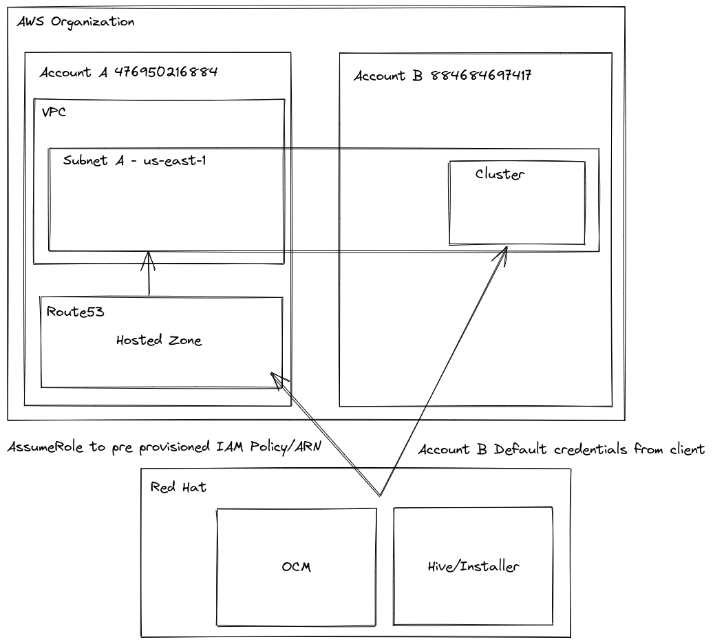

# AWS Shared VPC with Cross-account DNS Zones

## Summary

AWS [VPC sharing](https://docs.aws.amazon.com/vpc/latest/userguide/vpc-sharing.html) allows a VPC
to be shared between multiple accounts. Accordingly, it is possible to configure a DNS private hosted
zone in one account (Account A) while cluster resources are installed in a different
account (Account B). This enhancement enables OpenShift installation with this cross-account shared-VPC
architecture by providing a solution to handle authentication to the private-hosted-zone account. 

## Motivation

Organizations utilize AWS shared VPCs to enable some degree of resource sharing with participants while
maintaining administrative privileges over others. Enabling users to install OpenShift with a private
hosted zone from a separate account allows DNS resolution for the cluster on the shared network while
maintaining the least-privilege security principle. An alternative solution would be for the OpenShift
Installer to create a private hosted zone and attach the zone to the shared VPC. Instead, organizations
can limit the required permissions and maintain greater administrative control by pre-creating a hosted
zone and a role with limited permissions in that secondary account.

### User Stories

* As an OpenShift cluster admin, I want to be able to install my cluster using a private
hosted zone from a secondary AWS account so that I can utilize a shared-VPC architecture
where administrators limit DNS privileges to a specific zone on the shared network.

### Goals

Users should be able to install to an AWS Shared VPC, with the installer and cluster managing DNS records
in an existing private hosted zone, which belongs to a different AWS account than the rest of the cluster resources.

### Non-Goals

* Modifying public DNS zones from separate accounts is not the goal here. This should
already be possible by delegating public DNS zones.

## Proposal

Cluster admins should create an IAM role in the Account owning the private hosted zone (Account A),
and pass the role ARN in the install config. The presence of this roleARN
indicates to the installer/cluster that the private hosted zone belongs to a different
account, and that the specified role should be assumed when performing operations on
the hosted zone.




### Workflow Description

**cluster creator** is a human user who has been granted **Account B IAM User**

**shared vpc admin** is a human user with super-user-like privileges across multiple accounts.

1. **shared vpc admin** shares a VPC with Account B.
2. **shared vpc admin** creates a private hosted zone in Account A and associates it with the shared VPC.
3. **shared vpc admin** creates an [IAM policy in Account A granting route53 and tagging permissions to
the private hosted zone](#iam-policies-and-roles)
4. **shared vpc admin** creates an IAM role in Account A with a [Trust Policy granting Account B IAM User to assume it](#iam-policies-and-roles), and attach the custom IAM policy created on step 3.
5. **cluster creator** specifies the role from step 4 and subnets from step 1 in the install config.
6. **cluster creator** installs the cluster.


### API Extensions


### API: DNS

This enhancement extends the `DNSSpec` to include a platform union, which would contain a field for the role in the AWS platform: `dns.platform.aws.privateZoneIAMRole`. 
The platform union is modeled after the [`IngressPlatformSpec`](https://github.com/openshift/api/blob/7313280c2886773591481e6bc5e7b0c9335b8086/config/v1/types_ingress.go#L102):


```go
	// platform holds configuration specific to the underlying
	// infrastructure provider for DNS.
	// When omitted, this means the user has no opinion and the platform is left
	// to choose reasonable defaults. These defaults are subject to change over time.
	// +openshift:enable:FeatureSets=CustomNoUpgrade;TechPreviewNoUpgrade
	// +optional
	Platform DNSPlatformSpec `json:"platform,omitempty"`
```

```go
// DNSPlatformSpec holds cloud-provider-specific configuration
// for DNS administration.
// +union
// +kubebuilder:validation:XValidation:rule="has(self.type) && self.type == 'AWS' ?  has(self.aws) : !has(self.aws)",message="aws configuration is required when platform is AWS, and forbidden otherwise"
type DNSPlatformSpec struct {
	// type is the underlying infrastructure provider for the cluster.
	// Allowed values: "", "AWS".
	//
	// Individual components may not support all platforms,
	// and must handle unrecognized platforms with best-effort defaults.
	//
	// +unionDiscriminator
	// +kubebuilder:validation:Required
	// +kubebuilder:validation:XValidation:rule="self in ['','AWS']",message="allowed values are '' and 'AWS'"
	Type PlatformType `json:"type"`

	// aws contains DNS configuration specific to the Amazon Web Services cloud provider.
	// +optional
	AWS *AWSDNSSpec `json:"aws"`
}
}

// AWSDNSSpec contains DNS configuration specific to the Amazon Web Services cloud provider.
type AWSDNSSpec struct {
	// privateZoneIAMRole contains the ARN of an IAM role that should be assumed when performing
	// operations on the cluster's private hosted zone specified in the cluster DNS config.
	// When left empty, no role should be assumed.
	// +kubebuilder:validation:Pattern:=`^arn:(aws|aws-cn|aws-us-gov):iam::[0-9]{12}:role\/.*$`
	// +optional
	PrivateZoneIAMRole string `json:"privateZoneIAMRole"`
}

```

#### Install Config

`platform.aws.hostedZoneRole` would be added to complement the existing `platform.aws.hostedZone` field.

An example of `platform` from `install-config.yaml`, specifying subnets of the shared VPC,
a hosted zone ID, and a role to assume:

```yaml
platform:
  aws:
    region: us-east-2
    subnets:
    - subnet-0ef71407239a73558
    - subnet-00e576c91f8578661
    - subnet-041af6e1bbf29c2ef
    - subnet-037ab7dc0cd396721
    - subnet-0adda52a1007fc74f
    - subnet-09bd88678851acab6
    hostedZone: Z00147933I3NWOQ6M4699
    hostedZoneRole: arn:aws:iam::<account-a>:role/<role-name>
```

### Implementation Details/Notes/Constraints [optional]

 With the implementation of this API, the installer and cluster components should follow a
 relatively straightforward pattern: if the role field is not empty,
 call [`AssumeRole`](https://docs.aws.amazon.com/sdk-for-go/api/aws/credentials/stscreds/)
 when performing operations on the private hosted zone.

#### IAM Policies and Roles

When creating the role in account A, the role should be created with a permissions policy to give access to the
appropriate resource and a trust policy to allow access from a second account.

An example IAM Permissions Policy, which grants permissions to the private hosted zone:

```json
{
    "Version": "2012-10-17",
    "Statement": [
        {
            "Effect": "Allow",
            "Action": [
                "route53:GetHostedZone",
                "route53:ChangeResourceRecordSets",
                "route53:ChangeTagsForResource"
            ],
            "Resource": [
                "arn:aws:route53:::hostedzone/Z00147933I3NWOQ6M4699"
            ]
        }
    ]
}
```

An example IAM Trust Policy:

```json
{
    "Version": "2012-10-17",
    "Statement": [
        {
            "Effect": "Allow",
            "Principal": {
                "AWS": "arn:aws:iam::[ID for Account B]:user/<user name for cluster creator>"
            },
            "Action": "sts:AssumeRole",
            "Condition": {}
        }
    ]
} 

```

### Risks and Mitigations

Add-on operators needing permissions will not work unless updated to use the role ARN. The following add-on operators
have been addressed:
- ExternalDNS Operator (see [ExternalDNS Operator AWS Assume Role](/enhancements/dns/externaldns-operator-aws-assume-role.md))

### Drawbacks

Up to this point, DNS config has been platform agnostic. There are no obvious drawbacks to introducing
platform dependencies in this config, but it should be carefully considered.

## Design Details

### Open Questions [optional]

n/a

### Test Plan

An e2e test will be setup which utilizes both AWS CI accounts.

### Graduation Criteria

This functionality is targeted for 4.14 GA and for backporting to previous releases.

#### Dev Preview -> Tech Preview

Behind `PrivateHostedZoneAWS` feature gate. 

#### Tech Preview -> GA

- E2E CI coverage with satisfactory quality signal is needed to lift feature gate.
- User facing documentation created in [openshift-docs](https://github.com/openshift/openshift-docs/)

#### Removing a deprecated feature

n/a

### Upgrade / Downgrade Strategy

TODO: there should be minimal impact here.

### Version Skew Strategy

n/a

### Operational Aspects of API Extensions

n/a

#### Failure Modes

- Installation will fail if there are any issues with role during install.
- If there are issues with the role during day-2 operations, the Cluster Ingress Operator will not
be able to create DNS records and should log appropriate error messages.

#### Support Procedures

TODO

## Implementation History

Major milestones in the life cycle of a proposal should be tracked in `Implementation
History`.

## Alternatives

Instead of passing the role ARN in the API, it is possible to pass the role ARN as a named
profile directly in the AWS creds. The implementation suggested in this enhancement is
preferred as it allows users to declare intent of a cross account install,
rather than OpenShift trying to infer that from the credentials.

### External ID

We considered supporting configuration of an [external ID](https://docs.aws.amazon.com/IAM/latest/UserGuide/id_roles_create_for-user_externalid.html)
for the Ingress Operator when using an assumed role. AWS suggests the use of an external ID in specific scenarios to
mitigate privilege escalation such as the [confused deputy problem](https://en.wikipedia.org/wiki/Confused_deputy_problem).
However, for this effort, we opted not to include this functionality at the moment. The reason behind this decision is
that it would become necessary to incorporate support for external ID throughout all the components that enable shared
VPC (including API, Install, and Ingress Operator), and there hasn't been a specific customer need for it thus far.

### API: Infrastructure 

A `privateHostedZoneRole` field containing the role ARN would be added to `AWSPlatformStatus` in the [cluster infrastructure object](https://github.com/openshift/api/blob/894b49f57a15cbce3869961e20cd9d52df6f8b0f/config/v1/types_infrastructure.go#L424).

#### OpenShift API

```go
type AWSPlatformStatus struct {
	// ...existing fields...

  // privateHostedZoneRole contains the ARN of a role that should be assumed when performing
  // operations on the cluster's private hosted zone specified in the cluster DNS config.
  // When left empty, no role should be assumed.
  // +kubebuilder:validation:Pattern:=`^arn:(aws|aws-cn|aws-us-gov):iam:[a-z0-9-]+:[0-9]{12}:role\/.*$`
  // +optional
  PrivateHostedZoneRole string `json:"privateHostedZoneRole, omitempty"`
}
```

## Infrastructure Needed [optional]

All development and testing of this functionality will require access to two separate AWS accounts.