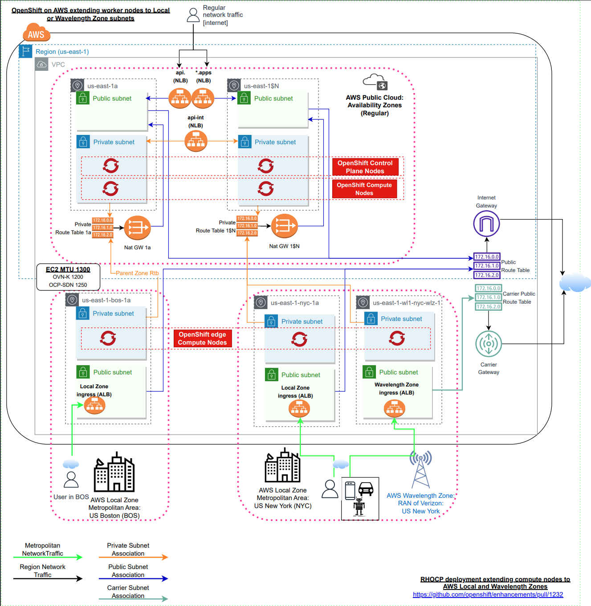

# Allow Customer-Provisioned edge compute pool for AWS Local Zones

## Summary

Edge adoption is increasing and providers are launching many offerings that fill
that area. AWS launched the [Local Zones](https://aws.amazon.com/about-aws/global-infrastructure/localzones/)
and the [Wavelength](https://aws.amazon.com/wavelength/features/) zones to extend the
VPC network to the metropolitan area from big centers, and for Radio Access Network,
respectively, to allow application developers to deliver low-latency applications
at scale to the end users.

As the resources in that locations were designed for specific workloads, and
also have limited and more expensive cloud services, cluster operators should be
able to create worker nodes on the edge networks on day zero operations.

This enhancement proposes a new compute pool named `edge`, which will create
Machine Sets for each availability zone on the AWS Local Zones to provision compute
resources with `NoSchedule` taint.

The EP is divided into three phases:

- Phase 0: Research. Understand the Local Zones using the OKD/OCP, create a use case, and
  provides the documentation of the installation of a cluster in an existing VPC.
- Phase 1: Install a cluster in user provided network introducing to the installer a new
  compute pool named `edge`. The MachineSet manifests will be created for each subnet
  provided on `platform.aws.subnets` for Local Zones. The Machine will be protected with
  taints to avoid running the normal platform workloads.
- Phase 2: The installer should automate the network resource creation when the user
  provides zone names with the type `local-zone` on the 
  `compute[?name=="edge"].platform.aws.zones`.

Phases 1 and 2 are covered by this enhancement.



## Motivation

OCP Install Support for AWS Local Zones will address Customer Segments where low latency and
data locality requirements enforce as deal breakers/show-stoppers for the sales teams' engagements.

The resources on Local Zones were designed for applications delivering low latency to
the end-users, in general, hosted in the data plane nodes. Furthermore, the price of
cloud services is more expensive, and the services are limited. Finally, mixing the
ingress router backends from different locations in the Local Zones can impact
drastically, and directly, the end users' experience (ex: routing requests from users
from NYC to node hosted in Local Zones in Miami, instead of New York node).

As the applications using edge locations are very specific workloads, cluster admins
want to have available the compute nodes on the board without mixing cluster components
on those pools, and would like to specify which workloads will run for each location to
optimize the cloud resources. For that reason, the nodes on the edge pool have taints to
`NoSchedule`.

The installer supports day 2 operation in Local Zone subnets following these conditions:

- the VPC must have enough free CIDR blocks to create subnets in Local Zones
- the Local Zones group must be activated manually
- the subnets must be created manually
- the subnet must be associated with a route table
- the instance type offers must be checked, and the type is chosen for each Local Zone
- the MachineSets manifests must be created manually for each zone Local
- preferably, the node should not receive regular cluster workloads, mainly ingress. due the
  unsupported network load balancers, latency, and costs.

Presently, the installer does not support Local Zones subnets on day zero operations
for those reasons:

- the Local Zones do not support network load balancers (NLB or CLB), used by
  ingress deployed on the `worker` pool.
- the Local Zones do not support Nat Gateway, used as a gateway on the default IPI
  deployment for each subnet and availability zone.
- the default instance type for compute nodes used on IPI, `m6i.xlarge`, is not
  available on Local Zones
- the default EBS type for IPI, `gp3`, is not available in the most Local Zones locations
- segment the `worker` compute node pool is not allowed


### User Stories

Phase 1:

- As a cluster admin, I want the ability to specify a set of subnets on the AWS
  Local Zones locations to deploy worker nodes, so I can create custom applications
  to deliver low latency to my end users.

- As a cluster admin, I would like to create a cluster extending worker nodes to the
  edge of the AWS cloud provider with Local Zones, so I can create custom applications
  to deliver low latency to my end users.

- As a cluster admin, I would like to control the workloads running on the edge
  compute pool, and keep it dedicated to applications that are latency sensitive,
  so I can have a cost-effective infrastructure, avoiding mixing workloads in different locations.

- As a cluster admin, I would like to select existing subnets from the local and
  the parent region zones, to install a cluster, so I can manage my custom networks with
  my automation.

- As a developer of VR/AR apps, I would like to use the power of Cloud GPU instances to process
  images closest to my users, so I can deliver real-time experience.

- As an autonomous application running in an embedded machine, I would like to process the data collected from many
  sensors and cameras on the Edge of the Cloud with real-time decision-making to my production line.

Phase 2:

- As a cluster admin, I would like to install OpenShift clusters, extending the
  compute nodes to the Local Zones in my day-zero operations without needing to
  set up the network and compute dependencies, so I can speed up the edge adoption
  in my organization using OKD/OCP.

### Goals

Phase 1: Install a cluster in existing VPC with Local Zone subnets

- Provide CloudFormation Template to create AWS Local Zone subnets.
- Introduce compute pool named `edge` on installer for AWS Local Zone workloads.
- Ensure the `edge` compute pool can be customized on `install-config.yaml`.
- Select/classify AWS Local Zone subnets to `edge` compute pool when installing a cluster in existing VPC.
- Ensure the MachineSet manifests for `edge` compute pool have `NoSchedule` taints.
- Ensure Local Zones subnets will not be used on `worker` compute pools or control planes.
- Ensure the Wavelength zone will not be used in any compute pool.

Phase 2: Install a cluster creating subnets in AWS Local Zones

- Use `edge` compute pool capabilities introduced in Phase 1 to allow users to provide
  Local Zone names
- Ensure the installer creates network resources (subnets and route table association), based on
  the Local Zones defined on the `edge` compute pool.

### Non-Goals

All phases:

- Allow multiple compute pools for `edge` on `install-config.yaml`
- Create Load Balancers or manifests for ingress in Local Zones
- Create any resource (subnet, carrier gateway, or route tables) for Wavelength Zones
- Day 2 support for AWS Local Zone

Phase 1:

- Create subnets in Local Zone.
- Support private subnets in Local Zone

Phase 2:

- Create Machine set manifests for nodes in public subnets of Local Zones
- Create a dedicated route table for private subnets in Local Zones

## Proposal

The phases proposed in this enhancement are:

- Phase 1: Introduce the `edge` compute pool restricted to AWS Local Zones. Allow
  users to install a cluster in existing networks with Local Zone subnets.
- Phase 2: Create the network resources for AWS Local Zones locations.

### Phase 1: Introduce the "edge" compute pool

The first phase will introduce the new compute pool designed to
be used exclusively for the user workloads on the zones not hosted in the
default availability zones within the region, where the cluster is used to
be deployed.

The edge compute pool will be available only when deploying on the AWS platform
with Local Zones. In the future, it can be extended to the AWS Wavelength,
and other cloud providers if needed.

#### Subnet selection for the edge compute pool

The Local Zones subnets must be defined on the `platform.aws.subnets` on install-config.yaml,
alongside the subnets created on the regular zones, following the current flow of the installer
when installing in existing VPC.

The subnet will be classified to be used on the `edge` compute pool on AWS installation
when the [zoneType](https://docs.aws.amazon.com/AWSEC2/latest/APIReference/API_AvailabilityZone.html) attribute for the `AvailabilityZone` has the value of `local-zone`.
The regular zones, `zoneType==availability-zone`, will keep the same flow used on the `worker`
and control plane pool: installer lookup all the regular zones on the list of subnet-IDs
provided on `platform.aws.subnets`.

Currently, Local Zones does not support network load balancers (NLB or CLB) and Nat Gateways.
Due to the network limitations of AWS Local Zones, the installer requires that the subnet created on
Local Zones must be attached to the public route table.

#### Instance type

Currently, the logic to choose the instance type will check the preferred instance type
across the zones available to create the nodes (control plane and workers), querying the
API [DescribeInstanceTypeOfferings](https://docs.aws.amazon.com/AWSEC2/latest/APIReference/API_DescribeInstanceTypeOfferings.html).

The [instance type offerings](https://aws.amazon.com/ec2/pricing/on-demand/) on
Local Zones are different than the regular zones (see [exported instance offerings matrix on US Local Zones](https://gist.github.com/mtulio/c98aa15128a7becb06a372f00d824c42)).
For that reason, the installer will lookup the offering for each local zone along
the [preferred types](https://github.com/openshift/installer/blob/master/pkg/types/aws/defaults/platform.go#L38) when
creating the MachineSets manifests for the `edge` pools. To cover all Local Zones
location offerings, the types `r5.xlarge`, `c5.2xlarge`, `m5.2xlarge`, `c5d.2xlarge` will be
appended to the [preferred list](https://github.com/mtulio/installer/blob/2e18401e10feb76d4ec25b6088253a4952049614/pkg/types/aws/defaults/platform.go#L63-L71).
With that strategy, all the current GA locations will be covered with supported instance
types, and when the most recent instances (currently 6th-gen `m6i.xlarge`) will be
offered on those locations, it will be selected automatically without needing to
change the installer.

The logic of the preferred instance type will be replaced for the `edge` pool when
the user provides the instance type on the install-config, attribute `compute[name=edge].platform.aws.type`.

#### Volume type

The EBS Volume Type `gp3`, used by default on IPI, is not broadly available
across all GA Local Zones locations. [The Local Zones Features page](https://aws.amazon.com/about-aws/global-infrastructure/localzones/features) is the current place to check which location supports `gp3`.

AWS also does not provide an API to query the zone offering for EBS flavors. The EBS
volume type for Local Zones, `edge` compute pool, will be fixed to `gp2`.

The EBS Volume Type can be changed on the `edge` compute pool option
`compute[name=edge].platform.aws.rootVolume.type` on the `install-config.yaml`.

If the user workload requires a Physical Volume, the `storageClass` can be set to `gp2-csi`
on the deployment config.

#### Machine Sets for edge nodes

The installer must generate one MachineSet for each Local Zones location, considering
all the limitations on the Local Zones (instance types, EBS, network, etc).

The MachineSet for the `edge` pool will also set those custom labels:

- `node-role.kubernetes.io/edge=''`: used to `taint` the node, quickly identify in `oc get nodes`, and create affinity rules
- `machine.openshift.io/zone-type=local-zone`: can be used to create workloads across all Local Zones nodes
- `machine.openshift.io/zone-group=<zone_group_name>`: can be used to create workloads in custom Local Zone locations

The MachineSet also must have the taint to `NoSchedule` to the label `node-role.kubernetes.io/edge=''`.
This taint will prevent to schedule of regular cluster workloads (router, logging, monitoring)
into distant geo-locations (Local Zones), allowing more control to the user to
choose the workloads running for `edge` location, and also more control of the costs.

#### Cluster Network MTU

The Maximum Transmission Unit (MTU) for the Cluster Network will be changed depending on the network
plugin used during the installation.

The MTU for AWS Local Zones differ when needing to communicate between different targets, from the [AWS Documentation](https://docs.aws.amazon.com/local-zones/latest/ug/how-local-zones-work.html):

*Generally, the Maximum Transmission Unit (MTU) is as follows:*

- *9001 bytes between Amazon EC2 instances in the same Local Zone.*
- *1500 bytes between internet gateway and a Local Zone.*
- *1468 bytes between AWS Direct Connect and a Local Zone.*
- *1300 bytes between an Amazon EC2 instance in a Local Zone and an Amazon EC2 instance in the Region.*

The default MTU for the Cluster Network when deploying OpenShift on AWS is:

- 8901 when using `OVN-Kubernetes` plugin
- 8951 when using `OpenShift SDN` plugin

According to the AWS Documentation, the following MTU must be set for each plugin:

- 1200 for `OVN-Kubernetes` plugin
- 1350 for `OpenShift SDN` plugin

The installer will create the manifest file `manifests/cluster-network-03-config.yml` with the
MTU depends on the plugin chosen on the `install-config.yaml`.

Example of the manifest for OVN-Kubernetes:

```yaml
apiVersion: operator.openshift.io/v1
kind: Network
metadata:
  name: cluster
spec:
  defaultNetwork:
    ovnKubernetesConfig:
      mtu: 1200
```

References:

- https://issues.redhat.com/browse/OSD-14980
- https://issues.redhat.com/browse/OHSS-18215
- https://issues.redhat.com/browse/OCPBUGS-3910
- https://issues.redhat.com/browse/OCPBU-303
- https://issues.redhat.com/browse/SDN-3857

#### Additional IAM permissions

In addition to the resources and permissions required by the regular IPI deployment, the user must have permission to [ModifyAvailabilityZoneGroup](https://docs.aws.amazon.com/AWSEC2/latest/APIReference/API_ModifyAvailabilityZoneGroup.html).

The permission `ec2:ModifyAvailabilityZoneGroup` must be allowed on the IAM policies attached to the entity (User or IAM Role) used by the agent running the openshift-installer.

#### General considerations

The following items must be satisfied in this phase:

- the installer must allow one item of compute pool type `edge` (`compute[?name=="edge"]`)

- the installer must extract Local Zone subnets from the subnet IDs
  on `platform.aws.subnets`, creating one MachineSet manifest for each zone.

- the `compute[?name=="edge"]` must create MachineSets manifests on Local Zone
  subnets with:
  - labels: `node-role.kubernetes.io/edge=''`, `machine.openshift.io/zone-type=local-zone`, and
    `machine.openshift.io/zone-group=zone_group_name`;
  - taint `NoSchedule` matching the label `node-role.kubernetes.io/edge`

- the MachineSet should be created when any Local Zones subnet is added on
  `platform.aws.subnets`, even if the compute pool was not defined on `compute[?name=="edge"]`.
  That behavior is aligned with the same installer flow of `worker` compute pool when
  installing a cluster in existing network/VPC: subnet(s) created in the zone type
  `availability-zone` is provided.

- only `public` subnets are allowed for Local Zones subnets ID added on `platform.aws.subnets`
- the Local Zones type should not be allowed on the `worker` compute pool
  `compute[?name=="worker"].platform.aws.zones`.

- the default or user-provided (`compute[?name=="edge"].platform.aws.type` or
  `platform.aws.defaultMachinePlatform.type`) instance type for the machine
  pool `compute[?name=="edge"]` should be validated on the EC2 offering for the
  target availability zone

- the default `edge` compute pool instance type must be common in the Local Zone group,
  provided by the AWS API [EC2 Instance Offerings](https://docs.aws.amazon.com/AWSEC2/latest/APIReference/API_DescribeInstanceTypeOfferings.html).

- the default `edge` compute pool EBS type must be common in the Local zone.
  The default EBS type for the nodes on the `edge` pool will be `gp2`.

#### Examples of configuration for user-provided network

Those are two examples of a user-provided network when installing a cluster
in existing VPC:

1) `install-config.yaml` with Local Zones subnets, and empty `edge` compute pool

```yaml
apiVersion: v1
baseDomain: example.com
metadata:
  name: edge-cluster
platform:
  aws:
    region: us-east-1
    subnets:
    - subnetID-us-east-1a
    - subnetID-us-east-1b
    - subnetID-us-east-1c
    - subnetID-us-east-1-nyc-1a
pullSecret: '{"auths": ...}'
sshKey: ssh-ed25519 AAAA...
```

2) `install-config.yaml` with Local Zone subnets, and custom instance type (`c5d.2xlarge`)

```yaml
apiVersion: v1
baseDomain: example.com
metadata:
  name: edge-cluster
compute:
- name: edge
  platform:
    aws:
      type: c5d.2xlarge
platform:
  aws:
    region: us-east-1
    subnets:
    - subnetID-us-east-1a
    - subnetID-us-east-1b
    - subnetID-us-east-1c
    - subnetID-us-east-1-nyc-1a
    - subnetID-us-east-1-mia-1a
pullSecret: '{"auths": ...}'
sshKey: ssh-ed25519 AAAA...
```

3) `install-config.yaml` with Local Zones subnets, and custom volume type (`gp3`)

```yaml
apiVersion: v1
baseDomain: example.com
metadata:
  name: edge-cluster
compute:
- name: edge
  platform:
    aws:
      rootVolume:
        type: gp3
platform:
  aws:
    region: us-west-2
    subnets:
    - subnetID-us-west-2a
    - subnetID-us-west-2b
    - subnetID-us-west-2c
    - subnetID-us-west-2-lax-1a
    - subnetID-us-west-2-lax-1b
pullSecret: '{"auths": ...}'
sshKey: ssh-ed25519 AAAA...
```

The `install-config.yaml` exemplified above will generate one MachineSet
by subnet ID on the install directory `<install-dir>/openshift/`:

```yaml
apiVersion: machine.openshift.io/v1beta1
kind: MachineSet
metadata:
  labels:
    machine.openshift.io/cluster-api-cluster: ${CLUSTER_ID}
  name: ${CLUSTER_ID}-edge-us-east-1-nyc-1a  (1)
  namespace: openshift-machine-api
spec:
  replicas: 1
  selector:
    matchLabels:
      machine.openshift.io/cluster-api-cluster: ${CLUSTER_ID}
      machine.openshift.io/cluster-api-machineset: ${CLUSTER_ID}-edge-us-east-1-nyc-1a (1)
  template:
    metadata:
      labels:
        machine.openshift.io/cluster-api-cluster: ${CLUSTER_ID}
        machine.openshift.io/cluster-api-machine-role: edge  (2)
        machine.openshift.io/cluster-api-machine-type: edge  (2)
        machine.openshift.io/cluster-api-machineset: ${CLUSTER_ID}-edge-us-east-1-nyc-1a
    spec:
      metadata:
        labels:
          machine.openshift.io/zone-type: local-zone (3)
          machine.openshift.io/zone-group: us-east-1-nyc-1 (4)
          node-role.kubernetes.io/edge: "" (5)
      taints: (5)
        - key: node-role.kubernetes.io/edge
          effect: NoSchedule
      providerSpec:
        value:
          ami:
            id: ${AMI_ID}
          apiVersion: amachine.openshift.io/v1beta1
          blockDevices:
          - ebs: (6)
              volumeSize: 120
              volumeType: gp2
          credentialsSecret:
            name: aws-cloud-credentials
          deviceIndex: 0
          iamInstanceProfile:
            id: ${CLUSTER_ID}-worker-profile
          instanceType: c5d.2xlarge
          kind: AWSMachineProviderConfig
          placement:
            availabilityZone: us-east-1-nyc-1a (7)
            region: us-east-1
          securityGroups:
          - filters:
            - name: tag:Name
              values:
              - ${CLUSTER_ID}-worker-sg
          subnet:
            id: subnetID-us-east-1-nyc-1a (8)
          publicIp: true  (9)
          tags:
          - name: kubernetes.io/cluster/${CLUSTER_ID}
            value: owned
          userDataSecret:
            name: worker-user-data
```

- 1: The `worker` part of the MachineSet name will be replaced with `edge`.
- 2: MachineSet labels for the `edge` compute nodes.
- 3: The label `machine.openshift.io/zone-type` is the type of the availability zones. The [API attribute](https://docs.aws.amazon.com/AWSEC2/latest/APIReference/API_AvailabilityZone.html) is `ZoneType`.
- 4: The label `machine.openshift.io/zone-group` is the group to which the availability zone belongs. The [API attribute](https://docs.aws.amazon.com/AWSEC2/latest/APIReference/API_AvailabilityZone.html) attribute is `NetworkBorderGroup`.
- 5: The `NoSchedule` taint will be added for each node with the
  tag `node-role.kubernetes.io/edge=''`.
- 6: Local Zones have limited resource types. Currently, only `gp2` EBS type
  is supported for most locations. (IPI default is gp3).
- 7: The `placement.availabilityZone` is the availability zone name for Local Zones.
- 8: The `subnet.id` should be selected from the `install-config.yaml`
  parameter `platform.aws.subnets`.
- 9: The `PublicIP` should be `true` for Local Zones as it does not
  support Nat Gateways.

### Phase 2: Network resources automation in Local Zones

In the second phase of the implementation, the installer must create the network
subnets to deploy edge compute pools on the AWS Local Zones.

The following items must be satisfied in this phase:

- the installer must check if the zone group has been opted-in for each zone specified
  in the configuration `compute[?name=="edge"].platform.aws.zones`.

- the installer must discover the preferred instance type based on the API
  [EC2 Instance Offerings](https://docs.aws.amazon.com/AWSEC2/latest/APIReference/API_DescribeInstanceTypeOfferings.html) for each Local Zone provided on the
  configuration, then add it to the asset generator creates the MachineSet manifests
  for each zone.

- the installer must create private subnets on Local Zones for each item provided
  on the configuration `compute[?name=="edge"].platform.aws.zones`, associating
  it to the private route table for the parent zone* when available, otherwise
  the first private route table available will be selected.

> *each Local Zone belongs to a parent zone in the Region and can be discovered
  by the EC2 API [DescribeAvailabilityZones](https://docs.aws.amazon.com/AWSEC2/latest/APIReference/API_DescribeAvailabilityZones.html).

- the machine set manifests for each Local Zones provided in the configuration
  `compute[?name=="edge"].platform.aws.zones`, must expose the label of it's
  parent zone `machine.openshift.io/parent-zone-name: <zone_name>`. This label can be
  used to create affinity rules for workloads in Local Zone and in zones the Region.

- the installer will not create any other resource than subnets in the Local Zones
  using the default IPI deployment.

- the installer must adjust the MTU according to the network plugin. Same steps described on
  Phase I (section "Cluster Network MTU").

- the installer, terraform code, will use the VPC CIDR block to create subnets in Local zones,
  preventing overlap with the regular subnets, also allowing subnet expansion
  (free CIDR blocks) on Day 2.

- on the destroy flow, the installer should delete all resources created
  (compute and network) on the installation stages.

#### Examples of edge compute pool with Local Zone

Example of user-provided `install-config.yaml` to deploy a normal IPI cluster
resources extending the compute pool to the Local Zones location with the network
resources created by the installer.

See the examples of `install-config.yaml` to create an `edge` compute pool:

1) example with one edge compute pool in New York Local Zones location (`us-east-1-nyc-1a`):

```yaml
apiVersion: v1
baseDomain: example.com
metadata:
  name: edge-cluster
compute:
- name: edge
  platform:
    aws:
      zones:
      - us-east-1-nyc-1a
pullSecret: '{"auths": ...}'
sshKey: ssh-ed25519 AAAA...
```

2) example customizing the instance and EBS type

```yaml
apiVersion: v1
baseDomain: example.com
metadata:
  name: edge-cluster
compute:
- name: edge
  platform:
    aws:
      type: m5.xlarge
      rootVolume:
        type: gp3
      zones:
      - us-west-2-lax-1a
      - us-west-2-lax-1b
pullSecret: '{"auths": ...}'
sshKey: ssh-ed25519 AAAA...
```

The following MachineSet will be created from example 1:

```yaml
apiVersion: machine.openshift.io/v1beta1
kind: MachineSet
metadata:
  labels:
    machine.openshift.io/cluster-api-cluster: ${CLUSTER_ID}
  name: ${CLUSTER_ID}-edge-us-east-1-nyc-1a
  namespace: openshift-machine-api
spec:
  replicas: 1
  selector:
    matchLabels:
      machine.openshift.io/cluster-api-cluster: ${CLUSTER_ID}
      machine.openshift.io/cluster-api-machineset: ${CLUSTER_ID}-edge-us-east-1-nyc-1a
  template:
    metadata:
      labels:
        machine.openshift.io/cluster-api-cluster: ${CLUSTER_ID}
        machine.openshift.io/cluster-api-machine-role: edge
        machine.openshift.io/cluster-api-machine-type: edge
        machine.openshift.io/cluster-api-machineset: ${CLUSTER_ID}-edge-us-east-1-nyc-1a
    spec:
      metadata:
        labels:
          machine.openshift.io/parent-zone-name: us-east-1d (1)
          machine.openshift.io/zone-group: us-east-1-nyc-1
          machine.openshift.io/zone-type: local-zone
          node-role.kubernetes.io/edge: ""
      taints:
        - key: node-role.kubernetes.io/edge
          effect: NoSchedule
      providerSpec:
        value:
          ami:
            id: ${AMI_ID}
          apiVersion: amachine.openshift.io/v1beta1
          blockDevices:
          - ebs:
              volumeSize: 120
              volumeType: gp2
          credentialsSecret:
            name: aws-cloud-credentials
          deviceIndex: 0
          iamInstanceProfile:
            id: ${CLUSTER_ID}-worker-profile
          instanceType: c5d.2xlarge
          kind: AWSMachineProviderConfig
          placement:
            availabilityZone: us-east-1-nyc-1a
            region: us-east-1
          securityGroups:
          - filters:
            - name: tag:Name
              values:
              - ${CLUSTER_ID}-worker-sg
          subnet:
          - filters:
            - name: tag:Name
              values:
              - ${CLUSTER_ID}-public-us-east-1-nyc-1a  (2)
          publicIp: true
          tags:
          - name: kubernetes.io/cluster/${CLUSTER_ID}
            value: owned
          userDataSecret:
            name: worker-user-data
```

- 1: The `parent-zone-name` is the zone that the Local Zone is connected in the region.
- 2: The `tag:Name` for the public subnet on the Local Zones location.

The compute resources will be created by the installer:

- 3 control plane nodes on the private subnets in the default Availability Zones (parent region)
- 3 compute worker nodes on the private subnets in the default Availability Zones (parent region)
- 1 compute edge node on the public subnet in the Local Zone

### Workflow Description

#### Phase I: Install a cluster in existing VPC with Local Zone subnets

- User creates the CloudFormation Template for VPC, available on the Documentation,
  then provides the parameters to create the VPC by creating the CloudFormation stack
  using the AWS Console or CLI:

```bash
aws cloudformation create-stack --stack-name ${STACK_VPC} \
     --template-body file://template-vpc.yaml \
     --parameters \
        ParameterKey=ClusterName,ParameterValue=${CLUSTER_NAME} \
        ParameterKey=VpcCidr,ParameterValue="10.0.0.0/16" \
        ParameterKey=AvailabilityZoneCount,ParameterValue=3 \
        ParameterKey=SubnetBits,ParameterValue=12
```

- User opt-in to the Local Zone group using Console or CLI:

```bash
aws ec2 modify-availability-zone-group \
    --group-name "${ZONE_GROUP_NAME}" \
    --opt-in-status opted-in
```

- User creates the CloudFormation Template for Local Zone subnet, available on the Documentation,
  then set the parameters to create the Local Zone subnet by creating the CloudFormation stack
  using the AWS Console or CLI:

```bash
aws cloudformation create-stack --stack-name ${STACK_LZ} \
     --template-body file://template-lz.yaml \
     --parameters \
        ParameterKey=ClusterName,ParameterValue="${CLUSTER_NAME}" \
        ParameterKey=VpcId,ParameterValue="${VPC_ID}" \
        ParameterKey=PublicRouteTableId,ParameterValue="${VPC_RTB_PUB}" \
        ParameterKey=LocalZoneName,ParameterValue="${ZONE_GROUP_NAME}a" \
        ParameterKey=LocalZoneNameShort,ParameterValue="${AZ_SUFFIX}" \
        ParameterKey=PublicSubnetCidr,ParameterValue="10.0.128.0/20"
```

- User waits for the CloudFormation stack creation, then supply the subnet IDs into the
  install-config.yaml:

  - Optionally: customize the edge compute pool, allowed by Local Zone subnets:

```yaml
apiVersion: v1
publish: External
baseDomain: ${BASE_DOMAIN}
metadata:
  name: "${CLUSTER_NAME}"
compute:
- name: edge
  platform:
    aws:
      type: m5.xlarge
platform:
  aws:
    region: ${CLUSTER_REGION}
    subnets:
    - publicSubnetID-1
    - publicSubnetID-2
    - publicSubnetID-3
    - privateSubnetID-1
    - privateSubnetID-2
    - privateSubnetID-3
    - LocalZonePublicSubnetID-1
    - LocalZonePublicSubnetID-2
```

- Create the cluster

```bash
./openshift-install create cluster
```

- The installer:

  - classify subnets, isolating zoneType=local-zone into edge Subnets, collecting the Zone attributes for each one
  - discovers preferred instance types based on the supported list for each edge zone calling the AWS API EC2 Instance Offerings, storing it on the Zone attribute
  - creates the Machine Set for each edge subnet, setting: custom labels (zone-type, zone-group, node-role); set the taints; set the preferred instance type for the zone
  - sets the cluster-network MTU size patching the Network Configuration manifest considering the overhead of the network plugin used on the deployment

#### Phase II: Full IPI automation for AWS Local Zone edge nodes

Install a cluster in extending nodes to Local Zone with full automation: installer
creates network resources needed to launch the node.

Example using Local Zones `us-east-1-atl-1a` and `us-east-1-bos-1a`:

- User opt-in to the Local Zone group(s) using Console or CLI:

```bash
# opt-in the zone group `us-east-1-atl-1`
aws ec2 modify-availability-zone-group \
    --group-name "us-east-1-atl-1" \
    --opt-in-status opted-in

# opt-in the zone group `us-east-1-bos-1`
aws ec2 modify-availability-zone-group \
    --group-name "us-east-1-bos-1" \
    --opt-in-status opted-in
```

- Create the `install-config.yaml` with Local Zone names on the edge compute pool

```yaml
apiVersion: v1
publish: External
baseDomain: ${BASE_DOMAIN}
metadata:
  name: "${CLUSTER_NAME}"
compute:
- name: edge
  platform:
    aws:
      zones:
      - us-east-1-atl-1a
      - us-east-1-bos-1a
```

- Create the cluster

```bash
./openshift-install create cluster
```

- The installer:

  - validates if each zone item on the `edge` compute pool matches the attribute `ZoneType` equals of `local-zone`, collecting the zone attributes;
  - discovers the preferred instance type for the zone based on the installer-supported list for each Local Zone calling the AWS API [EC2 Instance Offerings](https://docs.aws.amazon.com/AWSEC2/latest/APIReference/API_DescribeInstanceTypeOfferings.html), storing it on the zone attribute;
  - creates the MachineSet manifest for each `edge` zone, creating the attributes:
    - custom labels (zone-type, zone-group, node-role, parent-zone-name);
    - set the taint `NoSchedule` for the label `node-role`;
    - set the instance type for the preferred in the zone
  - sets the cluster-network MTU size patching the Network Configuration manifest considering the overhead of the network plugin used on the deployment
  - runs the regular install flow

### API Extensions

N/A

### Implementation Details/Notes/Constraints

#### Public subnet and outbound traffic

It is a best practice to place the worker nodes in private subnets, although the
AWS provides limited services in the Local Zones requiring a more complex setup to do so.

Those are some options to create subnets on Local Zones:

1) Create a subnet and associate it to a route table with the internet gateway as default.
2) Create a private subnet, associating it to a route table from the zone in the
  parent region. The cost will be twice as the traffic should cross the zone to
  access the internet through a Nat Gateway, which also has fees to be applied.
3) Create a private subnet, and provide access to the node through a proxy. Same costs
  tradeoffs of option 2.

Option 1 is covered by this enhancement to create the MachineSets (phase 1)
and to automate by the installer (phase 2).

The public subnet means the node will receive a Public IP address and the Security
Group must not expose any ports to the internet. This must be the default behavior,
and the security group for the `worker` pool will be used on the `edge` pool.

#### Infrastructure costs

The internal data transfer costs (within the VPC: kubelet<->NLBs) will be the same
of the other (normal workers) nodes[1][2].

> *Data Transfer charges in AWS Local Zones is the same as in the Availability Zones today. Learn more about data transfer prices "in" and "out" of Amazon EC2 here.*

The compute resources in Local Zones are more expensive. For example, `m5.xlarge` hosted
in the region `us-west-2` will cost `$0.192/hr`, and in the LAX (Los Angeles)
Local Zone is `$0.23/hr`, almost 17% more expensive than the regular zone.

When following the architecture of using private subnets in Local Zones re-using Nat Gateway
from the parent region (proposal #2 in the last section), considering NAT Gateway
currently is not supported on the Local Zones locations, the following fees will be
applied when the node needs access to the internet:

- Fee for data transferred "in" to and "out" from NAT GW located in the parent zone (`$0.01/GB` for each direction)
- NAT GW fee per GB processed `$0.045`

There is another cost of `$0.045/hr` for NAT GW allocation, which is not exclusive to a node in
Local Zones as the Nat Gateway is already created to be used in a regular zone.

When the node is in the public subnet (described in this EP), the fees applied will be the same to access the internet.

The article[3] describes the data transfer fees applied to common architectures, and the AWS Pricing Calculator[4] is a helpful tool to estimate the costs of an architecture.

[1] [EC2 Data transfer fees](https://aws.amazon.com/ec2/pricing/on-demand/)

[2] [EC2 Local Zones Pricing](https://aws.amazon.com/about-aws/global-infrastructure/localzones/pricing/)

[3] [Overview of Data Transfer Costs for Common Architectures](https://aws.amazon.com/blogs/architecture/overview-of-data-transfer-costs-for-common-architectures/)

[4] [AWS Pricing Calculator](https://calculator.aws/#/)

#### User-workload deployments

Application developers must set the tolerations for the application running for each location.

The pod spec example below describes how to deploy one application on the node on the zone group `zoneGroupName`:

```yaml
      nodeSelector:
        machine.openshift.io/zone-group: <zoneGroupName>
      tolerations:
      - key: "node-role.kubernetes.io/edge"
        operator: "Equal"
        value: ""
        effect: "NoSchedule"
```

#### User-workload ingress traffic

To expose the applications to the internet on AWS Local Zones, application developers
must expose their applications using AWS Application Load Balancers (ALB). The
[ALB Operator](https://docs.openshift.com/container-platform/4.11/networking/aws_load_balancer_operator/install-aws-load-balancer-operator.html) is available through OLM on 4.11+.

To explore the best of deploying applications on the edge locations, at least one new
ALB `Ingress` must be provisioned by location to expose the services deployed on the
zones.

If the cluster-admin decides to share the ALB `Ingress` subnets between different locations,
it will impact drastically the latency for the end-users when the traffic is routed to
backends (compute nodes) placed in different zones that the traffic entered by Ingress.

The ALB deployment is not covered by this enhancement.

#### Benchmark results

A simple benchmark was created when Phase 0 (research) has been created - also published
on [this blog](https://dev.to/mtulio/extending-openshift-compute-nodes-to-the-edge-with-aws-local-zones-3ban#uc-benchmark).
The Benchmark creates a regular HA OCP on AWS using IPI, then at Day-2 extends the VPC creating subnets,
route table association and MachineSet for two additional Local Zone locations: Miami and New York.

A sample application is deployed for each location: Regular region, and Local Zones locations in Miami and New York.

An ALB Operator is installed on the cluster, and one ingress (ALB) per location will be created to serve
the requests directly from the network edge.

Finally, clients from different regions of the US East, West, and South America make requests to the targets, measuring
the total times. Here is the summary:

Average in milliseconds:

| Client / Server | Main | NYC | MIA |
| -- | -- | -- | -- |
| BR-SC | 342.6579 | 352.2908 | 299.3756 |
| US-NY | 22.2609 | 16.0002 | 92.5647 |
| US-CA | 149.5462 | 152.1854 | 164.0881 |

Percentage comparing the parent region (negative is slower):

| Client / Server | Main | NYC | MIA |
| -- | -- | -- | -- |
| BR-SC | 0.00% | -2.81% | 12.63% |
| US-NY | 0.00% | 28.12% | -315.82% |
| US-CA | 0.00% | -1.76% | -9.72% |

The difference in `ms` compared to the parent region  (negative is slower):

| Client / Server | Main | NYC | MIA |
| -- | -- | -- | -- |
| BR-SC | 0 | -9.6329 | 43.2823 |
| US-NY | 0 | 6.2607 | -70.3038 |
| US-CA | 0 | -2.6392 | -14.5419 |

Helper:

- `Client`: is the location the client originated the connection (curl)
- Location `BR-SC`: client in South America (Brazil/Santa Catarina)
- Location `US-NY`: client in US East (New York)
- Location `US-CA`: client in US West (California)
- `Server`: is the location of the server running the sample application
- Server `Main`: Any Compute machine running in the Parent region (us-east-1)
- Server `NYC`: OCP Compute Machine running in AWS Local Zone located in New York
- Server `MIA`: OCP Compute Machine running in AWS Local Zone located in Miami

Highlight the time to Connection Time (from a client in NY): The time to connect
to the NYC zone was 3x faster than the parent region, and 10x faster than the
location far from the user:

```text
From NY -> To Parent Region Zone nodes (us-east-1)
      time_connect:  0.009792 Sec
                   ----------
        time_total:  0.022362 Sec

From NY -> To NY node
      time_connect:  0.003788 Sec
                   ----------
        time_total:  0.015983 Sec

From NY -> To Miami node
      time_connect:  0.032383 Sec
                   ----------
        time_total:  0.089729 Sec
```

You can find the raw files [here](https://github.com/mtulio/mtulio.labs/tree/master/labs/go-geo-app/data-benchmark).

<!-- #### Communication Between Instances in different zone groups

> TODO: check if there is any issue, it was mentioned by LZ experts. -->

### Risks and Mitigations

#### VPC CIDR block (Machine Network)

Administrators may want to add new locations on clusters already created by the installer.
Phase-2 automates the creation of subnet(s) on Local Zones on Day-0, the CIDR blocks
will be calculated automatically on the install time. If admins would like to expand
they need to check if there's free CIDR to create subnets in the new locations, create
the subnets and dependencies, then create the MachineSet manually.
If there are no available CIDRs, they need to install a new cluster in existing
subnets, and manage their subnet CIDR blocks, creating the new locations (subnets
and MachineSets) on Day-2.

The total CIDR blocks allocated to the subnet on Local Zones could be underutilized,
avoiding future expansions. This is a risk to the current IPI deployment. A note on the documentation
can be added: "if there is a plan to expand the subnets, the installation in existing VPC
may be better".

To mitigate the lack of free CIDR blocks to expand to new subnets on Day 2 operations, the Phase-2
implementation improves the [terraform logic](https://github.com/openshift/installer/blob/master/data/data/aws/cluster/vpc/vpc.tf#L1-L4) to allow expansion when the cluster is installed
in a single zone.

The examples below share two scenarios:

- Scenario #1: a minimal cluster installed in single-zone [`us-east-1a`] for the control plane and
  regular data plane, and single Local Zone [`us-east-1-bos-1a`] subnet. The Machine CIDR (VPC) used
  is `10.0.0.0/19`. It will result in the installer creating 4 subnets with free CIDR blocks to allow
  day 2 operations, not impacting in the [OpenShift tested `Number of nodes` of 2000](https://docs.openshift.com/container-platform/4.12/scalability_and_performance/planning-your-environment-according-to-object-maximums.html#cluster-maximums-major-releases_object-limits).

| #subnets | Subnet Zone/facing | CIDR Block | IPs | Free CIDR Block(s)* |
| -- | -- | -- | -- | -- |
| 1 | `us-east-1a`/private       | 10.0.0.0/21  | 2046 | 10.0.8.0/21  |
| 1 | `us-east-1a`/public        | 10.0.16.0/22 | 1019 | 10.0.20.0/22 |
| 1 | `us-east-1-bos-1a`/private | 10.0.24.0/23	| 509  | 10.0.26.0/23 |
| 1 | `us-east-1-bos-1a`/public  | 10.0.28.0/23	| 509  | 10.0.30.0/23 |

- Scenario #2: a full cluster, installer creating subnets in all available zones in `us-east-1`.
  It will result in the installer creating 38 subnets covering private and public in 5 Availability
  and 14 Local zones. The Machine CIDR (VPC) used is `10.0.0.0/16`.

| #subnets | Subnet Zone/facing | CIDR Block | IPs | Free CIDR Blocks* |
| -- | -- | -- | -- | -- |
| 5  | `us-east-1{a-f}`/private            | 10.0.0.0/20-10.0.64.0/20    | 4090[each] | 10.0.80-127.0/20  |
| 5  | `us-east-1{a-f}`/public             | 10.0.128.0/21-10.0.160.0/21 | 2041[each] | 10.0.168-191.0/21 |
| 14 | `us-east-1-{local-zone-id}`/private | 10.0.192.0/23-10.0.218.0/23 | 507[each]  | 10.0.220-223.0/23 |
| 14 | `us-east-1-{local-zone-id}`/public  | 10.0.224.0/23-10.0.250.0/23 | 27[each]   | 10.0.252-255.0/23 |

The free CIDR range will be available for Day 2 operations. Note that there is no code/terraform logic
for free blocks when deploying a cluster in a non-single zone, although the subnet calculation can
leave free blocks depending on the total zones available in the region - this is the regular deployment.

#### Instance types

New Local Zones locations can be created without any type on the preferred list, then the MachineSet
manifest generated will be created with an unsupported instance type, generating in `Failed`
instance. We can keep the list of regions and locations tested on the Documentation, so we can
provide better feedback on what is currently supported.

### Drawbacks

- Customers would prefer to deploy only on Day 2, or in existing VPC creating their MachineSets

## Design Details

### Open Questions

1. Is there any situation to avoid the `NoSchedule` compute pool for edge workloads?

    A: [Thread](https://github.com/openshift/enhancements/pull/1232#discussion_r1045918478). The consensus is that the taint/tolerations are the best approach considering the Local Zone characteristics.

Phase 2:

2. Q: The Local Zones currently have limitations of Nat Gateways, which keep the gateway
  strategy more complex to provide egress traffic for compute nodes deployed on
  that zone. Can we keep the edge nodes in the public subnet?

    A. Answer: Each Local Zone is attached to one Availability Zone in the Region,
    it could decrease, inter-zone communication. To keep compatibility with
    regular installations (public and private subnets), the installer can create public
    and private subnets in Local Zones, as regular zones, then associate the private subnet to the
    route table of the Local Zone Parent's Zone, when it exists, otherwise the first
    [index on terraform] route table can be used.

3. Do we need to create a dedicated security group instead of using/sharing with the default worker
  compute pool?

4. Q: How to can keep extending the Zones for eventually new locations? AWS has dynamic,
  and growing Local Zones available, when the cluster is created, the installer calculates
  the CIDR blocks for the subnet to cover all IP ranges allowed by Machine CIDR/VPC,
  depending on the number of zones available or define on install-config.yaml. I also wonder
  if we can consider a smaller range of IPs for subnets operating in Local Zones,
  allowing the customer to grow it later. Can we consider using a lower CIDR for
  subnets hosted in Local Zones locations?

    A. Answer: The Phase 2 implementation proposes to address both questions by
    splitting the available CIDR blocks for public and private. The blocks for public
    subnets, generally used for Load Balancers, will be used/split when Local Zone
    subnet should be created, the terraform will split those blocks accordingly depending
    the number of CIDR blocks needed to be created.

5. How we will advise customers to grow locations on Day 2? Can we keep a product
  documentation page with that instructions? A sort of instructions on how to create
  CloudFormation Stack to create a new zone for the new location that is available, or
  the customer wants to support in the future.


### Test Plan

#### Phase 1 test

A periodic job will be created alongside a step to create a subnet in Local Zones using the [UPI CloudFormation templates](https://github.com/openshift/installer/tree/master/upi/aws/cloudformation), reusing the steps to install the cluster in the existing VPC.

Test steps:

- Choose randomly one Local Zone location in the Region
- Opt-in the Zone Group for the selected zone
- Create a VPC in the Region selected by the CI lease pool
- Reuse the chain [`shared-vpc`](ipi-aws-pre-sharednetwork) to create subnets into zones in the Region (Example: `us-east-1b`, `us-east-1c`)
- Create subnets into selected Local zone
- Reuse the step to create the `install-config.yaml` selecting all subnet IDs (regular and local zones)
- Create the cluster
- Run `openshift-e2e-test` step

#### Phase 2 test

A periodic job will be created to create the edge compute pool with Local Zone names on `install-config.yaml`.

Test steps:

- Choose randomly one Local Zone location in the Region
- Opt-in the Zone Group for the selected zone
- Create the `install-config.yaml` adding the `edge` compute pool with Local Zone name
- Create the cluster
- Run `openshift-e2e-test` step

#### E2E test

No custom e2e tests will be added, we'll require regular acceptance tests passing on `openshift-e2e-test` tests.

### Graduation Criteria

This functionality is targeted for:

- Phase-1 4.13 GA
- Phase-2 4.14 GA

#### Dev Preview -> Tech Preview
#### Tech Preview -> GA

N/A.

#### Removing a deprecated feature

N/A

### Upgrade / Downgrade Strategy

N/A. The resource creation, Local Zone subnets, and MachineSets in the edge
compute pool are available only in day zero operations. All the further
lifecycle will be done as a normal machine.

### Version Skew Strategy

N/A. The same as `Upgrade / Downgrade Strategy`.

### Operational Aspects of API Extensions

N/A.

#### Failure Modes

N/A.

#### Support Procedures

N/A.

## Implementation History

Currently, a few research documents were created to understand how the Local Zone networks
of AWS can be used on OKD/OpenShift, most of them were focused on extending current clusters
using MachineSets when installing a cluster in existing networks.

The first research was focused on Day-2 operations: how to extend current IPI deployment
to Local Zones subnets, and how to use the workloads on it. The further research was documented
on [SPLAT-635](https://issues.redhat.com/browse/SPLAT-635) designed as Phase 0 of this EP.

It was identified improvements on Day-0 to prevent the OpenShift Ingress failure on install time as
it supports only network load balancers (NLB/CLB), which are not supported on Local Zones.
The controller bug track is [OCPBUGSM-46513](https://issues.redhat.com/browse/OCPBUGSM-46513).


## Alternatives

- Cluster admins can create subnets and the MachineSet manifest at the day zero operations
  using the installer option `create manifest`, then trigger the cluster creation.

- Cluster admins, can create worker nodes directly to the Local Zones with extra work
  to make sure the cluster infra services (Monitoring, logging, routers) and their
  applications will not mix with edge specifics, like latency, costs, etc


## Infrastructure Needed

- In addition to the resources and permissions required by the regular IPI deployment, the user must have permission to [ModifyAvailabilityZoneGroup](https://docs.aws.amazon.com/AWSEC2/latest/APIReference/API_ModifyAvailabilityZoneGroup.html). IAM Role's policy Action: `ec2:ModifyAvailabilityZoneGroup`.
