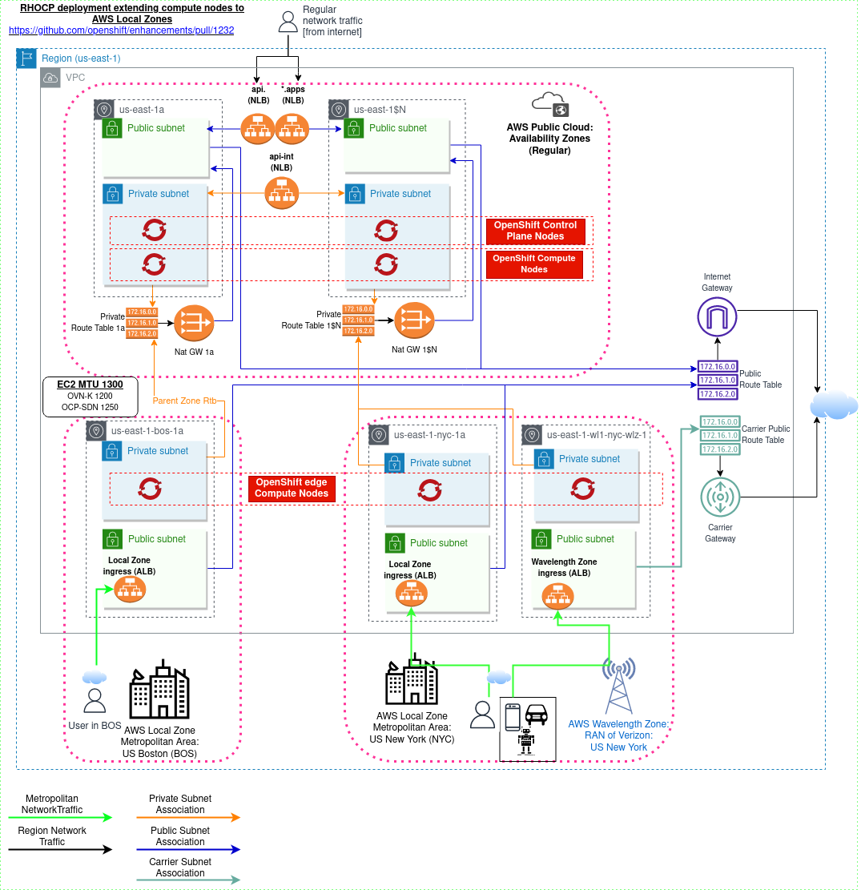

# Allow Customer-Provisioned edge compute pool for AWS Wavelength Zones

## Summary

Create support on installer to install an OpenShift cluster on AWS, extending compute nodes to Wavelength as a target infrastructure.

[AWS Wavelength highlights](https://aws.amazon.com/wavelength/):

- ***AWS Wavelength embeds AWS compute and storage services within 5G networks, providing mobile edge computing infrastructure for developing, deploying, and scaling ultra-low-latency applications.***

- ***AWS Wavelength is an infrastructure offering optimized for mobile edge computing applications.
  Wavelength Zones are AWS infrastructure deployments that embed AWS compute and storage services within communications service providers’
  (CSP) 5G networks, so application traffic from 5G devices reach application servers running in Wavelength Zones without leaving the
  telecommunications network. This avoids the latency that would result from application traffic traversing multiple hops across the
  internet to reach its destination, which allows customers to take full advantage of the latency and bandwidth benefits offered by
  modern 5G networks.***

The enhancement covers the following goals:

- Goal 1: Full automation of installing an OpenShift/OKD cluster on AWS extending worker nodes to Wavelength Zone
- Goal 2: Installing an OpenShift/OKD cluster on AWS in existing VPC extending worker nodes to Wavelength Zone
- Goal 3: Document the steps to extend worker nodes to Wavelength Zones in existing OpenShift/OKD clusters running on AWS
- Goal 4: Provide support on MAPI Provider AWS of Carrier IP Address assignment when launching EC2 instances in public subnets in Wavelength Zone

The project is divided into the following phases to achieve the full feature:

- Phase 1: Installer support to provision required infrastructure components to deploy worker nodes in Wavelength Zones. Goals 1, 2 and 3 are planned to this phase.
- Phase 2: Machine API support to assign carrier public IP address when creating machines in public subnets on Wavelength Zones.  Goals 4 is planned to this phase.

The following architecture describes the components used by OpenShift Cluster on AWS with Wavelength Zones, here are the hightlight of new infrastructure components:

- Carrier Gateway must be created to allow assigning carrier IP address for components in public subnets.
- Public route table with the Carrier Gateway as default route
- EC2 instances running OpenShift compute nodes as edge machines: tainted with NoSchedule and custom labels assigned by default.



## Motivation

Allow customers who want to build applications that deliver ultra-low latencies to mobile devices and end users, to
adopt OpenShift to quickly provision the required infrastructure to deploy worker nodes running in standard AWS compute
and storage services to the edge of telecommunication carriers' 5G networks.

### User Stories

Goal 1:
- As a user, I want to deploy OpenShift compute nodes on AWS Wavelength Zones at install time so I can leverage this infrastructure to deploy edge computing applications.

Goal 2:
- As a user, I want to deploy OpenShift compute nodes on AWS Wavelength Zones in my existing VPC, so I can leverage this infrastructure to deploy edge compute applications.

Goal 3:
- As a user, I want to extend an existing OpenShift cluster on AWS deploying compute nodes on AWS Wavelength Zones so I can leverage this infrastructure to deploy edge computing applications.

Phase 1:
- As a user, I want to deploy OpenShift compute nodes on AWS Wavelength Zones in private subnets, so I can quickly deploy or extend existing OpenShift clusters on AWS to US regions with support of Wavelength Zones, allowing to ingress traffic to the zone through Application Load Balancer.

Phase 2:
- As a user, I want to deploy OpenShift compute nodes on AWS Wavelength Zones in public subnets, so I can quickly deploy or extend existing OpenShift clusters on AWS to any AWS region with the support of Wavelength Zones, allowing to ingress traffic to the zone through the node.
- As a developer, I want to MAPI provider to check the zone type from a subnet when launching the instance type, and assign Carrier Public IP when the zone type is `wavelength-zone`, so the users can take advantage of creating instances in public subnets where Application Load Balancer is not supported to delivery ultra-low latency to 5G devices.


### Goals

#### Goal 1 - Full IPI Support

The Installer will be able to deploy OpenShift on the public region with compute nodes on AWS Wavelength Zones
automating the VPC creation in the public region and the subnet creation in the AWS Wavelength Zone.

- Create support on the installer to accept Wavelength Zones in the edge compute pool
- Create support on the installer to create network resources in Wavelength Zones

#### Goal 2 - IPI Support in existing VPC

Phase 1:

- support the installer to classify the subnet IDs with zone type as 'wavelength-zone' as edge zones, creating machine
  set manifests for each zone/subnet.
- provide CloudFormation Templates to create: 1) Carrier Gateway and public edge route tables; 2) Subnet pairs (public and private)
- Create CloudFormation Templates to create network resources in Wavelength Zones

Limitations:

- Unable to create machine sets in public subnets on Wavelength Zones: unable to automatically assign a public carrier IP address to edge nodes. 

#### Goal 3 - Extend existing clusters to use Wavelength Zones

Phase 1 - Create the 'Day 2' documentation providing guidance on how:

- create the network components using the CloudFormation template created in Goal#2
- adjust the cluster-network MTU
- create a machine set to use the **private** subnet

Similar 'Day 2' documentation is provided for Local Zones available at

Phase 2 -  Update the documentation:

- adjust the documentation specifying that the machine set supports to launch of nodes in public subnets in Wavelength Zones,
  automatically assigning public IP addresses from the carrier network

#### Goal 4 - Deploy Machines in public subnets in Wavelength Zones

Phase 2:

- implement support in the AWS Machine Controller (machine-api-provider-aws) to check the zone type from a given subnet when
  launching the EC2 instance when the option `publicIP` is set to `yes`. When the zone type is `wavelentgh-zone`, a
  Carrier Public IP will be assigned by setting the flag `AssociateCarrierIpAddress`, instead of the regular IP from an Internet Gateway
  with the option `AssociatePublicIpAddress`.

Phase 1 can be delivered without Phase 2 but with limitations of not launching instances in public subnets,
consequently, with limited support of the feature, the user to choose between:

- BYO Load Balancer to ingress traffic to the node (external from OpenShift)
- Wait for Phase 2 to be delivered.

### Non-Goals

All phases:

- Allow multiple compute pools for `edge` on `install-config.yaml`
- Create Load Balancers or manifests for ingress in Wavelength Zones

Phase 1:

- Create machine sets to use public subnets.


## Proposal

### Goal 1: Full IPI Support

- Allow Wavelength Zones be added in the edge compute pool
- Introduce the provisioning of Carrier Gateway in the terraform code of installer

### Goal 2: BYO VPC

- Classify subnet with type `wavelength-zone` as edge subnets
- Create CloudFormation template to provision Carrier Gateway and dependencies (Route table)
- Create CloudFormation template to create subnets in a given public and private subnet

### Goal 3: Migrate existing clusters to use AWS Wavelength Zones

Create documentation explaining how to:
1) set the correct MTU
2) create the Carrier Gateway and public edge route table
3) create the subnets in Wavelength Zone, associating the public to the edge route table

### Goal 4: Implement support of deploying nodes in public subnets in Wavelength zone

Implement support in the AWS Machine Controller (machine-api-provider-aws) to check the zone type from a given subnet when launching the EC2 instance when the option `publicIP` is set to `yes`. When the zone type is `wavelentgh-zone`, a Carrier Public IP will be assigned by setting the flag `AssociateCarrierIpAddress`, instead of the regular IP from an Internet Gateway with the option `AssociatePublicIpAddress`.

Document the steps to create a MachineSet in public subnet.

### Workflow Description

#### Goal 1: Fully automated IPI

- Opt-in the zone group

```bash
aws ec2 modify-availability-zone-group \
    --region us-east-1 \
    --group-name us-east-1-wl1 \
    --opt-in-status opted-in
```

- Create install-config.yaml

```yaml
apiVersion: v1
publish: External
baseDomain: devcluster.openshift.com
metadata:
  name: "cluster-name"
pullSecret: ...
sshKey: ...
platform:
  aws:
    region: us-east-1
compute:
- name: edge
  platform:
    aws:
      zones:
      - us-east-1-wl1-bos-wlz-1
```

- Create cluster

```bash
./openshift-install create cluster
```

- Destroy cluster

```bash
./openshift-install destroy cluster
```

#### Goal 2: Install cluster with BYO VPC, and Wavelength subnets

- Opt-in the zone group

```bash
aws ec2 modify-availability-zone-group \
    --region us-east-1 \
    --group-name us-east-1-wl1 \
    --opt-in-status opted-in
```

- Create VPC

```bash
aws cloudformation create-stack \
  --region ${CLUSTER_REGION} \
  --stack-name ${STACK_VPC} \
  --template-body file://$TEMPLATE_NAME_VPC \
  --parameters \
    ParameterKey=VpcCidr,ParameterValue="${CIDR_VPC}" \
    ParameterKey=AvailabilityZoneCount,ParameterValue=3 \
    ParameterKey=SubnetBits,ParameterValue=12
```

- Create Carrier Gateway

```bash
aws cloudformation create-stack \
  --region ${CLUSTER_REGION} \
  --stack-name ${STACK_CAGW} \
  --template-body file://$TEMPLATE_NAME_CARRIER_GW \
  --parameters \
    ParameterKey=VpcId,ParameterValue="${VPC_ID}" \
    ParameterKey=ClusterName,ParameterValue="${CLUSTER_NAME}"
```

- Create Public and Private Subnets in Wavelength Zones

```bash
aws cloudformation create-stack \
  --region ${CLUSTER_REGION} \
  --stack-name ${STACK_SUBNET} \
  --template-body file://$TEMPLATE_NAME_SUBNET \
  --parameters \
    ParameterKey=VpcId,ParameterValue="${VPC_ID}" \
    ParameterKey=ClusterName,ParameterValue="${CLUSTER_NAME}" \
    ParameterKey=ZoneName,ParameterValue="${AZ_NAME}" \
    ParameterKey=PublicRouteTableId,ParameterValue="${ROUTE_TABLE_PUB}" \
    ParameterKey=PublicSubnetCidr,ParameterValue="${SUBNET_CIDR_PUB}" \
    ParameterKey=PrivateRouteTableId,ParameterValue="${ROUTE_TABLE_PVT}" \
    ParameterKey=PrivateSubnetCidr,ParameterValue="${SUBNET_CIDR_PVT}"
```

- Create install-config.yaml

```yaml
apiVersion: v1
publish: External
baseDomain: devcluster.openshift.com
metadata:
  name: "cluster-name"
pullSecret: ...
sshKey: ...
platform:
  aws:
    region: us-east-1
    subnets:
    - private-subnet-id-availabilityzone-1a
    - private-subnet-id-availabilityzone-1b
    - private-subnet-id-availabilityzone-1c
    - public-subnet-id-availabilityzone-1a
    - public-subnet-id-availabilityzone-1b
    - public-subnet-id-availabilityzone-1c
    - private-subnet-id-wavelengthzone-wl1-bos-wlz-1
```

- Create cluster

```bash
./openshift-install create cluster
```

- Destroy cluster

```bash
./openshift-install destroy cluster
```

- Destroy CloudFormation Stacks

```bash
aws cloudformation delete-stack --region ${REGION} --stack-name ${STACK_SUBNET}
aws cloudformation delete-stack --region ${REGION} --stack-name ${STACK_CAGW}
aws cloudformation delete-stack --region ${REGION} --stack-name ${STACK_VPC}
```

#### Goal 3: Extending Existing Clusters

- Adjust the cluster-network MTU
- Opt-in the Wavelength zone group
- Create Carrier Gateway and subnets
- Create machine set manifests

The step is similar, and derivates from, the documentation created for Local Zones: [Extend existing clusters to use AWS Local Zones](https://docs.openshift.com/container-platform/4.14/post_installation_configuration/aws-compute-edge-tasks.html#post-install-edge-aws-extend-cluster_aws-compute-edge-tasks)

#### Goal 4: MAPI Provider AWS support of Associate Carrier IP

Machine API Provider for AWS must be able to check the zone from the subnet which the Machine will be created, and, when the zone type is `wavelength-zone` AND the flag `PublicIP` is set (`yes`), the network interface flag AssociateCarrierIP must be set, allowing the machine be created with public IP address.

### API Extensions

N/A

### Implementation Details/Notes/Constraints

#### Public subnet and outbound traffic

TBD

#### Infrastructure costs

TBD

#### User-workload deployments

TBD

#### Instance type

The instance type r5.2xlarge will be added to the supported pool to allow provisioning instances in AWS Wavelength Zones.

#### Volume type

Only EBS Type `gp2` is supported, when the EP was created. So the CSI default driver should be set to gp2-csi, or the CSI can be added in the user-workload deployment configuration.

#### Cluster Network MTU

Wavelength Zones has the same limitations of Maximum Transmission Unit (MTU) as Local Zones.

From [AWS Documentation](https://docs.aws.amazon.com/wavelength/latest/developerguide/how-wavelengths-work.html#mtu):

- 9001 bytes between Amazon EC2 instances in the same Wavelength Zone.
- 1500 bytes between carrier gateway and a Wavelength Zone.
- 1468 bytes between AWS Direct Connect and a Wavelength Zone.
- 1300 bytes between an Amazon EC2 instance in a Wavelength Zone and an Amazon EC2 instance in the Region.

Similar Local Zones, the MTU for the cluster-network must be adjusted to allow communication
between nodes in Wavelength Zones and in the Region.

The installer will adjust the cluster-network MTU in the cluster network operator manifest when edge zones or subnets are found
in the install-config.yaml. This flow will now change from the Local Zone implementation.

#### Additional IAM permissions

All Phases: Modify Zone attributes

Phase 1, Goal 1: Create and Delete Carrier Gateway

#### General considerations

Considerations from AWS Wavelength Documentation:

- [Review quotas](https://docs.aws.amazon.com/wavelength/latest/developerguide/wavelength-quotas.html)

- [Compliance](https://docs.aws.amazon.com/wavelength/latest/developerguide/compliance-validation.html)

- [App Architect Best Practices](https://docs.aws.amazon.com/wavelength/latest/developerguide/architecture.html#architecture-best-practices)

- [Network Considerations](https://docs.aws.amazon.com/wavelength/latest/developerguide/wavelength-quotas.html#networking-considerations)

*"For optimal throughput, AWS recommends that you use a public service endpoint when applications in the Wavelength Zone need to connect to AWS services in the parent Region.*

*UDP traffic from a device on the carrier network is allowed to route to an EC2 instance in a Wavelength Zone.*

*EC2 instances that are in two different Wavelength Zones in the same VPC are not allowed to communicate with each other.*

*To use VPC endpoints, you must create the endpoint in an Availability Zone in the VPC. You cannot create the endpoint in a Wavelength Zone"*

- [Wavelength Zone coverage](https://docs.aws.amazon.com/wavelength/latest/developerguide/available-wavelength-zones.html)
- [Available Instance Types](https://docs.aws.amazon.com/wavelength/latest/developerguide/)wavelength-quotas.html#ec2-considerations).
- [Application Load Balancer considerations](https://docs.aws.amazon.com/wavelength/latest/developerguide/how-wavelengths-work.html):

#### User-workload ingress traffic

Similar Local Zones, Wavelength Zones allows to ingress the traffic in the zone.

The following are options to  ingress traffic to workloads running in worker nodes in Wavelength Zones:

- Application Load Balancer
- Ingress traffic direct to the node

Both options requires public subnets created in the Zone, althgough to expose the node directly when creating
using machine set, the Phase 2 described in this EP must be satisfied.

#### Benchmark results

TBD

### Risks and Mitigations

#### Instance types

There are a few limitations of EC2 when using Wavelength Zones.

1) A few instance types available, when this EP was written: t3.medium, t3.xlarge, r5.2xlarge, g4dn.2xlarge.

2) Dedicated instances/Hosts is not supported

https://docs.aws.amazon.com/wavelength/latest/developerguide/wavelength-quotas.html#ec2-considerations

The installer provides a mechanism to select instance type and sizes in install type, depending of the offerings
in the region and zones selected in the install-config.yaml. When the Local Zones was introduced, this mechanism
was improved to be 'zone aware', considering the offering by Local Zone. This meachanism is available in the
'edge compute pool', consequently the Wavelength Zones will use it.

It is required to add the instance type `r5.2xlarge` in the prefered list to the installer take the decision
which is better for the specified Wavelength Zone based in the it's offerings.

#### Network Limitations

TBD

### Drawbacks

- Limited EC2 offerings
- Lower network performance in the internal traffic (within VPC)
- Inter Wavelength Zone communmication is not allowed

## Design Details

### Open Questions

TBD

### Test Plan

#### Phase 1 test

Two new presubmit jobs will be created to test Wavelength Zones on installer PRs:

- BYO VPC: e2e-aws-ovn-shared-vpc-wavelengthzones
- IPI: e2e-aws-ovn-wavelengthzones

The jobs follows the same profile of Local Zones, selecting randomly one zone available in the
region, opting into the zone group when not yet.


#### Phase 2 test public IP assignment

Task 1) Implement the CI weekly periodic workflow to:
- generate the installer manifests with a cluster with support of Wavelength Zone - full IPI
- patch the manifest to use the public subnet created by installer
- set the flag `PublicIP: yes` in the MachineSet manifest
- create the cluster.

The steps is described [here](https://github.com/openshift/machine-api-provider-aws/pull/78#issuecomment-1806201097).

#### Final phase (cleanup)

Task 1) Merge presubmit jobs for Local and Wavelength Zone

Create a single presubmit job for each profile (full IPI and BYO VPC) to test both Local and Wavelength Zones.

The presubmit jobs created for local zones will be renamed to `edge`, supporting selecting randomly subnets in the
Wavelength Zones, alongside existing Local Zones.

Existing jobs for Local Zones:

- BYO VPC: e2e-aws-ovn-shared-vpc-localzones
- IPI: e2e-aws-ovn-localzones

Those will be renamed to accommodate Wavelength Zones:

- BYO VPC: e2e-aws-ovn-shared-vpc-edge
- IPI: e2e-aws-ovn-edge

Task 2) Create weekly periodic jobs for each profile, monitoring those.

#### E2E test

No custom e2e tests will be added, we'll require regular acceptance tests passing on `openshift-e2e-test` tests.

### Graduation Criteria

This functionality is targeted for:

- Phase-1 4.15 GA
- Phase-2 TBD

#### Dev Preview -> Tech Preview
#### Tech Preview -> GA

N/A.

#### Removing a deprecated feature

N/A

### Upgrade / Downgrade Strategy

TBD

### Version Skew Strategy

N/A. The same as `Upgrade / Downgrade Strategy`.

### Operational Aspects of API Extensions

N/A.

#### Failure Modes

N/A.

#### Support Procedures

N/A.

## Implementation History

The 'edge compute pool' was introduced in installer when Local Zones was supported.
See [the enhancement](https://github.com/openshift/enhancements/blob/master/enhancements/installer/aws-custom-edge-machineset-local-zones.md) for more information.

## Alternatives

Manual deployment, similar full UPI:
- create the subnets in Wavelength Zones
- create the machineset manifests manually in install time
- set the cluster-network MTU
- create the EC2 directly, or MachineSet manifests specifying the custom subnets

## Infrastructure Needed

TBD