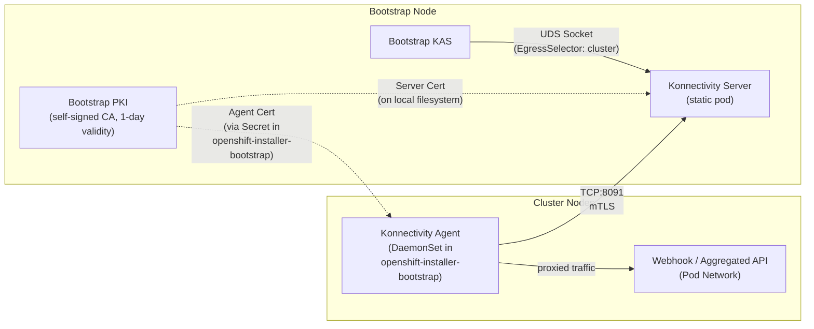

# Konnectivity Tunnel for Bootstrap Kube-APIServer

## Summary

During cluster bootstrap, the bootstrap kube-apiserver (KAS) runs on an isolated node that has no access to the cluster pod network.
This means the bootstrap KAS cannot reach webhooks, aggregated API servers, or other services hosted in the pod network on cluster nodes.
This enhancement proposes deploying a [Konnectivity][konnectivity] tunnel between the bootstrap node and cluster nodes so that the bootstrap KAS can proxy cluster-bound traffic through Konnectivity agents running on cluster nodes, enabling it to reach pod-network services during the bootstrap phase.

[konnectivity]: https://kubernetes.io/docs/tasks/extend-kubernetes/setup-konnectivity/

## Motivation

The bootstrap node runs all containers in host-network mode without a Container Network Interface (CNI) plugin.
The bootstrap KAS can reach services on the infrastructure network (e.g. etcd, the kubelet API) but cannot reach services running in the pod network on cluster nodes.

This becomes a problem when admission webhooks or aggregated API servers are deployed early in the cluster lifecycle.
If the bootstrap KAS cannot reach these services, API requests that trigger webhooks will fail.
Today this is managed by intentionally limiting the use of webhooks during the bootstrap phase, and we should continue to do this.
However, this constraint is fragile and limits the flexibility of operators that need early webhook registration.
In particular, this constraint has affected the deployment of Cluster API services where the upstream projects have deeply embedded assumptions about webhooks, and removing them is not feasible.

Konnectivity is the upstream Kubernetes solution to this problem ([KEP-1281][kep-1281]).
It provides a network proxy that allows the API server to reach cluster services through an agent running on cluster nodes.
HyperShift already uses Konnectivity for hosted control planes, so it is already in the OpenShift release payload.

A proof-of-concept implementation is available at https://github.com/openshift/installer/pull/10280.
This PR will be closed and is not intended for direct implementation.
It serves as a working example to inform this enhancement.
The proposed solution may differ from the PoC in some details.

[kep-1281]: https://github.com/kubernetes/enhancements/blob/master/keps/sig-api-machinery/1281-network-proxy/README.md

### User Stories

* As an OpenShift operator developer, I want the bootstrap KAS to be able to reach webhooks in the pod network so that my operator can progress without having to wait for completion of the bootstrap phase.

* As a cluster administrator, I want cluster installation to succeed reliably even when operators register webhooks during bootstrap so that I do not encounter installation failures caused by unreachable webhooks.

* As a support engineer, I want to diagnose Konnectivity tunnel failures during bootstrap using the standard bootstrap log bundle so that I can help customers resolve installation issues without needing additional data collection.

### Goals

* Enable the bootstrap KAS to reach services in the cluster pod network via a Konnectivity tunnel.
* Deploy the Konnectivity server as a static pod on the bootstrap node.
* Deploy Konnectivity agents as a DaemonSet on all cluster nodes.
* Use mutual TLS (mTLS) authentication between the Konnectivity server and agents.
* Clean up all bootstrap-specific Konnectivity resources automatically when bootstrap completes.
* Support all installer-provisioned platforms.

### Non-Goals

* Deploying Konnectivity for the production KAS instances on cluster nodes.
  The production KAS has direct access to the pod network and does not need Konnectivity.
  The configuration described here does not affect production KAS pods at all, and will not cause additional KAS rollouts.
* Providing a general-purpose network proxy for cluster workloads.

## Proposal

### Architecture

The following diagram shows the components and their relationships:



**Key integration points:**

* The bootstrap KAS connects to the Konnectivity server via a Unix domain socket (UDS) on the bootstrap node.
  No network transport or additional authentication is needed for this local connection.
* Konnectivity agents on cluster nodes connect to the Konnectivity server over TCP port 8091 using mTLS.
  Agents run in host-network mode and reach the bootstrap node via the infrastructure network — the same network path used by kubelets to reach the bootstrap KAS.
* The bootstrap PKI is a self-signed CA generated at bootstrap runtime.
  It signs the server certificate (which stays on the bootstrap node filesystem) and a shared agent client certificate (distributed as a Secret in the `openshift-installer-bootstrap` namespace).
* Once the bootstrap KAS receives a request destined for the cluster (e.g. a webhook call), the EgressSelectorConfiguration routes it through the UDS to the Konnectivity server, which forwards it through a connected agent to the target pod on a cluster node.

### Workflow Description

This feature is transparent to the cluster administrator.
It requires no user action and does not change the `openshift-install` CLI interface.
All steps below are performed automatically by the installer and bootstrap scripts.

**Installer operator** is the `openshift-install` binary and its generated bootstrap scripts.

1. At `openshift-install create cluster`, the bootstrap ignition is generated.
   The ignition includes the egress selector configuration files, a Konnectivity agent DaemonSet template, and the `bootkube.sh` bootstrap script.

2. The bootstrap node boots and `bootkube.sh` runs.
   Early in execution, the script generates the Konnectivity PKI:
   a. Determines the bootstrap node IP.
   b. Generates a short-lived (1-day) self-signed CA.
   c. Generates a server certificate (with the bootstrap IP as a SAN) signed by the CA.
   d. Generates a shared agent client certificate signed by the CA.

3. The script configures the bootstrap KAS for Konnectivity:
   a. Copies the egress selector configuration to the bootstrap config directory where the KAS can read it.
   b. Creates a Konnectivity server static pod manifest in `/etc/kubernetes/manifests/`.
   c. The bootstrap KAS is rendered by the `cluster-kube-apiserver-operator render` command with the Konnectivity config override, which adds the `--egress-selector-config-file` argument.

4. The script creates cluster resources for the Konnectivity agent:
   a. Resolves the `apiserver-network-proxy` image from the release payload.
   b. Substitutes the image and bootstrap IP into the DaemonSet template and writes the resulting manifest to the manifests directory.
   c. Writes the `openshift-installer-bootstrap` Namespace manifest to the manifests directory.
   d. Writes a `konnectivity-agent-certs` Secret manifest (containing the agent certificate and CA) to the manifests directory.

5. The bootstrap kubelet starts the KAS and Konnectivity server static pods.
   The KAS connects to the Konnectivity server via the UDS socket.

6. `cluster-bootstrap` applies all manifests to the cluster, including the `openshift-installer-bootstrap` Namespace, the agent DaemonSet, and the agent certificate Secret.

7. Konnectivity agent pods start on cluster nodes, mount the certificate Secret, and establish mTLS connections to the Konnectivity server on the bootstrap node.

8. The bootstrap KAS can now reach webhooks and aggregated API servers in the pod network via the Konnectivity tunnel.

9. At the end of `bootkube.sh`, the production KAS instances on cluster nodes have fully taken over API serving.
   The bootstrap KAS is no longer handling API requests, so tearing down the tunnel does not affect in-flight webhook calls.
   The `openshift-installer-bootstrap` namespace is deleted, which removes the agent DaemonSet, the certificate Secret, and all agent pods.

10. The installer destroys the bootstrap node infrastructure.
    The Konnectivity server is gone with it.
    The production KAS instances have direct access to the pod network and do not need the tunnel.

### API Extensions

None.
This enhancement does not add or modify any CRDs, webhooks, aggregated API servers, or finalizers.

### Topology Considerations

#### Hypershift / Hosted Control Planes

This enhancement is specific to the standalone cluster bootstrap environment and does not affect HyperShift.

#### Standalone Clusters

This enhancement targets standalone clusters.
It applies to all Installer-Provisioned Infrastructure (IPI) platforms.

#### Single-node Deployments or MicroShift

The impact on Single Node OpenShift (SNO) and MicroShift is tracked as an open question (see Open Questions below).

#### OpenShift Kubernetes Engine

The impact on OpenShift Kubernetes Engine (OKE) is tracked as an open question (see Open Questions below).

### Implementation Details/Notes/Constraints

#### Kube-apiserver Configuration

Two configuration files are added to the bootstrap ignition to configure the bootstrap KAS to route cluster-bound traffic through Konnectivity.

##### egress-selector-config.yaml

This is a standard Kubernetes `EgressSelectorConfiguration` resource that tells the KAS how to route outgoing connections.
The `cluster` egress type covers all traffic destined for the cluster network, including webhook calls, aggregated API server requests, and pod operations (exec, attach, logs, port-forward).

```yaml
apiVersion: apiserver.k8s.io/v1beta1
kind: EgressSelectorConfiguration
egressSelections:
- name: "cluster"
  connection:
    proxyProtocol: "HTTPConnect"
    transport:
      uds:
        udsName: "/etc/kubernetes/config/konnectivity-server.socket"
- name: "controlplane"
  connection:
    proxyProtocol: "Direct"
- name: "etcd"
  connection:
    proxyProtocol: "Direct"
```

The `cluster` egress uses the HTTPConnect proxy protocol over a Unix Domain Socket.
The UDS path `/etc/kubernetes/config/konnectivity-server.socket` is the path as seen from within the KAS pod container.
On the host, this corresponds to `/etc/kubernetes/bootstrap-configs/konnectivity-server.socket`, which is where the Konnectivity server creates the socket.
The KAS pod already mounts this host directory as its `config` volume, so no additional volume mounts are needed.

The API version `apiserver.k8s.io/v1beta1` is correct for the Kubernetes version currently shipped in OpenShift.
If the target OpenShift release moves to a Kubernetes version where `EgressSelectorConfiguration` has graduated to `v1`, the API version in this file must be updated to match.

The `controlplane` and `etcd` egress types use direct connections, meaning internal control plane traffic and etcd communication are not affected.

##### konnectivity-config-override.yaml

This is a `KubeAPIServerConfig` override that adds the `--egress-selector-config-file` argument to the bootstrap KAS:

```yaml
apiVersion: kubecontrolplane.config.openshift.io/v1
kind: KubeAPIServerConfig
apiServerArguments:
  egress-selector-config-file:
  - "/etc/kubernetes/config/egress-selector-config.yaml"
```

##### Applying the configuration to the bootstrap KAS

The `bootkube.sh` bootstrap script invokes the `cluster-kube-apiserver-operator render` command to generate the bootstrap KAS configuration.
This command supports a `--config-override-files` flag that merges additional configuration into the final `KubeAPIServerConfig`.
The konnectivity config override is passed via this flag:

```bash
/usr/bin/cluster-kube-apiserver-operator render \
  ... existing args ...
  --config-override-files=/assets/konnectivity-config-override.yaml
```

The operator's built-in config merging adds the `egress-selector-config-file` argument to the KAS configuration.
No modifications to the `cluster-kube-apiserver-operator` are required.

Before starting the KAS, `bootkube.sh` copies the egress selector configuration file to the bootstrap config directory so that the KAS pod can read it.

#### PKI

The Konnectivity PKI is generated at bootstrap runtime by the `bootkube.sh` script.
It is a self-contained, short-lived PKI used exclusively by bootstrap Konnectivity components.
It is not related to any other cluster PKI.
The detailed certificate generation logic is available in the [PoC PR](https://github.com/openshift/installer/pull/10280).

**Key properties:**

* A **self-signed Konnectivity CA** is generated with 1-day validity.
  This CA exists only on the bootstrap node and is used to sign the server and agent certificates.

* A **server certificate** is generated with 1-day validity, signed by the Konnectivity CA.
  It includes the bootstrap node IP as a Subject Alternative Name (SAN), which is detected at runtime.
  The server certificate and key remain on the bootstrap node filesystem and are mounted into the Konnectivity server static pod via a `hostPath` volume.

* A **shared agent client certificate** is generated with 1-day validity, signed by the Konnectivity CA.
  All Konnectivity agents use the same client certificate.

* The agent certificate, key, and CA certificate are packaged into a Kubernetes `Secret` named `konnectivity-agent-certs` in the `openshift-installer-bootstrap` namespace.
  This Secret is written as a manifest file by `bootkube.sh` and applied by `cluster-bootstrap` alongside the DaemonSet.
  The agent DaemonSet mounts this Secret as a volume.

* The CA private key and server certificate private key never leave the bootstrap node.
  Only the agent certificate material and the CA public certificate are distributed to cluster nodes via the Secret.

* The short 1-day validity is appropriate because these certificates are used only during the bootstrap phase, which typically completes within an hour.
  If bootstrap takes longer than 24 hours, the certificates will expire and the tunnel will fail, but a bootstrap that takes more than 24 hours indicates a deeper problem.

**Certificate summary:**

| File | CN | ExtKeyUsage | Validity | SAN | Location |
|------|----|-------------|----------|-----|----------|
| `ca.crt` / `ca.key` | `konnectivity-signer` | CA | 1 day | None | Bootstrap node only |
| `server.crt` / `server.key` | `konnectivity-server` | `serverAuth` | 1 day | `IP:<bootstrap-ip>` | Bootstrap node only |
| `agent.crt` / `agent.key` | `konnectivity-agent` | `clientAuth` | 1 day | None | Secret in `openshift-installer-bootstrap` |

#### Konnectivity Server Configuration

The Konnectivity server runs as a static pod on the bootstrap node.
Its manifest is written to `/etc/kubernetes/manifests/` by `bootkube.sh`.

The server uses the `apiserver-network-proxy` image (the same image used by the agent; it contains both `/usr/bin/proxy-server` and `/usr/bin/proxy-agent`).

**Key server flags:**

| Flag | Value | Purpose |
|------|-------|---------|
| `--uds-name` | `/etc/kubernetes/bootstrap-configs/konnectivity-server.socket` | UDS path where the KAS connects (host path, mounted into the KAS pod as `/etc/kubernetes/config/konnectivity-server.socket`) |
| `--server-port` | `8091` | TCP port for agent mTLS connections |
| `--server-cert` / `--server-key` | Paths on bootstrap node filesystem | Server certificate signed by the Konnectivity CA |
| `--cluster-cert` / `--cluster-key` | Same as server cert/key | Certificate used for cluster-facing traffic (reuses the server certificate) |
| `--agent-namespace` | `openshift-installer-bootstrap` | Namespace where agents are deployed |
| `--mode` | `http-connect` | Proxy protocol, matching the `EgressSelectorConfiguration` |
| `--server-count` | `1` | Only one Konnectivity server instance runs during bootstrap |

The static pod mounts the PKI directory from the bootstrap node filesystem via a `hostPath` volume and creates the UDS socket in the bootstrap config directory that the KAS pod already mounts.

#### Konnectivity Agent Configuration

The Konnectivity agent DaemonSet is included in the bootstrap ignition as a template.
The template contains placeholders for values that are only known at bootstrap runtime.
During bootstrap, `bootkube.sh` substitutes these placeholders and writes the resulting manifest to the manifests directory, where it is applied by `cluster-bootstrap`.

The `apiserver-network-proxy` image from the OpenShift release payload contains both `/usr/bin/proxy-server` and `/usr/bin/proxy-agent`.
The bootstrap script resolves the fully qualified image reference using the `image_for` function, which extracts the digest-pinned pull spec for the named component from the release payload:

```bash
KONNECTIVITY_IMAGE=$(image_for apiserver-network-proxy)
```

The DaemonSet depends on a `konnectivity-agent-certs` Secret containing the agent certificate, key, and CA certificate (see PKI section above).
Agent pods will remain pending until this Secret exists.

The following shows the key parts of the DaemonSet template.
`${KONNECTIVITY_IMAGE}` and `${BOOTSTRAP_NODE_IP}` are substituted by the bootstrap script before the manifest is written.
The full template is available in the [PoC PR](https://github.com/openshift/installer/pull/10280).

```yaml
apiVersion: apps/v1
kind: DaemonSet
metadata:
  name: konnectivity-agent
  namespace: openshift-installer-bootstrap
spec:
  # ...
  template:
    spec:
      hostNetwork: true
      priorityClassName: system-node-critical
      tolerations:
      - operator: Exists
      containers:
      - name: konnectivity-agent
        image: ${KONNECTIVITY_IMAGE}
        command: ["/usr/bin/proxy-agent"]
        args:
        - --proxy-server-host=${BOOTSTRAP_NODE_IP}
        - --proxy-server-port=8091
        - --agent-identifiers=default-route=true
        - --ca-cert=/etc/konnectivity/ca.crt
        - --agent-cert=/etc/konnectivity/tls.crt
        - --agent-key=/etc/konnectivity/tls.key
        # ...keepalive and sync interval flags omitted for brevity...
        resources:
          requests:
            cpu: 10m
            memory: 32Mi
        securityContext:
          readOnlyRootFilesystem: true
          allowPrivilegeEscalation: false
          capabilities:
            drop: ["ALL"]
        volumeMounts:
        - name: konnectivity-certs
          mountPath: /etc/konnectivity
          readOnly: true
      volumes:
      - name: konnectivity-certs
        secret:
          secretName: konnectivity-agent-certs
```

**Configuration notes:**

* `hostNetwork: true` — agents must use the host network to reach the bootstrap node via the infrastructure network.
  The pod network may not have routes to the bootstrap node.
* `tolerations: [{operator: Exists}]` — agents must schedule on every node regardless of taints, including nodes tainted for control plane roles.
  Agents do not schedule on the bootstrap node itself because the bootstrap node is not registered as a cluster node.
* `--proxy-server-host=${BOOTSTRAP_NODE_IP}` — the bootstrap IP is substituted by the bootstrap script before the manifest is applied.
* `--agent-identifiers=default-route=true` — tells the server this agent can handle default-route traffic.
* mTLS certificates are mounted from the `konnectivity-agent-certs` Secret.

#### Cloud-specific Security Group Configuration

The Konnectivity server listens on **TCP port 8091** for agent connections.
This port is not used by any other OpenShift component on the bootstrap node.
It is the upstream default for the Konnectivity server and is also used by HyperShift's Konnectivity deployment.

Any platform that configures network filtering for the bootstrap node must allow incoming traffic on this port from cluster nodes (both control plane and worker nodes).

For each of these platforms, a rule must be added to allow inbound TCP port 8091 from cluster node security groups or CIDRs to the bootstrap node.

**Example for AWS** (adding to `AdditionalControlPlaneIngressRules` in the AWSCluster manifest):

```go
{
    Description:              "Konnectivity agent traffic from cluster nodes",
    Protocol:                 capa.SecurityGroupProtocolTCP,
    FromPort:                 8091,
    ToPort:                   8091,
    SourceSecurityGroupRoles: []capa.SecurityGroupRole{"controlplane", "node"},
},
```

The full list of platforms requiring this change is tracked as an open question (see Open Questions below).

### Risks and Mitigations

**Risk: Certificate expiry during long bootstrap.**
The PKI has 1-day validity.
If bootstrap takes longer than 24 hours, the certificates expire and the tunnel breaks.
**Mitigation:** A bootstrap taking more than 24 hours indicates a deeper problem.
The 1-day validity is sufficient for normal operation and keeps the security exposure minimal.

**Risk: Agent cannot reach bootstrap node on port 8091.**
Platform firewall rules may block the connection if not updated.
**Mitigation:** All platforms with installer-managed firewalls must be updated to allow port 8091 (see Cloud-specific Security Group Configuration above).

**Risk: Shared agent client certificate.**
All Konnectivity agents use the same client certificate.
A node that obtains the `konnectivity-agent-certs` Secret could impersonate any other agent and proxy traffic through the tunnel.
**Mitigation:** This is a deliberate simplification.
The Secret is scoped to the `openshift-installer-bootstrap` namespace, the certificates have 1-day validity, and the entire namespace (including the Secret) is deleted when bootstrap completes.
Per-node certificates would require a CSR flow or individual Secrets, adding significant complexity for a short-lived tunnel where all agents have identical roles and access levels.

### Drawbacks

* Adds complexity to the bootstrap process.
  The bootstrap environment gains a new static pod (Konnectivity server), a new DaemonSet (agents), runtime PKI generation, and additional configuration files.

* The Konnectivity tunnel is temporary and exists only during bootstrap.
  This is a significant amount of machinery for a short-lived phase.
  However, the alternative is fragile and increasingly difficult to maintain.

* Firewall rules for port 8091 must be added to every platform with installer-managed network filtering.
  This is a cross-platform change that requires testing on each platform.

## Alternatives (Not Implemented)

**Running a CNI plugin on the bootstrap node.**
This would give the bootstrap node direct access to the pod network, eliminating the need for Konnectivity.
However, the bootstrap node is intentionally isolated from the pod network.
Running a CNI plugin would create a dependency cycle (CNI operator needs the API server, but the API server needs the network for webhooks) and would conflict with the design principle that the bootstrap node is temporary and not part of the production cluster topology.

**Using `api-int` DNS as the Konnectivity server address.**
Instead of detecting the bootstrap IP at runtime, agents could connect to the `api-int.<cluster-domain>` DNS name.
However, `api-int` resolves to a VIP (on bare metal/vSphere) or a load balancer (on cloud platforms), not specifically to the bootstrap node.
The VIP can move to control plane nodes before bootstrap completes, and load balancers distribute traffic to any healthy backend.
Agents might connect to a node that does not have the Konnectivity server running.

**Generating the agent DaemonSet at the manifests stage.**
The DaemonSet could be generated as a static manifest during `openshift-install create manifests`, making it visible and editable before cluster creation.
However, the DaemonSet requires the `apiserver-network-proxy` image resolved to an exact digest from the release payload.
The installer cannot guarantee that it can reach the release image at manifest generation time, so it cannot reliably substitute the image reference into the manifest.
By deferring to the bootstrap script, the image can be resolved on the bootstrap node.
The bootstrap node must always have access to the release image.

## Open Questions [optional]

1. How should the bootstrap script determine the bootstrap node IP?
   This IP is required for the server certificate SAN and the agent `--proxy-server-host` argument.
1. Clarify the impacts, if any, on SNO, MicroShift, and OKE.
   For SNO, the bootstrap node is typically separate from the single cluster node, so the architecture still applies.
   MicroShift does not use the bootstrap process and is likely not affected.
   OKE uses the same installer and is likely affected in the same way as OCP.
   These assumptions need confirmation.
1. Determine all platforms requiring security group updates for TCP port 8091.
   At minimum, AWS, Azure, GCP, and any other platform where the installer manages firewall rules for the bootstrap node.

## Test Plan

**TBD**

## Graduation Criteria

### Dev Preview -> Tech Preview

**TBD**

### Tech Preview -> GA

**TBD**

### Removing a deprecated feature

Not applicable.
This enhancement does not deprecate or remove any existing features.

## Upgrade / Downgrade Strategy

This enhancement only affects the cluster bootstrap process.
There is no impact on upgrade or downgrade of running clusters.

## Version Skew Strategy

N/A

## Operational Aspects of API Extensions

This enhancement does not add API extensions.
No CRDs, webhooks, aggregated API servers, or finalizers are introduced.

## Support Procedures

The Konnectivity tunnel exists only during bootstrap.
If the tunnel fails the symptom may be:

* Cluster installation takes significantly longer because some cluster operators cannot progress until the bootstrap phase completes.
* Some cluster operators temporarily report Degraded during installation due to persistent API failures.
* Cluster installation fails due to failure to complete bootstrap.

**Detecting failure:**

* The bootstrap KAS logs will contain errors like `failed to call admission webhook` or `failed to call aggregated API server` with connection errors indicating the pod network is unreachable.
* The Konnectivity server logs (on the bootstrap node) will indicate whether agents have connected.
* The Konnectivity agent logs (on cluster nodes) will show connection errors if they cannot reach the server on port 8091.

**Gathering logs:**

```bash
openshift-install gather bootstrap \
  --bootstrap <bootstrap-ip> \
  --master <master-ip> [...]
```

The log bundle includes bootstrap container logs (including the Konnectivity server) and can be used to diagnose tunnel failures.

**Common failure modes:**

* **Agents cannot connect to server:** Check that firewall rules allow TCP port 8091 from cluster nodes to the bootstrap node.
* **Certificate errors:** If some other condition causes the bootstrap phase to take longer than 1 day the Konnectivity server and agent logs would contain certificate errors.