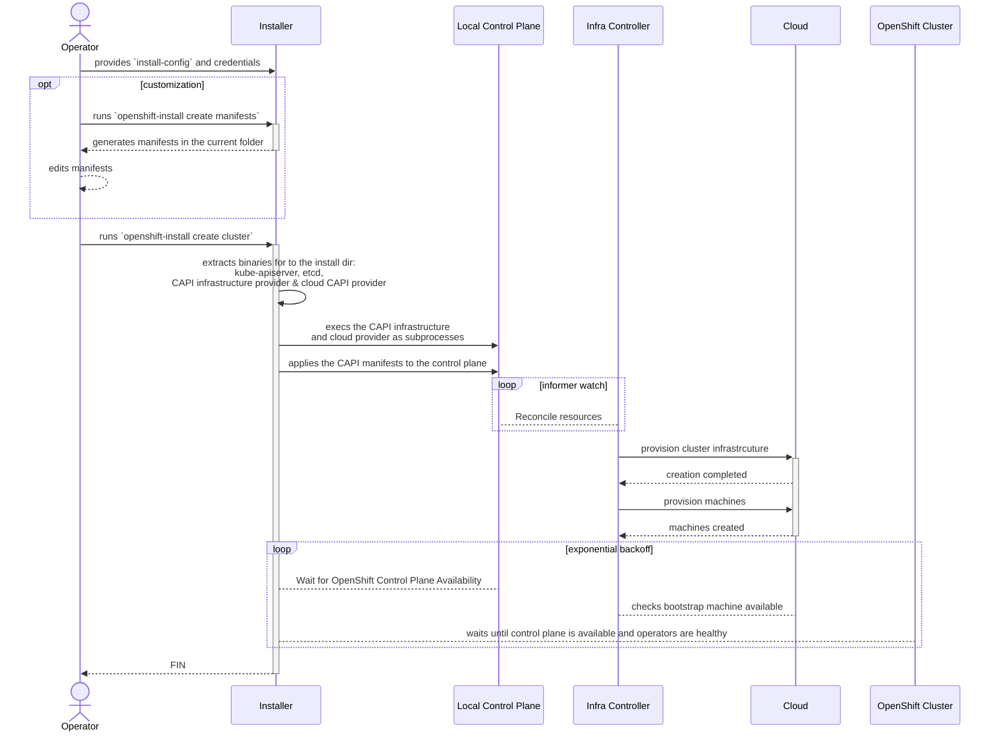
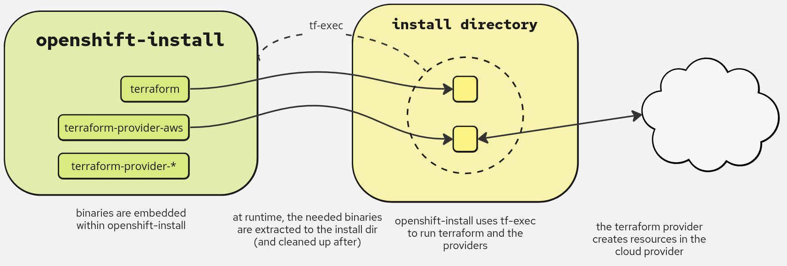
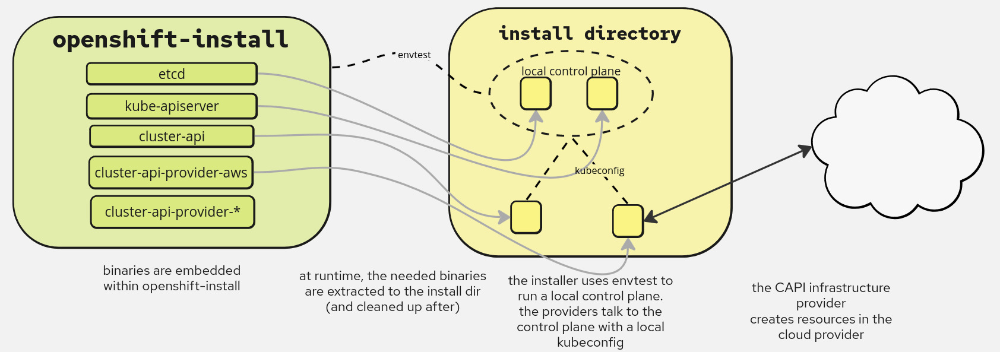

# Bootstraping Clusters with CAPI Infrastructure Providers

> NOTE: At the time of writing (Jan '24), Cluster API
> is only used as an implementation detail to replace Terraform.
> The OpenShift clusters created through these mechanics do not pivot Cluster API resources
> but instead hand off operations to Machine API.

## Summary

This enhancement discusses how `openshift-install` can use
cluster-api (CAPI) providers to provision cluster infrastructure,
without requiring access to an external management cluster or a local container runtime.
By running a Kubernetes control plane and CAPI-provider controllers as
subprocesses on the installer host, `openshift-install` can use CAPI and its
providers in a similar manner to how Terraform and its providers are currently
being used. The outcome would be a removal of Terraform dependencies in
installer-provisioned installs as well as the added ability to produce
cluster-api manifests, which lay the foundation for future OpenShift features.

## Motivation

- OpenShift Alignment with CAPI: CAPI offers numerous potential benefits;
such as: day-2 infrastructure management, an API for users to edit cluster
infrastructure, and upstream collaboration. Installer support for CAPI would
be foundational for adopting these benefits.

- Terraform BSL License Change: due to the restrictive license change of
Terraform, `openshift-install` needs a framework to replace the primary
tool it used to provision cluster infrastructure. In addition to the benefits
listed above, CAPI provides solutions for the biggest gaps left by Terraform:
a common API for specifying infrastructure across cloud providers and robust
infrastructure error handling. Furthermore, removing Terraform will greatly
reduce the surface area for security vulnerabilities. Terraform and its providers
constitutes over half a million lines of code in the Installer repo and is directly
attributable for all (13) CVEs that have been fixed in the Installer repo.

- Streamline Installer development: a common pattern for Installer development
has been to reimplement control-plane features in Terraform that have already been
delivered upstream. By utilizing CAPI providers for Day-0 provisioning, our development practices will remove this duplication and become more efficient.

### User Stories

- As an existing user of the installer, I want to continue to use the installer binary (e.g. `create cluster`) in the same environments and with existing automation.
- As an advanced user or cluster administrator, I want to be able to edit the CAPI infrastructure manifests so that I can customize control-plane infrastructure.

### Goals

- To provide a common experience across platforms for users and `openshift-install` developers
- To be backwards compatible and fully satisfy the requirements of install-config type APIs.
  - To document for end users differences in infrastructure created for each cloud provider.
    Example: on AWS we are expecting there to be additional security groups used, rather than 1 per worker and 1 per master, each machine will be a member of multiple security groups which add permissions based on their roles (node, master, load balancer, most machines will be in 2 of these).
- To keep the user experience for day-zero operations unchanged or improved.
- To not require any new runtime dependencies (e.g. containers).
- To maintain compatibility for hive, particularly regarding `destroy` functionality
- To maintain compatibility with assisted installer, particularly allowing the ability to generate manifests without requiring access to cloud platform endpoints
- To continue delivering `openshift-install` for supported os/architectures: linux/x86, linux/arm, linux/powerpc, linux/s390x, darwin/x86, darwin/arm

### Non-Goals / Future work

- Non-goal: To maintain a consistent infrastructure footprint as clusters previously created with Terraform
- Non-goal: Support openshift cluster creation by using any tools other than `openshift-install`, such as `clusterctl`
- Non-goal: To add new functionality of having a reentrant installation
- Non-goal: To change the machine bootstrapping process, e.g. implementing a CAPI bootstap provider
- Future work: To use an existing management cluster to install OpenShift
- Future work: To pivot the CAPI manifests to the newly-installed cluster to enable day-2 infrastructure management within the cluster.
- Future work: Collaborate with Assisted Installer and HIVE for any related changes required.
- Future work: Replace Machine API (MAPI) with CAPI for day-2 machine management. This enhancement assumes we are still using MAPI Day 2.
- Future work: To provide an extensible framework to plug-in new infrastructure cloud providers.


## Proposal

The Installer will create CAPI infrastructure manifests based on user
input from the install config; then, in order to provision cluster infrastructure,
apply the manifests to CAPI controllers running on a local Kubernetes control-plane
setup by [envtest](https://pkg.go.dev/sigs.k8s.io/controller-runtime/pkg/envtest).

### Workflow Description

**cluster creator** is a human user responsible for deploying a
cluster. Note that the workflow does not change for this user.

**openshift-install** is the Installer binary.




##### Error handling

In the case of an error in the final step, the Installer will bubble up resources with non-expected statuses. The installer binary will collect and save all logs from all controllers used during the day zero operations, including Cluster API and its infrastructure providers.

##### Credentials management

The local control plane and Cluster API controllers share similar requirements regarding credentials when compared to Terraform. The installer validates and inject the required credentials from the user environments, cloud infrastructure providers can opt to pass credentials from the environment or install config in well-known Secret objects, or use the inherited environment available.

#### Variation and form factor considerations [optional]


### API Extensions

As a result of this enhancement, API Extensions will only be used locally by the
local Installer control plane--they will not, until future work, be pivoted to the cluster.
The following are CRD references for Installer-supported platforms:

- AWS: [infrastructure.cluster.x-k8s.io/v1beta2][awsCRD]
- Azure/AzureStack: [infrastructure.cluster.x-k8s.io/v1beta1][azureCRD]
- GCP: [infrastructure.cluster.x-k8s.io/v1beta1][gcpCRD]
- IBMCloud/PowerVS: [infrastructure.cluster.x-k8s.io/v1beta2][ibmCRD]
- Nutanix: [infrastructure.cluster.x-k8s.io/v1beta1][nutanixCRD]
- OpenStack: [infrastructure.cluster.x-k8s.io/v1alpha7][openstackCRD]
- vSphere: [infrastructure.cluster.x-k8s.io/v1beta1][vsphereCRD]

### Implementation Details/Notes/Constraints [optional]

#### Overview

In a typical CAPI installation, manifests indicating the desired cluster configuration are applied to a
management cluster. In order to keep `openshift-install` free of new external runtime dependencies,
the management-cluster dependencies will be [embedded][embed] into the `openshift-install` binary,
extracted at runtime, and cleaned up afterward.  This approach is similar to what we have been using
for Terraform.

In its current configuration, the Installer embeds the Terraform and cloud-specific provider binaries
within the `openshift-install` binary and extracts them at runtime. The Installer produces the Terraform
configuration files and invokes Terraform using the `tf-exec` library.



We can follow a similar pattern to run CAPI controllers locally on the Installer host. In addition
to the CAPI controller binaries, `kube-apiserver` and `etcd` are embedded in order to run a local
control plane, orchestrated with `envtest`.



#### Local control plane

The local control plane is setup using the previously available work done in Controller Runtime through [envtest][envtest].
Envtest was born due to a necessity to run integration tests for controllers against a real API server, register webhooks
(conversion, admission, validation), and managing the lifecycle of Custom Resource Definitions.

Over time, `envtest` matured in a way that now can be used to run controllers in a local environment,
reducing or eliminating the need for a full Kubernetes cluster to run controllers. `envtest` is part of the
[controller-runtime project][controller-runtime].

At a high level, the local control plane is responsible for:
- Setting up temporary certificates for the local api-server and etcd.
- Running (and cleaning up, on shutdown) the local control plane components.
- Installing any required component, like Custom Resource Definitions (CRDs)
    - For Cluster API core the CRDs are stored in `data/data/cluster-api/core-components.yaml`.
    - Infrastructure providers are expected to store their components in `data/data/cluster-api/<name>-infrastructure-components.yaml`
- Upon install, the local control plane takes care of modifying any webhook (conversion, admission, validation) to point to a `host:post` (usually host is `localhost`) combination assigned.
    - Each controller manager will have its own `host:port` combination assigned.
    - Certificates are generated and injected in the server, and the client certs in the api-server webhook configuration.
- For each process that the local control plane manages, a health check (ping to `/healthz`) is required to pass; similarly how, when running in a Deployment, a health probe is configured.
  - The health check is confirmed, the process can continue.


The [envtest APIs][envtestAPI] are a thin layer on top of running binaries and setting up flags or variables.
The logic could be eventually moved into the installer, if warranted.

#### Manifests

The Installer produces the CAPI manifests as part of the `manifests` target, writing them to a
`cluster-api` directory alongside the existing `manifests` and `openshift` directories:

```shell=
$ ./openshift-install create manifests --dir install-dir
INFO Credentials loaded from the "default" profile in file "~/.aws/credentials"
INFO Consuming Install Config from target directory
INFO Manifests created in: install-dir/cluster-api, install-dir/manifests and install-dir/openshift
$ tree install-dir/cluster-api/
install-dir/cluster-api/
├── 00_capi-namespace.yaml
├── 01_aws-cluster-controller-identity-default.yaml
├── 01_capi-cluster.yaml
├── 02_infra-cluster.yaml
├── 10_inframachine_mycluster-6lxqp-master-0.yaml
├── 10_inframachine_mycluster-6lxqp-master-1.yaml
├── 10_inframachine_mycluster-6lxqp-master-2.yaml
├── 10_inframachine_mycluster-6lxqp-master-bootstrap.yaml
├── 10_machine_mycluster-6lxqp-master-0.yaml
├── 10_machine_mycluster-6lxqp-master-1.yaml
├── 10_machine_mycluster-6lxqp-master-2.yaml
└── 10_machine_mycluster-6lxqp-master-bootstrap.yaml

1 directory, 12 files
```

The cluster-api manifests are generated in parallel with all other manifests, particularly the machine-api manifests, which means that
any changes to the control-plane machines within the manifests will also need to be made in the cluster-api manifests. Guidelines will
be provided in documentation to inform users of how to generally edit the new manifests.

The resources specified within the cluster-api manifests won't be created in the resulting OpenShift cluster (or included in bootstrap ignition),
but the manifest artifacts will be uploaded to the cluster as a configmap for reference (similarly to the install config). Although, the
machines are provisioned based off of the cluster-api manifests, post-install the control plane will be managed by the machine-api operator.
In future work, we expect these manifests to be pivoted to the cluster to enable the target cluster to take over managing its own infrastructure.

After installation, updated Cluster API manifests will be written to disk.
These manifests can be used by post-install commands such as `openshift-install gather bootstrap` in order to determine the IP addresses of the
control-plane machines. The manifests would also be useful for debugging.

##### Manifest Generation and the Assisted Installer

The Assisted Installer does not collect user credentials and therefore cannot access a cloud platform while generating manifests. `openshift-install`
on the other hand may use SDK calls to determine metadata which was not provided but can be determined based on user input. Specifically, for vSphere
the installer determines the full inventory path of the network name (port groups) based on the data from the install config. In order to maintain
compatibility with the assisted installer, `openshift-install` will leave any fields in the cluster-api manifests that require SDK access empty in the
case where SDK access to the cloud environment fails. It may be necessary to condition this functionality based on the `invoker` env var. The result
will be continued compabitility with assisted installer and the future possibility of the assisted installer developing a workflow to enable day-2
infrastructure management.

#### Infrastructure Provisioning

##### CAPI Provisioning

The CAPI infrastructure manifests determine the infrastructure resources that will be provisioned by the CAPI controllers.
Here is an example AWS infra cluster manifest from the proof-of-concept implementation:

```shell
$ cat cluster-api/02_infra-cluster.yaml
apiVersion: v1beta2
kind: AWSCluster
metadata:
  creationTimestamp: null
  name: capi-example-kbdpg
  namespace: openshift-cluster-api-guests
spec:
  bastion:
    enabled: false
  controlPlaneEndpoint:
    host: ""
    port: 0
  controlPlaneLoadBalancer:
    additionalListeners:
    - port: 22623
      protocol: TCP
    crossZoneLoadBalancing: false
    loadBalancerType: nlb
    name: capi-example-kbdpg-ext
    scheme: internet-facing
  network:
    additionalControlPlaneIngressRules:
    - description: MCS traffic from cluster network
      fromPort: 22623
      protocol: tcp
      sourceSecurityGroupRoles:
      - node
      - controlplane
      toPort: 22623
    - description: controller-manager
      fromPort: 10257
      protocol: tcp
      sourceSecurityGroupRoles:
      - controlplane
      - node
      toPort: 10257
    - description: kube-scheduler
      fromPort: 10259
      protocol: tcp
      sourceSecurityGroupRoles:
      - controlplane
      - node
      toPort: 10259
    cni:
      cniIngressRules:
      - description: ICMP
        fromPort: -1
        protocol: icmp
        toPort: -1
       # several rules omitted for brevity
      - description: Service node ports (UDP)
        fromPort: 30000
        protocol: udp
        toPort: 32767
    vpc:
      availabilityZoneSelection: Ordered
      availabilityZoneUsageLimit: 3
      cidrBlock: 10.0.0.0/16
  region: us-east-2
  s3Bucket:
    name: openshift-bootstrap-data-capi-example-kbdpg
    presignedURLDuration: 1h0m0s
status:
  networkStatus:
    apiServerElb:
      attributes: {}
  ready: false
```

This manifest describes the network, load balancers, security group rules, etc. that will be used or provisioned for the target cluster.
Control plane machines are provisioned by [AWSMachines][AWSMachines] & [CAPI Machines][CAPIMachines] manifests.

##### Additional Infrastructure

The Installer generates any additional infrastructure that is needed but not handled by the CAPI provider, either because it is out of scope (e.g. IAM, DNS), or not adopted upstream (e.g. split-horizon load balancers). In the case of
Ignition support, the `Bootstrap` field of the CAPI Machine Spec allows
bootstrapping via the machine user-data.
The Installer codebase provides hooks into the provisioning lifecycle that can be used to provision resources using direct SDK calls or other tooling.

In most cases, teams are encouraged in discussing and building issues in the respective upstream repositories first, e.g. `cluster-api` or `cluster-api-provider-aws` and only
use the following hook as a fallback path.

Provisioning of resources with CAPI is divided into two stages: _infrastructure_ (all non-machine related manifests) and _control plane_,
with hooks before, in between, and after:

* PreProvision Hook - handle prequisites: e.g. IAM role creation, OS Disk upload
* Provision Infrastructure - create `cluster` manifest on local control plane
* InfraReady Hook - handle requirements in between cluster infrastructure and machine provisioning
* Ignition Hook - similar to InfraReady but specifically for generating (bootstrap) ignition
* Provision Machines - create bootstrap ignition and control-plane machines
* PostProvision Hook - post-provision requirements, such as DNS record creation

##### Bootstrap Resources

OpenShift will continue to use the same bootstrapping process, as described in the Installer
[Cluster Installation Process][install-overview].
The Bootstrap Machine is created like the other control plane nodes, by defining a CAPI Machine resource.
Accordingly, the bootstrap machine can be deleted by simply deleting the object. This works for all platforms:

```go
	if err := c.Delete(ctx, &clusterv1.Machine{
		ObjectMeta: metav1.ObjectMeta{
			Name:      capiutils.GenerateBoostrapMachineName(metadata.InfraID),
			Namespace: capiutils.Namespace,
		},
	});
```

The CAPI provider interface will be extended to allow deletion of additional resources that do not get destroyed by
this general pattern (e.g. SSH security rules on the bootstrap node).

##### Backward compatibility

As covered in [OpenShift API compatibility](https://docs.openshift.com/container-platform/4.14/rest_api/understanding-compatibility-guidelines.html):

> No assurances are made at this time that a new installation of a product minor release will have the same functional defaults as a version of the product that was installed with a prior minor release and upgraded to the equivalent version. For example, future versions of the product may provision cloud infrastructure with different defaults than prior minor versions. In addition, different default security choices may be made in future versions of the product than those made in past versions of the product. Past versions of the product will forward upgrade, but preserve legacy choices where appropriate specifically to maintain backwards compatibility.

The changes proposed in this enhancement allow the OpenShift Installer to change the underlying mechanics on how an OpenShift cluster is created from an InstallConfig. The change of technology carries structural differences in how the infrastructure is provisioned, defaults, or the topology of the cluster.

Given an InstallConfig to both systems the enhancement guarantees a functionally equivalent OpenShift cluster.

In the best case scenario, OpenShift users rely on tags or labels attached to cloud resources when automating specific parts of their infrastructure. While this can be true in most cases, a goal of this proposal is to document in details the underlying structural differences.

### Risks and Mitigations

While we do not expect these changes to introduce a significant security risk, we are working with product security teams to ensure they are aware of the changes and are able to review.

Each Cluster API provider's created infrastructure should be reviewed by product security and subject area experts to ensure the new infrastructure topologies considered are on par with today's standards.

### Drawbacks

Users will be required to edit additional files if they are manually editing control-plane machine manifests.
Changes would need to be made to both the machine-api and cluster-api manifests.

#### External/Upstream dependencies

As explained above, the Installer will embed binaries for each supported CAPI provider, as well
as `etcd` and `kube-apiserver` binaries. Initially, CAPI providers will be vendored and built in
the Installer repo. `etcd` and `kube-apiserver` will be copied from the release image.

##### In-tree Dependency Vendoring

For the initial implementation, CAPI providers will be vendored and built within the Installer repo:

```bash
$ tree cluster-api/providers -L 2
cluster-api/providers
├── aws
│   ├── go.mod
│   ├── go.sum
│   ├── tools.go
│   └── vendor
├── azure
│   ├── go.mod
│   ├── go.sum
│   ├── tools.go
│   └── vendor
...
```

This follows a similar pattern to the current Terraform provider implementation and build. This
pattern will be used initially due to its simplicity and existing support. This pattern has
drawbacks because changes to providers need to be merged upstream first and then vendored
to the Installer. This aspect will be particularly problematic once CAPI providers are GA
and we need to keep the Installer in-sync with other providers. Builds are also inefficient
in that providers are always rebuilt, even when unchanged.

##### Copying Dependencies from Container Images

The previously described vendoring pattern presents disadvantages:
* increase in the repo size;
* security issues/warnings in code we do not own;
* providers are rebuilt with every Installer change, whether or not the change is pertinent to the provider

So as not to incur the same disadvantages, we opted to use a different approach for etcd and kube-apiserver needed for
the provisioning via CAPI: they will be built into intermediary container images. During the Installer container build,
those images are imported and the relevant binaries extracted. Because of that, etcd and kube-apiserver will have build
cadences decoupled from the Installer's, being rebuilt only when needed.
Because they run in the host machine, like the Installer, they will have to be built for all systems/arches supported,
including cross-compiled darwin amd64/arm64.

This architecture has 2 opposing disadvantages:
* In CI: because there is no mechanism to detect and rebuild dependant images, Installer and etcd/KAS might temporarily
drift apart and cause job failures when the expected versions do not match. This issue is probably alleviated by the
frequent changes to the Installer repo and can be worked around by forcing an Installer rebuild.
* In the release: in this case, there is a mechanism to trigger rebuilds automatically. Which means that the Installer
image will be rebuilt with any changes to etcd/KAS, even if those changes don't necessarily require an Installer rebuild.

For FIPS supported architectures the dependencies will be copied from the release image, while others will
be copied from intermediary build images. During development, the dependencies
can be obtained from the internet via a script.

#### Disk space and memory

> NOTE: All tests are performed on a MacOS system at the time of writing.

With the introduction of the Local Control Plane, new required components are being run during cluster creation.

Memory runtime:
- `api-server` uses ~280MB and `etcd` ~52MB
- Cluster API
  - Core controller uses ~28MB
  - Infrastructure controller (AWS, in testing) uses ~35MB

When compared to Terraform, the runtime memory footprint is well-within the current usage or limitations (TODO: provide Terraform benchmark).

The disk footprint increases by what's required for `etcd` which is around 128MB while creating an OpenShift cluster on AWS.

#### Binary size

> NOTE: All tests are performed on a MacOS system at the time of writing.

The `openshift-install` resulting binary size, with Cluster API bundled binaries (excluding alicloud, libvirt) reaches ~515MB, of which, the bundled binaries account 228MB. By comparison, the binary available for download on `console.redhat.com` for MacOS, once upacked, is 732MB.

The binaries are stored in `zip` format within the installer, and unpacked at runtime; from the `zip` output, the space savings are quite substantial:

```
updating: cluster-api (deflated 68%)
updating: cluster-api-provider-aws (deflated 73%)
updating: cluster-api-provider-azure (deflated 70%)
updating: cluster-api-provider-azureaso (deflated 74%)
updating: cluster-api-provider-gcp (deflated 73%)
updating: cluster-api-provider-ibmcloud (deflated 72%)
updating: cluster-api-provider-nutanix (deflated 69%)
updating: cluster-api-provider-vsphere (deflated 72%)
updating: etcd (deflated 64%)
updating: kube-apiserver (deflated 72%)
```

## Design Details

### Open Questions [optional]

- UX design during install process as well as during failure (log collection). The Installer will dump
(potentially prettified) controller logs. We expect that this question will become easier to answer further
into the development process.

- When should the Installer declare infrastructure provisioning failed?
  - Today we have different timeouts at different stages of the installation process; during the first phase of this enhancement
    we'll keep the same values in place. Long term, we could allow upper bound customization of these values.

- What is the best way to destroy bootstrap resources?

### Test Plan

The functionality described in this enhancement is gated by a new Feature Gate called `ClusterAPIInstall`.
A major goal of this enhancement is feature parity, which means we can leverage existing test job definitions
and infrastructure for testing. The initial round of testing will be running the standard `e2e-<platform>-ovn`
tests with the feature gate enabled; and adding additional tests is as simple as copying an existing config and
adding the gate.

In 4.15, the `installer-altinfra` image was introduced to serve as a Terraform-free alternative to the
`installer` image. CI testing will initially begin in this image (using a [variant](variant)) to enjoy the
benefits of a Terraform-free build and to avoid introducing temporary changes to the `installer` image Dockerfile,
which would be necessary while working on the solution for
[copying dependencies from container images](#dependencies-from-container-images). The `OPENSHIFT_CLUSTER_API` flag
will be used during the installer build to obtain the `kube-apiserver` and `etcd` binary dependencies from the internet;
the flag is enabled through Dockerfile args in the `installer-altinfra` image.  Once the work of copying dependencies
from images is ready, we will be able to test that build functionality by running the CAPI-feature-gated installs
without the `OPENSHIFT_CLUSTER_API` envvar in the `installer` image.

While we are using the `OPENSHIFT_CLUSTER_API` envvar, we are able to test in CI but the Installer
cannot be tested in nightlies or release candidates, due to egress lockdown in the OpenShift Build System.


### Graduation Criteria

Graduation can happen per individual cloud platform.

#### Dev Preview -> Tech Preview

Users can opt-in to use a Cluster API based installation by including in the InstallConfig a custom feature set:

```
[...]
featureSet: CustomNoUpgrade
featureGates:
- ClusterAPIInstall=true
```

- Ability to utilize the enhancement end to end.
- End user documentation, relative API stability.
- Build using `OPENSHIFT_CLUSTER_API` envvar

#### Tech Preview -> GA

- More testing (upgrade, downgrade, scale).
- Sufficient time for feedback.
- Available by default.
- User facing documentation created in [openshift-docs](https://github.com/openshift/openshift-docs/)
  - Document detailed deltas in cluster infrastructure created by Terraform and Cluster API.
- Infrastructure topology security posture review for each provider.
- Installer image is built by copying `kube-apiserver` & `etcd` binaries from release images.
- FIPS-compliance is confirmed, particularly in the build process and certificates for local control plane
- Stand-alone `openshift-install destroy bootstrap` command will be able to utilize CAPI system by reloading state from disk

#### Post-GA
- Follow `kube-apiserver` & `etcd` pattern, and copy CAPI controller binaries from release images


#### Removing a deprecated feature

- Announce deprecation and support policy of the existing feature.
- Deprecate the feature gate.

### Upgrade / Downgrade Strategy

As this enhancement only concerns the Installation process and affects only the underlying cluster
infrastructure, this change should not affect existing cluster upgrades.

### Version Skew Strategy

N/A

### Operational Aspects of API Extensions

N/A

#### Failure Modes

During a failed install, the controller logs will contain useful information. The status of the CAPI manifests
may also contain useful information, in which case it would be important to display that to users and collect
for bugs and support cases. There is an open question about the best way to handle this UX, and we expect the answer to become more clear during development.

As the infrastructure will be reconciled by a controller, it will be possible to resolve issues during an ongoing
installation, although this would not necessarily be a feature we would call attention to for documented use cases.

Finally, the Installer will need to be able to identify when infrastructure provisioning has failed during an installation.
Initially this will be achieved through a timeout. There is an open question about whether this can be done in a more sophisticated manner.

#### Support Procedures

When infrastrucutre provisioning has failed, users will need to collect the log bundle (see previous section
regarding the open question for the log bundle).

As the providers will be running in a control loop, it would be possible to resolve certain issues
(e.g. fix missing permissions or delete resources taking up quota) during an installation, but this would
not be a documented procedure.

## Implementation History

Major milestones in the life cycle of a proposal should be tracked in `Implementation
History`.

## Alternatives


#### MicroShift

While we've considered using MicroShift for a local control plane, which can run in different platforms using tools like Podman Desktop or on RHEL directly, the requirement of having access to a RHEL Virtual Machine is a high bar to reach given the goal of not introducing any dependency on runtimes and being able to run in a variety of platforms, including CI systems.

#### Infrastructure-as-code Tools

Using other infrastructure-as-code alternatives such as Pulumi, Ansible, or OpenTofu
all have their own individual drawbacks. We prefer the CAPI solution over
these alternatives because it:

* Streamlines Installer development (we do not need to re-implement features for the control plane)
* Lays the foundation for OpenShift to implement future CAPI features
* Requires less development effort, as CAPI providers are already setup to provision infrastructure for a cluster

#### Direct SDK calls

It would also be possible to implement the installation using direct SDK calls for the cloud provider. In addition
to the reasons stated above, using individual SDK implementations would not present a common framework across various
cloud platforms.

#### Separate manifest creation targets for Cluster/Machine APIs (implementation detail)

To mitigate the drawback of requiring additional editing of cluster-api manifests after changing machine-api manifests
it would be possible to create the cluster-api manifests based on the machine-api manifests, rather than generating
them in parallel based on the same inputs. Considering that we want to replace MAPI with CAPI in the long-term, it
seems more future proof not to create a dependency between CAPI & MAPI manifests. Furthermore, it would be more
user-friendly to keep all manifests within the same target (`manifests`).

## Infrastructure Needed [optional]

Use this section if you need things from the project. Examples include a new
subproject, repos requested, github details, and/or testing infrastructure.

Listing these here allows the community to get the process for these resources
started right away.

[embed]: https://pkg.go.dev/embed
[envtest]: https://github.com/kubernetes-sigs/controller-runtime/tree/main/tools/setup-envtest
[awsCRD]: https://cluster-api-aws.sigs.k8s.io/crd/#infrastructure.cluster.x-k8s.io%2fv1beta2
[azureCRD]: https://capz.sigs.k8s.io/reference/v1beta1-api#infrastructure.cluster.x-k8s.io%2fv1beta1
[gcpCRD]: https://doc.crds.dev/github.com/kubernetes-sigs/cluster-api
[ibmCRD]: https://doc.crds.dev/github.com/kubernetes-sigs/cluster-api-provider-ibmcloud
[metalCRD]: https://github.com/metal3-io/cluster-api-provider-metal3/blob/main/api/v1beta1/metal3cluster_types.go
[nutanixCRD]: https://opendocs.nutanix.com/capx/latest/types/nutanix_cluster/
[openstackCRD]: https://github.com/kubernetes-sigs/cluster-api-provider-openstack/blob/main/api/v1alpha7/openstackcluster_types.go
[vsphereCRD]: https://github.com/kubernetes-sigs/cluster-api-provider-vsphere/blob/main/apis/v1beta1/vspherecluster_type.
[asset]: https://github.com/openshift/installer/blob/master/docs/design/assetgeneration.md
[AWSMachines]: https://github.com/openshift/installer/blob/ba66fc691e67b9bfe04204c3ece98e1386f66057/pkg/asset/machines/aws/awsmachines.go#L57-L85
[CAPIMachines]: https://github.com/openshift/installer/blob/master/pkg/asset/machines/aws/awsmachines.go#L100-L118
[controller-runtime]: https://github.com/kubernetes-sigs/controller-runtime
[envtestAPI]: [https://github.com/kubernetes-sigs/controller-runtime/tree/main/pkg/internal/testing/controlplane
[install-overview]: https://github.com/openshift/installer/blob/master/docs/user/overview.md#cluster-installation-process
[variant]: https://docs.ci.openshift.org/docs/how-tos/contributing-openshift-release/#variants
