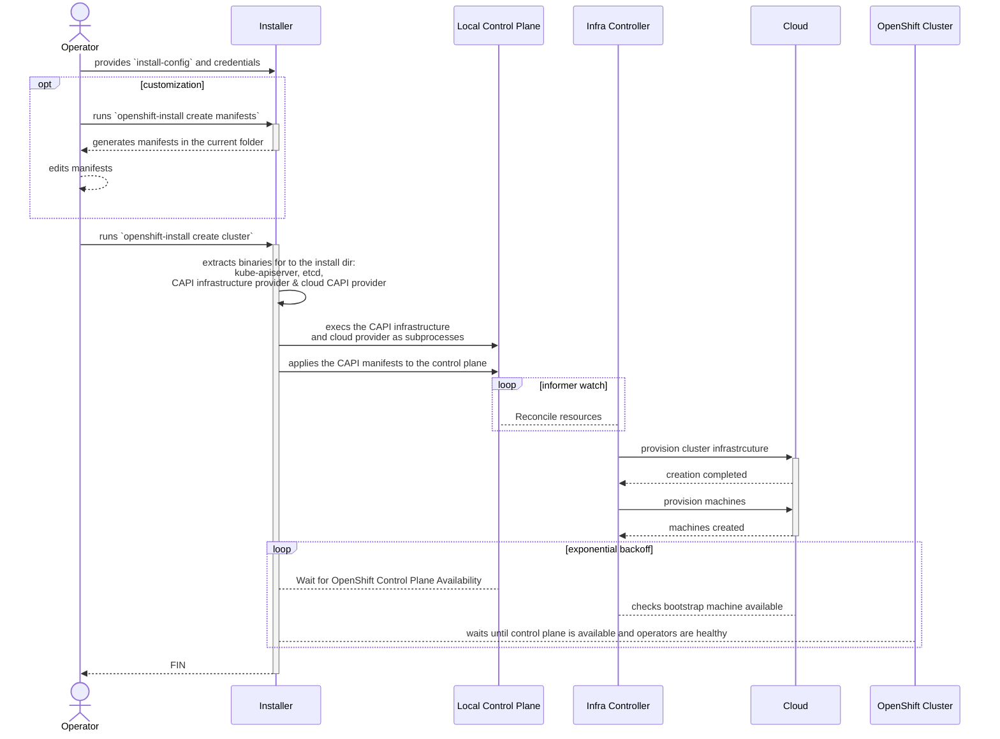

# Enabling Cluster-API-based Installations via openshift-install

## Summary

This enhancement discusses how `openshift-install` can use
cluster-api (CAPI) providers to provision cluster infrastructure,
without requiring access to an external management cluster or a local container runtime.
By running a Kubernetes control plane and CAPI-provider controllers as
subprocesses on the installer host, `openshift-install` can use CAPI and its
providers in a similar manner to how Terraform and its providers are currently
being used.

## Motivation

- OpenShift Alignment with CAPI: CAPI offers numerous potential benefits;
such as: day-2 infrastructure management, an API for users to edit cluster
infrastructure, and upstream collaboration. Installer support for CAPI would
be foundational for adopting these benefits.

- Terraform BSL License Change: due to the restrictive license change of
Terraform, `openshift-install` needs a framework to replace the primary
tool it used to provision cluster infrastructure. In addition to the benefits
listed above, CAPI provides solutions for the biggest gaps left by Terraform:
a common API for specifying infrastructure across cloud providers and robust
infrastructure error handling. Furthermore, removing Terraform will greatly
reduce the surface area for security vulnerabilities. Terraform and its providers
constitutes over half a million lines of code in the Installer repo and is directly
attributable for all (13) CVEs that have been fixed in the Installer repo.

-Streamline Installer development: a common pattern for Installer development
has been to reimplement control-plane features in Terraform that have already been
delivered upstream. By utilizing CAPI providers for Day-0 provisioning, our development
practices will remove this duplication and become more efficient.

### User Stories

- As an existing user of the installer, I want to continue to use the installer binary (e.g. `create cluster`) in the same environments and with existing automation.
- As an advanced user or cluster administrator, I want to be able to edit the CAPI infrastructure manifests so that I can customize control-plane infrastructure.


### Goals

- To provide a common experience across platforms for users and `openshift-install` developers
- To be backwards compatible and fully satisfy the requirements of install-config type APIs.
- To keep the user experience for day-zero operations unchanged or improved.
- To not require any new runtime dependencies.
- To maintain compatibility for hive, particularly regarding `destroy` functionality

### Non-Goals / Future work

- Non-goal: To maintain a consistent infrastructure footprint as clusters previously created with Terraform
- Non-goal: Support openshift cluster creation by using any tools other than `openshift-install`, such as `clusterctl`
- Future work: To optimize build processes or binary size (this will be prioritized ASAP in a separate design doc)
- Future work: To use an existing management cluster to install OpenShift
- Future work: To pivot the CAPI manifests to the newly-installed cluster to enable day-2 infrastructure management within the cluster.
- Future work: Replace Machine API (MAPI) with CAPI for day-2 machine management. This enhancement assumes we are still using MAPI Day 2.
- Future work: To provide an extensible framework to plug-in new infrastructure cloud providers.


## Proposal

The Installer will create CAPI infrastructure manifests based on user
input from the install config; then, in order to provision cluster infrastructure,
apply the manifests to CAPI controllers running on a local Kubernetes control-plane
setup by [envtest](https://pkg.go.dev/sigs.k8s.io/controller-runtime/pkg/envtest).

### Workflow Description

**cluster creator** is a human user responsible for deploying a
cluster. Note that the workflow does not change for this user.

**openshift-install** is the Installer binary.




In the case of an error in the final step, the Installer will bubble up resources with non-expected statuses.

#### Variation and form factor considerations [optional]


### API Extensions

As a result of this enhancement, API Extensions will only be used locally by the
local Installer control plane--they will not, until future work, be pivoted to the cluster.
The following are CRD references for Installer-supported platforms:

- AWS: [infrastructure.cluster.x-k8s.io/v1beta2][awsCRD]
- Azure/AzureStack: [infrastructure.cluster.x-k8s.io/v1beta1][azureCRD]
- Baremetal: [infrastructure.cluster.x-k8s.io/v1beta1][metalCRD]
- GCP: [infrastructure.cluster.x-k8s.io/v1beta1][gcpCRD]
- IBMCloud/PowerVS: [infrastructure.cluster.x-k8s.io/v1beta2][ibmCRD]
- Nutanix: [infrastructure.cluster.x-k8s.io/v1beta1][nutanixCRD]
- OpenStack: [infrastructure.cluster.x-k8s.io/v1alpha7][openstackCRD]
- vSphere: [infrastructure.cluster.x-k8s.io/v1beta1][vsphereCRD]

### Implementation Details/Notes/Constraints [optional]

#### Overview

In a typical CAPI installation, manifests indicating the desired cluster configuration are applied to a
management cluster. In order to keep `openshift-install` free of new external runtime dependencies,
the management-cluster dependencies will be [embedded][embed] into the `openshift-install` binary,
extracted at runtime, and cleaned up afterward.  This approach is similar to what we have been using
for Terraform.

In its current configuration, the Installer embeds the Terraform and cloud-specific provider binaries
within the `openshift-install` binary and extracts them at runtime. The Installer produces the Terraform
configuration files and invokes Terraform using the `tf-exec` library.


We can follow a similar pattern to run CAPI controllers locally on the Installer host. In addition
to the CAPI controller binaries, `kube-apiserver` and `etcd` are embedded in order to run a local
control plane, orchestrated with `envtest`.


#### Local control plane

The local control plane is setup using the previously available work done in Controller Runtime through [envtest][envtest].
Envtest was born due to a necessity to run integration tests for controllers against a real API server, register webhooks
(conversion, admission, validation), and managing the lifecycle of Custom Resource Definitions.

Over time, `envtest` matured in a way that now can be used to run controllers in a local environment,
reducing or eliminating the need for a full Kubernetes cluster to run controllers.

At a high level, the local control plane is responsible for:
- Setting up certificates for the apiserver and etcd.
- Running (and cleaning up, on shutdown) the local control plane components.
- Installing any required component, like Custom Resource Definitions (CRDs)
    - For Cluster API core the CRDs are stored in `data/data/cluster-api/core-components.yaml`.
    - Infrastructure providers are expected to store their components in `data/data/cluster-api/<name>-infrastructure-components.yaml`
- Upon install, the local control plane takes care of modifying any webhook (conversion, admission, validation) to point to the `host:post` combination assigned.
    - Each controller manager will have its own `host:port` combination assigned.
    - Certificates are generated and injected in the server, and the client certs in the api-server webhook configuration.
- For each process that the local control plane manages, a health check (ping to `/healthz`) is required to pass similarly how, when running in a Deployment, a health probe is configured.

#### Manifests

The Installer will produce the CAPI manifests as part of the `manifests` target, writing them to a new
`cluster-api` directory alongside the existing `manifests` and `openshift` directories:

```shell=
$ ./openshift-install create manifests --dir install-dir
INFO Credentials loaded from the "default" profile in file "~/.aws/credentials"
INFO Consuming Install Config from target directory
INFO Manifests created in: install-dir/cluster-api, install-dir/manifests and install-dir/openshift
$ tree install-dir/cluster-api/
install-dir/cluster-api/
├── 00_capi-namespace.yaml
├── 01_aws-cluster-controller-identity-default.yaml
├── 01_capi-cluster.yaml
├── 02_infra-cluster.yaml
├── 10_inframachine_mycluster-6lxqp-master-0.yaml
├── 10_inframachine_mycluster-6lxqp-master-1.yaml
├── 10_inframachine_mycluster-6lxqp-master-2.yaml
├── 10_inframachine_mycluster-6lxqp-master-bootstrap.yaml
├── 10_machine_mycluster-6lxqp-master-0.yaml
├── 10_machine_mycluster-6lxqp-master-1.yaml
├── 10_machine_mycluster-6lxqp-master-2.yaml
└── 10_machine_mycluster-6lxqp-master-bootstrap.yaml

1 directory, 12 files
```

The manifests within this `cluster-api` directory will not be written to the cluster or included in bootstrap ignition.
In future work, we expect these manifests to be pivoted to the cluster to enable the target cluster to take over managing
its own infrastructure.

The Cluster API manifests will be generated with `.spec` fields in the [manifest asset target][asset] with `.status`
updated after cluster creation.

#### Infrastructure Provisioning

##### CAPI Provisioning

The CAPI infrastructure manifests determine the infrastructure resources that will be provisioned by the CAPI controllers.
Here is an example AWS infra cluster manifest from the proof-of-concept implementation:

```shell
$ cat cluster-api/02_infra-cluster.yaml
apiVersion: v1beta2
kind: AWSCluster
metadata:
  creationTimestamp: null
  name: capi-example-kbdpg
  namespace: openshift-cluster-api-guests
spec:
  bastion:
    enabled: false
  controlPlaneEndpoint:
    host: ""
    port: 0
  controlPlaneLoadBalancer:
    additionalListeners:
    - port: 22623
      protocol: TCP
    crossZoneLoadBalancing: false
    loadBalancerType: nlb
    name: capi-example-kbdpg-ext
    scheme: internet-facing
  network:
    additionalControlPlaneIngressRules:
    - description: MCS traffic from cluster network
      fromPort: 22623
      protocol: tcp
      sourceSecurityGroupRoles:
      - node
      - controlplane
      toPort: 22623
    - description: controller-manager
      fromPort: 10257
      protocol: tcp
      sourceSecurityGroupRoles:
      - controlplane
      - node
      toPort: 10257
    - description: kube-scheduler
      fromPort: 10259
      protocol: tcp
      sourceSecurityGroupRoles:
      - controlplane
      - node
      toPort: 10259
    cni:
      cniIngressRules:
      - description: ICMP
        fromPort: -1
        protocol: icmp
        toPort: -1
       # several rules omitted for brevity
      - description: Service node ports (UDP)
        fromPort: 30000
        protocol: udp
        toPort: 32767
    vpc:
      availabilityZoneSelection: Ordered
      availabilityZoneUsageLimit: 3
      cidrBlock: 10.0.0.0/16
  region: us-east-2
  s3Bucket:
    name: openshift-bootstrap-data-capi-example-kbdpg
    presignedURLDuration: 1h0m0s
status:
  networkStatus:
    apiServerElb:
      attributes: {}
  ready: false
```

This manifest describes the network, load balancers, security group rules, etc. that will be used or provisioned for
the target cluster. Control plane machines are provisioned by [AWSMachines][AWSMachines] & [CAPI Machines][CAPIMachines]
manifests.

##### Additional Infrastructure

The Installer will generate any additional infrastructure that is needed but not handled by the CAPI provider, either
because it is out of scope (e.g. IAM, DNS) or not adopted upstream (e.g. split-horizon load balancers). The Installer
will provide hooks into the provisioning lifecycle that can be used to provision resources using direct SDK calls
or other tooling.

The AWS proof-of-concept implementation utilizes hooks defined in this interface:

```go
type CAPIInfraHelper interface {
	// PreProvision is called before provisioning using CAPI controllers has begun.
	// and should be used to create dependencies needed for CAPI provisioning,
	// such as IAM roles or policies.
	PreProvision(in PreProvisionInput) error

	// ControlPlaneAvailable is called once cluster.Spec.ControlPlaneEndpoint.IsValid()
	// returns true, typically after load balancers have been provisioned. It can be used
	// to create DNS records.
	ControlPlaneAvailable(in ControlPlaneAvailableInput) error
}

type PreProvisionInput struct{ clusterID string }
type ControlPlaneAvailableInput struct{ *clusterv1.Cluster }
```

For AWS, IAM roles needed by the CAPA provider are created with `PreProvision` and DNS Records
are created upon `ControlPlaneAvailable`. This interface would be implemented by each cloud provider
and can be expanded as needed.

##### Bootstrap Resources

The Bootstrap Machine is created like the other control plane nodes, by defining a CAPI Machine resource.
Accordingly, the bootstrap machine can be deleted by simply deleting the object. This works for all platforms:

```go
	if err := c.Delete(ctx, &clusterv1.Machine{
		ObjectMeta: metav1.ObjectMeta{
			Name:      capiutils.GenerateBoostrapMachineName(metadata.InfraID),
			Namespace: capiutils.Namespace,
		},
	});
```

Further work needs to be done to determine how to delete additional bootstrap resources, such as SSH security group rules
and the bootstrap ignition S3 bucket. These could be deleted either through updating the relevant manifests or created &
deleted out-of-band using hooks.

### Risks and Mitigations

While we do not expect these changes to introduce a significant security risk, we are working with product security teams
to ensure they are aware of the changes and are able to review.


### Drawbacks

By depending on CAPI providers whose codebases live in a repository external to the Installer,
the process for developing features and delivering fixes is more complex than in a monolothic repo.
While the same could be true for the Installer Terraform dependency; the CAPI providers will
be more actively developed than their Terraform counterparts. Furthermore, it will be necessary
to ensure that the CAPI providers used by the Installer match the version of those in the payload.

While this external dependency is a significant drawback, it is not unique to this design
and is common throughout OpenShift (e.g. any time the API or library-go must be updated
before being vendored into a component). To minimize the devex friction, we will focus
on documenting a workflow for developing providers while working with the Installer.

Additionally, we will explore designs to solve or mitigate these issues.

## Design Details

### Open Questions [optional]

1. UX design during install process as well as during failure (log collection). The Installer will dump
(potentially prettified) controller logs. We expect that this question will become easier to answer further
into the development process.

2. Whether to use downstream OpenShift-specific `kube-apiserver` and `etcd` dependencies and how to source them?

3. When should the Installer declare infrastructure provisioning failed?

### Test Plan

As this is replacing existing functionality in the Installer, we can rely on existing
testing infrastructure.

### Graduation Criteria


#### Dev Preview -> Tech Preview

- Ability to utilize the enhancement end to end
- End user documentation, relative API stability

#### Tech Preview -> GA

- More testing (upgrade, downgrade, scale)
- Sufficient time for feedback
- Available by default
- User facing documentation created in [openshift-docs](https://github.com/openshift/openshift-docs/)


#### Removing a deprecated feature

- Announce deprecation and support policy of the existing feature
- Deprecate the feature

### Upgrade / Downgrade Strategy

As this enhancement only concerns the Installation process and affects only the underlying cluster
infrastructure, this change should not affect existing cluster upgrades.

### Version Skew Strategy

N/A

### Operational Aspects of API Extensions

N/A

#### Failure Modes

During a failed install, the controller logs will contain useful information. The status of the CAPI manifests
may also contain useful information,in which case it would be important to display that to users and collect
for bugs and support cases. There is an open question about the best way to handle this UX, and we expect the answer to become more clear during development.

As the infrastructure will be reconciled by a controller, it will be possible to resolve issues during an ongoing
installation, although this would not necessarily be a feature we would call attention to for documented use cases.

Finally, the Installer will need to be able to identify when infrastructure provisioning has failed during an installation.
Initially this will be achieved through a timeout. There is an open question about whether this can be done in a more
sophisticated manner.

#### Support Procedures

When infrastrucutre provisioning has failed, users will need to collect the log bundle (see previous section
regarding the open question for the log bundle).

As the providers will be running in a control loop, it would be possible to resolve certain issues
(e.g. fix missing permissions or delete resources taking up quota) during an installation, but this would
not be a documented procedure. Furthermore, it would be possible to make the installs re-entrant, but
it would not be a goal for simplicity's sake.

## Implementation History

Major milestones in the life cycle of a proposal should be tracked in `Implementation
History`.

## Alternatives

Using other infrastructure-as-code alternatives such as Pulumi, Ansible, or OpenTofu
all have their own individual drawbacks. We prefer the CAPI solution over
these alternatives because it:

* streamlines Installer development (we do not need to re-implement features for the control plane)
* lays the foundation for OpenShift to implement future CAPI features
* requires less development effort, as CAPI providers are already setup to provision infrastructure for a cluster

It would also be possible to implement the installation using direct SDK calls for the cloud provider. In addition
to the reasons stated above, using individual SDK implementations would not present a common framework across various
cloud platforms.


## Infrastructure Needed [optional]

Use this section if you need things from the project. Examples include a new
subproject, repos requested, github details, and/or testing infrastructure.

Listing these here allows the community to get the process for these resources
started right away.

[embed]: https://pkg.go.dev/embed
[envtest]: https://github.com/kubernetes-sigs/controller-runtime/tree/main/tools/setup-envtest
[awsCRD]: https://cluster-api-aws.sigs.k8s.io/crd/#infrastructure.cluster.x-k8s.io%2fv1beta2
[azureCRD]: https://capz.sigs.k8s.io/reference/v1beta1-api#infrastructure.cluster.x-k8s.io%2fv1beta1
[gcpCRD]: https://doc.crds.dev/github.com/kubernetes-sigs/cluster-api
[ibmCRD]: https://doc.crds.dev/github.com/kubernetes-sigs/cluster-api-provider-ibmcloud
[metalCRD]: https://github.com/metal3-io/cluster-api-provider-metal3/blob/main/api/v1beta1/metal3cluster_types.go
[nutanixCRD]: https://opendocs.nutanix.com/capx/latest/types/nutanix_cluster/
[openstackCRD]: https://github.com/kubernetes-sigs/cluster-api-provider-openstack/blob/main/api/v1alpha7/openstackcluster_types.go
[vsphereCRD]: https://github.com/kubernetes-sigs/cluster-api-provider-vsphere/blob/main/apis/v1beta1/vspherecluster_type.
[asset]: https://github.com/openshift/installer/blob/master/docs/design/assetgeneration.md
[AWSMachines]: https://github.com/openshift/installer/blob/ba66fc691e67b9bfe04204c3ece98e1386f66057/pkg/asset/machines/aws/awsmachines.go#L57-L85
[CAPIMachines]: https://github.com/openshift/installer/blob/master/pkg/asset/machines/aws/awsmachines.go#L100-L118
