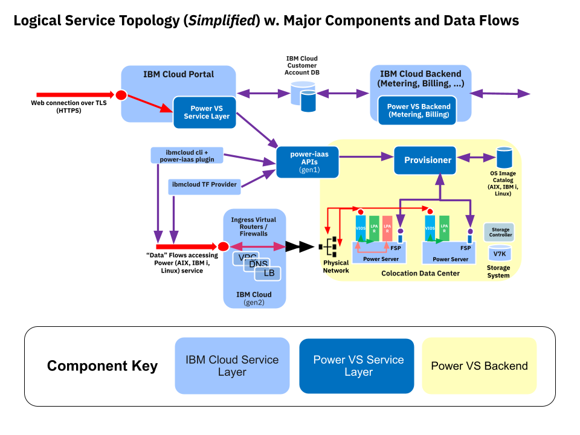
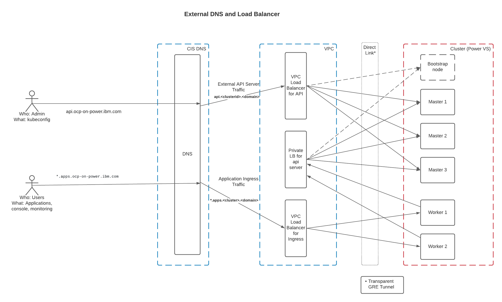

# ibm-cloud-provider-for-power-vs-platform

## Release Signoff Checklist

- [x] Enhancement is `implementable`
- [ ] Design details are appropriately documented from clear requirements
- [ ] Test plan is defined
- [ ] Operational readiness criteria is defined
- [ ] Graduation criteria for tech preview and GA
- [ ] User-facing documentation is created in [openshift-docs](https://github.com/openshift/openshift-docs/)

## Summary

This document describes how the [IBM Cloud][ibm-cloud-website] can be leveraged to provide infrastructure to deploy
OpenShift on the [Power Virtual Server][power-vs-website] offering. Power Virtual Server, or Power VS, is an IBM Cloud
offering that aims to provide customers interested in running secure and flexible workloads on IBM Power (ppc64le)
hardware without having to develop and maintain on-premise datacenters. The goal of this enhancement would be to
leverage the IBM Cloud APIs to deploy an OpenShift cluster on this cloud instance hardware. In addition, the APIs would
be leveraged for cluster resizing operations post-installation.

## Motivation

- Current deployments of OpenShift on Power use UPI, except for the development only configuration of IPI on
libvirt.
- Currently, the Multi-Arch team is using a development configuration (IPI on libvirt) to cover our CI workloads
for OpenShift on ppc64le verification. This would help diversify and scale our CI effort.
- Power hardware is especially targeted to AI and secure workloads, so building out cloud capabilities will help expand
our workload footprint.
- IPI is generally easier to install and set up quickly for demos and proof of concepts which can help lower the barrier
of entry for Power-optimized workloads.

### Goals

- Provide a way to install OpenShift on Power VS infrastructure using the OpenShift installer with IPI provisioned
against IBM Cloud APIs.
- Implement the machine-api controllers to provide scaling and managing the cluster nodes post-install.

### Non-Goals

- UPI support. We've already documented how to install on pp64le hardware using UPI.

## Proposal

To leverage the Power VS platform, we will make use of the Power VS support in the [IBM Cloud Terraform
Provider][ibm-cloud-terraform-provider]. This provider will interface with IBM Cloud APIs and ultimately enable the
OpenShift Installer to provision VM resources using Power VS, which will be used as cluster nodes.
Unlike some of the existing providers, this depends on Red Hat Enterprise Linux CoreOS (RHCOS) availability in the
Power VS cloud in the OVA disk image format.

The expected workflow would be as follows:
1. The installer is invoked with an environmental variable API key to authenticate to the IBM Cloud.
2. Once invoked, the installer interacts with a terraform provider to create a new Power VS service.
3. The installer or terraform provider will then import a RHCOS OVA disk image file into the Power VS service from IBM
Cloud Object Storage, which creates a corresponding boot image and makes it available to the Power VS service.
4. Once imported the installer can start building the private network for the nodes.
5. The bootstrap and master nodes will be created in the private network. These are called Power VS instances, and
they get created using the RHCOS boot image.
6. To expose this private network and provide load balancing, the IBM Cloud APIs will leverage the IBM Cloud
[Direct Link][ibm-direct-link-website] offering. This will allow for both the ingress load balancer and the cluster nodes to
talk over the private network on a high-speed link.
7. Bootstrapping completes as normal.
8. The workers will be added using the openshift/[cluster-\*machine-\*] controllers and operators based on the OpenShift
MAPI model. A Power VS controller needs to be implemented and hooked into the [OpenShift Machine
Operator][openshift-machine-operator].
9. The cluster teardown can make use of the existing [go client for Power][power-go-client] via `openshift-install
destroy cluster`.

### User Stories

- A user of this installer would like to see a cluster running within an hour of kicking off the installer for a
default size (3 master and 2 worker) cluster.
- The expectation is that this is fully automated.

### API Extensions
None

### Implementation Details/Notes/Constraints

#### Existing APIs in the Upstream
There is a working [implementation of a machine API](https://github.com/openshift-powervs/cluster-api-provider-powervs)
we've created for testing purposes. Though not ready for upstream, many have been tested and found to be working, such
as the machine API and node update controller. This was tested with machineset as well, so things look promising.

#### Cloud Controller Manager
We are planning to reuse the [cloud-provider-ibm][cloud-provider-ibm] for everything except for the node controller. The
node objects are managed by the cluster-api-provider-powervs node controller.

#### Separate IBM Providers for VPC vs Power VS
One thing that has been asked and discussed is whether it is possible to create a single abstract IBM provider that
works with IBM VPC and Power VS. Unfortunately, there are very few similarities between the target environments outside
of authentication. The APIs, parameters, and image management are all completely different, so we believe the cleanest
implementation would be a separate provider.

### Risks and Mitigations

The Multi-Arch team has already mitigated much of the risks involved with coordinating a new ppc64le platform. We have
existing engagements with many of the teams that we will be working with to add this platform. For instance, we
already have a hardware environment capable of building the OVA images, a dedicated CI team to build out and analyze the
development-focused testing, and the underlying content release content we'd need to build for ppc64le by the ART team.

## Design Details


The Power Systems Virtual Servers (Power VS) are separated from the rest of the IBM Cloud servers with separate networks
and direct-attached storage. The internal networks are fenced but offer connectivity options to IBM Cloud infrastructure
or on-premises environments. Both public and private network is supported for instances (VMs). For public networks, only
limited ports are opened for inbound access and this is not configurable.

Basic Walkthrough:
1. The user creates a paid IBM Cloud Account (Power VS - or any infrastructure service, is not available for free accounts).
2. The user creates a Power VS service in a specific region.
3. The user creates a [DNS domain](#dns) in CIS.
4. The installer creates a private network in the Power VS service via terraform.
5. The installer [uploads/creates<sup>*</sup>](#coreos-ova) the required boot image via terraform.
6. The installer creates VMs according to specified [configurable](#install-config) values, which are configured via
terraform, bootstrapping, or in-cluster mechanisms such as MAPI:
- \# of CPU / Cores
- Shared vs. Dedicated CPUs
- [Machine type (s922 vs. e980)][power-cloud-instances]
- \# of Memory
- Boot Image [set in installer binary]
- Network (public, private) [optional]
- Additional disk volume(s)
- Storage Type (Tier 1 or 3)

<sup>*</sup>The `Disk capacity` property of the image as defined in the OVA is the size of the final boot image once
imported. The size and capacity can be different, and we're planning to keep the size as 16G with a default capacity of
120G. Just a note, the 16G refers to the raw disk file within the OVA, not the boot image.

[Power VS Reference Doc][power-vs-reference-doc]

### Installation Configuration
Power VS doesn't use cloud instance "flavors" with pre-defined cpus, memory, and storage.
Instead, we will have some defaults set in the installer. Storage will default to 120Gb to match the OVA disk image.
Both CPU and memory also have defaults, but can also be overridden in the install config. There are also options
for processor type and system type.

You can override these like so:
```yaml
compute:
- architecture: ppc64le
  hyperthreading: Enabled
  name: worker
  platform:
  - processors: 0.25
  - memory: 8
  - procType: shared
  - sysType: s922
  replicas: 3
controlPlane:
  architecture: ppc64le
  hyperthreading: Enabled
  name: master
  platform:
  - processors: 0.25
  - memory: 8
  - procType: shared
  - sysType: s922
  replicas: 3
```

When you're installing, you'll also need to specify an API key to authenticate. This is done by specifying the IBM_APIKEY
environment variable. This is then written to disk, and used again later. For a cluster destroy, this key should be set
locally using that environment variable as well.

Finally, here is a full sample of an **install-config.yaml** for a Power VS installation.
```yaml
baseDomain: powervs-ibm.com
compute:
- architecture: ppc64le
  hyperthreading: Enabled
  name: worker
  platform: {}
  replicas: 3
controlPlane:
  architecture: ppc64le
  hyperthreading: Enabled
  name: master
  platform: {}
  replicas: 3
metadata:
  creationTimestamp: null
  name: rdr-cln
networking:
  clusterNetwork:
  - cidr: 10.128.0.0/14
    hostPrefix: 23
  machineNetwork:
  - cidr: 10.0.0.0/16
  networkType: OpenShiftSDN
  serviceNetwork:
  - 172.30.0.0/16
platform:
  powervs:
    userid: clnperez@us.ibm.com
    serviceInstanceID: "some-id-string-here"
    powervsResourceGroup: "powervs-ipi-resource-group"
    region: lon
    zone: lon04
publish: External
pullSecret: ''
sshKey: ssh-rsa ...
```

### Networking
Here's a diagram highlighting how traffic flows through the components that make up a cluster on Power VS.


#### Load Balancing
When it came to load balancing, the best option we came up with was to use the IBM Cloud [VPC
Loadbalancer][vpc-loadbalancer-website] using the Direct Link since it allows us to provide an application load
balancer to the cluster that can talk directly to the private network created in the IBM Cloud VPC. It should be
noted that the VPC Loadbalancer comes at an additional cost to the user; however, the Direct Link service that
provides high-speed connection directly to the cluster's private network is included with a subscription to Power VS.

There will be two load balancers, one for public traffic, and one for internal traffic. Since load-balancers are not
available inside of Power VS, the solution is to use load balancers provided as part of the IBM Cloud VPC catalog.
The slight complication with this approach is that the VPC offerings are in IBM Cloud data centers. To connect the LB
traffic into the Power VS datacenter, we'll need to set up a [Direct Link][ibm-direct-link-website] connection between
the two (VPC and Power VS). This is a high-speed link meant to connect IBM DCs and other colocated datacenters.
Each of these things (VPC, networks, and Direct Link connection) will be created via the IBM Cloud Terraform provider.

#### DNS
The Power VS provider will use the same DNS solution as the IBM Cloud provider: DNS provided by
[IBM CIS][ibm-cis-website]. A user will be required to create a DNS domain in CIS before beginning an install and
provide it to the installer.

Further information about CIS can be found in the [official docs][ibm-cis-docs-website].

#### Ingress
From an ingress perspective, the IBM CIS DNS, IBM Cloud VPC Loadbalancer, and Direct Link services are all created
via terraform at install time. In that sense, the extra networking via Direct Link is invisible to ingress operator,
as because it is managing DNS & the Load Balancer (which is already set up with an active tunnel). More information on 
the specifics of these interactions is available in [JIRA](<https://issues.redhat.com/browse/MULTIARCH-1103>).

### Persistent Storage
At launch, the planned support for storage (for PV & PVCs) is NFS & ODF as day 2 configuration options.
On the roadmap, we would be looking into [Spectrum Scale][ibm-spectrum-scale-website] as a day 2 configuration as well as a
CSI driver for Power VS. These features would look to be enabled in a future release of OpenShift.

### VM & Image Registry Storage
The VM instances in Power VS will be initialized with 120GB disks. For installation, the registry will be backed
by
`emptyDir`, but this can be changed as part of day 2 configuration (see [Persistent Storage](<#Persistent-Storage>)).

### Red Hat Enterprise Linux CoreOS (RHCOS) OVA
The RHCOS build pipeline would publish an OVA disk image to the IBM Cloud Object Storage (COS) buckets in each
supported region. Then, we will use the IBM Cloud terraform provider to import the image to the desired Power VS
instance, transforming it into an installable boot image when it does so. The cluster-api-provider will later
reference this same boot image to add workers.

### Machine Config
The hostname for the node is configured through the afterburn service which reads the hostname from the metadata in the
config drive. More details can be seen the machine configuration operator [patch][machine-config-operator-patch].

### Open Questions

#### CI Plan
Currently, Multi-Arch CI for Power connects to dedicated hardware provided by IBM and provisions clusters using IPI for
libvirt, which isn't a supported customer configuration.

Most likely this will be extended to Power VS in two steps:
1. We will extend our current working model to support testing against the IBM Cloud APIs from the x86 build farms.
2. We will create a PROW build farm running on Power that will be able to dynamically create images needed to natively
test this platform and migrate our jobs to use this build farm to orchestrate our jobs.

### Test Plan

Multi-Arch currently tests results by running upgrade and e2e tests with the OpenShift Prow CI environment. Our test
plan would extend this to include these IPI scenarios. Additionally, new documentation will be needed for Power VS,
and the test plan will incorporate review and validation of this.

### Graduation Criteria

- Our initial target is to work towards a `Tech Preview`, then graduate towards future milestones. This is expected to
take a total of two releases but could be more or less depending on how quickly we meet the requirements enumerated in
the graduation criteria.
- `Tech Preview` will graduate to `GA` in OpenShift
- Our current target for `Tech Preview` is OpenShift 4.11, but this will be reevaluated as work progresses. Commitments
are tracked in the Multi-Arch program sign-off documents for each release, which is created as part of Quarterly
Planning.
- [Deprecation policy][deprecation-policy]

[deprecation-policy]: https://kubernetes.io/docs/reference/using-api/deprecation-policy/

#### Dev Preview -> Tech Preview
The intent is to skip the developer preview phase since we are not looking for any developer feedback.

#### Tech Preview Requirements

- [ ] Implemented APIs necessary for IPI installation
- [ ] Full functionality / ability to utilize the enhancement end to end
- [ ] Full installation takes at most an hour
- [ ] Power VS recognizes RHCOS as an image type (currently labeled as RHEL)
- [ ] DHCP requirement solved by the Power VS team
- [ ] Builds of RHCOS are available in the IBM Cloud for installation
- [ ] Defined which installation criteria belong in the installer and which are day 2 configurations
- [ ] End-user documentation
- [ ] Tile up
- [ ] CI e2e jobs created to cover installation against this platform
- [ ] Plan defined & support engaged to gather feedback from users

#### Tech Preview -> GA
- [ ] CI has been upgraded to cover testing of modifications to the installer (PR validation)
- [ ] CI "soak" for to ensure a stable baseline
- [ ] Final optimizations for install time
- [ ] Expanded testing (upgrade, downgrade, scale, load/performance)
- [ ] Documentation is finalized

#### Removing a deprecated feature

- Announce deprecation and support policy of the existing feature
- Deprecate the feature

### Upgrade / Downgrade Strategy

All upgrade and downgrade expectations are the same for existing IPI deployments.

### Version Skew Strategy

This should be the same as other IPI deployments.

### Operational Aspects of API Extensions
N/a

#### Failure Modes
N/a

#### Support Procedures
N/a

## Implementation History

Major milestones in the life cycle of a proposal should be tracked in `Implementation History`.

## Drawbacks

The greatest argument against IPI on Power VS would be the opportunity cost. That said, for the Multi-Arch team, we believe
this is the best return on investment when compared to the many other platforms asked of our team.

## Alternatives

The are other options for supporting IPI for Power hardware. One option we use internally is IPI on KVM via libvirt;
however, as this is not supported outside of development purposes for x86 and KVM adoption on Power goes against the
market preference for PowerVM based virtualization, we believe that targeting the IBM Cloud is the best option we have
available to us currently. PowerVM and PowerVC are also options; however, both require expanding RHEL support to new
hypervisors, which poses long-term sustainability challenges.

## Infrastructure Needed

Many on the Multi-Arch team have already gotten development access to the IBM Cloud. Involved parties should coordinate
access with rsene@redhat.com.

[ibm-cloud-website]: https://www.ibm.com/cloud?p1=Search&p4=43700051838804081&p5=e&gclid=EAIaIQobChMIn77Qwqqi8AIV2_6zCh3gdAe8EAAYASAAEgJV9_D_BwE&gclsrc=aw.ds
[power-vs-website]: https://www.ibm.com/cloud/power-virtual-server
[ibm-direct-link-website]: https://www.ibm.com/cloud/direct-link
[power-vs-reference-doc]: https://cloud.ibm.com/docs/power-iaas?topic=power-iaas-creating-power-virtual-server
[vpc-loadbalancer-website]: https://cloud.ibm.com/docs/vpc?topic=vpc-nlb-vs-elb
[ibm-cloud-terraform-provider]: https://github.com/IBM-Cloud/terraform-provider-ibm
[openshift-machine-operator]: https://github.com/openshift/machine-api-operator
[power-go-client]: https://github.com/IBM-Cloud/power-go-client
[power-cloud-instances]: https://cloud.ibm.com/apidocs/power-cloud#pcloud-pvminstances-post
[ibm-spectrum-scale-website]: https://www.ibm.com/products/spectrum-scale
[ibm-cis-website]: https://cloud.ibm.com/catalog/services/internet-services#about
[ibm-cis-docs-website]: https://cloud.ibm.com/docs/cis?topic=cis-about-ibm-cloud-internet-services-cis
[cloud-provider-ibm]: https://github.com/openshift/cloud-provider-ibm
[machine-config-operator-patch]: https://github.com/openshift/machine-config-operator/pull/2801
