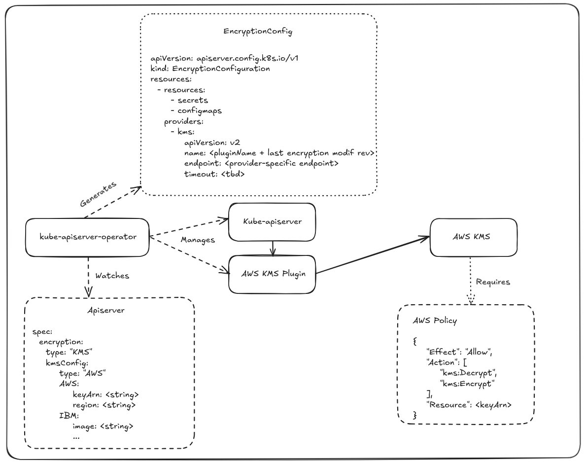

# KMS Encryption Provider for etcd Secrets

## Summary

Provide a user-configurable interface to support encryption of data stored in etcd using a supported Key Management Service (KMS).

## Motivation

Today, we support local AES encryption at the datastore layer. It protects against etcd data leaks in the event of a etcd backup compromise. However, aescbc and aesgcm, which are supported encryption technologies today available in OpenShift do not protect against online host compromise i.e. in such cases, attackers can decrypt encrypted data from etcd using local keys, KMS managed keys protects against such scenarios.

Users of OpenShift would like to encrypt secret data in etcd using self-managed KMS-backed keys.
- https://issues.redhat.com/browse/OCPSTRAT-108

### User Stories

As an OpenShift administrator, I want to encrypt secrets in my cluster at rest using KMS keys so that I can comply with my organization's security requirements.

As an OpenShift administrator, I want to let the KMS provider manage the lifecycle of the encryption keys. 

As an OpenShift user, I enable encryption by setting apiserver.spec.encryption.type to kms.
- After some time passes, a user makes a backup of etcd.
- The user confirms that the secret values are encrypted by checking to see if they have the related KMS prefix.

### Goals

1. User can enable encryption (globally, with limited config)
2. The keys used to encrypt are managed by the KMS instance (outside of the OpenShift control plane)
3. The keys used to encrypt are periodically rotated automatically 
4. Allow encryption to be disabled once it has been enabled
5. Encryption at rest should not meaningfully degrade the performance of the cluster
6. Allow the user to configure which KMS instance and keys are to be used, adopt KMSv2 from upstream

### Non-Goals

1. Allow the user to force key rotation
2. Support for the complete lifecycle of KMS-managed keys directly within OpenShift control-plane
3. Support for hardware security modules
4. The user has an in-depth understanding of each phase of the encryption process
5. Completely recover the cluster in the event of the KMS instance itself going down or keys getting lost
6. Allow users to configure which resources will be encrypted

## Proposal

To support KMS encryption in OpenShift, we will be able to leverage the work that was done in [upstream Kubernetes](https://kubernetes.io/docs/tasks/administer-cluster/kms-provider/). However, we will need to extend and adapt the encryption workflow in OpenShift to support new constraints introduced by the externalization of encryption keys in a KMS. Because OpenShift will not own the keys from the KMS, we will also need to provide tools to the users to detect KMS-related failures and take action toward recovering their clusters whenever possible.

There exist two versions of the KMS API upstream today. In OpenShift, we specifically want to use KMS v2 only as it is an optimized version of the first API that is more production-ready than its predecessor, which was infamous for its impact on performance and the pressure it puts on the KMS.

In OpenShift, we will add a new encryption type to the list in the apiserver API as `kms`, similar to the list of possible encryption providers from the apiserver's [EncryptionConfig](https://github.com/kubernetes/apiserver/blob/cccad306d649184bf2a0e319ba830c53f65c445c/pkg/apis/apiserver/types_encryption.go#L89-L101).

Unlike the other providers, KMS will require additional configuration from the users. Because of that, we will add a new configuration to the API to allow users to configure the connection to their KMS. In this new API, users will be able to configure some options specific to the KMS provider they want to use. There will be dedicated APIs for each KMS supported by OpenShift.

From a UX perspective, these are the only changes the KMS feature will introduce. It is intentionally minimal to reduce the burden on the users and the potential for errors.

In practice, this feature will re-use as much of the existing encryption logic as possible. It will leverage the existing encryption and migration workflow introduced for AES-CBC and AES-GCM. However, unlike the aescbc and aesgcm providers, the encryption keys for KMS are not managed by the apiserver operators, so we have to extend the existing controllers to support that new workflow. On top of that, the operators used to be in charge of rotating the keys, but it will now be in the hands of the users to rotate the keys. We will need to introduce a new workflow to react when keys are rotated in the external KMS to make sure that the encrypted data is migrated to use the new key.

### KMS plugins

One aspect of the upstream feature that wasn't mentioned yet is that it requires a third-party application called a KMS plugin to bridge between the apiservers and the KMS. In OpenShift, these plugins will be configured and managed by the kube-apiserver-operator. There are multiple reasons behind this choice:

1. Reduces the complexity for the users that want to use the KMS feature
2. Simplifies key rotation when users manually rotate the key because it requires creating a second instance of the plugin that would use the new key while the old plugin would still allow using the old key as a read key
3. It is cheap to maintain the plugins as we can either leverage the upstream communities or the vendors
4. Have more trust and guarantees towards the plugins that will be running in the platform

Plugins available in the open will be forked and maintained downstream. The images for these plugins will be published and distributed on the official Red Hat registry in the same way as they are today for HyperShift.
Existing forks include:

* https://github.com/openshift/aws-encryption-provider/
* https://github.com/openshift/azure-kubernetes-kms/

For the plugins we can't distribute, an `image` field will be available in the relevant KMS API to allow users to configure the plugin.

In the future, we will also be able to think about ways to qualify new plugins to be distributed and supported by OCP.

### API Extensions

While in tech-preview, the KMS feature will be placed behind the `KMSEncryptionProvider` feature-gate.

OpenShift would need to align closer with KMS evolution upstream with respect to the different Kubernetes Encryption Providers available today. 

Adding a new `EncryptionType` to the existing `APIServer` config:

```diff
diff --git a/config/v1/types_apiserver.go b/config/v1/types_apiserver.go
index d815556d2..c9098024f 100644
--- a/config/v1/types_apiserver.go
+++ b/config/v1/types_apiserver.go
@@ -208,6 +225,11 @@ const (
        // aesgcm refers to a type where AES-GCM with random nonce and a 32-byte key
        // is used to perform encryption at the datastore layer.
        EncryptionTypeAESGCM EncryptionType = "aesgcm"
+
+       // kms refers to a type of encryption where the encryption keys are managed
+       // outside the control plane in a Key Management Service instance,
+       // encryption is still performed at the datastore layer.
+       EncryptionTypeKMS EncryptionType = "KMS"
 )
```

The default value today is an empty string, which implies identity and that no encryption is used in the cluster by default. Other possible local encryption schemes include `aescbc` and `aesgcm`, which will remain as-is. Similar to how local AES encryption works, the apiserver operators will observe this config and apply the KMS EncryptionProvider to the EncryptionConfig.

```diff
@@ -191,9 +194,23 @@ type APIServerEncryption struct {
        // +unionDiscriminator
        // +optional
        Type EncryptionType `json:"type,omitempty"`
+
+       // kms defines the configuration for the external KMS instance that manages the encryption keys,
+       // when KMS encryption is enabled sensitive resources will be encrypted using keys managed by an
+       // externally configured KMS instance.
+       //
+       // The Key Management Service (KMS) instance provides symmetric encryption and is responsible for
+       // managing the lifecyle of the encryption keys outside of the control plane.
+       // This allows integration with an external provider to manage the data encryption keys securely.
+       //
+       // +openshift:enable:FeatureGate=KMSEncryptionProvider
+       // +unionMember
+       // +optional
+       KMS *KMSConfig `json:"kms,omitempty"`
```

As mentioned before, the KMS encryption type will have a dedicated configuration.

```diff
diff --git a/config/v1/types_kmsencryption.go b/config/v1/types_kmsencryption.go
new file mode 100644
index 000000000..8841cd749
--- /dev/null
+++ b/config/v1/types_kmsencryption.go
@@ -0,0 +1,49 @@
+package v1
+
+// KMSConfig defines the configuration for the KMS instance
+// that will be used with KMSEncryptionProvider encryption
+// +kubebuilder:validation:XValidation:rule="has(self.type) && self.type == 'AWS' ?  has(self.aws) : !has(self.aws)",message="aws config is required when kms provider type is AWS, and forbidden otherwise"
+// +union
+type KMSConfig struct {
+       // type defines the kind of platform for the KMS provider
+       //
+       // +unionDiscriminator
+       // +kubebuilder:validation:Required
+       Type KMSProviderType `json:"type"`
+
+       // aws defines the key config for using an AWS KMS instance
+       // for the encryption. The AWS KMS instance is managed
+       // by the user outside the purview of the control plane.
+       //
+       // +unionMember
+       // +optional
+       AWS *AWSKMSConfig `json:"aws,omitempty"`
+}

+// KMSProviderType is a specific supported KMS provider
+// +kubebuilder:validation:Enum=AWS
+type KMSProviderType string
+
+const (
+       // AWSKMSProvider represents a supported KMS provider for use with AWS KMS
+       AWSKMSProvider KMSProviderType = "AWS"
+)
```

This configuration will also include an enum of the various KMS supported by OCP. At first, it will only have the `AWS` type, but we will add more as we progress on the feature. This enum is essential to avoid potential ambiguities that might arise with future KMS.

Each KMS type will have a dedicated configuration that will be reflected on the plugin when installed. It will only be a partial representation of the plugin's configuration because most fields are irrelevant to the end users. 

At first, this configuration will only include the `AWSKMSConfig`, but more KMS-specifc configs will be added as we include new KMS. 

```diff
+// AWSKMSConfig defines the KMS config specific to AWS KMS provider
+type AWSKMSConfig struct {
+	// keyARN specifies the Amazon Resource Name (ARN) of the AWS KMS key used for encryption.
+	// The value must adhere to the format `arn:aws:kms:<region>:<account_id>:key/<key_id>`, where:
+	// - `<region>` is the AWS region consisting of lowercase letters and hyphens followed by a number.
+	// - `<account_id>` is a 12-digit numeric identifier for the AWS account.
+	// - `<key_id>` is a unique identifier for the KMS key, consisting of lowercase hexadecimal characters and hyphens.
+	//
+	// +kubebuilder:validation:Required
+	// +kubebuilder:validation:XValidation:rule="self.matches('^arn:aws:kms:[a-z0-9-]+:[0-9]{12}:key/[a-f0-9-]+$') && self.size() <= 128",message="keyARN must follow the format `arn:aws:kms:<region>:<account_id>:key/<key_id>`. The account ID must be a 12 digit number and the region and key ID should consist only of lowercase hexadecimal characters and hyphens (-)."
+	KeyARN string `json:"keyARN"`
+	// region specifies the AWS region where the KMS intance exists, and follows the format
+	// `<region-prefix>-<region-name>-<number>`, e.g.: `us-east-1`.
+	// Only lowercase letters and hyphens followed by numbers are allowed.
+	//
+	// +kubebuilder:validation:XValidation:rule="self.matches('^[a-z]{2}-[a-z]+-[0-9]+$') && self.size() <= 64",message="region must be a valid AWS region"
+	Region string `json:"region"`
+}
```

From a very high-level, the figure below shows how the new APIs will be used by the various components.



### Implementation Details/Notes/Constraints

Extend the existing KMSv2 encryption provider from upstream kubernetes apiserver and allow users to configure a KMS plugin provider of their choice to use for etcd secret encryption.

Today, apiserver encryption encrypts only the following resources (and the same would remain unchanged going forward):
- corev1.Secret
- corev1.ConfigMap
- routev1.Route
- oauthv1.AccessToken
- oauthv1.AuthorizeToken

The addition of KMS encryption provider requires addition of a gRPC unix socket running in each of the control plane nodes which will use hostPath mount by the kms provider plugin. The implementation of each KMS provider's plugin is OpenShift agnostic but apiserver(s) will re-use the same directory from the host to perform Encrypt/Decrypt/Status gRPC calls to the running plugin.

For our initial iteration, we plan to manage the lifecycle of the plugin pods however not the plugin itself; this can change in the future.

## Design Details

All of the apiserver(s) in OpenShift (i.e. kube-apiserver, openshift-apiserver, oauth-apiserver) use the [library-go encryption controller set implementation](https://github.com/openshift/library-go/blob/master/pkg/operator/encryption/controllers.go) managed by their respective operators to manage the encryption key and configs jointly. In case, of KMS the keys are managed by the external KMS instance endpoint however the config state would reuse an extension of the same controllers' logic. The controllers today support migration in terms of encryption/decryption of resources, by considering the user-configured value of `spec.encryption.type` as the desired state of encryption across all control-plane nodes of the cluster. The responsibilities of the controller set are as follows:
1. Key controller
  - manages the persistence state of local encryption keys like aescbc, aescgcm, etc.
  - backs up the keys in the control plane etcd as Kube Secrets in a central `openshift-config-managed` namespace for each apiserver operator to be able to infer cluster state independetly
2. State controller
  - generates the encryption config that apiserver(s) can consume and enact upon for actual encryption of resources
  - implements a distributed state machine to transition only takes place when all API servers have converged to the same revision
3. Prune controller
  - prunes inactive keys present in the cluster
  - ensures that at any given time N keys are present (today `N=10` and hardcoded i.e. non-configurable)
4. Migration controller
  - mark that all the resources as migrated once they have been rewritten in etcd with desired encryption state
5. Condition controller
  - decides whether the other controllers should start acting depending upon the current &/ desired encryption mode
  - provide for status conditions that an operator can write to their respective status field(s) eg. EncryptionInProgress, EncryptionCompleted, etc.  
For more details about the design of the existing encryption controller(s), refer to the related enhancement: https://github.com/openshift/enhancements/blob/master/enhancements/kube-apiserver/encrypting-data-at-datastore-layer.md which explains all the transition state and key management/rotation procedures.

For KMS the state_controller and key_controller will be extended to allow KMSv2 as an added type for the `EncryptionConfig.Resources.Providers.KMS` configuration. 

Additional, to the encryption controller set we need to add the KMS plugin as separate static pod (or as a new container within the same kube-apiserver pod) managed via kube-apiserver-operator which will ensure to keep the gRPC unix socket active on the control-plane nodes. This can make use of livenessProbe and readinessProbes over sample encrypt and status calls sent to the plugin socket (eg. [probes](https://github.com/kubernetes-sigs/aws-encryption-provider?tab=readme-ov-file#deploy-the-aws-encryption-provider-plugin)) for health checks initially until we introduce new mechanisms to detect failures. The other operators need not run additional instances of the KMS plugin but can share the same hostPath mount from the master nodes to perform encrypt/decrypt at their end. In kube-apiserver-operator, a static pod deployment hook can alter the pod spec to add the kms plugin container only when KMS encryption type is enabled.

## Implementation History

1. Local AES encryption: https://github.com/openshift/enhancements/blob/master/enhancements/kube-apiserver/encrypting-data-at-datastore-layer.md
2. Encryption controllers: https://github.com/openshift/library-go/tree/master/pkg/operator/encryption
3. KMS PoC in OpenShift: https://github.com/openshift/cluster-kube-apiserver-operator/pull/1625
4. Upstream kubernetes KMS encryption provider: https://github.com/kubernetes/apiserver/tree/master/pkg/storage/value/encrypt/envelope

## Drawbacks

1. Core apiserver operators need host access to mount and manage permissions for the directory where the kms plugin runs.
2. Can cause problems during disaster recovery and backups in case KMS keys becomes unavailable after


## Alternatives

None

## Infrastructure Needed [optional]

Some extra tooling and or configuration may be required from CI infrastructure pool to request access to cloud KMS instances especially, AWS KMS instances initially. The same can be integrated into an e2e test.<br>
A CI step for AWS KMS instance provisioning is already present in steps registry today: https://github.com/openshift/release/tree/master/ci-operator/step-registry/ipi/conf/aws/kms-key which could serve helpful.
