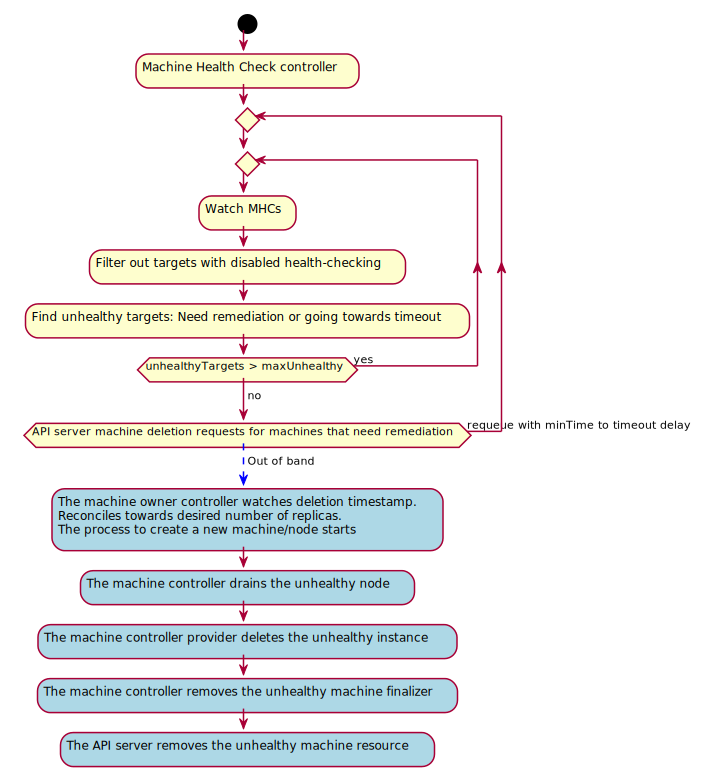

# Machine health checking

## Release Signoff Checklist

- [x] Enhancement is `implementable`
- [ ] Design details are appropriately documented from clear requirements
- [ ] Test plan is defined
- [ ] Graduation criteria for dev preview, tech preview, GA
- [ ] User-facing documentation is created in [openshift/docs


## Summary

Enable opt in for automated health checking and remediation of unhealthy nodes backed by machines. a.k.a. node auto repair.

## Motivation

Reduce administrative overhead to run a cluster and ability to respond to failures of machines and keep the nodes healthy.

### Goals

- Providing a default remediation strategy for public clouds - Machine deletion.

- Allowing to define different unhealthy criterias for different pools of machines.

- Providing administrator-defined short-circuiting of automated remediation when multiple nodes are unhealthy at the same time.

- Enable experimental remediation systems to be developed outside the machine-healthcheck controller via annotation, e.g baremetal reboot.
  - If a strong need for multiple external remediation systems ever emerge a follow up proposal fleshing out stronger integration details must be provided for this to be supported as non-experimetal.


### Non-Goals

- Coordinating individual remediation systems. This must be driven and designed by each system as they see fit, e.g. by annotating affected nodes with state and transition time. This proposal focus on remediating by deleting.

- Recording long-term stable history of all health-check failures or remediations.

## Proposal

- As a customer I only care about my apps availability so I want my cluster infrastructure to be self healing and the nodes to be remediated automatically.

- As a cluster admin I want to define my unhealthy criteria as a list of node conditions https://github.com/kubernetes/node-problem-detector.

- As a cluster admin I want to define different unhealthy criteria for pools of machines targeted for different workloads.

The machine health checker (MHC) does a best effort to keep nodes healthy in the cluster.

It provides a short-circuit mechanism and limits remediation when `maxUnhealthy` threshold is reached for a targeted pool. This is similar to what the node life cycle controller does for reducing the eviction rate as nodes goes unhealthy in a given zone. E.g a large number of nodes in a single zone are down because it's most likely a networking issue.

The machine health checker is an integration point between node problem detection tooling expresed as node conditions and remediation to achieve a node auto repairing feature.

### Unhealthy criteria
A machine/node target is unhealthy when:

- The node meets the unhealthy node conditions criteria defined.
- The Machine has no nodeRef.
- The Machine has nodeRef but node is not found.
- The Machine is in phase "Failed".

If any of those criterias are met for longer than given timeouts, remediation is triggered.
For the node conditions the time outs are defined by the admin. For the other cases opinionated values can be assumed.
For a machine with no nodeRef an opinionated value could be assumed e.g 10 min.
For a node notFound or a failed machine, the machine is considerable unrecoverable, remediation can be triggered right away.

### Remediation
- The machine is requested for deletion.
- The controller owning that machine, e.g machineSet reconciles towards the expected number of replicas and start the process to bring up a new machine/node tuple.
- The machine controller drains the node.
- The machine controller provider implementation deletes the cloud instance.
- The machine controller deletes the machine resource.

### Pausing

Some cluster operations, e.g. upgrades, result in temporarily unhealthy machines / nodes, which might trigger
unnecessary remediation. To allow cluster admins or new controllers to prevent this from happening without having to
delete and re-create machineHealthCheck objects, we will implement a `pause` feature on the machineHealthCheck resource.
This feature already exists on the upstream machineHealthCheck resource in the form of an annotation, which we want to
backport. Its key is `cluster.x-k8s.io/paused`. While this isn't consistent with existing downstream annotation keys, it
will make future alignment with Cluster API easier. Remediation will be paused as soon as this annotation exists. Its
value isn't checked but is expected to be empty.

### User Stories
- I want my worker machines to be remediated when the backed node has `ready=false` or `ready=Unknown` condition for more than 10m.
- I want remediation to temporary short-circuit if the 40% or more of the targets of this pool are unhealthy at the same time.
- I want to prevent remediation, without deleting the entire MHC configuration, while my cluster is upgrading its machines / nodes.

### Implementation Details

#### MachineHealthCheck CRD
- Enable watching a pool of machines (based on a label selector).
- Enable defining an unhealthy node criteria (based on a list of node conditions).
- Enable setting a threshold of unhealthy nodes. If the current number is at or above this threshold no further remediation will take place. This can be expressed as an int or as a percentage of the total targets in the pool.
- Enable pausing of remediation

```yaml
apiVersion: machine.openshift.io/v1beta1
kind: MachineHealthCheck
metadata:
  name: example
  namespace: openshift-machine-api
  annotations:
    cluster.x-k8s.io/paused: ""
spec:
  selector:
    matchLabels:
      role: worker
  unhealthyConditions:
  - type:    "Ready"
    status:  "Unknown"
    timeout: "300s"
  - type:    "Ready"
    status:  "False"
    timeout: "300s"
  maxUnhealthy: "40%"
status:
  currentHealthy: 5
  expectedMachines: 5
```

#### MachineHealthCheck controller
Watch:
- Watch machineHealthCheck resources
- Watch machines and nodes with an event handler e.g controller runtime `EnqueueRequestsFromMapFunc` which returns machineHealthCheck resources.

Reconcile:
- Don't do anything when the pause annotation is set on the machineHealthCheck resource.
- Fetch all the machines in the pool and operate over machine/node targets. E.g:
```go
type target struct {
  Machine capi.Machine
  Node    *corev1.Node
  MHC     capi.MachineHealthCheck
}
```

- Calculate the number of unhealthy targets.
- Compare current number against `maxUnhealthy` threshold and temporary short circuits remediation if the threshold is met.
- Trigger remediation for unhealthy targets i.e request machines for deletion.

Out of band:
- The owning controller e.g machineSet controller reconciles to meet number of replicas and start the process to bring up a new machine/node.
- The machine controller drains the unhealthy node.
- The machine controller provider deletes the instance.
- The machine controller deletes the machine.



#### Out of tree experimental remediation controller, e.g baremetal reboot
- An external remediation can plug in by setting the `machine.openshift.io/remediation-strategy` on the MHC resource.
- An external remediation controller remediation could then watch machines annotated with `machine.openshift.io/remediation-strategy: external-baremetal` and react as it sees fit.

### Risks and Mitigations

#### MachineHealthCheck and Cluster Autoscaler interactions

Both the MachineHealthCheck and Cluster Autoscaler implement health checking for Machines in different ways.
The Cluster Autoscaler attempts to determine the health of MachineSets by looking at whether Machines are successfully
joining the cluster within a given period.

With MachineHealthChecks installed, they may interfere with the Cluster Autoscalers health check logic.
See [How does the ClusterAutoscaler interact with MachineHealthCheck](#how-does-th-clusterautoscaler-interact-with-machinehealthcheck)
for details of how they interfere.

To mitigate this risk, the MachineHealthCheck controller should [implement back off](https://issues.redhat.com/browse/OCPCLOUD-800)
to prevent hot loops on broken user configuration.
Once this is implemented, it should be safe to use MachineHealthChecks and Cluster Autoscaler together.

## Design Details

### Test Plan
This feature will be tested for public clouds in the e2e machine API suite as the other machine API ecosystem https://github.com/openshift/cluster-api-actuator-pkg/tree/8250b456dec7b2fb06c591738518de1265e84a2c/pkg/e2e

### Graduation Criteria
An implementation of this feature is currently gated behind the `TechPreviewNoUpgrade` flag. This proposal wants to remove the gating flag and promote machine health check to a GA status with a beta API.

#### Dev Preview -> Tech Preview

#### Tech Preview -> GA

#### Removing a deprecated feature

### Upgrade / Downgrade Strategy

The machine health check controller lives in the machine-api-operator image so the upgrades will be driven by the CVO which will fetch the right image version as usual. See:

https://github.com/openshift/machine-api-operator/blob/474e14e4965a8c5e6788417c851ccc7fad1acb3a/install/0000_30_machine-api-operator_01_images.configmap.yaml

https://github.com/openshift/machine-api-operator/blob/474e14e4965a8c5e6788417c851ccc7fad1acb3a/pkg/operator/operator.go#L222

For supported out of tree remediation controllers, e.g baremetal reboot, the binary needs to be deployed in one of the available bare metal images or specify its own one. See:

https://github.com/openshift/machine-api-operator/blob/master/pkg/operator/baremetal_pod.go

https://github.com/openshift/machine-api-operator/blob/474e14e4965a8c5e6788417c851ccc7fad1acb3a/pkg/operator/baremetal_pod.go

### Version Skew Strategy

## Implementation History

Initial implementation:

https://docs.google.com/document/d/1-RPiXfc33SyM7Gn-dogCWNigEWpSxXV_OZ7UKsQtI4E/edit#

Related discussions:

https://docs.google.com/document/d/10kauaJiXaWpvmd_qVsgIoZBNQLJMXMsQga3exV04ZTY/edit?ts=5d0b91e6#heading=h.4ifefbk4b4y2

https://gist.github.com/bison/403bb921e1d5ed72f7edec2ccb47471c#remediationstrategy

## Drawbacks

## Alternatives

Considered to bake this functionality into machineSets. This was discarded as different controllers than a machineSet could be owning the targeted machines. For those cases as a user you still want to benefit from automated node remediation.

Considered allowing to target machineSets instead of using a label
selector. This was discarded because of the reason above. Also there
might be upper level controllers doing things that the MHC does not
need to account for, e.g machineDeployment flipping machineSets for a
rolling update. Therefore considering machines and label selectors as
the fundamental operational entity results in a good and convenient
level of flexibility and decoupling from other controllers.

Considered a more strict short-circuiting mechanisim (currently
feature gated) decoupled from the machine health checker i.e machine
disruption budget analogous to pod disruption budget. This was
discarded because it added an non justified level of complexity and
additional API CRDs. Instead we opt for a simpler approach and will
consider more concrete feature requests that requires additional
complexity based on real use feedback.  This would introduce a
MachineDisruptionBudget resource. This resource simply targets a set
of machines with a label selector and continuously records status
information on the readiness of the targets. It includes thresholds
similar to the maxUnavailable option above, and provides an
at-a-glance view of whether the targets are at that limit or not.

Example:

```yaml
apiVersion: "healthchecking.openshift.io/v1beta1"
kind: "MachineDisruptionBudget"
metadata:
  name: workers-us-east-1a
  namespace: openshift-machine-api
spec:
  selector:
    role: worker
    zone: us-east-1a
  maxUnavailable: 5
```

### Pros

More expressive, i.e. the decision on whether to perform remediation can take into account the status of an arbitrary set of machines, including machines that may not qualify for automated remediation.
Could potentially be used by controllers other than health-checker.
Separates this bit of bookkeeping logic from the health-checker.

There's a feature gated version already.

### Cons

Introduces a new type and controller.

### MachineDisruptionBudget use-cases

I have a cluster spanning 3 zones in my data center. I want health-checking with remediation on all nodes. I want to skip remediation if a large number of nodes in a single zone are down because it's most likely a networking issue.

Solution: I create a MachineHealthChecker targeting all nodes, and I create a MachineDisruptionBudget for each zone with an appropriate maxUnavailable setting. To achieve the same effect without MachineDisruptionBudget I have to duplicate the MachineHealthChecker for each zone.

I want automated remediation on some nodes, but not all -- I may have "pet" machines that require special care. Whether remediation of machines should proceed or not depends on the health of my "pet" machines, i.e. do not remediate if a total of 5 or more machines are down across both the "cattle" and "pet" nodes.

Solution: Create a MachineDisruptionBudget targeting both the "cattle" and "pets" with appropriate thresholds. This is not possible without MachineDisruptionBudget or, possibly, one-off opt-out annotations.

## Infrastructure Needed

## Related Information

### How does a Machine Health Check determine which Machines it should target for health checking?

A MachineHealthCheck uses a `selector` to specify which Machines it should consider as its targets.
The selector supports [set-based requirements](https://kubernetes.io/docs/concepts/overview/working-with-objects/labels/#resources-that-support-set-based-requirements)
so there are three options for specifying a selector for a Machine Health Check.

#### An Empty Selector

An empty selector matches all Machines. This means it would include the Control-Plane Machines,
all Machines created by the default MachineSets and any Machines that users create post installation.

#### Using exact labels

Using the `matchLabels` part of the selector allows specifying a list of key value pairs that must be present on the Machine.
This means that Machines must have all of the labels specified to be considered to match the selector.
This could be used to specify that the MHC selects all Machines with the `cluster-api-machine-role: worker` label,
which would match all MachineSets created by the installer, but not Control-Plane nodes,
nor necessarily any MachineSets created by users post installation.

#### Using expressions

Using the `matchExpressions` part of the selector allows more complicated expressions to be created for selecting on labels.
Each expression consists of a key, operator and values.
This allows users to select a label with value that matches a set of values (operator: In),
a label with a value that is not in a set of values (operator: NotIn). Or check that a label exists or not.

These expressions could be used to select all Machines that do not have the label `cluster-api-machine-role: master`,
ie, all Machines in the cluster that are not part of the Control-Plane.
This would include all MachineSets created by the installer and any created by users post installation.

### How does the ClusterAutoscaler interact with MachineHealthCheck?

The ClusterAutoscaler uses its own health checking to determine if a MachineSet is unhealthy after scaling up.
Should it determine the MachineSet to be unhealthy,
it would scale the MachineSet back down and try another MachineSet to add new capacity to the cluster.

MachineHealthChecks could interfere with this health checking logic and prevent the autoscaler from adding new compute capacity.
To ensure there are no conflicts, several scenarios must be tested to check whether there may be conflicts

#### Scenarios
##### Machine fails to launch due to user config error

Steps to reproduce:
1. Create cluster on AWS
2. Deploy ClusterAutoscaler to cluster
3. Deploy MachineHealthCheck to cluster
4. Modify MachineSet to start on Spot instances with very low spot price
  ```yaml
  providerSpec:
    value:
      ...
      spotMarketOptions:
        maxPrice: "0.001" # Low to prevent EC2 instance being created
  ```
5. Create deployment of dummy pods with some resources requested
6. Scale deployment until ClusterAutoscaler scales modified MachineSet

What happens after Machine Fails:
- If the number of Failed Machines is greater than `maxUnhealthy`:
  - Example:
    - This may happen if a large number of nodes are scaled in a single MachineSet and they all fail to provision
      (eg AMI missing, or instance type not available in AZ)
  - MachineHealthCheck:
    - Remediation is short circuited, takes no action
  - Cluster Autoscaler:
    - Autoscaler determines nodes are unregistered
    - After 15 minutes (MaxNodeProvisionTime) autoscaler scales MachineSets back as expected and re-attempts scaling
  - Conclusion:
    - In this scenario, the MHC has no effect on the operation of the Cluster Autoscaler

- If the number of Failed Machine is less than `maxUnhealthy`:
  - Example:
    - This may happen under normal scaling, if a low number of machines are scaled and Fail,
      or if a number of machines are scaled, some Fail and the others eventually register
  - MachineHealthCheck:
    - While number of unhealthy machines exceed `maxUnhealthy`, no remediation occurs
    - Once `maxUnhealthy` not breached, hot loop of deletion and recreation of Machines caused by MachineHealthCheck
      immediately remediating failed Machines and MachineSet recreating Machines
  - Cluster Autoscaler:
    - Cannot track health of MachineSet as Machines are being deleted too quickly
    - Unable to determine broken MachineSet is unhealthy, therefore unable to attempt to scale alternate MachineSet as designed
  - Conclusion:
    - MachineHealthCheck breaks the assumptions of the Cluster Autoscaler and as such the Cluster Autoscaler cannot
      determine that the MachineSet is currently unhealthy
    - New capacity may never be added to the cluster if the Cluster Autoscaler choses a broken MachineSet,
      therefore the Cluster Autoscaler is broken by MachineHealthCheck at presents
    - This problem could potentially be resolved by introducing back-off for the MachineHealthCheck remediation controller
      (https://issues.redhat.com/browse/OCPCLOUD-800)
    - Alternatively this could be resolved by not remediating machines that have `Failed` but this would be a major change in behaviour

##### Machine fails to launch after being accepted by AWS

Steps to reproduce:
1. Create cluster on AWS
2. Deploy ClusterAutoscaler to cluster
3. Deploy MachineHealthCheck to cluster
4. Disable CVO
5. Remove the following section from the `openshift-machine-api-aws` credentials request
   - `kubectl edit credentialsrequests -n openshift-cloud-credential-operator openshift-machine-api-aws`
 ```yaml
  - action:
    - kms:Decrypt
    - kms:Encrypt
    - kms:GenerateDataKey
    - kms:GenerateDataKeyWithoutPlainText
    - kms:DescribeKey
    effect: Allow
    resource: '*'
  - action:
    - kms:RevokeGrant
    - kms:CreateGrant
    - kms:ListGrants
    effect: Allow
    policyCondition:
      Bool:
        kms:GrantIsForAWSResource: true
    resource: '*'
  ```
6. Create a KMS key and set a MachineSet to use this key to encrypt disks using this key
7. Create deployment of dummy pods with some resources requested
8. Scale Deployment until ClusterAutoscaler scales modified MachineSet

What happens:
- Example:
  - Credentials do not give permission to use KMS key given for decrypting EBS volume. AWS accepts instance request but fails to launch.
- Result:
  - AWS accepts instance launch request, returns provider ID
  - Machine controller updates Machine to Provisioned
  - AWS attempts to launch instance, fails, puts in terminated state
  - Machine controller marks Machine as Failed because instance is terminated
- Conclusion:
  - This scenario behaves in exactly the same way as the previous scenario

### How does a Machine Health Check interact with Control-Plane Machine?

At present, Machine Health Checks will not remediate Control-Plane machines.
Since Control-Plane Machines are not owned by any controller, deleting Control-Plane machines would have to be recreated manually.

Until automation is created (see [proposal](https://github.com/openshift/enhancements/pull/292))
for management of Control-Plane machines, they should be excluded from Machine Health Checks as health checking them will be redundant.

Once automation is created, a Machine Health Check could be used to remediate problems with the Control-Plane machines,
though it must ensure that the Etcd cluster remains healthy and as such,
should be managed by something to ensure the MaxUnhealthy parameter is set appropriately for the size of the Etcd cluster.

### How does the MaxUnhealthy field work?

Each MachineHealthCheck has a `maxUnhealthy` field.
This field can be used to prevent the MachineHealthCheck from remediating problems with Machines if there are
already too many unhealthy Machines within the cluster.

For example, if the value of `maxUnhealthy` was `50%`, and in a 10 node cluster, 6 nodes were determined to be unhealthy,
the `maxUnhealthy` value would prevent the MachineHealthCheck from making any remediation actions on the Machines.
This mechanism prevents the MachineHealthCheck from potentially worsening a catastrophic or cascading failure with a cluster.

An important note is that currently, the `maxUnhealthy` value is only respected for the single MachineHealthCheck that is being reconciled.
This means that, if two MachineHealthChecks covered the same Machine or Machines, one of the MachineHealthChecks could have
a less restrictive `maxUnhealthy` and allow a Machine to be remediated when the other MachineHealthCheck would have blocked remediation.

This means that, if a MachineHealthCheck covered all nodes, the value will include the Control-Plane machines
and they will be factored into the calculation to determine if MaxUnhealthy has been breached.
Because of the special nature of Control-Plane Machines, including them in an MHC with other nodes that would potentially
allow the MHC to remediate more than one Control-Plane machine at any one time (assuming three Control-Plane machines),
could cause the cluster to lose quorum for Etcd and potentially even lose the data altogether.

If Control-Plane Machines are to be covered by a MachineHealthCheck, the `maxUnhealthy` parameter must be set
appropriately to ensure that the MachineHealthCheck does not ever cause the Etcd cluster to lose quorum.
For this reason, Control-Plane Machines should not be mixed with worker Machines within an MHC
(Note however, if and only if the `maxUnhealthy` value were forced to be 1 Machine only, then this would be safe).
