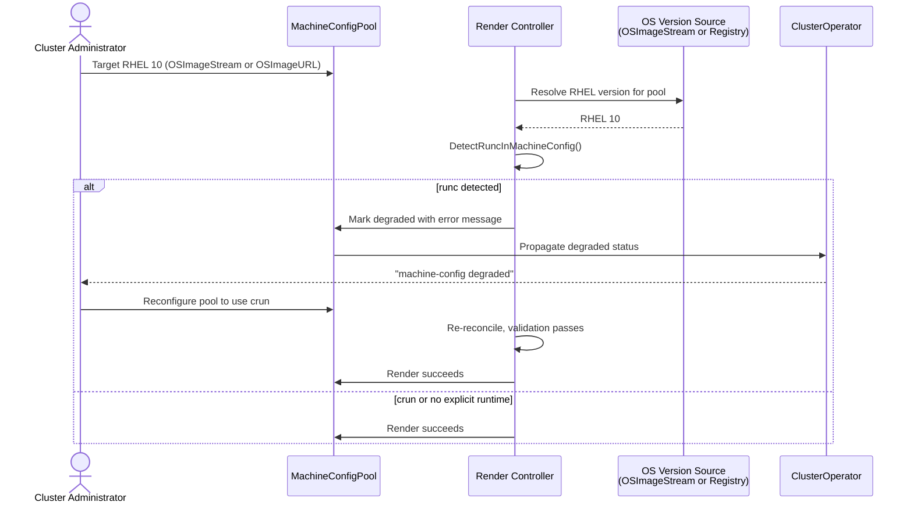

# Block runc on RHCOS 10 Upgrade

## Summary

RHCOS 10 (RHEL 10-based) no longer ships `runc`. This enhancement adds a
validation step in the MCO render controller that blocks any
MachineConfigPool from rendering when it targets a RHEL 10 OS image and
`runc` is still configured as the default runtime, preventing nodes from
booting into an unsupported state.

## Motivation

RHEL 10 drops `runc` from its package set. CRI-O configured with `runc`
will fail to start on a RHEL 10 node, leaving it NotReady.

OpenShift 5.0 introduces per-pool OS image selection via OS image streams
(`MachineConfigPool.Spec.OSImageStream.Name`), and the existing
`OSImageURL` field on a MachineConfig can also move a pool from RHCOS 9
to RHCOS 10. If the pool still has `runc` configured, every node that
picks up the new OS will become NotReady. This guard catches the
incompatible combination before any node is affected.

### User Stories

- As a cluster administrator, I want the MCO to block upgrading a pool
  to RHCOS 10 when `runc` is still configured, so that nodes do not boot
  into an unsupported runtime.

- As a cluster administrator, I want a clear error message telling me to
  switch to `crun`, so that I know exactly how to unblock the upgrade.

### Goals

- Block MachineConfigPool rendering when the pool targets RHEL 10 and
  `runc` is the effective default runtime.
- Surface the block as a degraded MachineConfigPool with an actionable
  error message directing the administrator to switch to `crun`.
- Block only the per-pool OS image stream switch, not the OCP version
  upgrade itself.
- Leave pools on RHCOS 9 or already using `crun` unaffected.

### Non-Goals

- Gating the CVO upgrade edge via CFE. This guard operates at the
  per-pool render level. See [Risks and Mitigations](#risks-and-mitigations)
  for how simultaneous OCP + OS upgrades are handled.
- Automatically removing `runc`. Administrators must explicitly
  reconfigure their runtime before upgrading.

## Proposal

The MCO render controller gains a validation step,
`validateNoRuncOnRHEL10`, that runs during
`syncGeneratedMachineConfig`. It determines the pool's target OS from
whichever mechanism is in use:

- **OSImageStream**: Resolves the pool's effective stream via
  `MachineConfigPool.Spec.OSImageStream` and checks whether it is
  RHEL 10 using `IsRHEL10Stream()`.
- **OSImageURL**: Inspects the `io.openshift.os.streamclass` label on
  the container image to determine the RHEL version. The result is
  cached as an annotation on the rendered MachineConfig and only
  re-inspected when the `OSImageURL` value changes.

When the target OS is RHEL 10, the controller parses CRI-O drop-in
files in the rendered MachineConfig's Ignition content. If the effective
default runtime is `runc`, rendering is rejected and the pool is marked
degraded.

### Workflow Description

**cluster administrator** is a human user responsible for managing the
cluster's node configuration and OS lifecycle.

The target OS for a pool can be specified via OSImageStream or
OSImageURL. The render controller validates both paths identically: if
the resolved target is RHEL 10 and `runc` is the effective default
runtime, the render is rejected.

1. The administrator targets RHEL 10 for a pool — either by setting
   `MachineConfigPool.Spec.OSImageStream.Name` to a RHEL 10 stream, or
   by setting `Spec.OSImageURL` on a MachineConfig to a RHEL 10 image.
2. The render controller resolves the target OS version:
   - **OSImageStream**: via `IsRHEL10Stream()`.
   - **OSImageURL**: by reading the `io.openshift.os.streamclass` label
     from the container image (cached as an annotation; only re-inspected
     when the URL changes).
3. If the target is RHEL 10, the controller calls
   `DetectRuncInMachineConfig()` to inspect CRI-O drop-in files in the
   rendered MachineConfig's Ignition content.
4. If `runc` is detected, the render is rejected and the pool is marked
   degraded with an actionable error message directing the administrator
   to switch to `crun`.
5. The administrator reconfigures the pool to use `crun`, and the next
   reconciliation succeeds.

When the render is rejected, the degraded condition propagates to the
`machine-config` ClusterOperator status. The administrator sees the
error via `oc get co` or `oc get mcp`.

### API Extensions

None. All changes are internal to the MCO render controller logic and
status reporting.

### Topology Considerations

#### Hypershift / Hosted Control Planes

Not affected. Starting in OCP 4.18, HyperShift forcefully migrates all
NodePools from `runc` to `crun` during upgrade, so no NodePool will be
running `runc` by the time RHCOS 10 is available.

#### Standalone Clusters

Primary topology. Standalone clusters with per-pool OS image stream
configuration are the main users of the dual-stream RHCOS 9/10 upgrade
path.

#### Single-node Deployments or MicroShift

SNO clusters are affected identically — the guard runs as part of the
existing render reconciliation loop with no additional resource impact.

MicroShift does not use the MCO and already requires `crun` via RPM
dependencies. Not affected.

#### OpenShift Kubernetes Engine

OKE clusters use the MCO and are subject to the same guard. No
dependency on features excluded from OKE.

### Implementation Details/Notes/Constraints

The implementation adds four components to the machine-config-operator:

1. **CRI-O Runtime Detection** (`pkg/controller/common/helpers.go`):
   `DetectRuncInMachineConfig()` parses TOML drop-in files under
   `/etc/crio/crio.conf.d/` in the Ignition content, applies "last wins"
   semantics, handles gzip-compressed content, and returns the
   MachineConfig name only if `runc` is the effective default runtime.

2. **RHEL 10 Stream Identification** (`pkg/osimagestream/streams.go`):
   `IsRHEL10Stream()` matches a stream name against known RHEL 10
   constants.

3. **OSImageURL Version Detection** (`pkg/imageutils/image_inspect.go`):
   Reads the `io.openshift.os.streamclass` label from the container
   image, cached as an annotation to avoid registry calls on every sync.

4. **Render Controller Validation**
   (`pkg/controller/render/render_controller.go`):
   `validateNoRuncOnRHEL10()` runs during
   `syncGeneratedMachineConfig()`, combining stream identification (or
   cached OSImageURL version) with runtime detection to reject
   incompatible combinations.

The guard is enabled unconditionally (no feature gate) and has no effect
on pools that do not target RHEL 10.

### Risks and Mitigations

**Risk**: An administrator configures `runc` outside of MachineConfig
(e.g., by baking CRI-O configuration into the OS image), bypassing the
guard entirely.
**Mitigation**: Modifying node configuration outside of MachineConfig is
not a supported workflow. The MCO reconciles node state from rendered
MachineConfigs and may overwrite out-of-band changes.

**Risk**: Degraded pool status may confuse administrators unfamiliar
with the runc/crun distinction.
**Mitigation**: The error message names the affected pool and instructs
the administrator to switch to `crun`.

**Risk**: In a simultaneous OCP + OS upgrade (pause MCP, upgrade OCP,
switch OS stream, unpause), the render block could leave the cluster
partially upgraded.
**Mitigation**: The CVO surfaces MCO degraded status via
`oc get clusterversion`. The administrator can unblock by reconfiguring
the runtime or reverting the OS stream change.

### Drawbacks

The guard introduces a new failure mode that administrators must
understand and remediate. However, the alternative — nodes booting into
an unsupported runtime and failing to start containers — is significantly
worse. A clear, recoverable error is preferable to unrecoverable node
failure.

## Alternatives (Not Implemented)

**CVO-level upgrade gate via CFE**: Detect `runc` on live nodes and
block the CVO upgrade edge. Rejected because it blocks the entire OCP
upgrade, not just the per-pool OS stream switch — overly broad given
that OCP 5.0 supports dual-stream operation. A CFE gate may be
reconsidered for 5.3+ when `runc` is fully removed from all RHCOS
versions.

**ValidatingAdmissionPolicy (VAP)**: Reject the OS image stream change
at the API level for immediate feedback. However, VAP cannot express the
cross-resource validation required (MCP OS stream + rendered
MachineConfig CRI-O configuration).

## Open Questions [optional]

1. Should a CFE-based upgrade gate be added in a future
   release (e.g., 5.3) when `runc` is removed entirely,
   to block the OCP version upgrade itself?

## Test Plan

### Unit Tests

- **CRI-O runtime detection** (`helpers_test.go`):
  `DetectRuncInMachineConfig()` with multiple drop-in orderings,
  gzip-compressed content, `runc`/`crun` scenarios, and absent config.
- **RHEL 10 stream identification** (`streams_test.go`):
  `IsRHEL10Stream()` against known RHEL 10 and RHEL 9 stream names.
- **Render controller validation** (`render_controller_test.go`):
  Table-driven tests for `validateNoRuncOnRHEL10()` covering the full
  matrix of runtime, stream, and configuration combinations.

### E2E Test Scenarios

Each scenario is tested with both ContainerRuntimeConfig and
MachineConfig drop-in configuration methods.

| Scenario | RHCOS | Runtime | Result |
|----------|-------|---------|--------|
| RHCOS 9, default runtime | 9 | crun | Succeed |
| RHCOS 9, runc configured | 9 | runc | Succeed |
| RHCOS 9→10 migration, crun | 9→10 | crun | Succeed |
| RHCOS 9→10 migration, runc | 9→10 | runc | Blocked |
| RHCOS 10, crun | 10 | crun | Succeed |
| RHCOS 10, runc | 10 | runc | Blocked |
| RHCOS 10→9 rollback | 10→9 | Any | Succeed |
| Multiple drop-ins, last wins | Any | Mixed | Last wins |

When the guard blocks, the pool becomes degraded and nodes remain on
the current OS until the administrator removes the `runc` configuration.

## Graduation Criteria

This is a safety guard enabled by default from its initial release. It
does not follow the Dev Preview -> Tech Preview -> GA path because it
prevents a known breakage scenario and must be active immediately.

### Dev Preview -> Tech Preview

N/A.

### Tech Preview -> GA

N/A.

### Removing a deprecated feature

When `runc` is fully removed from all supported RHCOS versions
(expected around OpenShift 5.3+), this guard can be removed.

## Upgrade / Downgrade Strategy

**Upgrade**: No action required. The guard activates automatically
during MachineConfig rendering. Existing clusters on RHCOS 9 with `runc`
are not affected until they target a pool at RHCOS 10.

**Downgrade**: The protection is lost. Administrators must manually
verify that `runc` is not configured on pools targeting RHCOS 10. The
guard only blocks rendering — no state to clean up.

## Version Skew Strategy

The guard is a validation step in the render controller, updated as part
of the MCO deployment. It reads only from the OSImageStream API and the
rendered MachineConfig, both managed by the MCO itself. No
cross-component coordination required.

## Operational Aspects of API Extensions

N/A. No API extensions.

## Support Procedures

**Detecting the guard activation**:

- `oc get mcp` — affected pool shows `DEGRADED=True`.
- `oc get mcp <pool> -o yaml` — degraded condition names `runc` and
  directs migration to `crun`.
- `oc get co machine-config` — `DEGRADED=True` referencing the pool.

**Resolving the block**:

1. Identify the MachineConfig or ContainerRuntimeConfig setting `runc`.
2. Update the configuration to use `crun`.
3. Wait for re-reconciliation — the pool clears the degraded condition
   and proceeds with the OS upgrade.

**Disabling the guard**: Not independently possible. To bypass (not
recommended), revert the pool's OS stream to RHCOS 9, apply the runtime
change, then switch back to RHCOS 10.

## Infrastructure Needed [optional]

None. Testing uses existing MCO CI jobs.
