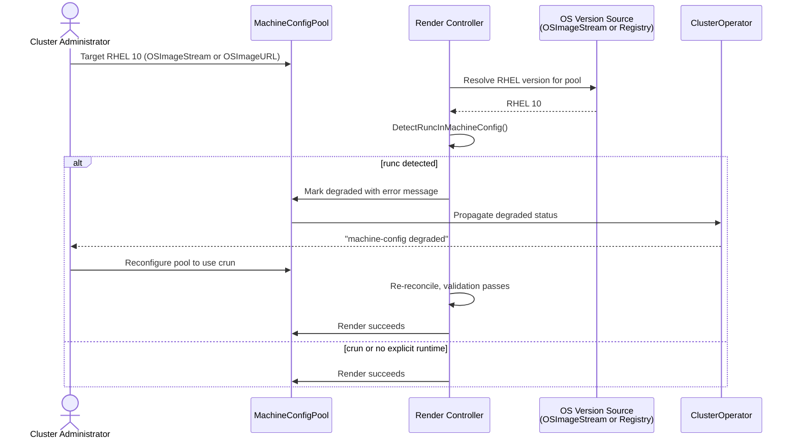

# Block runc on RHCOS 10 Upgrade

## Summary

RHCOS 10 (RHEL 10-based) no longer ships `runc`. This enhancement adds a
validation step in the MCO render controller that blocks any
MachineConfigPool from rendering when it targets a RHEL 10 OS image and
`runc` is still configured as the default runtime, preventing nodes from
booting into an unsupported state.

## Motivation

RHEL 10 drops `runc` from its package set. CRI-O configured with `runc`
will fail to start on a RHEL 10 node, leaving it NotReady.

OpenShift 5.0 introduces per-pool OS image selection via OS image streams
(`MachineConfigPool.Spec.OSImageStream.Name`), and the existing
`OSImageURL` field on a MachineConfig can also move a pool from RHCOS 9
to RHCOS 10. If the pool still has `runc` configured, every node that
picks up the new OS will become NotReady. This guard catches the
incompatible combination before any node is affected.

### User Personas

| Persona | Concern |
|---------|---------|
| Cluster Administrator | Upgrading from a 4.x-based cluster and may still have `runc` configured via a legacy `ContainerRuntimeConfig`; needs to know before a pool moves to RHCOS 10. |
| Platform SRE | Runs automation that patches a pool's OS image stream; needs an unambiguous, actionable signal to halt that automation and remediate, rather than let nodes boot into a broken state. |
| OpenShift Test Verification / CI | Must be able to verify that the guard reliably fires (`RenderDegraded`) and recovers across releases, without manual intervention. |
| Customers | Run workloads on cluster nodes; a silent `runc` failure on RHCOS 10 would take their applications down with no warning. The guard's pool-level block, rather than a full cluster outage, limits this blast radius. |

### User Stories

- As a cluster administrator, I want the MCO to block upgrading a pool
  to RHCOS 10 when `runc` is still configured, so that nodes do not boot
  into an unsupported runtime.

- As a cluster administrator, I want a clear error message telling me to
  switch to `crun`, so that I know exactly how to unblock the upgrade.

### Goals

- Block MachineConfigPool rendering when the pool targets RHEL 10 and
  `runc` is the effective default runtime.
- Surface the block as a degraded MachineConfigPool with an actionable
  error message directing the administrator to switch to `crun`.
- Block only the per-pool OS image stream switch, not the OCP version
  upgrade itself.
- Leave pools on RHCOS 9 or already using `crun` unaffected.

### Non-Goals

- Gating the CVO upgrade edge via CFE. This guard operates at the
  per-pool render level. See [Risks and Mitigations](#risks-and-mitigations)
  for how simultaneous OCP + OS upgrades are handled.
- Automatically removing `runc`. Administrators must explicitly
  reconfigure their runtime before upgrading.

## Proposal

The MCO render controller gains a validation step,
`validateNoRuncOnRHEL10`, that runs during
`syncGeneratedMachineConfig`. It determines the pool's target OS from
whichever mechanism is in use:

- **OSImageStream**: Resolves the pool's effective stream via
  `MachineConfigPool.Spec.OSImageStream` and checks whether it is
  RHEL 10 using `IsRHEL10Stream()`.
- **OSImageURL**: Inspects the `io.openshift.os.streamclass` label on
  the container image to determine the RHEL version. The result is
  cached as an annotation on the rendered MachineConfig and only
  re-inspected when the `OSImageURL` value changes.

When the target OS is RHEL 10, the controller parses CRI-O drop-in
files in the rendered MachineConfig's Ignition content. If the effective
default runtime is `runc`, rendering is rejected and the pool is marked
degraded.

### Workflow Description

**cluster administrator** is a human user responsible for managing the
cluster's node configuration and OS lifecycle.

The target OS for a pool can be specified via OSImageStream or
OSImageURL. The render controller validates both paths identically: if
the resolved target is RHEL 10 and `runc` is the effective default
runtime, the render is rejected.

1. The administrator targets RHEL 10 for a pool — either by setting
   `MachineConfigPool.Spec.OSImageStream.Name` to a RHEL 10 stream, or
   by setting `Spec.OSImageURL` on a MachineConfig to a RHEL 10 image.
2. The render controller resolves the target OS version:
   - **OSImageStream**: via `IsRHEL10Stream()`.
   - **OSImageURL**: by reading the `io.openshift.os.streamclass` label
     from the container image (cached as an annotation; only re-inspected
     when the URL changes).
3. If the target is RHEL 10, the controller calls
   `DetectRuncInMachineConfig()` to inspect CRI-O drop-in files in the
   rendered MachineConfig's Ignition content.
4. If `runc` is detected, the render is rejected and the pool is marked
   degraded with an actionable error message directing the administrator
   to switch to `crun`.
5. The administrator reconfigures the pool to use `crun`, and the next
   reconciliation succeeds.

```mermaid
sequenceDiagram
    actor Admin as Cluster Administrator
    participant MCP as MachineConfigPool
    participant RC as Render Controller
    participant OS as OS Version Source<br/>(OSImageStream or Registry)
    participant CO as ClusterOperator

    Admin->>MCP: Target RHEL 10 (OSImageStream or OSImageURL)
    RC->>OS: Resolve RHEL version for pool
    OS-->>RC: RHEL 10
    RC->>RC: DetectRuncInMachineConfig()
    alt runc detected
        RC->>MCP: Mark degraded with error message
        MCP->>CO: Propagate degraded status
        CO-->>Admin: "machine-config degraded"
        Admin->>MCP: Reconfigure pool to use crun
        RC->>RC: Re-reconcile, validation passes
        RC->>MCP: Render succeeds
    else crun or no explicit runtime
        RC->>MCP: Render succeeds
    end
```

When the render is rejected, the degraded condition propagates to the
`machine-config` ClusterOperator status. The administrator sees the
error via `oc get co` or `oc get mcp`.

### API Extensions

None. All changes are internal to the MCO render controller logic and
status reporting.

### Topology Considerations

#### Hypershift / Hosted Control Planes

Not affected. Starting in OCP 4.18, HyperShift forcefully migrates all
NodePools from `runc` to `crun` during upgrade, so no NodePool will be
running `runc` by the time RHCOS 10 is available.

#### Standalone Clusters

Primary topology. Standalone clusters with per-pool OS image stream
configuration are the main users of the dual-stream RHCOS 9/10 upgrade
path.

#### Single-node Deployments or MicroShift

SNO clusters are affected identically — the guard runs as part of the
existing render reconciliation loop with no additional resource impact.

MicroShift does not use the MCO and already requires `crun` via RPM
dependencies. Not affected.

#### OpenShift Kubernetes Engine

OKE clusters use the MCO and are subject to the same guard. No
dependency on features excluded from OKE.

### Implementation Details/Notes/Constraints

The implementation adds four components to the machine-config-operator:

1. **CRI-O Runtime Detection** (`pkg/controller/common/helpers.go`):
   `DetectRuncInMachineConfig()` parses TOML drop-in files under
   `/etc/crio/crio.conf.d/` in the Ignition content, applies "last wins"
   semantics, handles gzip-compressed content, and returns the
   MachineConfig name only if `runc` is the effective default runtime.

2. **RHEL 10 Stream Identification** (`pkg/osimagestream/streams.go`):
   `IsRHEL10Stream()` matches a stream name against known RHEL 10
   constants.

3. **OSImageURL Version Detection** (`pkg/imageutils/image_inspect.go`):
   Reads the `io.openshift.os.streamclass` label from the container
   image, cached as an annotation to avoid registry calls on every sync.

4. **Render Controller Validation**
   (`pkg/controller/render/render_controller.go`):
   `validateNoRuncOnRHEL10()` runs during
   `syncGeneratedMachineConfig()`, combining stream identification (or
   cached OSImageURL version) with runtime detection to reject
   incompatible combinations.

The guard is enabled unconditionally (no feature gate) and has no effect
on pools that do not target RHEL 10.

### Risks and Mitigations

**Risk**: An administrator configures `runc` outside of MachineConfig
(e.g., by baking CRI-O configuration into the OS image), bypassing the
guard entirely.
**Mitigation**: Modifying node configuration outside of MachineConfig is
not a supported workflow. The MCO reconciles node state from rendered
MachineConfigs and may overwrite out-of-band changes.

**Risk**: Degraded pool status may confuse administrators unfamiliar
with the runc/crun distinction.
**Mitigation**: The error message names the affected pool and instructs
the administrator to switch to `crun`.

**Risk**: In a simultaneous OCP + OS upgrade (pause MCP, upgrade OCP,
switch OS stream, unpause), the render block could leave the cluster
partially upgraded.
**Mitigation**: The CVO surfaces MCO degraded status via
`oc get clusterversion`. The administrator can unblock by reconfiguring
the runtime or reverting the OS stream change.

### Drawbacks

The guard introduces a new failure mode that administrators must
understand and remediate. However, the alternative — nodes booting into
an unsupported runtime and failing to start containers — is significantly
worse. A clear, recoverable error is preferable to unrecoverable node
failure.

## Alternatives (Not Implemented)

**CVO-level upgrade gate via CFE**: Detect `runc` on live nodes and
block the CVO upgrade edge. Rejected because it blocks the entire OCP
upgrade, not just the per-pool OS stream switch — overly broad given
that OCP 5.0 supports dual-stream operation. A CFE gate may be
reconsidered for 5.3+ when `runc` is fully removed from all RHCOS
versions.

**ValidatingAdmissionPolicy (VAP)**: Reject the OS image stream change
at the API level for immediate feedback. However, VAP cannot express the
cross-resource validation required (MCP OS stream + rendered
MachineConfig CRI-O configuration).

**Surfacing guard status on `ContainerRuntimeConfig`**: In addition to
the `MachineConfigPool` `RenderDegraded` condition, report the guard
status directly on the `ContainerRuntimeConfig` object that configured
the runtime, for a more direct signal to the administrator who edited
it. Rejected: the CRC controller's sole responsibility is generating
the MachineConfig; teaching it to detect this conflict would require
duplicating the RHEL 10/stream-class-inspection logic already
implemented in the render controller (rendering the MachineConfig and
inspecting the resolved OS image). Since this would be purely a
quality-of-life improvement over the existing `MachineConfigPool`
`RenderDegraded` signal, it is not worth the additional implementation
and maintenance cost right now.

## Open Questions [optional]

1. Should a CFE-based upgrade gate be added in a future
   release (e.g., 5.3) when `runc` is removed entirely,
   to block the OCP version upgrade itself?

## Test Plan

### Unit Tests

- **CRI-O runtime detection** (`helpers_test.go`):
  `DetectRuncInMachineConfig()` with multiple drop-in orderings,
  gzip-compressed content, `runc`/`crun` scenarios, and absent config.
- **RHEL 10 stream identification** (`streams_test.go`):
  `IsRHEL10Stream()` against known RHEL 10 and RHEL 9 stream names.
- **Render controller validation** (`render_controller_test.go`):
  Table-driven tests for `validateNoRuncOnRHEL10()` covering the full
  matrix of runtime, stream, and configuration combinations.

### Integration Tests

N/A.

### E2E Test Scenarios

The full matrix below — every combination of RHCOS version, runtime,
and CRI-O drop-in ordering — is exercised by the render controller's
table-driven unit tests (see [Unit Tests](#unit-tests)), which cover
`OSImageStream`- and `OSImageURL`-based targeting identically via two
dedicated test functions (`TestValidateNoRuncOnRHEL10` and
`TestValidateNoRuncOnRHEL10FromOSImageURL`), since the two mechanisms
only differ in how the render controller resolves the target RHEL
version and share the same downstream runtime-detection and blocking
logic.

Because this suite is disruptive and long-running (see
[Skip Environment](#skip-environment)), it does not re-run the entire
matrix live; it automates only the scenarios needed to confirm the
guard's end-to-end, observable behavior on a real cluster
(`RenderDegraded`, `Upgradeable=False`, and the node's actual OS/runtime
afterward), using `ContainerRuntimeConfig` to set the runtime:

- **RHCOS 9→10 migration, crun**: via `MachineConfigPool.Spec.OSImageStream`.
- **RHCOS 9→10 migration, runc**: via both `OSImageStream` and
  `OSImageURL`, to independently confirm each OS-target mechanism
  reaches the identical blocked outcome on a live cluster.

The "Automated Coverage" column in the table below states, per
scenario, whether it is exercised end-to-end (and via which
mechanism) or only at the unit-test level.

The `OSImageURL` e2e scenario only fires the guard when the override is
genuine, i.e. the `OSImageURL` differs from the pool's resolved
`OSImageStream` default — otherwise it would silently fall through to
the `OSImageStream`-based validator instead, and since both validators
raise an identical error message, this would not be observable from
the render error alone. The e2e implementation guarantees a genuine
override by mirroring the target image into a distinct internal
registry pull spec, so the scenario runs correctly regardless of the
cluster's default `OSImageStream`.

**"Succeed" means:** the MachineConfigPool reaches `Updated=True` with
`RenderDegraded=False`; if the target OS changed, the node reboots onto
the resolved OS image and the configured runtime is confirmed running;
`co/machine-config` and `ClusterVersion` do not report
`Upgradeable=False` for reason `DegradedPool`.

**"Blocked" means:** the render step fails before any node is touched —
`RenderDegraded=True` with an actionable error message naming the pool
and directing the administrator to switch to `crun`; the node never
reboots and keeps running its current OS image and runtime unchanged;
`co/machine-config` and `ClusterVersion` report `Upgradeable=False`
(reason `DegradedPool`) until the pool renders successfully again —
either because the runtime is switched away from `runc`, or because the
pool's target is no longer RHEL 10 (e.g. rolling back to RHCOS 9, where
the guard does not apply regardless of the configured runtime).
`Upgradeable=False` here is MCO's existing signal for *any* degraded
`MachineConfigPool`, not a mechanism introduced by this guard; it only
prevents *new* minor-version upgrades from being accepted while the pool
is unhealthy — it does not halt an upgrade already in progress or block
same-minor (z-stream) upgrades, and is therefore consistent with this
guard operating only at the per-pool render level (see
[Non-Goals](#non-goals)).

| Scenario | RHCOS | Runtime | Result | Automated Coverage | What is validated |
|----------|-------|---------|--------|---------------------|--------------------|
| RHCOS 9, default runtime | 9 | crun | Succeed | Unit tests only | Pool renders and rolls out normally; the guard has no effect because the target is not RHEL 10. |
| RHCOS 9, runc configured | 9 | runc | Succeed | Unit tests only | `runc` is explicitly allowed on RHCOS 9; the guard only evaluates runtime when the resolved target is RHEL 10. |
| RHCOS 9→10 migration, crun | 9→10 | crun | Succeed | E2E (`OSImageStream`) | Pool moves to RHCOS 10, node reboots, runtime stays `crun`, `RenderDegraded` stays `False` throughout the migration. |
| RHCOS 9→10 migration, runc | 9→10 | runc | Blocked | E2E (`OSImageStream` and `OSImageURL`) | Render is rejected before any reboot; node stays on RHCOS 9 with `runc` still configured. Automated twice at the e2e layer — once per OS-target mechanism — to independently confirm both reach the identical blocked outcome on a live cluster; the `OSImageURL` variant uses a registry-mirrored image to guarantee a genuine override (see note above). |
| RHCOS 10, crun | 10 | crun | Succeed | Unit tests only | Pool is already on RHCOS 10; the guard does not fire because `crun` is configured. |
| RHCOS 10, runc | 10 | runc | Blocked | Unit tests only | Admin tries to switch an RHCOS-10 pool's runtime to `runc` directly (no OS change involved); render is rejected the same way as the 9→10 migration case. |
| RHCOS 10→9 rollback | 10→9 | Any | Succeed | Unit tests only | The guard only fires when the resolved target is RHEL 10; once the pool's target is RHCOS 9 again, rolling back succeeds regardless of the configured runtime. |
| Multiple drop-ins, final runtime `runc` | 10 | runc (alphabetically-last drop-in) | Blocked | Unit tests only | Two CRI-O drop-ins are present with conflicting `default_runtime`, an earlier one setting `crun` and the alphabetically-last one setting `runc`. `DetectRuncInMachineConfig()` must resolve to the alphabetically-last drop-in's value; render is rejected exactly as in the single-drop-in `runc` case, proving a stale `crun` drop-in cannot mask an effective `runc` configuration (false negative). |
| Multiple drop-ins, final runtime `crun` | 10 | crun (alphabetically-last drop-in) | Succeed | Unit tests only | Same setup, reversed: an earlier drop-in sets `runc`, the alphabetically-last one sets `crun`. Render succeeds, proving a stale/orphaned `runc` drop-in cannot trigger the guard when it is not the effective configuration (false positive). |

Scenarios marked "Unit tests only" are covered for both `OSImageStream`
and `OSImageURL` targeting by the table-driven tests referenced above;
they are not separately re-run against a live cluster because they
exercise the same render-controller validation function already
proven end-to-end by the two automated e2e scenarios, just with
different inputs to the shared runtime-detection logic.

When the guard blocks, the pool becomes degraded and nodes remain on
the current OS until either the `runc` configuration is removed or the
pool's target is changed away from RHEL 10.

### Skip Environment

The e2e suite is disruptive, long-running, and requires a pool that can
independently move between RHEL 9 and RHEL 10, so it skips automatically
rather than failing on environments where those preconditions do not
hold:

- **MicroShift** — MicroShift does not use the MCO and already requires
  `crun`; the runc guard cannot be exercised.
- **Hypershift (external control plane)** — NodePool-based clusters are
  not managed through the standalone MachineConfigPool/render-controller
  path this guard targets.
- **Single Node OpenShift (SNO)** — the suite requires a pure worker
  node it can isolate into a custom MachineConfigPool without affecting
  control-plane availability; SNO has no such node.
- **Missing dual OS image streams** — if the `OSImageStream` API is not
  present (`OSStreams` feature gate disabled) the suite skips; if the
  API is present but does not advertise both `rhel-9` and `rhel-10`
  streams, the precondition check fails rather than silently skipping,
  since a cluster claiming OSImageStream support should offer both.

### Release Testing Strategy

Because this guard changes render-time behavior for every pool moving
to RHEL 10, its validation spanned both the implementation
(`machine-config-operator`) and consumer (`origin` e2e) repositories,
and relied on disruptive, long-running, payload-based testing in
addition to unit coverage:

1. **Implementation validation (machine-config-operator).** The render
   controller change was covered by unit tests (see
   [Unit Tests](#unit-tests)) and additionally validated manually on a
   live cluster prior to merge, exercising both the `OSImageStream` and
   `OSImageURL` guard paths against real RHCOS 9 and RHCOS 10 images to
   confirm the render-degraded behavior, error messaging, and recovery
   path matched the design.

2. **E2E automation (origin).** The manual pre-merge validation informed
   automated e2e coverage for the scenarios in
   [E2E Test Scenarios](#e2e-test-scenarios), implemented as
   `Informing`-lifecycle tests in the
   `disruptive-longrunning` suite. Because these tests are disruptive
   and long-running, they cannot be validated on every commit through
   normal presubmits; instead, the e2e change was exercised through
   multiple manual runs of the full disruptive, long-running payload
   jobs to confirm the guard's observable behavior (`RenderDegraded`,
   `Upgradeable=False`, node remaining on its prior OS/runtime) held up
   consistently across runs.

3. **Cross-repository validation.** Since the e2e suite targets
   behavior introduced by the still-unmerged `machine-config-operator`
   change, the `origin` e2e PR was validated against a custom release
   payload built from the corresponding `machine-config-operator` pull
   request, rather than against a stable release. This required
   additional payload jobs beyond what either PR would normally consume
   on its own, to confirm the guard and its e2e coverage agreed before
   either side merged.

4. **Merge sequencing.** The `machine-config-operator` implementation
   PR merged once its unit tests and the cross-repository e2e
   validation above passed reliably. The `origin` e2e PR followed
   shortly after, so the `disruptive-longrunning` suite carries
   permanent coverage for this guard going forward and will catch
   regressions in subsequent release payloads.

### Infrastructure Needed [optional]

No new cluster infrastructure or environment types are required — the
e2e suite runs on a standard cluster using the existing
`disruptive-longrunning` CI job definitions. Cross-repository validation
prior to merge did require custom release payloads built from the
in-flight `machine-config-operator` pull request, consuming additional
payload jobs beyond normal per-PR presubmits (see
[Release Testing Strategy](#release-testing-strategy)); no further
custom payload jobs are expected once both changes have merged.

## Graduation Criteria

This is a safety guard enabled by default from its initial release. It
does not follow the Dev Preview -> Tech Preview -> GA path because it
prevents a known breakage scenario and must be active immediately.

### Dev Preview -> Tech Preview

N/A.

### Tech Preview -> GA

N/A.

### Removing a deprecated feature

When `runc` is fully removed from all supported RHCOS versions
(expected around OpenShift 5.3+), this guard can be removed.

## Upgrade / Downgrade Strategy

**Upgrade**: No action required. The guard activates automatically
during MachineConfig rendering. Existing clusters on RHCOS 9 with `runc`
are not affected until they target a pool at RHCOS 10.

**Downgrade**: The protection is lost. Administrators must manually
verify that `runc` is not configured on pools targeting RHCOS 10. The
guard only blocks rendering — no state to clean up.

## Version Skew Strategy

The guard is a validation step in the render controller, updated as part
of the MCO deployment. It reads only from the OSImageStream API and the
rendered MachineConfig, both managed by the MCO itself. No
cross-component coordination required.

## Operational Aspects of API Extensions

N/A. No API extensions.

## Support Procedures

**Detecting the guard activation**:

- `oc get mcp` — affected pool shows `DEGRADED=True`.
- `oc get mcp <pool> -o yaml` — degraded condition names `runc` and
  directs migration to `crun`.
- `oc get co machine-config` — `DEGRADED=True` referencing the pool.

**Resolving the block**:

1. Identify the MachineConfig or ContainerRuntimeConfig setting `runc`.
2. Update the configuration to use `crun`.
3. Wait for re-reconciliation — the pool clears the degraded condition
   and proceeds with the OS upgrade.

**Disabling the guard**: Not independently possible. To bypass (not
recommended), revert the pool's OS stream to RHCOS 9, apply the runtime
change, then switch back to RHCOS 10.
