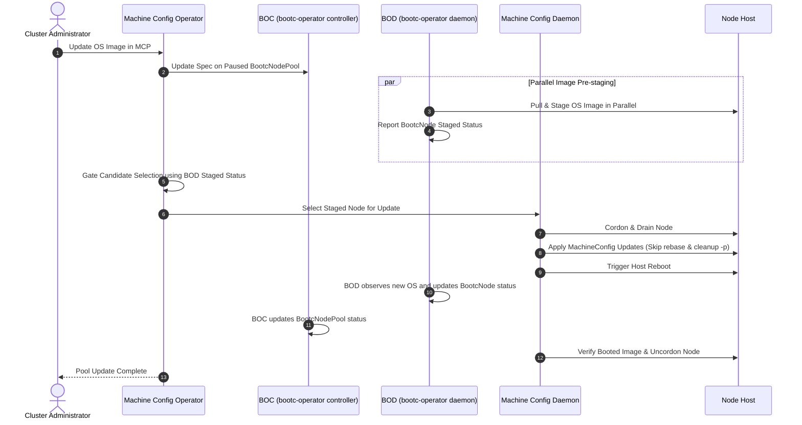

# bootc-operator Integration

## Summary

This enhancement proposes integrating the
[bootc-operator](https://github.com/bootc-dev/bootc-operator) into the OpenShift
release payload, enabling the Machine Config Operator (MCO) to delegate
transactional OS image management to `bootc`. By incorporating the
`bootc-operator`, OpenShift transitions from `rpm-ostree` to a modern
transactional OS update engine that unlocks key capabilities such as
confidential computing, parallel image pre-staging across node pools, and
soft-reboots. Delegating host OS image handling to the `bootc-operator`
simplifies the Machine Config Daemon (MCD) codebase and aligns OpenShift with
upstream container standards, while preserving the MCO's central role in node
update orchestration, draining, and reboot sequencing.

## Motivation

Although OpenShift has supported OCI-based OS updates for quite some time, the
implementation currently relies on
[rpm-ostree](https://coreos.github.io/rpm-ostree/). Although `rpm-ostree` is
still in wide use and is not fully deprecated, the development efforts around
its OS image management capabilities have shifted toward
[bootc](https://github.com/bootc-dev/bootc). Given that Image-Mode RHEL and
other projects have standardized on using `bootc` for OS updates, OpenShift
should adopt `bootc` as well.

Although the MCO team has investigated `bootc` integration numerous times in the
past, shifting organizational priorities have paused the pursuit of this
objective. As a result, the `bootc-operator` was developed independently from
the MCO by members of the CoreOS team. This new operator exposes a
Kubernetes-native API for transactional OS updates, image status reporting, and
node reconciliation.

Adopting `bootc` and delegating OS image handling to the `bootc-operator` is the
best way forward for the following reasons:

1. **Confidential Computing Support:** `bootc` natively supports confidential
   computing workflows: including encrypted and signed OS images, measured boot,
   and confidential VM initializations.
2. **MCD Codebase Simplification & Technical Debt Reduction:** Retiring
   `rpm-ostree` eliminates dual-engine state conflicts, which occurs when
   `rpm-ostree` package layering conflicts with `bootc` updates. Incorporating
   `bootc` image handling directly into the Machine Config Daemon (MCD) would
   risk complicating an already complex codebase; delegating OS image lifecycle
   management to the `bootc-operator` keeps the MCD's scope focused and
   maintainable.
3. **Upstream Community Alignment:** Adopting the `bootc-operator` directly
   aligns OpenShift with upstream `bootc` and Kubernetes container communities.
   It avoids creating a distro-specific operator implementation and allows
   OpenShift to benefit from shared upstream development, security fixes, and
   features.

### Background: bootc, bootc-operator, and Related Upstream Projects

- [bootc](https://github.com/bootc-dev/bootc) - An open-source,
  distribution-agnostic tool providing transactional, in-place operating system
  updates using standard OCI/Docker container images as the transport and
  delivery format for bootable host systems.
- [bootc-operator](https://github.com/bootc-dev/bootc-operator) - The
  `bootc-operator` is a Kubernetes operator that exposes the `bootc` host
  management API to the Kubernetes control plane in a pure declarative fashion.
  In this document, the bootc-operator controller is abbreviated **BOC** and the
  bootc-operator daemon is abbreviated **BOD**. The BOC watches `BootcNodePool`
  resources, resolves image digests, and manages pool rollouts; the BOD runs on
  each node, watches its `BootcNode` resource, executes host `bootc` commands,
  and reports observed node status.
- [kured](https://kured.dev/) - The Kubernetes Reboot Daemon is an open-source
  Kubernetes daemon that performs automated node reboot management based on
  reboot-required signals on host nodes.
- [node-maintenance-operator](https://www.medik8s.io/maintenance-node/) - An
  upstream operator that cordons and drains nodes for maintenance tasks via
  declarative `NodeMaintenance` CRs.

Projects like `kured` and `node-maintenance-operator` demonstrate how upstream
Kubernetes ecosystems handle node reboots and maintenance cordoning/draining as
separate, modular concerns. In OpenShift, the MCO handles node cordoning,
draining, and update sequencing across MachineConfigPools. Delegating OS image
staging to the `bootc-operator` aligns with these modular upstream patterns,
keeping image lifecycle management separate from node reboot and drain
orchestration.

### User Stories

- As an OpenShift cluster administrator, I want node OS updates to use standard
  OS image mechanisms so that node image management is consistent across edge,
  on-premise, and cloud environments.
- As an OpenShift cluster administrator, I want to take advantage of the
  soft-reboot capability provided by `bootc` so that node downtime during
  updates is reduced.
- As an OpenShift cluster administrator, I want node pools to pre-stage OS
  images in parallel across all nodes before node rebooting starts so that
  overall maintenance window downtime is minimized.
- As a security-conscious administrator, I want node operating systems to be
  managed via `bootc` so that my clusters can leverage confidential computing,
  measured boot, and encrypted OS images.
- As a site reliability engineer, I want clear SLIs, metrics, and conditions for
  the `bootc-operator` OS image operations so that I can monitor, lifecycle, and
  remediate OS update failures at scale across my fleet.

### Goals

- Establish `bootc-operator` as an independent core component of the OpenShift
  release payload.
- Support the initial integration on standalone, SNO, and OKE topologies. Hosted
  Control Planes and MicroShift are out-of-scope at this time.
- Establish a clear delegation architecture between the MCO and
  `bootc-operator`.
- Enable parallel OS image pre-staging across nodes in a `MachineConfigPool`.
- Support soft-reboots in as many update scenarios as possible.
- Eliminate `rpm-ostree` execution and dual-engine state conflicts during
  steady-state node updates.
- Enable native `bootc` foundations required for confidential computing.

### Non-Goals

- Replacing the MCO's management of MachineConfigs, Ignition, or
  MachineConfigPools.
- Designing new upstream bootc CRDs in this proposal; upstream definitions from
  `bootc-dev/bootc-operator` will be imported.
- Supporting OS extensions or real-time kernel installation via `MachineConfig`
  without On-Cluster Layering (OCL).

## Proposal

We propose adding the `bootc-operator` as an OpenShift component image within
the release payload. When enabled via the `BootcOperator` Feature Gate, the
OpenShift Cluster Version Operator (CVO) will deploy the `bootc-operator` into
the `openshift-bootc-operator` namespace. The Machine Config Operator (MCO) will
create and maintain a `BootcNodePool` CR corresponding 1:1 with each
`MachineConfigPool` (MCP). These `BootcNodePool` objects will be kept in a
permanently paused state.

Permanently pausing `BootcNodePool` objects causes the BOD to pre-stage bootc OS
container images across all nodes in the pool while preventing the BOC or the
BOD from triggering node drains, reboots, or bypassing MCO orchestration. Even
while paused, the BOC continues to reconcile `BootcNodePool` status in real
time: as the MCO cordons, drains, and reboots each node to apply the staged OS
update, the BOC updates `BootcNodePool` status counters (`updatedCount`,
`updatingCount`, `degradedCount`) and condition statuses as each node boots into
the new OS image. The BOC will also add / remove `BootcNode` objects every time
a node is added or removed from the `BootcNodePool`; even when the
`BootcNodePool` is paused.

### bootc-operator Architecture & Structural Alignment with MCO

The `bootc-operator` follows a two-tier operator architecture consisting of a
cluster-scoped control plane manager and a host-level execution daemon. This
structure directly mirrors the split-responsibility pattern used by the MCO:

1. **`bootc-operator` Controller (BOC):**
   - **Role:** Sits in the cluster control plane and reconciles high-level pool
     definitions (`BootcNodePool`).
   - **Function:** Resolves target container image tags to immutable image
     digests, selects matching nodes based on labels, creates and updates
     `BootcNode` custom resources for managed hosts, applies/removes the
     canonical managed-node label (`bootc.dev/managed`) as nodes join or leave a
     `BootcNodePool`, and tracks pool rollout metrics (`updatedCount`,
     `updatingCount`, `degradedCount`).
   - **MCO Parity:** Directly mirrors the MCO's `NodeController`, which
     reconciles high-level `MachineConfigPool` (MCP) specifications, calculates
     target rendered MachineConfigs, and assigns desired target states to node
     objects.
2. **`bootc-operator` Daemon (BOD):**
   - **Role:** Runs as a privileged DaemonSet pod on every managed host node.
   - **Function:** Watches its local `BootcNode` resource, executes `bootc` CLI
     commands directly on the host filesystem (via host root mount and
     `nsenter`), fetches and stages OS container images, and reports observed
     node OS state (`booted` image, `staged` image, rollback availability, and
     conditions) back to `BootcNode.status`.
   - **MCO Parity:** Directly mirrors the Machine Config Daemon (MCD), which
     runs as a privileged DaemonSet on every cluster node, watches node
     configuration targets, applies host-level changes, and reports observed
     node status back to the control plane.

Although there is discussion of adding a third component
([bootc-dev/bootc-operator#14](https://github.com/bootc-dev/bootc-operator/issues/14))
to manage manifests for the Deployment, DaemonSet, and CRDs, it does not
currently exist. This third component would act in a similar capacity to the
MCO's operator component. An additional responsibility that it should be tasked
with is to ensure that any in-progress updates block deletion of the BOC, BOD,
and CRDs until after the update is complete. This is currently a known feature
gap of the upstream `bootc-operator`, which has been documented in
[bootc-dev/bootc-operator#160](https://github.com/bootc-dev/bootc-operator/issues/160).

The MCO's `NodeController` drives the BOC through `BootcNodePool` specifications
and will monitor image staging and rollout progress by examining `BootcNode`
objects. The MCD remains responsible for node cordoning, draining,
configuration, and rebooting, using the staging status from the BOD as a gate.

### Workflow Description

Overall, cluster administrators will not have to modify their operational
workflows, other than ensuring that On-Cluster Layering (OCL) is enabled within
their cluster if custom OS layering is required. The MCO and `bootc-operator`
coordinate node updates through a **Staged-Gating Pattern**:

1. **Image Update Handoff:** The administrator or the CVO updates the desired OS
   image spec in the MCO (`MachineConfig.spec.osImageURL`) or the On-Cluster
   Layering (OCL) process signals that a new OS image has been built and is
   available. The MCO `NodeController` updates `BootcNodePool.spec.image.ref`.
   The BOC resolves the target image digest and propagates it to
   `BootcNode.spec.desiredImage` for each node in the pool.
2. **Parallel Image Pre-staging:** The BOD on all `BootcNodePool` nodes detects
   the updated `BootcNode.spec.desiredImage` field and pulls/stages the bootc OS
   container image in parallel while nodes remain online (no cordoning,
   draining, or rebooting needed). The BOD reports staging progress via
   `BootcNode.status.staged`.
3. **Staging Gate & Candidate Selection:** The MCO `NodeController` gates
   candidate node selection: a node is eligible for update only when
   `BootcNode.status.staged.imageDigest` matches
   `BootcNodePool.status.targetDigest`, or when the node is already booted into
   the target image (for MachineConfig-only updates). This is in addition to the
   current node selection criteria such as whether the node has received the
   update yet, `MachineConfigPool.spec.maxUnavailable`, etc.
4. **Node Drain & Config Application:** Once selected, the MCD cordons and
   drains the node, applies non-layered MachineConfig updates (files, SSH keys,
   and systemd units), and skips `rpm-ostree rebase` / `rpm-ostree cleanup -p`
   calls.
5. **MCD-Owned Reboot & Finalization:** The MCO sets
   `BootcNodePool.spec.disruption.rebootPolicy` to `AllowSoftReboot` for pools
   that permit soft reboots, or `RebootOnly` otherwise. The MCD initiates the
   reboot upon completing configuration updates, selecting a soft reboot when
   the policy is `AllowSoftReboot` and either
   `BootcNode.status.staged.softRebootCapable` is true (from the staged entry
   matching the target digest when applying a staged OS image) or
   `BootcNode.status.booted.softRebootCapable` is true (for MachineConfig-only
   reboots without a staged image); `RebootOnly` always selects a hard reboot.
6. **Status Verification & Pool Reconciliation:** Post-reboot, the MCD verifies
   the booted OS image and MachineConfig state before uncordoning the node.
   Simultaneously, the BOD updates `BootcNode.status.booted`, and the BOC
   aggregates node results into `BootcNodePool.status`.



### API Extensions

This enhancement introduces two Custom Resource Definitions (CRDs) under the
`node.bootc.dev` API group (`v1alpha1`) sourced from upstream
`bootc-dev/bootc-operator`:

1. **`BootcNodePool` (`bootcnodepools.node.bootc.dev`):**

   - **Scope:** Cluster-scoped (`bnp`)
   - **Purpose:** Defines a group of nodes and their desired bootc OS image
     state. Created 1:1 by the MCO corresponding to each `MachineConfigPool`
     (MCP).
   - **Spec Fields:**
     - `spec.image.ref`: Desired OS container image reference (tag or digest
       pullspec).
     - `spec.nodeSelector`: Label selector determining node pool membership. The
       BOC applies the canonical managed-node label (`bootc.dev/managed`) to all
       matching nodes and removes it when nodes leave the pool or when the
       `BootcOperator` Feature Gate is disabled.
     - `spec.pullSecretRef`: Secret reference for OS image pull credentials.
     - `spec.rollout.paused`: Boolean controlling rollout execution. Set to
       `true` by the MCO to enable parallel image pre-staging while preventing
       automatic reboots. Even while paused, the BOC continues updating pool
       status and node update/completion counts as nodes are rebooted.
     - `spec.rollout.maxUnavailable`: Maximum unavailable nodes during rolling
       updates.
     - `spec.disruption.rebootPolicy`: Reboot strategy (`RebootOnly` or
       `AllowSoftReboot`).
   - **Status Fields:**
     - `status.deployedDigest`: Image digest fully rolled out to all pool nodes.
     - `status.targetDigest`: Resolved image digest the pool is rolling out to.
     - `status.updateAvailable`: Boolean indicating if targetDigest differs from
       deployedDigest.
     - `status.nodeCount`, `status.updatedCount`, `status.updatingCount`,
       `status.degradedCount`: Node counters reflecting pool rollout state.
     - `status.conditions`: Pool conditions (`UpToDate`, `Degraded`).

2. **`BootcNode` (`bootcnodes.node.bootc.dev`):**

   - **Scope:** Cluster-scoped (`bn`)
   - **Purpose:** Represents a single node managed by the `bootc-operator`.
     Reconciled by the BOC (one per node, named after the Node). The BOC writes
     spec; the BOD writes status. Status authorization must be scoped per node
     so that a BOD for one node cannot update or patch another node's
     `BootcNode` status, while still allowing legitimate status reconciliation
     for its own node. This should be enforced with per-node RBAC or an
     equivalent admission control mechanism. This work is tracked by
     [bootc-dev/bootc-operator#6](https://github.com/bootc-dev/bootc-operator/issues/6)
     and will likely also require
     [bootc-dev/bootc-operator#14](https://github.com/bootc-dev/bootc-operator/issues/14)
     to be implemented.
   - **Spec Fields:**
     - `spec.desiredImage`: Target OS image pullspec with digest.
     - `spec.desiredImageState`: Target state set by the BOC (`Staged` or
       `Booted`); the BOD applies the requested state and writes only status.
     - `spec.pullSecretRef` & `spec.pullSecretHash`: Propagated credentials and
       change detection hash.
   - **Status Fields:**
     - `status.booted`: Currently booted OS image details (`image`,
       `imageDigest`, `architecture`, `version`, `incompatible`,
       `softRebootCapable`).
     - `status.staged`: Staged OS image details awaiting next boot (`image`,
       `imageDigest`, `architecture`, `version`, `softRebootCapable`).
     - `status.rollback`: Previous OS image available for rollback.
     - `status.conditions`: Daemon status conditions (`Idle`, `Degraded`).

Note on API Approvers: Because these CRDs originate upstream from
`bootc-dev/bootc-operator`, API approval in OpenShift must ensure alignment with
OpenShift API conventions prior to Tech Preview and GA graduation.

### Topology Considerations

#### Hypershift / Hosted Control Planes

Hosted Control Planes (Hypershift) decouple control plane management (running in
a management cluster) from worker node execution (running in guest clusters). In
Hosted Control Planes, control plane controllers like the Control Plane Operator
(CPO) run on the management cluster while node daemons run on guest workers.
Incorporating `bootc-operator` delegation into Hosted Control Planes requires
addressing cross-cluster RBAC, secret propagation across cluster boundaries, and
coordinating management-side controllers with guest-side node execution.
Consequently, Hosted Control Planes are deferred for initial integration and
will be addressed in a follow-up proposal.

#### Standalone Clusters

Fully supported. The `bootc-operator` runs within `openshift-bootc-operator` in
standalone control plane and worker environments.

#### Single-node Deployments or MicroShift

- **Single-Node OpenShift (SNO):** SNO is fully supported. The per-node resource
  overhead of `bootc-operator` is minimal. On SNO, background image pre-staging
  occurs online while the single node remains active, minimizing downtime during
  the subsequent node drain and reboot phase. SNO topology detection
  (`node.openshift.io/single-node-cluster`) ensures appropriate resource
  accounting and single-node rollout handling.
- **MicroShift:** MicroShift is **out-of-scope** for `bootc-operator` release
  payload integration. MicroShift installations do not run the Machine Config
  Operator (MCO) nor do they include MCO Custom Resource Definitions (e.g.,
  `MachineConfig`, `MachineConfigPool`). MicroShift host OS updates are managed
  at the system level via `rpm-ostree` or image-based host utilities rather than
  in-place, operator-managed OCP updates.
- **OpenShift Local:** OpenShift Local runs a full SNO installation, including
  the MCO, and is supported via the standard SNO integration path. However,
  OpenShift Local environments are typically managed by the `crc` tool, which
  replaces the VM image directly rather than executing in-place operator
  updates.

#### OpenShift Kubernetes Engine

Fully supported for all OKE clusters running RHCOS bootc container images, as
OKE includes the MCO and core node management infrastructure.

### Implementation Details/Notes/Constraints

#### BootcNodePool Ownership and Selector Conflict Resolution

The MCO creates and manages `BootcNodePool` objects 1:1 for each
`MachineConfigPool` (MCP). If an administrator creates a custom `BootcNodePool`
resource whose `spec.nodeSelector` matches nodes already selected by an
MCO-created pool or another existing pool, the BOC enforces single-ownership
conflict precedence to avoid blocking MCO rollouts:

1. **Precedence:** MCO-created `BootcNodePool` objects take precedence for all
   nodes belonging to an MCP.
2. **Conflict Status:** Any conflicting (non-precedent or administrator-created)
   pool selecting an already-assigned node is flagged with `Degraded=True`
   condition and `reason=NodeConflict`.
3. **BootcNode Isolation:** The BOC does not create or update a `BootcNode` CR
   for the conflicted node under the conflicting pool. This ensures that the
   primary MCO-managed `BootcNode` remains single-owned and MCO rollout
   orchestration proceeds without duplicate specifications or competing
   reconciliation loops.

#### Release Payload Inclusion Strategy

OpenShift release payloads are assembled by extracting CRDs and deployment
manifests from component images labeled with
`io.openshift.release.operator=true`. To incorporate the `bootc-operator`, the
following will be required:

1. **Repository Fork:** Fork `bootc-dev/bootc-operator` into the OpenShift
   organization (`openshift/bootc-operator`).
2. **OpenShift Containerfile:** Add and maintain an OpenShift-specific
   Containerfile which builds the `bootc-operator` using standard OpenShift
   builder and base images. The RHEL 10 base image will be required due to a
   dependency on `util-linux >= 2.38`.
3. **DaemonSet Node Selector:** Configure the BOD DaemonSet manifest with both
   `kubernetes.io/os=linux` and `bootc.dev/managed` in its `nodeSelector`. The
   BOC applies the canonical `bootc.dev/managed` label to nodes included in a
   `BootcNodePool`, and removes it when the node leaves the managed pool or the
   `BootcOperator` Feature Gate is disabled. This ensures that the rendered
   DaemonSet selector matches the label written by the controller so BOD staging
   can target managed nodes, while avoiding scheduling daemon pods on unmanaged
   Linux or Windows nodes managed by the
   [Windows Machine Config Operator](https://github.com/openshift/windows-machine-config-operator)
   (WMCO).
4. **Manifest Annotations:** Annotate CRDs, Deployment, DaemonSet, and RBAC
   manifests with `release.openshift.io/feature-gate: BootcOperator` so that the
   CVO only installs them when the Feature Gate is enabled.
5. **API Code Generation:** Generate K8s clients, informers, and listers for
   bootc CRDs using `openshift/api` codegen tooling, and vendor them into the
   MCO.

#### Proof of Concept (PoC) Validation

An early proof-of-concept integration was built and validated on an OCP 5.0 CI
payload (`quay.io/zzlotnik/ocp-bootc:5.0.0-0.ci-2026-08-14-194839-bootc`).
Within the PoC, the following was verified:

- The Cluster Version Operator (CVO) ensures that the bootc-operator namespace,
  service accounts, RBAC, Deployment, DaemonSet, and CRDs are installed and
  present.
- The `bootc-operator` ran as a release component in `openshift-bootc-operator`.
- The MCO successfully created paused `BootcNodePool` objects for each MCP.
- OS container image rollouts and rollbacks to factory images were executed
  successfully via `bootc-operator` delegation without the MCD calling
  `rpm-ostree`.
- A later test demonstrated that OCL could install the necessary kernel,
  extensions, and other artifacts, and that rollout could still be accomplished
  using `bootc-operator`.

#### Component Responsibilities and Integration Contract

- The MCO owns `MachineConfigPool` lifecycle, node candidate selection,
  cordoning, draining, and update sequencing.
- The BOC owns OS image digest resolution and desired-state propagation. The BOD
  owns image staging and reporting the staged and booted image state.
- The MCO creates one permanently paused `BootcNodePool` for each MCP and
  updates its desired image.
- The MCO writes `BootcNodePool.spec.disruption.rebootPolicy` as
  `AllowSoftReboot` for pools that permit soft reboots and as `RebootOnly`
  otherwise. The MCD consumes this value when selecting the reboot method.
- The MCO `NodeController` gates candidate selection on the corresponding
  `BootcNode` reporting that the target image is staged, or that the node is
  already booted into the target image for MachineConfig-only updates.
- The MCD retains ownership of node reboots. After non-layered MachineConfig
  changes, the MCD skips `rpm-ostree rebase` and `rpm-ostree cleanup -p`, and
  reboots the node. When applying a staged OS image, it chooses a soft reboot
  only when `BootcNodePool.spec.disruption.rebootPolicy` is `AllowSoftReboot`
  and `BootcNode.status.staged.softRebootCapable` is true for the staged entry
  matching the target digest; it retains
  `BootcNode.status.booted.softRebootCapable` only for MachineConfig-only
  reboots without a staged image. `RebootOnly` always selects a hard reboot.

#### Node Update Lifecycle

##### Steady-State Updates

1. The MCO updates the paused `BootcNodePool` with the target OS image.
2. The BOD stages the image on eligible nodes while they remain online.
3. The MCO selects only nodes whose image is staged or already booted into the
   target image.
4. The MCD cordons and drains the selected node and applies non-layered
   MachineConfig changes.
5. The MCD initiates the reboot, verifies the booted image and MachineConfig
   state, and uncordons the node.

##### Bootstrap and Initial Provisioning

During Day-0 bootstrap and firstboot, installer scripts or the MCD may need to
invoke the host `bootc` CLI directly. Steady-state updates use `BootcNodePool`
delegation after the CVO deploys the `bootc-operator`. The exact execution
boundary between the installer, MCD, and `bootc-operator` is tracked in the Open
Questions section.

##### Soft Reboots

To minimize node downtime during updates, `bootc` supports soft reboots via
`systemd-soft-reboot.service`. Instead of performing a full hardware reboot or
replacing the kernel via `kexec`, a soft reboot mounts the newly staged
deployment as `/run/nextroot/`, terminates userspace processes, and restarts
system services while keeping the running kernel in place. By skipping firmware,
bootloader, and kernel initialization, soft reboots significantly reduce
maintenance window downtime. However, because the running kernel remains active,
a soft reboot is safe only for updates that do not alter low-level boot
artifacts or kernel configuration.

Determining whether a soft reboot is safe involves both early inspection and
definitive node-level validation. Before staging, image inspection
(`bootc container inspect`) can compare container metadata, kernel versions, and
SELinux policies to flag obvious incompatibilities. However, the final decision
occurs on the node itself during staging, as ostree generates deployment
metadata and evaluates effective, machine-local kernel arguments.

For a soft reboot to be permitted, all of the following conditions must pass:

1. **Systemd Support:** The host's running systemd version supports
   `systemd-soft-reboot.service`.
2. **OSTree Compatibility:** The ostree version supports the soft-reboot API
   check, or (for older versions) the booted deployment retains the `ostree=`
   kernel argument to prevent API panics following operations like factory
   resets.
3. **Matching Kernel & Initramfs:** The staged deployment's kernel and initramfs
   match the running deployment exactly. Because ostree computes a boot checksum
   from these files, even a rebuilt binary with an identical kernel version
   string requires a hard reboot. Standard layouts compare checksums across
   `usr/lib/modules/<kver>/vmlinuz` and `initramfs`; Unified Kernel Images
   (UKIs) compare the combined EFI boot executable (`boot/EFI/Linux/*.efi`).
4. **Matching Kernel Arguments:** Effective Boot Loader Specification (BLS)
   kernel arguments match across deployments (excluding the deployment-specific
   `ostree=` argument). This evaluation includes machine-local arguments
   configured during installation or runtime.
5. **Matching SELinux Policy:** Compiled SELinux policy checksums
   (`etc/selinux/<policy>/policy/policy.*`) match across deployments. Any policy
   addition, removal, or update requires a full reboot because SELinux policies
   cannot be reloaded during a soft reboot.

Once evaluated, the BOD reports the capability on
`BootcNode.status.staged.softRebootCapable` for the staged deployment matching
the target digest (and on `BootcNode.status.booted.softRebootCapable` for the
currently booted image). Whenever applying a staged OS image, the MCD inspects
`BootcNode.status.staged.softRebootCapable` from the staged entry matching the
target digest; it retains `BootcNode.status.booted.softRebootCapable` only for
MachineConfig-only reboots without a staged image. The MCD retains full reboot
ownership and initiates a soft reboot only when
`BootcNodePool.spec.disruption.rebootPolicy` is set to `AllowSoftReboot` and the
applicable `softRebootCapable` field is `true`. If the capability is `false` or
the policy is `RebootOnly`, the MCD falls back to a conventional hard reboot
(equivalent to `bootc`'s `--soft-reboot=auto` behavior). Future workflows
requiring strict soft reboots without fallback can enforce this by failing
updates when `softRebootCapable` is `false` (equivalent to
`--soft-reboot=required`).

#### Deployment and Release Payload

- The feature is gated behind the `BootcOperator` Feature Gate in
  `openshift/api` (`features/features.go`), initially with the
  `DevPreviewNoUpgrade` feature set. `DevPreviewNoUpgrade` permanently blocks
  cluster upgrades while it is selected and is incompatible with the CVO upgrade
  and version-skew behavior described below. Before upgrading, an administrator
  must disable the `BootcOperator`Feature Gate, select an upgradeable feature
  set (for example `Default`), and allow the MCO to return nodes to direct
  `rpm-ostree` management. After the target release supports an upgradeable
  feature set, the operator can be re-enabled there; it must not be promoted by
  retaining `DevPreviewNoUpgrade` during an upgrade.
- The `bootc-operator` is built and released as an independent component image
  from the `openshift/bootc-operator` fork.
- The operator container image must use a RHEL 10 base image because the
  bootc-operator depends on `util-linux >= 2.38`.
- CRDs, Deployment, DaemonSet, and RBAC manifests receive the
  `release.openshift.io/feature-gate: BootcOperator` annotation.
- Kubernetes clients, informers, and listers for the bootc CRDs are generated
  with OpenShift code-generation tooling and vendored into the MCO.

#### Platform and Compatibility Constraints

##### On-Cluster Layering

On-Cluster Layering (OCL) is required to maintain feature parity for
`MachineConfig` changes that require kernel type changes or OS extensions.
Unlike `rpm-ostree`, `bootc` does not have package management capabilities.
Combining `rpm-ostree` package layering with `bootc` OS management is not
supported. Kernel and OS extensions must therefore be built into container
images either through OCL or via an OS image that was built off-cluster.
Although there have been some discussions of using systemd
[sysexts](https://www.freedesktop.org/software/systemd/man/260/systemd-sysext.html#)
and
[confexts](https://www.freedesktop.org/software/systemd/man/260/systemd-confext.html#)
to reduce the need for building a new OS image, no work has been done for this
yet.

##### Windows Nodes

The BOD's DaemonSet will target nodes with the `kubernetes.io/os=linux` and
`bootc.dev/managed` node selector matching the canonical managed-node label
applied by the BOC. This ensures that any Linux nodes which are not managed by
`bootc-operator` will not have the BOD running on them. This will also ensure
that the BOD cannot be scheduled on Windows nodes, which remain managed
independently by the Windows Machine Config Operator (WMCO).

##### Upgrade, Downgrade, and Version Skew

The implementation must preserve the upgrade, downgrade, and version-skew
behavior described in the dedicated strategy sections below. In particular, the
MCO and MCD must continue to operate safely while the `bootc-operator`, the BOC,
and the BOD versions are being rolled out.

#### Deferred Work

- **OCL On-By-Default:** Enabling OCL by default is deferred. This work should
  be revisited before the feature graduates to GA.
- **ConfigMap Overlays:** ConfigMap overlay support is deferred until the
  required upstream `bootc` and `bootc-operator` functionality is available. See
  [bootc-dev/bootc#22](https://github.com/bootc-dev/bootc/issues/22).

### Risks and Mitigations

- **Risk:** Unintended reboot during image staging. If a node reboots
  out-of-band while an OS image is staged but before the MCD applies
  MachineConfigs, `bootc` finalizes the OS update early.
  - **Mitigation:** Future upstream `bootc` versions plan to decouple reboots
    from automatic finalization. The MCO and the MCD will need to coordinate
    explicit finalization calls (e.g., `bootc switch --download-only` vs.
    `bootc switch --apply`) when upstream changes land.
- **Risk:** RHEL 9 node host compatibility with RHEL 10 operator container.
  - **Mitigation:** Validate `util-linux` 2.40 inside the container running
    against RHEL 9 host kernels during Dev Preview testing. Alternatively, we
    could have a hard requirement on RHEL 10.

### Drawbacks

- Maintenance burden of maintaining an `openshift/bootc-operator` fork and
  rebasing against upstream `bootc-dev/bootc-operator`.
- Additional coordination effort and complexity across operator boundaries.

## Alternatives (Not Implemented)

- **Direct MCO bootc integration:** Embedding bootc library calls and daemon
  logic directly into the MCD without the `bootc-operator`. Rejected because the
  MCD carries significant technical debt, and adding bootc operations directly
  would risk severely complicating an already complex codebase while missing out
  on upstream community alignment.
- **Bundling `bootc-operator` within the MCO component image or repository:**
  Including the `bootc-operator` binaries, manifests, or source code within the
  MCO repository and container image. Rejected as an anti-pattern because
  embedding independent operators inside other operator component images
  violates OpenShift release payload modularity, complicates component image
  updates and security patching, and obscures operational ownership boundaries
  between the MCO and the `bootc-operator`.
- **MCO acting as BootcNode Controller:** Having the MCO bypass `BootcNodePool`
  resources and manually create/update individual `BootcNode` objects directly.
  Rejected because forcing the MCO to manage `BootcNode` specs directly
  reimplements pool membership, image digest resolution, and status tracking
  inside the MCO, defeating upstream architectural alignment and adding
  unnecessary code to the MCO.
- **Unpaused `BootcNodePool` Controller:** Allowing the BOC to drive node
  reboots directly. Rejected because it bypasses the MCO cordon and drain
  workflows, risking uncoordinated cluster node disruptions.

## Open Questions

1. If a `MachineConfigPool` (MCP) is explicitly paused by an administrator,
   should the BOD still pre-stage OS images on the `BootcNodePool`?
   - **Proposed Answer:** An administrator-paused MCP does not update
     `BootcNodePool.spec.image.ref`; staging resumes when the MachineConfigPool
     is unpaused.
2. How will the MCO coordinate explicit image finalization once upstream `bootc`
   removes automatic finalization on reboot?
   - **Proposed Answer:** Until upstream bootc requires explicit finalization,
     the MCD will invoke the required `bootc` apply command after draining and
     before rebooting.
3. How will installer scripts or the MCD share `bootc` execution boundaries
   during node bootstrap?
   - **Proposed Answer:** During Day-0 bootstrap and firstboot, installer
     scripts or the MCD may invoke the host `bootc` CLI directly. Steady-state
     updates use `BootcNodePool` delegation after CVO deploys the operator.
4. How frequently will the `openshift/bootc-operator` fork be rebased, and who
   will maintain it?
   - **Proposed Answer:** The CoreOS and MCO teams will jointly own the fork and
     rebase it on the minor-release cadence, or sooner for major features and
     security fixes.
5. What strategy will be used if the OpenShift fork diverges significantly from
   upstream?
   - **Proposed Answer:** OpenShift-specific changes will be limited to payload
     and release metadata, build definitions, RBAC, and feature-gate
     annotations. Functional changes will be contributed upstream first to limit
     fork divergence.

## Test Plan

- **Unit Tests:** MCO delegation logic, paused pool handling, feature gate
  checks, and bootc-to-rpm-ostree handoff state transitions.
- **Integration Tests:** `BootcNodePool` and `BootcNode` CR reconciliation in
  the MCO; change the release image source and verify that
  `BootcNodePool.status.targetDigest` and the digest in every
  `BootcNode.spec.desiredImage` are updated, while candidate selection remains
  blocked until every eligible node reports the target image staged. Also verify
  that the rendered DaemonSet contains both the Linux and managed-node
  selectors. Verify overlapping selector behavior: create a conflicting
  administrator `BootcNodePool` selecting an MCO-managed node, and confirm that
  the conflicting pool receives `Degraded=True` with `reason=NodeConflict`, no
  `BootcNode` is created under the conflicting pool for the node, and the MCO
  rollout proceeds unblocked. Cover Feature Gate disablement across staged,
  drain, reboot, and post-boot states to confirm MCO clears cordons and rollout
  state cleanly.
- **E2E Tests:** OS image rollout, parallel image pre-staging verification, and
  rollback to factory OS image on AWS and Baremetal. The current test suite
  should be able to cover this with some additional assertions added. Since soft
  reboot is an explicit goal of this enhancement, the E2E plan must include the
  MCO-owned soft-reboot path. The test should stage a userspace-only image
  update, verify that MCO gates candidate selection on the matching
  `BootcNode.status.staged` entry, and confirm that the boot ID is preserved
  after the MCD applies the update. Journal evidence from
  `systemd-soft-reboot.service` or `soft-reboot.target` should provide an
  additional assertion. A corresponding `RebootOnly` case should verify that the
  boot ID changes.

## Graduation Criteria

### Dev Preview -> Tech Preview

- The `bootc-operator` deployed in `openshift-bootc-operator` via the
  `BootcOperator` Feature Gate.
- Parallel OS image pre-staging verified in E2E tests on AWS and GCP.
- Basic metrics and conditions exposed for `BootcNodePool` health.

### Tech Preview -> GA

- Full E2E suite covering AWS, Azure, GCP, vSphere, and Baremetal.
- Upgrade/downgrade and rollback validation.
- End-user documentation published in `openshift-docs`.

### Removing a deprecated feature

N/A - This is a new feature addition.

## Upgrade / Downgrade Strategy

- **Upgrade:** CVO installs the `bootc-operator` manifests only when the feature
  is enabled through an upgradeable feature set. `DevPreviewNoUpgrade` is not an
  upgrade path: it permanently blocks CVO upgrades. Promotion from that set
  requires disabling the `BootcOperator` Feature Gate, selecting an upgradeable
  set, completing the upgrade with direct `rpm-ostree` management, and then
  re-enabling the operator in the target release.
- **Downgrade:** The MCO reverts to direct `rpm-ostree` management. The
  `bootc-operator` manifests are safely ignored or removed by the CVO. The
  downgrade restores standard image-update behavior, but bootc-specific
  capabilities are unavailable until the feature is enabled again.

### Bootc-to-rpm-ostree Handoff on Feature Gate Disablement

When the `BootcOperator` Feature Gate is disabled (during downgrades, feature
set transitions, or troubleshooting), the MCO manages a clean
bootc-to-rpm-ostree handoff across all node lifecycle states. Ideally, if there
is an update in progress when Feature Gate removal occurs, we should wait until
the update process completes before fully deleting the `bootc-operator` objects.
This is currently a known feature gap of the upstream `bootc-operator`, which
has been documented in
[bootc-dev/bootc-operator#160](https://github.com/bootc-dev/bootc-operator/issues/160).

However, because the MCO exists and is a core OpenShift component, it is
possible that we could handle this in the following manner:

1. **Staged Nodes:** Nodes that have staged a bootc OS image but have not yet
   entered the drain or reboot phase will fall back to the legacy MCD update
   path where `rpm-ostree` will apply the OS image update (which should
   effectively be a no-op) and reboot as usual. After reboot, `rpm-ostree` will
   continue to take over subsequent updates.
2. **Drain / Rebooting Nodes:** If a node is cordoned, draining, or actively
   rebooting when the `BootcOperator` Feature Gate is disabled:
   - The `NodeController` will stop taking the `BootcNode` status into
     consideration when determining if a node is an update candidate.
   - The MCD will fall back to the legacy `rpm-ostree` operation as stated
     above.
3. **Post-boot Nodes:** Nodes that have already completed rebooting into the new
   OS image will remain on the booted image without forcing another reboot.
4. **Object Cleanup:** The MCO can remove any lingering `BootcNodePool` and
   `BootcNode` objects, along with removing the `bootc.dev/managed` labels from
   all of the managed nodes. However, this would also require that the MCO
   remove any finalizers from the `bootc-operator` CRDs.

## Version Skew Strategy

- The MCO supports version skew where the `bootc-operator` is updated ahead of
  or behind the MCD node daemons during cluster upgrades after the feature has
  been promoted to an upgradeable feature set. This strategy does not apply
  while `DevPreviewNoUpgrade` is selected because CVO upgrades are blocked.

## Operational Aspects of API Extensions

- **SLIs & Metrics:**
  - `BootcNodePool` condition metrics (`UpToDate=True`, `Degraded=False`) and
    counters (`nodeCount`, `updatedCount`, `updatingCount`, `degradedCount`).
  - `BootcNode` status conditions (`Idle=True`, `Degraded=False`) and image
    staging latencies.
- **API Resources & Storage Impact:**
  - One `BootcNodePool` object (`bootcnodepools.node.bootc.dev`) is created and
    reconciled by the MCO for each `MachineConfigPool` (MCP).
  - One `BootcNode` object (`bootcnodes.node.bootc.dev`) is created and
    reconciled for each cluster node. The BOC writes desired spec updates, while
    the BOD reconciles status back.
  - Storage footprint scales linearly with cluster node count (1 `BootcNode` per
    node) and pool count (1 `BootcNodePool` per MCP).
- **System Impact:**
  - `BootcNodePool` objects are updated by the MCO when node pool OS images
    change.
  - Image pre-staging is performed asynchronously by the BOD on worker nodes,
    reducing node downtime during rolling updates without impacting API server
    throughput.
  - The 10-minute staging timeout is restricted to active staging attempts
    (where `BootcNode.spec.desiredImage` is set but the target digest is not yet
    staged, e.g., `Idle=False` with `reason=Staging`). An unchanged staging
    condition with `BootcNode` status matching `Idle=False` and `reason=Staged`
    indicates that image pre-staging completed successfully and the node is
    awaiting an MCD update slot; such nodes are NOT treated as timed out or
    stale while waiting for an update slot (subject to `maxUnavailable`). If an
    active staging attempt exceeds 10 minutes without progress or without an
    explicit status freshness signal, this means that the BOD/BOC cannot
    reconcile the node. In this case, the `bootc-operator` marks the
    `BootcNodePool` as degraded, and the MCO respond by setting the
    `MachineConfigPool` status to `Degraded` with `BootcNodeStagingTimeout` and
    halts rollout for stale or unreconcilable nodes.

## Support Procedures

### Failure Detection and Symptoms

Support engineers and cluster administrators can detect failures in
`bootc-operator` delegation using standard OpenShift CLI commands:

- **Check Resource Status:**

```shell
oc get bootcnodepools -o yaml
oc get bootcnodes -o yaml
```

- **Inspect Operator Pods & Logs:**

```shell
oc get pods -n openshift-bootc-operator
oc logs -n openshift-bootc-operator -l app=bootc-operator-controller --tail=100
oc logs -n openshift-bootc-operator -l app=bootc-operator-daemon --tail=100
```

- **Observed Failure Symptoms:**
  - `BootcNodePool` reports `Degraded=True` with reason `StagingFailed` or
    `ReconciliationTimeout`.
  - The MCO emits a warning event (`BootcNodeStagingTimeout`) when an active
    staging attempt fails to complete within 10 minutes or a node daemon becomes
    genuinely unreconcilable (nodes successfully staged with `reason=Staged`
    awaiting an MCO reboot slot do not trigger timeouts).
  - BOD container logs show image pull failures (e.g., `failed to pull image`,
    `unauthorized`, or `image digest mismatch`).

### Operational Impact & Workload Consequences

- **BOD Daemon Failure:** If a BOD pod crashes or fails to pull an image on a
  specific node, image pre-staging halts for that host. The MCO `NodeController`
  gates candidate selection and will not select the node for update. Existing
  running workloads on the node continue uninterrupted.
- **BOC Controller Failure:** If the BOC controller crashes or cannot reconcile
  resources, target digest resolution and status aggregation halt. The MCO
  detects the stale status, marks the affected `MachineConfigPool` `Degraded`,
  and pauses node update rollouts. Cluster workloads continue running.

### Feature Disablement & Recovery

If `bootc-operator` delegation must be disabled during troubleshooting:

1. **Disable Feature Gate:** Disable the `BootcOperator` Feature Gate in the
   cluster configuration (`FeatureGate` custom resource).
2. **CVO Action:** The CVO removes the `bootc-operator` Deployment, DaemonSet,
   and RBAC manifests from `openshift-bootc-operator`.
3. **MCO Reversion:** The MCO detects Feature Gate disablement, deletes paused
   `BootcNodePool` objects, clears in-progress cordons and delegation rollout
   state across staged, draining, rebooting, and post-boot nodes (as detailed in
   the Bootc-to-rpm-ostree Handoff section), and reverts to direct `rpm-ostree`
   image update management (`rpm-ostree rebase`).
4. **Workload Impact:** Disabling the feature does not disrupt running user
   workloads or trigger node reboots. Future OS updates proceed using the legacy
   `rpm-ostree` path until the `BootcOperator` Feature Gate is re-enabled.
