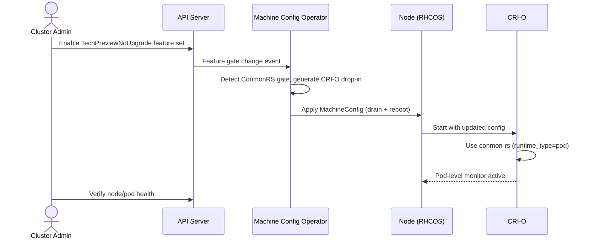

# Adopt conmon-rs as the Default Container Monitor in CRI-O

## Release Signoff Checklist

- [x] Enhancement is `implementable`
- [x] Design details are appropriately documented from clear requirements
- [x] Test plan is defined
- [x] Operational readiness criteria is defined
- [x] Graduation criteria for dev preview, tech preview, GA
- [ ] User-facing documentation is created in [openshift-docs](https://github.com/openshift/openshift-docs/)

## Summary

This enhancement proposes adopting [conmon-rs](https://github.com/containers/conmon-rs), a Rust-based pod-level
successor to the traditional C-based [conmon](https://github.com/containers/conmon), as the default container monitor
process in CRI-O on OpenShift. conmon-rs operates at the pod level rather than per-container, communicates with CRI-O
via Cap'n Proto over a Unix domain socket, and provides better resource usage, an async runtime, improved logging
capabilities, and a more maintainable codebase. The feature will be introduced behind a feature gate, initially as Tech
Preview with cluster-wide opt-in, and graduate to GA as the default container monitor.

## Motivation

The current container monitor (conmon) is a C program that spawns one process per container. This per-container model
leads to increased resource consumption at scale and limits the ability to share state across containers within a pod.
conmon-rs addresses these limitations by running a single monitor process per pod, using an async Rust runtime with a
Cap'n Proto RPC interface.

CRI-O already supports conmon-rs upstream via the `runtime_type = "pod"` configuration, and the Go client library is
integrated. However, OpenShift has not yet switched to conmon-rs by default. The conmon-rs binary is already in the Node
Layer (version 0.6.6 as of OCP 4.18), but it has not been built with any regularity since 4.18. All builds for 4.18 and
newer inherit the binary from the 4.18 repos, so it is effectively stale and not enabled. Upstream, conmon-rs v1.0.1 has
been vendored into CRI-O main ([cri-o/cri-o#10111](https://github.com/cri-o/cri-o/pull/10111)).

Benchmarking (container density testing with conmon-rs optimizations from
[containers/conmon-rs#3267](https://github.com/containers/conmon-rs/pull/3267)) shows that conmon-rs reduces total
system memory by 15-42% compared to conmon across all tested workloads (light to heavy logging, 1 to 50 containers).
CRI-O itself uses 350-1,000 KB less memory per container when using conmon-rs due to Cap'n Proto RPC efficiency
compared to conmon's custom socket protocol. Under non-exec workloads, clusters can run up to 54% more containers per
node; mixed real-world clusters see 20-30% more capacity.

Establishing regular conmon-rs builds in the Node Layer (OCP-aligned versioning) and making it the default container
monitor will reduce per-node resource overhead, improve maintainability, and provide a foundation for future pod-level features such as
WebSocket-based streaming for attach and exec operations, namespace management, and in-pod hook execution.

### User Stories

- As a cluster administrator, I want to opt in to using conmon-rs as the container monitor so that I can evaluate its
  resource efficiency and stability before it becomes the default. (During Tech Preview, opt-in requires enabling the
  `TechPreviewNoUpgrade` feature set, which enables all Tech Preview features cluster-wide.)

- As a platform engineer, I want CRI-O to use a single pod-level monitor process instead of one process per container
  so that per-node memory and CPU overhead is reduced at scale.

- As an SRE, I want to monitor the health of the container monitor subsystem through standard OpenShift metrics and
  alerts so that I can detect and remediate issues with conmon-rs in production.

- As a cluster administrator, I want the ability to fall back to the traditional conmon during the transition period so
  that I can maintain cluster stability. (During Tech Preview, fallback requires disabling the `TechPreviewNoUpgrade`
  feature set. After GA, upgraded clusters retain conmon by default; new installations can revert via a MachineConfig
  override; see [Reverting to conmon](#reverting-to-conmon).)

### Goals

1. Establish regular conmon-rs builds in the Node Layer, version-aligned to OCP releases, starting with OCP 5.1.

2. Allow cluster administrators to opt in to conmon-rs via the `ConmonRS` feature gate during Tech Preview.

3. Make conmon-rs the default container monitor in CRI-O for new installations at GA, and for all clusters in a
   subsequent release, replacing the per-container conmon model with the pod-level monitor.

4. Reduce per-node resource consumption (total RSS of monitor processes and total process count) compared to the
   current conmon-based setup.

5. Provide metrics and alerting for conmon-rs health so that cluster operators can monitor the container monitor
   subsystem.

### Non-Goals

1. Removing the traditional conmon binary from the node image. conmon will remain available as a fallback.

2. Changing the OCI runtime (runc/crun) selection. This enhancement only affects the container monitor, not the runtime
   that executes containers.

3. Exposing conmon-rs configuration options beyond the feature gate. Fine-grained conmon-rs tuning is out of scope for
   the initial implementation.

4. Enabling WebSocket-based streaming for attach and exec operations. conmon-rs supports this capability, but it
   requires separate configuration and testing. It can be enabled in a follow-up enhancement once conmon-rs is the
   active monitor.

## Proposal

The proposal has two main parts:

1. **Packaging**: Establish regular conmon-rs builds in the Node Layer so the package is actively maintained and
   version-aligned to OCP releases. See [Packaging](#packaging) for details.

2. **Feature Gate**: Introduce a `ConmonRS` feature gate in `TechPreviewNoUpgrade`. When the gate is enabled, the MCO
   generates a CRI-O drop-in that activates conmon-rs on the default runtime handler. No new API fields are added.
   During Tech Preview, administrators opt in by enabling the `TechPreviewNoUpgrade` feature set. At GA, the feature
   gate is promoted to the `Default` feature set and conmon-rs becomes the default container monitor for new
   installations. Upgraded clusters retain conmon until a subsequent release makes conmon-rs the universal default,
   following the same phased migration pattern as the runc-to-crun transition.

### Workflow Description

**Cluster administrator** is a human user responsible for managing an OpenShift cluster.

**MCO (Machine Config Operator)** is the operator responsible for managing node configuration, including CRI-O
settings.

**CRI-O** is the container runtime interface implementation running on each node.

#### Tech Preview: Opt-in enablement

1. The cluster administrator enables the `TechPreviewNoUpgrade` feature set on the cluster.

2. The MCO detects the `ConmonRS` feature gate and generates a CRI-O drop-in configuration for the default runtime
   handler. The MCO rolls out the change to all nodes, draining and rebooting them.

3. On each updated node, CRI-O starts using conmon-rs for all pods. Because the MCO drains workloads and reboots the
   node, all pods (including static pods such as etcd and kube-apiserver on control plane nodes) are recreated after
   reboot. There is no mixed conmon/conmon-rs state on a single node.

4. The cluster administrator verifies conmon-rs operation through CRI-O logs and pod health checks.

#### GA: Default enablement

1. Once the `ConmonRS` feature gate is promoted to the `Default` feature set, conmon-rs becomes the default container
   monitor for **new installations only**. The MCO generates the conmon-rs CRI-O drop-in on freshly installed clusters.

2. **Upgraded clusters retain conmon.** Clusters upgrading from a version where conmon was the active monitor continue
   using conmon. This follows the same pattern as the runc-to-crun migration, where upgraded clusters kept runc and only
   new installations received crun as the default. Administrators can opt in to conmon-rs on upgraded clusters by
   applying a MachineConfig that sets `runtime_type = "pod"` and `monitor_path = "/usr/bin/conmonrs"` on the default
   handler.

3. In a subsequent OCP release (after conmon-rs has been the default for new installations for at least one minor
   release cycle), the MCO will switch upgraded clusters to conmon-rs as well, making it the universal default.



### API Extensions

This enhancement does not introduce new API fields. The `ConmonRS` feature gate is the sole control mechanism. The MCO
checks whether the feature gate is enabled and generates the appropriate CRI-O drop-in configuration. No changes to the
`ContainerRuntimeConfig` CR are required.

### Topology Considerations

#### Hypershift / Hosted Control Planes

conmon-rs runs on worker nodes as part of CRI-O. Since Hypershift separates the control plane from worker nodes, this
change only affects the data plane (worker nodes in the hosted cluster). The hosted control plane components are not
affected. The feature gate propagates to hosted clusters through the standard HostedCluster configuration. No
HostedCluster API changes are required.

#### Standalone Clusters

This enhancement is fully relevant and is the primary target topology. All standalone cluster nodes (control plane and
workers) will use conmon-rs when the feature is enabled.

#### Single-node Deployments or MicroShift

conmon-rs is beneficial for single-node deployments where resources are constrained, since it reduces per-node process
count and total system memory through fewer monitor processes and Cap'n Proto RPC efficiency in CRI-O.

MicroShift uses CRI-O but does not use the MCO or `ContainerRuntimeConfig`. MicroShift's CRI-O configuration is
managed through its own configuration file (`/etc/crio/crio.conf.d/`). conmon-rs enablement for MicroShift would
require updating MicroShift's default CRI-O drop-in to set `runtime_type = "pod"` and
`monitor_path = "/usr/bin/conmonrs"` on the default handler, and ensuring the conmon-rs package is included in the
MicroShift RPM dependencies. This is out of scope for this enhancement and should be tracked in a separate MicroShift
Jira once conmon-rs reaches GA in OCP.

#### OpenShift Kubernetes Engine

This enhancement does not depend on features excluded from OKE. conmon-rs is a node-level component that is part of
the CRI-O runtime stack, which is included in OKE. The feature gate is available in OKE.

### Implementation Details/Notes/Constraints

#### Feature Gate

A new feature gate `ConmonRS` must be added to
[openshift/api features.go](https://github.com/openshift/api/blob/master/features/features.go) in the
`TechPreviewNoUpgrade` feature set, following the builder pattern:

```go
FeatureGateConmonRS = newFeatureGate("ConmonRS").
    reportProblemsToJiraComponent("node").
    contactPerson("saschagrunert").
    productScope(ocpSpecific).
    enhancementPR("https://github.com/openshift/enhancements/pull/2034").
    enable(inTechPreviewNoUpgrade()).
    mustRegister()
```

#### CRI-O Changes

CRI-O already supports conmon-rs upstream. The runtime selection is controlled per runtime handler via two
configuration fields:

- `runtime_type`: `"oci"` uses traditional conmon, `"pod"` uses conmon-rs.
- `monitor_path`: path to the monitor binary. For `runtime_type = "pod"`, this must point to the conmon-rs binary
  (e.g., `/usr/bin/conmonrs`).

When `runtime_type = "pod"` is set, CRI-O uses the `runtimePod` implementation (`internal/oci/runtime_pod.go`) which
spawns conmon-rs via the Go client library (`github.com/containers/conmon-rs/pkg/client`).

conmon-rs manages cgroups differently from conmon. When the infra container is created, CRI-O moves the conmon-rs
process into the pod's cgroup via `createContainerPlatform()` in `CreateContainer()`. This is transparent to the
administrator but changes the per-pod process tree layout.

conmon-rs also enables WebSocket-based streaming for attach and exec operations (CRI-O's `stream_websockets` config
option), which is not available with the traditional conmon. This capability can be enabled separately once conmon-rs is
the active monitor. WebSocket-based streaming is a future benefit of adopting conmon-rs but is not part of the initial
enablement scope (see Non-Goals).

No additional CRI-O code changes are required for OpenShift. The MCO-generated drop-in configuration is sufficient to
activate conmon-rs.

The upstream `container-selinux` policy does not yet include a file context for `/usr/bin/conmonrs`. The traditional
conmon binary uses the `conmon_exec_t` label. A `container-selinux` update is required to add a file context entry for
`/usr/bin/conmonrs` (with `conmon_exec_t`) before conmon-rs can run under enforcing SELinux. This must be completed
before the Tech Preview ships.

#### MCO Changes

The MCO needs to:

1. Check whether the `ConmonRS` feature gate is enabled.
2. When the gate is enabled, generate a CRI-O drop-in that sets `runtime_type` and `monitor_path` on the default
   runtime handler. The handler name must match the cluster's current default runtime (e.g., `crun` or `runc`).
   `monitor_path` is set explicitly rather than relying on CRI-O's build-time default to ensure the path matches the
   Node Layer RPM regardless of how CRI-O was compiled. Example for a crun-based cluster:
   ```toml
   [crio.runtime.runtimes.crun]
   runtime_type = "pod"
   monitor_path = "/usr/bin/conmonrs"
   ```
3. Only the default runtime handler is affected. Additional handlers (e.g., kata) retain their existing `runtime_type`
   configuration.

The conmon-rs binary path (`/usr/bin/conmonrs`) is defined by the conmon-rs RPM package spec. The MCO references this
path when generating drop-in configuration.

At GA, the `ConmonRS` feature gate is promoted to the `Default` feature set. The MCO generates the conmon-rs drop-in
for new installations automatically. Upgraded clusters retain their existing conmon configuration until a subsequent
release makes conmon-rs the universal default (see [GA: Default enablement](#ga-default-enablement)).

To distinguish new installations from upgrades, the MCO uses the same approach as the runc-to-crun migration: it
checks whether a CRI-O runtime configuration has already been applied to the cluster. On a new installation, no
prior runtime configuration exists and the MCO applies its current defaults (including conmon-rs). On an upgrade, the
existing runtime configuration is preserved and the MCO does not override the container monitor setting unless the
administrator explicitly applies a MachineConfig override.

#### Packaging

The conmon-rs RPM is already in the Node Layer but has not been built regularly since OCP 4.18; all subsequent releases
inherit the stale 4.18 build. Regular builds must be established so the package is actively maintained:
- The package must be built as part of the OCP release pipeline, version-aligned to OCP X.Y.
- The package ships alongside CRI-O, crun, and other node runtime components.
- The package version should be conmon-rs >= 1.0.1 for the OCP 5.1 release, matching the Go client vendored in CRI-O.

### Risks and Mitigations

**Risk**: conmon-rs introduces a new IPC protocol (Cap'n Proto over Unix sockets) that differs from the well-tested
pipe-based conmon protocol.

**Mitigation**: conmon-rs has been integrated into CRI-O upstream for multiple releases and has extensive upstream CI
coverage. The Tech Preview phase provides time to validate the protocol in OpenShift-specific workloads.

**Risk**: Pod-level monitoring (one process per pod) changes failure semantics. A conmon-rs crash affects all containers
in a pod, not just one.

**Mitigation**: This aligns with Kubernetes pod semantics where a pod is the atomic unit. conmon-rs is written in Rust,
which eliminates entire classes of memory safety bugs (buffer overflows, use-after-free, data races) that are common
sources of crashes in C-based conmon. When a conmon-rs process does exit unexpectedly, CRI-O detects the exit and marks
all containers in the pod as failed, triggering the kubelet's restart policy. This is the same recovery path used for
any pod-level failure.

**Risk**: The Rust toolchain introduces a new build dependency for the node image.

**Mitigation**: conmon-rs is already in the Node Layer. This enhancement establishes regular builds and enablement, not
a new build dependency.

**Risk**: After GA, upgraded clusters may need a way to revert if conmon-rs causes issues.

**Mitigation**: Upgraded clusters retain conmon by default and must explicitly opt in, so they are unaffected unless
they choose to switch. For new installations where conmon-rs is the default, a MachineConfig override (setting
`runtime_type = "oci"` on the default handler) provides a revert path without requiring a version downgrade. The
conmon binary remains in the node image through at least two GA releases.

### Drawbacks

- Introducing a new container monitor alongside the existing one increases the testing surface. Both code paths (conmon
  and conmon-rs) must be tested and supported during the transition period.

- Cap'n Proto is a less common serialization format in the OpenShift ecosystem, which may increase the learning curve
  for debugging container monitor communication issues.

- The pod-level monitoring model changes operational assumptions. Support teams need training on the new architecture.

## Alternatives (Not Implemented)

### Use conmon-v3 instead of conmon-rs

[conmon-v3](https://github.com/containers/conmon-v3) is a new Rust-based container monitor under the containers
organization that follows the traditional per-container model (like the original conmon) rather than the pod-level
model of conmon-rs. It is in early development (no stable release, `3.0.0-dev` version string) and targets the podman
use case. conmon-v3 was not chosen for this enhancement because CRI-O's existing conmon-rs integration uses the
pod-level model with Cap'n Proto RPC, which provides the process-count reduction and pod-level feature foundation that
motivate this proposal. conmon-v3 does not offer these architectural advantages for the CRI-O use case.

### Keep conmon as the default indefinitely

This avoids the transition cost but misses the resource efficiency gains and limits future pod-level features that
conmon-rs enables (namespace management, in-pod hooks, stats collection).

### Add a containerMonitor field to ContainerRuntimeConfig

A dedicated `containerMonitor` enum field could be added to the `ContainerRuntimeConfig` CR, gated behind the feature
gate. This would allow per-MachineConfigPool control over the container monitor type. This was rejected because the
field would be transitional by design: once conmon-rs graduates to GA and conmon is eventually dropped, the field
becomes dead API surface that must be maintained indefinitely. The feature gate alone provides the necessary opt-in
during Tech Preview and automatic enablement at GA without introducing API debt.

### Embed conmon-rs in runtime handler names

Instead of a separate control mechanism, conmon-rs could be selected by extending the set of runtime handlers the MCO
knows about (e.g., `"crun-conmonrs"`). This reduces API surface but conflates two independent concerns (OCI runtime
selection and container monitor selection) into a single field. If the set of runtimes or monitors grows, the
combinatorial explosion of handler names becomes unwieldy (e.g., `"crun-conmonrs"`, `"runc-conmonrs"`, etc.).

### Enable conmon-rs via CRI-O configuration only

conmon-rs could be enabled solely through CRI-O drop-in configuration files managed by MachineConfig. This was rejected
because it bypasses the MCO's validation and lifecycle management, making it harder to support and more error-prone for
administrators.

### Keep conmon-rs builds in the RHCOS layer

Building conmon-rs only in the RHCOS layer (version-aligned to RHEL) would mean slower update cycles and potential
version mismatches with CRI-O. Since conmon-rs and CRI-O are tightly coupled (the Go client version must match the
server), regular OCP-aligned builds in the Node Layer are preferred.

## Open Questions [optional]

None. Previously open questions have been resolved:

- ~~Should a drainless migration path be explored for switching existing pods from conmon to conmon-rs, or is the MCO's
  standard drain-and-reboot cycle sufficient?~~ **Resolved**: The MCO's standard drain-and-reboot cycle is sufficient.
  A drainless approach would add significant complexity (tracking which pods use which monitor, managing mixed state)
  for marginal benefit, since CRI-O configuration changes already require a node reboot.

## Test Plan

### Unit and integration tests

- **MCO drop-in generation**: Unit tests in openshift/machine-config-operator for the container runtime config
  controller, verifying that the correct CRI-O TOML drop-in is generated when the `ConmonRS` feature gate is enabled
  vs. disabled, and for each default runtime (`crun`, `runc`).

### End-to-end tests

All e2e tests must carry the `[OCPFeatureGate:ConmonRS]` and `[Jira:"Node"]` labels. Because enabling conmon-rs
requires an MCO rollout (node drain and reboot), the tests are inherently `[Serial]`, `[Slow]`, and `[Disruptive]`. A
dedicated test suite should be created in openshift/origin (`test/extended/node/conmon_rs.go`) with corresponding
periodic Prow jobs for both `TechPreviewNoUpgrade` and `Default` variants.

**Enablement and basic lifecycle:**

- Enable the `ConmonRS` feature gate on a cluster. Verify that CRI-O logs the info-level
  `"Runtime handler ... is using conmon-rs version"` message after the MCO rollout completes. Verify that
  `ps aux | grep conmonrs` shows one conmon-rs process per running pod on the updated nodes.

- Run a pod and exercise the full container lifecycle: create, start, exec, attach, logs, stop, delete. Verify all
  operations succeed with conmon-rs as the container monitor.

- Run a multi-container pod (including init containers) and verify that a single conmon-rs process is used for the pod
  throughout the entire lifecycle.

**Fallback and revert:**

- Apply a MachineConfig override that sets `runtime_type = "oci"` on the default handler and verify that nodes revert
  to the traditional conmon after the MCO rollout. Verify that pods created after the revert use conmon (one process
  per container). Remove the override and verify that conmon-rs is re-enabled.

**Upgrade and downgrade:**

- Upgrade a cluster from a version without conmon-rs to one where conmon-rs is the default for new installations.
  Verify that the upgraded cluster retains conmon as the container monitor (the MCO does not generate the conmon-rs
  drop-in). Verify that pods created after the upgrade still use conmon (one process per container, not conmon-rs).

- On an upgraded cluster that retained conmon, apply a MachineConfig override to opt in to conmon-rs. Verify that
  after the MCO rollout, pods use conmon-rs.

- Downgrade a cluster from a version where conmon-rs is the default to one without the `ConmonRS` feature gate and
  verify that CRI-O reverts to conmon.

**Graceful shutdown:**

- Delete a pod with `terminationGracePeriodSeconds` set and verify that containers receive SIGTERM, preStop hooks
  execute, and containers exit gracefully before SIGKILL. Compare the behavior against a conmon baseline to confirm
  that conmon-rs forwards signals correctly at the pod level.

**Negative and failure cases:**

- Kill the conmon-rs process for a running pod and verify that the kubelet detects the pod failure and restarts it
  according to the pod's restart policy.

- Verify that conmon-rs is not activated when the `ConmonRS` feature gate is not enabled (the MCO does not generate the
  conmon-rs drop-in).

**Load testing:**

- Deploy 100+ pods per node on a conmon-rs-enabled cluster and measure:
  - Per-node total RSS of monitor processes (conmon-rs vs. conmon baseline). Target: lower total RSS with conmon-rs due
    to one process per pod instead of one per container.
  - Per-node monitor process count. Target: equal to pod count (not container count).
  - Container create, start, and stop latency at the P50, P95, and P99 percentiles. Target: no regression compared to
    conmon baseline.
  - Pod startup latency under load. Target: no regression compared to conmon baseline.
- Compare results against a conmon baseline on the same cluster configuration to validate the resource consumption
  improvements claimed in the Goals.

**Metrics:**

- Verify that CRI-O exposes container operation metrics when conmon-rs is the active monitor. Key metrics include
  `crio_operations_latency_microseconds_total` (container create, start, stop, exec latency) and
  `crio_operations_errors_total` (error counts by operation type). Confirm that these metrics are scrapable by the
  in-cluster monitoring stack and that values are consistent with the conmon baseline (no unexplained regressions).

## Graduation Criteria

Feature promotion requires meeting the automated regression testing thresholds defined in
dev-guide/feature-zero-to-hero.md:

- Minimum 5 tests with the `[OCPFeatureGate:ConmonRS]` label
- All tests run at least 7 times per week
- All tests run at least 14 times per supported platform
- 95% pass rate across all runs
- Tests running on all supported platforms:

| Provider | Topology | Architecture | Network Stack |
| -------- | -------- | ------------ | ------------- |
| AWS | HA | amd64 | default |
| AWS | HA | arm64 | default |
| AWS | Single | amd64 | default |
| Azure | HA | amd64 | default |
| Azure | HA | arm64 | default |
| GCP | HA | amd64 | default |
| vSphere | HA | amd64 | default |
| Baremetal | HA | amd64 | IPv4 |
| Baremetal | HA | amd64 | IPv6 |
| Baremetal | HA | amd64 | Dual |

Both `TechPreviewNoUpgrade` and `Default` Prow job variants must exist so that tests continue running after promotion.

### Dev Preview -> Tech Preview

Not applicable. conmon-rs has been integrated into CRI-O upstream for multiple releases and has extensive upstream CI
coverage. The feature will ship directly to Tech Preview, skipping Dev Preview.

### Tech Preview (Target: OCP 5.1)

- [ ] Enhancement proposal approved
- [ ] conmon-rs >= v1.0.1 binary shipped in the Node Layer, version-aligned to OCP
- [ ] `ConmonRS` feature gate registered in `TechPreviewNoUpgrade` feature set
- [ ] MCO generates correct CRI-O drop-in configuration (`runtime_type` + `monitor_path`) when the `ConmonRS` feature
  gate is enabled
- [ ] End-to-end pod lifecycle works with conmon-rs (create, exec, attach, logs, stop, delete)
- [ ] At least 5 e2e tests passing in CI (OCPNODE-2149, OCPNODE-2150, OCPNODE-2151)
- [ ] `container-selinux` updated with file context for `/usr/bin/conmonrs` (labeled `conmon_exec_t`)
- [ ] Basic CRI-O metrics covering conmon-rs operations
- [ ] Documentation in openshift-docs (OSDOCS-4959)

### Tech Preview -> GA

**Prerequisites:**

- [ ] conmon-rs has run in Tech Preview for at least one OCP minor release cycle
- [ ] Field feedback collected from Tech Preview users
- [ ] No P0/P1 bugs outstanding against conmon-rs
- [ ] Load testing confirms resource consumption improvements at scale (100+ pods per node)
- [ ] Security review completed

**GA Criteria:**

- [ ] `ConmonRS` feature gate promoted to `Default` feature set (conmon-rs is the default container monitor for new
  installations; upgraded clusters retain conmon)
- [ ] Upgrade and downgrade testing validates seamless transition between conmon and conmon-rs
- [ ] All promotion testing thresholds met (5 tests, 7 runs/week, 14 runs/platform, 95% pass rate, all supported
  platforms)
- [ ] User-facing documentation updated for GA
- [ ] Support procedures documented for conmon-rs troubleshooting
- [ ] SLIs and alerts for conmon-rs health integrated into the monitoring stack

### Removing a deprecated feature

Once conmon-rs is the universal default for all clusters (new and upgraded) for at least two OCP minor releases, the
traditional conmon can be deprecated:

- Announce deprecation of conmon as container monitor.
- Before removing the conmon binary, the MCO must detect MachineConfig overrides that set `runtime_type = "oci"` or
  reference a conmon `monitor_path` on the default handler. The MCO should block the upgrade during preflight checks
  with a clear error message directing the administrator to remove the override. This prevents clusters from upgrading
  into a broken state where the override references a binary that no longer exists.
- Remove the conmon binary from the node image.

CRI-O upstream will continue to support `runtime_type = "oci"` for the foreseeable future, since conmon remains the
default monitor in upstream CRI-O and in other distributions (e.g., Fedora, RHEL standalone). Removing the conmon
binary from the OpenShift node image does not affect upstream CRI-O's support for the OCI monitor path.

## Upgrade / Downgrade Strategy

### Upgrade

During an upgrade to an OCP version where conmon-rs is the default (feature gate in `Default` set), **upgraded clusters
retain their existing conmon configuration**. The MCO does not switch upgraded clusters to conmon-rs automatically.
This follows the same pattern as the runc-to-crun migration: only new installations receive conmon-rs as the default.
Administrators can opt in to conmon-rs on upgraded clusters by applying a MachineConfig override. In a subsequent
release, the MCO will switch all remaining clusters to conmon-rs.

### Downgrade

During a full version downgrade (N+1 to N), if N does not include the `ConmonRS` feature gate, the MCO will not
generate the conmon-rs drop-in and CRI-O will use its default configuration (conmon). No manual intervention is
required.

## Version Skew Strategy

conmon-rs is a node-local component. During a standard upgrade, upgraded clusters retain conmon, so there is no
conmon/conmon-rs skew across nodes. When the MCO eventually switches upgraded clusters to conmon-rs in a subsequent
release, or when an administrator opts in via MachineConfig, nodes are updated sequentially through the MCO's rolling
update process. At any point during this rollout:

- Some nodes may still use conmon (not yet updated).
- Some nodes may use conmon-rs (already updated).

This is safe because the container monitor is a per-node component with no cross-node communication. Each node
independently manages its container lifecycle through its locally running CRI-O instance.

The conmon-rs Go client library version must match the conmon-rs server binary version. Since both are shipped as part
of the same OCP release (CRI-O contains the client, the Node Layer contains the server binary), version skew between
client and server is not possible within a single node. The MCO's drain-and-reboot cycle ensures that both binaries are
updated atomically: the node receives the new OS image (containing both updated CRI-O and conmon-rs), reboots, and
starts CRI-O with the matching versions. There is no window where one is updated without the other.

## Operational Aspects of API Extensions

This enhancement does not add new API fields. The `ConmonRS` feature gate controls enablement. No webhooks, finalizers,
or aggregated API servers are introduced.

- **Health indicators**: The MCO's existing condition reporting
  (`ContainerRuntimeConfigControllerDegraded`, `ContainerRuntimeConfigControllerAvailable`) will cover conmon-rs
  configuration errors.

- **Impact on existing SLIs**: None. The feature gate only affects CRI-O's container monitor selection, which is a
  node-local operation.

- **Failure modes**: If the conmon-rs binary is missing or corrupt on a node, CRI-O will fail to start after the config
  change. The MCO detects this through the node's `MachineConfigDaemon` degraded condition, and the rollout pauses
  before affecting additional nodes.

- **Escalation**: Issues with conmon-rs should be escalated to the Node team (openshift/node Jira component). Issues
  with MCO configuration rollout should be escalated to the MCO team (openshift/machine-config-operator).

## Support Procedures

### Detecting conmon-rs issues

- **CRI-O logs**: When conmon-rs is active, CRI-O logs at startup with an info-level message per runtime handler:
  `"Runtime handler %q is using conmon-rs version: ..."` (from config validation). During pod creation, a debug-level
  message `"Using conmonrs version: ..."` is logged for each infra container.

- **Process listing**: On a node using conmon-rs, `ps aux | grep conmonrs` will show one conmon-rs process per running
  pod.

- **Metrics**: CRI-O exposes metrics for container operations. Elevated error rates or latency in container
  create/start/exec operations may indicate conmon-rs issues.

- **Events**: Kubernetes events on pods will report failures in container creation if conmon-rs fails to start or
  crashes.

- **Crash diagnostics**: When conmon-rs exits unexpectedly, CRI-O detects the exit and logs the exit code and signal
  (if killed) for the conmon-rs process. conmon-rs is compiled with `panic = "abort"` in release builds, so panics
  terminate immediately with SIGABRT rather than unwinding; any panic message is written to stderr, which CRI-O
  captures. conmon-rs logs its own operational output to journald by default (`LogDriver::Systemd`), so
  `journalctl -t conmonrs` on the affected node shows conmon-rs activity leading up to a crash. On RHCOS,
  systemd-coredump captures core dumps via the default `kernel.core_pattern` pipe; core dumps for conmon-rs can be
  inspected with `coredumpctl list` and `coredumpctl info` on the affected node.

- **crictl**: Standard `crictl` commands (inspect, logs, exec, stats) work identically with conmon-rs as with conmon.
  The container monitor selection is transparent to `crictl` because CRI-O abstracts the monitor implementation behind
  the CRI API.

- **must-gather**: The existing CRI-O must-gather already collects CRI-O logs and node journal output, which includes
  conmon-rs activity (logged via journald under the `conmonrs` syslog identifier). No must-gather changes are required.

### Reverting to conmon

If conmon-rs causes issues during Tech Preview, disable the `TechPreviewNoUpgrade` feature set. After GA, upgraded
clusters already use conmon by default and are unaffected. For new installations (where conmon-rs is the default) or
clusters that opted in, apply a MachineConfig override that sets `runtime_type = "oci"` on the default handler to
revert to conmon.

### Consequences of reverting to conmon

- Reverting (whether by disabling `TechPreviewNoUpgrade` during Tech Preview or applying a MachineConfig override after
  GA) triggers an MCO rollout, which drains and reboots nodes. Running workloads are evicted during the drain and
  rescheduled to other nodes.
- After revert, per-node resource consumption will return to pre-conmon-rs levels.
- No data loss or consistency issues. The container monitor is stateless from the workload perspective.

## Infrastructure Needed [optional]

- Regular conmon-rs package builds in the OCP Node Layer build pipeline.
- CI jobs for conmon-rs-enabled clusters in the `TechPreviewNoUpgrade` variant.
- Jira Epic OCPNODE-1288 tracks the conmon-rs adoption work across CRI-O, MCO, and openshift/api.
