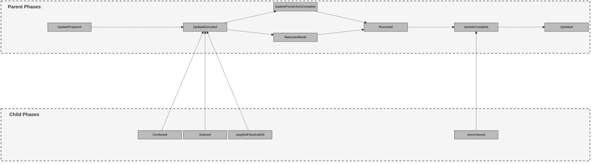

# Track MCO State Related to Upgrades in the MachineConfigNode Type

## Summary

This enhancement describes how Nodes and their upgrade processes should be aggregated by the MCO into a user facing object. The goal here is to allow customers and the MCO team to decipher our processes in a more verbose way, speeding up the debugging process and allowing for better customer engagement.

## Motivation

The MCO manages node upgrades but since we do not own the object or store much of their data in other ways, much of what occurs during an upgrade is simply a black box operation that we currently report as "Updating" or "Updated". Users can debug into a specific node or look into the node spec for some of this information, but most of it simply lives in the MCO code rather than in data structures. We want to put these abstract "phases" of node operations, as triggered by the MCO, into a concrete data structure.

This feature is more tied to MCO procedures than the state reporting of the MachineConfigPool (MCP). We are designing this to fill the gap between what the MCP currently reports and what is actually happening in the MCO pertaining to Node updates. One can view this as an API tied to MCO procedures. However, these objects are a way to track node update status and, since the MCO owns the update code, it just so happens that a lot of these actions are tied to the MCO.

### User Stories

* As a cluster admin, during upgrades I would like to monitor the progress of individual node upgrades so that, if one of the nodes sticks during an upgrade, I can easily see where the node got stuck and why.
* As an OpenShift developer, I would like a place to observe the MCO's view of a Node so that I can easily identify if the MCO is related to an upgrade failure in CI.

### Goals

* Make a MachineConfigNode type that succinctly holds the upgrade data.
* Have API load be as minimal as possible but augment the proper objects as needed.
* Aggregate as much MCO related data into easily accessible places as possible.

### Non-Goals

* Modify or remove existing API and status fields.
* MCN will not be implemented for Hypershift in the initial 4.19 GA due to fundamental architectural incompatibilities. Hypershift's design conflicts with our current approach in two key areas:
  * Administrative Separation: Hypershift intentionally prevents hosted cluster admins from managing or influencing node-level updates. MCN, however, is designed to expose this information to users.
  * Resource Efficiency: To maintain a minimal footprint, Hypershift avoids persistent daemons for node configuration, while our MCN process relies on a long-running agent.
Given these conflicts with Hypershift's core principles, we will opt to skip Hypershift for the initial implementation. In the future, once we align hosted and self-managed OCP, we can revisit MCN in Hypershift.

## Proposal
Create a Datatype for tracking Node Upgrade Progression in the MCO as well as Operator Component Progression in the MCO.

Create a mechanism inside of the MCO to update the new MachineConfigNode (MCN) API type with data about a Node's progress during an upgrade and any errors that occur during those processes.

The MachineConfigDaemon (MCD) owns this datatype. Inside of the MCD there now is an "UpgradeMonitor" package which contains all of the logic to manage these MCN. Since the Daemon owns all code related to updates (outside of a few drain controller functions), the MachineConfigDaemon has full ownership over these new objects. During the process of an upgrade, the MachineConfigDaemon will call the upgrade monitor with key information related to OCP updates and it will update the spec and status of the MCNs. The MCD API calls have scope restrictions so that node A's MCD can only update node A's MCN and cannot update node B's MCN (see [OCPBUGS-30343](https://issues.redhat.com//browse/OCPBUGS-30343) for more information).

The MachineConfigOperator pod will manage the rollout of the initial objects for MachineConfigNodes. The MachineConfigOperator pod manages all manifests and resources which the operator owns, making this the best place for resource management of the MachineConfigNode to live. The MCN CustomResourceDefinition (CRD) lives in the API repo and is deployed by the ClusterVersionOperator (CVO).

The data created by this MCN would look like the following:

```console
$ oc get machineconfignodes
NAME                          POOLNAME   DESIREDCONFIG                                      CURRENTCONFIG                                      UPDATED
ip-10-0-1-147.ec2.internal    worker     rendered-worker-e484b6e623b09767d5d8245e01a90a41   rendered-worker-e484b6e623b09767d5d8245e01a90a41   True
ip-10-0-20-154.ec2.internal   master     rendered-master-78c005824ab643a5e2ac917f028b570f   rendered-master-78c005824ab643a5e2ac917f028b570f   True
ip-10-0-41-83.ec2.internal    worker     rendered-worker-e484b6e623b09767d5d8245e01a90a41   rendered-worker-e484b6e623b09767d5d8245e01a90a41   True
ip-10-0-48-14.ec2.internal    master     rendered-master-78c005824ab643a5e2ac917f028b570f   rendered-master-78c005824ab643a5e2ac917f028b570f   True
ip-10-0-79-1.ec2.internal     worker     rendered-worker-e484b6e623b09767d5d8245e01a90a41   rendered-worker-e484b6e623b09767d5d8245e01a90a41   True
ip-10-0-95-127.ec2.internal   master     rendered-master-78c005824ab643a5e2ac917f028b570f   rendered-master-78c005824ab643a5e2ac917f028b570f   True
```

as well as 

```console
$ oc get machineconfignodes -o wide
NAME                          POOLNAME   DESIREDCONFIG                                      CURRENTCONFIG                                      UPDATED   UPDATEPREPARED   UPDATEEXECUTED   UPDATEPOSTACTIONCOMPLETE   UPDATECOMPLETE   RESUMED   UPDATEDFILESANDOS   CORDONEDNODE   DRAINEDNODE   REBOOTEDNODE   UNCORDONEDNODE
ip-10-0-1-147.ec2.internal    worker     rendered-worker-e484b6e623b09767d5d8245e01a90a41   rendered-worker-e484b6e623b09767d5d8245e01a90a41   True      False            False            False                      False            False     False               False          False         False          False
ip-10-0-20-154.ec2.internal   master     rendered-master-78c005824ab643a5e2ac917f028b570f   rendered-master-78c005824ab643a5e2ac917f028b570f   True      False            False            False                      False            False     False               False          False         False          False
ip-10-0-41-83.ec2.internal    worker     rendered-worker-e484b6e623b09767d5d8245e01a90a41   rendered-worker-e484b6e623b09767d5d8245e01a90a41   True      False            False            False                      False            False     False               False          False         False          False
ip-10-0-48-14.ec2.internal    master     rendered-master-78c005824ab643a5e2ac917f028b570f   rendered-master-78c005824ab643a5e2ac917f028b570f   True      False            False            False                      False            False     False               False          False         False          False
ip-10-0-79-1.ec2.internal     worker     rendered-worker-e484b6e623b09767d5d8245e01a90a41   rendered-worker-e484b6e623b09767d5d8245e01a90a41   True      False            False            False                      False            False     False               False          False         False          False
ip-10-0-95-127.ec2.internal   master     rendered-master-78c005824ab643a5e2ac917f028b570f   rendered-master-78c005824ab643a5e2ac917f028b570f   True      False            False            False                      False            False     False               False          False         False          False
```

where each name represents a node. The statuses reported are created explicitly from MCO node annotations and MCO actions, no other operator actions are taken into account here. This allows us to get quite specific in what is occurring on the nodes.

The structure of the MCN looks like the following:

```console
$ oc describe machineconfignodes/ip-10-0-1-147.ec2.internal
Name:         ip-10-0-1-147.ec2.internal
Namespace:    
Labels:       <none>
Annotations:  <none>
API Version:  machineconfiguration.openshift.io/v1
Kind:         MachineConfigNode
Metadata:
  Creation Timestamp:  2025-05-22T12:37:24Z
  Generation:          2
  Owner References:
    API Version:     v1
    Kind:            Node
    Name:            ip-10-0-1-147.ec2.internal
    UID:             1a01a163-ca89-4007-99cf-87012214c953
  Resource Version:  17966
  UID:               757c64cd-d2cf-4b5b-bf32-90ec68f4065a
Spec:
  Config Version:
    Desired:  rendered-worker-e484b6e623b09767d5d8245e01a90a41
  Node:
    Name:  ip-10-0-1-147.ec2.internal
  Pool:
    Name:  worker
Status:
  Conditions:
    Last Transition Time:  2025-05-22T12:37:28Z
    Message:               All pinned image sets complete
    Reason:                AsExpected
    Status:                False
    Type:                  PinnedImageSetsProgressing
    Last Transition Time:  2025-05-22T12:37:28Z
    Message:               This node has not yet entered the UpdatePrepared phase
    Reason:                NotYetOccurred
    Status:                False
    Type:                  UpdatePrepared
    Last Transition Time:  2025-05-22T12:37:28Z
    Message:               This node has not yet entered the UpdateExecuted phase
    Reason:                NotYetOccurred
    Status:                False
    Type:                  UpdateExecuted
    Last Transition Time:  2025-05-22T12:37:28Z
    Message:               This node has not yet entered the UpdatePostActionComplete phase
    Reason:                NotYetOccurred
    Status:                False
    Type:                  UpdatePostActionComplete
    Last Transition Time:  2025-05-22T12:38:20Z
    Message:               Action during update to rendered-worker-e484b6e623b09767d5d8245e01a90a41: Uncordoned Node as part of completing upgrade phase
    Reason:                Uncordoned
    Status:                False
    Type:                  UpdateComplete
    Last Transition Time:  2025-05-22T12:38:20Z
    Message:               Action during update to rendered-worker-e484b6e623b09767d5d8245e01a90a41: In desired config . Resumed normal operations.
    Reason:                Resumed
    Status:                False
    Type:                  Resumed
    Last Transition Time:  2025-05-22T12:37:28Z
    Message:               This node has not yet entered the Drained phase
    Reason:                NotYetOccurred
    Status:                False
    Type:                  Drained
    Last Transition Time:  2025-05-22T12:37:28Z
    Message:               This node has not yet entered the AppliedFilesAndOS phase
    Reason:                NotYetOccurred
    Status:                False
    Type:                  AppliedFilesAndOS
    Last Transition Time:  2025-05-22T12:37:28Z
    Message:               This node has not yet entered the Cordoned phase
    Reason:                NotYetOccurred
    Status:                False
    Type:                  Cordoned
    Last Transition Time:  2025-05-22T12:37:28Z
    Message:               This node has not yet entered the RebootedNode phase
    Reason:                NotYetOccurred
    Status:                False
    Type:                  RebootedNode
    Last Transition Time:  2025-05-22T12:38:20Z
    Message:               Node ip-10-0-1-147.ec2.internal Updated
    Reason:                Updated
    Status:                True
    Type:                  Updated
    Last Transition Time:  2025-05-22T12:38:20Z
    Message:               Action during update to rendered-worker-e484b6e623b09767d5d8245e01a90a41: UnCordoned node. The node is reporting Unschedulable = false
    Reason:                UpdateCompleteUncordoned
    Status:                False
    Type:                  Uncordoned
    Last Transition Time:  2025-05-22T12:37:28Z
    Message:               This node has not yet entered the NodeDegraded phase
    Reason:                NotYetOccurred
    Status:                False
    Type:                  NodeDegraded
    Last Transition Time:  2025-05-22T12:37:28Z
    Message:               All is good
    Reason:                AsExpected
    Status:                False
    Type:                  PinnedImageSetsDegraded
  Config Version:
    Current:            rendered-worker-e484b6e623b09767d5d8245e01a90a41
    Desired:            rendered-worker-e484b6e623b09767d5d8245e01a90a41
  Observed Generation:  3
Events:                 <none>
```

The above struct gives us some helpful information about a node as it pertains to the MCO. The `Spec` contains information about the Node's name, MCP association, and the desired config version it is targeting. The heart of the MCN resource is the list of `Conditions`, which describes all upgrade related events that have occurred on the node from the most recent upgrade process, no matter how small. You can also see the current and desired MachineConfig (MC) versions, indicating whether or not the node should be updating as well as whether or not the currently tracked update process held in `Conditions` is updating to the expected MC. The `ObservedGeneration` exists to let the user know how many times we have gone through some upgrade related changes.

The desired config found in the spec will get updated immediately when a new config is found on the node. However, the desired config found in the status will only get updated once the new config has been validated in the MCD. In the current implementation, the desired config is populated in the status by checking whether the update successfully gets past the "UpdatePrepared" phase. If the "UpdatePrepared" phase succeeds, then the status can safely add the desired config. 

The states to be reported by this MCN will roughly fall into the following:

#### Prepared phase
 - Stopping config drift monitor
 - Reconciling configs
#### Executed Phase
- Cordoned Node
- Drained Node
- Updated on disk state
- Updated OS
#### Post Config Action or Reboot Phase
- Closing daemon
- Node Reboot
- Reloading CRIO
#### Completed Phase
- Uncordoned
- Updating node state and metrics
#### Resumed Phase
- Start config drift monitor
#### Error Phase
- Errors in any of the update phases is recorded in the  `Condition` message
- Any node degradation is recorded in the `NodeDegraded` condition

### Workflow Description

With the implementation the MCO introduced in 4.15 and promotion to General Availability (GA) in 4.19, the MCN objects are meant to track upgrade progression of nodes as impacted by the MCO. The general progression here is:
- False == this phase has not started yet during the most recent upgrade process
- Unknown == this phase is either being executed or has errored
  - If the phase has errored, `oc describe machineconfignodes/<node-name>` will display more information in the `metav1.Conditions` list.
- True == this phase is complete

There are three types of conditions in MCN:
- Parent
   - These conditions track the overall arc of an upgrade.
   - Includes `UpdatePrepared`, `UpdateExecuted`, `UpdatePostActionComplete`, `RebootedNode`, `Resumed`, `UpdateComplete`, and `Updated`.
- Child
   - These conditions are phases that occur within the overarching parent phases.
   - Includes `Drained`, `AppliedFilesAndOS`, `Cordoned`, and `Uncordoned`.
- Singleton
   - These conditions do not relate to a stage in a node update, but provide additional information on the processes occurring on a node.
   - Includes `NodeDegraded`, `PinnedImageSetsProgressing`, and `PinnedImageSetsDegraded`.
   - Note that `PinnedImageSetsProgressing`, and `PinnedImageSetsDegraded` will be explained in greater detail in the [PinnedImageSet State Reporting section](#pinnedimageset-state-reporting).

#### Standard Update Flow
When an upgrade is triggered by there being a mismatch between a desired and current config or simply just a new MC being applied, the MCNs for a specific pool will report the following processes (roughly).

The information shown in `oc get machineconfignodes` includes the Node's name, associated MCP, current and desired config versions, and updated status. Using `oc describe machineconfignodes -o wide` will additionally reveal all parent and child phases. Within each parent phase there can be 0+ child phases that customers can use to see upgrade progression. The upgrade flow can be seen in the following diagram and in the subsequent example outputs.



*Before an update is triggered, UPDATED will be True and all other statuses will be False.*
```console
$ oc get machineconfignodes -o wide
NAME                          POOLNAME   DESIREDCONFIG                                      CURRENTCONFIG                                      UPDATED   UPDATEPREPARED   UPDATEEXECUTED   UPDATEPOSTACTIONCOMPLETE   UPDATECOMPLETE   RESUMED   UPDATEDFILESANDOS   CORDONEDNODE   DRAINEDNODE   REBOOTEDNODE   UNCORDONEDNODE
ip-10-0-16-253.ec2.internal   master     rendered-master-6c320f722eb9ce8bfbd80750dbf70d2e   rendered-master-6c320f722eb9ce8bfbd80750dbf70d2e   True      False            False            False                      False            False     False               False          False         False          False          
```

*Once an update is triggered, UPDATED will flip to False and UPDATEPREPARED begins.*
```console
$ oc get machineconfignodes -o wide
NAME                          POOLNAME   DESIREDCONFIG                                      CURRENTCONFIG                                      UPDATED   UPDATEPREPARED   UPDATEEXECUTED   UPDATEPOSTACTIONCOMPLETE   UPDATECOMPLETE   RESUMED   UPDATEDFILESANDOS   CORDONEDNODE   DRAINEDNODE   REBOOTEDNODE   UNCORDONEDNODE
ip-10-0-16-253.ec2.internal   master     rendered-master-ceedbbb3b533372a501c2410fa554c89   rendered-master-6c320f722eb9ce8bfbd80750dbf70d2e   False     True             False            False                      False            False     False               False          False         False          False          
```

*After the update prepared phase completes, UPDATEEXECUTED and its children phases, CORDONEDNODE, DRAINEDNODE, and UPDATEDFILESANDOS, begin.*
```console
$ oc get machineconfignodes -o wide
NAME                          POOLNAME   DESIREDCONFIG                                      CURRENTCONFIG                                      UPDATED   UPDATEPREPARED   UPDATEEXECUTED   UPDATEPOSTACTIONCOMPLETE   UPDATECOMPLETE   RESUMED   UPDATEDFILESANDOS   CORDONEDNODE   DRAINEDNODE   REBOOTEDNODE   UNCORDONEDNODE
ip-10-0-16-253.ec2.internal   master     rendered-master-ceedbbb3b533372a501c2410fa554c89   rendered-master-6c320f722eb9ce8bfbd80750dbf70d2e   False     True             Unknown          False                      False            False     False               True           Unknown       False          False          
```

```console
$ oc get machineconfignodes -o wide
NAME                          POOLNAME   DESIREDCONFIG                                      CURRENTCONFIG                                      UPDATED   UPDATEPREPARED   UPDATEEXECUTED   UPDATEPOSTACTIONCOMPLETE   UPDATECOMPLETE   RESUMED   UPDATEDFILESANDOS   CORDONEDNODE   DRAINEDNODE   REBOOTEDNODE   UNCORDONEDNODE
ip-10-0-16-253.ec2.internal   master     rendered-master-ceedbbb3b533372a501c2410fa554c89   rendered-master-6c320f722eb9ce8bfbd80750dbf70d2e   False     True             Unknown          False                      False            False     Unknown             True           True          False          False          
```

```console
$ oc get machineconfignodes -o wide
NAME                          POOLNAME   DESIREDCONFIG                                      CURRENTCONFIG                                      UPDATED   UPDATEPREPARED   UPDATEEXECUTED   UPDATEPOSTACTIONCOMPLETE   UPDATECOMPLETE   RESUMED   UPDATEDFILESANDOS   CORDONEDNODE   DRAINEDNODE   REBOOTEDNODE   UNCORDONEDNODE
ip-10-0-16-253.ec2.internal   master     rendered-master-ceedbbb3b533372a501c2410fa554c89   rendered-master-6c320f722eb9ce8bfbd80750dbf70d2e   False     True             True             False                      False            False     True                True           True          False          False          
```

*After the body of the upgrade completes, either UPDATEPOSTACTIONCOMPLETE or REBOOTEDNODE begins, depending on the update needs.*
```console
$ oc get machineconfignodes -o wide
NAME                          POOLNAME   DESIREDCONFIG                                      CURRENTCONFIG                                      UPDATED   UPDATEPREPARED   UPDATEEXECUTED   UPDATEPOSTACTIONCOMPLETE   UPDATECOMPLETE   RESUMED   UPDATEDFILESANDOS   CORDONEDNODE   DRAINEDNODE   REBOOTEDNODE   UNCORDONEDNODE
ip-10-0-16-253.ec2.internal   master     rendered-master-ceedbbb3b533372a501c2410fa554c89   rendered-master-6c320f722eb9ce8bfbd80750dbf70d2e   False     True             True             False                      False            False     True                True           True          Unknown        False          
```

```console
$ oc get machineconfignodes -o wide
NAME                          POOLNAME   DESIREDCONFIG                                      CURRENTCONFIG                                      UPDATED   UPDATEPREPARED   UPDATEEXECUTED   UPDATEPOSTACTIONCOMPLETE   UPDATECOMPLETE   RESUMED   UPDATEDFILESANDOS   CORDONEDNODE   DRAINEDNODE   REBOOTEDNODE   UNCORDONEDNODE
ip-10-0-16-253.ec2.internal   master     rendered-master-ceedbbb3b533372a501c2410fa554c89   rendered-master-6c320f722eb9ce8bfbd80750dbf70d2e   False     True             True             False                      False            False     True                True           True          True           False          
```

*After the post update action completes, normal processes are RESUMED.*
```console
$ oc get machineconfignodes -o wide
NAME                          POOLNAME   DESIREDCONFIG                                      CURRENTCONFIG                                      UPDATED   UPDATEPREPARED   UPDATEEXECUTED   UPDATEPOSTACTIONCOMPLETE   UPDATECOMPLETE   RESUMED   UPDATEDFILESANDOS   CORDONEDNODE   DRAINEDNODE   REBOOTEDNODE   UNCORDONEDNODE
ip-10-0-16-253.ec2.internal   master     rendered-master-ceedbbb3b533372a501c2410fa554c89   rendered-master-6c320f722eb9ce8bfbd80750dbf70d2e   False     True             True             False                      False            True      True                True           True          True           False          
```

*The final parts of the update are completed in UPDATECOMPLETE and its child phase, UNCORDONEDNODE.*
```console
$ oc get machineconfignodes -o wide
NAME                          POOLNAME   DESIREDCONFIG                                      CURRENTCONFIG                                      UPDATED   UPDATEPREPARED   UPDATEEXECUTED   UPDATEPOSTACTIONCOMPLETE   UPDATECOMPLETE   RESUMED   UPDATEDFILESANDOS   CORDONEDNODE   DRAINEDNODE   REBOOTEDNODE   UNCORDONEDNODE
ip-10-0-16-253.ec2.internal   master     rendered-master-ceedbbb3b533372a501c2410fa554c89   rendered-master-6c320f722eb9ce8bfbd80750dbf70d2e   False     True             True             False                      True             True      True                True           True          True           True           
```

*When the desired and current config versions of the node match, UPDATED will flip back to True and all other statuses will flip to False. This marks the completion of the update.*
```console
$ oc get machineconfignodes -o wide
NAME                          POOLNAME   DESIREDCONFIG                                      CURRENTCONFIG                                      UPDATED   UPDATEPREPARED   UPDATEEXECUTED   UPDATEPOSTACTIONCOMPLETE   UPDATECOMPLETE   RESUMED   UPDATEDFILESANDOS   CORDONEDNODE   DRAINEDNODE   REBOOTEDNODE   UNCORDONEDNODE
ip-10-0-16-253.ec2.internal   master     rendered-master-ceedbbb3b533372a501c2410fa554c89   rendered-master-ceedbbb3b533372a501c2410fa554c89   True      False            False            False                      False            False     False               False          False         False          False          
```

In general, a state (and its respective child states) will transition from False -> Unknown -> True -> False. The states are mostly in the past tense. This is because processes like `Drained` are primarily defined by completion, not the progress. So a user will have `UpdateExecuted` == Unknown and `Drained` == Unknown until the Drain actually completes. However, the unknown phase will be accompanied by a message for how the drain is currently going or if an error has occurred during the drain.

Once Updated == True, the update process is considered complete, all previous states are set to False, and the condition details will show that the message is from the previous update cycle.

If you want to look at oc describe for more verbose details of other events in an upgrade cycle that happened on the node, you can do so using `oc describe machineconfignodes/<node-name>`. This will also show information about a degraded node, if applicable, as can be seen in the following example output (note that the output below is not correlated to the above example).

```console
$ oc describe machineconfignode/ip-10-0-20-154.ec2.internal
Name:         ip-10-0-20-154.ec2.internal
Namespace:    
Labels:       <none>
Annotations:  <none>
API Version:  machineconfiguration.openshift.io/v1
Kind:         MachineConfigNode
Metadata:
  Creation Timestamp:  2025-05-22T12:32:13Z
  Generation:          4
  Owner References:
    API Version:     v1
    Kind:            Node
    Name:            ip-10-0-20-154.ec2.internal
    UID:             a8f61760-2e07-4358-bd8c-c48e716f60a7
  Resource Version:  73071
  UID:               1784fcc7-b064-495a-a4e9-8a268fb47c2d
Spec:
  Config Version:
    Desired:  rendered-master-7de7db7349148346f2cfd55ca51582cc
  Node:
    Name:  ip-10-0-20-154.ec2.internal
  Pool:
    Name:  master
Status:
  Conditions:
    Last Transition Time:  2025-05-22T12:32:20Z
    Message:               All pinned image sets complete
    Reason:                AsExpected
    Status:                False
    Type:                  PinnedImageSetsProgressing
    Last Transition Time:  2025-05-22T14:17:53Z
    Message:               Update Compatible. Post Cfg Actions: [] Drain Required: true
    Reason:                UpdatePrepared
    Status:                True
    Type:                  UpdatePrepared
    Last Transition Time:  2025-05-22T14:20:33Z
    Message:               Updating the Files and OS on disk as a part of the in progress phase
    Reason:                AppliedFilesAndOS
    Status:                Unknown
    Type:                  UpdateExecuted
    Last Transition Time:  2025-05-22T12:32:20Z
    Message:               This node has not yet entered the UpdatePostActionComplete phase
    Reason:                NotYetOccurred
    Status:                False
    Type:                  UpdatePostActionComplete
    Last Transition Time:  2025-05-22T12:33:26Z
    Message:               Action during update to not-yet-set: Uncordoned Node as part of completing upgrade phase
    Reason:                Uncordoned
    Status:                False
    Type:                  UpdateComplete
    Last Transition Time:  2025-05-22T12:33:26Z
    Message:               Action during update to not-yet-set: In desired config . Resumed normal operations.
    Reason:                Resumed
    Status:                False
    Type:                  Resumed
    Last Transition Time:  2025-05-22T14:20:30Z
    Message:               Drained node. The drain is complete as the desired drainer matches current drainer: drain-rendered-master-7de7db7349148346f2cfd55ca51582cc
    Reason:                UpdateExecutedDrained
    Status:                True
    Type:                  Drained
    Last Transition Time:  2025-05-22T14:20:33Z
    Message:               Applying files and new OS config to node. OS will not need an update. SSH Keys will not need an update
    Reason:                UpdateExecutedAppliedFilesAndOS
    Status:                Unknown
    Type:                  AppliedFilesAndOS
    Last Transition Time:  2025-05-22T14:17:58Z
    Message:               Cordoned node. The node is reporting Unschedulable = true
    Reason:                UpdateExecutedCordoned
    Status:                True
    Type:                  Cordoned
    Last Transition Time:  2025-05-22T12:32:20Z
    Message:               This node has not yet entered the RebootedNode phase
    Reason:                NotYetOccurred
    Status:                False
    Type:                  RebootedNode
    Last Transition Time:  2025-05-22T14:17:53Z
    Message:               Node ip-10-0-20-154.ec2.internal needs an update
    Reason:                Updated
    Status:                False
    Type:                  Updated
    Last Transition Time:  2025-05-22T12:33:26Z
    Message:               Action during update to not-yet-set: UnCordoned node. The node is reporting Unschedulable = false
    Reason:                UpdateCompleteUncordoned
    Status:                False
    Type:                  Uncordoned
    Last Transition Time:  2025-05-22T14:20:35Z
    Message:               Node ip-10-0-20-154.ec2.internal upgrade failure. rename /home/.core1131580553 /home/core: file exists
    Reason:                NodeDegraded
    Status:                True
    Type:                  NodeDegraded
    Last Transition Time:  2025-05-22T12:32:20Z
    Message:               All is good
    Reason:                AsExpected
    Status:                False
    Type:                  PinnedImageSetsDegraded
  Config Version:
    Current:            rendered-master-78c005824ab643a5e2ac917f028b570f
    Desired:            rendered-master-7de7db7349148346f2cfd55ca51582cc
  Observed Generation:  5
Events:                 <none>
```

The ChildrenPhases don't always occur depending on the type of update. However, sometimes they all occur, leading to some confusion in the parent phases as to what happened. Adding these children phases is meant to give the user more clarity to the update at hand. For example, when a node cordon is not required on a node, the condition will look like this: 

```console
    Last Transition Time:  2025-05-22T12:37:28Z
    Message:               This node has not yet entered the Cordoned phase
    Reason:                NotYetOccurred
    Status:                False
    Type:                  Cordoned
```

or 

```console
    Last Transition Time:  2025-05-22T14:32:12Z
    Message:               Action during update to rendered-infra-2033ce351dd3773bd2ebe9cab550b825: Cordoned node. The node is reporting Unschedulable = true
    Reason:                UpdateExecutedCordoned
    Status:                False
    Type:                  Cordoned
```

The first option here indicates that this phase has never happened. The second one indicates that it has happened, just not during this update cycle. That is what the `Action during update to...` shows. That rendered config is not the one we are updating to currently.

#### MCP Status Reporting
The MCO in 4.15 aimed to use the MCN objects to improve the source of truth for MCP reporting. In other words, MCPs pulled their `Updated`, `Updating`, and `Degraded` statuses from the MCN objects rather than from the nodes themselves. However, due to bugs presented by the original implementation of this idea (see [OCPBUGS-32812](https://issues.redhat.com/browse/OCPBUGS-32812)), populating MCP statuses from the MCN is targeted to be implemented in 4.20 (see [MCO-1228](https://issues.redhat.com/browse/MCO-1228)) as part of the [Status Reporting GA](https://issues.redhat.com/browse/MCO-1506) work.

There are a few reasons motivating this transition:

1. Pulling the MCP state from the nodes in the pool results in reported behaviors that are outside of the MCOs control, such as Cordoning and Draining. The MCO currently reports to Upgradeable=False in the ClusterOperator (CO) when the node is Cordoned by an outside actor. This should only be the case if the MCO is attempting to Cordon and Drain a node. This also means that the Pool shows Updating=True, which isn't the case.
2. The MCO goes Upgradeable=False when new nodes are added. This is because these new nodes are reporting that they are not ready when they haven't even joined the Pool correctly yet. Since the MCP directly pulls its status from the nodes, this causes all sorts of issues. The MCN object will wait until the node is all settled in the pool before using it for state reporting, meaning the MCO should show Upgradeable=True.

The MCN is meant to clarify state reporting for the users and disambiguate these edge cases.

#### PinnedImageSet State Reporting

MCN resources are also used to report the status for PinnedImageSet (PIS) resources applied to nodes. More information on the PIS feature can be found in the [pin and pre-load images enhancement](https://github.com/openshift/enhancements/blob/master/enhancements/machine-config/pin-and-pre-load-images.md).

There are two places in the MCN Status where PIS updates are reported: in `Conditions` and in a list of `Pinned Image Sets`. The process of pulling and pinning an image is tracked in the `PinnedImageSetsProgressing` condition and any errors resulting in a degraded PIS application is reported through the `PinnedImageSetsDegraded` condition. The `Pinned Image Sets` reference always reports the PIS name and desired generation.

On the application of an invalid PIS, as seen below (consolidated for clarity), a last failed generation and a last failed generation error are also included in `Pinned Image Sets`. The last failed generation shows a user which generation failed and the last failed generation error provides more details on the nature of the failure.

```console
$ oc describe machineconfignode/ip-10-0-79-1.ec2.internal
Name:         ip-10-0-79-1.ec2.internal
...
Status:
  Conditions:
    Last Transition Time:  2025-05-22T15:13:39Z
    Message:               node is prefetching images: ip-10-0-79-1.ec2.internal
    Reason:                ImagePrefetch
    Status:                True
    Type:                  PinnedImageSetsProgressing
...
    Last Transition Time:  2025-05-22T15:13:39Z
    Message:               One or more PinnedImageSet is experiencing an error. See PinnedImageSet list for more details
    Reason:                PrefetchFailed
    Status:                True
    Type:                  PinnedImageSetsDegraded
...
  Pinned Image Sets:
    Desired Generation:            2
    Last Failed Generation:        2
    Last Failed Generation Error:  failed to execute podman manifest inspect for "quay.io/rh-ee-ijanssen/machine-config-operator@sha256:65d3a308767b1773b6e3ead2ec1bcae499dde6ef085753d7e20e685f78841079": exit status 125
    Name:                          test-pinned
```

A current generation is included in `Pinned Image Sets` on successful completion of applying a PIS, as seen below (consolidated for clarity). The desired and current generation values matching shows the user that the images defined in the associated PIS have successfully completed the pulling and pinning process.

```console
$ oc describe machineconfignode/ip-10-0-79-1.ec2.internal       
Name:         ip-10-0-79-1.ec2.internal
...
Status:
  Conditions:
    Last Transition Time:  2025-05-22T15:16:51Z
    Message:               All pinned image sets complete
    Reason:                AsExpected
    Status:                False
    Type:                  PinnedImageSetsProgressing
...
    Last Transition Time:  2025-05-22T15:16:51Z
    Message:               All is good
    Reason:                AsExpected
    Status:                False
    Type:                  PinnedImageSetsDegraded
...
  Pinned Image Sets:
    Current Generation:  3
    Desired Generation:  3
    Name:                test-pinned
```

### API Extensions

- Adds the MachineConfigNodes CRD

### Risks and Mitigations

There might be users who do not know to look here. We will mitigate this by reporting in the CO and/or the node status go to
and look at this object for MCO related node failures or progression.

Adding new MCD node states might have unintended consequences on the current flow which just has "Working" and "Done". Will make sure the
states I add are either only in between Working and Done OR no matter what we end up back in the "Done" state.

### Drawbacks

The only drawback is increased API usage in the MCO. However, any approach to increased state reporting will increase API calls. This is the most well thought approach to this. 

## Design Details

### Open Questions [optional]

None.

### Test Plan

MCO e2e tests and unit tests will cover this functionality.

### Graduation Criteria

This feature is behind the tech-preview FeatureGate in 4.15. Once it is tested by QE and users it can be GA'd since it should not impact daily usage of a cluster.

## Dev Preview -> Tech Preview

Not applicable. Feature introduced in Tech Preview. 

## Tech Preview -> GA

For the 4.19 GA of MCN (see [MCO-836](https://issues.redhat.com/browse/MCO-836)):
- Bug fixes
- MCN properly reports status transitions on standard, not on-cluster image mode, updates
- MCN properly handles the status reporting for PIS

For the 4.20 GA of Status Reporting (see [MCO-1506](https://issues.redhat.com/browse/MCO-1506)), an extension of the mvp MCN functionality:
- Bug fixes
- MCN properly reports status transitions for all existing node update paths, including on-cluster image mode updates
- MCN properly handles MCP status updating

#### Removing a deprecated feature

This does not remove an existing feature.

### Upgrade / Downgrade Strategy

Between upgrades, this feature should not have a large impact. It will perform as it usually does and it will track node processes in both upgrades and downgrades. If a node is added or removed, the MCN object will not report on it until the node is acknowledged by the MCO.

### Version Skew Strategy

Not applicable.

### Operational Aspects of API Extensions

#### Failure Modes

If the MCN cannot be updated, an error is logged but the operator keeps functioning. If an error happens during an update it is represented in the MCN clearly.

#### Support Procedures

None.

## Implementation History

- In Openshift 4.15, the feature went under the tech-preview FeatureGate. The basic functionality was implemented and provided users with a way to track node progressions during updates.
- In 4.16, the UncordonedNode column was added to the `oc get machineconfignode -o wide` output. Many bugs were fixed as well in this version with creation and deletion of nodes.
- In 4.18, updates were made to the information displayed in the `oc get machineconfignode` output and bugs were fixed.
<!-- Note: This is written with the assumption that MCN will GA in 4.19 as planned. If this does not happen, this bullet will need to be updated. -->
- MCN is GA in 4.19. A V1 MCN API following current Openshift API standards was created, condition statuses were updated to be more aligned with current node update paths, custom MCP support was introduced, node degrade reporting was added, and many bugs were addressed. More information on the specific work included in the GA effort can be seen in the [MCN GA epic](https://issues.redhat.com/browse/MCO-836).

## Alternatives (Not Implemented)

Implementation wise, there has been discussion of who should own these objects: the MachineConfigDaemon or a new Controller called the MachineStateController. While either approach would work, there are positive and negative impacts to each.

The approach that was decided on for Openshift 4.15 was the MachineConfigDaemon approach. While some of the above proposal contradicts MCO sentiment regarding the size of the MachineConfigDaemon, there are future plans to separate the update functionality of the MachineConfigDaemon out of the everyday file operations and management of the MachineConfigDaemon. This makes the MachineConfigDaemon much more favorable given that it has less overhead and apiserver impact.

## MachineStateController Approach

Using a separate controller allows for information consolidation and furthers the MCO's goals. However, it adds a level of information between the source and sink of this data.

1) Confused Deputy
  - An improper actor could potentially modify information on the node such that the MachineStateController thinks an upgrade event is going on but in reality it is not.
    - Nothing "consumes" the MCN data type in this design. However, this is still a future concern and one that has been voiced by many teams.
2) Unnecessary level of abstraction
   - The MCD is the source of the data so it should "own" the updating process of the MCN. This is true and fits into the idiomatic processes of kubernetes. However, the goal of the MCO was to consolidate all state and metric reporting into a single location. It is a question of prioritizing data efficiency.

The summary of the two alternatives is as follows:

The MCD owning method furthers k8s and openshift api standards. The MachineStateController owning method furthers the MCO's goals in the next 6-12 months. It seems the balance we will strike is going to lean towards k8s standards.
