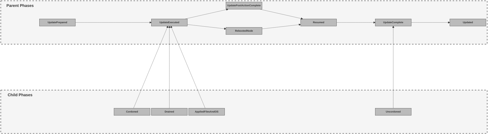

<!-- 
General TODO List:
- Reference PIS enhancement (https://github.com/openshift/enhancements/blob/master/enhancements/machine-config/pin-and-pre-load-images.md) for PIS related fields
- Add information on node degraded field
- Make sure `RebootedNode` is not referenced as a child phase
-->

# Track MCO State Related to Upgrades in the MachineConfigNode Type

## Summary

This enhancement describes how Nodes and their upgrade processes should be aggregated by the MCO into a user facing object. The goal here is to allow customers and the MCO team to decipher our processes in a more verbose way, speeding up the debugging process and allowing for better customer engagement.

## Motivation

The MCO manages node upgrades but since we do not own the object or store much of their data in other ways, much of what occurs during an upgrade is simply a black box operation that we currently report as "Updating" or "Updated". Users can debug into a specific node or look into the node spec for some of this information, but most of it simply lives in the MCO code rather than in data structures. We want to put these abstract "phases" of node operations as triggered by the MCO into a concrete data structure.

This feature is more tied to MCO procedures than the state reporting of the MachineConfigPool. We are designing this to fill the gap between what the MachineConfigPool currently reports and what is actually happening in the MCO pertaining to Node updates. One can view this as an API tied to MCO procedures. However, these objects are a way to track node update status and, since the MCO owns the update code, it just so happens that a lot of these actions are tied to the MCO.

### User Stories

* As a cluster admin, during upgrades I would like to monitor the progress of individual node upgrades so that, if one of the nodes sticks during an upgrade, I can easily see where the node got stuck and why.
* As an OpenShift developer, I would like a place to observe the MCO's view of a Node so that I can easily identify if the MCO is related to an upgrade failure in CI.

### Goals

* Make a MachineConfigNode type that succinctly holds the upgrade data.
* Have API load be as minimal as possible but augment the proper objects as needed.
* Aggregate as much MCO related data into easily accessible places as possible.

### Non-Goals

* Modify or remove existing API and status fields.

## Proposal
Create a Datatype for tracking Node Upgrade Progression in the MCO as well as Operator Component Progression in the MCO.

Create a mechanism inside of the MCO to update the new MachineConfigNode API type with data about a Node's progress during an upgrade and any errors that occur during those processes.

The MCD owns this datatype. Inside of the MachineConfigDaemon there now is an "UpgradeMonitor" package which contains all of the logic to manage these MachineConfigNodes. Since the Daemon owns all code related to updates (outside of a few drain controller functions), the MachineConfigDaemon has full ownership over these new objects. During the process of an upgrade, the MachineConfigDaemon will call the upgrade monitor with key information related to OCP updates and it will update the spec and status of the MachineConfigNodes.

The MachineConfigOperator pod will manage the rollout of the initial objects and the CRD for MachineConfigNodes. The MachineConfigOperator pod manages all manifests and resources which the operator owns, making this the best place for resource management of the MachineConfigNode to live.

The data created by this MachineConfigNode would look like the following:

```console
$ oc get machineconfignodes
NAME                          POOLNAME   DESIREDCONFIG                                      CURRENTCONFIG                                      UPDATED
ip-10-0-16-253.ec2.internal   master     rendered-master-6c320f722eb9ce8bfbd80750dbf70d2e   rendered-master-6c320f722eb9ce8bfbd80750dbf70d2e   True
ip-10-0-16-61.ec2.internal    worker     rendered-worker-f77322e2feead61600f41c9ae9ed0ff7   rendered-worker-f77322e2feead61600f41c9ae9ed0ff7   True
ip-10-0-32-167.ec2.internal   master     rendered-master-6c320f722eb9ce8bfbd80750dbf70d2e   rendered-master-6c320f722eb9ce8bfbd80750dbf70d2e   True
ip-10-0-63-242.ec2.internal   worker     rendered-worker-f77322e2feead61600f41c9ae9ed0ff7   rendered-worker-f77322e2feead61600f41c9ae9ed0ff7   True
ip-10-0-65-65.ec2.internal    worker     rendered-worker-f77322e2feead61600f41c9ae9ed0ff7   rendered-worker-f77322e2feead61600f41c9ae9ed0ff7   True
ip-10-0-73-121.ec2.internal   master     rendered-master-6c320f722eb9ce8bfbd80750dbf70d2e   rendered-master-6c320f722eb9ce8bfbd80750dbf70d2e   True
```

as well as 

```console
$ oc get machineconfignodes -o wide
NAME                          POOLNAME   DESIREDCONFIG                                      CURRENTCONFIG                                      UPDATED   UPDATEPREPARED   UPDATEEXECUTED   UPDATEPOSTACTIONCOMPLETE   UPDATECOMPLETE   RESUMED   UPDATEDFILESANDOS   CORDONEDNODE   DRAINEDNODE   REBOOTEDNODE   UNCORDONEDNODE
ip-10-0-16-253.ec2.internal   master     rendered-master-6c320f722eb9ce8bfbd80750dbf70d2e   rendered-master-6c320f722eb9ce8bfbd80750dbf70d2e   True      False            False            False                      False            False     False               False          False         False          False          
ip-10-0-16-61.ec2.internal    worker     rendered-worker-f77322e2feead61600f41c9ae9ed0ff7   rendered-worker-f77322e2feead61600f41c9ae9ed0ff7   True      False            False            False                      False            False     False               False          False         False          False          
ip-10-0-32-167.ec2.internal   master     rendered-master-6c320f722eb9ce8bfbd80750dbf70d2e   rendered-master-6c320f722eb9ce8bfbd80750dbf70d2e   True      False            False            False                      False            False     False               False          False         False          False          
ip-10-0-63-242.ec2.internal   worker     rendered-worker-f77322e2feead61600f41c9ae9ed0ff7   rendered-worker-f77322e2feead61600f41c9ae9ed0ff7   True      False            False            False                      False            False     False               False          False         False          False          
ip-10-0-65-65.ec2.internal    worker     rendered-worker-f77322e2feead61600f41c9ae9ed0ff7   rendered-worker-f77322e2feead61600f41c9ae9ed0ff7   True      False            False            False                      False            False     False               False          False         False          False          
ip-10-0-73-121.ec2.internal   master     rendered-master-6c320f722eb9ce8bfbd80750dbf70d2e   rendered-master-6c320f722eb9ce8bfbd80750dbf70d2e   True      False            False            False                      False            False     False               False          False         False          False          
```

where each name represents a node. The statuses reported are created explicitly from MCO node annotations and MCO actions, no other operator actions are taken into account here. This allows us to get quite specific in what is occurring on the nodes.

The structure of the MachineConfigNode looks like the following:

<!-- TODO: Update with more current example after node degrade is added (MCO-1615). -->
```console
$ oc describe machineconfignodes/ip-10-0-12-194.ec2.internal
Name:         ip-10-0-12-194.ec2.internal
Namespace:    
Labels:       <none>
Annotations:  <none>
API Version:  machineconfiguration.openshift.io/v1alpha1
Kind:         MachineConfigNode
Metadata:
  Creation Timestamp:  2023-10-17T13:08:58Z
  Generation:          1
  Resource Version:    49443
  UID:                 4bd758ab-2187-413c-ac42-882e61761b1d
Spec:
  Node Ref:
    Name:         ip-10-0-12-194.ec2.internal
  Pool:
    Name:         master
  ConfigVersion:
    Desired: rendered-worker-823ff8dc2b33bf444709ed7cd2b9855b
Status:
  Conditions:
    Last Transition Time:  2023-10-17T13:09:02Z
    Message:               Node has completed update to config rendered-master-cf99e619747ab19165f11e3546c71f1e
    Reason:                NodeUpgradeComplete
    Status:                True
    Type:                  Updated
    Last Transition Time:  2023-10-17T13:09:02Z
    Message:               This node has not yet entered the UpdatePreparing phase
    Reason:                NotYetOccurred
    Status:                False
  Config Version:
    Current:            rendered-worker-823ff8dc2b33bf444709ed7cd2b9855b
    Desired:            rendered-worker-823ff8dc2b33bf444709ed7cd2b9855b
  Health:               Healthy
  Most Recent Error:    
  Observed Generation:  3
```

The above struct gives us some helpful information about a node as it pertains to the MCO. First, all upgrade related events that have occurred on the node from the most recent upgrade process (no matter how small) appear in the `conditions`. Other than that, you can see the current and desired machineconfig indicating whether or not the node should be updating as well as whether or not the currently tracked update process held in `conditions` is updating to the expected MachineConfig. The ObservedGeneration exists to let the user know how many times we have gone through some upgrade related changes.

<!-- TODO:
- Note that this is not the current functionality and needs to be addressed as part of OCPBUGS-52302.
- Validate ""
-->
The desired config found in the spec will get updated immediately when a new config is found on the node. However, the desired config found in the status will only get updated once the new config has been validated in the machine config daemon. In the current implementation, the desired config is populated in the status by checking whether the update successfully gets past the "UpdatePrepared" phase. If the "UpdatePrepared" phase succeeds, then the status can safely add the desired config. 

The states to be reported by this MachineConfigNode will roughly fall into the following:

<!-- TODO: update to include the completion state(s), PIS phases, and node degraded status. Maybe use a table here? -->
#### Prepared phase
 - Stopping config drift monitor
 - Reconciling configs
#### Executed Phase
- Cordoned Node
- Drained Node
- Updated on disk state
- Updated OS
#### Post Config Action Phase
<!-- TODO: update with api changes -->
- Rebooting
- Closing daemon
- Node Reboot **OR** Reloading crio
#### Completed Phase
- Uncordoned
- Updating node state and metrics
#### Resumed Phase
- Start config drift monitor
#### Error states:
   - update stuck -- specifically degraded and/or failures in the functions. This is the phase that happens if we either error in any of the above stages
   - unavailable nodes... an obstacle has been hit, but it's not the MCOs fault
     - Disk Pressure
   	 - Unschedulable

### Workflow Description

When an upgrade is triggered by there being a mismatch between a desired and current config or simply just a new MachineConfig being applied, the MachineConfigNodes for a specific pool will report the following processes (roughly).

With the implementation the MCO introduced in 4.15 and GAing in 4.19, the MCN objects are meant to track upgrade progression of nodes as impacted by the MCO. The general progression here is:
- False == this phase has not started yet during the most recent upgrade process
- Unknown == this phase is either being executed or has errored
  - If the phase has errored, `oc describe machineconfignodes/<node-name>` will display more information in the `metav1.Conditions` list.
- True == this phase is complete

<!-- TODO: Update with PIS status information & node degrade? -->
There are two levels of conditions in MachineConfigNode: the parent and the child condition. Parent conditions include Updated, UpdatePrepared, UpdateExecuted, UpdatePostActionComplete, UpdateComplete, and Resumed. These parent conditions track the overall arc of an upgrade. However, there are often multiple phases within these overarching ones. Therefore, Drained, AppliedFilesAndOS, Cordoned, RebootedNode, and Uncordoned are the ChildrenPhases that occur during the larger ones.

<!-- TODO: 
- Update with what the `oc get` and `oc get .. wide` columns are updated to be; the "child" showing for the same command does not really make sense?
- Decide if PIS statuses should be included in -o wide output. If not, change "will additionally reveal all parent and child phases" phrasing to highlight it does not include PIS statuses.
-->
The information shown in `oc get machineconfignodes` includes the Node's name, associated MachineConfigPool, current and desired config versions, and updated status. Using `oc describe machineconfignodes -o wide` will additionally reveal all parent and child phases. Within each parent phase there can be 0+ child phases that customers can use to see upgrade progression. The upgrade flow can be seen in the following diagram and in the subsequent example outputs.


```mermaid
block-beta
  columns 15
    block:parents:15
        columns 13
        parentTitle("Parent Phases")
        space:5
        updatePostActionComplete["UpdatePostActionComplete"] space:20
        updatePrepared["UpdatePrepared"] space:2
        updateExecuted["UpdateExecuted"] space:3
        resumed["Resumed"] space
        updateComplete["UpdateComplete"] space
        updated["Updated"]
        space:6
        rebootedNode["RebootedNode"] space
        space:13
    end

    updatePrepared --> updateExecuted
    updateExecuted --> updatePostActionComplete
    updateExecuted --> rebootedNode
    updatePostActionComplete --> resumed
    rebootedNode --> resumed
    resumed --> updateComplete
    updateComplete --> updated

  space:15

    block:children:15
        columns 13
        childTitle("Child Phases")
        space:28
        cordoned["Cordoned"]
        drained["Drained"]
        appliedFilesAndOS["AppliedFilesAndOS"] space:4
        uncordoned["Uncordoned"] space:2
        space:14
    end

    cordoned --> updateExecuted
    drained --> updateExecuted
    appliedFilesAndOS --> updateExecuted
    uncordoned --> updateComplete

class parents PhaseGroup
class children PhaseGroup
classDef PhaseGroup fill:#f5f5f5,stroke-dasharray:10,10,stroke-width:2px,stroke:#000

class parentTitle PhaseTitle
class childTitle PhaseTitle
classDef PhaseTitle stroke:transparent,fill:transparent,font-weight:bold,font-size:1.25em,color:#000

class updatePrepared,updateExecuted,updatePostActionComplete,resumed,updateComplete,updated,cordoned,drained,appliedFilesAndOS,rebootedNode,uncordoned Phase
classDef Phase font-weight:bold,fill:#bbbbbb,stroke:#000,color:#000
```

<!-- TODO: Validate this -->
***Before an update is triggered, UPDATED will be True and all other statuses will be False.***
```console
$ oc get machineconfignodes -o wide
NAME                          POOLNAME   DESIREDCONFIG                                      CURRENTCONFIG                                      UPDATED   UPDATEPREPARED   UPDATEEXECUTED   UPDATEPOSTACTIONCOMPLETE   UPDATECOMPLETE   RESUMED   UPDATEDFILESANDOS   CORDONEDNODE   DRAINEDNODE   REBOOTEDNODE   UNCORDONEDNODE
ip-10-0-16-253.ec2.internal   master     rendered-master-6c320f722eb9ce8bfbd80750dbf70d2e   rendered-master-6c320f722eb9ce8bfbd80750dbf70d2e   True      False            False            False                      False            False     False               False          False         False          False          
ip-10-0-16-61.ec2.internal    worker     rendered-worker-f77322e2feead61600f41c9ae9ed0ff7   rendered-worker-f77322e2feead61600f41c9ae9ed0ff7   True      False            False            False                      False            False     False               False          False         False          False          
ip-10-0-32-167.ec2.internal   master     rendered-master-6c320f722eb9ce8bfbd80750dbf70d2e   rendered-master-6c320f722eb9ce8bfbd80750dbf70d2e   True      False            False            False                      False            False     False               False          False         False          False          
ip-10-0-63-242.ec2.internal   worker     rendered-worker-f77322e2feead61600f41c9ae9ed0ff7   rendered-worker-f77322e2feead61600f41c9ae9ed0ff7   True      False            False            False                      False            False     False               False          False         False          False          
ip-10-0-65-65.ec2.internal    worker     rendered-worker-f77322e2feead61600f41c9ae9ed0ff7   rendered-worker-f77322e2feead61600f41c9ae9ed0ff7   True      False            False            False                      False            False     False               False          False         False          False          
ip-10-0-73-121.ec2.internal   master     rendered-master-6c320f722eb9ce8bfbd80750dbf70d2e   rendered-master-6c320f722eb9ce8bfbd80750dbf70d2e   True      False            False            False                      False            False     False               False          False         False          False          
```

***Once an update is triggered, UPDATED will flip to False and UPDATEPREPARED begins.***
```console
$ oc get machineconfignodes -o wide
NAME                          POOLNAME   DESIREDCONFIG                                      CURRENTCONFIG                                      UPDATED   UPDATEPREPARED   UPDATEEXECUTED   UPDATEPOSTACTIONCOMPLETE   UPDATECOMPLETE   RESUMED   UPDATEDFILESANDOS   CORDONEDNODE   DRAINEDNODE   REBOOTEDNODE   UNCORDONEDNODE
ip-10-0-16-253.ec2.internal   master     rendered-master-ceedbbb3b533372a501c2410fa554c89   rendered-master-6c320f722eb9ce8bfbd80750dbf70d2e   False     True             False            False                      False            False     False               False          False         False          False          
ip-10-0-16-61.ec2.internal    worker     rendered-worker-f77322e2feead61600f41c9ae9ed0ff7   rendered-worker-f77322e2feead61600f41c9ae9ed0ff7   True      False            False            False                      False            False     False               False          False         False          False          
ip-10-0-32-167.ec2.internal   master     rendered-master-6c320f722eb9ce8bfbd80750dbf70d2e   rendered-master-6c320f722eb9ce8bfbd80750dbf70d2e   True      False            False            False                      False            False     False               False          False         False          False          
ip-10-0-63-242.ec2.internal   worker     rendered-worker-f77322e2feead61600f41c9ae9ed0ff7   rendered-worker-f77322e2feead61600f41c9ae9ed0ff7   True      False            False            False                      False            False     False               False          False         False          False          
ip-10-0-65-65.ec2.internal    worker     rendered-worker-f77322e2feead61600f41c9ae9ed0ff7   rendered-worker-f77322e2feead61600f41c9ae9ed0ff7   True      False            False            False                      False            False     False               False          False         False          False          
ip-10-0-73-121.ec2.internal   master     rendered-master-6c320f722eb9ce8bfbd80750dbf70d2e   rendered-master-6c320f722eb9ce8bfbd80750dbf70d2e   True      False            False            False                      False            False     False               False          False         False          False          
```

***After the update prepared phase completes, UPDATEEXECUTED and its children phases, CORDONEDNODE, DRAINEDNODE, and UPDATEDFILESANDOS, begin.***
```console
$ oc get machineconfignodes -o wide
NAME                          POOLNAME   DESIREDCONFIG                                      CURRENTCONFIG                                      UPDATED   UPDATEPREPARED   UPDATEEXECUTED   UPDATEPOSTACTIONCOMPLETE   UPDATECOMPLETE   RESUMED   UPDATEDFILESANDOS   CORDONEDNODE   DRAINEDNODE   REBOOTEDNODE   UNCORDONEDNODE
ip-10-0-16-253.ec2.internal   master     rendered-master-ceedbbb3b533372a501c2410fa554c89   rendered-master-6c320f722eb9ce8bfbd80750dbf70d2e   False     True             Unknown          False                      False            False     False               True           Unknown       False          False          
ip-10-0-16-61.ec2.internal    worker     rendered-worker-f77322e2feead61600f41c9ae9ed0ff7   rendered-worker-f77322e2feead61600f41c9ae9ed0ff7   True      False            False            False                      False            False     False               False          False         False          False          
ip-10-0-32-167.ec2.internal   master     rendered-master-6c320f722eb9ce8bfbd80750dbf70d2e   rendered-master-6c320f722eb9ce8bfbd80750dbf70d2e   True      False            False            False                      False            False     False               False          False         False          False          
ip-10-0-63-242.ec2.internal   worker     rendered-worker-f77322e2feead61600f41c9ae9ed0ff7   rendered-worker-f77322e2feead61600f41c9ae9ed0ff7   True      False            False            False                      False            False     False               False          False         False          False          
ip-10-0-65-65.ec2.internal    worker     rendered-worker-f77322e2feead61600f41c9ae9ed0ff7   rendered-worker-f77322e2feead61600f41c9ae9ed0ff7   True      False            False            False                      False            False     False               False          False         False          False          
ip-10-0-73-121.ec2.internal   master     rendered-master-6c320f722eb9ce8bfbd80750dbf70d2e   rendered-master-6c320f722eb9ce8bfbd80750dbf70d2e   True      False            False            False                      False            False     False               False          False         False          False          
```

```console
$ oc get machineconfignodes -o wide
NAME                          POOLNAME   DESIREDCONFIG                                      CURRENTCONFIG                                      UPDATED   UPDATEPREPARED   UPDATEEXECUTED   UPDATEPOSTACTIONCOMPLETE   UPDATECOMPLETE   RESUMED   UPDATEDFILESANDOS   CORDONEDNODE   DRAINEDNODE   REBOOTEDNODE   UNCORDONEDNODE
ip-10-0-16-253.ec2.internal   master     rendered-master-ceedbbb3b533372a501c2410fa554c89   rendered-master-6c320f722eb9ce8bfbd80750dbf70d2e   False     True             Unknown          False                      False            False     Unknown              True          True          False          False          
ip-10-0-16-61.ec2.internal    worker     rendered-worker-f77322e2feead61600f41c9ae9ed0ff7   rendered-worker-f77322e2feead61600f41c9ae9ed0ff7   True      False            False            False                      False            False     False               False          False         False          False          
ip-10-0-32-167.ec2.internal   master     rendered-master-6c320f722eb9ce8bfbd80750dbf70d2e   rendered-master-6c320f722eb9ce8bfbd80750dbf70d2e   True      False            False            False                      False            False     False               False          False         False          False          
ip-10-0-63-242.ec2.internal   worker     rendered-worker-f77322e2feead61600f41c9ae9ed0ff7   rendered-worker-f77322e2feead61600f41c9ae9ed0ff7   True      False            False            False                      False            False     False               False          False         False          False          
ip-10-0-65-65.ec2.internal    worker     rendered-worker-f77322e2feead61600f41c9ae9ed0ff7   rendered-worker-f77322e2feead61600f41c9ae9ed0ff7   True      False            False            False                      False            False     False               False          False         False          False          
ip-10-0-73-121.ec2.internal   master     rendered-master-6c320f722eb9ce8bfbd80750dbf70d2e   rendered-master-6c320f722eb9ce8bfbd80750dbf70d2e   True      False            False            False                      False            False     False               False          False         False          False          
```

```console
$ oc get machineconfignodes -o wide
NAME                          POOLNAME   DESIREDCONFIG                                      CURRENTCONFIG                                      UPDATED   UPDATEPREPARED   UPDATEEXECUTED   UPDATEPOSTACTIONCOMPLETE   UPDATECOMPLETE   RESUMED   UPDATEDFILESANDOS   CORDONEDNODE   DRAINEDNODE   REBOOTEDNODE   UNCORDONEDNODE
ip-10-0-16-253.ec2.internal   master     rendered-master-ceedbbb3b533372a501c2410fa554c89   rendered-master-6c320f722eb9ce8bfbd80750dbf70d2e   False     True             True             False                      False            False     True                 True          True          False          False          
ip-10-0-16-61.ec2.internal    worker     rendered-worker-f77322e2feead61600f41c9ae9ed0ff7   rendered-worker-f77322e2feead61600f41c9ae9ed0ff7   True      False            False            False                      False            False     False               False          False         False          False          
ip-10-0-32-167.ec2.internal   master     rendered-master-6c320f722eb9ce8bfbd80750dbf70d2e   rendered-master-6c320f722eb9ce8bfbd80750dbf70d2e   True      False            False            False                      False            False     False               False          False         False          False          
ip-10-0-63-242.ec2.internal   worker     rendered-worker-f77322e2feead61600f41c9ae9ed0ff7   rendered-worker-f77322e2feead61600f41c9ae9ed0ff7   True      False            False            False                      False            False     False               False          False         False          False          
ip-10-0-65-65.ec2.internal    worker     rendered-worker-f77322e2feead61600f41c9ae9ed0ff7   rendered-worker-f77322e2feead61600f41c9ae9ed0ff7   True      False            False            False                      False            False     False               False          False         False          False          
ip-10-0-73-121.ec2.internal   master     rendered-master-6c320f722eb9ce8bfbd80750dbf70d2e   rendered-master-6c320f722eb9ce8bfbd80750dbf70d2e   True      False            False            False                      False            False     False               False          False         False          False          
```

***After the body of the upgrade completes, either UPDATEPOSTACTIONCOMPLETE or REBOOTEDNODE begins, depending on the update needs.***
```console
NAME                          POOLNAME   DESIREDCONFIG                                      CURRENTCONFIG                                      UPDATED   UPDATEPREPARED   UPDATEEXECUTED   UPDATEPOSTACTIONCOMPLETE   UPDATECOMPLETE   RESUMED   UPDATEDFILESANDOS   CORDONEDNODE   DRAINEDNODE   REBOOTEDNODE   UNCORDONEDNODE
ip-10-0-16-253.ec2.internal   master     rendered-master-ceedbbb3b533372a501c2410fa554c89   rendered-master-6c320f722eb9ce8bfbd80750dbf70d2e   False     True             True             False                      False            False     True                 True          True          Unknown        False          
ip-10-0-16-61.ec2.internal    worker     rendered-worker-f77322e2feead61600f41c9ae9ed0ff7   rendered-worker-f77322e2feead61600f41c9ae9ed0ff7   True      False            False            False                      False            False     False               False          False         False          False          
ip-10-0-32-167.ec2.internal   master     rendered-master-6c320f722eb9ce8bfbd80750dbf70d2e   rendered-master-6c320f722eb9ce8bfbd80750dbf70d2e   True      False            False            False                      False            False     False               False          False         False          False          
ip-10-0-63-242.ec2.internal   worker     rendered-worker-f77322e2feead61600f41c9ae9ed0ff7   rendered-worker-f77322e2feead61600f41c9ae9ed0ff7   True      False            False            False                      False            False     False               False          False         False          False          
ip-10-0-65-65.ec2.internal    worker     rendered-worker-f77322e2feead61600f41c9ae9ed0ff7   rendered-worker-f77322e2feead61600f41c9ae9ed0ff7   True      False            False            False                      False            False     False               False          False         False          False          
ip-10-0-73-121.ec2.internal   master     rendered-master-6c320f722eb9ce8bfbd80750dbf70d2e   rendered-master-6c320f722eb9ce8bfbd80750dbf70d2e   True      False            False            False                      False            False     False               False          False         False          False          
```

```console
NAME                          POOLNAME   DESIREDCONFIG                                      CURRENTCONFIG                                      UPDATED   UPDATEPREPARED   UPDATEEXECUTED   UPDATEPOSTACTIONCOMPLETE   UPDATECOMPLETE   RESUMED   UPDATEDFILESANDOS   CORDONEDNODE   DRAINEDNODE   REBOOTEDNODE   UNCORDONEDNODE
ip-10-0-16-253.ec2.internal   master     rendered-master-ceedbbb3b533372a501c2410fa554c89   rendered-master-6c320f722eb9ce8bfbd80750dbf70d2e   False     True             True             False                      False            False     True                 True          True          True           False          
ip-10-0-16-61.ec2.internal    worker     rendered-worker-f77322e2feead61600f41c9ae9ed0ff7   rendered-worker-f77322e2feead61600f41c9ae9ed0ff7   True      False            False            False                      False            False     False               False          False         False          False          
ip-10-0-32-167.ec2.internal   master     rendered-master-6c320f722eb9ce8bfbd80750dbf70d2e   rendered-master-6c320f722eb9ce8bfbd80750dbf70d2e   True      False            False            False                      False            False     False               False          False         False          False          
ip-10-0-63-242.ec2.internal   worker     rendered-worker-f77322e2feead61600f41c9ae9ed0ff7   rendered-worker-f77322e2feead61600f41c9ae9ed0ff7   True      False            False            False                      False            False     False               False          False         False          False          
ip-10-0-65-65.ec2.internal    worker     rendered-worker-f77322e2feead61600f41c9ae9ed0ff7   rendered-worker-f77322e2feead61600f41c9ae9ed0ff7   True      False            False            False                      False            False     False               False          False         False          False          
ip-10-0-73-121.ec2.internal   master     rendered-master-6c320f722eb9ce8bfbd80750dbf70d2e   rendered-master-6c320f722eb9ce8bfbd80750dbf70d2e   True      False            False            False                      False            False     False               False          False         False          False          
```

***After the post update action completes, normal processes are RESUMED.***
```console
NAME                          POOLNAME   DESIREDCONFIG                                      CURRENTCONFIG                                      UPDATED   UPDATEPREPARED   UPDATEEXECUTED   UPDATEPOSTACTIONCOMPLETE   UPDATECOMPLETE   RESUMED   UPDATEDFILESANDOS   CORDONEDNODE   DRAINEDNODE   REBOOTEDNODE   UNCORDONEDNODE
ip-10-0-16-253.ec2.internal   master     rendered-master-ceedbbb3b533372a501c2410fa554c89   rendered-master-6c320f722eb9ce8bfbd80750dbf70d2e   False     True             True             False                      False            True      True                 True          True          True           False          
ip-10-0-16-61.ec2.internal    worker     rendered-worker-f77322e2feead61600f41c9ae9ed0ff7   rendered-worker-f77322e2feead61600f41c9ae9ed0ff7   True      False            False            False                      False            False     False               False          False         False          False          
ip-10-0-32-167.ec2.internal   master     rendered-master-6c320f722eb9ce8bfbd80750dbf70d2e   rendered-master-6c320f722eb9ce8bfbd80750dbf70d2e   True      False            False            False                      False            False     False               False          False         False          False          
ip-10-0-63-242.ec2.internal   worker     rendered-worker-f77322e2feead61600f41c9ae9ed0ff7   rendered-worker-f77322e2feead61600f41c9ae9ed0ff7   True      False            False            False                      False            False     False               False          False         False          False          
ip-10-0-65-65.ec2.internal    worker     rendered-worker-f77322e2feead61600f41c9ae9ed0ff7   rendered-worker-f77322e2feead61600f41c9ae9ed0ff7   True      False            False            False                      False            False     False               False          False         False          False          
ip-10-0-73-121.ec2.internal   master     rendered-master-6c320f722eb9ce8bfbd80750dbf70d2e   rendered-master-6c320f722eb9ce8bfbd80750dbf70d2e   True      False            False            False                      False            False     False               False          False         False          False          
```

***The final parts of the update are completed in UPDATECOMPLETE and its child phase, UNCORDONEDNODE.***
```console
$ oc get machineconfignodes
NAME                          POOLNAME   DESIREDCONFIG                                      CURRENTCONFIG                                      UPDATED   UPDATEPREPARED   UPDATEEXECUTED   UPDATEPOSTACTIONCOMPLETE   UPDATECOMPLETE   RESUMED   UPDATEDFILESANDOS   CORDONEDNODE   DRAINEDNODE   REBOOTEDNODE   UNCORDONEDNODE
ip-10-0-16-253.ec2.internal   master     rendered-master-ceedbbb3b533372a501c2410fa554c89   rendered-master-6c320f722eb9ce8bfbd80750dbf70d2e   False     True             True             False                      True             True      True                 True          True          True           True           
ip-10-0-16-61.ec2.internal    worker     rendered-worker-f77322e2feead61600f41c9ae9ed0ff7   rendered-worker-f77322e2feead61600f41c9ae9ed0ff7   True      False            False            False                      False            False     False               False          False         False          False          
ip-10-0-32-167.ec2.internal   master     rendered-master-6c320f722eb9ce8bfbd80750dbf70d2e   rendered-master-6c320f722eb9ce8bfbd80750dbf70d2e   True      False            False            False                      False            False     False               False          False         False          False          
ip-10-0-63-242.ec2.internal   worker     rendered-worker-f77322e2feead61600f41c9ae9ed0ff7   rendered-worker-f77322e2feead61600f41c9ae9ed0ff7   True      False            False            False                      False            False     False               False          False         False          False          
ip-10-0-65-65.ec2.internal    worker     rendered-worker-f77322e2feead61600f41c9ae9ed0ff7   rendered-worker-f77322e2feead61600f41c9ae9ed0ff7   True      False            False            False                      False            False     False               False          False         False          False          
ip-10-0-73-121.ec2.internal   master     rendered-master-6c320f722eb9ce8bfbd80750dbf70d2e   rendered-master-6c320f722eb9ce8bfbd80750dbf70d2e   True      False            False            False                      False            False     False               False          False         False          False          
```

***When the desired and current config versions of the node match, UPDATED will flip back to True and all other statuses will flip to False. This marks the completion of the update.***
```console
$ oc get machineconfignodes
NAME                          POOLNAME   DESIREDCONFIG                                      CURRENTCONFIG                                      UPDATED   UPDATEPREPARED   UPDATEEXECUTED   UPDATEPOSTACTIONCOMPLETE   UPDATECOMPLETE   RESUMED   UPDATEDFILESANDOS   CORDONEDNODE   DRAINEDNODE   REBOOTEDNODE   UNCORDONEDNODE
ip-10-0-16-253.ec2.internal   master     rendered-master-ceedbbb3b533372a501c2410fa554c89   rendered-master-ceedbbb3b533372a501c2410fa554c89   True      False            False            False                      False            False     False               False          False         False          False          
ip-10-0-16-61.ec2.internal    worker     rendered-worker-f77322e2feead61600f41c9ae9ed0ff7   rendered-worker-f77322e2feead61600f41c9ae9ed0ff7   True      False            False            False                      False            False     False               False          False         False          False          
ip-10-0-32-167.ec2.internal   master     rendered-master-6c320f722eb9ce8bfbd80750dbf70d2e   rendered-master-6c320f722eb9ce8bfbd80750dbf70d2e   True      False            False            False                      False            False     False               False          False         False          False          
ip-10-0-63-242.ec2.internal   worker     rendered-worker-f77322e2feead61600f41c9ae9ed0ff7   rendered-worker-f77322e2feead61600f41c9ae9ed0ff7   True      False            False            False                      False            False     False               False          False         False          False          
ip-10-0-65-65.ec2.internal    worker     rendered-worker-f77322e2feead61600f41c9ae9ed0ff7   rendered-worker-f77322e2feead61600f41c9ae9ed0ff7   True      False            False            False                      False            False     False               False          False         False          False          
ip-10-0-73-121.ec2.internal   master     rendered-master-6c320f722eb9ce8bfbd80750dbf70d2e   rendered-master-6c320f722eb9ce8bfbd80750dbf70d2e   True      False            False            False                      False            False     False               False          False         False          False          
```

In general, a state (and its respective child states) will transition from False -> Unknown -> True -> False. The states are mostly in the past tense. This is because processes like `Drained` are primarily defined by completion, not the progress. So a user will have `UpdateExecuted` == Unknown and `Drained` == Unknown until the Drain actually completes. However, the unknown phase will be accompanied by a message for how the drain is currently going or if an error has occurred during the drain.

Once Updated == True is the case, the update process is considered complete, all previous states are set to False, and the condition details will show that the message is from the previous update cycle.

If you want to look at oc describe for more verbose details of other events in an upgrade cycle that happened on the node, you can do so using `oc describe machineconfignodes/<node-name>` (output below is not correlated to the above example).

<!-- TODO: Update with more current example after node degrade is added (MCO-1615). -->
```console
Name:         ip-10-0-52-193.ec2.internal
Namespace:    
Labels:       <none>
Annotations:  <none>
API Version:  machineconfiguration.openshift.io/v1alpha1
Kind:         MachineConfigNode
Metadata:
  Creation Timestamp:  2023-11-22T20:05:18Z
  Generation:          1
  Resource Version:    190396
  UID:                 78526c4d-206c-4ec7-8ae1-c47aebcb79b3
Spec:
  Config Version:
    Desired:  NotYetSet
  Node:
    Name:  ip-10-0-52-193.ec2.internal
  Pool:
    Name:  worker
Status:
  Conditions:
    Last Transition Time:  2023-11-22T20:05:36Z
    Message:               Action during previous iteration: In desired config rendered-worker-7f183a799b1bce71eca1b49fa20c7261. Resumed normal operations.
    Reason:                Resumed
    Status:                False
    Type:                  Resumed
    Last Transition Time:  2023-11-22T20:08:46Z
    Message:               Update is Compatible.
    Reason:                UpdateCompatible
    Status:                True
    Type:                  UpdatePrepared
    Last Transition Time:  2023-11-22T20:08:48Z
    Message:               Draining Node as part of In progress upgrade phase
    Reason:                Drained
    Status:                Unknown
    Type:                  UpdateExecuted
    Last Transition Time:  2023-11-22T20:05:26Z
    Message:               This node has not yet entered the UpdatePostActionComplete phase
    Reason:                NotYetOccurred
    Status:                False
    Type:                  UpdatePostActionComplete
    Last Transition Time:  2023-11-22T20:05:26Z
    Message:               This node has not yet entered the UpdateComplete phase
    Reason:                NotYetOccurred
    Status:                False
    Type:                  UpdateComplete
    Last Transition Time:  2023-11-22T20:08:46Z
    Message:               Update Compatible. Post Cfg Actions [reboot]: Drain Required: true
    Reason:                UpdatePreparedUpdateCompatible
    Status:                True
    Type:                  UpdateCompatible
    Last Transition Time:  2023-11-22T20:08:48Z
    Message:               Draining node. The drain will not be complete until desired drainer drain-rendered-worker-3b7e2ff302f33d45a732e03564405ae7 matches current drainer uncordon-rendered-worker-7f183a799b1bce71eca1b49fa20c7261
    Reason:                UpdateExecutedDrained
    Status:                Unknown
    Type:                  Drained
    Last Transition Time:  2023-11-22T20:05:26Z
    Message:               This node has not yet entered the AppliedFilesAndOS phase
    Reason:                NotYetOccurred
    Status:                False
    Type:                  AppliedFilesAndOS
    Last Transition Time:  2023-11-22T20:08:48Z
    Message:               Cordoned node. The node is reporting Unschedulable = true
    Reason:                UpdateExecutedCordoned
    Status:                True
    Type:                  Cordoned
    Last Transition Time:  2023-11-22T20:05:26Z
    Message:               This node has not yet entered the RebootedNode phase
    Reason:                NotYetOccurred
    Status:                False
    Type:                  RebootedNode
    Last Transition Time:  2023-11-22T20:05:26Z
    Message:               This node has not yet entered the ReloadedCRIO phase
    Reason:                NotYetOccurred
    Status:                False
    Type:                  ReloadedCRIO
    Last Transition Time:  2023-11-22T20:08:46Z
    Message:               Node ip-10-0-52-193.ec2.internal needs an update
    Reason:                Updated
    Status:                False
    Type:                  Updated
  Config Version:
    Current:            rendered-worker-7f183a799b1bce71eca1b49fa20c7261
    Desired:            rendered-worker-3b7e2ff302f33d45a732e03564405ae7
  Observed Generation:  2
Events:                 <none>
```

<!-- TODO: Update with better example since `ReloadedCRIO` is being removed -->
The ChildrenPhases don't always occur depending on the type of update. However, sometimes they all occur, leading to some confusion in the parent phases as to what happened. Adding these children phases is meant to give the user more clarity to the update at hand. For example, when a node reboot is not required on a node, the condition will look like this: 

```console
    Last Transition Time:  2024-01-12T14:47:21Z
    Message:               This node has not yet entered the ReloadedCRIO phase
    Reason:                NotYetoccurred
    Status:                False
    Type:                  ReloadedCRIO
```

or 

```console
    Last Transition Time:  2024-01-12T14:52:19Z
    Message:               Action during update to rendered-master-eef3a1a1a422b7ebd085b346042ca5a8: Upgrade required a CRIO reload. Completed this as the post update action.
    Reason:                UpdatePostActionCompleteReloadedCRIO
    Status:                False
    Type:                  ReloadedCRIO
```

The first option here indicates that this phase has never happened. The second one indicates that is has happened, just not during this update cycle. That is what the `Action during update to...` shows. That rendered config is not the one we are updating to currently.

<!-- TODO: Update this in status reporting GA. MCO does not currently populate MCP status from MCN info. -->
The MCO in 4.15 is aiming to use these objects to improve the source of truth for MCP reporting. If a user is opted into TechPreview, the MachineConfigPools will pull their `Updated`, `Updating`, and `Degraded` statuses from the MCN objects rather than from the nodes themselves. There are a few reasons for this: 

1. Pulling the MCP state from the nodes in the pool results in reported behaviors that are outside of the MCOs control for example Cordoning and Draining. The MCO currently reports to Upgradeable=False in the CO when the node is Cordoned by an outside actor. This should only be the case if the MCO is attempting to Cordon and Drain a node. This also means that the Pool shows Updating=True which isn't the case.
2. The MCO goes Upgradeable=False when new nodes are added. This is because these new nodes are reporting that they are not ready when they haven't even joined the Pool correctly yet. Since the MCP directly pulls its status from the nodes, this causes all sorts of issues. The MCN object will wait until the node is all settled in the pool before using it for state reporting meaning the MCO should show Upgradeable=True


The MCN is meant to clarify state reporting for the users and disambiguate these edge cases.

### API Extensions

- Adds the MachineConfigNodes CRD

### Risks and Mitigations

There might be users who do not know to look here. We will mitigate this by reporting in the CO and/or the node status go to
and look at this object for MCO related node failures or progression.

Adding new MCD node states might have unintended consequences on the current flow which just has "Working" and "Done". Will make sure the
states I add are either only in between Working and Done OR no matter what we end up back in the "Done" state.

### Drawbacks

The only drawback is increased API usage in the MCO. However, any approach to increased state reporting will increase API calls. This is the most well thought approach to this. 

## Design Details

### Open Questions [optional]

None.

### Test Plan

MCO e2e tests and unit tests will cover this functionality.

### Graduation Criteria

This feature is behind the tech-preview FeatureGate in 4.15. Once it is tested by QE and users it can be GA'd since it should not impact daily usage of a cluster.

## Dev Preview -> Tech Preview

Not applicable. Feature introduced in Tech Preview. 

## Tech Preview -> GA

Bugs that QE finds get fixed and MCN is proven to handle pool status updating properly.

Also add support for the following features
<!-- TODO: update this list -->
1. https://issues.redhat.com/browse/MCO-1022
2. https://issues.redhat.com/browse/MCO-1023
3. https://issues.redhat.com/browse/MCO-1024
4. https://issues.redhat.com/browse/MCO-1025

#### Removing a deprecated feature

### Upgrade / Downgrade Strategy

Between upgrades, this feature should not have a large impact. It will perform as it usually does and it will track node processes in both upgrades and downgrades. If a node is added or removed, the MachineConfigNode object will not report on it until the node is acknowledged by the MCO.

### Version Skew Strategy

Not applicable.

### Operational Aspects of API Extensions

#### Failure Modes

If the MachineConfigNode cannot be updated, an error is logged but the operator keeps functioning. If an error happens during an update it is represented in the MachineConfigNode clearly.

#### Support Procedures

None.

## Implementation History

As of Openshift 4.15, the feature went under the tech-preview FeatureGate. The basic functionality was implemented and provides users with a way to track node progressions during updates.
In 4.16, the UncordonedNode column was added to the -o wide output. Many bugs were fixed as well in this version with creation and deletion of nodes.
<!-- TODO: update with GA changes -->

## Alternatives (Not Implemented)

Implementation wise, there has been discussion of who should own these objects: the MachineConfigDaemon or a new Controller called the MachineStateController. While either approach would work, there are positive and negative impacts to each.

The approach that was decided on for Openshift 4.15 was the MachineConfigDaemon approach. While some of the above proposal contradicts MCO sentiment regarding the size of the MachineConfigDaemon, there are future plans to separate the update functionality of the MachineConfigDaemon out of the everyday file operations and management of the MachineConfigDaemon. This makes the MachineConfigDaemon much more favorable given that it has less overhead and apiserver impact.

## MachineStateController Approach

Using a separate controller allows for information consolidation and furthers the MCO's goals. However, it adds a level of information between the source and sink of this data.

1) Confused Deputy
  - An improper actor could potentially modify information on the node such that the MachinestateController thinks an upgrade event is going on but in reality it is not.
    - Nothing "consumes" the MCN data type in this design. However, this is still a future concern and one that has been voiced by many teams.
2) Unnecessary level of abstraction
   - The MCD is the source of the data so it should "own" the updating process of the MCN. This is true and fits into the idiomatic processes of kubernetes. However, the goal of the MCO was to consolidate all state and metric reporting into a single location. It is a question of prioritizing data efficiency.

The summary of the two alternatives is as follows:

The MCD owning method furthers k8s and openshift api standards. The MachineStateController owning method furthers the MCO's goals in the next 6-12 months. It seems the balance we will strike is going to lean towards k8s standards.
