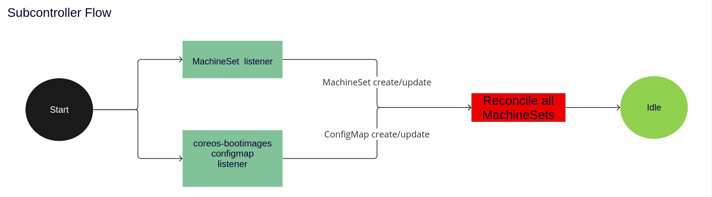

# Managing boot images via the MCO

## Summary

This is a proposal to manage bootimages via the `Machine Config Operator`(MCO), leveraging some of the [pre-work](https://github.com/openshift/installer/pull/4760) done as a result of the discussion in [#201](https://github.com/openshift/enhancements/pull/201). This feature will only target standalone OCP installs. It will also be user opt-in and is planned to be released behind a feature gate.

For `MachineSet` managed clusters, the end goal is to create an automated mechanism that can:
- update the boot images references in `MachineSets` to the latest in the payload image
- ensure stub ignition referenced in each `Machinesets` is in spec 3 format

For clusters that are not managed by `MachineSets`, the end goal is to create a document(KB or otherwise) that a cluster admin would follow to update their boot images.


## Motivation

Currently, bootimage references are [stored](https://github.com/openshift/installer/blob/1ca0848f0f8b2ca9758493afa26bf43ebcd70410/pkg/asset/machines/gcp/machines.go#L204C1-L204C1) in a `MachineSet` by the openshift installer during cluster bringup and is thereafter not managed. These boot image references are not updated on an upgrade, so any node scaled up using it will boot up with the original “install” bootimage. This has caused a myriad of issues during scale-up due to this version skew, when the nodes attempt the final pivot to the release payload image. Issues linked below:
- Afterburn [[1](https://issues.redhat.com/browse/OCPBUGS-7559)],[[2](https://issues.redhat.com/browse/OCPBUGS-4769)]
- podman [[1](https://issues.redhat.com/browse/OCPBUGS-9969)]
- skopeo [[1](https://issues.redhat.com/browse/OCPBUGS-3621)]

Additionally, the stub secret [referenced](https://github.com/openshift/installer/blob/1ca0848f0f8b2ca9758493afa26bf43ebcd70410/pkg/asset/machines/gcp/machines.go#L197) in the `MachineSet` is also not managed. This stub is used by the ignition binary in firstboot to auth and consume content from the `machine-config-server`(MCS). The content served includes the actual ignition configuration and the target OCI format RHCOS image. The ignition binary now does first boot provisioning based on this, then hands off to the `machine-config-daemon`(MCD) first boot service to do the reboot into the target OCI format RHCOS image. As 4.6 and up clusters only understood spec 3 ignition, and as the unmanaged ignition stub is only spec 2, this was now an incompatibility. This would prevent new nodes from joining a cluster that had been upgraded past 4.5, but was originally a 4.5 or lower at install time. 

To peel another layer from the Ignition onion (sorry), there are some scenarios in which the MCS TLS cert contained within the above ignition stub may be out of date or incompatible. In such cases, just up-translating the ignition stub will not be enough. Example issue [here](https://issues.redhat.com/browse/OCPBUGS-1817). Solving this is not a direct goal of this enhancement(this work is targeted and scoped by [MCO-642](https://issues.redhat.com/browse/MCO-642)), but it is important to keep track of as this is a new failure mode that will be exposed by solving the above two issues. 


### User Stories

* As an Openshift engineer, having nodes boot up on an unsupported OCP version is a security liability. By having nodes directly boot on the release payload image, it helps me avoid tracking incompatibilities across OCP release versions and shore up technical debt(see issues linked above). 

* As a cluster administrator, having to keep track of a "boot" vs "live" image for a given cluster is not intuitive or user friendly. In the worst case scenario, I will have to reset a cluster(or do a lot of manual steps with rh-support in recovering the node) simply to be able to scale up nodes after an upgrade. If I'm managing an IPI cluster, once opted in, this feature will be a "switch on and forget" mechanism for me. If I'm managing a UPI cluster, this would provide me with documentation that I could follow after an upgrade to ensure my cluster has the latest bootimages.

### Goals

The MCO will take over management of the boot image references and the stub ignition. The installer is still responsible for creating the `MachineSet` at cluster bring-up of course, but once cluster installation is complete the MCO will ensure that boot images are in sync with the latest payload. From the user standpoint, this should cause less compatibility issues as nodes will no longer need to pivot to a different version of rhcos during node scaleup.

This should not interfere with existing workflows such as Hive and ArgoCD. As this is an opt-in mechanism, the cluster admin will be protected against such scenarios of accidental "reconciliation". 

### Non-Goals

- The new subcontroller is only intended to support clusters that use MachineSet backed node scaling. This is meant to be a user opt-in feature, and if the user wishes to keep their boot images static it will let them do so.
- This does not intend to solve [booting into custom pools](https://issues.redhat.com/browse/MCO-773). 
- This does not target Hypershift, as [it does not use machinesets](https://github.com/openshift/hypershift/blob/32309b12ae6c5d4952357f4ad17519cf2424805a/hypershift-operator/controllers/nodepool/nodepool_controller.go#L2168).

## Proposal

__Overview__

- The `machine-config-controller`(MCC) pod will gain a new sub-controller `machine_set_controller`(MSC) that monitors `MachineSet` changes and the `coreos-bootimages` [ConfigMap](https://github.com/openshift/installer/pull/4760) changes.
- Before processing a MachineSet, the MSC will check if the following conditions are satisfied:
  - `ManagedBootImages` feature gate is active
  - The cluster and/or the machineset is opted-in to boot image updates.
  - The golden configmap is verified to be in sync with the current version of the MCO. The MCO will "stamp"(annotate) the golden configmap with the new version of the MCO after atleast 1 node has succesfully completed an update to the new OCP image. This helps prevent `machinesets` being updated too soon at the end of a cluster upgrade, before the MCO itself has updated and has had a chance to roll out the new OCP image to the cluster. 

  If any of the above checks fail, the MSC will exit out of the sync.
- Based on platform and architecture type, the MSC will check if the boot images referenced in the `providerSpec` field of the `MachineSet` is the same as the one in the ConfigMap. Each platform(gcp, aws...and so on) does this differently, so this part of the implementation will have to be special cased. The ConfigMap is considered to be the golden set of bootimage values, i.e. they will never go out of date. If it is not a match, the `providerSpec` field is cloned and updated with the new boot image reference.
- Next, it will check if the stub secret referenced is spec 3. If it is spec 2, the MSC will try create a new version of this secret by trying to translate it to spec 3. The new secret will be named `$(secret_name)-spec-3-managed`. It is necessary to preserve the old secret as `MachineSets` that are not opted-in to boot image updates will still reference the older secret and use them.

The above step is platform/arch agnostic. Failure to up translate will cause a degrade and the sub-controller will exit without patching the `MachineSet`.
- Finally, if the MSC will attempt to patch the `MachineSet` if required. Failure to do so will cause a degrade. 

#### Degrade Mechanism

The MSC will degrade the worker `MachineConfigPool` via a new [MachineConfigPoolConditionType](https://github.com/openshift/api/blob/master/machineconfiguration/v1/types.go#L492). This would be an API change, but a fairly simple one is it only adding a new condition type. The node controller(another sub controller within the MCC) would then [check for this condition](https://github.com/openshift/machine-config-operator/blob/master/pkg/controller/node/status.go#L142C34-L142C34) and degrade the worker pool, effectively degrading the operator.

As mentioned in the above section, degrading will only happen in two scenarios:
- Translating the ignition stub to spec 3 fails. This is likely more fatal and won't get fixed without the editing the ignition stub manually.
- Patching of the MachineSet fails. This is likely due to a temporary API server outage and will resolve itself without user intervention.

The degrade condition is calculated at the end of a sync loop. In the case of multiple failures within a single sync loop, the message for degrades will be accumulated to include the `MachineSets` associated with all the failures. 

#### Reverting to original bootimage

The proposal will introduce a CR, `MachineSetBootImageHistory` to store the boot image history associated with a given machineset. By providing this CR and accompanying documentation, the user will be able to restore their machinesets to an earlier state if they wish to do so. 

### Workflow Description

It is important to note that there would be two "opt-in" knobs while this feature is under TechPreview. The user would first have to turn on the feature gate, and then the opt-in mechanism. The secondary knob is necessary as some customers may want to keep their boot images static when this feature leaves TechPreview.

See the API extension section for examples of how this feature can be turned on and off. 

#### Variation and form factor considerations [optional]

Any form factor using the MCO and `MachineSets` will be impacted by this proposal. So case by case:
- Standalone OpenShift: Yes, this is the main target form factor.
- microshift: No, as it does [not](https://github.com/openshift/microshift/blob/main/docs/contributor/enabled_apis.md) use `MachineSets`.
- Hypershift: No, Hypershift does not have this issue.

##### Cluster API backed machinesets

As the Cluster API move is impending(initial release in 4.16 and default-on release in 4.17), it is necessary that this enhancement plans for the changes required in an CAPI backed cluster. Here are a couple of sample YAMLs used in CAPI backed `Machinesets`, from the [official Openshift documentation](https://docs.openshift.com/container-platform/4.14/machine_management/capi-machine-management.html#capi-sample-yaml-files-gcp).

###### MachineSet resource
```
apiVersion: cluster.x-k8s.io/v1beta1
kind: MachineSet
metadata:
  name: <machine_set_name> 
  namespace: openshift-cluster-api
spec:
  clusterName: <cluster_name> 
  replicas: 1
  selector:
    matchLabels:
      test: test
  template:
    metadata:
      labels:
        test: test
    spec:
      bootstrap:
         dataSecretName: worker-user-data 
      clusterName: <cluster_name> 
      infrastructureRef:
        apiVersion: infrastructure.cluster.x-k8s.io/v1beta1
        kind: GCPMachineTemplate 
        name: <machine_set_name> 
      failureDomain: <failure_domain> 
```
###### GCPMachineTemplate
```
apiVersion: infrastructure.cluster.x-k8s.io/v1beta1
kind: GCPMachineTemplate 
metadata:
  name: <template_name> 
  namespace: openshift-cluster-api
spec:
  template:
    spec: 
      rootDeviceType: pd-ssd
      rootDeviceSize: 128
      instanceType: n1-standard-4
      image: projects/rhcos-cloud/global/images/rhcos-411-85-202203181601-0-gcp-x86-64
      subnet: <cluster_name>-worker-subnet
      serviceAccounts:
        email: <service_account_email_address>
        scopes:
          - https://www.googleapis.com/auth/cloud-platform
      additionalLabels:
        kubernetes-io-cluster-<cluster_name>: owned
      additionalNetworkTags:
        - <cluster_name>-worker
      ipForwarding: Disabled
```
As can be seen, the bootimage becomes part of an `InfrastructureMachineTemplate` object (eg a GCPMachineTemplate), and then the MachineSet references this template and creates new machines from the template. The stub secret is now stored in a `bootstrap` object. Unlike MAPI backed MachineSets, both of them are no longer part of a single `providerSpec` object. 

It is important to note that InfrastructureMachineTemplate is different per platform and is immutable. This will prevent an update in place style approach and would mean that the template would need to be cloned, updated during the clone, and then the MachineSet updated. This is somewhat similar to the approach used in the current MAPI PoC of cloning the `providerSpec` object, updating it and then patching the `MachineSet`. The `bootstrap` object is platform agnostic, making it somewhat simpler to update. 

Based on the observation above, here is a rough outline of what CAPI support would require:
- CAPI backed MachineSet detection, so the MSC knows when to invoke the CAPI path
- Update the bootimage reference in `InfrastructureMachineTemplate` to matches the `core-bootimages` configMap value if required
- Update the ignition stub in `bootstrap` to spec 3 if required
- CAPI backed MachineSet patching

Much of the existing architecture regarding architecture & platform detection, opt-in, degradation and storing boot image history can remain the same. 


### API Extensions

#### Opt-in Mechanism

This proposal will introduce a discriminated union in [operator types](https://github.com/openshift/api/blob/master/operator/v1/types_machineconfiguration.go) for the MCO, `ManagedBootImageConfig` which has two fields:

- `Mode` This is an enum which can have three values:
  - `Enabled` - All `Machinesets` will be enrolled for boot image updates.
  - `MatchSelector` - `Machinesets` matched with the label selector will be enrolled for boot image updates.
  - `Disabled` - No `Machinesets` will be enrolled for boot image updates.
- `MatchSelector` This is a label selector that will be used by machineset objects to opt-in. 

Here are some YAML examples that describes operators in each of these modes:
##### Enabled
```
apiVersion: operator.openshift.io/v1
kind: MachineConfiguration
metadata:
  name: default
  labels:
spec:
  managedBootImageConfig:
    mode: Enabled
```
##### Disabled
```
apiVersion: operator.openshift.io/v1
kind: MachineConfiguration
metadata:
  name: default
  labels:
spec:
  managedBootImageConfig:
    mode: Disabled
```
##### MatchSelector
```
apiVersion: operator.openshift.io/v1
kind: MachineConfiguration
metadata:
  name: default
  labels:
spec:
  managedBootImageConfig:
    mode: MatchSelector
    matchSelector:
      matchLabels:
        machineconfiguration.openshift.io/mco-managed-machineset: ""        
```
Note: While in this mode, the label added to the selector will have to be added to the `machineset` object.

A [ValidatingAdmissionPolicy](https://kubernetes.io/docs/reference/access-authn-authz/validating-admission-policy/) will be implemented via an MCO manifest that will restrict updating the `ManagedBootImageConfig` object to only supported platforms(initially, just GCP). This will be updated as we phase in support for other platforms. Here is a sample policy that would do this:

```
apiVersion: admissionregistration.k8s.io/v1beta1
kind: ValidatingAdmissionPolicy
metadata:
  name: "managed-bootimages-platform-check"
spec:
  failurePolicy: Fail
  paramKind:
    apiVersion: config.openshift.io/v1
    kind: Infrastructure
  matchConstraints:
    resourceRules:
    - apiGroups:   ["operator"]
      apiVersions: ["v1"]
      operations:  ["CREATE", "UPDATE"]
      resources:   ["MachineConfiguration"]
  validations:
    - expression: "has(object.spec.MachineBootImageConfig) && param.status.platformStatus.Type != `GCP`"
      message: "This feature is only supported on these platforms: GCP"
```
This would need an accompanying binding:
```
apiVersion: admissionregistration.k8s.io/v1beta1
kind: ValidatingAdmissionPolicyBinding
metadata:
  name: "managed-bootimages-platform-check-binding"
spec:
  policyName: "managed-bootimages-platform-check"
  validationActions: [Deny]
  paramRef:
    name: "cluster"
    namespace: "default"
```
#### Tracking boot image history

This proposal will also introduce a new CR, `MachineSetBootImageHistory` for tracking boot image history in the MCO namespace. As a starting point, here is a stub type definition for this:

```
type MachineSetBootImageHistory struct {
	metav1.TypeMeta   `json:",inline"`
	metav1.ObjectMeta `json:"metadata,omitempty"`

	Spec   MachineSetBootImageHistorySpec   `json:"spec,omitempty"`
	Status MachineSetBootImageHistoryStatus `json:"status,omitempty"`
}

// MachineSetBootImageHistorySpec defines the desired state of MachineSetBootImageHistory
type MachineSetBootImageHistorySpec struct {
	MachineSetName string                   `json:"machineSetName"`
	Details        []BootImageHistoryDetail `json:"details"`
}

// MachineSetBootImageHistoryStatus defines the observed state of MachineSetBootImageHistory
type MachineSetBootImageHistoryStatus struct {
}

// BootImageHistoryDetail is the struct for each element in the Details array
type BootImageHistoryDetail struct {
	Index          int         `json:"index"`
	UpdatedTime    metav1.Time `json:"updatedTime"`
	BootImageRef   string      `json:"bootImageRef"`
	StubSecretRef  string      `json:"stubSecretRef"`
}

// MachineSetBootImageHistoryList contains a list of MachineSetBootImageHistory
type MachineSetBootImageHistoryList struct {
	metav1.TypeMeta `json:",inline"`
	metav1.ListMeta `json:"metadata,omitempty"`
	Items           []MachineSetBootImageHistory `json:"items"`
}
```
There will be one instance of this per machineset and it will be updated by the MSC as `Machinesets` are created/updated. This CRD will also need to support MAPI and CAPI backed `MachineSets`. The goal of this is to provide information about the "lineage" of a `MachineSet` to the user. The user can then manually restore their `MachineSet` to an earlier state if they wish to do so by following documentation. The MCO will not directly consume from this CR. This is not planned to be part of the initial release, but more of a nice to have.

### Implementation Details/Notes/Constraints [optional]




The implementation has a GCP specific POC here:
- https://github.com/openshift/machine-config-operator/pull/3980

Possible constraints:
- Ignition spec 2 to spec 3 is not deterministic. Some translations are unsupported and as a result not all stub secrets can be managed. 

### Risks and Mitigations

The biggest risk in this enhancement would be delivering a bad boot image. To mitigate this, we have outlined a revert option.

How will security be reviewed and by whom? TBD
This is a solution aimed at reducing usage of outdated artifacts and should not introduce any security concerns that do not currently exist. 

How will UX be reviewed and by whom? TBD 
The UX element involved include the user opt-in and opt-out, which is currently up for debate. 

### Drawbacks

TBD, based on the open questions below.

## Design Details

### Open Questions

- The user could have possibly modified the stub ignition used in first boot with sensitive information. While this sub controller could up translate them, this is manipulating user data in a certain way which the customer may not be comfortable with. Are we ok with this?

### Test Plan

In addition to unit tests, the enhancement will also ship with e2e tests, outlined [here](https://issues.redhat.com/browse/MCO-774).

### Graduation Criteria

#### Dev Preview -> Tech Preview

- Support for GCP
- Opt-in and Degrade mechanism
- GCP specific E2E tests
- Feedback from openshift teams
- UPI documentation based on IPI workflow for select platforms
- [Good CI signal from autoscaling nodes](https://github.com/cgwalters/enhancements/blob/5505d7db7d69ffa1ee838be972c70b572d882891/enhancements/bootimages.md#test-plan)


#### Tech Preview -> GA

- Feedback from interested customers
- User facing documentation created in [openshift-docs](https://github.com/openshift/openshift-docs/)

Additionaly, a phased approach such as the following is the proposed:

#### Phase 0
- Support for GCP
- vsphere UPI documentation
- Opt-in mechanism
- Degrade mechanism
- E2E tests

#### Phase 1
- Support for Azure and AWS
- Ignition stub management
- MCS TLS cert management

#### Phase 2
- Tracking boot image history
- User facing documentation for manual restoration

In future phases/releases, we can add in support for remaining platforms as we gain confidence in the functionality and demands of those platforms. An exhaustive list can be found in [MCO-793](https://issues.redhat.com/browse/MCO-793).

#### Removing a deprecated feature

This does not remove an existing feature.

### Upgrade / Downgrade Strategy

__Upgrade__

This mechanism is only active shortly after an upgrade, which is when the ConfigMap containing the bootimages are updated by the CVO manifest. It will also run during machineset edits but patching will only occur if there is a mismatch in bootimages.

__Downgrade__

- If the cluster is downgrading to a version that supports this feature, the boot images will track the downgraded version.
- If the cluster is downgrading to a version that does not support this feature, the boot images will not track to the downgraded version. So, it may be wise to opt-out of the feature prior to the downgrade if "normal(i.e. older) OCP behavior" is expected. 

### Version Skew Strategy

N/A

### Operational Aspects of API Extensions

TBD, based on how the opt-in feature would work.

#### Failure Modes

TBD

#### Support Procedures

TBD

## Implementation History

TBD

## Alternatives

TBD
