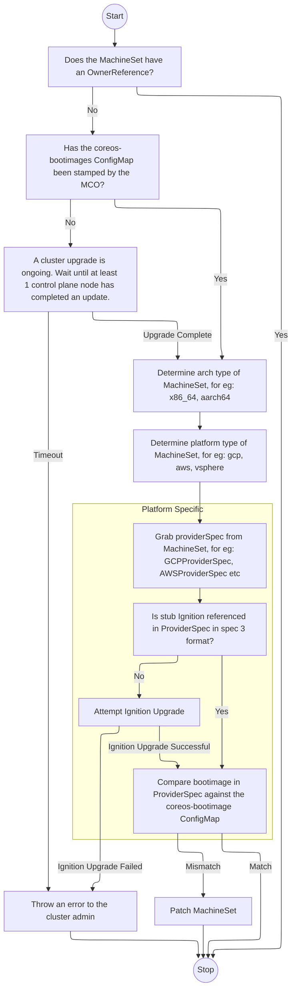
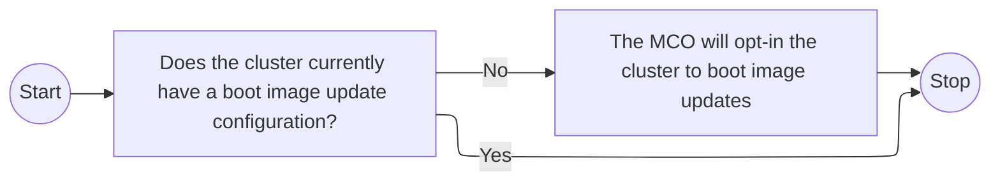

# Managing boot images via the MCO

## Summary

This is a proposal to manage bootimages via the `Machine Config Operator`(MCO), leveraging some of the [pre-work](https://github.com/openshift/installer/pull/4760) done as a result of the discussion in [#201](https://github.com/openshift/enhancements/pull/201). This feature will only target standalone OCP installs. This is now released as an opt-in feature and will be rolled out on a per-platform basis (see projected roadmap). This will eventually be on by default, and the MCO will enforce an accepted skew and require non-platform managed bootimage updates to be acknowledged by the cluster admin.

For `MachineSet` managed clusters, the end goal is to create an automated mechanism that can:
- update the boot images references in `MachineSets` to the latest in the payload image
- ensure stub Ignition config referenced in each `Machinesets` is in spec 3 format

For clusters that are not managed by `MachineSets`, the end goal is to create a document(KB or otherwise) that a cluster admin would follow to update their boot images.


## Motivation

Currently, bootimage references are [stored](https://github.com/openshift/installer/blob/1ca0848f0f8b2ca9758493afa26bf43ebcd70410/pkg/asset/machines/gcp/machines.go#L204C1-L204C1) in a `MachineSet` by the openshift installer during cluster bringup and is thereafter not managed. These boot image references are not updated on an upgrade, so any node scaled up using it will boot up with the original “install” bootimage. This has caused a myriad of issues during scale-up due to this version skew, when the nodes attempt the final pivot to the release payload image. Issues linked below:
- Afterburn [[1](https://issues.redhat.com/browse/OCPBUGS-7559)],[[2](https://issues.redhat.com/browse/OCPBUGS-4769)]
- podman [[1](https://issues.redhat.com/browse/OCPBUGS-9969)]
- skopeo [[1](https://issues.redhat.com/browse/OCPBUGS-3621)]
- composefs [[1](https://github.com/openshift/os/issues/1678#issuecomment-2546310833)]

Additionally, the stub Ignition config [referenced](https://github.com/openshift/installer/blob/1ca0848f0f8b2ca9758493afa26bf43ebcd70410/pkg/asset/machines/gcp/machines.go#L197) in the `MachineSet` is also not managed. This stub is used by the ignition binary in firstboot to auth and consume content from the `machine-config-server`(MCS). The content served includes the actual Ignition configuration and the target OCI format RHCOS image. The ignition binary now does first boot provisioning based on this, then hands off to the `machine-config-daemon`(MCD) first boot service to do the reboot into the target OCI format RHCOS image. 

There has been [a previous effort](https://github.com/openshift/machine-config-operator/pull/1792) to manage the stub Ignition config. It was [reverted](https://github.com/openshift/machine-config-operator/pull/2126) and then [brought back](https://github.com/openshift/machine-config-operator/pull/2827#issuecomment-996156872) just for bare metal clusters. For other platforms, the `*-managed` stubs still get generated by the MCO, but are not injected into the `MachineSet`. The proposal plans to utilize these unused `*-managed` stubs, but it is important to note that this stub is generated(and synced) by the MCO and will ignore/override any user customizations to the original stub Ignition config. This limitation will be mentioned in the documentation, and a later release will provide support for user customization of the stub, either via API or a workaround through additional documentation. This should not be an issue for the majority of users as they very rarely customize the original stub Ignition config.

In certain long lived clusters, the MCS TLS cert contained within the above Ignition configuration may be out of date. Example issue [here](https://issues.redhat.com/browse/OCPBUGS-1817). While this has been partly solved [MCO-642](https://issues.redhat.com/browse/MCO-642) (which allows the user to manually rotate the cert) it would be very beneficial for the MCO to actively manage this TLS cert and take this concern away from the user. 

**Note**: As of 4.19, the MCO supports [management of this TLS cert](https://issues.redhat.com/browse/MCO-1208). With this work in place, the MCO can now attempt to upgrade the stub Ignition config, instead of hardcoding to the `*-managed` stub as mentioned previously. This will help preserve any user customizations that were present in the stub Ignition config.

This is also considered a blocking issue for [SigStore GA](https://issues.redhat.com/browse/OCPNODE-2619). It has caused issues such as [OCPBUGS-38809](https://issues.redhat.com/browse/OCPBUGS-38809) due to the older podman binary not being able to understand `sigstoreSigned` fields in `/etc/containers/policy.json`. There can be similar issues in the future that can be hard to anticipate. 


This is also a soft pre-requisite for both dual-stream RHEL support in OpenShift, and on-cluster layered builds. RPM-OSTree presently does a deploy-from-self to get a new-enough rpm-ostree to deploy image-based RHEL CoreOS systems, and we would like to avoid doing this for bootc if possible. We would also like to prevent RHEL8->RHEL10 direct updates once that is available for OpenShift.

### User Stories

* As an Openshift engineer, having nodes boot up on an unsupported OCP version is a security liability. By having nodes boot on the latest OCP supported boot image for a given OCP release, there will be less of a skew with the release payload image. This helps me avoid tracking incompatibilities across OCP release versions and shore up technical debt(see issues linked above). 

* As a cluster administrator, having to keep track of a "boot" vs "live" image for a given cluster is not intuitive or user friendly. In the worst case scenario, I will have to reset a cluster(or do a lot of manual steps with rh-support in recovering the node) simply to be able to scale up nodes after an upgrade. If I'm managing a `MachineSet` managed cluster, once opted in, this feature will be a "switch on and forget" mechanism for me. If I'm managing a non `Machineset` managed cluster, this would provide me with documentation that I could follow after an upgrade to ensure my cluster has the latest bootimages.

### Goals

The MCO will take over management of the boot image references and the stub Ignition configuration. The installer is still responsible for creating the `MachineSet` at cluster bring-up, but once cluster installation is complete the MCO will ensure that boot images are in sync with the latest payload. From the user standpoint, this should cause less compatibility issues as nodes will no longer need to pivot to a different version of RHCOS during node scaleup.

This should not interfere with existing workflows such as Hive and ArgoCD. As this is an opt-in mechanism, the cluster admin will be protected against such scenarios of accidental "reconciliation" and for additional safety, the MSBIC will also ensure that machinesets that have a valid OwnerReference will be excluded from boot image updates. We will work with affected teams to transition them to the new workflow before we turn this feature on by default.

### Non-Goals

- The new subcontroller is only intended to support clusters that use MachineSet backed node scaling. This is meant to be a user opt-in feature, and if the user wishes to keep their boot images static it will let them do so.
- This does not intend to solve [booting into custom pools](https://issues.redhat.com/browse/MCO-773). 
- This does not target Hypershift, as [it does not use machinesets](https://github.com/openshift/hypershift/blob/32309b12ae6c5d4952357f4ad17519cf2424805a/hypershift-operator/controllers/nodepool/nodepool_controller.go#L2168).
- This does not target [ControlPlaneMachineSets](https://docs.openshift.com/container-platform/4.14/machine_management/control_plane_machine_management/cpmso-about.html). This is considered future work and will be tracked by [MCO-1007](https://issues.redhat.com/browse/MCO-1007). 

## Proposal

__Overview__

- The `machine-config-controller`(MCC) pod will gain a new sub-controller `machine_set_boot_image_controller`(MSBIC) that monitors `MachineSet` changes and the `coreos-bootimages` [ConfigMap](https://github.com/openshift/installer/pull/4760) changes.
- Before processing a MachineSet, the MSBIC will check if the following conditions are satisfied:
  - `ManagedBootImages` feature gate is active
  - The cluster and/or the machineset is opted-in to boot image updates. This is done at the operator level, via the `MachineConfiguration` API object.
  - The `machineset` does not have a valid owner reference. Having a valid owner reference typically indicates that the `MachineSet` is managed by another workflow, and that updates to it are likely going to cause thrashing. 
  - The golden configmap is verified to be in sync with the current version of the MCO. The MCO will update("stamp") the golden configmap with version of the new MCO image after at least 1 master node has successfully completed an update to the new OCP image. This helps prevent `machinesets` being updated too soon at the end of a cluster upgrade, before the MCO itself has updated and has had a chance to roll out the new OCP image to the cluster.

  If any of the above checks fail, the MSBIC will exit out of the sync.
- Based on platform and architecture type, the MSBIC will check if the boot images referenced in the `providerSpec` field of the `MachineSet` is the same as the one in the ConfigMap. Each platform(gcp, aws...and so on) does this differently, so this part of the implementation will have to be special cased. The ConfigMap is considered to be the golden set of bootimage values, i.e. they will never go out of date. If it is not a match, the `providerSpec` field is cloned and updated with the new boot image reference.
- Next, it will check if the stub secret referenced within the `providerSpec` field of the `MachineSet` is managed i.e. `worker-user-data-managed` and not `worker-user-data`. If it is unmanaged, the cloned `providerSpec` will be updated to reference the managed stub secret. This step is platform/arch agnostic.

- Finally, the MSBIC will attempt to patch the `MachineSet` if an update is required.

#### Error & Alert Mechanism

MSBIC sync failures may be caused by multiple reasons:
- The `coreos-bootimages` ConfigMap is unavailable or in an incorrect format. This will likely happen if a user manually edits the ConfigMap, overriding the CVO.
- The `coreos-bootimages` ConfigMap takes too long to be stamped by the MCO. This indicates that there are larger problems in the cluster such as an upgrade failure/timeout or an unrelated cluster failure.
- Patching the `MachineSet` fails. This indicates a temporary API server blip, or larger RBAC issues.

An error condition will be applied on the operator level `MachineConfiguration` object when the sync failures of a given `MachineSet` exceed a threshold amount for a period of time. The condition will include information regarding the sync failures and the logs of the MSBIC can be checked for additional details.

In addition to this, a Prometheus alert will also be triggered by the MSBIC. This alert will list the misbehaving `MachineSet` and will be cleared automatically by the MSBIC if the sync is successfully completed later. 

Note: In the future, patches to `MachineSets` will be prevented when they are not authoritative [#1465](https://github.com/openshift/enhancements/pull/1465). This will need to be accounted for within the logic of the MSBIC.

### Workflow Description

It is important to note that there would be two "opt-in" knobs while this feature is under TechPreview. The user would first have to turn on the feature gate, and then the opt-in mechanism. The secondary knob is necessary as some customers may want to keep their boot images static when this feature leaves TechPreview.

See the API extension section for examples of how this feature can be turned on and off. 

#### Variation and form factor considerations [optional]

Any form factor using the MCO and `MachineSets` will be impacted by this proposal. So case by case:
- Standalone OpenShift: Yes, this is the main target form factor.
- microshift: No, as it does [not](https://github.com/openshift/microshift/blob/main/docs/contributor/enabled_apis.md) use `MachineSets`.
- Hypershift: No, Hypershift does not have this issue.
- Hive: Hive manages `MachineSets` via `MachinePools`. The MachinePool controller generates the `MachineSets` manifests (by invoking vendored installer code) which include the `providerSpec`. Once a `MachineSet` has been created on the spoke, the only things that will be reconciled on it are replicas, labels, and taints - [unless a backdoor is enabled](https://github.com/openshift/hive/blob/0d5507f91935701146f3615c990941f24bd42fe1/pkg/constants/constants.go#L518). If the `providerSpec` ever goes out of sync, a warning will be logged by the MachinePool controller but otherwise this discrepancy is ignored. In such cases, the MSBIC will not have any issue reconciling the `providerSpec` to the correct boot image. However, if the backdoor is enabled, both the MSBIC and the MachinePool Controller will attempt to reconcile the `providerSpec` field, causing churn. The Hive team has [updated the comment](https://github.com/openshift/hive/pull/2596/files) on the backdoor annotation to indicate that it is mutually exclusive with this feature.

##### Supported platforms

The initial release(phase 0) will support GCP. In future releases, we will add in support for remaining platforms as we gain confidence in the functionality and understand the specific needs of those platforms. For platforms that cannot be supported, we aim to at least provide documentation to perform the boot image updates manually. Here is an exhaustive list of all the platforms:

- aws
- azure
- baremetal
- gcp
- ibmcloud
- nutanix
- openstack
- powervs
- vsphere

This work will be tracked in [MCO-793](https://issues.redhat.com/browse/MCO-793).

##### Projected timeline

This is a tentative timeline, subject to change (GA = General Availability(opt-in), TP = Tech Preview(opt-in), DEF = Default-on(opt-out)).

| Platform | TP      | GA      | DEF      |
| -------- | ------- | ------- | ------- |
| gcp      | [4.16](https://docs.redhat.com/en/documentation/openshift_container_platform/4.16/html-single/machine_configuration/index#mco-update-boot-images)    |[4.17](https://docs.redhat.com/en/documentation/openshift_container_platform/4.17/html-single/machine_configuration/index#mco-update-boot-images)     |4.19     |
| aws      | [4.17](https://docs.redhat.com/en/documentation/openshift_container_platform/4.17/html-single/machine_configuration/index#mco-update-boot-images)    |[4.18](https://docs.redhat.com/en/documentation/openshift_container_platform/4.18/html-single/machine_configuration/index#mco-update-boot-images)     |4.19     |
| vsphere  | 4.20    |4.21     |4.22     |
| azure    | 4.20    |4.21     |4.22     |
| baremetal|         |4.22     |4.23     |
| openstack|         |4.22     |4.23     |
| nutanix  |         |4.23     |4.24     |
| ibmcloud |         |4.23     |4.24     |
| non-managed*  |   x      |x    |4.25    |

Once default-on behavior has been deemed to be stable across the above mentioned platforms, skew enforcement will be implemented in a platform agnostic manner. Decoupling the default-on and skew enforcement mechanism would help iron out any edge cases unique to a platform and would also aid in refining the skew enforcement workflow. The tentative timeline for skew enforcement would be 4.25.

**Note** : For non-managed cases, * indicates enforcement of user-initiated bootimage updates. See enforcement section below.
##### Cluster API backed machinesets

As the Cluster API move is impending(initial release in 4.16 and default-on release in 4.17), it is necessary that this enhancement plans for the changes required in an CAPI backed cluster. Here are a couple of sample YAMLs used in CAPI backed `Machinesets`, from the [official Openshift documentation](https://docs.openshift.com/container-platform/4.14/machine_management/capi-machine-management.html#capi-sample-yaml-files-gcp).

###### MachineSet resource
```
apiVersion: cluster.x-k8s.io/v1beta1
kind: MachineSet
metadata:
  name: <machine_set_name> 
  namespace: openshift-cluster-api
spec:
  clusterName: <cluster_name> 
  replicas: 1
  selector:
    matchLabels:
      test: test
  template:
    metadata:
      labels:
        test: test
    spec:
      bootstrap:
         dataSecretName: worker-user-data 
      clusterName: <cluster_name> 
      infrastructureRef:
        apiVersion: infrastructure.cluster.x-k8s.io/v1beta1
        kind: GCPMachineTemplate 
        name: <machine_set_name> 
      failureDomain: <failure_domain> 
```
###### GCPMachineTemplate
```
apiVersion: infrastructure.cluster.x-k8s.io/v1beta1
kind: GCPMachineTemplate 
metadata:
  name: <template_name> 
  namespace: openshift-cluster-api
spec:
  template:
    spec: 
      rootDeviceType: pd-ssd
      rootDeviceSize: 128
      instanceType: n1-standard-4
      image: projects/rhcos-cloud/global/images/rhcos-411-85-202203181601-0-gcp-x86-64
      subnet: <cluster_name>-worker-subnet
      serviceAccounts:
        email: <service_account_email_address>
        scopes:
          - https://www.googleapis.com/auth/cloud-platform
      additionalLabels:
        kubernetes-io-cluster-<cluster_name>: owned
      additionalNetworkTags:
        - <cluster_name>-worker
      ipForwarding: Disabled
```
As can be seen, the bootimage becomes part of an `InfrastructureMachineTemplate` object (eg a GCPMachineTemplate), and then the MachineSet references this template and creates new machines from the template. The stub secret is now stored in a `bootstrap` object. Unlike MAPI backed MachineSets, both of them are no longer part of a single `providerSpec` object. 

It is important to note that InfrastructureMachineTemplate is different per platform and is immutable. This will prevent an update in place style approach and would mean that the template would need to be cloned, updated during the clone, and then the MachineSet updated. This is somewhat similar to the approach used in the current MAPI PoC of cloning the `providerSpec` object, updating it and then patching the `MachineSet`. The `bootstrap` object is platform agnostic, making it somewhat simpler to update. 

Based on the observation above, here is a rough outline of what CAPI support would require:
- CAPI backed MachineSet detection, so the MSBIC knows when to invoke the CAPI path.
- If a boot image update is required, create a new `InfrastructureMachineTemplate` by cloning the existing and updating the boot image reference within. The name of the new `InfrastructureMachineTemplate` object will be generated by hashing the template content. This is consistent with the current CAPI approach to naming new objects.
- Updating the Ignition stub in `bootstrap.dataSecretName` to the managed stub secret(`*-managed`) if needed.
- CAPI backed MachineSet patching. Once patching is successfully completed, the original `InfrastructureMachineTemplate` can be garbage collected. 

When [MachineDeployments](https://cluster-api.sigs.k8s.io/developer/architecture/controllers/machine-deployment#machinedeployment) are introduced into CAPI, this mechanism will need to be updated to reconcile them as well. `MachineDeployments` manage a fleet of `MachineSets`, and this can be checked via the `OwnerReference` field in the `MachineSet` object. In the long term, `MachineDeployments` and `MachineSets` are expected to co-exist so this feature will need to account for both cases. 

Much of the existing design regarding architecture & platform detection, opt-in, degradation and storing boot image history can remain the same. 

### API Extensions

#### Opt-in Mechanism
This proposal introduces a new field in the MCO operator API, `ManagedBootImages` which encloses an array of `MachineManager` objects. A `MachineManager` object contains the resource type of the machine management object that is being opted-in, the API group of that object and a union discriminant object of the type `MachineManagerSelector`. This object `MachineManagerSelector` contains:

- The union discriminator, `Mode`, can be set to three values : All, Partial and None.
  - **All**: All machine resources described by this resource/apiGroup type will be opted-in for boot image updates. In most cases, this effectively enables boot image updates for the whole cluster, unless there are multiple kinds of machine resources present in the cluster.
  - **Partial**: This is a set of label selectors that will be used by users to opt-in a custom selection of machine resources. When the Mode is set to Partial mode, all machinesets matched by this object would be considered enrolled for updates. In the first iteration of this API, this object will only allow for label matching with MachineResources. In the future, additional ways of filtering may be added with another label selector, e.g. namespace.
  - **None**: All machine resources described by this resource/apiGroup type will be excluded from boot image updates. In most cases, this effectively disables boot image updates for the whole cluster, unless there are multiple kinds of machine resources present in the cluster.


```
type ManagedBootImages struct {
	// machineManagers can be used to register machine management resources for boot image updates. The Machine Config Operator
	// will watch for changes to this list. Only one entry is permitted per type of machine management resource.
	// +optional
	// +listType=map
	// +listMapKey=resource
	// +listMapKey=apiGroup
	MachineManagers []MachineManager `json:"machineManagers"`
}

// MachineManager describes a target machine resource that is registered for boot image updates. It stores identifying information
// such as the resource type and the API Group of the resource. It also provides granular control via the selection field.
type MachineManager struct {
	// resource is the machine management resource's type.
	// The only current valid value is machinesets.
	// machinesets means that the machine manager will only register resources of the kind MachineSet.
	// +kubebuilder:validation:Required
	Resource MachineManagerMachineSetsResourceType `json:"resource"`

	// apiGroup is name of the APIGroup that the machine management resource belongs to.
	// The only current valid value is machine.openshift.io.
	// machine.openshift.io means that the machine manager will only register resources that belong to OpenShift machine API group.
	// +kubebuilder:validation:Required
	APIGroup MachineManagerMachineSetsAPIGroupType `json:"apiGroup"`

	// selection allows granular control of the machine management resources that will be registered for boot image updates.
	// +kubebuilder:validation:Required
	Selection MachineManagerSelector `json:"selection"`
}

// +kubebuilder:validation:XValidation:rule="has(self.mode) && self.mode == 'Partial' ?  has(self.partial) : !has(self.partial)",message="Partial is required when type is partial, and forbidden otherwise"
// +union
type MachineManagerSelector struct {
	// mode determines how machine managers will be selected for updates.
	// Valid values are All and Partial.
	// All means that every resource matched by the machine manager will be updated.
	// Partial requires specified selector(s) and allows customisation of which resources matched by the machine manager will be updated.
  // None means that every resource matched by the machine manager will NOT be updated.
	// +unionDiscriminator
	// +kubebuilder:validation:Required
	Mode MachineManagerSelectorMode `json:"mode"`

	// partial provides label selector(s) that can be used to match machine management resources.
	// Only permitted when mode is set to "Partial".
	// +optional
	Partial *PartialSelector `json:"partial,omitempty"`
}

// PartialSelector provides label selector(s) that can be used to match machine management resources.
type PartialSelector struct {
	// machineResourceSelector is a label selector that can be used to select machine resources like MachineSets.
	// +kubebuilder:validation:Required
	MachineResourceSelector *metav1.LabelSelector `json:"machineResourceSelector,omitempty"`
}

// MachineManagerSelectorMode is a string enum used in the MachineManagerSelector union discriminator.
// +kubebuilder:validation:Enum:="All";"Partial";"None"
type MachineManagerSelectorMode string

const (
	// All represents a configuration mode that registers all resources specified by the parent MachineManager for boot image updates.
	All MachineManagerSelectorMode = "All"

	// Partial represents a configuration mode that will register resources specified by the parent MachineManager only
	// if they match with the label selector.
	Partial MachineManagerSelectorMode = "Partial"

  // None represents a configuration mode that excludes all resources specified by the parent MachineManager from boot image updates.
	None MachineManagerSelectorMode = "None"
)

// MachineManagerManagedResourceType is a string enum used in the MachineManager type to describe the resource
// type to be registered.
// +kubebuilder:validation:Enum:="machinesets"
type MachineManagerMachineSetsResourceType string

const (
	// MachineSets represent the MachineSet resource type, which manage a group of machines and belong to the Openshift machine API group.
	MachineSets MachineManagerMachineSetsResourceType = "machinesets"
)

// MachineManagerManagedAPIGroupType is a string enum used in in the MachineManager type to describe the APIGroup
// of the resource type being registered.
// +kubebuilder:validation:Enum:="machine.openshift.io"
type MachineManagerMachineSetsAPIGroupType string

const (
	// MachineAPI represent the traditional MAPI Group that a machineset may belong to.
	// This feature only supports MAPI machinesets at this time.
	MachineAPI MachineManagerMachineSetsAPIGroupType = "machine.openshift.io"
)
```
Here is a YAML snippet of what this config could look like: 
```
managedBootImages:
  machineManagers:
  - resource: machinesets
    apiGroup: cluster.x-k8s.io
    selection:
      mode: Partial
      partial:
        machineResourceSelector:
          matchLabels: {}
  - resource: machinesets
    apiGroup: machine.openshift.io
    selection:
       mode: All
```
The above example partially selects CAPI MachineSets and all MAPI Machinesets. Please note that for every unique pair of resource/APIGroup, only 1 entry is allowed in machineManagers. This is to avoid providing conflicting instructions for the same type of machine resource. The user can then use the partial label selector if further customization is required.

It is also important to note that if a user opts out of the feature after having some machine resources updated, the opted out resources will retain the boot images that
they were last updated to by this feature. There is no rollback to cluster install values, i.e. the original boot images that the resources started on before they were enrolled for updates. Opting out a machine resource simply means that the machine resources will no longer have updated boot images values.

An Success/Failure condition will be applied on the MachineConfiguration object by the MSBIC. This will require [some rework](https://github.com/openshift/api/pull/1789) of the `MachineConfigurationStatus` field before new condition types can be added to this object. The condition type names are still TBD, but could be as simple as `MSBICReconciled` and `MSBICFailed`. 

A [ValidatingAdmissionPolicy](https://kubernetes.io/docs/reference/access-authn-authz/validating-admission-policy/) will be implemented via an MCO manifest that will restrict updating the `ManagedBootImages` object to only supported platforms(initially, just GCP). This will be updated as we phase in support for other platforms. Here is a sample policy that would do this:

```
apiVersion: admissionregistration.k8s.io/v1beta1
kind: ValidatingAdmissionPolicy
metadata:
  name: "managed-bootimages-platform-check"
spec:
  failurePolicy: Fail
  paramKind:
    apiVersion: config.openshift.io/v1
    kind: Infrastructure
  matchConstraints:
    resourceRules:
    - apiGroups:   ["operator"]
      apiVersions: ["v1"]
      operations:  ["CREATE", "UPDATE"]
      resources:   ["MachineConfiguration"]
  validations:
    - expression: "has(object.spec.ManagedBootImages) && param.status.platformStatus.Type != `GCP`"
      message: "This feature is only supported on these platforms: GCP"
```
This would need an accompanying binding:
```
apiVersion: admissionregistration.k8s.io/v1beta1
kind: ValidatingAdmissionPolicyBinding
metadata:
  name: "managed-bootimages-platform-check-binding"
spec:
  policyName: "managed-bootimages-platform-check"
  validationActions: [Deny]
  paramRef:
    name: "cluster"
    namespace: "default"
```

Alongside the implementation of default-on behavior, a Status field for ManagedBootImages is also planned. This would reflect the 
current ManagedBootImages configuration and if unspecified, it will represent the current cluster defaults.
```
type MachineConfigurationStatus struct {
  ...
  ...

	// managedBootImagesStatus reflects what the latest cluster-validated boot image configuration is
	// and will be used by Machine Config Controller while performing boot image updates.
	// +openshift:enable:FeatureGate=ManagedBootImages
	// +optional
	ManagedBootImagesStatus ManagedBootImages `json:"managedBootImagesStatus"`
}

```
Here are some examples to illustrate how this works.

Scenario: No admin configuration and the currrent release **does not** opt-in by default:
```
apiVersion: operator.openshift.io/v1
kind: MachineConfiguration
spec:
status:
  managedBootImagesStatus:
    machineManagers:
    - resource: machinesets
      apiGroup: machine.openshift.io
      selection:
         mode: None
```
Scenario: No admin configuration and the currrent release **does** opt-in by default:
```
apiVersion: operator.openshift.io/v1
kind: MachineConfiguration
spec:
status:
  managedBootImagesStatus:
    machineManagers:
    - resource: machinesets
      apiGroup: machine.openshift.io
      selection:
         mode: All
```
Regardless of the default-on behavior of the release, if the admin were to add a configuration, the status must reflect that in the next update.
```
apiVersion: operator.openshift.io/v1
kind: MachineConfiguration
spec:
  managedBootImages:
    machineManagers:
    - resource: machinesets
      apiGroup: machine.openshift.io
      selection:
         mode: Partial
         partial:
           machineResourceSelector:
             matchLabels: {}
status:
  managedBootImagesStatus:
    machineManagers:
    - resource: machinesets
      apiGroup: machine.openshift.io
      selection:
         mode: Partial
         partial:
           machineResourceSelector:
             matchLabels: {}
```
  

#### Skew Enforcement
As mentioned in the timeline section, this would only be implemented after default-on behavior has been deemed to be stable across
all platforms.

This would introduced as an new knob in the `ManagedBootImages` struct:
```
type ManagedBootImages struct {
  ...
  ...
  // skewEnforcement allows an admin to set behavior of the boot image skew enforcement mechanism.
  // Enabled means that the MCO will degrade and prevent upgrades when the boot image skew exceeds the 
  // skew limit described by the release image.
  // Disabled means that the MCO will no longer degrade and will permit upgrades when the boot image 
  // exceeds the skew limit described by the release image. This will likely hinder the cluster's scaling ability.
  // +optional
  SkewEnforcement SkewEnforcementSelectorMode `json:"skewEnforcement"`
}

// SkewEnforcementSelectorMode is a string enum used to indicate the cluster's boot image skew enforcement mode.
// +kubebuilder:validation:Enum:="Enabled";"Disabled"
type SkewEnforcementSelectorMode string

const (
	// Enabled represents a configuration mode that enables boot image skew enforcement.
	Enabled SkewEnforcementSelectorMode = "Enabled"

	// Disabled represents a configuration mode that disables boot image skew enforcement.
	Disabled SkewEnforcementSelectorMode = "Disabled"
)

```

#### Tracking boot image history

Note: This section is just an idea for the moment and is considered out of scope. This CR will require thorough API review in a follow-up enhancement.

As a starting point, here is a stub type definition for a CRD to track the boot image history of a machine resource:

```
type BootImageHistory struct {
	metav1.TypeMeta   `json:",inline"`
	metav1.ObjectMeta `json:"metadata,omitempty"`

	Spec   BootImageHistorySpec   `json:"spec,omitempty"`
	Status BootImageHistoryStatus `json:"status,omitempty"`
}

// BootImageHistorySpec defines the desired state of BootImageHistory
type BootImageHistorySpec struct {
	// machineResourceReference contains identifying information of the machine management resource being tracked.
	// +kubebuilder:validation:Required
  // +kubebuilder:validation:XValidation:rule="self == oldSelf",message="MachineResourceReference is immutable once set"
	// +required
	MachineResourceReference MachineResourceReference `json:"machineResourceReference"`}

// BootImageHistoryStatus defines the observed state of BootImageHistory
type BootImageHistoryStatus struct {
	// details is a list of boot image history entries of the machine resource.
	// +optional
	Details []BootImageHistoryDetail `json:"details"`
}

type MachineResourceReference struct {
	// name is the machine management resource's name
	// +kubebuilder:validation:Required
	// +required
	Name string `json:"name"`
	// resource is the machine management resource's type
	// Example: "machineset", "machinedeployment"etc.
	// +kubebuilder:validation:Required
	// +required
	Resource string `json:"resource"`
	// apiGroup is name of the APIGroup that the machine management resource belongs to. This is for disambiguating
	// between Cluster API and Machine API backed resources.
	// +kubebuilder:validation:Required
	// +required
	APIGroup string `json:"apiGroup"`
}

// BootImageHistoryDetail is the struct for each element in the Details array
type BootImageHistoryDetail struct {
	// updateTime records the timestamp at which the update took place.
	// +required
	UpdateTime metav1.Time `json:"updatedTime"`
	// bootImageVersion records the RHCOS version string to which this update took place.
	// +required
	BootImageVersion string `json:"bootImageVersion"`
  // configMapGeneration records the version of the golden configmap during this update
  // +required
  ConfigMapGeneration int64 `json:"configMapGeneration"`
}

// BootImageHistoryList contains a list of BootImageHistory
type BootImageHistoryList struct {
	metav1.TypeMeta `json:",inline"`
	metav1.ListMeta `json:"metadata,omitempty"`
	Items           []BootImageHistory `json:"items"`
}

```
There will be one instance of this per machine management resource(which can be a MachineSet[MAPI or CAPI], MachineDeployment...etc). It will be named the in the following format: `$(name)-$(resource)`. The MSBIC is responsible for creating and updating this CR when a boot image update takes place. This CR will exist in the same namespace as the resource.

YAML Example for a MAPI backed machineset scenario:
```
apiVersion: machineconfiguration.openshift.io/v1alpha1
kind: BootImageHistory
metadata:
  name: djoshy10-2tcqv-worker-a-mapi-machineset
spec:
  machineResourceReference:
    name: djoshy10-2tcqv-worker-a
    resource: MachineSet
    apiGroup: machine.openshift.io
status:
  details:
    - updateTime: "2023-12-14T12:00:00Z"
      bootImageVersion: "414.92.202308032115-0"
      configMapGeneration: 2
    - updateTime: "2023-12-14T14:30:00Z"
      bootImageVersion: "415.92.202311241643-0"
      configMapGeneration: 3
```

YAML Example for a CAPI backed machineset scenario:
```
apiVersion: machineconfiguration.openshift.io/v1alpha1
kind: BootImageHistory
metadata:
  name: djoshy10-2tcqv-worker-a
spec:
  machineResourceReference:
    name: djoshy10-2tcqv-worker-a-capi-machineset
    resource: MachineSet
    apiGroup: cluster.x-k8s.io
status:
  details:
    - updateTime: "2023-12-14T12:00:00Z"
      bootImageVersion: "414.92.202308032115-0"
      configMapGeneration: 2
    - updateTime: "2023-12-14T14:30:00Z"
      bootImageVersion: "415.92.202311241643-0"
      configMapGeneration: 3

```
The goal of this is to provide information about the "lineage" of a machine management resource to the user. The user can then manually restore their machine management resource to an earlier state if they wish to do so by following documentation. 

### Implementation Details/Notes/Constraints [optional]

MachineSet Reconciliation Loop:



The implementation has a GCP specific MVP that can be found here:
- https://github.com/openshift/machine-config-operator/pull/4083

### Risks and Mitigations

The biggest risk in this enhancement would be delivering a bad boot image. However, the chances of this are quite minimal, as it would imply the [boot images](https://github.com/openshift/installer/blob/main/data/data/coreos/rhcos.json) used in the current version of OCP are invalid, which would have been through several iterations of CI.

How will security be reviewed and by whom?
This is a solution aimed at reducing usage of outdated artifacts and should not introduce any security concerns that do not currently exist. 

How will UX be reviewed and by whom? 
The UX element involved include the user opt-in and opt-out, which is currently up for debate. 

#### Enabling Boot Image Updates by default

This will be done on a platform by platform basis. Some key benchmarks have to be met for a platform to be considered ready
for default on:
- Sufficent runtime(say, at least 1 release) has been accumulated while boot image updates has been GAed for this platform.
- Periodic tests have been added for this platform in CI and have met certain passing metrics.
- Any teams that are affected by default-on
behavior have been notified and assisted with the transition.

The default-on flow could look like this:

Some points to note:
- For bookkeeping purposes, the MCO will annotate the `MachineConfiguration` object when opting in the cluster by default.
- This mechanism will be active on installs and upgrades. 
- If the cluster admin wishes to opt-out of the feature, they have to do so by explicitly opting out the cluster via the API knob prior to the upgrade. 
- If any of the MachineSets have an OwnerReference, it will be skipped for boot image updates. This will cause an alert/warning to the cluster admin, but it will no longer cause a degrade. 


### Enforcement of bootimage skew

There should be some mechanism that will alert the user and fail if a cluster's bootimage are out of date. For example, at upgrade time, the MCO could signal to the CVO by setting Upgradeable=False.

#### Acceptable skew

The release payload will describe the current skew policy. The structure of this skew policy is TBD, but at the minimum it should describe the lowest acceptable boot image for the release. Generally speaking, we would like to keep the bootimage version aligned to the RHEL version we are shipping in the payload. For example, a 9.6 bootimage will be allowed until 9.8 is shipped via RHCOS. We would like to keep this customizable, such that any major breaking changes outside of RHEL major/minor can still be enforced as a one-off.

#### Enforcement options

Some combination of the following mechanisms should be implemented to alert users, particularly non-machineset backed scaled environments. The options generally fall under proactive enforcement (require users to either update or acknowledge risk before upgrading to a new version) vs. reactive enforcement (only fail when a non-compliant bootimage is being used to scale into the cluster).

#### Proactive
Add a new field in the `coreos-bootimages` configmap in the MCO namespace that will store the cluster's current boot image and allows for easy comparison against the skew policy described in the release payload.
  - For machineset backed clusters, this would be updated by the MSBIC after it succesfully updates boot images. 
  - For non-machineset backed clusters, this would be updated by the cluster admin to indicate the last manually updated bootimage. The cluster admin would need to update this configmap every few releases, when the RHEL minor on which the RHCOS container is built on changes (e.g. 9.6->9.8). 

The cluster admin may also choose to opt-out of skew management via this configmap, which indicates that they will not require scaling nodes, and thereby opting out of skew enforcement and scaling functionality.

A potential problem here is that the way boot images are stored in the machineset is lossy. In certain platforms, there is no way to recover the boot image metadata from the MachineSet. This is most likely to happen the first time the MCO attempts to do skew enforcement on a cluster that has never had boot image updates. In such cases, the MCO will default to the install time boot image, which can be recovered from the [aleph version](https://github.com/coreos/coreos-assembler/pull/768) of the control plane nodes. 

This configmap can then be monitored to enforce skew limits. This could be done in a couple of ways. If the skew is determined to be too large, the MCO can update its `ClusterOperator` object with an `Upgradeable=False` condition, along with remediation steps in the `Condition` message. This will signal to the CVO that the cluster is not suitable for an upgrade.

As stated earlier, to remediate, the cluster admin would then have to do one of the following:
- Turn on boot image updates if it is a machineset backed cluster.
- Manually update the boot image and update the configmap if it is a non machineset backed cluster.
- Opt-out of skew enforcement altogether, giving up scaling ability.

#### Reactive
1. Have the MCS reject new ignition requests if the aformentioned configmap indicates that the cluster's bootimages are out of date. The MCS could then signal to the cluster admin that scale-up is not available until the configmap has been reconciled.
2. Add a service to be shipped via RHCOS/MCO templates, which will do a check on incoming OS container image vs currently booted RHCOS version. This runs on firstboot right after the MCD pulls the new image, and will prevent the node to rebase to the updated image if the drift is too far.

RHEL major versions will no longer be cross-compatible. i.e. if you wish to have a RHEL10 machineconfigpool, you must use a RHEL10 bootimage.

### Drawbacks

TBD, based on the open questions below.

## Design Details

### Open Questions

### Test Plan

In addition to unit tests, the enhancement will also ship with e2e tests, outlined [here](https://issues.redhat.com/browse/MCO-774).

### Graduation Criteria

#### Dev Preview -> Tech Preview

- Support for GCP
- Opt-in and Degrade mechanism
- GCP specific E2E tests
- Feedback from openshift teams
- UPI documentation based on IPI workflow for select platforms
- [Good CI signal from autoscaling nodes](https://github.com/cgwalters/enhancements/blob/5505d7db7d69ffa1ee838be972c70b572d882891/enhancements/bootimages.md#test-plan)


#### Tech Preview -> GA

- Feedback from interested customers
- User facing documentation created in [openshift-docs](https://github.com/openshift/openshift-docs/)

Additionaly, a phased approach such as the following is the proposed:

#### Phase 0
- Support for GCP
- vsphere UPI documentation
- Opt-in mechanism
- Degrade mechanism
- E2E tests

#### Phase 1
- Support for Azure and AWS
- MCS TLS cert management

#### Phase 2
- Tracking boot image history
- User facing documentation for manual restoration
- User customization of Ignition stub secret
- Canary testing a patched MachineSet, gated by a flag.

#### Removing a deprecated feature

This does not remove an existing feature.

### Upgrade / Downgrade Strategy

__Upgrade__

This mechanism is only active shortly after an upgrade, which is when the ConfigMap containing the bootimages are updated by the CVO manifest. It will also run during machineset edits but patching will only occur if there is a mismatch in bootimages.

__Downgrade__

- If the cluster is downgrading to a version that supports this feature, the boot images will track the downgraded version.
- If the cluster is downgrading to a version that does not support this feature, the boot images will not track to the downgraded version. So, it may be wise to opt-out of the feature prior to the downgrade if "normal(i.e. older) OCP behavior" is expected. 

### Version Skew Strategy

N/A

### Operational Aspects of API Extensions

TBD, based on how the opt-in feature would work.

#### Failure Modes

TBD

#### Support Procedures

TBD

## Implementation History

TBD

## Alternatives

TBD
