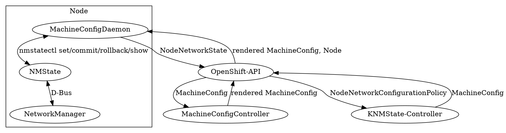

# Extend MCO to support declarative host network configuration [baremetal]

## Release Signoff Checklist

- [ ] Enhancement is `implementable`
- [ ] Design details are appropriately documented from clear requirements
- [ ] Test plan is defined
- [ ] Graduation criteria for dev preview, tech preview, GA
- [ ] User-facing documentation is created in [openshift-docs](https://github.com/openshift/openshift-docs/)

## Summary

The ability to configure additional host networking parameters is
paramount on some platforms, especially baremetal. Baremetal nodes
usually have many interfaces that need to be dynamically configured to
access other, critical datacenter resources. Doing so with
MachineConfig would incur reboots that are expensive in time on the
baremetal platform. The ability to configure host networking
parameters without rebooting is desirable. It is also desirable to
rollback automatically on failure, as opposed to failing on reboot.

## Motivation

With hybrid clouds, node-networking setup is becoming even more challenging.
Different payloads have different networking requirements, and not everything
can be satisfied as overlays on top of the main interface of the node (e.g.
SR-IOV, L2, other L2).

The [Container Network
Interface](https://github.com/containernetworking/cni) (CNI) standard
enables different solutions for connecting networks on the node with
pods. Some of them are [part of the
standard](https://github.com/containernetworking/plugins), and there
are others that extend support for [Open vSwitch
bridges](https://github.com/kubevirt/ovs-cni),
[SR-IOV](https://github.com/hustcat/sriov-cni), and more...

However, in all of these cases, the node must have the networks setup before the pod is scheduled. Setting up the networks in a dynamic and heterogenous cluster, with dynamic networking requirements, is a challenge by itself - and this is what this project is addressing.

The node network configuration shall remain in the MachineConfigOperator workflow, but be declarative.

### Goals

* Enable an admin to modify node networking configuration without rebooting (Day 2)
* Enable cluster administrators to modify node networking after cluster installation (day 2).
* Integration with MachineConfig node configuration for consistency, familiarity and roll out functionality.
* Rebootless configuration without deferring errors to a later reboot
* Rolling back cluster-breaking configuration mistakes.

### Non-Goals

* Replace SRIOV operator
* Configure and control primary interface on Day 1 or Day 2, including bonds and VLANs.
  * Part of the effort for that: [Add MCO Flattened Ignition proposal](https://github.com/openshift/enhancements/pull/467)

## Proposal

### Option A

The node networking configuration shall be driven by MCO (and by extension kubernetes-nmstate) and executed by
[nmstate](https://nmstate.github.io/).

Do a KubeletConfig like integration:

* NodeNetworkState will be introduced. This allows the user to see the network state of a node in the same declarative language that can be used to configure it.
* The user will configure with NodeNetworkConfigurationPolicy (NNCP). This is a declarative method of defining network state, to be applied by nmstate.
* NNCP, just like KubeletConfig, targets a MachinePool
* The MachineConfigDaemon (**MCD**) vendors the knmstate configuring/rollback functionality.
* MCD runs a vendored subprocess that keeps NodeNetworkState (**NNS**) up to date with the OpenShift API
* NMState is invoked with Podman (Python project with dependencies outside of stdlib)

1. User Creates **NNCP**
2. KNMStateController takes the **NNCP** desiredConfig and puts it as a **MachineConfig** (MC) for the desired pool
3. MachineConfigController renders a new config and its update subcontroller starts updating desiredState of the Nodes
4. MachineConfigDaemon sees the diff between currentState and desiredState
5. In the case all the new rendered MC is equal except the **networkState** section, instead of reboot
    * MCD writes networkState as is (nmstate valid yaml) and writes it to /tmp
    * MCD calls nmstatectl set --no-commit /tmp/uuid-of-the-desiredState.yaml
    * If no connectivity loss, MCD calls nmstatectl commit [PREVIOUS CHECKPOINT]
    * Otherwise, MCD calls nmstatectl rollback
* MCD sets the currentState to match the desiredState.

### Option B

Interact with kubernetes-nmstate handler through MCD. Prepare hooks in MCD for that. User would create MCs, those would be propagated to MCD, MCD would delegate to kubernetes-nmstate handler.

#### Option C

1. Set the NetworkManager config to point to a "merged" keyfile path.
2. Create two temporary directories for overlay purposes.
3. Mount an overlay combining the NetworkManager standard /etc/NetworkManager/system-connections and mount it at the path pointed to by 1. e.g., /etc/NetworkManager/system-connections-merged

kubernetes-nmstate will then operate as is, but the keyfiles that ultimately are written by nmstate would effectively be ephemeral. When a node is rebooted, the kubernetes-nmstate-handler will re-process any existing NodeNetworkConfigurationPolicy CRs, and put the configuration back in place.


#### Recommendation

We believe that option C poses the best combination of using existing MCO with the introduction of kubernetes-nmstate. It would require no fundamental changes to MCO (like rebootless config applies, and machine-specific configuration).

### User Stories

#### Host network configuration (Telco)

As an OpenShift administrator working in Telco, I need to add and remove VLANs on day-2+, more often than the update cycle. Reboot of the whole baremetal cluster could take days and/or impact capacity.

#### L2 networking for VMs (CNV)

As an OpenShift administrator using Container Native Virtualization, I need to configure ad-hoc VLANs and Linux bridges on day-2. These bridges are used to provide L2 connectivity to VMs.

#### L2 networking for Pods (Telco, CNF)

As an OpenShift administrator working in Telco, I need to configure bondings and ad-hoc VLANs on day-2. Macvlan ifaces will be attached to these vlans and plugged into containers.

#### Declarative container native API

As an OpenShift administrator using a Baremetal platform, I want to have a declarative container native API for network interface configuration rather than have to put ifcfg/NM keyfiles.

### Implementation Details/Notes/Constraints [optional]

What are the caveats to the implementation? What are some important details that
didn't come across above. Go in to as much detail as necessary here. This might
be a good place to talk about core concepts and how they relate.

### Risks and Mitigations

#### Not rebooting could hide errors in network configuration

A NetworkManager profile is configured with certain settings (like
connection.autoconnect=yes). See those settings (the content of the
profiles) with `nmcli connection show "$PROFILE"`. The profile is
persisted to disk (in the file you see in `nmcli -f all
connection`). When NM starts, it loads the profiles from
disk. NetworkManager will try to automatically connect/activate
profiles that are configured to autoconnect.

There is no guarantee that a reboot will succeed to connect to the network. e.g. the DHCP might simply not reply. But in general, if you have a profile (persisted to disk), and the profile is set to autoconnect, and you reboot, there is a reasonable expectation that it should work.

If it doesn't come up on reboot, it's likely an environment issue (e.g. cable unplugged) or a real bug (that will be fixed by NetworkManager team).

## Design Details

### Option C Design

These configuration files would be handled via MCO, for the Baremetal platform only.

In /etc/NetworkManager/conf.d/99-kni.conf we add:
[keyfile]
path=/etc/NetworkManager/system-connections-merged

In /etc/tmpfiles.d add a file to specify:
D /tmp/nm-system-connections 0755 root root
D /tmp/nm-system-connections-work 0755 root root

Create a .mount systemd unit to mount the overlay:
/etc/NetworkManager/system-connections-merged
overlay lowerdir=/etc/NetworkManager/system-connections,upperdir=/tmp/nm-system-connections,workdir=/tmp/nm-system-connections-work

All the changes that nmstate will do will end up affecting just /tmp/nm-system-connections so once the machine reboots those will be gone, and only what's on /etc/NetworkManager/system-connections , which is where people would put their keyfiles with MachineConfig would remain.

When kubelet would start, it would start kubernetes-nmstate again, we'd see that NNS doesn't match the NNCP that we need to apply again.

The changes that knmstate + nmstate will do will happen without reboot and since they only get written to the tmpfs won't affect the next boot.
If you need persistent changes, you do them with MCO.
Kubernetes-nmstate will only affect post-kubelet so we comply with the "MC owns every configuration until boot time".

[Link](https://asciinema.org/a/uMqwIpvfhuI67ShT12csYXm3h) to an asciicast showing this option.

### Option A Design

1. User Creates **NNCP**
2. KNMStateController takes the **NNCP** desiredConfig and puts it as a **MachineConfig** (MC) for the desired pool
3. MachineConfigController renders a new config and its update subcontroller starts updating desiredState of the Nodes
4. MachineConfigDaemon sees the diff between currentState and desiredState
5. In the case all the new rendered MC is equal except the **networkState** section, instead of reboot
    * MCD writes networkState as is (nmstate valid yaml) and writes it to /tmp
    * MCD calls nmstatectl set --no-commit /tmp/uuid-of-the-desiredState.yaml
    * If no connectivity loss, MCD calls nmstatectl commit [PREVIOUS CHECKPOINT]
    * Otherwise, MCD calls nmstatectl rollback
* MCD sets the currentState to match the desiredState.



```text


                                           rendered MachineConfig, Node
    ┌────────────────────────────────────────────────────────────────────────┐
    ▼                                                                        │
┌−−−−−−−−−−−−−−−−−−−−−−−−−−−−−−−−−−−−−−−−−−−−−−−−−−−−┐
╎                   Node                             ╎
╎                                                    ╎
╎ ┌──────────────────────────────────────┐           ╎  NodeNetworkState   ┌────────────────────────────────────────────────────────┐           MachineConfig   ┌─────────────────────────┐
╎ │         MachineConfigDaemon          │           ╎ ──────────────────▶ │                     OpenShift-API                      │          ───────────────▶ │ MachineConfigController │
╎ └──────────────────────────────────────┘           ╎                     └────────────────────────────────────────────────────────┘                           └─────────────────────────┘
╎   ▲                                                ╎                       │                                  ▲                 ▲                               │
╎   │                                                ╎                       │                                  │                 │   rendered MachineConfig      │
╎   │ nmstatectl set/commit/rollback/show            ╎                       │ NodeNetworkConfigurationPolicy   │ MachineConfig   └───────────────────────────────┘
╎   ▼                                                ╎                       ▼                                  │
╎ ┌──────────────────────────────────────┐           ╎                     ┌─────────────────────────────────┐  │
╎ │               NMState                │           ╎                     │       KNMState-Controller       │ ─┘
╎ └──────────────────────────────────────┘           ╎                     └─────────────────────────────────┘
╎   ▲                                                ╎
╎   │                                                ╎
╎   │ D-Bus                                          ╎
╎   ▼                                                ╎
╎ ┌──────────────────────────────────────┐           ╎
╎ │            NetworkManager            │           ╎
╎ └──────────────────────────────────────┘           ╎
╎                                                    ╎
└−−−−−−−−−−−−−−−−−−−−−−−−−−−−−−−−−−−−−−−−−−−−−−−−−−−−┘
```

### Advantages
* Rollout keeps the same semantics as MCO. No longer a network state can end up with all the nodes losing connectivity at once.
* Kubernetes-NMState Rollback functionality is kept (When it is triggered, it ends up in [errUnreconcilable](https://github.com/openshift/machine-config-operator/blob/15edac1b5613b135973b071cf96535c3a376419f/pkg/daemon/update.go#L193)).
* MCO keeps ownership over node configuration.
* API consistency and granularity for node changes is kept.
* Customers can keep using declarative Network configuration.

### Disadvantages
* Deviates from upstream kubevirt knmstate usage. [midstream](https://github.com/openshift/kubernetes-nmstate) needs to develop:
  * A very thin controller that creates MC objects
  * Expose an interface for MCD to keep **NNS** up to date with the OpenShift API.
  * Since /usr/libexec/platform-python is on the way out, we must run **NMState with podman**.
* MCD needs to make a change in its [update](https://github.com/openshift/machine-config-operator/blob/15edac1b5613b135973b071cf96535c3a376419f/pkg/daemon/update.go#L152) logic to detect if only networkState changed and in such case, use the vendored Kubernetes NMState functionality instead of *updateOSAndReboot*.
* While the API can be deemed Tech Preview, it would effectively be baked-in, so it can't be made optional to deploy without it.
* NodeNetworkState and NodeNetworkConfigPolicy probably need to go into [openshift/api](https://github.com/openshift/api).
* Users lose the upstream ability to target specific single nodes in favor of MachinePool granularity.  (walters: See also https://github.com/openshift/machine-config-operator/issues/1720)

### Open Questions [optional]

### Test Plan

- Automated CI tests

### Graduation Criteria

- TBD

#### Examples


##### Dev Preview -> Tech Preview

- Ability to utilize the enhancement end to end
- End user documentation, relative API stability
- Sufficient test coverage
- Gather feedback from users rather than just developers

##### Tech Preview -> GA

- More testing (upgrade, downgrade, scale)
- Sufficient time for feedback
- Available by default

**For non-optional features moving to GA, the graduation criteria must include
end to end tests.**

##### Removing a deprecated feature

- Announce deprecation and support policy of the existing feature
- Deprecate the feature

### Upgrade / Downgrade Strategy

An upgrade path from a user consuming the upstream kubernetes-nmstate component should be researched and implemented.

### Version Skew Strategy

The MCO integration should be able to operate independently of the kubernetes-nmstate version. The kubernetes-nmstate component itself will have a dependency on the nmstate version itself, which has a tie to NetworkManager version.

## Implementation History

## Drawbacks

## Alternatives

### Option A Alternative

Include kubernetes-nmstate as a standalone component within OpenShift

## Infrastructure Needed

Any CI system could run the unit tests as-is. There is no need for specialized hardware.
The e2e tests require multiple interfaces on the nodes.
