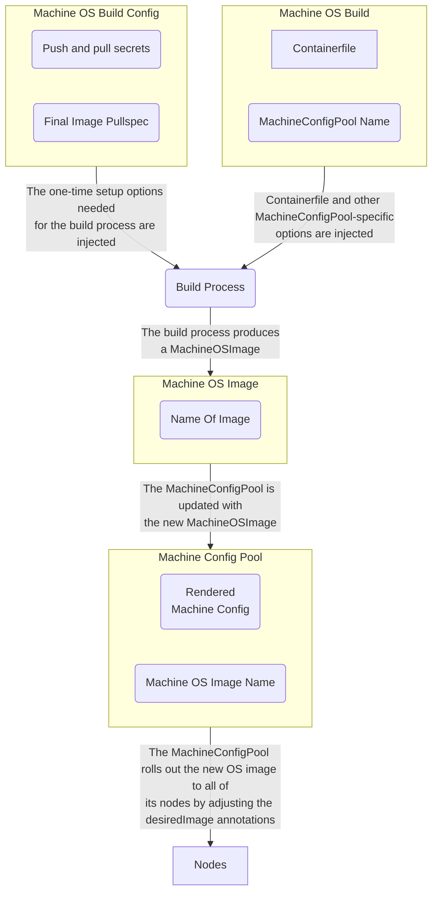
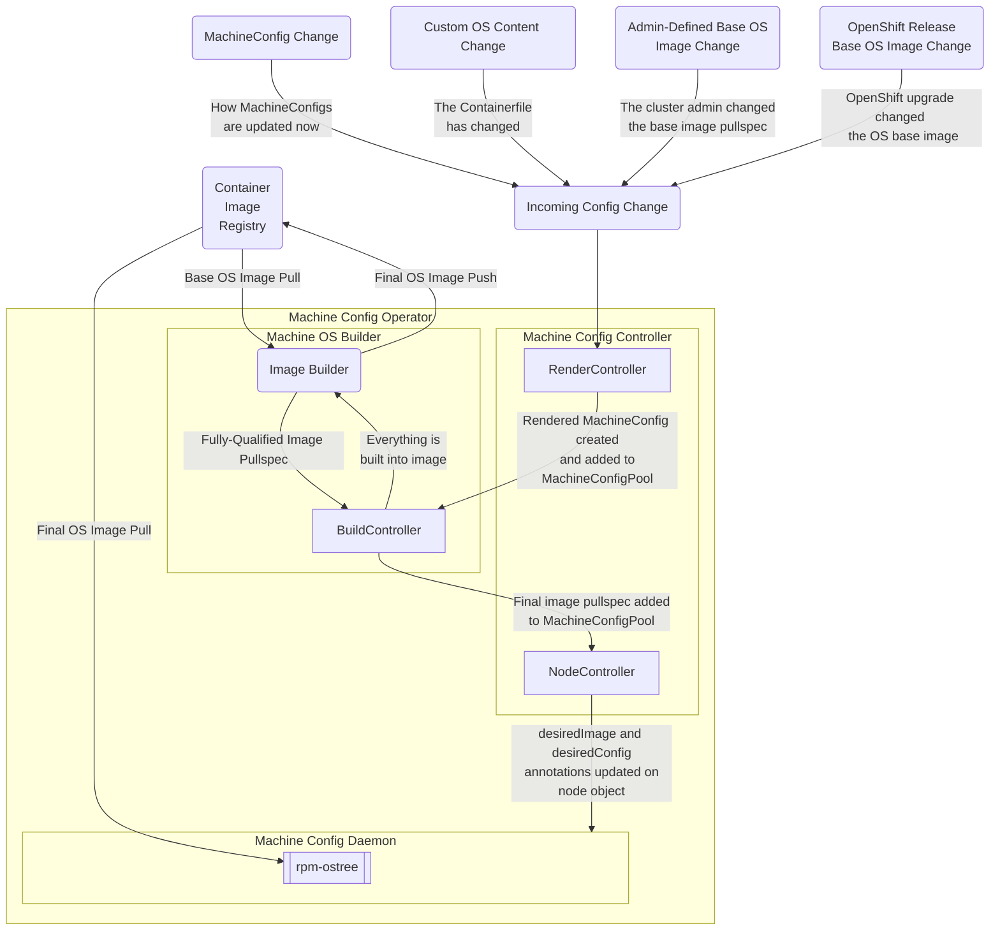
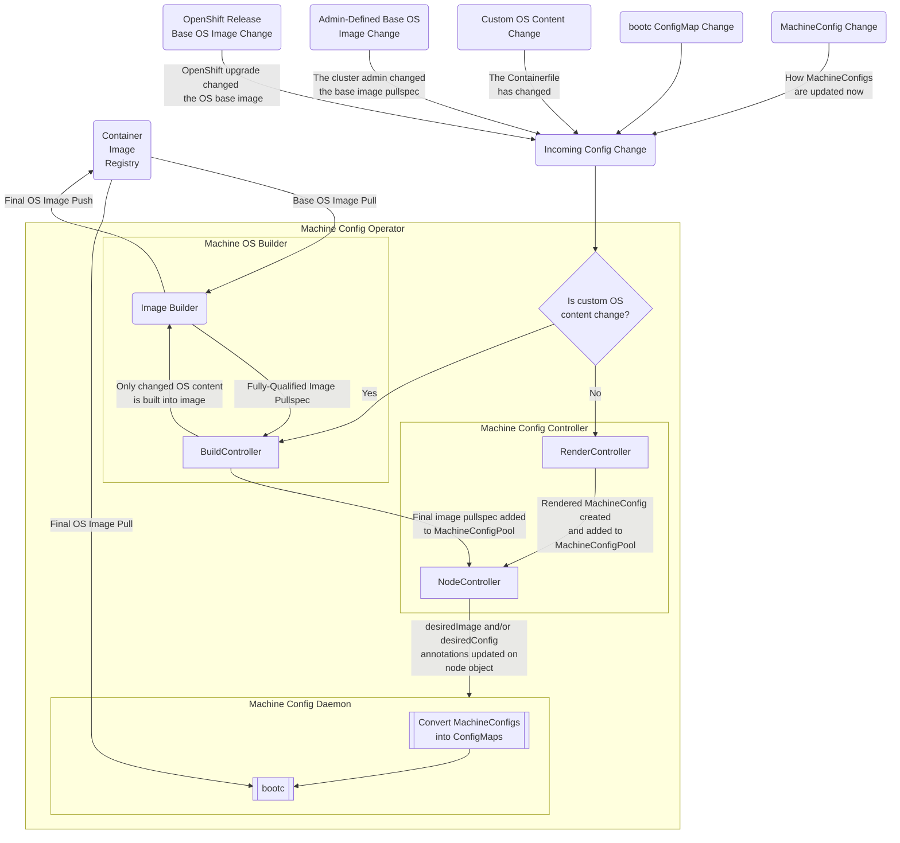
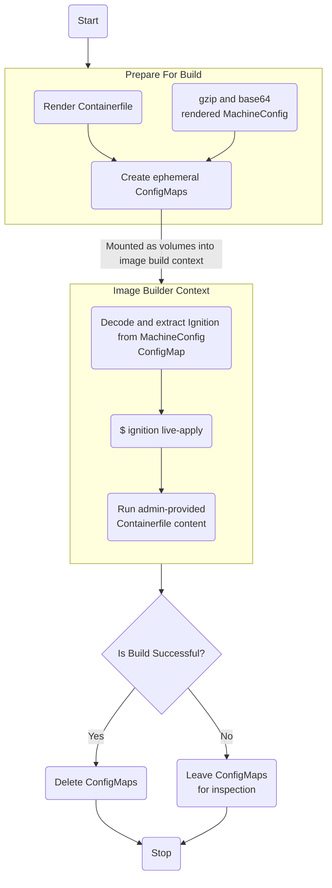
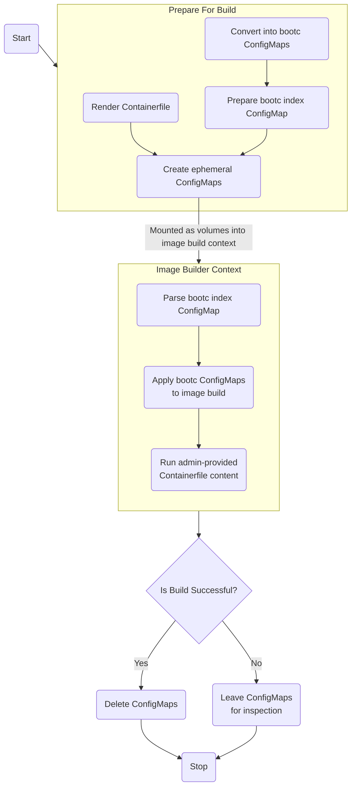

# On-Cluster Builds

## Summary

Change the Machine Config Operator (MCO) that is shipped in OpenShift to
perform an on-cluster build (OCB) to combine the base OS image shipped
with OpenShift, any admin-provided custom content, and the MachineConfig
content managed by the MCO. This image will then be deployed to all of
the cluster nodes using rpm-ostree (and later, bootc) to facilitate a
singular, transactional, update.

With image-based RHEL becoming a reality, on-cluster builds will need to evolve
to accommodate this new paradigm.

## Motivation

### User Stories

#### Device Drivers For Specialty Hardware

As an OpenShift cluster administrator, I want to install a device driver,
ideally on a Day 0 basis, to ensure that my cluster can use its underlying
hardware to the fullest potential right from installation time.

#### Software Agents To Ensure Compliance

As an OpenShift cluster administrator, I want to install an intrusion
detection system (IDS) agent so that workloads on my cluster are in
compliance with regulatory and oversight requirements for my industry.

#### Keep Custom OS Content Up-To-Date

As an OpenShift cluster administrator, I want my customized OS content
to be kept up-to-date with my current and future OpenShift releases
automatically.

#### More Control Over Config Change Deployments

As an OpenShift cluster administrator, I want to prepare my customized
OS content and configuration changes ahead of time so that I can reduce
or eliminate issues with deploying them.

#### Managed OpenShift Service Provider

As a Managed OpenShift SRE, I want to install cloud specific tooling to ensure
SRE can triage issues with all nodes involved in the lifecycle of a Managed
OpenShift cluster, including bootstrap, without requiring any reboot/pivot.

#### Managed OpenShift Service Consumer

As a Managed OpenShift service consumer, I want to know any changes to node
configuration can be tested and validated against a known set of criteria so I
know my nodes will not break support agreements with Managed OpenShift Service
Providers.

### Goals

- A cluster administrator will be able to install and upgrade any
  additional custom OS content required for their clusters’ operating
  system.

- Any custom OS content will be kept up-to-date throughout the lifecycle
  of a given OpenShift cluster. In other words, whenever the cluster is
  upgraded to a new OpenShift release, any custom OS content will be
  upgraded as well (subject to update availability).

- A cluster administrator will have the option to build and test their custom OS
  image ahead of time and defer its deployment.

- RHEL entitlements for custom OS content will be handled transparently
  though there may be the requirement of a one-time setup step to
  facilitate that.

### Non-Goals

- While we are enabling an OpenShift cluster admin to build a customized
  OS image for their setup, we are not intending to implement a
  general-purpose continuous integration (CI) system. That means there
  will be intentional feature gaps around secrets management, testing
  workflows, etc. If those features are required, it is recommended that
  a cluster administrator use an off-cluster image build mechanism
  instead.

- There are many interesting conversations happening around integrating
  image-based RHEL into OCP. A lot of these conversations have to do with
  defining or redefining what promises RHCOS makes with regard to OS
  immutability. While on-cluster builds must be aware of image-based RHEL
  with that eventuality in mind, figuring out future OS immutability
  capabilities is out-of-scope for this enhancement.

- There will be situations where the MCO will need to work around feature gaps
  in bootc. The MCO would not be alone since RHEL For Edge and RHIVOS are likely
  to face similar situations and friction. While these concerns exist,
  addressing them within the context of RHEL For Edge and RHIVOS is out-of-scope
  for this enhancement.

## Proposal

### Workflow Description

1.  The cluster administrator realizes that they need to add custom
    content to the OS on each of their cluster nodes.

2.  The cluster administrator edits the MachineConfigPool, adding a
    Containerfile, as well as the one-time setup of what image registry to push the
    final image to, the credentials needed to push to this registry, etc.

3.  The BuildController detects that these details are provided and
    begins a build.

4.  The built image is pushed to the cluster administrators’ image
    registry of choice.

5.  NodeController updates the `desiredImage` annotation on each node within its
    pool according to its rules such as maximum unavailable nodes, which nodes
    haven't been updated yet, etc.

6.  The MachineConfigDaemon drains the target node, applies the new OS
    content to the node, and reboots the node upon completion.

#### Variation and form factor considerations

##### Single-Node OpenShift (SNO)

Single-Node OpenShift (SNO) should not have any difficulty running the
on-cluster build process as-is. However, there may be some efficiency
improvements that can be made. For example, the final image could be written
directly to the nodes’ filesystem before the handoff to rpm-ostree / bootc to
avoid a registry roundtrip. These efficiency gains would be best handled as a
separate enhancement.

##### Hypershift

Hypershift on the other hand, would require distinct configurations for
both the host cluster and the guest cluster. Additionally, some
adaptations would be required to Hypershift in order to traverse the
host \<-\> guest cluster barrier. (need to page Hypershift MCO process
back in to have a more complete opinion around this).

##### Multi-Arch Clusters

Multiarch clusters have special considerations in terms of needing to
orchestrate more than one build for each target architecture as well as
manifestlisting the final image. This consideration also extends to the image
registry the final image will be pushed to. As of OpenShift 4.13, the on-cluster
image registry now supports manifestlisted images, as does ImageStreams.

##### Disconnected Environments

Clusters in disconnected environments will likely require special environment
configurations such as a local package mirror, local image registry, etc.
However, on-cluster builds should continue to work as-is in these environments.

##### FIPS-Enabled Environments

FIPS-enabled environments have special requirements around ensuring that any
cryptographic libraries used are certified. This may not impose any particular
operational or implementation requirements for on-cluster builds, but it does
require cluster admins to ensure that any custom OS content installed uses
FIPS-compliant cryptographic libraries.

### API Extensions

This is a very high-level overview of what the new API extensions are as well as their relationship
with each other and existing API extensions:



#### MachineOSBuildConfig

This is where the knobs that control the Machine OS Build process would live. Most of these would be provided during the one-time setup phase:

| **Field Name / Path (JSONPath):** | **Optional or Required:** | **Intended Use:**                                                                                                                                                                                                                                                                |
| --------------------------------- | ------------------------- | -------------------------------------------------------------------------------------------------------------------------------------------------------------------------------------------------------------------------------------------------------------------------------- |
| `.spec.baseImagePullSecretName`   | Required                  | The name of the Kubernetes secret that contains the necessary keys to pull the base OS image container for building. If this is absent, we can default to using the `global-pull-secret` (though we'll need to copy it into the MCO namespace so the build processes can use it. |
| `.spec.finalImagePushSecretName`  | Required                  | The name of the Kubernetes secret that contains the necessary keys to push the final OS image to the container registry.                                                                                                                                                         |
| `.spec.finalImagePullspec`        | Required                  | The final image pullspec for where to push the final OS image (e.g., `registry.com/org/repo:tag`). Note: Any user-supplied tags (such as `:latest` will not be honored.)                                                                                                         |
| `.spec.deployMode`                | Optional                  | Controls how the MachineConfigs should be combined with the custom OS contents. Possible options are: `image` and `bootc`. See Implementation Details for details. (Not sure what a sensible default should be).                                                                 |
| `.spec.imageBuilder`              | Optional                  | Which image builder backend to use. Options currently are: `openshiftImageBuilder` / `customPodBuilder`. Will default to `openshiftImageBuilder`, if available. Alternatively, will use `customPodBuilder`. Future backends may be enabled by changing this option.              |

#### MachineOSBuild

This represents the configs which perform a given OS image build. Ideally, there
is a 1:1 relationship between a MachineOSBuild and a MachineConfigPool. However,
one could have multiple MachineOSBuilds for a pool with the caveat that only one
(or none) of them are configured to immediately roll out the final OS image:

| **Field Name / Path (JSONPath):** | **Optional or Required:** | **Intended Use:**                                                                                                                                                                                                                                                                                                             |
| --------------------------------- | ------------------------- | ----------------------------------------------------------------------------------------------------------------------------------------------------------------------------------------------------------------------------------------------------------------------------------------------------------------------------- |
| `.spec.baseOSImagePullspec`       | Optional                  | Contains the base OS image pullspec. If missing, will be populated from the `machine-config-osimageurl` ConfigMap. Useful for pre-building images for upgrade cases.                                                                                                                                                          |
| `.spec.containerfile`             | Required                  | Contains the custom Containerfile lives.                                                                                                                                                                                                                                                                                      |
| `.spec.machineConfigPool`         | Required                  | Name of the MachineConfigPool to produce images for.                                                                                                                                                                                                                                                                          |
| `.spec.renderedMachineConfig`     | Optional                  | Name of the rendered MachineConfig to bake into the image. If provided, rebuilds will not occur whenever the MachineConfigPool config changes.                                                                                                                                                                                |
| `.spec.maxRetries`                | Optional                  | The maximum number of retries for a retriable build before a failure status is added. This will have a hard-coded default of 3 retries. See Retriable Builds section for more info on what this term means.                                                                                                                   |
| `.spec.rolloutMode`               | Optional                  | Controls whether the built OS image is immediately rolled out to the target MachineConfigPool. Options include `immediate`, `deferred`. `immediate` will roll the image out once the build process is completed. `deferred` will require a cluster admin to manually change the MachineOSImage name on the MachineConfigPool. |
| `.status.conditions[]`            | Required                  | Additional statuses will be added to indicate what state the build is in. Statuses will include: `BuildSuccess`, `BuildFailed`, `Building`, `BuildPending`.                                                                                                                                                                   |

MachineOSBuilds can also be augmented with the following annotations:

| **Annotation Name:**                             | **Description:**                                                                                                           |
| ------------------------------------------------ | -------------------------------------------------------------------------------------------------------------------------- |
| `machineconfiguration.openshift.io/rebuildImage` | When present, this will clear any failed image builds (and any supporting transitory objects created) and retry the build. |

#### MachineOSImage

This represents the final OS image that is produced by the build process. The
name of each MachineOSImage will be produced via a salted MD5 hash based upon
the contents of the rendered MachineConfig, the Containerfile contents, and the
base OS and extensions image pullspecs. It will look something like this:
`worker-os-b1946ac92492d2347c6235b4d2611184` or
`infra-os-2e090af63118fafdb117115a677ae060`. Additionally, this name will be
used as the image tag when the image is pushed to the container registry
(see Image Tagging section for additional details):

| **Field Name / Path (JSONPath):** | **Optional or Required:** | **Intended Use:**                                                                  |
| --------------------------------- | ------------------------- | ---------------------------------------------------------------------------------- |
| `.spec.pullspec`                  | Required                  | The fully-qualified digested image pullspec for the built OS image.                |
| `.spec.baseOSImagePullspec`       | Required                  | The fully-qualified digested image pullspec that this OS image was built with.     |
| `.spec.renderedMachineConfig`     | Required                  | The name of the rendered MachineConfig built into this image (if one is built in). |
| `.spec.machineConfigPool`         | Required                  | The name of the MachineConfigPool this MachineOSImage was built for.               |

#### Nodes (corev1.Node)

The following annotations will be added to each node object to indicate
the current and desired image states:

| **Annotation Name:**                             | **Description:**                                                                       |
| ------------------------------------------------ | -------------------------------------------------------------------------------------- |
| `machineconfiguration.openshift.io/currentImage` | The fully-qualified image pullspec for the currently-booted OS image for a given node. |
| `machineconfiguration.openshift.io/desiredImage` | The fully-qualified image pullspec for the desired OS image for a given node.          |


#### MachineConfigPools

The MachineConfigPool CRD will be extended thusly:

| **Field Name / Path (JSONPath):** | **Optional or Required:** | **Intended Use:**                                                                                                                                                                                                |
| --------------------------------- | ------------------------- | ---------------------------------------------------------------------------------------------------------------------------------------------------------------------------------------------------------------- |
| `.spec.machineOSImage`            | Required                  | The name of the MachineOSImage that the pool should be running. Changing this will roll out a new MachineOSImage to all of the nodes in the MachineConfigPool.                                                   |
| `.spec.deployMode`                | Optional                  | Controls how the MachineConfigs should be combined with the custom OS contents. Possible options are: `image` and `bootc`. See Implementation Details for details. (Not sure what a sensible default should be). |
| `.status.osImagePullspec`         | Required                  | The OS image pullspec that is rolled out to all of the nodes.                                                                                                                                                    |

#### ConfigMaps (corev1.ConfigMap)

Absent a more complete specification for bootc’s ConfigMap support,
let’s assume for the sake of this enhancement that bootc will respect
the annotations identified here for the ConfigMaps it consumes.

Note: These annotations are passed onto bootc. It is currently unknown whether
bootc may support a more fully-fledged CRD for its operations.

| **Annotation Name:**                                  | **Description:**                                                                                                                                                                                                                                                                                              |
| ----------------------------------------------------- | ------------------------------------------------------------------------------------------------------------------------------------------------------------------------------------------------------------------------------------------------------------------------------------------------------------- |
| `bootc.coreos.io/configMap`                           | Identifies this ConfigMap as being one that bootc can understand. This could enable cluster admins to create ConfigMaps in the MCO namespace in the future to be directly consumed by bootc. Alternatively, the MCO could detect the presence of the annotations below this.                                  |
| `bootc.coreos.io/baseDir`                             | The base directory where each file in the ConfigMap will be created, e.g. /etc. This is required because the ConfigMap spec does not allow slashes in the name portion of the files it creates.                                                                                                               |
| `bootc.coreos.io/baseDirMode`                         | The octal file mode (`0755`, `0644`, etc.) that the deepest directory in the path should have. Given `/etc/a/deeply/nested/base`, this would affect the `./base` portion of the directory mode.                                                                                                               |
| `bootc.coreos.io/fileMode`                            | The octal file mode that each file in the ConfigMap should be created with (e.g., `0755`, `0644`, etc.). Additional file modes such as sticky bit, executable, et. al. should be supported. If multiple files within the same directory need to have different modes, more than one ConfigMap will be needed. |
| `bootc.coreos.io/userOwner`                           | The username or UID of the file's owner.                                                                                                                                                                                                                                                                      |
| `bootc.coreos.io/groupOwner`                          | The group name or GID of the file's owner.                                                                                                                                                                                                                                                                    |
| `bootc.coreos.io/precedence`                          | This will control which file should "win" when multiple ConfigMaps containing the same file name are applied. Default or implied precedence should be 0 with the highest precedence determining the "win". This will also apply to the baseDir, baseDirMode, and fileMode annotations.                        |
| `machineconfiguration.openshift.io/machineConfigPool` | The name of the MachineConfigPool to deploy the ConfigMap to.                                                                                                                                                                                                                                                 |
| `machineconfiguration.openshift.io/machineConfigNode` | The name of the MachineConfigNode to deploy the ConfigMap to.                                                                                                                                                                                                                                                 |

The intent behind this is to allow cluster admins to create ConfigMaps within
the MCO namespace that the MCO could then hand directly off to bootc to allow
for a more natural way of managing OS node configs. This is intended to
supplement MachineConfigs, not replace them.

### Implementation Details

#### Sensible Defaults

A cluster admin should be able to just use this functionality with as little
friction as possible. Given that internal image registries will become optional,
it feels like there is a tension here because an internal image registry could
provide a sensible way for this to work seamlessly. However, where that is the
case, one can configure their cluster to use an external image registry. For
situations where that is desirable, we should provide that capability as a Day 1
configuration option (see: OpenShift Installer section for implementation
details).

#### Operational Modes

I foresee there being two main operational modes:

##### Image-Based Updates

MachineConfigs are baked into the image using Ignition live-apply or another
equivalent mechanism. Every attempt will be made to ensure that the
MachineConfigs are as fully baked into the image as feasible given [<u>ostree’s
rules</u>](https://ostreedev.github.io/ostree/adapting-existing/#system-layout).
Where / when infeasible, bootc’s ConfigMap capability could be used. This is
what was originally envisioned in the CoreOS layering enhancement.



This is how on-cluster builds works today in Dev Preview form. The downside of
this mode is that for the most part, one would need to perform an on-cluster
build every time a MachineConfig change occurs, modulo the subset of configs
that are managed by bootc.

##### Custom OS Content Only

MachineConfigs are applied completely via the ConfigMap mechanism in bootc. Only
custom OS content is supplied via the OS image. This would only require an
on-cluster build to be performed in the event that the custom OS content were to
change either through an OpenShift upgrade or as the result of a cluster admins'
actions.



With both modes of operation, there will be certain configurations which
change more frequently than others either in response to other OpenShift
operators (such as the Node Tuning Operator) or due to internal cluster
operations (certificate rotations, global pull secret changes, etc.).
These configurations should be only set up using bootc’s ConfigMap
capability since they can be easier to manage via this path.

The tension between these two modes is very similar (if not the same) to the
container vs. configs paradigm. In other words, if one containerizes their
application, should they include all of the configs within the application
container? Or should they instead configure their application via ConfigMaps and
/ or Secrets which are injected at runtime?

#### NodeController

The NodeController will be modified to watch the MachineConfigPool for
the current container image spec. Whenever a new container image is
available, it will update the `desiredImage` annotation on each node in
the given pool, according to its current rules for deploying
MachineConfigs.

#### BuildController

A new MCO component called BuildController will manage the lifecycle of image
builds for custom OS content. It listens for changes to the MachineConfigPool
and responds by starting a build whenever needed.

To handle multi-arch cases, it will need to schedule more than one build for
each architecture present within the cluster, doing each build natively on the
target architectures. In other words, if one has both ARM64 and AMD64 worker
nodes, a build will be scheduled on both an ARM64 node as well as an AMD64 node.
Doing this allows us to execute the builds with as few permissions as possible.

BuildController should be as modular as possible with how it performs the build
to allow it to efficiently operate in as many different environments as
possible. For example, if the OpenShift Image Builds (BuildsV1) facility is
present, it could leverage that functionality directly. In absence of that
facility, it could create its own custom build pod where it uses Buildah to
perform the builds.

As a caveat, BuildsV1 does not support manifestlisted images, so there will need
to be a process to create a manifestlist with these images. This is primarily a
concern for multiarch clusters, but having it present for non-multiarch clusters
would incur very little overhead.

Once the image build is complete, the image is pushed to the image
registry configured by the cluster administrator where it will be pulled
from by each node. While it would make a lot of sense to use the
clusters’ internal image registry by default, this will become an
optional component in the future so we cannot depend on it being there.
However, we could detect its presence and use it automatically for
installations where it is indeed present.

#### Image Builder Inputs

Regardless of the image builder backend that is chosen, the same inputs should
be used. This means that the Containerfile will need to be prepared ahead of time.
Initially, we could use a templatized Containerfile that has all of the necessary
bits injected into it. Eventually, it would be advantageous for us to use a
higher-level abstraction for creating this Containerfile, especially as we consider
OS extensions, kernel args, and the like.

There will also be the need for the contents of this generated Containerfile to be
merged with the admin-provided Containerfile as well. For Image-Based Config
Updates (as described above), this process would be crucial. Doing so would
likely require us to have certain image stages that a cluster admin can refer to
as they write their Containerfile. For example, `FROM os-base-image` or `FROM
os-base-image-with-configs`. OpenShift Image Builder can easily substitute those
targets for the real image pullspec (if it exists), whereas the custom pod
builder will need a way to do that on its own. Injecting the Containerfile into the
image builder process can be easily accomplished via a ConfigMap.

For Image-Based Updates, we'll also need to figure out how to inject both the
Containerfile and MachineConfig content into the image builder context for both
image builders. A fairly simple solution is creating an ephemeral ConfigMap for
the lifetime of the image build process. For MachineConfigs, this gets a bit
more complicated since a rendered MachineConfig can be rather large, especially
if a cluster admin has a lot of customized config files and ConfigMaps have a 1
MB size limit. Hypershift partially mitigated this problem by gzipping and
base64-encoding the rendered MachineConfig before storing it in a ConfigMap. An
early version of BuildController mirrors this strategy. Within the build
context, this ConfigMap is gunzipped and base64-decoded before being fed to
Ignition live-apply.

This currently looks like this:



Once the bootc ConfigMap annotation standards are better known, we could
potentially skip the gzip / base64-encoding step by converting MachineConfigs
into multiple ConfigMaps, temporarily storing them in the API server, injecting
them into the build context, then deleting them once the build is complete.

Within the build context itself, we'd need a different mechanism than Ignition
live-apply to consume those ConfigMaps and inject their contents into the
appropriate places within the image being built. Additionally, one of the big
ideas around the bootc ConfigMap spec is using annotations to indicate what
directory to store the files in, what file modes they should have, etc. This
data would be unavailable via a volume mount. So it may be necessary to create a
map of ConfigMap name -> bootc annotations and store this in an additional
ConfigMap. This would also necessitate the need for a binary such as Ignition
live-apply to consume this information from within the build context to write
those files into the appropriate places.

This could look like this instead:



In terms of the ConfigMaps, they would look something like this:
```yaml
---
apiVersion: v1
kind: ConfigMap
metadata:
  name: etc-hello-world
  annotations:
    bootc.coreos.io/baseDir: /etc
data:
  hello-world: "hello world"
---
apiVersion: v1
kind: ConfigMap
metadata:
  name: etc-ohai
  annotations:
    bootc.coreos.io/baseDir: /etc
data:
  ohai: "O Hai!"
---
apiVersion: v1
kind: ConfigMap
metadata:
  name: authorized-ssh-keys
  annotations:
    bootc.coreos.io/baseDir: /home/core/.ssh
    bootc.coreos.io/fileMode: "0600"
    bootc.coreos.io/baseDirMode: "0600"
    bootc.coreos.io/userOwner: "core"
    bootc.coreos.io/groupOwner: "core"
data:
  authorized_keys: |
    ssh-key 1
    ssh-key 2
---
apiVersion: v1
kind: ConfigMap
metadata:
  name: index-config-map
data:
  etc-hello-world: | 
    {
      bootc.coreos.io/baseDir: "/etc"
    }
  etc-ohai: | 
    {
      bootc.coreos.io/baseDir: "/etc"
    }
  authorized-ssh-keys: |
    {
      bootc.coreos.io/baseDir: "/home/core/.ssh/authorized_keys"
      bootc.coreos.io/fileMode: "0600"
      bootc.coreos.io/baseDirMode: "0600"
      bootc.coreos.io/userOwner: "core"
      bootc.coreos.io/groupOwner: "core"
    }
```

To be clear, these ConfigMaps would be created and managed by the
BuildController process. A cluster admin would never be expected to create or
maintain these. This may also not be required if we were to adopt the [Custom OS
Content Only](#####Custom-OS-Content-Only) idea.

#### Custom Build Pods

For cases where an OpenShift cluster is missing the OpenShift Image
Builder capability, there will be the need to create and manage a build
pod to run either Podman or Buildah. This has a few operational concerns
that should be mentioned:

- At the time of this writing, OpenShift Image Builder requires
  privileged pods to perform its builds. Ideally, the custom build pod
  solution should not have this requirement. Early experimentation
  showed that Buildah can be used with a service account with the `anyuid`
  ClusterRoleBinding applied without requiring elevated privileges. This
  was done with an off-the-shelf Buildah image
  (`quay.io/buildah/stable:latest`).

- One of the promises that OpenShift makes is that all of the software
  that is included in a given OpenShift release is tested to work
  together, with no version change until an OpenShift upgrade is
  performed. This same promise should extend to the image builder. In
  terms of implementation details, the easiest would be to use the base
  OS image which already contains Podman. However, experimentation with
  making this work without elevated privileges proved to be very
  difficult.

- For multiarch cases, we should schedule build pods on each
  architecture within a given cluster. This reduces the need for
  elevated privileges and would also make the build process a bit faster
  since the build is occurring natively as opposed to being emulated via QEMU.

#### Retriable Builds

Whenever a build fails, it is advantageous to inspect the failed build
in order to determine what the failure mode was. Certain failure modes
should be automatically retried without cluster admin intervention (up
to a configurable retry limit). For example, if a build pod gets evicted
from a node because it was an AWS Spot Instance that is about to be
reclaimed, BuildController should automatically retry the build since
this is a recoverable error. In fact, OpenShift Image Builder has
[<u>first-class
support</u>](https://github.com/openshift/api/blob/24085c95a7a28e9e8af2a14b2ba04b0a52398195/build/v1/consts.go#L164)
for this. For the custom pod builder mechanism described above, we’ll
need to infer this somehow.

However, when the build failure was due to something within the cluster admins
control (e.g., syntax errors, path issues, etc.), we should set the failure mode
immediately without attempting a retry since the build would fail again until
the cluster admin takes action.

#### Image Tagging

While images built on-cluster will be applied to nodes using their
fully-qualified pullspec (e.g., `registry.host.com/org/repo@sha256:...`),
tagging these images before pushing to the image registry would be
beneficial to cluster administrators since it would allow them to
quickly and easily identify what images live in what image registry.

The first-pass implementation of on-cluster builds simply tagged each
image with the name of the MachineConfig that was used to produce it.
For example,
`registry.host.com/org/repo:rendered-worker-abcdef1234567890`). However,
for situations where the custom OS content is changed, we should aim to
somehow work that into the tag name as well. The tagging convention
could be something like this:

`<machineconfig name>-<sha256 or md5 of merged Containerfile content>`

For cases where no custom OS content is provided, one could simply use
the name of the MachineConfig instead (assuming that one is baking the
MachineConfig content into the image and not using ConfigMaps).

The intent behind this is to skip performing an on-cluster build unless
it is necessary. For example, if someone deploys Containerfile A, then
changes to Containerfile B, then changes back to Containerfile A, we should
skip rebuilding the image for Containerfile A unless the base image
changes. This would allow the BuildController to query the image
registry to determine if we already have an image that matches the
desired content. And if that’s the case, the BuildController could
effectively skip the build and update the finalImagePullspec field with
the fully-qualified digested pullspec for the final image.

Unknown: Does the image registry API spec allow one to query based upon image
labels? If so, this tagging convention would be solely for the cluster-admins'
benefit, since both the Containerfile hash and the name of the rendered
MachineConfig that produced it could be embedded as an image label.

#### MachineConfigDaemon

Modifications to the MachineConfigDaemon will be required to allow it to
apply the new base OS image as well as convert the MachineConfigs into
ConfigMaps and update bootc / rpm-ostree. Initially, there are some
immediate concerns that we’ll need to work around, such as the Ignition
spec allowing SSH key updates which breaks some of [<u>ostree’s
rules</u>](https://ostreedev.github.io/ostree/adapting-existing/#system-layout).
However, as bootc gains momentum, it is expected that what the MCD is
responsible for will be dramatically reduced.

There will be situations where the MCD must address a functionality gap between
bootc / rpm-ostree. It should be noted that these gaps would also likely exist
in RHEL For Edge, RHIVOS, et. al. This could result in the creation of a common
library or solution for managing those gaps across RHCOS, RHEL For Edge, and
RHIVOS until the functionality gaps in bootc / rpm-ostree are no longer present.
However, the creation and maintenance of this shared library is beyond the scope
of this enhancement. 

#### MachineConfigServer

For posterity, the role that the MachineConfigServer plays is that it allows new
cluster nodes to apply the current MachineConfigs so that they can join the
cluster once they've been configured by Ignition at boot-time.

With bootc / rpm-ostree, this will change significantly. We'll need a way to
supply new cluster nodes with the necessary pull credentials and a pullspec to
pull the image. 

#### OpenShift Installer (openshift-install)

There are two situations that should be considered for Day 1 operations
that would be best addressed by changes to the InstallConfig schema:

The first situation is image registry configuration for OpenShift
installations without an internal image registry. We should add
additional fields to the InstallConfig schema that allows cluster admins
to specify the image registry to use and the push and pull secrets to
use with it. While these could also be added as a Day 2 operation, I
think it makes more sense to do it as a Day 1 operation here since one
would theoretically know whether their OpenShift cluster will have an
internal image registry.

The second situation addresses use-cases where one wants to have custom
OS content on a Day 1 basis. With that in mind, we can modify the
InstallConfig schema to permit a Containerfile to be provided on a per-pool
basis. Where this would get a bit tricky is for multiarch clusters,
however the current approach there is that bringing up a worker pool
with a different architecture is currently a Day 2 operation. If / when
that becomes a Day 1 operation, we’ll need to reconsider how this works.

#### OpenShift CLI (oc)

The oc command could gain the ability to export the MachineConfigs for a
given MachineConfigPool as well as the bootc-native ConfigMaps that
belong to it. Additionally, the oc command could provide a Podman
incantation or Kube Pod Spec to ease the process of debugging the final
container image and its configuration. It could look like this:

`$ oc machineconfig export worker -o yaml`

Or:

`$ oc machineconfig export worker -o podman`

Additionally, the oc command could gain additional abilities for cluster
admins to control their on-cluster builds and the config / image rollout
process:

`$ oc machineconfig build worker`

Or:

`$ oc machineconfig rollout worker`

Under the hood, this would make use of the annotations described in the
MachineConfigPool API changes section to cause these actions to take
place.

#### OpenShift Upgrades

The way that OpenShift upgrades currently work with the Machine Config Operator
is that the upgrade process sets `osImageURL` on each MachineConfigPool to point
to the new OS image from the OpenShift release. The upgrade process also updates
the `baseOSContainerImage` and `baseOSExtensionsContainerImage` keys in the
`machine-config-osimageurl` ConfigMap in the MCO namespace. When the MCO detects
the MachineConfig changes, it rolls out the new MachineConfig to each of the
pools.

Preliminary testing with on-cluster builds shows that the upgrade process was
not unduly hampeered by performing an OS image build during the process.
However, it is acknowledged that these tests primarily targeted the happy path.
There are situations where the on-cluster build will fail. For example, if a
cluster admin's custom Containerfile is dynamically inferring the OS version from
the `/etc/os-release` file to ensure they set up the correct RPM repository
path, this could break when the OS version changes. Another case to consider is
whenever a cluster admin has overridden their `osImageURL` value with a
custom-built image produced by an off-cluster build system; though this scenario
is not solely an upgrade concern.

For this reason, we should consider a way to allow a cluster admin to perform
pre-upgrade checks such as performing a trial build before committing to the
upgrade process. This way, they can adjust their custom Containerfile content and
pre-build the images prior to beginning the upgrade process.

In addition to this, a cluster admin in a cloud environment should be able to
bring up an ephemeral test node with the latest OS on it, verify that it can
connect to the Kube API server, receive workloads, etc. For bare-metal cases, a
cluster admin could temporarily repurpose one of their worker nodes for this
purpose. We could eventually provide some automation around this process.

These checks could also be applicable to general config rollouts as a form of
preflight check.

### Risks and Mitigations

What are the risks of this proposal and how do we mitigate. Think
broadly. For example, consider both security and how this will impact
the larger OKD ecosystem.

How will security be reviewed and by whom?

- For the custom pod builder, a review by someone who is knowledgeable
  about container builders, RBAC, and SELinux would be helpful to ensure
  that we can enable this behavior while avoiding the need for elevated
  permissions / privileges.

How will UX be reviewed and by whom?

- TBD.

### Drawbacks

TBD.

## Design Details

### Open Questions

- Since bootc can ultimately use ConfigMaps, does it make sense to
  expose that functionality directly to cluster administrators by
  allowing them to create / modify / delete ConfigMaps in the MCO
  namespace to update their node configs? We could use a specific label
  or annotation to signal to the MCO that it should consider these
  ConfigMaps as it prepares the rendered MachineConfig.

- What annotations will bootc support for ConfigMaps?

- Will bootc be able to inject ConfigMap contents anywhere on a nodes’
  filesystem, including a users’ home directory?

- Will bootc ConfigMap changes require a reboot to take effect?
  Specifically, when bootc is commanded to update contents on the
  filesystem, will a reboot be required for the content update to occur?

- Will bootc eventually support other CRDs such as MachineConfigs? Or will bootc
  only support ConfigMaps for the foreseeable future?

- How immutable will RHCOS end up being? Do we wish to enable more
  immutability? Should a cluster administrator make that determination?
  Can that adjustment be a Day 2 operation? Would it be desirable to
  have the RHIVOS-like feature of using overlayfs so that any changes
  disappear after a reboot? (see
  [<u>demo</u>](https://drive.google.com/file/d/1RwjxidqnZs6sraEgHjWge6-2msoll1BK/view)
  for an example).

- How will the relationship with the `osImageURL` field on MachineConfigs
  change with this new paradigm? Could a cluster admin theoretically use
  the `.spec.customContent.baseImagePullspec` field to achieve the same
  functionality? Could the `osImageURL` field be removed from
  MachineConfigs?

- One of the original intentions behind CoreOS layering and on-cluster
  builds was to be able to layer config changes on top of the base OS
  and apply that as a single OCI container image using rpm-ostree. With
  bootc supporting ConfigMaps, does performing an on-cluster build for
  every MachineConfig change still make sense? Or does it only make
  sense whenever a cluster admin wishes to include custom OS content? I
  can see that we may need to support the original implementation idea
  (perform an on-cluster build for each MachineConfig change) until
  image-based RHEL ships with OCP. But once that happens, does it make
  sense to evolve on-cluster builds to only perform a build whenever
  custom OS content is required or the base OS changes?

- How will the OpenShift upgrade flow change here? Whenever the base
  image is changed via an OpenShift upgrade, the OS images will need to
  be rebuilt. When in the process should this occur? Early in the
  upgrade process or later? Should a failed build halt the upgrade
  process? Is there a way to halt that process, alert the cluster admin
  about the failure, have them address the failure, then retry the
  cluster upgrade process?

- Hypershifts’ MCO process works a bit differently. What adaptations
  will we need to make in order for on-cluster builds to work on
  Hypershift guest clusters? I presume that the host cluster path should
  work as-is without too much difficulty.

- What is needed for RHEL entitlements to work?

### Test Plan

- The on-cluster builds portion of the MCO will have its own e2e testing
  target within the MCO’s CI configs. These aim to test the on-cluster
  builds portion of the MCO in relative isolation compared to the rest
  of the MCO and the cluster.

- Given that on-cluster builds will have some intersection with the
  cluster upgrade process, it will be necessary to have a more
  comprehensive test that performs an upgrade on a cluster that is
  configured to use on-cluster builds.

- Should on-cluster builds be available as a Day 1 config, it will be
  necessary to have a test that installs an OpenShift cluster with these
  Day 1 configurations in place.

- We should also have disconnected, multiarch, Hypershift, and SNO
  variant testing as well since each of those variants present distinct
  concerns.

- We’ll also need some form of testing with both an in-cluster container
  registry as well as an out-of-cluster container registry. While it
  might be possible to use the ImageStream provided by the CI system
  namespace as an out-ot-cluster registry, my concern is that it might
  not work for multiarch cases due to the need for manifestlisting.
  However, this could be worked around with a namespace in Quay.io
  exclusively for CI use-cases.

### Graduation Criteria

TBD.

#### Dev Preview -> Tech Preview

TBD.

#### Tech Preview -> GA

TBD.

#### Removing a deprecated feature

TBD.

### Upgrade / Downgrade Strategy

TBD.

### Version Skew Strategy

TBD.

### Operational Aspects of API Extensions

- The suggested annotations for the `corev1.Node` and `corev1.ConfigMap`
  objects should have no discernible effect on the operational aspects.
  However, supporting direct ConfigMaps will cause a change in storage
  requirements. Instead of requiring that MachineConfigs be the
  containing object, ConfigMaps will take that place.

- The extensions for the MachineConfigPool CRDs will increase storage
  requirements slightly with the addition of Containerfiles. This would
  also cause a negligible increase in how frequently MachineConfigPools
  are updated by the cluster admin as well as the BuildController
  machinery. However, no major impact is anticipated at this time.

#### Failure Modes

- The failure modes for the suggested annotations for corev1.Node
  objects will be the same as the preexisting desiredConfig /
  currentConfig annotations. In other words, if they are not present,
  the MCD will not be able to apply config changes to the nodes of a
  given pool. This would lead to the eventual operator degradation and
  potential component inconsistency if an OpenShift upgrade is in
  progress.

- Assuming that the on-cluster build mechanism were to fail, the blast
  radius would be similar to that of the Machine Config Operator
  failing. One would be unable to do the following:

  - Update their custom OS content.

  - Upgrade their clusters.

- An escalation would likely involve the MCO team and well as the CoreOS
  team.

#### Support Procedures

TBD.

## Implementation History

Major milestones in the life cycle of a proposal should be tracked in
Implementation History.

## Alternatives

TBD.

## Infrastructure Needed \[optional\]

TBD.
