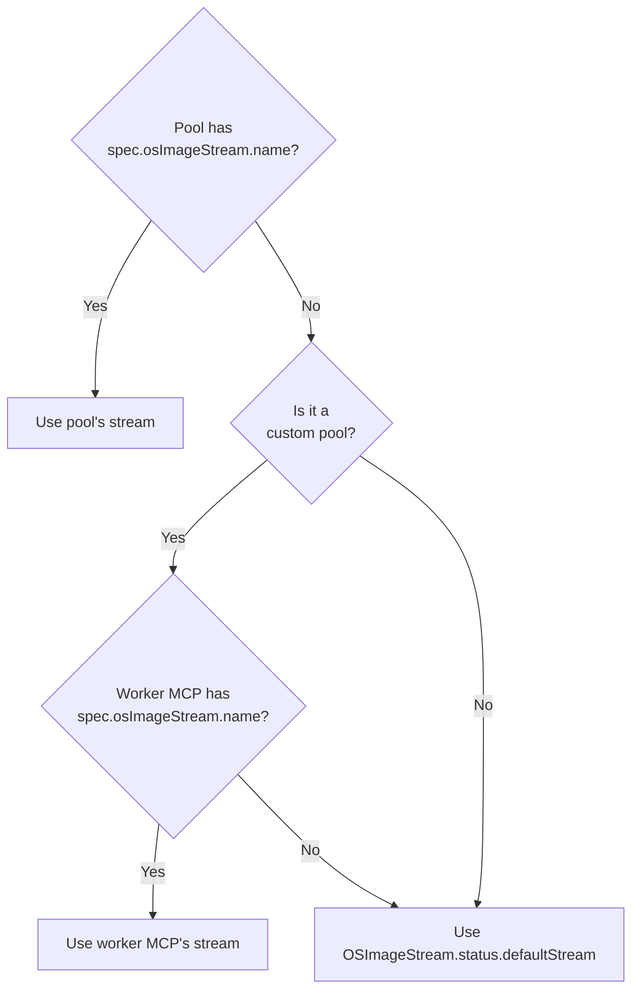

# MachineConfig OS Images Streams

## Summary

This enhancement allows administrators to run different OS image variants 
within the same cluster by assigning them through a simple "stream" 
identifier.

The cluster exposes which OS streams are available and which one is the 
default. Administrators can then override the default on a per-pool basis, 
enabling use cases such as testing a new major OS version (like RHEL 10) 
on a subset of nodes or deploying specialized images, without affecting 
the rest of the cluster.

## Motivation

This feature provides administrators with a simple, managed way to 
change the OS deployed on cluster nodes without having to manually set 
the `osImageURL` on each MachineConfigPool individually.

It is especially designed for major OS upgrade scenarios, making it 
straightforward for administrators to migrate pools to a newer OS 
version. This improves the user experience compared to previous major 
upgrades, where the node OS upgrade was tightly coupled with the OCP 
upgrade itself. With OS Image Streams, administrators can decide when 
to transition each pool to a new OS version independently from the 
platform upgrade.

### User Stories

* As a cluster administrator, I want to upgrade my cluster to a new OCP 
  version that ships with a newer major CoreOS version, but I do not want 
  to upgrade the node OS yet. The feature guarantees that the OS Image 
  Stream in use by each pool is preserved unless it is explicitly changed 
  — either by setting it on the MachineConfigPool or by updating the 
  cluster-wide default.
* As a cluster administrator, I want to test the compatibility of a new 
  major CoreOS version with my workloads before rolling it out across 
  the cluster. This feature allows setting the OS Image Stream on a 
  per-pool basis, so I can assign a custom MachineConfigPool with a 
  subset of test nodes to the new stream and validate my workloads 
  before migrating the rest of the cluster.
* As a cluster administrator, I want to deploy a new cluster using a 
  CoreOS version that is not the default for the OCP release. I can 
  specify the desired OS Image Stream in the `install-config.yaml` so 
  that the cluster is provisioned with the chosen version from the 
  start.

### Goals

#### Phase 1: RHEL 9 to RHEL 10 Transition

- Support dual RHCOS 9 and RHCOS 10 OS Image Streams (`rhel-9` and `rhel-10`)
- Enable per-pool OS Image Stream selection and gradual migration
- One-directional migration only (RHEL 9 -> 10). Downgrade (RHEL 10 -> 9) is 
  technically possible at the MCO level but is not officially supported 
  as it is not covered by testing
- Backward compatibility: pools without explicit OS Image Stream 
  selection default to `rhel-9` and maintain current OS version during 
  platform upgrades
- Day-zero RHEL 10 deployments

#### Future Phases (Out of Scope for Initial Release)

- Additional OS Image Stream variants (minimal OS images, hardened 
  variants, etc.) - the architecture supports multiple streams, but 
  only 2 will be shipped initially
- Officially supported bidirectional OS Image Stream switching 
  (RHEL 10 -> 9 downgrade)
- HCP/Hypershift architecture support
- Image Mode architecture support

### Non-Goals

- Automated migration orchestration

## Proposal

### Workflow Description

**Cluster administrator** is a human user responsible for managing the
cluster and its node pools.

1. During installation, the administrator can optionally set the desired
   OS Image Stream in `install-config.yaml`. If omitted, the installer
   selects the default based on the cluster version and feature gate
   status.
2. After installation, the administrator inspects the available streams
   and the current default via the `OSImageStream` singleton
   (`oc get osimagestream cluster -o yaml`).
3. To migrate a specific pool to a different stream, the administrator
   sets `spec.osImageStream.name` on the target MachineConfigPool.
4. To change the cluster-wide default, the administrator updates
   `spec.defaultStream` on the `OSImageStream` singleton. All pools
   without an explicit override adopt the new default.
5. The MCO detects the change, renders new MachineConfigs with the
   images from the selected stream, and rolls them out to the affected
   nodes.
6. The administrator monitors progress through
   `oc get machineconfigpool` and verifies the result via
   `status.osImageStream.name` on each pool.

To implement this enhancement, changes are required in the release payload 
image, the MachineConfigPool reconciliation logic, the new OSImageStream 
CR, and the installer and upgrade flows. The following sections describe 
each area in detail.

### Replacing the machine-config-osimageurl ConfigMap

Prior to this feature, the OS and extensions images were stored in the 
`machine-config-osimageurl` ConfigMap, which was designed to hold a 
single set of CoreOS images. This feature replaces that ConfigMap and 
its associated logic with the OSImageStream singleton, which can 
accommodate multiple OS versions and their associated images. This is 
the medium-term goal; however, the ConfigMap is still used by Hypershift 
and will not be removed along with its associated logic until all its 
consumers have been migrated.

### Release Payload Image

CoreOS images in the release payload now carry new labels that allow the 
MCO to identify which stream each image belongs to and what role it plays:

- `io.openshift.os.streamclass`: Present on all CoreOS images (both OS 
  and extensions). Contains the stream name the image belongs to (e.g., 
  `rhel-9`).
- `containers.bootc`: Already present on OS images. When set to `true` 
  or `1`, the image is identified as an OS image.
- `io.openshift.os.extensions`: Added to extension images to indicate 
  that the image is an OS extensions image.

The MCO uses these labels to discover available streams and their 
associated images. Any stream that does not have both an OS image and 
an extensions image is discarded.

The release payload image build process uses `oc adm release` under the 
hood, which needs to be modified to support more than one set of OS 
images. Once that is in place, including a new stream in the payload 
only requires the operator (the MCO in this case) to reference it in its 
[image-references](https://github.com/openshift/machine-config-operator/blob/master/manifests/image-references) 
file. This is currently necessary because `oc adm release` strips any 
unreferenced images from the payload. In the future, this restriction 
may be lifted so that new streams can be included without explicitly 
modifying the image-references file.

### MCO Stream Discovery

The MCO is responsible for reading the release payload ImageStream and 
discovering which images correspond to OS streams. To avoid introspecting 
every image in the payload — which would be prohibitively slow — a 
pre-filtering step is applied based on the ImageStream tag metadata:

- The tag must have the annotation `io.openshift.build.source-location` 
  set to `github.com/openshift/os`.
- The tag name must match a pattern indicating it is an OS or extensions 
  image (e.g., `rhel-*`, `stream-*`, or their extensions counterparts 
  ending in `*-extensions`).

Only the images that pass this pre-filter are inspected further. The MCO 
reads the image labels described in 
[Release Payload Image](#release-payload-image) to extract the stream 
name and image role (OS or extensions), and then groups the images by 
stream. The result of this grouping is the list of available streams 
reported in `OSImageStream.status.availableStreams`.

### OSImageStream CR

The streams discovered in the previous step are reconciled by the MCO 
into the OSImageStream singleton, which serves as the source of truth 
for the available OS versions in the cluster. This reconciliation only 
occurs during first boot and upgrades; at any other time the CR is 
considered static.

#### Default Stream Resolution

The default stream receives special treatment depending on the cluster 
lifecycle stage.

For new clusters, the installer creates an OSImageStream CR containing 
only its spec, with `spec.defaultStream` set to the value chosen by the 
user (or a built-in default if the user did not make a selection). See 
[Installer](#installer) for more details. When 
the MCO starts, it reads this bare-minimum manifest and populates 
`OSImageStream.status.defaultStream` accordingly.

For clusters upgrading from 4.x to 5.x with TechPreview enabled, the 
installer-provided manifest will not exist. This is not a supported 
upgrade path, but as a best-effort defensive measure the MCO attempts to 
determine which OS version the cluster was originally installed with. If 
the original version was below 5.0, the default stream is set to RHEL 9; 
otherwise, it defaults to RHEL 10.

### MCPs

The OS image that nodes deploy is determined by the rendered MachineConfig 
of each pool. This feature replaces the previous mechanism — which read 
the images from the `machine-config-osimageurl` ConfigMap — with a 
stream-based selector that injects the pair of images (OS and extensions) 
corresponding to the pool's resolved stream.

The stream that applies to a given pool is resolved as follows:



In short, a pool's own `spec.osImageStream.name` always takes precedence. 
Custom pools without an explicit override inherit the worker pool's 
stream. If neither defines one, the cluster-wide default from 
`OSImageStream.status.defaultStream` is used.

For pools using On-Cluster Layering (OCL), changing the stream updates 
the base image used for the build, triggering a rebuild of the layered 
image.

### Installer

The installer is responsible for selecting the OS stream to use for the 
cluster. The user can explicitly set the desired stream in the 
`install-config.yaml`. If no stream is specified, the installer 
determines the default based on the context:

* When the `OSStreams` FeatureGate is enabled, the installer will default
  to RHEL 9. However, when both the `OSStreams` and `RHCOS10DefaultInstall` FeatureGates
  are enabled, RHEL 10 will be selected as the default.
* For utilities without access to FeatureGates — such as the
  `openshift-install coreos print-stream-json` command or the parts of
  the installer that generate the install-config itself — the installer
  uses its build-time version. Versions 5.0 and above default to RHEL 10;
  older versions default to RHEL 9.

Based on the resolved stream, the installer performs three actions:

1. **Boot images**: Selects the appropriate set of boot images for the 
   chosen stream to bootstrap the cluster nodes.
2. **OSImageStream manifest**: Generates a base OSImageStream CR with 
   `spec.defaultStream` set to the chosen stream, which the MCO will 
   later reconcile.
3. **Boot images ConfigMap**: Generates the 
   `openshift-machine-config-operator` ConfigMap that the MCO uses at 
   runtime during upgrades to determine which boot images to employ. The 
   structure of this ConfigMap is modified to accommodate multiple 
   streams: the existing `stream` key is preserved for backwards 
   compatibility and contains the RHEL 9 boot images JSON, while a new 
   `streams` key is added containing a JSON object keyed by stream name, 
   where each value is the corresponding CoreOS boot images JSON.

### API Extensions

This enhancement introduces the following API changes, gated behind the 
`OSStreams` feature gate:

#### New CRD: OSImageStream (v1)

A new cluster-scoped, singleton CRD named `OSImageStream` is added under 
`machineconfiguration.openshift.io/v1`. The resource must be named 
`cluster`. It serves as the source of truth for the default stream and 
the set of available streams in the cluster.

**Spec:**

- `spec.defaultStream` *(optional, string)*: The name of the stream to use 
  as the cluster-wide default. Although optional, this field is expected to 
  always be set — either by the installer at day-0 or by the user afterwards. 
  Once set, it cannot be removed. If left empty, the MCO falls back to 
  determining the default stream based on the build version or the cluster 
  version.

**Status** (populated by the MCO):

- `status.defaultStream` *(required, string)*: The name of the stream 
  that the entire cluster must use by default. Must reference a stream 
  name from `availableStreams`.
- `status.availableStreams` *(required, list)*: A list of available OS image 
  streams. Each entry contains:
  - `name`: Stream identifier (e.g., `rhel-9`, `rhel-10`).
  - `osImage`: The OS image pull spec, referenced by digest.
  - `osExtensionsImage`: The OS extensions image pull spec, referenced by 
    digest.

A Validating Admission Policy is added by the MCO to prevent 
deletion of the singleton resource.

**Example:**

```yaml
apiVersion: machineconfiguration.openshift.io/v1
kind: OSImageStream
metadata:
  name: cluster
spec:
  defaultStream: rhel-10
status:
  defaultStream: rhel-10
  availableStreams:
  - name: rhel-10
    osExtensionsImage: registry.ci.openshift.org/ocp/4.22-2026@sha256:34b9f...
    osImage: registry.ci.openshift.org/ocp/4.22-20260@sha256:b208f0f8...
  - name: rhel-9
    osExtensionsImage: registry.ci.openshift.org/ocp/4.22-2026@sha256:4aa8a...
    osImage: registry.ci.openshift.org/ocp/4.22-2026@sha256:cb34964b...
```

#### MachineConfigPool Changes (v1)

Two new fields are added to the MachineConfigPool CRD:

- `spec.osImageStream.name` *(optional, string)*: References an 
  OSImageStream name to override the cluster-wide default OS images for this 
  pool. When omitted, the pool defaults to the stream indicated by 
  `status.defaultStream` in the OSImageStream singleton.
- `status.osImageStream.name` *(optional, string)*: Reports the stream 
  that all nodes in the pool have successfully reached. This field is only 
  set when the pool is not degraded and all its nodes are running the 
  target stream. Otherwise, it is not reported.

A Validating Admission Policy is added to ensure that when 
`spec.osImageStream.name` is set, its value matches one of the streams 
listed in `OSImageStream.status.availableStreams`.

### Topology Considerations

#### Hypershift / Hosted Control Planes

This enhancement does **not** apply to HCP/Hypershift architectures. Hypershift
uses NodePool objects instead of MachineConfigPools and has different
architectural requirements. Support for OS Image Streams in Hypershift 
environments is part of a separate design covered by 
[openshift/enhancements#2019](https://github.com/openshift/enhancements/pull/2019).

#### Standalone Clusters

This enhancement supports standalone OpenShift clusters using MachineConfigPools,
including Single-Node OpenShift (SNO).

#### Single-node Deployments or MicroShift

SNO is fully supported. The enhancement adds one lightweight singleton CR
(OSImageStream) and extends the existing MachineConfigPool reconciliation
logic without introducing additional controllers or workloads, so the
impact on CPU and memory consumption is negligible.

This enhancement does not apply to MicroShift. MicroShift does not use
MachineConfigPools or the MachineConfig Operator.

### Implementation Details/Notes/Constraints

- The feature is gated behind the `OSStreams` feature gate.
- Only forward migration (RHEL 9 -> RHEL 10) is supported; downgrade
  is technically possible but not covered by testing.
- There is no explicit limit on the number of concurrent OS Image
  Streams, but only 2 are shipped initially (RHEL 9 and RHEL 10).
- The `machine-config-osimageurl` ConfigMap is retained until all its
  consumers (notably Hypershift) have been migrated.

### Risks and Mitigations

**Risk**: Administrators accidentally set wrong OS Image Stream, 
causing nodes to provision with incompatible OS version.
**Mitigation**: Validation ensures referenced OS Image Stream exists in 
the OSImageStream resource before allowing MCP update.

**Risk**: RHEL 10-specific bugs not discovered until production 
deployment.
**Mitigation**: RHEL 10 CI jobs are introduced in 4.21 and 4.22 to 
begin building coverage and allow teams to test releases before GA. 
Additionally, the switch from RHEL 9 to RHEL 10 as the default is 
made well ahead of the 5.0 GA to provide a margin for discovering 
issues that may have gone unnoticed.

**Risk**: Complexity of supporting multiple OS versions simultaneously 
increases operational burden.
**Mitigation**: Limit to 2-3 concurrent OS Image Streams, provide clear 
deprecation timeline with upgrade blockers.

### Drawbacks

- **Increased system complexity**: Allowing different OS versions across 
  pools complicates troubleshooting, support, and testing. The benefits 
  of de-risking major OS version transitions outweigh this cost. To keep 
  the testing matrix viable, the number of supported OS Image Streams is 
  kept as low as possible.
- **Larger release payload**: Since OS Image Streams are embedded in the 
  release payload image, the payload size grows for all users — including 
  those who have no interest in using the feature. That said, unnecessary 
  payload growth is already a reality regardless of this feature. There 
  are ongoing efforts to improve `oc-mirror` to avoid copying unneeded 
  images as a mitigation, although that work is not directly related to 
  this enhancement.

## Design Details

### Open Questions [optional]

None.

## Test Plan

**TBD**

## Graduation Criteria

This feature follows a phased rollout aligned with RHCOS dual-stream support
timelines.

### OpenShift 4.21: Tech Preview

**Target Release**: OpenShift 4.21

**Deliverables:**
- OSStreams feature gate, `osImageStream` field in MachineConfigPool, 
  OSImageStream v1alpha1 resource
- RHCOS10DefaultInstall feature gate which will explicitly control 
  defaulting to RHEL 10.
- OS Image Stream extraction from the release payload image
- MachineConfigPool reconciliation, bootstrap, and runtime OS Image 
  Stream population logic

**Status**: TechPreviewNoUpgrade feature set, v1alpha1 API, Tech 
Preview support level

### OpenShift 4.22: Tech Preview

**Target Release**: OpenShift 4.22

**Deliverables:**
- Everything from 4.21
- Installer support (excluding Agent-Based Installer)
- Full default stream management

**Status**: TechPreviewNoUpgrade feature set, v1alpha1 API, Tech 
Preview support level

### OpenShift 4.23 / 5.0

OpenShift 4.23 and 5.0 share the same codebase. The only difference 
is the feature gate status.

**Deliverables:**
- Everything from 4.22
- Agent-Based Installer (ABI) support

**Status in 4.23**: TechPreviewNoUpgrade feature set, v1 API, Tech 
Preview support level

**Status in 5.0**: Feature enabled by default, v1 API, GA support 
level

### Dev Preview -> Tech Preview

This feature was introduced directly as Tech Preview in OpenShift 4.21;
there is no Dev Preview phase.

### Tech Preview -> GA

- Installer support, including Agent-Based Installer
- Full default stream management across upgrades
- End-to-end CI coverage for dual-stream scenarios
- Tech Preview e2e jobs running RHEL 10 exist and are passing
- All component teams have assessed RHEL 10 compatibility and filed
  Jira issues to track any identified blockers

### Removing a deprecated feature

## Upgrade / Downgrade Strategy

### Upgrades

There are two distinct upgrade scenarios to consider: upgrades within the 
same stream (where the images associated with a stream are updated) and 
upgrades across major versions (where the user decides to switch to a 
different stream).

#### Within the same stream

No user intervention is required. When an upgrade occurs, the MCO 
reconciles the OSImageStream singleton to refresh the images for each 
stream. Within the same upgrade cycle, the rendered MachineConfig of 
each pool is regenerated with the updated images from its associated 
stream.

#### Across major versions

The user can switch to a different stream through two approaches:

- **Per-pool**: Set `spec.osImageStream.name` on a specific 
  MachineConfigPool to the desired stream. Note that if the target pool 
  is the worker pool, any custom pools without an explicit stream 
  override will also move to the new stream.
- **Cluster-wide**: Set `spec.defaultStream` on the OSImageStream 
  singleton to the desired stream. This will cause all pools that do not 
  have an explicit stream override to update to the new stream.

#### Stream deprecation

Streams are always shipped as part of the release payload image. When a 
stream is to be removed, the MCO will set an `Upgradeable=False` 
condition on the operator in the minor version immediately prior to the 
removal, but only if the cluster is actively using that stream. This 
blocks the upgrade and forces the user to manually migrate the cluster 
to a newer stream before proceeding with the update.

### Downgrades

OS Image Stream downgrades (e.g., RHEL 10 -> RHEL 9) are technically 
possible at the MCO level but are not officially supported as they are 
not covered by testing. Only forward migration (RHEL 9 -> RHEL 10) is 
supported.

## Version Skew Strategy

Version skew enforcement between OS versions and OpenShift platform versions 
is planned for OpenShift 4.22. Initially, administrators are responsible for 
ensuring compatible OS/platform version combinations. The deprecation timeline 
(see [Stream deprecation](#stream-deprecation)) provides upgrade blockers to 
prevent unsupported combinations.

## Operational Aspects of API Extensions

#### Failure Modes

**TBD**

## Support Procedures

None.

## Implementation History

Not applicable.

## Alternatives (Not Implemented)

<!-- TODO: Revisit and expand this section -->

### Expand Existing ConfigMap

Extend the `machine-config-osimageurl` ConfigMap without a new API object.

**Why Not Chosen**: Lacks schema validation, cross-object validation, 
discoverability through standard tooling, and status semantics. 
Additionally, the ConfigMap only supports simple placeholder replacement 
logic in the installer, making it impractical for dynamic OS Image Stream 
management.

### Status Field on Existing MachineConfiguration Object

Add a status field to the `MachineConfiguration` object instead of 
creating a new resource.

**Why Not Chosen**: Different ownership (CVO vs MCO), bootstrap 
incompatibility, harder install-config integration, and API clarity 
concerns.
