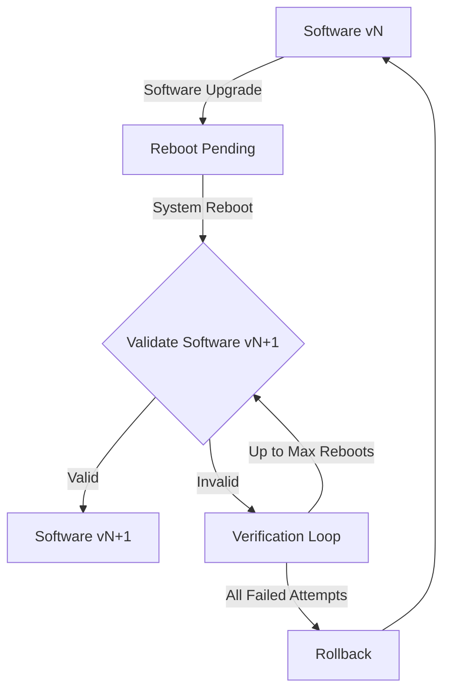

# Integrating MicroShift with Greenboot

## Summary

Assure successful software upgrades and system configuration changes on Edge
Devices running MicroShift by using [greenboot](https://github.com/fedora-iot/greenboot),
the Generic Health Check Framework for `systemd` on `rpm-ostree` based systems.

## Motivation

Serviceability of Edge Devices is often limited or non-existent, which makes it
challenging to troubleshoot device problems following a failed software or
operating system upgrade.

This functionality benefits the users by reducing the risk of being locked out
of an Edge Device when upgrades take place. Users will not experience
significant interruption of service in case of a failed upgrade.

### User Stories

As a user, I want to operate my devices without interruptions so that I can
have my work done.

As a site manager, I want to ensure uninterrupted work of hundreds of edge
devices so that I can fulfill the site deliverables.

As a Device Administrator, I want to have a solution for failed software or
operating system upgrades so that I can reduce an Edge Device downtime for the
device users.

As a Device Administrator, I want an option to include MicroShift into the
device health checks so that, if MicroShift fails to start after an ostree
update, the update is rolled back.

As a developer, I want to have health check procedures for my software
so that I can use them for ensuring that the software operates as designed.

### Goals

The goal of this enhancement is to describe techniques used for ensuring
that an Edge Device running MicroShift functions properly following software
upgrades or system configuration changes. If a failure is detected, the system
is expected to boot into the last known working configuration using `rpm-ostree`
rollback facilities.

### Non-Goals

The non-goals of this proposal are:
- How to implement upgrade fallbacks on systems not based on `rpm-ostree`
- How to implement upgrade fallbacks without using `greenboot`
- How to upgrade Edge Devices, including best practices, etc.
- How to monitor Edge Device software version and upgrade status (see USHIFT-497)
- How to implement MicroShift data backup and restore for fallbacks (see ETCD-353 and USHIFT-518)
- How to implement successful 3rd party software installation and upgrades
- How to verify 3rd party software operation and provide a fallback if failed

## Proposal

### Workflow Description

**Device Administrator** is a human user responsible for managing Edge Devices.

**End User** is a human user operating an Edge Device.

1. Device Administrator releases an updated system image over the network to
upgrade devices in the field
2. Edge Devices monitor system upgrades and download them in the background
3. Edge Device upgrade staged on `rpm-ostree` does not take place until the next
system reboot

> In step 3, the system reboot may be scheduled by a Device Administrator, or
> spontaneous due to a End User action, power failure, etc.

1. End Users continue using the current software version until their devices are
rebooted
2. Upon a device reboot, End Users get a new software version only if it has been
downloaded and staged
3. End Users wait until the new software verification procedure completes
4. Depending on the verification results, End Users get the updated software,
or the upgrade is rolled back

> In step 3, the verification procedure may reboot a device multiple times until
> the upgrade is declared successful or failed.

Once the system is rebooted implicitly (i.e. `cron` schedule) or explicitly
by a Device Administrator, End User, etc.,
the [greenboot-healthcheck.service](https://github.com/fedora-iot/greenboot#how-does-it-work)
runs to verify the system validity.

If the system validity procedures are successful, the version of the software
is declared valid for end users. Otherwise, `greenboot` enters a system
verification loop by repeating reboots up-to `GREENBOOT_MAX_BOOT_ATTEMPTS` times
before attempting to rollback to the previous version of the software.



### API Extensions

None

### Implementation Details

MicroShift includes the `40_microshift_running_check.sh` health check script to
validate that all the required MicroShift services are up and running. There is
no explicit dependency on the `greenboot` RPM from MicroShift core packages, or
a requirement to use health check procedures. The health check script is packaged
in the separate `microshift-greenboot` RPM, which may be installed on the system
if the `greenboot` facilities are to be used.

The health check script is installed into the `/etc/greenboot/check/required.d`
directory and it is not executed during the system boot in case the `greenboot`
package is not present.

> If other scripts are present in the `/etc/greenboot/check/required.d` directory,
> they will be executed by `greenboot` in the alphanumeric order.

The script performs the following sanity checks:
* Exit if the current user is not `root`
* Exit if MicroShift service is not enabled
* Wait for the MicroShift service to become active

If the `greenboot-default-health-check` RPM subpackage is installed, it already
includes [health check scripts](https://github.com/fedora-iot/greenboot#health-checks-included-with-subpackage-greenboot-default-health-checks)
verifying that DNS and `ostree` services can be accessed.

The health check script will implement validations for the MicroShift health
endpoints and its services running as pods in the following namespaces:
- openshift-ovn-kubernetes
- openshift-service-ca
- openshift-ingress
- openshift-dns
- openshift-storage

> When pluggable CNI and CSI functionality is implemented, the `openshift-ovn-kubernetes`
> and `openshift-storage` namespace name selection need to be conditional on
> the loaded CNI and CSI plugins. The plugin developers may choose to add plugin-
> specific health check scripts.

The script implementation will use `microshift get` command implementing the
`oc get` functionality not to create an extra dependency on `openshift-clients`
package.

Exiting the script with a non-zero status will have the boot declared as failed.
Greenboot redirects all the script output to the system log, accessible via the
`journalctl -u greenboot-healthcheck.service` command.

|Validation                                           |Pass  |Fail  |
|-----------------------------------------------------|------|------|
|Check microshift.service is enabled                  |Next  |exit 0|
|Wait for microshift.service to be active (!failed)   |Next  |exit 1|
|Wait for Kubernetes API health endpoints to be OK    |Next  |exit 1|
|Wait for any pods to start                           |Next  |exit 1|
|For each core namespace, wait for images to be pulled|Next  |exit 1|
|For each core namespace, wait for pods to be ready   |Next  |exit 1|
|For each core namespace, check pods not restarting   |exit 0|exit 1|

> If the system is not booted using the `ostree` file system, the health check
> procedures still run, but no rollback would be possible in case of an upgrade
> failure.

The wait timeout of each validation starts from the base of 5 minutes and it is
incremented by the base value after each boot with a failed verification (i.e.
first failed boot 5 minutes wait, second failed boot 10 minutes wait, etc.).
It should be possible to override the base wait timeout setting with the
`MICROSHIFT_WAIT_TIMEOUT_SEC` environment variable in the `/etc/greenboot/greenboot.conf`
configuration file alongside other [Greenboot Configuration](https://github.com/fedora-iot/greenboot#configuration)
settings.

### Risks and Mitigations

Edge Devices often have relatively slow networks or occasional loss of network
connectivity. The risk of declaring a `false positive` on the failed boot may
be caused by these factors.

If an update requires downloading new container images on a relatively slow
network, it may take more than the default wait period to run this operation.
The mitigation would be the automatic doubling of the wait period on subsequent
boots. If this is still not enough, Device Administrators should set the base
wait period setting to a higher value to start with.

> Container image pull check is performed as a separate step, so there is a
> clear indication when image download times out due to a slow network.

If any external connectivity is required for upgrades to complete successfully,
intermittent network outage may result in a rollback to the previous version.
As a mitigation, Device Administrators should reinstall the upgrade when network
is available for the Edge Devices.

To further mitigate potential problems related to slow or unstable networks,
Device Administrators may choose to bundle the upgraded container images in the
`ostree` software upgrade. In this case, when the upgrade is installed, no
more container images will need to be downloaded over the network.

Some 3rd party workloads may become operational before the upgrade is declared
valid and potentially create or update data on the device. If a rollback is
performed subsequentially, there is a risk of data loss because the file system
is reverted to its state before the upgrade. One of the ways to mitigate this 
problem is to have 3rd party workloads wait until a boot is declared successful.

```bash
$ sudo grub2-editenv - list | grep ^boot_success
boot_success=1
```

If any of the user workloads start before the boot is declared successful and
update host file system or data volumes, there is a risk for the host file system
and software update to be reverted to its previous state by `greenboot`. In this
case, user workloads should take measures to ensure their configuration and
application data consistency. For example, user application may choose to install
scripts in the `/etc/greenboot/red.d` directory to be invoked by `greenboot` in
case of an unsuccessful upgrade before the rollback is performed.

> MicroShift implements its own application state and data backup / rollback
> procedures, but it cannot ensure consistency of 3rd party workloads or data.

### Drawbacks

The technical implementation of upgrade validation is rather simple as it relies
on the existing `greenboot` and `rpm-ostree` facilities. However, end users may
find it annoying to have their Edge Devices rebooted few times until the upgrade
is either successful or rolled back.

It is possible that certain 3rd party workloads become operational before the
upgrade is declared successful. This situation may further hurt user experience
if their Edge Devices are rebooted due to MicroShift core functionality
validation not passing.

## Design Details

### Open Questions
N/A

### Test Plan

The end-to-end testing procedure to be developed for MicroShift integration with
`greenboot` should simulate the following use cases:
- System should function properly with and without `greenboot` RPM installed
- A successful operating system upgrade leading to `boot_success=1`
- An upgrade leading to MicroShift service failure leading to a rollback
- An upgrade leading to MicroShift pod failure leading to a rollback

An operating system upgrade can be simulated by overriding an RPM package
installation using the `rpm-ostree` command.

The following command removes the `iotop` package, which is not necessary for
normal MicroShift operation. The MicroShift service should start successfully
after rebooting.

```bash
sudo rpm-ostree override remove iotop -r
```

The following command removes the `hostname` package, which is necessary for
normal MicroShift operation. The MicroShift service should fail after rebooting.

```bash
sudo rpm-ostree override remove hostname -r
```

MicroShift pod failures may be simulated by changing the `serviceNetwork` option
in the `/etc/microshift/config.yaml` file without resetting the MicroShift state
at `/var/lib/microshift` directory. The MicroShift service should start after the
reboot, but some pods should fail subsequently.

### Graduation Criteria

The first version of MicroShift integration with `greenboot` will be released
with the MicroShift `Tech Preview` release, to be followed by a `GA`.
No `Dev Preview` is expected for this feature.

#### Dev Preview -> Tech Preview

- Ability to utilize the enhancement end to end
- End user documentation completed and published
- Sufficient test coverage
- Gather feedback from users
- Available by default

#### Tech Preview -> GA

- Sufficient time for feedback
- End-to-end tests

#### Removing a deprecated feature

The `greenboot` integration is tightly coupled with MicroShift functionality.
If any features are removed from MicroShift, the `greenboot` validity check
scripts need to be updated. Users should not be notified about such changes,
except for the end user documentation updates for the affected parts.

### Upgrade / Downgrade Strategy

The validation scripts will be delivered as part of the MicroShift core RPM
packages. Any problems caused by the ugraded software, scripts or system
configuration will be rolled back by `greenboot` when validations do not pass.

> The mutable parts of the file system and data volumes are not rolled back
> automatically by the `ostree`. Another enhancement should deal with that issue.

### Version Skew Strategy
N/A

### Operational Aspects of API Extensions
N/A

#### Failure Modes
N/A

#### Support Procedures

All the output of the `greenboot` scripts is redirected to the system log. Support
can request the output of the following command to be sent for troubleshooting.

```bash
sudo journalctl -u greenboot-healthcheck.service
```

## Implementation History
N/A

## Alternatives

The basic assumption is that `greenboot` must be used for implementing health
checks on `rpm-ostree` based systems. It is possible to also implement
[Health Checks with systemd services](https://github.com/fedora-iot/greenboot#health-checks-with-systemd-services)
if parts of the procedure should be executed taking into account unit ordering.

Another approach discussed is related to parsing the MicroShift log file, looking
for special tags or messages during the validation process. The conclusion was
to observe the state of the system without relying on logs.
