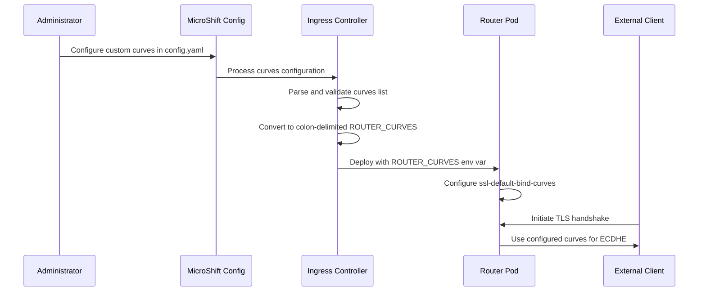

# Support TLS Curves Configuration in MicroShift Ingress for Post-Quantum Cryptography

## Summary

This enhancement proposes adding support for configuring TLS elliptic curves
in MicroShift ingress to enable Post-Quantum Cryptography (PQC) key exchanges
and provide security hardening options. The enhancement introduces the
`ingress.tlsSecurityProfile.custom.curves` configuration field that allows
administrators to specify custom TLS curves for the router ingress
deployment, overriding OpenSSL defaults when needed.

## Motivation

### User Stories

As a security administrator managing MicroShift deployments, I want to
configure custom TLS curves for ingress traffic so that I can prepare for
Post-Quantum Cryptography transitions and meet specific security compliance
requirements.

As a platform engineer deploying MicroShift in regulated environments, I
want to override default OpenSSL curve selections so that I can enforce
security policies that require specific elliptic curves beyond the standard
defaults.

As a DevOps engineer managing MicroShift at scale, I want to configure TLS
security profiles including custom curves so that I can maintain consistent
security hardening across multiple MicroShift instances while monitoring
their operational health.

As an edge computing administrator, I want to configure modern elliptic
curves for enhanced security so that I can protect IoT and edge workloads
with state-of-the-art cryptographic standards.

### Goals

- Enable configuration of custom TLS curves for MicroShift ingress through
  the `ingress.tlsSecurityProfile.custom.curves` configuration API
- Support ROUTER_CURVES environment variable in router ingress deployment
  for curve specification
- Provide seamless backward compatibility when curves are not configured
  (continue using OpenSSL defaults)

### Non-Goals

- Implementing custom TLS cipher suite configurations (out of scope for
  this enhancement)
- Modifying the underlying router SSL curve support (already implemented
  in upstream)
- Automatic detection or recommendation of optimal curve configurations

## Proposal

### Workflow Description

The workflow involves the following actors and steps:

1. **Administrator** configures TLS curves in MicroShift configuration:
   - Edits the MicroShift config.yaml to specify custom curves
   - Applies the configuration using standard MicroShift config management
   - Restarts the microshift service for configuration changes to take effect

2. **MicroShift Config Controller** processes the configuration:
   - Parses the curves list from `ingress.tlsSecurityProfile.custom.curves`
   - Validates the curve names against supported options
   - Converts the curve list to colon-delimited format for ROUTER_CURVES

3. **MicroShift Ingress Controller** updates the deployment:
   - Checks if curves are explicitly configured
   - If configured, adds ROUTER_CURVES environment variable to ingress
     deployment
   - If not configured, omits ROUTER_CURVES (uses OpenSSL defaults)

4. **router Ingress Pod** applies the curve configuration:
   - Reads ROUTER_CURVES environment variable
   - Configures ssl-default-bind-curves in router configuration
   - Establishes TLS connections using the specified curves



### API Extensions
As described in the proposal, there is an  new curves configuration :
```yaml
ingress:
    tlsSecurityProfile: 
        type: Custom
        custom:
	         curves:
	           - ecdh_x25519
	           - secp256r1
	           - secp384r1
	             
    
```
### Topology Considerations

#### Hypershift / Hosted Control Planes

N/A

#### Standalone Clusters

N/A

#### Single-node Deployments or MicroShift

Enhancement is solely intended for MicroShift.


#### OpenShift Kubernetes Engine

N/A

### Implementation Details/Notes/Constraints

The implementation involves the following high-level code changes:

1. **Configuration API Extension**:
   - Extend the MicroShift configuration structure to include the
     `curves` field under `ingress.tlsSecurityProfile.custom`
   - Add validation for supported curve names

2. **Config Processing**:
   - Modify config.go to parse the curves configuration
   - Convert the curves slice to a colon-delimited string format required
     by ROUTER_CURVES
   - Only include ROUTER_CURVES in the deployment when curves are
     explicitly configured

3. **Deployment Generation**:
   - Update the ingress deployment generation to conditionally include
     the ROUTER_CURVES environment variable
   - Follow the pattern established in PR examples for adding optional
     deployment fields

The implementation maintains backward compatibility by only passing
ROUTER_CURVES to the deployment when curves are explicitly configured,
preserving existing OpenSSL default behavior.

### Risks and Mitigations

**Risk**: Misconfiguration of curves could break TLS connections
- **Mitigation**: Implement validation of curve names against known
  supported curves
- **Mitigation**: Provide clear documentation and examples of valid
  configurations

**Risk**: Performance impact from suboptimal curve selections
- **Mitigation**: Document performance characteristics of different curves
- **Mitigation**: Provide guidance on curve selection for different use cases

**Risk**: Compatibility issues with legacy clients
- **Mitigation**: Maintain OpenSSL defaults when no curves are configured
- **Mitigation**: Document compatibility implications of different curve
  choices

### Drawbacks

- Adds configuration complexity for administrators who may not need custom
  curves
- Requires understanding of TLS curve implications and security trade-offs
- Potential for misconfigurations that could impact security or compatibility

## Alternatives (Not Implemented)

1. **Automatic PQC Detection**: Automatically detect and configure PQC curves
   - Rejected due to complexity and lack of standardization in PQC curve
     selection

2. **Runtime Curve Switching**: Allow dynamic curve configuration without
   pod restarts
   - Rejected due to Router limitations and added complexity

## Open Questions

N/A


## Test Plan

<!-- TODO: This section needs to be filled in with specific test
requirements. Tests must include [OCPFeatureGate:FeatureName] label for
the feature gate, [Jira:"Component Name"] for the component, and
appropriate test type labels like [Suite:...], [Serial], [Slow], or
[Disruptive] as needed. Reference the test conventions guide
(https://github.com/openshift/enhancements/blob/master/dev-guide/test-conventions.md)
for details. -->

**Unit Tests**:
- Test configuration parsing and validation of curves field
- Test conversion of curves slice to colon-delimited format
- Test deployment generation with and without curves configuration

**Integration Tests**:
- Test MicroShift deployment with custom curves configuration
- Verify ROUTER_CURVES environment variable is correctly set
- Test backward compatibility when no curves are configured

**End-to-End Tests**:
- Verify TLS handshakes work with configured custom curves
- Test with various curve combinations including PQC-ready options
- Validate ingress functionality is maintained with custom curves

**Security Tests**:
- Verify only specified curves are used in TLS negotiations

## Graduation Criteria

<!-- TODO: This section needs to be filled in with specific promotion
requirements from the OpenShift dev guide
(https://github.com/openshift/enhancements/blob/master/dev-guide/feature-zero-to-hero.md):
minimum 5 tests, 7 runs per week, 14 runs per supported platform, 95% pass
rate, and tests running on all supported platforms (AWS, Azure, GCP,
vSphere, Baremetal with various network stacks). -->

### Dev Preview -> Tech Preview
- Ability to utilize the enhancement end to end
- End user documentation, relative API stability
- Sufficient test coverage

### Tech Preview -> GA
- All tests passing with 95% success rate
- Documentation complete and reviewed
- No significant bugs reported during tech preview period
- Performance validation completed for common curve configurations

### Removing a deprecated feature
N/A


## Upgrade / Downgrade Strategy

**Upgrade**:
- New installations will support the curves configuration field
- Existing MicroShift deployments will continue to work without configuration
  changes
- Administrators can opt-in to custom curves by updating their configuration

**Downgrade**:
- If downgrading to a version without curve support, the curves configuration
  will be ignored
- router will revert to OpenSSL default curve behavior
- No data loss or service interruption expected

## Version Skew Strategy

This enhancement is contained within MicroShift components and does not
involve cross-component version compatibility concerns. The feature is
designed to gracefully degrade if the configuration is not supported.

## Operational Aspects of API Extensions

This enhancement does not introduce new APIs that require additional
operational considerations beyond standard MicroShift configuration
management. After changing the MicroShift configuration (including
ingress TLS curves), a **microshift service restart is required** for
the changes to take effect.

## Support Procedures

**Troubleshooting Invalid Curves**:
1. Check MicroShift logs for curve validation errors
2. Verify curve names against supported OpenSSL/router curves
3. Test with OpenSSL defaults by removing curves configuration

**Performance Issues**:
1. Monitor TLS handshake performance metrics
2. Consider curve selection impact on CPU usage
3. Validate client compatibility with selected curves

**Configuration Verification**:
1. Verify ROUTER_CURVES environment variable in ingress router pod
2. Check router (HAProxy) configuration for ssl-default-bind-curves setting
3. Use openssl tools to verify negotiated curves in TLS connections

## Infrastructure Needed

No additional infrastructure is required for this enhancement. The feature
uses existing MicroShift configuration mechanisms and router capabilities.