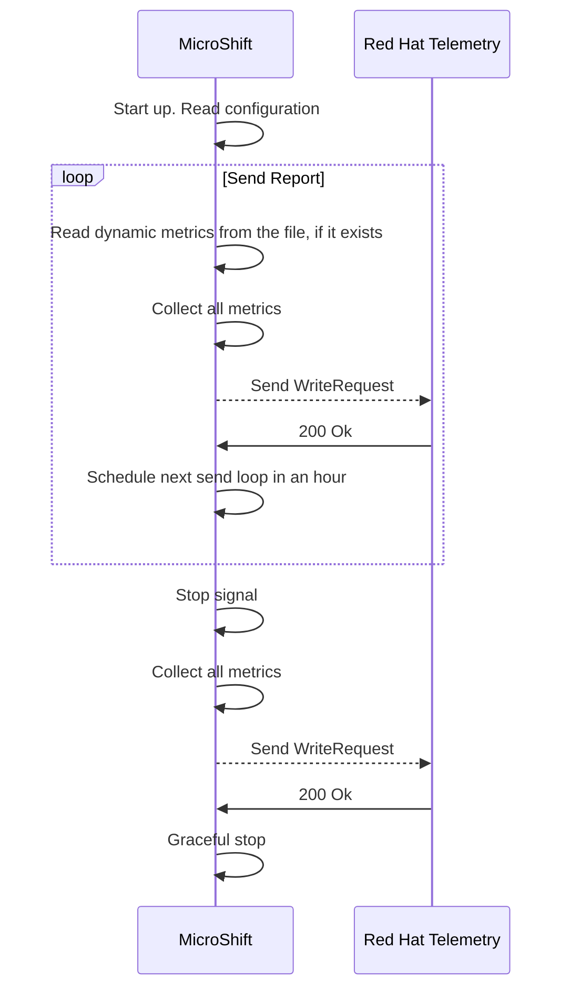

# MicroShift telemetry
## Summary
MicroShift clusters are lacking the remote health monitoring that OpenShift
has. Having no remote health monitoring means no visibility on where and how
MicroShift has been deployed and/or is running.

In order to enable visibility on the number of deployed systems and also their
usage patterns, this enhancement proposes the addition of the
[Telemetry API](https://rhobs-handbook.netlify.app/products/openshiftmonitoring/telemetry.md/)
to MicroShift.

## Motivation
MicroShift is currently not sending any kind of metric from production
deployments. Not having remote monitoring creates a blind spot on the
deployment and usage characteristics of MicroShift instances in production
environments.

MicroShift runs as an application on top of R4E (Rhel4Edge), the usage of RHEL
insights may yield some information about MicroShift, but there might be gaps.
RHEL insights knows about which packages are installed, but not whether
MicroShift is running or runtime metrics.

In order to enhance the user experience and Red Hat's insights about production
MicroShift deployments, this enhancement proposes enabling the use of Telemetry
API to get data from connected MicroShift clusters.

### User Stories
As Red Hat, I want to enable MicroShift clusters to report back to me to get
knowledge on usage patterns of live deployments.

As a MicroShift admin, I want to have the option to opt-out of telemetry.


### Goals
* Enable MicroShift connected deployments to send current information about
system capabilities and usage characteristics.

* Get better understanding of deployment and usage patterns on MicroShift.

### Non-Goals
* Have an in-cluster metrics service.

* Provide recommendations and/or analysis to customers using their data.

## Proposal
Introduce an automatic, opt-out mechanism for connected MicroShift clusters to
report their status to Red Hat. Each MicroShift cluster should send the
following metrics (at least) to the Telemetry API:
* Number of available cores/RAM/disk
* Average utilization of cores/RAM/disk (% of total)
* Number of namespaces
* Number of running pods
* Number of container images on disk
* Number of routes/ingress/services
* Number of CRDs
* OS version / Type (rpm / ostree)

These metrics should be sent at least once a day.

### Metrics details
Based on [Telemetry API](https://rhobs-handbook.netlify.app/products/openshiftmonitoring/telemetry.md/)
MicroShift will send metrics using Prometheus format. There are several ways
of using the API: [using the client to forward metrics](https://github.com/openshift/telemeter/tree/main?tab=readme-ov-file#upload-endpoint-receive-metrics-in-client_modelmetricfamily-format-from-telemeter-client-currently-used-by-cmo),
or [direct write requests](https://github.com/openshift/telemeter/tree/main?tab=readme-ov-file#metricsv1receive-endpoint-receive-metrics-in-prompbwriterequest-format-from-any-client).
Using the client is not an option because that requires a local Prometheus
instance, not viable in the typical resource constrained MicroShift deployment.
The direct write requests take raw Prometheus data and require both special
labels (`_id` for the cluster id) and crafting the authentication headers
(cluster id and pull secret in a specific format in HTTP headers).

A comprehensive list of metrics sent by MicroShift follows.

#### `cluster:capacity_cpu_cores:sum`
This metric reports the CPU cores MicroShift can use. Already supported in
OpenShift.

Labels:
* `_id`: cluster ID. UUID string.
* `label_kubernetes_io_arch`: Label from the node, determines the architecture.
  Values can be `amd64`, `aarch64`.
* `label_node_openshift_io_os_id`: Label from the node, determines the OS type.
  Values can be `rhel`.
* `label_beta_kubernetes_io_instance_type`: Label from the node. MicroShift
  sets this to `rhde`. Possible values are `rhde`.

#### `cluster:capacity_memory_bytes:sum`
This metric reports the memory MicroShift can use in bytes. Already supported
in OpenShift.

Labels:
* `_id`: cluster ID. UUID string.
* `label_kubernetes_io_arch`: Label from the node, determines the architecture.
  Values can be `amd64`, `aarch64`.
* `label_node_openshift_io_os_id`: Label from the node, determines the OS type.
  Values can be `rhel`.

#### `cluster:cpu_usage_cores:sum`
This metric reports the CPU usage in percentage. Already supported in
OpenShift.

Labels:
* `_id`: cluster ID. UUID string.

#### `cluster:memory_usage_bytes:sum`
This metric reports the memory usage in percentage. Already supported in
OpenShift.

Labels:
* `_id`: cluster ID. UUID string.

#### `cluster:usage:resources:sum`
This metric reports the number of Kubernetes objects by resource type. Already
supported in OpenShift.

Labels:
* `_id`: cluster ID. UUID string.
* `resource`: name of the kubernetes resource. Values can be `pods`,
  `namespaces`, `services`, `ingresses.networking.k8s.io`,
  `routes.route.openshift.io`,
  `customresourcedefinitions.apiextensions.k8s.io`.

#### `cluster:usage:containers:sum`
This metric reports the number of running containers. Already supported in
OpenShift.

Labels:
* `_id`: cluster ID. UUID string.

#### `microshift_version`
This metric reports information about MicroShift version. New metric not
supported in OpenShift.

Labels:
* `_id`: cluster ID. UUID string.
* `version`: MicroShift version. Possible values are `\d{1}.\d{1,2}.\d{1,2}`.
* `type`: Describes deployment type. Possible values are `rpm` and `ostree`.
* `commit`: In case `type` is `ostree`, this will hold the ostree commit.
  Format is a 64 character SHA.


Using the names and labels listed above, each sample requiring a float64
and an int64 value, all metrics combined are under 2KB.

In order to keep metrics synchronized with those of OpenShift, in terms of API
support, MicroShift will be using CI:
* A job shall deploy MicroShift with Telemetry enabled.
* A job will use the staging endpoint for Telemetry API. No added traffic
  and no confusing data when querying.
* At the end of the job a new check shall be performed: check there is data
  belonging to that specific cluster in the staging environment.

### Sending metrics
OpenShift is sending metrics through this API every 4.5 minutes. This is done
to overcome staleness in Prometheus server on the Telemetry backend. Stale data
may yield gaps when retrieving it, making querying and dashboards more nuanced
and harder to read.

MicroShift, by its nature, needs to cover different use cases and potential
limitations: resource constrained environments where computing power is scarce
or limited, unreliable networks where outages are common, slow networks where
bandwidth is not the best, private networks where all external traffic is
audited and maybe limited, applications that are stable once they start,
disconnected clusters, etc. The dynamic behavior that metrics help uncover is
only one of the many use cases MicroShift has.
For these reasons, and because the intention of this enhancement is to get the
basic structure of a metrics reporting system, MicroShift will start using 1h
intervals to send metrics, which is a good compromise between resource usage
and data granularity.

When MicroShift starts it should send metrics once and then schedule them every
hour.
It will also send metrics when issued to stop, as part of the finish process.
This helps in sending a last report and also hint when the cluster has been
stopped.
This is not configurable.

As described above MicroShift will be using the [direct request](https://github.com/openshift/telemeter/tree/main?tab=readme-ov-file#metricsv1receive-endpoint-receive-metrics-in-prompbwriterequest-format-from-any-client)
endpoint.
Each metric must follow [Prometheus WriteRequest](https://github.com/prometheus/prometheus/blob/release-2.38/prompb/remote.proto#L22)
format.

Using sizes in the previous section, a single MicroShift cluster will send no
more than 48KB per day to Telemetry API.

### Visualizing time series
As hinted above, Telemetry backend server will mark any time series stale when
there is no new data for 5min. The stale time series will get excluded from
query results, yielding gaps in between infrequent updates.

Given that MicroShift will only send data every hour, gaps are guaranteed to
happen. The specific dashboards for MicroShift need to take this into account
and modify their queries to accommodate longer timespans.

Initially, aggregating the different metrics per day or per week should be
enough to cover current requirements. This must be present in the queries
themselves, which will need to retrieve data over the latest 24h instead.

### Sensitive data
There is no user or private data in any of the metrics in MicroShift reports.

### Opting out
MicroShift may not always have the possibility of sending metrics. There may be
disconnected clusters, constrained environments where external traffic could be
audited, customers who simply do not want to share this information, etc. For
these reasons there must be an opt-out for this functionality, as OpenShift
already [allows](https://docs.openshift.com/container-platform/4.17/support/remote_health_monitoring/opting-out-of-remote-health-reporting.html).

Taking advantage of the configuration options that the feature requires, an
enable/disable toggle is provided.

### Workflow Description
**MicroShift** is the MicroShift main process.

1. MicroShift starts up.
2. MicroShift reads configuration. If telemetry is not enabled, finish here. If telemetry is enabled proceed to next step.
3. Collect all metrics and send them.
4. Every hour collect all metrics and send them.
5. When MicroShift receives the stopping signal and before doing graceful termination, collect and send metrics again.



### API Extensions
As described above, the feature needs to be configurable as there could be different reasons why MicroShift admins would not want their clusters to connect to Red Hat telemetry.
The following changes in the configuration file are proposed:
```yaml
telemetry:
  status: <Enabled|Disabled> # Defaults to Enabled
  endpoint: <URL> # Defaults to https://infogw.api.openshift.com
```

### Topology Considerations
#### Hypershift / Hosted Control Planes
N/A

#### Standalone Clusters
N/A

#### Single-node Deployments or MicroShift
Enhancement is intended for MicroShift only.

### Implementation Details/Notes/Constraints
N/A

### Risks and Mitigations
Using the telemeter API requires connected clusters, and this might not always
be the case with MicroShift. For those clusters that are not connected there
is no easy way of getting metrics from them. A possible mitigation would be to
store all metrics until its possible to send them, but this may never happen
depending on the use cases and deployment types.
In such cases we simply assume that no metrics will be available.

### Drawbacks
N/A

## Test Plan
## Graduation Criteria
The feature is planned to be released as GA directly.

### Dev Preview -> Tech Preview
N/A

### Tech Preview -> GA
- Ability to utilize the enhancement end to end
- End user documentation completed and published
- Available by default
- End-to-end tests

### Removing a deprecated feature
N/A

## Upgrade / Downgrade Strategy
N/A

## Version Skew Strategy
N/A

## Operational Aspects of API Extensions
N/A

## Support Procedures
N/A

## Alternatives
* Insights API was also considered for this enhancement. The Insights API is
  intended to analyze clusters and extract data to provide recommendations.
  After a report is sent a series of pipelines take action to produce different
  reports, which are visible through the [OpenShift console](https://console.redhat.com/openshift). This
  is intended for connected clusters that need a deeper analysis on their data
  to produce close to optimal configurations. The insights operator does not
  work on MicroShift, and the visualization part, as well as the ingestion,
  would require significant changes that are outside the scope of MicroShift
  team. The nature of a MicroShift deployment is not the same as OpenShift,
  therefore a recommendation/analysis engine may not be the best fit for the
  purpose of this feature.
