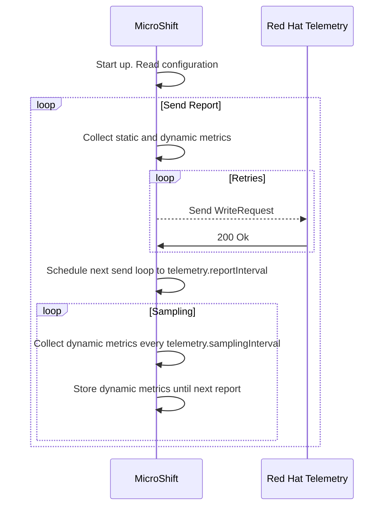

# MicroShift telemetry
## Summary
MicroShift clusters are lacking the remote health monitoring that OpenShift
has. Having no remote health monitoring means no visibility on where and how
MicroShift has been deployed and/or is running.

In order to enable visibility on the number of deployed systems and also their
usage patterns, this enhancement proposes the addition of the
[Telemetry API](https://rhobs-handbook.netlify.app/products/openshiftmonitoring/telemetry.md/)
to MicroShift.

## Motivation
MicroShift is currently not sending any kind of metric from production
deployments. Not having remote monitoring creates a blind spot on the
deployment and usage characteristics of MicroShift instances in production
environments.

MicroShift runs as an application on top of R4E (Rhel4Edge), the usage of RHEL
insights may yield some information about MicroShift, but there might be gaps.
RHEL insights knows about which packages are installed, but not whether
MicroShift is running or runtime metrics.

In order to enhance the user experience and Red Hat's insights about production
MicroShift deployments, this enhancement proposes enabling the use of Telemetry
API to get data from connected MicroShift clusters.

### User Stories
As Red Hat, I want to enable MicroShift clusters to report back to me to get
knowledge on usage patterns of live deployments.

As a MicroShift admin, I want to have the option to opt-out of telemetry.

As a MicroShift admin, I want to have the option to configure how often
telemetry data is sent.


### Goals
* Enable MicroShift connected deployments to send current information about
system capabilities and usage characteristics.

* Get better understanding of deployment and usage patterns on MicroShift.

### Non-Goals
* Have an in-cluster metrics service.

* Provide recommendations and/or analysis to customers using their data.

## Proposal
Introduce an automatic, opt-out mechanism for connected MicroShift clusters to
report their status to Red Hat. Each MicroShift cluster should send the
following metrics (at least) to the Telemetry API:
* Number of available cores/RAM/disk
* Average utilization of cores/RAM/disk (% of total)
* Number of namespaces
* Number of running pods
* Number of container images on disk
* Number of routes/ingress/services
* Number of CRDs
* OS version / Type (rpm / ostree)

These metrics should be sent at least once a day.

### Metrics details
Based on [Telemetry API](https://rhobs-handbook.netlify.app/products/openshiftmonitoring/telemetry.md/)
MicroShift will send metrics using Prometheus format. There are several ways
of using the API: [using the client to forward metrics](https://github.com/openshift/telemeter/tree/main?tab=readme-ov-file#upload-endpoint-receive-metrics-in-client_modelmetricfamily-format-from-telemeter-client-currently-used-by-cmo),
or [direct write requests](https://github.com/openshift/telemeter/tree/main?tab=readme-ov-file#metricsv1receive-endpoint-receive-metrics-in-prompbwriterequest-format-from-any-client).
Using the client is not an option because that requires a local Prometheus
instance, not viable in the typical resource constrained MicroShift deployment.
The direct write requests take raw Prometheus data and require both special
labels (`_id` for the cluster id) and crafting the authentication headers
(cluster id and pull secret in a specific format in HTTP headers).

OpenShift is using the same API and the same backend, so we need a way to
distinguish MicroShift in the pool of metrics. For this we can use labels, as
it does not require applying for new supported metrics. MicroShift metrics
labels summary:
| Label | Values |
|:---|:---|
|_id|cluster id|
|label_kubernetes_io_arch|amd64, aarch64|
|resource|Used to specify K8s resource names: pods, namespaces, etc.|
|instance|ip address of the node|
|version|$microshift_version|
|type|microshift-rpm, microshift-ostree|

Metrics from MicroShift are already supported in the API because OpenShift is
using them. List follows:
* cluster:capacity_cpu_cores:sum. Number of allocated CPUs for MicroShift.
* cluster:capacity_memory_bytes:sum. Number of bytes of memory allocated for
  MicroShift.
* cluster:cpu_usage_cores:sum. Usage of CPU in percentage.
* cluster:memory_usage_bytes:sum. Usage of memory in percentage.
* cluster:usage:resources:sum. Usage of k8s resources, in count. Number of
  pods, namespaces, services, etc.
* cluster:usage:containers:sum. Number of active containers.
* cluster_version. Information about the installed version.
* instance:etcd_object_counts:sum. Number of objects etcd contains.

### Sending metrics
OpenShift is sending metrics through this API every 4.5 minutes. For MicroShift
deployments this might be a bit excessive due to resource usage, network
traffic and usage patterns.

MicroShift should send data once a day to minimize network traffic as it can be
deployed in constrained environments. To allow customizations a new
configuration option shall be added. This option will drive how often a metrics
payload should be sent and it will default to 24h. In every MicroShift start
all metrics shall be sent. Afterwards, it will follow the configuration option
to schedule the next send.

As described above MicroShift will be using the [direct request](https://github.com/openshift/telemeter/tree/main?tab=readme-ov-file#metricsv1receive-endpoint-receive-metrics-in-prompbwriterequest-format-from-any-client)
endpoint.
Each metric must follow [Prometheus WriteRequest](https://github.com/prometheus/prometheus/blob/release-2.38/prompb/remote.proto#L22)
format.

### Sampling and batching metrics
Metrics sent by MicroShift can be categorized in:
* Static metrics. These are fixed throughout the execution of MicroShift, such
as memory, CPU or version.
* Dynamic metrics. These change and evolve throughout the execution of
MicroShift, such as resource usage or resources in the cluster.

If we assume default values, metrics are sent at least once a day in those
deployments that do not disable the functionality. While this is good enough
for static metrics, it provides a degraded view for dynamic ones. Having
once-per-day data on resource usage makes it virtually impossible to extract
any patterns out of it. For this reason it might be beneficial to sample
dynamic metrics more often and then batch them together with the static
metrics when sending them.

Sampling metrics means MicroShift needs to store values in between metrics
reports. The dynamic metrics are not numerous enough to take a toll on resource
usage, but this interval must be configurable and default to a sensible value.

In numbers, as seen above, each metric will be composed of a name, labels,
values and timestamps. All of these amount to a few hundred bytes. Sampling,
however, means we only repeat timestamps and values, which are the least space
consuming fields, therefore the price in increased resources in MicroShift
should be negligible.

### Sensitive data
There is no user or private data in any of the metrics in MicroShift reports.

### Opting out
MicroShift may not always have the possibility of sending metrics. There may be
disconnected clusters, constrained environments where external traffic could be
audited, customers who simply do not want to share this information, etc. For
these reasons there must be an opt-out for this functionality, as OpenShift
already [allows](https://docs.openshift.com/container-platform/4.17/support/remote_health_monitoring/opting-out-of-remote-health-reporting.html).

Taking advantage of the configuration options that the feature requires, an
enable/disable toggle is provided.

### Workflow Description
**MicroShift** is the MicroShift main process.

1. MicroShift starts up.
2. MicroShift reads configuration. If telemetry is not enabled, finish here. If telemetry is enabled proceed to next step.
3. Collect all metrics and send them. Include dynamic metrics from sampling if available. Retry if failed.
4. Schedule next send for `telemetry.reportInterval`.
5. Every `telemetry.sampleInterval` collect all dynamic metrics and store them in memory.
6. Wait until `telemetry.reportInterval` and go to step 3.



### API Extensions
As described above, the feature needs to be configurable as there could be different reasons why MicroShift admins would not want their clusters to connect to Red Hat telemetry.
The following changes in the configuration file are proposed:
```yaml
telemetry:
  status: <Enabled|Disabled> # Defaults to Enabled
  sendingInterval: <Duration> # Defaults to 24h
  samplingInterval: <Duration> # Defaults to 1h
```

### Topology Considerations
#### Hypershift / Hosted Control Planes
N/A

#### Standalone Clusters
N/A

#### Single-node Deployments or MicroShift
Enhancement is intended for MicroShift only.

### Implementation Details/Notes/Constraints
N/A

### Risks and Mitigations
Using the telemeter API requires connected clusters, and this might not always
be the case with MicroShift. For those clusters that are not connected there
is no easy way of getting metrics from them. A possible mitigation would be to
store all metrics until its possible to send them, but this may never happen
depending on the use cases and deployment types.
In such cases we simply assume that no metrics will be available.

### Drawbacks
N/A

## Test Plan
## Graduation Criteria
The feature is planned to be released as GA directly.

### Dev Preview -> Tech Preview
N/A

### Tech Preview -> GA
- Ability to utilize the enhancement end to end
- End user documentation completed and published
- Available by default
- End-to-end tests

### Removing a deprecated feature
N/A

## Upgrade / Downgrade Strategy
N/A

## Version Skew Strategy
N/A

## Operational Aspects of API Extensions
N/A

## Support Procedures
N/A

## Alternatives
* Insights API was also considered for this enhancement. The Insights API is
  intended to analyze clusters and extract data to provide recommendations.
  After a report is sent a series of pipelines take action to produce different
  reports, which are visible through the [OpenShift console](https://console.redhat.com/openshift). This
  is intended for connected clusters that need a deeper analysis on their data
  to produce close to optimal configurations. The insights operator does not
  work on MicroShift, and the visualization part, as well as the ingestion,
  would require significant changes that are outside the scope of MicroShift
  team. The nature of a MicroShift deployment is not the same as OpenShift,
  therefore a recommendation/analysis engine may not be the best fit for the
  purpose of this feature.
