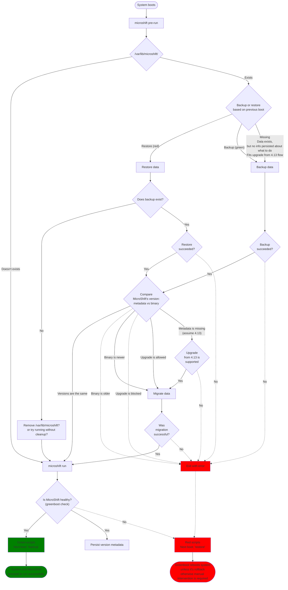

# MicroShift updateability in ostree based systems

## Summary

This enhancement focuses on high level overview of updating
MicroShift running on ostree based systems such as RHEL 4 Edge.
Enhancement covers backup and restore of MicroShift data,
version migration (upgrade and downgrade) of MicroShift and 
its consequences (migration of data between schema versions),
and interactions with GreenBoot and operating system.

## Motivation

MicroShift team is working towards a general availability (GA) release.
As GA product, it is expected that it can be updated to
provide security patches, functional updates, and bug fixes
without needing to redeploy.

MicroShift is intended to be a part of Red Hat Device Edge
which is based on RHEL For Edge which features ostree and as such
provides rollbacks to go back to previous ostree deployment.
Even though, OpenShift does not support downgrade or rollback,
MicroShift must support it in some form. Explicit downgrade 
will not be supported, and rollback will be supported only when
newer ostree commits is unhealthy and backup consistent with previously
ran MicroShift is present.

To allow for such operations, we need to define how we'll
achieve that goal. We can define several areas we need to focus on:
backing up and restoring MicroShift's data, handling version changes
and its consequences such as migrating underlying data between schema
versions, defining a mechanism for allowing or blocking upgrades between
certain version of MicroShift.

### User Stories

* As a MicroShift administrator, I want to safely update MicroShift
  so that I can get bug fixes, new features, and security patches.
* As a MicroShift administrator, I want automated backups of 
  MicroShift data so in case of a greenboot failure system will rollback
  and backup will be restored.

### Goals

Goal of the enhancement is to describe implementation roadmap for
integrating MicroShift with ostree and greenboot in order to provide
functionality to:
- Safely update MicroShift version (by backing up the data and
  restoring it in case of rollback)
- Migrating internal data (like Kubernetes storage or etcd schema) to
  newer version
- Block upgrades in case of version bump being too big

Design aims to implement following principles:
- Keep it simple, optimize later
- MicroShift does not own the OS or host
- MicroShift and all its components are versioned, upgraded, and rolled back together
- Be defensive, fail fast
- Rely on outside intervention as a last resort

### Non-Goals

* Building allowed/blocked version migration graph
* Handling readiness, and backup and rollback of 3rd party applications
  (although end user documentation should be provided)
* Defining updateability for non-ostree systems is left to a future enhancement
* Protecting against data corruption - we rely on file system 
  to maintain the backed up file integrity

## Proposal

### Workflow Description

**MicroShift administrator** is a human responsible for preparing
ostree commits and scheduling devices to use these commits.

Upgrade:

1. MicroShift administrator prepares a new ostree commit
1. MicroShift administrator schedules device to reboot and use new ostree commit
1. Device boots to new commit
1. Operating System, greenboot, and MicroShift take actions without any additional intervention

Manual rollback:

1. MicroShift administrator instructs MicroShift to do a restore on next boot
1. MicroShift administrator stages an ostree deployment with MicroShift
   that was already running and reboots the device
1. Staged ostree deployment boots
1. MicroShift will restore the backup matching current ostree deployment
1. MicroShift will run.

### API Extensions

Metadata persisted on filesystem related to the functionality described 
in this enhancement such as version metadata, next boot action, and any other,
is considered internal implementation detail and not an API to be consumed.
Content (schema) and location of these files are subject to change.

### Implementation Details/Notes/Constraints [optional]

### Risks and Mitigations

Being a GA feature from the beginning the risks are not foreseeing fail scenarios in advance and implementation bugs
that are not caught and fixed through graduation process.

To mitigate the risks, a thorough review of the enhancement must be done by MicroShift, OpenShift, and RHEL teams,
and making sure testing strategy is sound and prioritized equally with the feature development.

### Drawbacks

N/A

## Design Details

### Definitions

- **ostree commit**: TODO
- **ostree deployment**: TODO (Remember, new deployment might include K8s apps not previously running)
- **Rollback**: booting older, already running on a device, ostree deployment - either due to greenboot or manual intervention
- **Upgrade**: running newer version of MicroShift than previously as a result of booting another ostree commit
- **Downgrade**: running older version of MicroShift than previously as a result of booting another ostree commit, not as part of a Rollback
- **Backup**: backing up `/var/lib/microshift`
- **Restore**: restoring `/var/lib/microshift`
- **Version Metadata**: File residing in MicroShift data dir containing version of MicroShift and ID of ostree deployment
- **MicroShift greenboot healthcheck**: Program verifying the status of MicroShift's cluster

### Preface

Every action related to procedure described in this enhancement is 
performed after system's boot rather than immediately before shutdown. 
Greenboot's healthchecks, green and red scripts are executed independent of MicroShift's processes.
Actions related to backup, restore, and data migration may be performed with MicroShift 
partially running, i.e. only etcd and kube-apiserver are running.

Only one backup of MicroShift data will be stored at a given moment
due to high probability of devices having limited storage.

### Integration with greenboot

[greenboot](https://github.com/fedora-iot/greenboot) is "Generic Health Checking Framework for systemd".
It is used on ostree based systems (like CoreOS, RHEL For Edge, Fedora Silverblue) to assess system's
health and, if needed, rollback to previous ostree deployment.

For more information about greenboot and current MicroShift's integration with it see 
[Integrating MicroShift with Greenboot](https://github.com/openshift/enhancements/blob/master/enhancements/microshift/microshift-greenboot.md) 
enhancement.

In general, greenboot after boot runs scripts that are verifying if system is healthy
and, depending on result, runs either set of green (healthy) or red (unhealthy) scripts.
Healthy system can be also referred to as "green boot", whereas unhealthy as "red boot".

We propose to use "green" and "red" scripts to decide if MicroShift's data 
should be backed up (green) or restored (red). For reasons mentioned in section 
"Alternatives - Performing backup on shutdown" it was concluded that both 
backup and restore should happen on system start, rather than shutdown.
It means that green or red script persists an action that will be performed 
on next boot of the system.

As a consequence, whether the next boot happens to be different or the same
ostree deployment, it will produce a backup compatible with previously booted deployment
and then attempt to perform a data migration if needed.
It also means that consecutive red boots of new ostree deployment will restore the data,
attempt to migrate it, and run MicroShift, i.e. each boot starts from the same place, just
like it would be a first boot of that ostree deployment.
This provides a safety net in case of invalid data migration - it will be attempted again,
on each boot following red boot.

Potential risk is possibility of losing data that might've been produced during window
of MicroShift start and system reboot. However, only applies to MicroShift's data,
because Kubernetes application's data isn't persisted in etcd.

"Next boot action" will be persisted in `/var/lib/microshift.next_boot`, so it will be
outside MicroShift's data directory to reduce number of operations related to making a backup
by not needing to remove it.
Data in `/var/lib/microshift.next_boot` will be persisted by by newly implemented commands:
- `microshift greenboot green`
- `microshift greenboot red`

To fully integrate with greenboot, two new bash scripts will be placed in
`/etc/greenboot/green.d` and `/etc/greenboot/red.d`.
These scripts will only call `microshift`'s commands

### Backup and restore of MicroShift data

_TODO: 1 backup per ostree deployment_

Decision whether to backup or restore is based on file persisted during previous boot (see "Integration with greenboot").
When file is read to make a decision (but not during dry run), it shall be removed.

In case of unhealthy first ostree commit there might occur situation that MicroShift upon start is instructed
to restore the backup which doesn't exist. In such case MicroShift will delete its data directory to
perform a clean start.

As a result of investigation and aiming for simplicity for initial implementation,
it was decided that backing up MicroShift's data will be done by leveraging using copy-on-write (CoW) functionality.

CoW is a feature of filesystem (supported by XFS and Btrfs) and it can be used by providing a `--reflink=` param to `cp` option.
`--reflink=auto` will be used over `--reflink=always` to gracefully fall back to regular copying on filesystems
not supporting CoW (ext4, ZFS).
Backup will be done in `/var/lib/microshift.bak` or similar - it needs to be within the same filesystem/mount.
Only one backup will be kept. Consequent boots will overwrite the backup dir (only if the action is "backup").

Restore is analogous operation, just in different direction - copying contents of `/var/lib/microshift.bak` to `/var/lib/microshift`.

End user documentation needs to include guidance on setting up filesystem to fullfil requirements for using copy-on-write (e.g. making sure some filesystem options are not disabled).

### Contents of MicroShift data backup

- Etcd database shall be backed up fully, rather just creating a snapshot to preserve
  history and other data that could be lost.
- Kubeconfigs and certificates needs to be backup and restored in order to keep communication working.
  MicroShift could regenerate them, but it would mean that kubeconfigs used to remotely access cluster
  will become invalid.
  - Following approach might mean that certificates might need to be amended to update the
    Subject Alternative Names (SAN) list.

Based on reasons above, it was decided that whole `/var/lib/microshift` will be backed up.

### MicroShift version metadata persistence

_TODO: 1 backup per ostree deployment_

When MicroShift is up and running healthy, it will persist its own version into a file within data dir, e.g.:
```
{
  "microshift": "4.14.0",
  "ostree": "deployment-id"
}
```

### Allowing and blocking MicroShift storage migration (upgrade/downgrade)

_TODO: 1 backup per ostree deployment and manual rollback_

Process of deploying and using newer version of MicroShift involves possibility of
storage migration, i.e. updating Kubernetes objects inside etcd database to a newer version.

It is assumed that newer MicroShift (Kubernetes) version must be able to read previous objects,
so this imposes a maximum possible jump in versions.


MicroShift's version migration is defined as change of binary's version,
whether it is going forward (upgrade) or backward (downgrade).
As such, only upgrade is supported.

To differentiate between rollback and downgrade:
- rollback is when backup metadata contains older MicroShift version (same as binary to which it rolled back to),
- downgrade is when backup metadata contains newer MicroShift version.

To go in greater detail why rollback is supported and downgrade is not:
- Rollback performed due to unhealthy (red) boot
  - Red scripts will persist a "restore" action to perform on next boot.
  - System is booted into older ostree commit with older MicroShift
  - MicroShift pre-run procedure runs:
    - Restore is performed (version in metadata is the same as one in the binary)
    - Data migration procedure compares version in metadata and binary
    - Data migration isn't performed, because versions match.
- Downgrade would follow a healthy (green) boot
  - Green scripts will persist a "backup" action to perform on next boot
  - System is booted into older ostree commit with older MicroShift
  - MicroShift pre-run procedure runs:
    - Backup is performed (version in metadata is newer than a binary)
    - Data migration procedure compares version in metadata and binary
    - Data migration refuses to proceed because `backup version` > `binary version`.

Decision to perform or refuse a data migration
to schema compatible with newly loaded MicroShift version
will be based on following facts:
- version persisted in MicroShift's data dir (version that created/successfully ran using the data),
  also referred to as (version) metadata
- version of currently installed MicroShift binary
- embedded in MicroShift binary list of blocked "from" versions

A general flow will have following form:
1. If persisted version is missing, assume 4.13.
1. If version of `microshift` binary is older than version in metadata, **refuse to start MicroShift**.
1. If persisted version is on a list of blocked version migrations, **refuse to start MicroShift**.
1. If binary is the same version as persisted in metadata, **no need for a data migration**.
1. Otherwise upgrade is allowed and data migration will be performed.

### Data migration

Data migration shall include:
- Storage version - update of Kubernetes objects by reading Resource in older version and writing newer version
  - Leveraging existing [Kube Storage Version Migrator](https://github.com/openshift/kubernetes-kube-storage-version-migrator) and [its Operator](https://github.com/openshift/cluster-kube-storage-version-migrator-operator).
- etcd schema - comparing v2 and v3, most likely if/when etcd v4 is released
  - etcd project documents how to migrate from v2 to v3, but we'll also ask OpenShift etcd team for guidance.

### Open Questions [optional]

- Do we want to persist ostree commit ref in the metadata?
  - Can we make some part of the process safer, more robust, by comparing previous and current commit ref?
  - Are we good with having previous boot MicroShift version persisted?

- If green/red info is not persisted, and it's not a first boot (/var/lib/microshift exists), what should we do?
  - Compare versions (metadata vs binary)
    - Same - start cluster
    - Different - refuse to start? Try to migrate (but create backup before)?

- Should we use greenboot's green/red scripts to persist action for next boot?
  - They have no information about what failed, so if it wasn't MicroShift, then we do unnecessary restore (possibly losing some data)

- How should `microshift pre-run` be executed?
  - `microshift.service` - `ExecStartPre`
    - No need to add new systemd service files.
    - It will run on each `systemctl restart microshift` which is not desirable (will it run when systemd restarts MicroShift?)
  - `microshift-pre-run.service`
    - Running on boot, just once, before `microshift.service`
    - Not repeated on MicroShift restart
    - New service file

- Should current greenboot healthcheck for MicroShift needs to be extended to
  check and more importantly log version skew problems so it's easier to debug?

### Workflows in detail

**First ostree deployment**

:arrow_forward: First boot

1. Device is freshly provisioned
1. 1st ostree deployment boots
1. `microshift pre-run`
   - Data doesn't exist yet
   - Version comparison: nothing to do
   - Action: missing/none - _1st boot, so green/red scripts haven't ran yet_
   - Nothing to migrate
   - Exits with success
1. `microshift run`
   - Write `binary.version` to `data.version`
1. Alternative scenarios

   - System and MicroShift are healthy
     1. Green scripts
         - Persist action: backup

   - System or MicroShift are unhealthy
     1. Red scripts
        - Persist action: restore
     1. Greenboot doesn't reboot device because `boot_counter` is only set when ostree deployment is staged
     1. System requires manual intervention
     1. **TODO: What should admin do?**
        - Admin simply reboots the device
          1. 1st ostree deployment boots
          1. `microshift pre-run`
             - Data exists
             - Backup does not exist
             - Action: restore - but there's nothing to restore
             - **XOR - open question**
               - Remove data dir
               - Keep existing data 
             - `microshift run`
             - _back to "Alternative scenarios"_

:arrow_forward: Reboot: second boot, backup fails

> First boot was green, "backup" action was persisted

1. 1st ostree deployment shuts down
1. 1st ostree deployment boots
1. `microshift pre-run`
   - Data exists
   - Action: backup
     - **__Fails due to any reason (disk space, permissions, etc.)__**
   - Exits with error
1. MicroShift doesn't start
1. MicroShift greenboot check fails
1. Red scripts: persist action: restore
1. Greenboot doesn't reboot device because `boot_counter` is only set when ostree deployment is staged
1. System requires manual intervention
1. TODO: What to do as admin?


:arrow_forward: Reboot: second boot, backup succeeds

1. 1st ostree deployment shuts down
1. 1st ostree deployment boots
1. `microshift pre-run`
   - Data exists
   - Action: backup
   - Version comparison: `data.version == binary.version`
   - Data migration not needed
   - Exits with success
1. `microshift run`
1. Alternatives

   - System and MicroShift are healthy
     1. Green scripts
        - Persist action: backup

   - System or MicroShift are unhealthy
     1. Red scripts
        - Persist action: restore
     1. Greenboot doesn't reboot device because `boot_counter` is only set when ostree deployment is staged
     1. System requires manual intervention
     1. TODO: What to do as admin?


**Second ostree deployment is staged**

Pre-steps:

1. 2nd deployment is staged
1. Greenboot sets `boot_counter`  
1. 1st deployment shuts down
1. 2nd deployment boots

:arrow_forward: Backup succeeds, no MicroShift change, no cluster app change

> No changes are made to MicroShift version or apps running within the cluster, 
> so new ostree deployment might feature unrelated changes or RPMs

1. `microshift pre-run`
   - Data exists
   - Action: backup
   - Version comparison: `data.version == binary.version`
   - Data migration not needed
   - Exits with success
1. `microshift run`
1. Alternatives

   - System and MicroShift are healthy
     1. Green scripts
        - Persist action: backup

   - System or MicroShift are unhealthy
     1. Red scripts
        - Persist action: restore
     1. Greenboot reboots system multiple times (always red boot)
     1. `boot_counter` reaches `-1`
     1. grub boots previous deployment (rollback)
     1. `microshift pre-run`
        - Data exists
        - Action: restore backup matching deployment ID
        - Data migration not needed
        - Exits with success
     1. `microshift run`
        - Whether the boot is green or red - it'll require manual intervention (no `boot_counter`)

:arrow_forward: First deployment was active only for one boot, backup fails

1. `microshift pre-run`
   - Data exists
   - Action: backup
     - **__Fails due to any reason (disk space, permissions, etc.)__**
   - Exits with error
1. MicroShift doesn't start
1. MicroShift greenboot check fails
1. Red scripts: persist action: restore
1. Greenboot reboots system multiple times (always red boot)
1. `boot_counter` reaches `-1`
1. grub boots previous (1st) deployment (rollback)
1. `microshift pre-run`
   - Data exists
   - Action: restore - but there's no backup
   - **XOR - open question**
     - Remove data dir
     - Keep existing data 
1. `microshift run`

:arrow_forward: MicroShift RPM changed

1. `microshift pre-run`
   - Data exists
   - Action: backup
   - Compare `data.version` and `binary.version`
     - `data.version` doesn't exist - assume `4.13`
     - `data.version` is on a list of blocked upgrades - blocked
     - Binary is newer by more than 1 Y-stream - blocked
     - Binary is older (at least `Y-1`) - blocked
     - Binary is the same `X.Y` as data - allowed, no need for migration
     - Binary is newer by 1 Y-stream - allowed, run migration

1. `microshift run`
1. _See other flows_


**Staged ostree deployment without MicroShift version change, but new K8s apps**
**Staged ostree deployment without MicroShift version change, no new K8s apps, new RPMs installed unrelated to MicroShift**

**Failed first boot into commit with MicroShift**

1. First ostree commit is installed
1. First ostree commit boots
1. MicroShift starts
   - No backup action (did not previously run, so there is nothing to backup, and did not previously fail so no restore needed)
1. MicroShift startup fails
1. Greenboot runs red scripts
    - Set backup mode to "restore"
1. `redboot-auto-reboot`
  - `boot_counter` is unset (it's only set when a new commit is staged, before rebooting into it)
  - manual intervention required
1. Admin manually reboots the device
1. First ostree commit boots
1. MicroShift starts
   - Backup mode is "restore"
   - There's no backup, so nothing to restore
   - Delete MicroShift data to allow clean start
1. MicroShift starts
1. System is
   - healthy
     - green scripts, "backup"
   - unhealthy
     - red scripts, "restore"
     - `boot_counter` is unset (it's only set when a new commit is staged, before rebooting into it)
     - manual intervention required

<!-- **Simple host reboot (cont of "First boot into commit with MicroShift")**

1. First ostree commit shuts down
1. First ostree commit boots
1. MicroShift starts up
   - Backup mode is "backup",
   - Backup script runs, creating a backup compatible with the first ostree commit
1. MicroShift startup succeeds
1. All greenboot checks pass
1. Greenboot runs green scripts
   - MicroShift green script sets backup mode to "backup" (no change) -->

**Failed upgrade (cont of previous flow)**

1. Second ostree commit is staged
1. Greenboot sets `boot_counter=3`
1. First ostree commit shuts down

1. Grub decrements `boot_counter` to `2`
1. Second ostree commit boots
1. MicroShift starts up
   - Backup mode is "backup"
   - Backup script runs, creating a backup compatible with the first ostree commit
   - Data is migrated to newer version, it may or may not succeed
   - Cluster starts if migration succeeded
1. Second ostree is unhealthy
   (for whatever reason: failed data migration, container image problems, components not related to MicroShift failed)
1. Greenboot runs red scripts
    - Set backup mode to "restore"
1. Second ostree commit shuts down

1. Grub decrements `boot_counter` to `1`
1. Second ostree commit boots
1. MicroShift starts up
   - Backup mode is "restore"
   - Backup tool restores the backup compatible with the first ostree commit
   - Data is migrated to newer version, it may or may not succeed
   - Cluster starts if migration succeeded
1. Second ostree is unhealthy
   (for whatever reason: failed data migration, container image problems, components not related to MicroShift failed)
1. Greenboot runs red scripts
    - Set backup mode to "restore"
1. Second ostree commit shuts down

1. Grub decrements `boot_counter` to `0`
1. Second ostree commit boots
1. MicroShift starts up
   - Backup mode is "restore"
   - Backup tool restores the backup compatible with the first ostree commit
   - Data is migrated to newer version, it may or may not succeed
   - Cluster starts if migration succeeded
1. Second ostree is unhealthy
   (for whatever reason: failed data migration, container image problems, components not related to MicroShift failed)
1. Greenboot runs red scripts
    - Set backup mode to "restore"
1. Second ostree commit shuts down

1. Grub decrements `boot_counter` to `-1`
1. **First** ostree commit boots
1. `greenboot-rpm-ostree-grub2-check-fallback` sees `boot_counter == -1`
   - runs `rpm-ostree rollback` which at this point changes the ostree tree to match current boot so `reboot` is actually not needed
   - unsets `boot_counter`
1. MicroShift starts up
   - Backup mode is "restore"
   - Backup tool restores the backup compatible with the first ostree commit
   - Cluster starts
1. ostree commit is
   - healthy
     - green scripts run, backup mode set to backup
   - unhealthy
     - red scripts run, backup mode set to restore
     - `redboot-auto-reboot`: `boot_counter` is unset, manual intervention required

**Failed backup**

TODO:
- 1st boot, 1st commit
- Staging 2nd commit
- 2nd boot, 2nd commit (1st boot for 2nd commit)
- Action is backup
- Backup fails for any reason

- 1st boot, 1st commit
- 2nd boot, 1st commit
- Action is backup
- Backup fails for any reason

**Failed restore**

TODO: Just fail until rollback and then fail, but stop?

**Successful upgrade (cont of "Simple host reboot")**

1. Third ostree commit is staged
1. First ostree commit shuts down
1. Third ostree commit boots
1. MicroShift starts
   - Backup mode is "backup",
   - Backup script runs, creating a backup compatible with the first ostree commit
1. MicroShift startup succeeds
1. Green boot runs green scripts
   - Set backup mode to "backup" (no change)

**Fail first startup, FDO (FIDO Device Onboard) deployment**

1. An ostree commit without MicroShift is installed on the device at the factory.
1. The device boots at a customer site.
1. An agent in the ostree commit performs FIDO device onboarding or a similar process to determine the workload.
1. An ostree commit with MicroShift installed is staged.
1. The sans-MicroShift commit shuts down.
1. The with-MicroShift commit starts up.
1. MicroShift starts
   - No backup action (did not previously run, so there is nothing to backup, and did not previously fail so no restore needed)
1. MicroShift startup fails
1. Greenboot runs red scripts
   - Set backup mode to "restore"
1. (Failures may need to repeat to trigger rollback.)
1. The with-MicroShift ostree commit shuts down
1. The sans-MicroShift ostree commit boots
1. The agent stages with-MicroShift ostree commit 2
1. The sans-MicroShift ostree commit shuts down
1. The with-MicroShift ostree commit 2 starts up.
1. MicroShift starts
   - The backup mode is "restore"
   - There is no backup.
   - (Open Question) XOR
     - Remove MicroShift data and start with clean slate
     - Try running with existing data
       - What if greenboot fails? Deleting data allows fresh start

**Manual rollback**

<!-- 
TODO 
Implies 1 backup per ostree deployment
-->

**Visual summary**



### Test Plan

#### Unit tests

Aiming to write as much as possible in Go, we should strive for maximum testability: 
- Separate code paths for planning (e.g. should it do a backup or restore?) 
  and acting (actually perform backup) - e.g. interface with two methods Plan(), Act()
  - This will allow testing decisions and actions separately
  - This will allow easy implementation of --dry-run describing what would happen
- Due to many interactions with filesystem, filesystem abstraction should be investigated
  so unit tests can use in-memory filesystem rather than host's to make testing easier
  and more robust.

#### Integration tests focused on each of the areas (backup, restore, migrate)

Ideas:
Failed backup: `/var/lib/microshift.bak` is not-writable
Failed restore: `/var/lib/microshift.bak` is not-readable

#### End to end tests
Following tests should be implemented in CI:
- TODO

### Graduation Criteria

Functionality will be GA from the beginning.

- All areas of functionality implemented and available for usage
- Sufficient test coverage - unit tests (where possible, virtualing/mocking filesystem encouraged), integration tests, e2e tests (CI, QE)
- End user documentation created

#### Dev Preview -> Tech Preview

N/A

#### Tech Preview -> GA

N/A

#### Removing a deprecated feature

N/A

### Upgrade / Downgrade Strategy

N/A

### Version Skew Strategy

See section "allowing and blocking upgrades".

### Operational Aspects of API Extensions

#### Failure Modes

TODO

<!-- - Describe the possible failure modes of the API extensions.
- Describe how a failure or behaviour of the extension will impact the overall cluster health
  (e.g. which kube-controller-manager functionality will stop working), especially regarding
  stability, availability, performance and security.
- Describe which OCP teams are likely to be called upon in case of escalation with one of the failure modes
  and add them as reviewers to this enhancement. -->

#### Support Procedures

TODO

<!-- Describe how to
- detect the failure modes in a support situation, describe possible symptoms (events, metrics,
  alerts, which log output in which component)

  Examples:
  - If the webhook is not running, kube-apiserver logs will show errors like "failed to call admission webhook xyz".
  - Operator X will degrade with message "Failed to launch webhook server" and reason "WehhookServerFailed".
  - The metric `webhook_admission_duration_seconds("openpolicyagent-admission", "mutating", "put", "false")`
    will show >1s latency and alert `WebhookAdmissionLatencyHigh` will fire.

- disable the API extension (e.g. remove MutatingWebhookConfiguration `xyz`, remove APIService `foo`)

  - What consequences does it have on the cluster health?

    Examples:
    - Garbage collection in kube-controller-manager will stop working.
    - Quota will be wrongly computed.
    - Disabling/removing the CRD is not possible without removing the CR instances. Customer will lose data.
      Disabling the conversion webhook will break garbage collection.

  - What consequences does it have on existing, running workloads?

    Examples:
    - New namespaces won't get the finalizer "xyz" and hence might leak resource X
      when deleted.
    - SDN pod-to-pod routing will stop updating, potentially breaking pod-to-pod
      communication after some minutes.

  - What consequences does it have for newly created workloads?

    Examples:
    - New pods in namespace with Istio support will not get sidecars injected, breaking
      their networking.

- Does functionality fail gracefully and will work resume when re-enabled without risking
  consistency?

  Examples:
  - The mutating admission webhook "xyz" has FailPolicy=Ignore and hence
    will not block the creation or updates on objects when it fails. When the
    webhook comes back online, there is a controller reconciling all objects, applying
    labels that were not applied during admission webhook downtime.
  - Namespaces deletion will not delete all objects in etcd, leading to zombie
    objects when another namespace with the same name is created. -->

## Implementation History

- [MicroShift Upgrade and Rollback Enhancement](https://github.com/openshift/enhancements/pull/1312)

## Alternatives

### Using MicroShift greenboot healthcheck to decide whether to backup or restore

Although system might be unhealthy due to reasons unrelated to MicroShift, it cannot
make decision to backup or restore depending on the healthcheck rather than on green/red scripts.
This is because device as a whole must go forward or rollback.

In situation when MicroShift is healthy and system is not, MicroShift's healthcheck would persist
backup. This could result in a situation when system rollback to previous ostree deployment,
which might feature different set of Kubernetes applications running on top of MicroShift
resulting in running application that should not run.

### Performing backup on shutdown

Reasons for backing up MicroShift's data on boot rather on shutdown:
- Smaller risk of backup process being killed or shutdown not waiting for backup to finish,
   therefore greater confidence that backup will happen.
- Easier integration
  - As a part of MicroShift's pre-run procedure (executed just before MicroShift)
    result of backup will be more noticeable because MicroShift won't start
    (as opposed to it failing during shutdown).
  - Running backup on shutdown will require to setup new systemd units that will run before shutdown.
  - Running backup on boot (pre-run) means it could be contained within existing `microshift.service` (as `ExecStartPre`) - but it might make more sense to have separate service file.
- Copy-on-Write was chosen as backup strategy meaning that it won't perform any version specific procedures.
  - Even if such procedures would be executed, in case of MicroShift upgrade, new version must be able to read 
    data of older version in order to perform storage migration.

### Supporting downgrades

Decision to not support downgrades is based on following:
- Greatly increased effort of maintenance, testing, and more challenges to ensure quality with negligible gain
- Beyond needing to maintain a list of blocked upgrades,
  a binary would need to store list of older versions for which it can produce (migrate to) compatible data,
  - Initially 4.y+1 and 4.y.z+N upgrades are supported,
    so question would be: to which version it should migrate in opposite direction?
    That question would need to be answered be the administrator
    and would require very well documented procedure on how pick right versions
- Process would be unsymmetrically more difficult than upgrade, consider:
  - Version A supports `v2`
  - Version B supports `v1` and `v2`
  - Version C supports `v1`
  - To downgrade from version A to C
    - Shutdown ostree commit A, boot commit B
    - Instruct MicroShift to just downgrade data from `v2` to `v1`, without running cluster (to not make migration too long)
    - Persist metadata that version C will accept
    - Shutdown ostree commit B, boot commit C
    - MicroShift C would validate metadata to make sure it's compatible
- Stemming from previous bullet - version metadata would need to go beyond simple MicroShift version of X.Y.Z
  to not only tracking versions of all resources, but perhaps versions of the embedded components as well.
  It could be a case of internal implementation details that would support newer and older behavior in newer version,
  but result in bugs when going back to older version.


### Alternative backup methods

#### Copy-on-write

Pros:
- Underlying blocks are shared, so initially backup takes very little to no additional space
Cons:
- Not supported by all filesystems - requirement needs documenting

#### etcdctl snapshot save/restore

Pros
- Database snapshot is much smaller than copy of database
Cons:
- Saved and restore etcd database doesn't contain whole history
- Would require to ship `etcdctl` increasing footprint of MicroShift
  which doesn't not happen at the moment

#### Creating a tar file with data dir

Pros:
- backup in form of a single file
Cons:
- Without compression is weights as much as data dir

## Infrastructure Needed [optional]

N/A

## Future Optimizations

- Use result of MicroShift's greenboot check to decide on backup/restore next boot.
  - Current implementation uses greenboot's green/red scripts and they have no knowledge what caused unhealthy boot

- Incorporate MicroShift's greenboot check into `microshift` binary as a separate command.
  - It'll get access to source of truth about "what MicroShift components" should run (e.g. optional TopoLVM)

- Supporting 4.y to 4.y+2 or 4.y+3 upgrades