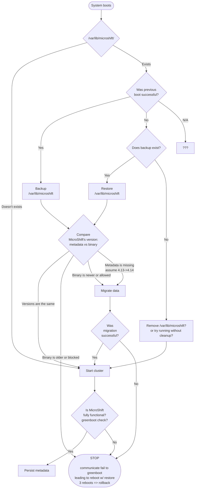

# MicroShift updateability in libostree based systems

## Summary

This enhancement focuses on high level overview of updating
MicroShift running on libostree based systems such as RHEL 4 Edge.
Enhancement covers backup and restore of MicroShift data,
version migration (upgrade and downgrade) of MicroShift and 
its consequences (migration of data between schema versions),
and interactions with GreenBoot and operating system.

## Motivation

MicroShift 4.14 is scheduled for general availability (GA).
As GA product, it is expected that it can be updated to
provide security patches, functional updates, and bug fixes
without needing to redeploy.

To allow for such operations, we need to define how we'll
achieve that goal. We can define several areas we need to focus on:
backing up and restoring MicroShift's data, handling version changes
and its consequences such as migrating underlying data between schema
versions, defining a mechanism for allowing or blocking upgrades between
certain version of MicroShift.

### User Stories

* As a MicroShift administrator, I want to safely update MicroShift
  so that I can get bug fixes, new features, and security patches.
* As a MicroShift administrator, I want automated backups of 
  MicroShift data so that I can rollback in case of problems.

### Goals

Goal of the enhancement is to describe implementation roadmap for
integrating MicroShift with libostree and greenboot in order to provide
functionality to:
- safely update MicroShift version (by backing up the data and
  restoring it in case of rollback)
- migrating internal data (like Kubernetes storage or etcd schema) to
  newer version
- block upgrades in case of version bump being too big.

### Non-Goals

* Building allowed/blocked version migration graph
* Handling readiness, and backup and rollback of 3rd party applications
  (although we'll provide guides how to do it)
* Defining updateability for non-libostree systems

## Proposal

### Workflow Description

**MicroShift administrator** is a human responsible for preparing
libostree commits and scheduling devices to use these commits.

1. MicroShift administrator prepares a new libostree commit.
1. MicroShift administrator schedules device to reboot and use new libostree commit.
1. Device boots to new commit.
1. MicroShift takes actions without any additional intervention.

### API Extensions

None

### Implementation Details/Notes/Constraints [optional]

### Risks and Mitigations

<!-- What are the risks of this proposal and how do we mitigate. Think broadly. For
example, consider both security and how this will impact the larger OKD
ecosystem.

How will security be reviewed and by whom?

How will UX be reviewed and by whom?

Consider including folks that also work outside your immediate sub-project. -->

### Drawbacks

<!-- The idea is to find the best form of an argument why this enhancement should
_not_ be implemented.  

What trade-offs (technical/efficiency cost, user experience, flexibility, 
supportability, etc) must be made in order to implement this? What are the reasons
we might not want to undertake this proposal, and how do we overcome them?  

Does this proposal implement a behavior that's new/unique/novel? Is it poorly
aligned with existing user expectations?  Will it be a significant maintenance
burden?  Is it likely to be superceded by something else in the near future? -->

## Design Details

### Definitions:
- **Rollback**: going back from commit N to N-1, due to greenboot assessing system to not be functional
- **Upgrade**: running newer version of MicroShift than previously (e.g. in previous boot)
- **Downgrade**: running older version of MicroShift than previously (e.g. in previous boot)
- **Backup**: backing up `/var/lib/microshift`
- **Restore**: restoring `/var/lib/microshift`

### Preface

Every action related to procedure described in this enhancement is performed on system start,
rather than on shutdown. **TODO: Why**

Actions other than greenboot's check, and green and red scripts are 
performed with MicroShift cluster being completely offline or 
in a state of partial functionality (only etcd and kube-apiserver running).

### Integration with greenboot

Depending on result of greenboot's healthcheck either "green" (successful boot) or "red" (unsuccessful) scripts are executed before rebooting the system.
MicroShift will integrate with that system to persist an action to perform on next boot:
- "green": on next boot, before MicroShift starts, make a backup of MicroShift's data
- "red": on next boot, before MicroShift starts, restore MicroShift's data from backup

### Backup and restore of /var/lib/microshift

Decision whether to backup or restore is based on metadata persisted by green or red script.

As a result of investigation and aiming for simplicity for initial implementation,
it was decided that backing up MicroShift's data will be done by leveraging using copy-on-write (CoW) functionality.

CoW is a feature of filesystem (supported by XFS and Btrfs) and it can be used by providing a `--reflink=` param to `cp` option.
`--reflink=auto` will be used over `--reflink=always` to gracefully fall back to regular copying on filesystems
not supporting CoW (ext4, ZFS).
Backup will be done in `/var/lib/microshift.bak` or similar - it needs to be within the same filesystem/mount.
Only one backup will be kept. Consequent boots will overwrite the backup dir.

End user documentation needs to include guidance on setting up filesystem to fullfil requirements for using copy-on-write (e.g. making sure some filesystem options are not disabled).

### MicroShift version persistence

When "pre-run" process is finished successfully and MicroShift is started,
it will persist version stored in a binary to a file in MicroShift data dir.

By persisting version, upon next boot, a decision can be made whether a storage migration should be performed or not, or stop MicroShift from running at all in case of "version downgrade".

### Allowing and blocking upgrades (change of MicroShift version)

Decision to allow or block an upgrade (change) will be based on persisted MicroShift version.
- If binary's version is newer, allow storage migration.
- If binary's version is older, refuse to start MicroShift.
- If persisted version is on a list (embedded in binary) of blocked version migrations, refuse to start MicroShift.
- If persisted version is on a list (embedded in binary) of allowed version migrations, allow storage migration.
- If persisted version is missing and version of binary is 4.14, assume 4.13 was persisted and allow storage migration.

### Data migration

Data migration shall include:
- Storage version - update of Kubernetes objects by reading Resource in older version and writing newer version
  - Leveraging existing [Kube Storage Version Migrator](https://github.com/openshift/kubernetes-kube-storage-version-migrator) and [its Operator](https://github.com/openshift/cluster-kube-storage-version-migrator-operator).
- etcd schema - comparing v2 and v3, most likely if/when etcd v4 is released
  - etcd project documents how to migrate from v2 to v3, but we'll also ask OpenShift etcd team for guidance.

### Open Questions [optional]

- Do we want to persist libostree commit ref in the metadata?
  - Can we make some part of the process safer, more robust, by comparing previous and current commit ref?
  - Are we good with having previous boot MicroShift version persisted?
- If green/red info is not persisted, and it's not a first boot (/var/lib/microshift exists), what should we do?
  - Compare versions (metadata vs binary)
    - Same - start cluster
    - Different - refuse to start? Try to migrate (but create backup before)?

### Test Plan

TODO

<!-- **Note:** *Section not required until targeted at a release.*

Consider the following in developing a test plan for this enhancement:
- Will there be e2e and integration tests, in addition to unit tests?
- How will it be tested in isolation vs with other components?
- What additional testing is necessary to support managed OpenShift service-based offerings?

No need to outline all of the test cases, just the general strategy. Anything
that would count as tricky in the implementation and anything particularly
challenging to test should be called out.

All code is expected to have adequate tests (eventually with coverage
expectations). -->

### Graduation Criteria

Functionality needs to be GA in 4.14.

- All areas of functionality implemented and available for usage
- Sufficient test coverage - unit tests (where possible, virtualing/mocking filesystem encouraged), integration tests, e2e tests (CI, QE)
- End user documentation created

#### Dev Preview -> Tech Preview

N/A

#### Tech Preview -> GA

N/A

#### Removing a deprecated feature

N/A

### Upgrade / Downgrade Strategy

N/A

### Version Skew Strategy

See section "allowing and blocking upgrades".

### Operational Aspects of API Extensions

#### Failure Modes

TODO

<!-- - Describe the possible failure modes of the API extensions.
- Describe how a failure or behaviour of the extension will impact the overall cluster health
  (e.g. which kube-controller-manager functionality will stop working), especially regarding
  stability, availability, performance and security.
- Describe which OCP teams are likely to be called upon in case of escalation with one of the failure modes
  and add them as reviewers to this enhancement. -->

#### Support Procedures

TODO

<!-- Describe how to
- detect the failure modes in a support situation, describe possible symptoms (events, metrics,
  alerts, which log output in which component)

  Examples:
  - If the webhook is not running, kube-apiserver logs will show errors like "failed to call admission webhook xyz".
  - Operator X will degrade with message "Failed to launch webhook server" and reason "WehhookServerFailed".
  - The metric `webhook_admission_duration_seconds("openpolicyagent-admission", "mutating", "put", "false")`
    will show >1s latency and alert `WebhookAdmissionLatencyHigh` will fire.

- disable the API extension (e.g. remove MutatingWebhookConfiguration `xyz`, remove APIService `foo`)

  - What consequences does it have on the cluster health?

    Examples:
    - Garbage collection in kube-controller-manager will stop working.
    - Quota will be wrongly computed.
    - Disabling/removing the CRD is not possible without removing the CR instances. Customer will lose data.
      Disabling the conversion webhook will break garbage collection.

  - What consequences does it have on existing, running workloads?

    Examples:
    - New namespaces won't get the finalizer "xyz" and hence might leak resource X
      when deleted.
    - SDN pod-to-pod routing will stop updating, potentially breaking pod-to-pod
      communication after some minutes.

  - What consequences does it have for newly created workloads?

    Examples:
    - New pods in namespace with Istio support will not get sidecars injected, breaking
      their networking.

- Does functionality fail gracefully and will work resume when re-enabled without risking
  consistency?

  Examples:
  - The mutating admission webhook "xyz" has FailPolicy=Ignore and hence
    will not block the creation or updates on objects when it fails. When the
    webhook comes back online, there is a controller reconciling all objects, applying
    labels that were not applied during admission webhook downtime.
  - Namespaces deletion will not delete all objects in etcd, leading to zombie
    objects when another namespace with the same name is created. -->

## Implementation History

N/A

## Alternatives

TODO 
<!-- Similar to the `Drawbacks` section the `Alternatives` section is used to
highlight and record other possible approaches to delivering the value proposed
by an enhancement. -->

## Infrastructure Needed [optional]

N/A