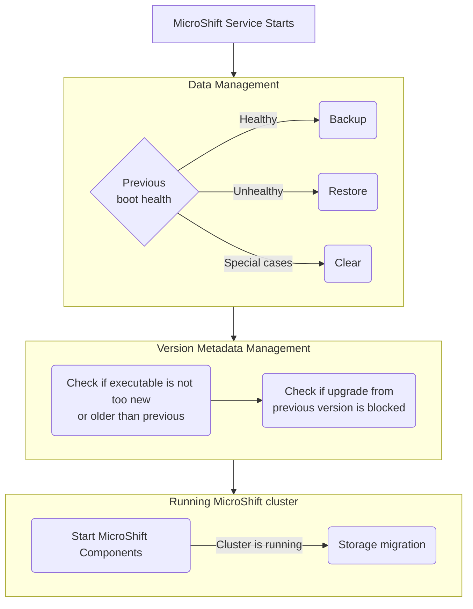

# MicroShift updateability in ostree based systems

## Summary

This enhancement focuses on high level overview of updating
MicroShift running on ostree based systems such as RHEL 4 Edge.
Enhancement covers backup and restore of MicroShift data,
version migration (upgrade and downgrade) of MicroShift and
its consequences (migration of data between schema versions),
and interactions with GreenBoot and operating system.

## Motivation

MicroShift team is working towards a general availability (GA) release.
As GA product, it is expected it can be updated to
apply security patches and bug fixes, and leverage features
in newer version while keeping and using existing data.

MicroShift is intended to be a part of Red Hat Device Edge (RHDE) which is based
on RHEL For Edge (R4E) which is immutable Linux distribution by leveraging
[ostree](https://ostreedev.github.io/ostree/) technology.
It allows changing root filesystem for next boot by staging new deployments or
rolling back to previous one.
ostree is commonly paired with [greenboot](https://github.com/fedora-iot/greenboot)
which provides automated health assessment of the system and trigger a rollback
if rebooting the device doesn't result in device becoming healthy.

Even though, OpenShift does not support downgrade or rollback, MicroShift must
support it in some form to fit into RHDE.
Rollback (going back to older deployment) will be supported only if MicroShift
ran on that deployment and data compatible with that deployment was backed up.
Downgrade (migrating to older version of MicroShift) will not be supported.

In order to integrate into RHDE, MicroShift needs to be augmented with
functionality to back up and restore its data together with ostree deployments,
and refuse or perform data migration to newer storage schema version.
Integration with greenboot will allow system's health to depend on state of the
MicroShift and will provide necessary information to manage backups.

### User Stories

* As a MicroShift administrator, I want to safely update MicroShift
  so that I can get bug fixes, new features, and security patches.
* As a MicroShift administrator, if system running new deployment is unhealthy,
  I want it to roll back to a previous healthy state expecting MicroShift
  cluster (including etcd database) to match the state before upgrade attempt.

### Goals

Goal of the enhancement is to describe implementation roadmap for
integrating MicroShift with ostree and greenboot in order to provide
functionality to:
- Safely update MicroShift version (by backing up the data and
  restoring it in case of rollback)
- Migrating internal data (like Kubernetes storage or etcd schema) to
  newer version
- Block data migration if MicroShift version skew is unsupported

Design aims to implement following principles:
- Keep it simple, optimize later
- MicroShift does not own the OS or host
- MicroShift and all its components (including etcd) are versioned, upgraded,
  and rolled back together
- Be defensive, fail fast
- Rely on outside intervention as a last resort

### Non-Goals

* Building MicroShift upgrade graph
* 3rd party applications' health checks and its data backup or rollback
  (although end user documentation should be provided)
* Defining procedures for backup and restore, and upgrading MicroShift on
  non-ostree systems is left to a future enhancement

## Proposal

### Backing up and restoring MicroShift data

MicroShift needs to fit into workflow of ostree-based systems: device can be
upgraded by staging and booting new ostree deployment, and rolled back if it's
unhealthy or admin wishes to do it.

To achieve that MicroShift needs to make backups and be able to restore them in
sync with ostree lifecycle.
Backing up and restoring will happen on boot, just before MicroShift cluster
runs (for alternative see [Performing backup on shutdown](#performing-backup-on-shutdown))
and with MicroShift cluster (i.e. etcd, kube-apiserver, etc.) not running.
As a general rule: if previous boot was healthy, data will be backed up, if boot
was unhealthy, data will be restored.
If system rolled back, we want compatible and healthy data to be restored,
but, if previous deployment was healthy, after backing up its data.

To provide ability to rollback and restore MicroShift data, backup for each
ostree deployment will be kept on the device.

Backups will be identified by deployment ID and boot ID. Only one backup for
specific deployment will be kept - backups related to older boots will be removed
after successfully backing up the data.
Backups for deployments that no longer are present on the system will be pruned
to keep the disk usage under control.

It is worth noting that although enhancement focuses on MicroShift's data,
backups will be tied to specific ostree deployments.
Linking backups to ostree deployments will ensure that staging and rolling back
is "all or nothing" and MicroShift does not accidentally run applications
belonging to different deployments (especially different might not be MicroShift
itself, but the applications that run on top of it).
Also see [Deciding to backup or restore based on MicroShift health, rather than system's](#deciding-to-backup-or-restore-based-on-microshift-health-rather-than-systems)
alternative.

### Integration with greenboot

greenboot integrates with systemd, ostree, and grub to provide auto-healing
capabilities of newly staged and booted deployment in form of reboot:
if system is still unhealthy after specified amount of reboots, it
will be rolled back to previous ostree deployment.

Because greenboot already exists as an integral part of Red Hat Device Edge
systems, we will integrate with it, rather than creating a new system.

greenboot determines system health using health check scripts and MicroShift
already provides such script. For more information about greenboot and existing
integration see [Integrating MicroShift with Greenboot](./microshift-greenboot.md).
It is worth noting that MicroShift health check for greenboot is part of MicroShift
RPMs, so in case of a bug MicroShift team is able to provide fix with next
release, and health checks do not have to be compatible with other versions of MicroShift.

After health check, either "green" (system is healthy) or "red" (system is unhealthy)
scripts are executed. MicroShift will provide "green" and "red" scripts which
will persist the overall system's health for the current ostree deployment.

Due to how ostree systems are updated (booted into new root filesystem),
MicroShift cannot prevent users from following unsupported upgrade paths.
Instead, version of the data on disk will be compared with version of
the binary and, in case of unsupported upgrade, refuse to proceed causing
system to be unhealthy and eventually rolling back.

### Health of previous boot

Backing up and restoring data will happen on system boot.
It means that next boot makes backup compatible with previously booted
deployment/MicroShift, but it restores data compatible with itself (currently
running deployment).

Decision whether to backup or restore will be primarily based on health of previous boot.
MicroShift will persist system's health, boot ID, and deployment ID on filesystem
to carry the data across boots.

Information about system's health will be obtained by greenboot integration
in form of "green" (system is healthy) and "red" (system is unhealthy) scripts
which will persist the overall system's health for the current ostree
deployment and boot.

### Storing MicroShift version in data directory

MicroShift will persist into a file its X.Y.Z version.
The file will be created or updated after backup/restore phase, very early in
MicroShift start process.

It will be used as a source of truth for decisions regarding:
- blocking or allowing MicroShift start (depending on version skew),
- backing up and restoring data in more nuanced scenarios.

#### Backup technique

MicroShift will perform backup and restore by leveraging functionality
Copy-on-Write (CoW). It is a feature of filesystem and is utilized by
providing a `--reflink=` param to `cp` program.
Because not all filesystems support CoW, we will provide `auto` argument
to `--reflink` so it gracefully falls back to regular copy.

This method was chosen because it's easy to use, doesn't require additional
tools (it's also not impacted by version changes), and should make backing up
fail rarely because by sharing filesystem blocks it's initially very small
(its size increases as original data changes).

To decrease chance of producing corrupted backup (like power loss during the
operation), at first, backups will be made to temporary directory, and then
renamed to final name.

End user documentation needs to include:
- guidance on picking and configuring filesystem to fullfil requirements
  for using copy-on-write,
- warn that in case of missing CoW support, full backup will be made.

#### Backup contents

Entire MicroShift data directory will be backed up, this includes etcd database,
certificates, and kubeconfigs.

- Copying entire etcd working directory will preserve history and other metadata
  that would have been lost when using etcd snapshots.
- Not regenerating certificates on each upgrade will keep them valid. It also
  means that kubeconfigs will continue to work as opposed to needing to obtain
  them again.

### Backup retention

Because a user may stage multiple ostree deployments on a host and boot them in
any order, we will keep multiple backups to ensure that we can roll back to a
state compatible with any ostree deployment existing on the system.

Because we want to minimize the impact of backups on storage requirements,
we will keep only 1 backup per ostree deployment.

### Migrating data between versions

Term "data migration" is referring to process of transforming data from one
schema version to another.

It needs to be aware of following data types:
- Kubernetes storage migration (e.g. from `v1beta1` to `v1`)
  - MicroShift will reuse
    [Cluster Kube Storage Version Migrator Operator](https://github.com/openshift/cluster-kube-storage-version-migrator-operator)
- etcd schema (although it's unlikely in near future)
- Internal MicroShift-specific data

Kubernetes storage migration will run on fully working MicroShift cluster
to allow for migration of Custom Resources which requires webhooks and in
effect fully operational cluster.

Because we want to maintain upgrade expectations with Kubernetes and OpenShift,
data migration will only be supported from Y to Y+1 version (although it might
change if upstream components begin to support greater version skews).

Because we cannot guarantee that the data formats between Y versions are
compatible after an upgrade, going from Y to Y-1 will only be possible when
rolling back to deployment (with older MicroShift) with existing backup.

If MicroShift data directory does not contain version information, it will be
assumed that it was created by MicroShift 4.13 and tested with Y-stream skew
rule.

Because we may need to counteract regressions within a Y version and because
MicroShift is minimal version of OpenShift (so risk of Z-stream incompatibilities
is greatly reduced), at the time of writing the enhancement,
switching between different Z streams will be possible regardless of the
direction (older to newer, newer to older) and anything making this impossible
(like breaking change or backport) should be documented.

Because we may need to block certain upgrade sequences, similar to OpenShift's
upgrade graph, but we cannot ensure access to that upgrade graph from edge
systems and we cannot prevent an attempted upgrade via a new ostree deployment,
we will incorporate a mechanism to block specific upgrades by listing version
numbers _from which_ a new version cannot be upgraded (X.Y+1.Z may include
X.Y.Z in its "block" list).

If start is blocked because of version skew, MicroShift cluster won't start.
If migration fails, healthcheck script will detect that and deem system unhealthy.
Both situations will result in rollback of the system.

Decision flow describing whether to block or allow start of MicroShift migration can be summarized as:
- If version metadata is missing, assume 4.13
- Refuse to start if
  - Version of data is present on list of prohibited migrations
  - Version skew between data on disk and binary is bigger than X.Y+1
  - Y version of binary is older than Y version of data
- Otherwise start the MicroShift cluster

### Workflow Description

**MicroShift administrator** is a human responsible for preparing
ostree commits and deploying them to devices.

Upgrade:

1. MicroShift administrator prepares a new ostree commit
1. MicroShift administrator sets up the device to stage a deployment based on
   newly prepared commit and reboot into it
1. Device boots new deployment
1. Operating System, greenboot, and MicroShift take actions (backing up and/or
   restoring data, migrating the data, causing a rollback, etc.) without any
   additional intervention

Manual rollback:

1. MicroShift administrator rollbacks to or stages an ostree deployment with MicroShift
   that was already running on the device and performs a reboot
1. Staged ostree deployment boots
1. MicroShift will restore the backup matching current ostree deployment
1. MicroShift will run.

### API Extensions

Metadata persisted on filesystem related to the functionality described in this enhancement
is considered internal implementation detail and not an API intended for user.
Schemas and locations of these files are subject to change.

### Implementation Details/Notes/Constraints [optional]

### Risks and Mitigations

Being a GA feature from the beginning the risks are not foreseeing fail scenarios in advance and implementation bugs
that are not caught and fixed through graduation process.

To mitigate the risks, a thorough review of the enhancement must be done by MicroShift, OpenShift, and RHEL teams,
and making sure testing strategy is sound and prioritized equally with the feature development.

Due to nature of Copy-on-Write, initial size of the backup is smallest it can get.
As MicroShift continues to run of and change data directory, due to changes on filesystem,
size of the backup will increase. Systems doing considerable amount of writes to etcd
(only via kube-apiserver; like featuring a lot of operators and CRDs) might b
especially affected.  To address that, we should provide guidance on maintaining
the backups (it might involve manual step by step guide or providing a command
that would prune backup, e.g. ones for deployments that no longer exists on the system).

### Drawbacks

N/A

## Design Details

### Definitions

- **ostree commit**: image containing root filesystem
- **ostree deployment**: commit deployed on a device
  (this document uses both "commit" and "deployment" very loosely as "system image"
  or "root filesystem")
- **Rollback**: booting older (that already ran on the device) ostree deployment -
  either due to greenboot or manual intervention
- **Backup**: backing up MicroShift's data
- **Restore**: restoring MicroShift's data from a backup
- **Data migration**: procedure of transitioning MicroShift's data to be compatible with newer binary
- **Version metadata**: file storing MicroShift's version and ostree deployment ID
- **MicroShift greenboot healthcheck**: program verifying the status of MicroShift's cluster

### General overview of actions order

1. MicroShift binary starts
1. Data management phase (failure will block next phases)
   - Data is backed up, restored, and/or (in special cases) cleared to allow for fresh start
1. Version metadata management
   - Version in data directory and version of MicroShift's executable are compared
     to see if the difference isn't too big or it's not a downgrade
   - If upgrade "data version" to "executable version" is present on the list of
     blocked upgrade paths then MicroShift exits with an error
   - If the version change is valid, version in data directory is updated with executable's version
1. All MicroShift components start - this includes Kubernetes Storage Migrator
   which performs migration of Kubernetes objects and CustomResources

In parallel:
1. greenboot runs MicroShift health check
1. greenboot runs red or green scripts depending on system's health
   - MicroShift provides red/green scripts to persist system's health

### Triggers for greenboot failures

System images can introduce different types of changes, including:
1. New OS content unrelated to MicroShift
2. Different configuration settings for MicroShift
3. Different versions of MicroShift (higher or lower)
4. Different versions of applications running on MicroShift (higher or lower)
5. More, fewer, or different applications

Any of those transitions could result in a greenboot failure.

Because MicroShift cannot detect the cause of the failure, and cannot influence
how greenboot handles the failure, all failures will be handled by reverting
to a previous known-good state for MicroShift's data.

### Staging new ostree deployments on top of unhealthy systems

Fully automated handling of MicroShift data in case of upgrading from unhealthy
system is complicated because admin's intention is unknown and each option has
different trade offs without clear winner.

For that reason, when needing to stage a new deployment on top of unhealthy system
one of two actions must be performed:
- system must be brought to healthy state, or
- MicroShift data should be deleted completely resulting in clean start
  (effectively "first run").

The only exception from this rule is when, from MicroShift's metadata perspective,
previous deployment was unhealthy, but in reality previous deployment (i.e. rollback
according to the ostree) doesn't feature MicroShift.
This special case handles scenarios when device is preinstalled with system
without MicroShift, then deployment with MicroShift runs, but is unhealthy so it
rolls back to factory system, later another deployment with MicroShift is staged
and runs, and it is expected that it will handle stale data gracefully and start
from clean state.

### Workflows in detail

#### Decision tree

##### Backup management

- "Data" refers to MicroShift's data
- _previous deployment_ refers to contents of MicroShift's health metadata
  (therefore only updated when deployment runs MicroShift).
- _Current boot's deployment_ is what currently runs on the device
- _Rollback_ refers to ostree's rollback, i.e. older deployment that will be booted
  if newly staged deployment is unhealthy.
- Not covered "else" conditions will result in error and not starting the cluster.

---

1. If MicroShift data does not exist, but backup for currently running deployment exists:
   **restore the backup and proceed with startup**

1. If MicroShift data does not exist: **proceed with startup**
   > MicroShift is running for the first time on the device.
   > There's nothing to backup or migrate.

1. If data exists but is missing version metadata:
   **Assume it's 4.13, back up the data and proceed with startup**

1. If previous boot was healthy: **backup data for previous boot**

1. If current deployment is different from previous boot's deployment,
   and there is a backup for current deployment:
   **restore the backup for current deployment and proceed with startup**.
   > Existence of backup for "current boot's deployment" means
   > deployment already ran on the device, was healthy, and system has rolled back.

1. If health of previous boot was not persisted: **proceed with startup**
  > (e.g. system was rebooted before health check)

**(Rest of the checks assume that health file contains "unhealthy" status)**

**If deployment ID persisted in health file matches rollback deployment (according to rpm-ostree)**

1. **MicroShift exits with an error**
   > Rollback deployment was unhealthy and upgrade was staged on top of unhealthy system which is not supported.
 
**If deployment ID persisted in health file matches currently booted deployment**

1. If backup for currently booted deployment exists: **restore**

1. If backup for currently booted deployment does not exist

   1. If there is no rollback deployment: **nothing to restore from - proceed with startup**
      > Because there is only one deployment, this reboot was most likely NOT issued by greenboot.

   1. If rollback deployment exists (according to rpm-ostree)

      1. Backup for rollback deployment exists: **restore the backup**
         > Assumes that first boot of newly staged deployment was unhealthy and was rebooted.
         > This gives a chance to again attempt the upgrade flow just like it did on first boot.

      1. Backup for rollback deployment does not exists:
         **nothing to restore from - delete the data and proceed with startup**
         > This might happen if rollback deployment didn't feature MicroShift

**If deployment ID persisted in health file does not match either currently booted or rollback deployments**

1. MicroShift takes a backup of unhealthy data (with "_unhealthy" suffix), removes existing data, and starts fresh.

##### Version management

1. Compare version persisted in metadata (if exists) with MicroShift's binary
   - Binary's `Y` is smaller: **abort and block cluster start up**
   - Binary's `Y` is bigger by more than `1`: **abort and block cluster start up**
   - Version in metadata is present in "list of prohibited migrations:
     **abort and block cluster start up**
1. Create data dir if necessary
1. Create or update metadata (version)

##### Starting the cluster

1. MicroShift starts all of the components
1. Storage migration controller performs a migration

##### Health check

1. Assess health of MicroShift

##### MicroShift's green and red scripts

1. Write system's health to health file

#### Manual interventions

Following section describes scenarios where admin's intervention is needed because:
- system no longer can heal itself by rebooting or rolling back to previous deployment, or
- admin wants to try different system image because current one is unhealthy.

##### Addressing MicroShift's health

Depending on MicroShift's health admin might:
- Unhealthy
  - Delete MicroShift's data to allow fresh start, or
  - Investigate and address problems with MicroShift cluster
- Healthy
  - Keep MicroShift's data
- Unhealthy application running on top of MicroShift
  - investigate and address problems with the app

After resolving the issues, admin should re-trigger greenboot healthcheck.
If admin wishes to migrate from unhealthy system, MicroShift's data should be cleaned up.

##### System is unhealthy after rollback and restoring the backup

Following workflow describes possible admin actions when system rolled back to
previously considered healthy deployment, but even after restoring (healthy) data
it was unhealthy. Because it's a rollback, greenboot won't reboot the device.

1. Rollback deployment boots.
1. _Current deployment_ is different from _previous boot's deployment_
   and backup for _current boot's deployment_ exists, so MicroShift pre run procedure
   restores the backup.
1. MicroShift starts the cluster.
1. System is unhealthy again, but greenboot doesn't reboot the device
   (`boot_counter` is only set when ostree deployment is staged)
1. System requires manual intervention.

   - If the admin addresses the issue
     1. [MicroShift's health](#addressing-microshifts-health)
     1. Other components - admin's judgement
     1. Admin retriggers greenboot health checks, they should pass
     1. Admin reboots the device
     1. Previous boot was healthy - MicroShift backs up the data
     1. MicroShift cluster starts

   - If the admin simply reboots the device without fixing problems
     1. _Current deployment_ is the same as _previous boot's deployment_
        and backup exists, so MicroShift restores the backup
     1. MicroShift cluster starts

##### Deployment pre-loaded to device is unhealthy, admin wants to stage a different one

Device was pre-loaded with a deployment that includes MicroShift.
Because it is the only deployment existing on the device, there's nothing to roll back to.
To address this, admin wants to stage another deployment with MicroShift.

1. Pre-loaded deployment is unhealthy
1. greenboot doesn't perform reboots to heal the device
1. Admin stops the MicroShift
1. Admin removes MicroShift's data
1. Admin stages another deployment and reboots the device
1. New deployment starts
1. There is no existing MicroShift's data, it is like first boot,
   so MicroShift starts the cluster.

##### Admin wants to manually roll back

Both rollback and currently running deployments are healthy,
but admin wishes to roll back to the previous deployment.

1. Second deployment is running and healthy
1. Admin runs `rpm-ostree rollback` command or equivalent and reboot the device
1. Device boots first deployment
1. _Previous boot_ was healthy so data is backed up
1. _Current boot's deployment_ is different from _previous boot's deployment_
   and backup for _current_ exists, so it is restored
1. MicroShift starts the cluster

##### Upgrade from 4.13 failed and system rolled back to 4.13

Following scenario describes failed upgrade from 4.13
and provides information on what should admin do to retry upgrade.

1. Deployment with MicroShift 4.13 is running
1. Admin prepares and stages new deployment that includes newer MicroShift,
   and reboots the device.
1. MicroShift's data exists, but metadata with version is missing,
   so it is assumed that upgrade is from 4.13.
   - Back up 4.13 data
   - If upgrade from 4.13 is supported, then try to migrate the data.
     Otherwise refuse (renders system unhealthy and causes a rollback).
1. MicroShift starts the cluster
1. System ends up unhealthy for any reason. It could be that:
   - Upgrade was blocked or storage migration failed
   - MicroShift was unhealthy
   - Something else was unhealthy
1. Device is rebooted by greenboot
1. Because _previous boot_ was unhealthy,
   there is no backup for _current boot's deployment_,
   _previous deployment with MicroShift_ is the same as _rollback_:
   MicroShift restores backup of _previous deployment with MicroShift_ 
   and attempts to perform the upgrade again.
1. System happens to be consistently unhealthy and rolls back to deployment with 4.13
1. MicroShift cluster starts, we cannot predict if it fails or not
1. Regardless if system is healthy or not, admin still wants to upgrade.
1. Admin manually restores backup compatible with 4.13 and addresses everything
   that might have affected status of upgrade.
1. Admin prepares and stages another deployment with newer MicroShift,
   and reboots the device.
1. MicroShift's data exists, but metadata with version is missing,
   so it is assumed that upgrade is from 4.13.
   - Back up 4.13 data
   - If upgrade from 4.13 is supported, then try to migrate the data.
     Otherwise refuse (renders system unhealthy and causes a rollback).

#### Device runs pre-loaded deployment with MicroShift

Following section describes expected flows when device is running MicroShift
for the first time.

##### First boot of the pre-loaded deployment with MicroShift

1. Device is pre-loaded with deployment including MicroShift and booted.
1. MicroShift's data does not exist, so cluster is simply started.
1. Greenboot performs health checks
1. Depending on system's health
   - System is healthy
     1. [First deployment, second boot (reboot): backup fails](#first-deployment-second-boot-reboot-backup-fails)
     1. [First deployment, second boot (reboot): backup succeeds](#first-deployment-second-boot-reboot-backup-succeeds)
   - System is unhealthy
     1. Greenboot doesn't reboot device (`boot_counter` is only set when ostree deployment is staged)
     1. System requires manual intervention.

##### Device is rebooted (non-greenboot) and it fails to back up the data

Continuation of [First boot of the pre-loaded deployment with MicroShift](#first-boot-of-the-pre-loaded-deployment-with-microshift)
with assumption that system was healthy before the reboot.

1. Devices is rebooted and boots the same deployment
1. Previous boot was healthy, but attempt to back up the data fails,
   cluster doesn't start.
1. Greenboot performs health checks and system is unhealthy.
   Greenboot doesn't reboot device (`boot_counter` is only set when ostree deployment is staged)
1. System requires manual intervention.

##### Device is rebooted (non-greenboot) and backs up data successfully

Continuation of [First boot of the pre-loaded deployment with MicroShift](#first-boot-of-the-pre-loaded-deployment-with-microshift)
with assumption that system was healthy before the reboot.

1. Devices is rebooted and boots the same deployment
1. _Previous boot_ was healthy, so data is backed up.
1. Cluster starts.
1. Greenboot performs health checks.
1. If the system is unhealthy, then it requires manual intervention.

#### Another deployment with MicroShift is staged on the device

Following scenarios assume that first deployment was healthy,
admin prepares and stages (behind the scenes greenboot sets `boot_counter`)
new deployment and reboots the device.

##### New deployment successfully starts

1. _Previous boot_ was healthy, so data is backed up.
1. If MicroShift's version changed, data migration is successful.
1. Cluster starts
1. Greenboot performs health checks.

If the system was unhealthy:
1. Greenboot reboots the system
1. If the system continues to be unhealthy, it will roll back
1. First deployment boots
1. _Previous boot's deployment_ is different from _current boot's deployment_
   and backup for _current_ exists: restore backup
1. Cluster starts

##### Previous deployment was booted only once and and new deployment fails to back up the data

Following scenario assumes that before second deployment previous one was only booted
once.

1. _Previous boot_ was healthy, but backing up data fails. Cluster is not started.
1. Greenboot performs health checks and system is unhealthy, so it reboots the system.
1. _Previous boot_ was unhealthy,
   _previous boot's deployment_ is the same as _current boot's deployment_,
   backup for _current_ does not exist,
   data's version matches _previous deployment with MicroShift_:
   attempt to make a backup of the data but fails again.
1. Greenboot performs health checks.
   System is consistently unhealthy and rolls back to _previous deployment with MicroShift_.
1. _Previous boot_ was unhealthy, so it won't be backed up.
1. _Previous boot's deployment_ is different from _current boot's deployment_,
   but there is no backup for _current boot's deployment_.
1. _Current boot's deployment_ matches data's version so it attempts to back up
   the data and the run using it.
1. If system ends up unhealthy, then it needs manual intervention

#### System rolls back to deployment without MicroShift leaving stale data (FIDO Device Onboarding)

Following workflow addresses scenario when device is preinstalled system without
MicroShift and later deployment with MicroShift is staged. Deployment happens to be
unhealthy which leads to rollback. Then, admin stages another deployment with
MicroShift, which requires it to deal with stale data.

1. Device is pre-loaded at the factory with deployment sans-MicroShift.
1. The device boots at a customer site, FIDO Device Onboarding is performed,
   deployment with-MicroShift is staged and device is rebooted.
1. Deployment with-MicroShift starts
1. There is no MicroShift data yet on the device, so it just starts the cluster.
1. System is unhealthy.
1. Greenboot reboots system multiple times but is consistently unhealthy,
   so device rolls back to sans-MicroShift deployment.
1. Another, new deployment with-MicroShift is staged and device is rebooted.
1. Backup for _current boot's deployment_ does not exist, and deployment 
   persisted in health file is not the rollback deployment:
   **delete the data and start the cluster**.

### Test Plan

#### Unit tests

Implementation in Go should be preferred over bash and new functionality should
be implemented with unit-testability in mind but not at the expense of
maintainability.

#### Functional tests focused on each of the areas (backup, restore, migrate)

Although upgradeability implementation for ostree-based systems has higher
priority than for regular RPM systems, exposing individual functionalities such
as backing up, restoring, or migrating the data should be not expensive in
terms of effort so testing individual areas in isolation might be possible
but it must be assessed if effort is better spent developing end to end tests.

#### End to end tests

Sequences from "Workflows in detail" should be implemented in CI.

### Graduation Criteria

Functionality will be GA from the beginning.

- All areas of functionality implemented and available for usage
- Sufficient test coverage - unit tests (where possible, virtualing/mocking filesystem encouraged),
  integration tests, e2e tests (CI, QE)
- End user documentation created

#### Dev Preview -> Tech Preview

N/A

#### Tech Preview -> GA

N/A

#### Removing a deprecated feature

N/A

### Upgrade / Downgrade Strategy

N/A

### Version Skew Strategy

See [Migrating data between versions](#migrating-data-between-versions).

### Operational Aspects of API Extensions

#### Failure Modes

If backing up, restoring, or migrating the data fails, it block start up of the
cluster, which will lead to unhealthy system and (optionally) rolling back.

It might happen that system requires manual intervention from the admin.
Recommended recovery scenarios should be included in the documentation.

See [manual interventions](#manual-interventions).

#### Support Procedures

See [manual interventions](#manual-interventions).

### Open Questions [optional]

## Implementation History

- [MicroShift Upgrade and Rollback Enhancement](https://github.com/openshift/enhancements/pull/1312)

## Alternatives

### Deciding to backup or restore based on MicroShift health, rather than system's

Although system might be unhealthy due to reasons unrelated to MicroShift,
MicroShift data must be aligned with current ostree deployment at all times.
Therefore decision to backup or restore must be based on overall system health.

Otherwise, if MicroShift is healthy and system is not, MicroShift's
healthcheck would persist backup. This could result in a situation when system
rollback to previous ostree deployment, which might feature different set of
Kubernetes applications running on top of MicroShift resulting in running
application that should not run.

### Performing backup on shutdown

Backing up on shutdown presents bigger set of risks (although individual
severity of the risks was not assessed):

- Greater chance for being killed or shut down happening before backup finishes.
- MicroShift does not provide any alerting, so backup failure could be easily
  missed when happening just before shutdown (next boot start would need to
  handle that).

### Supporting downgrades (going from X.Y to X.Y-1...)

Decision to not support downgrades is based on following:
- Greatly increased effort of maintenance, testing, and more challenges to
  ensure quality with negligible gain
- Binaries cannot be amended after releases, so only way to specify allowed
  downgrades would be by documenting them and requiring administrator to
  consult the documentation.
- Process would be unsymmetrically more difficult than upgrade, consider:
  - Version A supports `v2`
  - Version B supports `v1` and `v2`
  - Version C supports `v1`
  - To downgrade from version A to C
    - Shutdown ostree deployment A, boot deployment B
    - Instruct MicroShift to just downgrade data from `v2` to `v1`,
      without running cluster (to not make migration too long)
    - Persist metadata that version C will accept
    - Shutdown ostree deployment B, boot deployment C
    - MicroShift C would validate metadata to make sure it's compatible
- Consequence of previous bullet - version metadata would need to go beyond
  simple MicroShift version of X.Y.Z to not only tracking versions of all
  resources, but perhaps versions of the embedded components as well.
  It could be a case of internal implementation details that would support
  newer and older behavior in newer version, but result in bugs when going back
  to older version.

### Alternative backup methods

#### Copy-on-write

Pros:
- Underlying blocks are shared, so initially backup takes very little to no additional space
Cons:
- Not supported by all filesystems - requirement needs documenting

#### etcdctl snapshot save/restore

Pros
- Database snapshot is much smaller than copy of database
Cons:
- Saved and restore etcd database doesn't contain whole history
- Would require to ship `etcdctl` increasing footprint of MicroShift
  which doesn't not happen at the moment

#### Creating a tar file with data dir

Pros:
- backup in form of a single file
Cons:
- Without compression is weights as much as data dir

### Symlinking live data to specific deployment data

Instead of making explicit backups, MicroShift could mimic ostree's way of
managing the root filesystem: working directory would be a symlink to directory
specific to ostree deployment.
However this posses some challenges in terms of allowing free "Z-stream traversal"
and if healthy deployments turned unhealthy due to problems with MicroShift's data
there would not be any backup to restore from.

### Pre run procedure being part of `microshift run`

By putting pre run and run procedures together, there would be no way to
specifically signal that pre run failed and block starting the cluster.
Instead, systemd would restart the MicroShift service and possibly result in
inconsistency in "history of deployments".
It is further amplified by the fact that greenboot runs health checks only once,
on start, so it might means that also the data is in unexpected state due to
attempts to migrate the data which might end up with different result than
just after system start. This means that procedures should be robust and
reproducible, not affected by what is current uptime of the system.

## Infrastructure Needed [optional]

N/A

## Future Optimizations

- Reimplement current greenboot health check for MicroShift in Go language as
  `microshift`'s binary separate command to make it more aware of
  "what MicroShift components should be running" in current configuration
  (e.g. optional TopoLVM or future pluggability)
- Support 4.y to 4.y+2 or 4.y+3 upgrades (depends on upgrade strategies
  of upstream components)