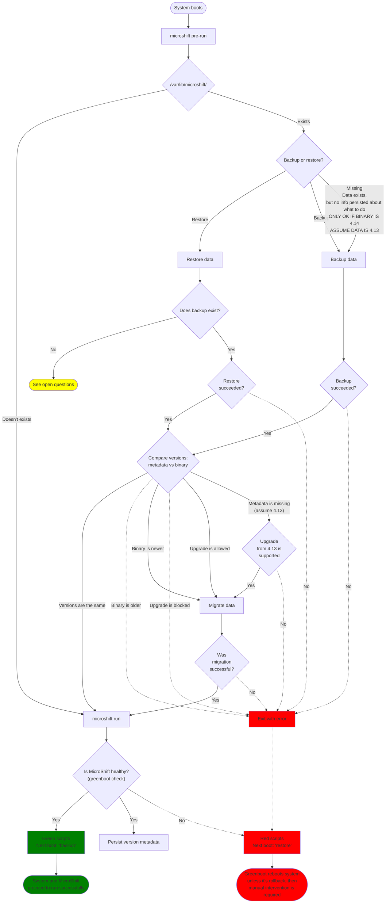

# MicroShift updateability in ostree based systems

## Summary

This enhancement focuses on high level overview of updating
MicroShift running on ostree based systems such as RHEL 4 Edge.
Enhancement covers backup and restore of MicroShift data,
version migration (upgrade and downgrade) of MicroShift and 
its consequences (migration of data between schema versions),
and interactions with GreenBoot and operating system.

## Motivation

MicroShift team is working towards a general availability (GA) release.
As GA product, it is expected that it can be updated to
provide security patches, functional updates, and bug fixes
without needing to redeploy.

MicroShift is intended to be a part of Red Hat Device Edge
which is based on RHEL For Edge which features ostree and as such
provides rollbacks to go back to previous ostree deployment.
Even though, OpenShift does not support downgrade or rollback,
MicroShift must support it in some form. Explicit downgrade 
will not be supported, and rollback will be supported only when
newer ostree commits is unhealthy and backup consistent with previously
ran MicroShift is present.

To allow for such operations, we need to define how we'll
achieve that goal. We can define several areas we need to focus on:
backing up and restoring MicroShift's data, handling version changes
and its consequences such as migrating underlying data between schema
versions, defining a mechanism for allowing or blocking upgrades between
certain version of MicroShift.

### User Stories

* As a MicroShift administrator, I want to safely update MicroShift
  so that I can get bug fixes, new features, and security patches.
* As a MicroShift administrator, I want automated backups of 
  MicroShift data so in case of a greenboot failure system will rollback
  and backup will be restored.

### Goals

Goal of the enhancement is to describe implementation roadmap for
integrating MicroShift with ostree and greenboot in order to provide
functionality to:
- Safely update MicroShift version (by backing up the data and
  restoring it in case of rollback)
- Migrating internal data (like Kubernetes storage or etcd schema) to
  newer version
- Block upgrades in case of version bump being too big

Design aims to implement following principles:
- Keep it simple, optimize later
- MicroShift does not own the OS or host
- MicroShift and all its components are versioned, upgraded, and rolled back together
- Be defensive, fail fast
- Rely on outside intervention as a last resort

### Non-Goals

* Building allowed/blocked version migration graph
* Handling readiness, and backup and rollback of 3rd party applications
  (although end user documentation should be provided)
* Defining updateability for non-ostree systems is left to a future enhancement
* Protecting against data corruption - we rely on file system 
  to maintain the backed up file integrity

## Proposal

### Workflow Description

**MicroShift administrator** is a human responsible for preparing
ostree commits and scheduling devices to use these commits.

Upgrade:

1. MicroShift administrator prepares a new ostree commit
1. MicroShift administrator schedules device to reboot and use new ostree commit
1. Device boots to new commit
1. Operating System, greenboot, and MicroShift take actions without any additional intervention

Manual rollback:

1. MicroShift administrator instructs MicroShift to do a restore on next boot
1. MicroShift administrator stages an ostree deployment with MicroShift
   that was already running and reboots the device
1. Staged ostree deployment boots
1. MicroShift will restore the backup matching current ostree deployment
1. MicroShift will run.

### API Extensions

Metadata persisted on filesystem related to the functionality described 
in this enhancement such as version metadata, next boot action, and any other,
is considered internal implementation detail and not an API to be consumed.
Content (schema) and location of these files are subject to change.

### Implementation Details/Notes/Constraints [optional]

### Risks and Mitigations

Being a GA feature from the beginning the risks are not foreseeing fail scenarios in advance and implementation bugs
that are not caught and fixed through graduation process.

To mitigate the risks, a thorough review of the enhancement must be done by MicroShift, OpenShift, and RHEL teams,
and making sure testing strategy is sound and prioritized equally with the feature development.

### Drawbacks

N/A

## Design Details

### Definitions

- **ostree commit**: TODO
- **ostree deployment**: TODO (Remember, new deployment might include K8s apps not previously running)
- **Rollback**: booting older (that already ran on the device) ostree deployment - either due to greenboot or manual intervention
- **Backup**: backing up `/var/lib/microshift`
- **Restore**: restoring `/var/lib/microshift`
- **Data migration** - procedure of transitioning MicroShift's data to be compatible with newer binary
- **Version metadata**: File residing in MicroShift data dir containing version of MicroShift and ID of ostree deployment
- **MicroShift greenboot healthcheck**: Program verifying the status of MicroShift's cluster

### Preface

Every action related to procedure described in this enhancement is 
performed after system's boot rather than immediately before shutdown. 
Greenboot's healthchecks, green and red scripts are executed independent of MicroShift's processes.
Actions related to backup, restore, and data migration may be performed with MicroShift 
partially running, i.e. only etcd and kube-apiserver are running.

Only one backup of MicroShift data will be stored at a given moment
due to high probability of devices having limited storage.

### Integration with greenboot

[greenboot](https://github.com/fedora-iot/greenboot) is "Generic Health Checking Framework for systemd".
It is used on ostree based systems (like CoreOS, RHEL For Edge, Fedora Silverblue) to assess system's
health and, if needed, rollback to previous ostree deployment.

For more information about greenboot and current MicroShift's integration with it see 
[Integrating MicroShift with Greenboot](https://github.com/openshift/enhancements/blob/master/enhancements/microshift/microshift-greenboot.md) 
enhancement.

In general, greenboot after boot runs scripts that are verifying if system is healthy
and, depending on result, runs either set of green (healthy) or red (unhealthy) scripts.
Healthy system can be also referred to as "green boot", whereas unhealthy as "red boot".

We propose to use "green" and "red" scripts to decide if MicroShift's data 
should be backed up (green) or restored (red). For reasons mentioned in section 
"Alternatives - Performing backup on shutdown" it was concluded that both 
backup and restore should happen on system start, rather than shutdown.
It means that green or red script persists an action that will be performed 
on next boot of the system.

As a consequence, whether the next boot happens to be different or the same
ostree deployment, it will produce a backup compatible with previously booted deployment
and then attempt to perform a data migration if needed.
It also means that consecutive red boots of new ostree deployment will restore the data,
attempt to migrate it, and run MicroShift, i.e. each boot starts from the same place, just
like it would be a first boot of that ostree deployment.
This provides a safety net in case of invalid data migration - it will be attempted again,
on each boot following red boot.

Potential risk is possibility of losing data that might've been produced during window
of MicroShift start and system reboot. However, only applies to MicroShift's data,
because Kubernetes application's data isn't persisted in etcd.

To integrate with greenboot, bash scripts will be placed in `/etc/greenboot/green.d` and
`/etc/greenboot/red.d`.
Depending on code complexity, they may include actual logic or just invoke 
`microshift greenboot {green,red}` commands which would implement the logic.

Both green and red scripts (or programs) will write to `/var/lib/microshift.bak/next_boot`.
The file is outside of MicroShift data directory to reduce number of operations related to 
making a backup by not needing to remove it.

Green will persist following info:
- "backup"
- current ostree deployment id

Red will persist following info:
- "restore"

### Backup and restore of MicroShift data

To integrate fully with greenboot and ostree deployments MicroShift needs to be able to
back up and restore its data.
If new ostree deployment fails to be healthy and system is rolled back to previous
deployment, MicroShift must also roll back in time to data compatible with 
the older deployment.
Because device administrator might want to manually go back to older deployment,
it means that a backup for that particular deployment must be kept until it disappears
from ostree. It results in requirement of keeping backup for each deployment separately
regardless of the MicroShift version they feature.

Because difference between two deployments might not be MicroShift itself, but applications
that run on top of MicroShift, MicroShift's backups are tied to ostree deployments rather 
than MicroShift versions.

Decision whether to backup or restore is based on file persisted during previous boot
(see "Integration with greenboot").
That file will be removed after successful operation of backup or restore.

There might happen situations when backing up data fails, which will block start of MicroShift
and result in redboot. It might that after reboot, there might be no backup to restore from.
**What should we do, before starting MicroShift, in such case is an open question**:
- Delete the data directory
  - It case result in loss of MicroShift data, which might be problematic
    if application used PVC and is given a new one after static manifests are applied.
- Keep the data dir
  - Risking that the problem will continue to happen resulting in manual intervention

As a result of investigation and aiming for simplicity for initial implementation,
it was decided that backing up MicroShift's data will be done by leveraging using 
copy-on-write (CoW) functionality.

CoW is a feature of filesystem (supported by XFS and Btrfs) and it can be used by 
providing a `--reflink=` param to `cp` option.
`--reflink=auto` will be used over `--reflink=always` to gracefully fall back to regular
copying on filesystems not supporting CoW (ext4, ZFS).
Since CoW is backed by filesystem, it works only within that filesystem.

To keep track of which backup is intended for which deployment, backup will be placed in a
directory named after ostree deployment ID inside `/var/lib/microshift.bak/` dir, e.g.
`/var/lib/microshift.bak/rhel-8497faf62210000ffb5274c8fb159512fd6b9074857ad46820daa1980842d889.0`.

If MicroShift starts and notices that data directory exists, metadata doesn't exist,
`next-boot` file is missing, it will be assumed that it's a 4.13 to 4.14 upgrade.
In such case ID of rollback deployment will be used but the automatic rollback will not
work as 4.13 will not include restore capabilities.

Additionally, a symlink `/var/lib/microshift.bak/latest` will point to the most recent
backup. This will allow redboots of staged deployment to restore backup of previous
deployment to use as a starting point (to protect and retry in case of failed data
migration).

Restore operation works the same, just in the other direction - copying contents of 
`/var/lib/microshift.bak/ostree-deploy-id/` to `/var/lib/microshift/`.

End user documentation needs to include:
- guidance on setting up filesystem to fullfil requirements for using copy-on-write
  (e.g. making sure some filesystem options are not disabled).
- remark that in case of missing CoW support, full backup will be made.

### Contents of MicroShift data backup

- Etcd database shall be backed up fully, rather just creating a snapshot to preserve
  history and other data that could be lost.
- Kubeconfigs and certificates needs to be backup and restored in order to keep communication working.
  MicroShift could regenerate them, but it would mean that kubeconfigs used to remotely access cluster
  will become invalid.
  - Following approach might mean that certificates might need to be amended to update the
    Subject Alternative Names (SAN) list.

Based on reasons above, it was decided that whole `/var/lib/microshift` will be backed up.

### MicroShift version metadata persistence

When MicroShift is up and running healthy, green script will persist version into a file 
within data dir, e.g. `/var/lib/microshift/.version`:
```plaintext
4.14.0
```

Value will be used during data migration to decide if
- migration can be skipped,
- migration needs to be blocked,
- migration can be attempted.

Creating the file by green script will indicate what was the MicroShift version that
successfully ran using the data.

### Data migration ("upgrade" or "downgrade")

Data migration is process of transforming data from one schema version to another.
It includes following areas:
- Storage migration - upgrade of Kubernetes objects (e.g. from `v1beta1` to `v1`)
  - It's performed by reading Resource in older version and writing newer version
  - MicroShift will reuse existing 
    [Kube Storage Version Migrator](https://github.com/openshift/kubernetes-kube-storage-version-migrator)
    and [its Operator](https://github.com/openshift/cluster-kube-storage-version-migrator-operator).
- etcd schema - although it's not verify likely in near future
  - etcd project documents how to migrate from v2 to v3, 
    but we'll also ask OpenShift etcd team for guidance.

When new ostree deployment is staged and booted, it might or might not feature different
version of MicroShift. If it's different, it might be newer or older.
To keep process of data migration, its maintenance, testing matrix sane, we'll only allow
data migration in one direction: forward in regards to Y stream.
For now, maximum allowed version skew is Y+1, but it might change in the future depending
on upstream migration rules.

It means that it will be possible to use different Z versions of MicroShift with the same
data unless there's a breaking change making it impossible, in such case it should be documented.

Given above we can define:
- rollback as booting older deployment due to admin actions or unhealthy (red) boot
- upgrade as MicroShift version change from X.Y to X.Y+1 and resulting in data migration
- downgrade as MicroShift version change from X.Y to X.Y-1 (or older) which is unsupported

Both rollback and downgrade maybe look similar in terms of version change,
the difference is that for rollback a matching backups exists,
whereas for downgrade a data migration would have to be performed

Decision to perform or refuse a data migration to schema compatible with newly loaded 
MicroShift version will be based on following facts:
- version persisted in MicroShift's data dir (version that created/successfully ran using the data),
  also referred to as (version) metadata
- version of currently installed MicroShift binary
- embedded in MicroShift binary list of blocked "from" versions

A general flow will have following form:
1. If persisted version is missing, assume 4.13.
1. If version of `microshift` binary is older than version in metadata, **refuse to start MicroShift**.
1. If persisted version is on a list of blocked version migrations, **refuse to start MicroShift**.
1. If binary is the same version as persisted in metadata, **no need for a data migration**.
1. Otherwise attempt to migrate the data.


### Open Questions [optional]

#### Should 4.13 -> 4.14 be supported?
- Even if we handle "no metadata, no backup, existing data, no next-boot-action" and make
  a backup, upon rollback 4.13 won't be able to restore it, so it would try to use 4.14's
  data.
  - Is manual intervention acceptable (admin manually copying backup to data)?
  - We most likely don't want to implement special case for that (`pre-run` would save 
    that persist it was 4.13 previously and red script would restore before shutting down)

#### If green/red info is not persisted, and it's not a first boot (/var/lib/microshift exists), what should we do?
- Compare versions (metadata vs binary)
  - Same - start cluster
  - Different - means that both binaries implement the enhancement,
    so this could be considered a bug.
  - Metadata is also missing
    - Assume data was created by 4.13, do a backup and follow data migration rules

#### When should version metadata file be created
- By the green script
  - Existence of file would indicate that data belongs to healthy deployment
    - What upon reboot? Should file be cleared to be later recreated by green script?
      - Blind assumption `.version exists == healthy data` might be too implicit and lead
        to wrong conclusions
- On start of `microshift run` or shortly after with addition from green and red scripts
  - `{ "version": "X.Y.Z", "status": "unknown"}` would be created at first
  - Green script would change `.status` to `healthy`
  - Red script would change `.status` to `unhealthy`
  - Pros:
    - Explicit
  - Cons:
    - More complicated schema - weak con

#### How should `microshift pre-run` be executed?
- `microshift.service` - `ExecStartPre`
  - No need to add new systemd service files.
  - It will run on each `systemctl restart microshift` which is not desirable (will it run when systemd restarts MicroShift?)
- `microshift-pre-run.service`
  - Running on boot, just once, before `microshift.service`
  - Not repeated on MicroShift restart
  - New service file

#### Should MicroShift healthcheck check and log version skew problems so it's easier to debug?
- Why not?

#### Should backups be kept only for deployments present in ostree command?
- Is it possible that deployment can be reintroduced?
  - I.e. it will have the same id and admin might want to rollback to it?

#### Data exists, action is "restore", but backup does not exists
- It's different from scenario where backup exists, but it fails to be restored
- See flows below for more context:
  - ["Rollback to first deployment, failed restore"](#rollback-to-first-deployment-failed-restore)
  - ["Fail first startup, FDO (FIDO Device Onboard) deployment"](#fail-first-startup-fdo-fido-device-onboard-deployment)
- Note: this logic is part of `microshift pre-run` which exit code will affect if 
  `microshift run` executes or not
- Ideas so far:
  - Remove the data and allow for `microshift run`
    - Potential data loss?
      - MicroShift data is not a biggest problem, it would be more of an inconvenience
        due to cert regeneration, but static manifests will be applied again
      - Bigger impact: customer's app loosing reference to PVC it was using
        - This is also loaded scenario, because if we restore, everything should restore
          so app shouldn't rely on "future" (from its version perspective) data
        - Let's assume that thin-snapshot is made, and the same PVC goes across ostree
          deploys. Rollback/restore would restore thin-snapshot, so app should be
          just where it was before upgrade, but now it's given a new PVC because TopoLVM
          relies on in-cluster data which was wiped.
  - Keep the data and allow for `microshift run`
    - Scenario: MicroShift attempting to use incompatible (newer) data - **not possible (in theory)**
      - 1st deployment only ran for 1 boot, so it's up for the 2nd deployment to make its backup
      - 2nd ostree deployment is staged, booted, etc.
      - backup fails
        - redboot -> restore
        - there's nothing to restore, back to start of the open question
      - backup succeeds, data is migrated, MicroShift starts, system ends up unhealthy
        - redboot -> restore
        - on every following boots will restore (because there's backup) -
          **(Side question: how do we restore a backup not belonging to THIS deployment?
            It is now in dir named after PREVIOUS ostree deployment id. Creation datetime?)**
        - eventually rolled back to 1st deployment, backup IS there,
          so this isn't the question at hand
    - Given ^, the data will be compatible with rolled back deployment
      and it must be a good data because system was healthy (green -> "backup")
  - Fail to start because of "restore without backup"
    - **Not acceptable in scenario FIDO**
    - In FIDO example, data should be cleaned up.
      - How can we plug into this?
        - **IDEA 1**<br>
          Maybe plug into systemd with `Before=ostree-finalize-staged.service` 
          and when triggered cleanup "restore" status?
          (But it means it would have to be present in the sans-MicroShift deployment
          which wouldn't happen)
          - If new deployment is staged, and we have "restore" action, 
            then clear the action so MicroShift will "just run"?
          - Or, if new deployment is staged, and we have "restore" action,
            then clear the action AND clear MicroShift data (stop/kill first)?
        - **IDEA 2**<br>
          What if `red` script would inspect grub env vars for `boot_counter`
          - `boot_counter == 0` means system will shortly rollback, so:
            - check if backup exists for rollback deployment (based on rpm-ostree output)
            - check if "backup for rollback deployment" doesn't exist, then
              don't persist `restore` (empty next_boot file)
            - check if rollback deployment contains MicroShift RPM
              - if not, delete MicroShift data
              - otherwise keep the data (because it's still should be correct with 
                rollback deployment, because backup wasn't made, so the data migration 
                didn't run)
          - `boot_counter > 0`
            - keep old behavior: just persist `restore`?
            - or have the same logic as above - `restore` only if there's a backup 
              to restore from?
              - [Data exists, action is missing (not persisted or removed), backup does not exists](#data-exists-action-is-missing-not-persisted-or-removed-backup-does-not-exists)
          - `boot_counter` is missing
            - it means it's not a deployment that was staged, so it might be the 1st
              deployment
            - it also means, there will be no reboots and system will require manual
              intervention
            - so it's up to admin to investigate and resolve the issues
              - if issue happens to be failing MicroShift, admin should delete the data
                before rebooting
              - otherwise data can be kept
            - either way, neither backup nor restore should be persisted for next boot action
              - [Data exists, action is missing (not persisted or removed), backup does not exists](#data-exists-action-is-missing-not-persisted-or-removed-backup-does-not-exists)
            - given [FIDO scenario](#fail-first-startup-fdo-fido-device-onboard-deployment)
              it means that rollback deployment might not have MicroShift scripts,
              so our red script would need to make a decision based on:
              - does backup exists for rollback deployment
              - does rollback deployment feature MicroShift RPM
                - if it does and it's 4.13 then we need extra logic on top to make data
                  compatible for -> 4.13 -> 4.14 scenario (so 4.14 assumes correctly it
                  migrated from 4.13)
- To not have a backup to restore, making back up must fail?
  - Failed backup -> failed greenboot -> red script -> "restore"
    - Can we break that chain?

#### Data exists, action is missing (not persisted or removed), backup does not exists
- In this scenario, we lack the information about health of previous boot, but 
  we know there was a previous boot because data exists
- If we end up supporting upgrade 4.13 -> 4.14, this is what will happen as first thing.
  - In case of 4.13 -> 4.14, metadata will also be missing
- Missing action, missing backup, missing metadata - expected for 4.13 -> 4.14
- For other migrations:
  - Missing metadata == MicroShift wasn't healthy on previous boot
  - Missing action - this is related to one of the solutions proposed in 
    ["Data exists, action is "restore", but backup does not exists"](#data-exists-action-is-restore-but-backup-does-not-exists)
    
### Workflows in detail

#### Manual interventions - 1st deployment or rollback (no more greenboot reboots)

##### Addressing MicroShift's health

1. Depending on MicroShift's health admin might:
   - unhealthy
     - delete MicroShift's data, to allow fresh start
     - investigate and address problems with MicroShift cluster
   - healthy
     - keep MicroShift's data
   - unhealthy application running on top of MicroShift
     - investigate and address problems with the app, and restart the device to re-trigger
       greenboot checks

##### Backup exists, restore succeeds, but system is unhealthy

> Scenarios:
> - System was rolled back to 1st deployment (no more greenboot reboots) 
>   and action is `restore`
> - 1st and only ostree deployment with MicroShift:
>   - 1st boot OK, **manual** reboot
>   - 2nd boot: backup, system NOK, **manual** reboot
>   - 3rd boot: restore, system NOK

1. `microshift pre-run`
   - Data restored
   - Exits with success
1. `microshift run`
1. System or MicroShift are unhealthy
1. Red scripts
   - Persist action: restore
1. Greenboot doesn't reboot device because `boot_counter` is only set when ostree deployment is staged
1. System requires manual intervention

   - Admin simply reboots the device
     1. 1st ostree deployment boots
     1. `microshift pre-run`
        - Data exists
        - Backup exists
        - Action: restore
     1. `microshift run`
     1. It might be green or red again, so back to the beginning of the flow

   - Admin addresses the issue
     1. [MicroShift's health](#addressing-microshifts-health)
     1. Other components - admin's judgement
     1. Reboots the device

##### Backup exists, restore fails, so MicroShift is unhealthy

> Scenarios:
> - System was rolled back to 1st deployment (no more greenboot reboots) 
>   and action is `restore`
> - 1st and only ostree deployment with MicroShift:
>   - 1st boot OK, **manual** reboot
>   - 2nd boot: backup, system NOK, **manual** reboot
>   - 3rd boot: restore, system NOK

1. `microshift pre-run`
   - Restore fails
   - Exits with error
1. `microshift run` is **not executed**
1. MicroShift is unhealthy
1. Red scripts
   - Persist action: restore
1. Greenboot doesn't reboot device because `boot_counter` is only set when ostree deployment is staged
1. System requires manual intervention
1. Admin addresses underlying issues: frees up disk space, fixes permissions, etc.
1. Reboots the device
   - Persisted action is still `restore`, so new attempt will be made on next boot

##### Backup is missing, restore fails, so MicroShift is unhealthy

See open question ["Data exists, action is "restore", but backup does not exists"](#data-exists-action-is-restore-but-backup-does-not-exists)

#### First ostree deployment

##### First boot

1. Device is freshly provisioned
1. 1st ostree deployment boots
1. `microshift pre-run`
   - Data doesn't exist yet
   - Version comparison: nothing to do
   - Action: missing/none - _1st boot, so green/red scripts haven't ran yet_
   - Nothing to migrate
   - Exits with success
1. `microshift run`
1. Alternative scenarios<a name="first-boot-alt"></a>

   - System and MicroShift are healthy
     1. Green scripts
         - `/var/lib/microshift.aux/next-boot` <- backup + deploy id
         - `/var/lib/microshift/.version` <- 4.X.Y
     1. [system is rebooted, backup fail](#reboot-second-boot-backup-fails)
     1. [system is rebooted, backup succeeds](#reboot-second-boot-backup-succeeds)

   - System or MicroShift are unhealthy
     1. Red scripts
         - `/var/lib/microshift.aux/next-boot` <- restore
     1. Greenboot doesn't reboot device because `boot_counter` is only set when ostree deployment is staged
     1. System requires manual intervention.
        See [Manual interventions](#manual-interventions---1st-and-only-deployment-or-rollback)

##### Reboot: second boot, backup fails

> First boot was green, "backup" action was persisted

1. 1st ostree deployment shuts down
1. 1st ostree deployment boots
1. `microshift pre-run`
   - Data exists
   - Action: backup
     - **__Fails due to any reason (disk space, permissions, etc.)__**
   - Exits with error
1. MicroShift doesn't start
1. MicroShift greenboot check fails
1. Red scripts
   - `/var/lib/microshift.aux/next-boot` <- restore
1. Greenboot doesn't reboot device because `boot_counter` is only set when ostree deployment is staged
1. System requires manual intervention.
   See [Manual interventions](#manual-interventions---1st-and-only-deployment-or-rollback)

##### Reboot: second boot, backup succeeds

1. 1st ostree deployment shuts down
1. 1st ostree deployment boots
1. `microshift pre-run`
   - Data exists
   - Action: backup
   - Version comparison: `data.version == binary.version`
   - Data migration not needed
   - Exits with success
1. `microshift run`
1. Alternatives

   - System and MicroShift are healthy
     1. Green scripts
        - Persist action: backup

   - System or MicroShift are unhealthy
     1. Red scripts
        - Persist action: restore
     1. Greenboot doesn't reboot device because `boot_counter` is only set when ostree deployment is staged
     1. System requires manual intervention.
        See [Manual interventions](#manual-interventions---1st-and-only-deployment-or-rollback)

#### Second ostree deployment is staged

Pre-steps:

1. 2nd deployment is staged
1. Greenboot sets `boot_counter`  
1. 1st deployment shuts down
1. 2nd deployment boots

##### Backup succeeds, no MicroShift change, no cluster app change

> No changes are made to MicroShift version or apps running within the cluster, 
> so new ostree deployment might feature unrelated changes or RPMs

1. `microshift pre-run`
   - Data exists
   - Action: backup
   - Version comparison: `data.version == binary.version`
   - Data migration not needed
   - Exits with success
1. `microshift run`
1. Alternatives

   - System and MicroShift are healthy
     1. Green scripts
        - Persist action: backup

   - System or MicroShift are unhealthy
     1. Red scripts
        - Persist action: restore
     1. Greenboot reboots system multiple times (always red boot)
     1. `boot_counter` reaches `-1`
     1. grub boots previous deployment (rollback)
     1. `microshift pre-run`
        - Data exists
        - Action: restore backup matching deployment ID
        - Data migration not needed
        - Exits with success
     1. `microshift run`
        - Whether the boot is green or red - it'll require
          [manual intervention](#manual-interventions---1st-deployment-or-rollback-no-more-greenboot-reboots)
          (no `boot_counter`).

##### First deployment was active only for one boot, backup fails

1. `microshift pre-run`
   - Data exists
   - Action: backup
     - **__Fails due to any reason (disk space, permissions, etc.)__**
   - Exits with error
1. MicroShift doesn't start
1. MicroShift greenboot check fails
1. Red scripts: persist action: restore
1. Greenboot reboots system multiple times (always red boot)
1. `boot_counter` reaches `-1`
1. grub boots previous (1st) deployment (rollback)
1. `microshift pre-run`
   - Data exists
   - Action: restore - but there's no backup
   - See open question [Data exists, action is "restore", but backup does not exists](#data-exists-action-is-restore-but-backup-does-not-exists)
1. `microshift run`

##### MicroShift RPM changed

1. `microshift pre-run`
   - Data exists
   - Action: backup
   - Compare `version` in data dir and binary
     - `data.version` doesn't exist - assume `4.13`
     - `data.version` is on a list of blocked upgrades - blocked
     - Binary is newer by more than 1 Y-stream - blocked
     - Binary is older (at least `Y-1`) - blocked
     - Binary is the same `X.Y` as data - allowed, no need for migration
     - Binary is newer by 1 Y-stream - allowed, run migration

1. `microshift run`
1. _See other flows_

#### Rollback to first deployment, failed restore

1. 2nd deployment boots
1. `microshift pre-run`
   - Data exists
   - Action: backup
   - Version comparison: `data.version == binary.version`
   - Data migration not needed
   - Exits with success
1. `microshift run`
1. System or MicroShift are unhealthy
1. Red scripts, persist action: restore
1. Greenboot reboots system multiple times (always red boot)
1. `boot_counter` reaches `-1`
1. grub boots previous deployment (rollback)
1. `microshift pre-run`
   - Data exists
   - Restore failed for whatever reason
   - Exit with error
1. MicroShift does not run
1. System is unhealthy (red)
1. `boot_counter` is unset (cleared right after boot by greenboot)
1. Manual intervention is required.
   See [Backup exists, restore fails, so MicroShift is unhealthy](#backup-exists-restore-fails-so-microshift-is-unhealthy).


#### Fail first startup, FDO (FIDO Device Onboard) deployment

1. An ostree deployment without MicroShift is installed on the device at the factory.
1. The device boots at a customer site.
1. An agent in the ostree commit performs FIDO device onboarding or a 
   similar process to determine the workload.
1. **1st** ostree deployment with MicroShift installed is staged.
   - greenboot sets `boot_counter`
1. The sans-MicroShift deployment shuts down.
1. The with-MicroShift deployment starts up.
1. `microshift pre-run`
   - No data
   - No backup action
   - No need for data migration
   - Exits with success
1. `microshift run`
1. System is unhealthy
1. Greenboot runs red scripts
   - Set backup mode to "restore"
1. Red boots continue to happen
1. `boot_counter` falls to `-1`
1. grub boots ostree deployment sans-MicroShift
1. The agent stages **2nd** ostree deployment with-MicroShift
   - greenboot sets `boot_counter`
1. The sans-MicroShift ostree commit shuts down
1. The **2nd** ostree deployment with-MicroShift starts up.
1. `microshift pre-run`
   - Data exists (left over of 1st ostree deployment with-MicroShift)
   - Persisted action: restore (left over of 1st ostree deployment with-MicroShift)
   - There is no backup
   - Alternatives
     - Remove the data and allow for `microshift run`, system might end up green or red
     - Keep the data and allow for `microshift run`, system might end up green or red
     - Fail to start because of "restore without backup"
       - **Not acceptable in this scenario - from customer's point of view that's a bug**

See open questions:
- [Data exists, action is "restore", but backup does not exists](#data-exists-action-is-restore-but-backup-does-not-exists)
- [Data exists, action is missing (not persisted or removed), backup does not exists](#data-exists-action-is-missing-not-persisted-or-removed-backup-does-not-exists)

**Visual summary**



### Test Plan

#### Unit tests

Aiming to write as much as possible in Go, we should strive for maximum testability: 
- Separate code paths for planning (e.g. should it do a backup or restore?) 
  and acting (actually perform backup) - e.g. interface with two methods Plan(), Act()
  - This will allow testing decisions and actions separately
  - This will allow easy implementation of --dry-run describing what would happen
- Due to many interactions with filesystem, filesystem abstraction should be investigated
  so unit tests can use in-memory filesystem rather than host's to make testing easier
  and more robust.

#### Functional tests focused on each of the areas (backup, restore, migrate)

Functional tests need to be assessed in terms of effort and impact.

Given that implementation of the enhancement for ostree based systems has significantly
greater priority than implementation for regular RPM systems,
there's little incentive to work on exposing functionalities in form of `backup`, 
`restore`, and `migrate` commands.
By not providing a way to manually trigger these processes, ability to perform functional
tests in isolation might be severely limited or even impossible without entering territory 
of end to end tests.

#### End to end tests

Sequences from "Workflows in detail" should be implemented in CI.

### Graduation Criteria

Functionality will be GA from the beginning.

- All areas of functionality implemented and available for usage
- Sufficient test coverage - unit tests (where possible, virtualing/mocking filesystem encouraged), integration tests, e2e tests (CI, QE)
- End user documentation created

#### Dev Preview -> Tech Preview

N/A

#### Tech Preview -> GA

N/A

#### Removing a deprecated feature

N/A

### Upgrade / Downgrade Strategy

N/A

### Version Skew Strategy

See section "allowing and blocking upgrades".

### Operational Aspects of API Extensions

#### Failure Modes

TODO (For now refer to [manual interventions flows](#manual-interventions---1st-deployment-or-rollback-no-more-greenboot-reboots))

<!-- - Describe the possible failure modes of the API extensions.
- Describe how a failure or behaviour of the extension will impact the overall cluster health
  (e.g. which kube-controller-manager functionality will stop working), especially regarding
  stability, availability, performance and security.
- Describe which OCP teams are likely to be called upon in case of escalation with one of the failure modes
  and add them as reviewers to this enhancement. -->

#### Support Procedures

TODO (For now refer to [manual interventions flows](#manual-interventions---1st-deployment-or-rollback-no-more-greenboot-reboots))

<!-- Describe how to
- detect the failure modes in a support situation, describe possible symptoms (events, metrics,
  alerts, which log output in which component)

  Examples:
  - If the webhook is not running, kube-apiserver logs will show errors like "failed to call admission webhook xyz".
  - Operator X will degrade with message "Failed to launch webhook server" and reason "WehhookServerFailed".
  - The metric `webhook_admission_duration_seconds("openpolicyagent-admission", "mutating", "put", "false")`
    will show >1s latency and alert `WebhookAdmissionLatencyHigh` will fire.

- disable the API extension (e.g. remove MutatingWebhookConfiguration `xyz`, remove APIService `foo`)

  - What consequences does it have on the cluster health?

    Examples:
    - Garbage collection in kube-controller-manager will stop working.
    - Quota will be wrongly computed.
    - Disabling/removing the CRD is not possible without removing the CR instances. Customer will lose data.
      Disabling the conversion webhook will break garbage collection.

  - What consequences does it have on existing, running workloads?

    Examples:
    - New namespaces won't get the finalizer "xyz" and hence might leak resource X
      when deleted.
    - SDN pod-to-pod routing will stop updating, potentially breaking pod-to-pod
      communication after some minutes.

  - What consequences does it have for newly created workloads?

    Examples:
    - New pods in namespace with Istio support will not get sidecars injected, breaking
      their networking.

- Does functionality fail gracefully and will work resume when re-enabled without risking
  consistency?

  Examples:
  - The mutating admission webhook "xyz" has FailPolicy=Ignore and hence
    will not block the creation or updates on objects when it fails. When the
    webhook comes back online, there is a controller reconciling all objects, applying
    labels that were not applied during admission webhook downtime.
  - Namespaces deletion will not delete all objects in etcd, leading to zombie
    objects when another namespace with the same name is created. -->

## Implementation History

- [MicroShift Upgrade and Rollback Enhancement](https://github.com/openshift/enhancements/pull/1312)

## Alternatives

### Using MicroShift greenboot healthcheck to decide whether to backup or restore

Although system might be unhealthy due to reasons unrelated to MicroShift, it cannot
make decision to backup or restore depending on the healthcheck rather than on green/red scripts.
This is because device as a whole must go forward or rollback.

In situation when MicroShift is healthy and system is not, MicroShift's healthcheck would persist
backup. This could result in a situation when system rollback to previous ostree deployment,
which might feature different set of Kubernetes applications running on top of MicroShift
resulting in running application that should not run.

### Performing backup on shutdown

Reasons for backing up MicroShift's data on boot rather on shutdown:
- Smaller risk of backup process being killed or shutdown not waiting for backup to finish,
   therefore greater confidence that backup will happen.
- Easier integration
  - As a part of MicroShift's pre-run procedure (executed just before MicroShift)
    result of backup will be more noticeable because MicroShift won't start
    (as opposed to it failing during shutdown).
  - Running backup on shutdown will require to setup new systemd units that will run before shutdown.
  - Running backup on boot (pre-run) means it could be contained within existing `microshift.service` (as `ExecStartPre`) - but it might make more sense to have separate service file.
- Copy-on-Write was chosen as backup strategy meaning that it won't perform any version specific procedures.
  - Even if such procedures would be executed, in case of MicroShift upgrade, new version must be able to read 
    data of older version in order to perform storage migration.

### Supporting downgrades (going from X.Y to X.Y-1...)

Decision to not support downgrades is based on following:
- Greatly increased effort of maintenance, testing, and more challenges to ensure quality
  with negligible gain
- Binaries cannot be amended after releases, so only way to specify allowed downgrades
  would be by documenting them and requiring administrator to consult the documentation.
- Process would be unsymmetrically more difficult than upgrade, consider:
  - Version A supports `v2`
  - Version B supports `v1` and `v2`
  - Version C supports `v1`
  - To downgrade from version A to C
    - Shutdown ostree commit A, boot commit B
    - Instruct MicroShift to just downgrade data from `v2` to `v1`, without running cluster (to not make migration too long)
    - Persist metadata that version C will accept
    - Shutdown ostree commit B, boot commit C
    - MicroShift C would validate metadata to make sure it's compatible
- Stemming from previous bullet - version metadata would need to go beyond simple MicroShift version of X.Y.Z
  to not only tracking versions of all resources, but perhaps versions of the embedded components as well.
  It could be a case of internal implementation details that would support newer and older behavior in newer version,
  but result in bugs when going back to older version.


### Alternative backup methods

#### Copy-on-write

Pros:
- Underlying blocks are shared, so initially backup takes very little to no additional space
Cons:
- Not supported by all filesystems - requirement needs documenting

#### etcdctl snapshot save/restore

Pros
- Database snapshot is much smaller than copy of database
Cons:
- Saved and restore etcd database doesn't contain whole history
- Would require to ship `etcdctl` increasing footprint of MicroShift
  which doesn't not happen at the moment

#### Creating a tar file with data dir

Pros:
- backup in form of a single file
Cons:
- Without compression is weights as much as data dir

## Infrastructure Needed [optional]

N/A

## Future Optimizations

- Use result of MicroShift's greenboot check to decide on backup/restore next boot.
  - Current implementation uses greenboot's green/red scripts and they have no knowledge what caused unhealthy boot

- Incorporate MicroShift's greenboot check into `microshift` binary as a separate command.
  - It'll get access to source of truth about "what MicroShift components" should run (e.g. optional TopoLVM)

- Supporting 4.y to 4.y+2 or 4.y+3 upgrades