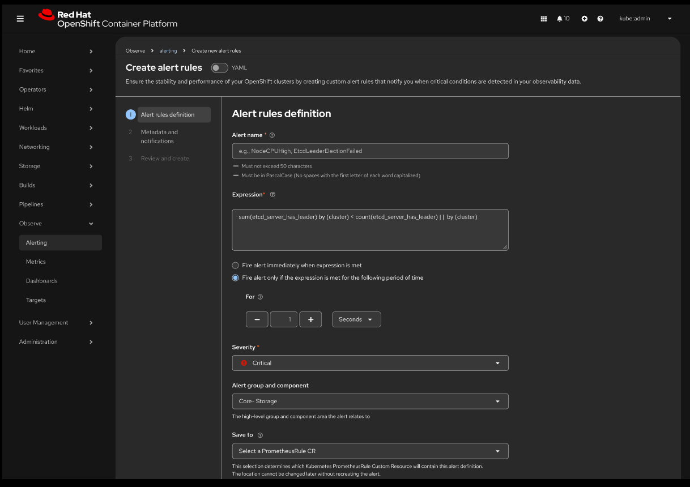

# Managing Alerts in the OpenShift Console

See the [Alerting concepts and terminology](#alerting-concepts-and-terminology) section for a primer on alerting rules and alert instances, the relevant CRDs and label metadata, and the rule types referenced in this document.

## Summary
This feature extends the OCP console to manage alerts end‑to‑end, beyond just Silencing them.
It enable users to create, edit, clone, disable and enable alerting rules.

In addition, It lets us measure health per component, group components by impact `layer` (Cluster, Namespace), and roll those up into an overall cluster health derived from the Cluster components.

## Background

### OpenShift Virtualization operator health labels

This proposal builds on existing OpenShift Virtualization alert conventions that use labels to express alert ownership and alert impact. Those conventions have proven useful for calculating operator health and for presenting alerts with consistent metadata.

In OpenShift Virtualization alerting rules, common labels include:

- `kubernetes_operator_part_of`: identifies the higher-level product or organization that owns the alert (e.g., `kubevirt`)
- `kubernetes_operator_component`: identifies the specific operator or sub-component that reports the alert (e.g., `hyperconverged-cluster-operator`, `kubevirt`)
- `operator_health_impact`: indicates the impact of a firing alert on the operator health calculation (values such as `critical`, `warning`, `none`)

For example, the HyperConverged Cluster Operator sets `kubernetes_operator_part_of=kubevirt` and `kubernetes_operator_component=hyperconverged-cluster-operator` on all its alerts. It also sets `operator_health_impact` on health-related alerts to drive operator health status.

This enhancement focuses on alert management and extends the same philosophy. It makes alert ownership and mutability explicit and consistent so the Console can enable the correct operations for each alerting rule type, such as editing a user-managed rule or disabling a platform operator-managed rule.

This label-based approach has also been accepted and implemented in `cluster-health-analyzer` for incident detection, which classifies firing alerts and groups them into higher-level incidents.

For classification mapping details, see [Alert Rule Classification Mapping and Layer Defaults PR](https://github.com/openshift/enhancements/pull/1917).

For relabeled alerts metrics details, see [Add a relabeled alerts metric PR](https://github.com/openshift/enhancements/pull/1920).

A WIP reference backend/library implementation and demo are available at [monitoring-plugin
/alerts-ui-management](https://github.com/openshift/monitoring-plugin/pull/657/).

## Motivation
- While it's possible to customize built-in alerting rules, as described in the existing [alert overrides](https://github.com/openshift/enhancements/blob/master/enhancements/monitoring/alert-overrides.md) proposal, with the `PrometheusRule` and `AlertRelabelConfig` CRDs, the process is cumbersome and error-prone. It requires creating YAML manifests manually and there's no practical way to verify the correctness of the configuration. Built-in alerting rules and alerts are still visible in the OCP console after they've been overridden.
- Some operational teams prefer an interactive console and API to manage alerts and alerting rules.
- A unified interface will help users create, clone, disable alerting rules or silence alerts, view real‑time firing status and preserve changes across upgrades.

### Problem Statement
Administrators struggle with predefined generic alerting rules that create excessive noise, lack actionable context, and are difficult to configure to match cluster‑specific thresholds, severity levels, and labels.

### User Stories

1. **Disable single or multiple built-in alerting rule**
   As a cluster administrator, I want to disable an out-of-the-box alerting rule permanently, because it's not relevant for my environment (for instance, I don't want to see any alert about resource over-commitment because my cluster is only used for testing).

2. **Replace an existing platform alerting rule by a custom definition.**
   As a cluster admin, I want to disable existing built‑in alert, clone it and adjust its threshold and severity, so that I can tailor default monitoring to suit my team’s SLAs without modifying upstream operators.

3. **Create a custom alerting rule**
   As a cluster admin or developer, I want to create an alerting rule from the OCP console using a dedicated form which allows me to specify mandatory fields (PromQL expression, name) and recommended fields (for duration, labels/annotations such as severity, summary).

4. **Clone an alerting rule based on an existing alerting rule (platform or user-defined)**
   As a cluster admin/developer, I want to clone an alerting rule and update it based on my organization needs.

5. **View silence status on active alerts** - Exists today. Keep Functionality as is.
   As a cluster admin, I want the “Active Alerts” list to show which alerts are currently silenced (and until when),
   so that I have clear visibility into which notifications are suppressed and why.

6. **Create an alerting rule from the Metrics > Observe page** - Currently not in scope
   AS a cluster admin I would like to be able to create an alerting rule directly from the Metrics > Observe page,
   after I used it to tune the expression that I need.

### Goals
1. Add a Console UI for managing alerting rules (definitions) — create, edit, clone, disable/enable — without manual YAML edits to the `PrometheusRule` resource holding those rules.
2. Standardize `component` and `layer` labels on alerting rules to clearly surface priority and impact, to help administrators understand what to address first.
3. CRUD operations on user‑defined alerting rules in the UI and API.
4. Clone platform or user alerting rules to customize thresholds or scopes.
5. Disable/re-enable platform alerting rules by creating/deleting entries in the `AlertRelabelConfig` CR.
6. Create/manage silences in Alertmanager and reflect this in the UI. - Already exists today.
7. Aggregate view of all alerting rules, showing definitions plus relabel context.
8. Aggregate view of all alerts, showing status (Pending, Firing, Silenced) and relabel context.
9. Enforce multi‑tenancy: restrict queries to user’s namespace or cluster scope.
10. Persist user changes through operator upgrades, without modifying existing operators or CRDs.
11. Stay fully GitOps/Argo CD compliant: managed resources must remain commit‑able and, when owned by a GitOps application, appear read-only.

The primary goal is to provide a comprehensive alerting management UI that directly addresses the problems identified through user feedback, research, and competitive analysis. The proposed features are intended to reduce alert noise, provide more actionable insights, and improve the overall user experience for monitoring and responding to issues.

## Proposed Features

#### User Interface
The user interface will be redesigned, with a new **Observe > Alerting** page that highlights new grouping and components functionality.

#### Alerts Tab

**Summary Section**
- The summary section will be expanded by default but can be collapsed.
- It will list each layer's alerts by severity.
- A tooltip will be added to each card to explain the layer's purpose.
- Clicking on a link within the summary will automatically filter the main table by the selected layer and severity (e.g., clicking on the number of critical alerts under 'core' will filter the table by `Layer: Cluster` and `Severity: Critical`).

**Table**
- The table will list all firing alert messages.
- It will have multiple sorting options: primary sort by **Severity**, secondary by **Layer**, and tertiary by **Component**.
- If a user switches to a specific layer tab, the **Component** will become the secondary sort.
- The table will be responsive. On smaller screens, some names will be shortened and the **State** column will be automatically hidden as needed.

**Comprehensive Filtering Capabilities**
- Filters will be available for **Layer**, **Component**, **Severity**, **State**, **Source**, and **Triggered date/time**.
- **Saved filters** will be stored per account and users will be able to save, edit, delete, and arrange the order of the menu.

**Column Management**
- The default columns will be **Alert name**, **Severity**, **Total** (if aggregated), **State**, **Layer**, **Component**, and **Source**.
- The **Alert name** and **Severity** columns cannot be hidden or reordered.

**Alert Rows**
- Alerts will be aggregated by name and severity by default.
- Expanding an alert will show all alerts with the same name and severity.
- Individual alerts will be clickable to view full details.
- Individual alert columns will display **Alert name**, **Severity**, **State**, **Source**, and **Namespace**.
- A **Resource** column with a link to the node resource page will appear for node alerts.

**Actions**
- Actions will be available to **View alerting rule**, **Acknowledge an alert**, and **Silence alert**.
- Additional actions, such as **View logs**, **View metrics**, **See related incident**, and **Troubleshoot**, will be available if the corresponding operator is installed.
- A popover will be shown with a link to the Operator Hub if an operator is not installed.
- All actions will trigger a toast notification upon completion.

**Alert Details**
- Details will be presented in a side drawer, allowing users to navigate between alerts without losing context.
- The side drawer will include a **Details** tab and a **YAML** tab.

**Bulk Actions**
- Users will be able to **Silence selected alerts**.

**Kebab Menu Options**
- The menu will include options to **Generate a summary report** and **Generate a dashboard** (via Perses integration).

#### Management Tab
This tab will include sub-tabs for **Alerting rules**, **Silence rules**, and **Manage layers**.

**Sub-tab: Alerting Rules**

- The table will list **Alerting rule name**, **Severity**, **State**, **Layer**, **Component**, and **Source**.
- It will feature comprehensive filtering capabilities for **Search/Keywords**, **Component**, **Severity**, **State**, **Source**, and the Prometheus rule that the alert is associated with.
- Users will be able to filter by when the alert was triggered (e.g., last hour, today, custom range).

**Create an Alerting Rule**
- This will be a wizard-based process.
- Users can add new components. The layer is chosen from the predefined set of allowed values.
- The "Append to" selection will determine which Kubernetes PrometheusRule Custom Resource will contain the alert definition. It should also include a default layer selection.
- Users can search by namespace or rule name, or create a new Prometheus Rule.
- Expressions will have PromQL autocompletion and a graph showing the results.
- A toast notification will be presented after the action is completed.

**Edit an Alerting Rule**
- For user-defined rules
    - If the PrometheusRule is managed by an operator, the user will only be able to silence the alert.
    - If the PrometheusRule is managed manually, the pre-populated wizard will allow editing all fields.
- For platform-defined rules, the wizard will have limited editable fields.
- A toast notification will be presented after the action is completed.

**Alerting Rule Actions**
- Users can **Disable/Enable** alerting rules using a toggle switch or kebab menu.
- A verification modal will appear when disabling an alerting rule.
- The kebab menu will also offer to **Duplicate** or **Delete** an alerting rule, with a verification modal for deletion.
- Toast notifications will be presented after each action.

**Bulk Actions**
- Bulk actions will include **Disable**, **Edit labels**, **Edit component**, **Silence**, and **Delete**.

**Alerting Rule Side Drawer**
- It will include **Details**, **Active alerts**, and **YAML** tabs.
- The **Details** tab will show the name, description, source, layer, component, labels, severity, expression, and other information.
- The **Active alerts** tab will show a timeline chart and a list of active alerts.

**Column Management**
- By default, the table will show **Alerting rule name**, **Severity**, **State**, **Layer**, **Component**, and **Source**.
- Users can add or remove additional columns like **PrometheusRule**, **Created by**, **Last modified**, and **receivers**.
- The **Alerting rule name** and **Severity** columns cannot be hidden or reordered.

**Sub-tab: Silences**
- This tab will list all silences, whether active, pending, or expired.
- Users can create, expire, delete, or recreate silence rules individually or in bulk.
- The table will show the silence name, state, duration, number of firing alerts being silenced, and the creator.
- Users can create a new silence rule based on alert labels like name, severity, and namespace.
- A toast notification will be presented after the action is completed.

**Sub-tab: Alertmanager**
- This is not in the current scope.

**Sub-tab: Manage Layers**
- Default layers will include **Cluster** and **Namespace**. The **Compute** layer may be introduced based on future requirements.
- The Cluster layer will include components like **control plane nodes**, **etcd**, **network**, and **api server**.
- The Namespace layer will include components like **workload** and **worker node**.
- The ability for users to create additional layers and not rely on platform-created ones is a **Could-Have** feature.

### Non-Goals
- Deep RBAC beyond native Kubernetes permissions.
- Operators reacting to user modifications (operator code remains unchanged).
- Full multi‑cluster federation (initial focus is single‑cluster).

## Related Enhancement Proposals
- https://github.com/openshift/enhancements/blob/master/enhancements/monitoring/alert-overrides.md
- https://github.com/openshift/enhancements/blob/master/enhancements/monitoring/user-workload-monitoring.md

## Alerting concepts and terminology

### Terminology

#### Concepts

- **Alerting rule**: An alert definition. It includes a PromQL expression and an optional `for` duration and labels/annotations. The rule triggers alerts when the expression returns data. It is defined within a `group of a PrometheusRule` resource which are evaluated by Prometheus or Thanos Ruler. For additional details, see [Alerting rules](https://prometheus.io/docs/prometheus/latest/configuration/alerting_rules/).
- **Alerts**: Runtime instances generated by an alerting rule when its condition is met. States include Pending, Firing, and Resolved. Alerts may be silenced in Alertmanager.
- **Platform monitoring stack**: The cluster monitoring stack in the `openshift-monitoring` namespace, managed by the Cluster Monitoring operator. It is meant to collect metrics and evaluate rules from Red Hat certified operators. For additional details, see [Monitoring stack architecture](https://docs.redhat.com/en/documentation/monitoring_stack_for_red_hat_openshift/4.20/html/about_monitoring/monitoring-stack-architecture#understanding-the-monitoring-stack_monitoring-stack-architecture).
- **User-defined monitoring stack**: The user monitoring stack for user workloads. It is meant to collect metrics and evaluate rules from applications in user namespaces. For additional details, see [Monitoring stack architecture](https://docs.redhat.com/en/documentation/monitoring_stack_for_red_hat_openshift/4.20/html/about_monitoring/monitoring-stack-architecture#understanding-the-monitoring-stack_monitoring-stack-architecture).

#### Kubernetes APIs (CRDs)

- **PrometheusRule (CRD)**: Kubernetes Custom Resource (`monitoring.coreos.com/v1`) used to define alerting and recording rules. Used by both platform and user stacks.
- **AlertRelabelConfig (CRD)**: OpenShift Custom Resource to relabel or drop platform alerts without changing upstream rule definitions. Used to disable/enable platform alerts and adjust labels.
- **AlertingRule (CRD)**: OpenShift CRD (`monitoring.openshift.io/v1`) for defining platform-stack alerting rules. This is the supported method for cluster admins to create alerting rules evaluated by the platform monitoring stack. For each `AlertingRule` resource created, a corresponding `PrometheusRule` will be created in `openshift-monitoring`. Only alerting rules are allowed (no recording rules).

#### Rule metadata

- **Labels**: Key/value pairs used for grouping, filtering, and routing.
- **Annotations**: Key/value pairs used for human-readable metadata such as summary and description.
See **Alert rule parameters** for the label keys used by this feature.

### Alerting rule structure

This section shows the common YAML structure of alerting rules in `PrometheusRule` and `AlertingRule` resources.

#### Key components of an alerting rule definition

- **`groups`**: A list of rule groups. A group is evaluated on a configured interval and rules in the same group run sequentially.
- **`name`**: A unique name for the rule group.
- **`rules`**: A list of alerting rules in the group.
- **`alert`**: A unique name for the alert (For example, `InstanceDown`).
- **`expr`**: A PromQL expression that evaluates to true or false.
- **`for`**: How long the condition must be true before the alert fires (For example, `10m`). It is optional and if missing the alert will fire immediately. 
- **`labels`**: Key/value pairs attached to the alert for routing and filtering.
- **`annotations`**: Key/value pairs used for human-readable metadata such as summary and description.

#### Example structure

```yaml
groups:
- name: example-group
  rules:
  - alert: HighRequestLatency
    expr: job:request_latency_seconds:mean5m{job="myjob"} > 0.5
    for: 10m
    labels:
      severity: page
    annotations:
      summary: High request latency on {{ $labels.instance }}
      description: "Latency is {{ $value }}s"
```

### Alerting rule types in scope

- **Platform monitoring stack**:
  - **Operator-managed alerting rules**: Created and managed by Red Hat–supported operators in the platform stack.
  - **Admin-created alerting rules**: Created by cluster admins using an `AlertingRule` CR. The platform monitoring stack evaluates these rules in `openshift-monitoring`.

- **User-defined monitoring stack**:
  - **Operator-managed alerting rules**: Created and managed by operators in user namespaces.
  - **User-managed alerting rules**: Created by users using the `PrometheusRule` CRD in their namespaces.

### Alert rule parameters

The table below clarifies where common alert rule fields come from and whether they are persisted in Kubernetes resources or computed/enriched by the Alerting API. The update mechanism depends on the alerting rule type and is described after the table.

Note: Some labels/fields are **API-only enrichment** (not persisted back into the underlying `PrometheusRule` CR / `AlertingRule` CR objects). These exist to explicitly communicate **ownership and mutability** to the UI, so it can determine which operations are allowed (e.g., edit `expr` vs labels-only edits, disable/enable using an `AlertRelabelConfig` CR, show read-only for GitOps-managed resources) without relying on fragile inference.

| Parameter | Persisted in | Where it comes from |
|---|---|---|
| Alert name (`alert`) | `PrometheusRule` CR / `AlertingRule` CR rule name | Rule name in rule spec. Renaming changes identity. |
| Alert expression (`expr`) | `PrometheusRule` CR / `AlertingRule` CR spec | Rule spec. |
| Alert `for` duration (optional) | `PrometheusRule` CR / `AlertingRule` CR spec | Rule spec. |
| Labels (key/value pairs, including `severity` and other custom labels) | Rule labels and/or `AlertRelabelConfig` CR | Rule labels are key/value pairs used for routing/filtering (for example `severity=critical`, `team=sre`). Platform operator-managed rules can be overridden post-relabel using an `AlertRelabelConfig` CR. |
| Annotations (key/value pairs, e.g. summary/runbook URL) | Rule annotations | Rule annotations are key/value pairs used for human-facing metadata in `PrometheusRule` CR / `AlertingRule` CR. |
| Enabled/disabled (effective) | `AlertRelabelConfig` CR and/or rule resource | Platform operator-managed rules use an `AlertRelabelConfig` CR (drop and restore). User-authored rules change enablement by updating or removing the rule definition. |
| `openshift_io_alert_rule_id` | `PrometheusRule` CR label for user-authored rules, or API-only enrichment | Backend-computed stable identifier for correlating rules and alerts and naming platform `AlertRelabelConfig` entries. For user-authored rules created or updated by the Alerting API, the API writes the computed id into the stored rule. |
| `openshift_io_prometheus_rule_namespace`, `openshift_io_prometheus_rule_name` | API-only enrichment | Added by the Alerting API to identify the originating `PrometheusRule`. |
| Source label (`openshift_io_alert_source`) | API-enriched label | Added/derived by the Alerting API to indicate origin (e.g., platform vs user). Not overrideable. User-provided values are ignored/overwritten. |
| Classification override labels (`openshift_io_alert_rule_component`, `openshift_io_alert_rule_layer`) | Rule labels (or `AlertRelabelConfig` CR for platform operator-managed rules) | Optional rule labels. If present and valid they take precedence over matcher-derived classification. |
| Effective classification (component/layer returned by API) | API-only enrichment | Computed by backend classification logic from rule labels, matcher-derived defaults, and user overrides (classification override ConfigMap/API). |
| `openshift_io_rule_managed_by` | API-only enrichment | Backend-derived metadata indicating who manages the rule (for example `gitops`, `operator`). |
| `openshift_io_relabel_config_managed_by` | API-only enrichment (rules where `openshift_io_alert_source=platform`) | Backend-derived metadata indicating who manages the corresponding `AlertRelabelConfig` CR (for example `gitops`). |

Update mechanism by rule type:

- **Platform monitoring stack**:
  - **Operator-managed alerting rules**: Update the `AlertRelabelConfig` CR. Supported updates include enablement and selected labels. Editing `alert`, `expr`, and `for` is not supported.
  - **Admin-created alerting rules**: Update or delete the `AlertingRule` CR. This results in an updated generated `PrometheusRule`.

- **User-defined monitoring stack**:
  - **User-managed alerting rules**: Update or delete the `PrometheusRule` CR.
  - **Operator-managed alerting rules**: Operator-owned and read-only.

Alert instances are runtime objects derived from rules. They cannot be directly modified. Suppress alert notifications with silences or change how the alert instance is created by editing a related rule or relabel config.

| Alert instance parameter | Where it comes from | Who can update it |
|---|---|---|
| Alert name (`alertname` label) | Derived from the rule name. | Not directly editable. Change the rule name to change it. |
| Alert labels (for example `severity`, `namespace`, custom labels) | Derived from rule labels plus post‑relabel changes. | Same as rule label updates. |
| API-enriched fields (`component`, `layer`, `source`) | Computed by the Alerting API and returned in responses. Not part of the alert label set. | Not directly editable. Changes when underlying rule labels, classification overrides, or relabel config change. |
| Annotations | Derived from rule annotations. | Same as rule annotation updates. |
| State (`pending`, `firing`, `silenced`) | Runtime evaluation + Alertmanager silences. | Users can only change silenced state using Alertmanager silences. |
| Activated time / value | Runtime evaluation. | Not user-editable. |

## Proposal

### Architecture

```
+-----------------------+       OAuth        +---------------------------+
|   Web browser clients |<------------------>|   OpenShift Console UI    |
+-----------------------+                    +---------------------------+
                                                       ^
                                                       |
                                                       v
                                            +---------------------------+
                                            | Console backend / gateway |
                                            +---------------------------+
                                                       ^               ^
                                                       |                \
                                                       v                 \
                                            +---------------------------+ \
                                            |      Alerting API         |  \
                                            |   /api/v1/alerting        |   \
                                            +---------------------------+    \
                                (merges AlertRelabelConfig with Alerts/Rules) \
                                               ^           ^                   \
                                              /            |                    \
                                             v             v                     v
                  +-------------------------+  +-----------------------+  +----------------------+
                  | Kubernetes API Server   |  | Thanos/Prometheus API |  | Alertmanager         |
                  +-------------------------+  +-----------------------+  +----------------------+
                        ^          ^                       ^                          ^
                   CRUD |     CRU  |                       |                          |
                        v          v                       v                          v
               PrometheusRule   AlertRelabelConfig   Alerts/Rules            Silences/Notifications


   Note: Alerts delivery: Prometheus (post‑relabel using AlertRelabelConfig) ---> Alertmanager
```

Key flows:
- Web clients authenticate and access the OpenShift Console UI.
- Console calls the Alerting API to list/manage alerts and rules.
- Alerting API aggregates rule definitions and alert instances with `AlertRelabelConfig` to present a post‑relabel view (labels, disabled status, effective severity) in list/detail endpoints.
- Alerting API reads/writes `PrometheusRule` and `AlertRelabelConfig` using the Kubernetes API.
- Alerting API queries alerts/rules using Thanos/Prometheus.

Rationale for server‑side aggregation:
- Centralizes a canonical, post‑relabel “effective view” and transactional write path: computes the merged state once for all clients and mediates validated, conflict‑aware updates to `PrometheusRule` and `AlertRelabelConfig`, preventing drift and duplicated logic across UIs.
- Improves performance by avoiding client fan‑out and doing normalization and filtering on the server.
- Being implemented in Go, leverages existing expertise and reusable code, accelerating delivery and maintenance.

Note: This component can be implemented as part of the existing console backend/gateway rather than a standalone service. The requirement is server‑side aggregation, not a separate deployment.

### Proposed UI in OpenShift Console

See additional details in the [UX Design- Alerts management](https://docs.google.com/document/d/1bB7kg-W2lLq85Dmy530STMUWJFlNPFvg08Sayc-RwK8/edit?usp=sharing)

- **Management List**: show all alerting rules, filter/sort by name, severity, namespace, status, labels, saved searches


- **Alerts View**: show current firing/pending instances, silence status, relabel context


- **Create/Edit Alerting Rule Form**: fields for Alert Name, Summary, Description, Duration, Severity, Labels, Annotations (runbook links), Group & Component labels
  - In the UI this will surface as Impact(`Layer`) & `Component` labels. `layer` must be one of `cluster` or `namespace`.



- **Bulk create/edit Alerting rules labels Form**: list common labels, Add/remove alert labels.
- **Silences List**: define matchers, duration, comment - Keep

### Additional Points to Consider

**RBAC**
- The approach is to filter alerts based on a user's namespace access.
- Administrators will have an "all namespaces" option.
- The UI will include a dropdown menu for users to select a specific namespace.

**Alertmanager Notifications Improvements**
- Future improvements could include notifications by layer and component type, and notifications per team (RBAC related).

**Multi-cluster View**
- A separate design task (HPUX-795) is in progress for a multi-cluster alerting UI.
- The main difference is the scope of data presented, providing a centralized, aggregated view for a fleet of clusters compared to a single cluster's data.
- Key features for a multi-cluster view include a **Centralized View**, a **Cluster-Specific Context** filter and **Aggregated per Cluster Health View** .

### Topology Considerations

#### Hypershift / Hosted Control Planes
- Alerting API runs in the management cluster. It targets guest clusters using Thanos/Prometheus endpoints exposed by HCP.
- Namespace scoping and source labels remain the same. RBAC aligns to the management console user mappings.

#### Standalone Clusters
- All components (Console, Alerting API, Prometheus/Thanos, Alertmanager) run in-cluster.
- No changes beyond this proposal.

#### Single-node Deployments or MicroShift
- Same APIs.

#### OpenShift Kubernetes Engine
- Feature supported when monitoring stack is installed.

### Feature Prioritization

The features are prioritized using tags: **Must-Have**, **Should-Have**, **Could-Have**, and **Won't-Have**.

**Must-Have Features:**
- Tabs changes (Alerts, Management: Alerting rules, Silence rules)
- Create user-defined alerting rules (Alerting rules definition and Metadata)
- Advanced filtering capabilities
- Bulk actions: disable, edit labels, edit component
- Duplicate and Delete alerting rules
- Incident tab

**Should-Have Features:**
- Add components
- Saved filters
- Alert and alerting rule side drawer
- Add "Resource" column for node alerts

**Could-Have Features:**
- Notifications (alertmanager receivers)
- PromQL expression autocompletion and graph
- "Save as draft" wizard
- Alerting rule history
- Acknowledge alert
- Filter by triggered date/time
- Column management
- Additional alert action items (View logs, Troubleshoot, etc.)
- Generate a summary report
- Generate a dashboard
- Manage layers

**Won't-Have Features:**
- Alertmanager sub-tab

### API Endpoints

Base path: `/api/v1/alerting`

> Note: For native Perses integration, GET endpoints should mimic upstream Thanos/Prometheus APIs (query parameters and response schemas) wherever applicable. This ensures clients expecting Prometheus/Thanos semantics can consume this API without adapters.

Alerting Rule identity

- An alerting rule is uniquely identified by the tuple: `(namespace, prometheusrule, ruleName, specHash)`.
- Canonical opaque identifier used below as `ruleId`:
  - `/namespaces/{namespace}/prometheusrules/{prometheusrule}/rules/{ruleName}/specHash/{specHash}`.
    - `specHash` is server‑generated from the rule spec to ensure uniqueness and stability. It is computed as SHA‑256 (hex, lowercase) of the normalized fields:
      - `expr`: trimmed with consecutive whitespace collapsed
      - `for`: normalized to seconds
      - `labels`: Validate labels `key` and `value` meet Prometheus syntax and character rules, drop empty values, sort by key ascending, join as `key=value` lines separated by `\n`
      - Concatenate the three parts with `\n---\n` separators, then hash the UTF‑8 bytes
    - Clients must treat `specHash` as opaque (do not construct it). When `expr`/`for`/labels change, the server recomputes `specHash` and returns an updated `ruleId`.

** Alerting Rules (definitions)**

| Method | Path                                                  | Description                                                                                              | Notes |
|--------|-------------------------------------------------------|----------------------------------------------------------------------------------------------------------|-------|
| GET    | `/rules`                           | List all alerting rule definitions **(platform and user)**, including `disabled` flags and relabel context. Supports the filter parameters listed below. | **Required** — merges `AlertRelabelConfig` with platform alerting rules.|
| GET    | `/rules/labels`                    | List common labels across selected rules across  **(platform and user)** alerting rules. | **Required** — merges `AlertRelabelConfig` with platform alerting rules.|
| POST   | `/rules`                           | Create a new alerting rule. | User stack: create `PrometheusRule` in the target user namespace. Platform stack (admin): create `AlertingRule` in `openshift-monitoring` (generates a platform `PrometheusRule`). |
| GET    | `/rules/{ruleId}`                  | Fetch a single rule’s full definition and relabel context. | **Required** — merges `AlertRelabelConfig` with platform alert.|
| PATCH  | `/rules/{ruleId}`                  | Update a single rule (platform or user‑defined). | User stack: patch `PrometheusRule`. Platform (admin‑created): patch `AlertingRule`. Built‑in platform rules are updated using `AlertRelabelConfig` (not by editing upstream rules). |
| DELETE | `/rules/{ruleId}`                  | Delete a rule. | User stack: delete `PrometheusRule`. Platform (admin‑created): delete `AlertingRule` (removes generated platform `PrometheusRule`). Built‑in platform rules cannot be deleted. |
| PATCH  | `/rules`                           | Bulk update rules (e.g., severity/status/labels).  | |
| DELETE | `/rules`                           | Bulk delete user‑defined rules. | |

Examples for platform operator-managed alerting rules:

- Disable a built-in platform alerting rule:

```http
PATCH /api/v1/alerting/rules/{ruleId}
Content-Type: application/json

{ "state": "disabled" }
```

The server persists the disablement using an `AlertRelabelConfig` CR (drop).

- Restore a built-in platform alerting rule:

```http
PATCH /api/v1/alerting/rules/{ruleId}
Content-Type: application/json

{ "state": "enabled" }
```

The server restores the original behavior by removing the corresponding `AlertRelabelConfig` customization.

Filter parameters for `/rules`:

- Query format
  - Scalars (single or comma-separated list for OR): `name`, `namespace`, `component`, `layer`, `severity`, `source`, `state`, `has_silenced_alerts`
    - Example: `?namespace=openshift-monitoring`
    - Example (OR within a key): `?severity=critical,warning`
  - Label filters: `label.<key>=<value>` (repeat per key)
    - Example: `?label.team=sre&label.env=prod`
  - Semantics: AND across different keys, OR within a key’s comma list
  - Unknown params are ignored. Invalid values return 400
  - Pagination (server-side):
    - `limit=<int>`: maximum items to return
    - `continue=<opaque>`: cursor for next page (returned by the previous response)
    - Example: `?namespace=openshift-monitoring&limit=50`
  - Sorting:
    - `sort=<field[:asc|desc]>(,<field[:asc|desc]>)*`
    - Example: `?sort=severity:desc,name:asc`
    - Common fields: `name`, `namespace`, `severity`, `layer`, `component`, `source`, `state`

- `name`
- `layer`
- `namespace`
- `component`
- `severity`
- `state` (one of: `enabled`, `disabled`) — rule enablement status. Note: “silenced” is not a rule state.
- `has_silenced_alerts` (boolean) - filter rules that currently have one or more associated alerts silenced. - TBD
- `source`
- `notification_receiver`
- Other alert labels (arbitrary `labelKey=labelValue` pairs)

**Alerts (instances)**

| Method | Path                      | Description                                                                                         | Notes |
|--------|---------------------------|-----------------------------------------------------------------------------------------------------|-------|
| GET    | `/alerts`                 | List alert instances (Pending / Firing / Silenced) with post‑relabel labels. Supports the filter parameters listed below. | Prom-compatible response plus additive fields `alertRuleId`, `component`, `layer`. Merges `AlertRelabelConfig` with platform alerts. See Classification doc. |

Filter parameters for `/alerts`:

- Query format (Prom-compatible, optional filters)
  - Scalars: `state` (one of: `firing`, `pending`)
    - Example: `?state=firing`
  - Label filters (flat keys): any other query key is treated as a label match `key=value` (repeatable)
    - Example: `?namespace=openshift-monitoring&severity=critical&env=prod`
  - Semantics: AND across different keys, exact matches only (no wildcard, no comma‑lists)
  - Response schema is unchanged from Prometheus. No server pagination
  - Examples:
    - `/api/v1/alerting/alerts?state=pending`
    - `/api/v1/alerting/alerts?namespace=openshift-monitoring&severity=critical`

- `name`
- `layer`
- `component`
- `severity`
- `state` (one of: `firing`, `pending`, `silenced`)
- `source` (platform, user-defined)
- `notification_receiver`
- `activated_at`
- Other alert labels (arbitrary `labelKey=labelValue` pairs)

**Health**

| Method | Path        | Description                 | Notes |
|--------|-------------|-----------------------------|-------|
| GET    | `/health`   | Basic health‑check endpoint |       |

### Data Model
- User‑defined alerts: stored as `PrometheusRule` in the selected user namespace.
- Admin‑created platform alerts: stored as `AlertingRule` in `openshift-monitoring` (which generates a `PrometheusRule` there).
- Built‑in platform alert rules: not modified directly. Behavior is adjusted using `AlertRelabelConfig` in `openshift-monitoring` (e.g., disable using `drop`, change labels using `Replace`).

### Flows
- Create/Update/Delete user alerting rule
  - Action: Create/patch/delete a `PrometheusRule` in the target user namespace.
  - Effect: Rule is evaluated by the user‑defined monitoring stack. Alerts are “user” source.

- Create/Update/Delete platform alerting rule (admin‑created)
  - Action: Create/patch/delete an `AlertingRule` in `openshift-monitoring`.
  - Effect: A corresponding platform `PrometheusRule` is generated in `openshift-monitoring` and evaluated by the platform Prometheus. Alerts are “platform” source.

- Update platform alert managed by an operator (built‑in)
  - Action: Create or update an `AlertRelabelConfig` in `openshift-monitoring`.
  - Naming: `arc-<prometheusrule-name>-<hash>`, where `<hash>` is derived from the alert rule id.
  - Traceability: include labels `monitoring.openshift.io/prometheusrule-name`, `monitoring.openshift.io/alertname` and annotation `monitoring.openshift.io/alertRuleId`.
  - Effect: Applies post‑relabel changes (e.g., severity/labels) or disables using `drop`, without editing upstream operator resources.

- Restore built‑in platform alert to original
  - Action: Delete the corresponding `AlertRelabelConfig` in `openshift-monitoring` (same ARC name as above).
  - Effect: Platform alert returns to its original, operator‑managed definition.

- Classification mapping (both stacks)
  - Action: For each `PrometheusRule`, maintain a per‑resource ConfigMap with the alert‑to‑component/layer mapping. The ConfigMap has an owner reference to the `PrometheusRule`.
  - User override: When a user updates a rule’s classification, the corresponding ConfigMap entry is validated, merged, and updated.

### Implementation Details/Notes/Constraints
- Server-side aggregation computes a canonical, post‑relabel view for both stacks.
- `specHash` is treated as an opaque identifier. any change to `expr`/`for`/labels yields a new `ruleId`.
- Bulk updates operate only on supported fields (state, severity, selected labels). Platform built‑in rules are modified using `AlertRelabelConfig` only.
- Resources must remain GitOps-friendly. When a resource is owned by a GitOps app, the UI renders it read‑only, but will provide a view of the updated YAMLs after users updates. 
- Multi-tenancy is enforced by restricting queries and CRUD to namespaces the caller can access.

### Migration
- Existing alerting rules should have an indication of missing recommended labels in the UI.

### GitOps / Argo CD Compliance
- All generated `PrometheusRule` and `AlertRelabelConfig` resources remain declarative and suitable for committing to Git

### Workflow Description

## Pain Points Addressed by this Design
- **Generic and Non-Actionable Alerts:** The design will provide the users a way to update the alerts and customize them to their needs.
- **Alert Noise and Data Overload:** Grouping, advanced filters, and saved filters will help reduce noise and the need for repetitive filtering.
- **Missed Alarms or Missing Data:** Users will be able to create flexible alert definitions directly in the UI to monitor any data type, configure notifications, and link a runbook.

### Risks and Mitigations
- **Performance**: split large rule sets into multiple CRs, benchmark reconciliation latency
- **Complexity**: sensible defaults, UI guidance, limit advanced options in MVP

### Drawbacks
- Additional backend component increases operational surface area and requires SRE ownership.
- Divergence from pure Prometheus APIs for write paths may require documentation and education.
- Potential drift between upstream operator changes and local relabel customizations until detected by admins.

## Graduation Criteria
- **Tech Preview**: Scope, UX, and release `Graduation Criteria` will be defined with the Observability UI team. This enhancement provides the backend APIs and behaviors they consume.
- **GA**: Finalize scope and UX with the Observability UI team. Deliver multi‑namespace filtering, full test coverage, and complete docs.

## Open Questions
1. **Per‑Alert vs. Single‑File**: Should each user‑defined alerting reside in its own `PrometheusRule` file, or group all into one? A customer noted per‑alert files may simplify GitOps/Argo CD maintenance—does that hold true at scale? - Agreed that this would be up to the user to define.
2. **Read‑Only Detection**: Which annotations, labels or ownerReferences reliably indicate GitOps‑managed resources to render them read‑only in our UI?
3. **Concurrent Operator Updates**: How should we handle cases where upstream operators update their own `PrometheusRule` CRs—should we reconcile `AlertRelabelConfig` entries periodically? - [simonpasquier] Replied that, as of now, the cluster admin will need to detect the drift and update their customization.
4. **Multi‑Cluster Extension**: What API or data‑model changes will be needed to support an ACM‑driven, multi‑cluster alerts view in future phases?
5. **Change History**: What should we provide for alerts change history?
6. Do we need a dedicated API for updating labels in Bulk?

## Alternatives (Not Implemented)
- Client-only approach: perform label merging and rule aggregation entirely in the Console. Rejected since its better to do complex computations on the server side.

## Test Plan

**Note:** *Section not required until targeted at a release.*

Consider the following in developing a test plan for this enhancement:
- Will there be e2e and integration tests, in addition to unit tests?
- How will it be tested in isolation vs with other components?
- What additional testing is necessary to support managed OpenShift service-based offerings?

No need to outline all of the test cases, just the general strategy. Anything
that would count as tricky in the implementation and anything particularly
challenging to test should be called out.

All code is expected to have adequate tests (eventually with coverage
expectations).

## Graduation Criteria

**Note:** *Section not required until targeted at a release.*

Define graduation milestones.

These may be defined in terms of API maturity, or as something else. Initial proposal
should keep this high-level with a focus on what signals will be looked at to
determine graduation.

Consider the following in developing the graduation criteria for this
enhancement:

- Maturity levels
  - [`alpha`, `beta`, `stable` in upstream Kubernetes][maturity-levels]
  - `Dev Preview`, `Tech Preview`, `GA` in OpenShift
- [Deprecation policy][deprecation-policy]

Clearly define what graduation means by either linking to the [API doc definition](https://kubernetes.io/docs/concepts/overview/kubernetes-api/#api-versioning),
or by redefining what graduation means.

In general, we try to use the same stages (alpha, beta, GA), regardless how the functionality is accessed.

[maturity-levels]: https://git.k8s.io/community/contributors/devel/sig-architecture/api_changes.md#alpha-beta-and-stable-versions
[deprecation-policy]: https://kubernetes.io/docs/reference/using-api/deprecation-policy/

**If this is a user facing change requiring new or updated documentation in [openshift-docs](https://github.com/openshift/openshift-docs/),
please be sure to include in the graduation criteria.**

**Examples**: These are generalized examples to consider, in addition
to the aforementioned [maturity levels][maturity-levels].

### Dev Preview -> Tech Preview

- Ability to utilize the enhancement end to end
- End user documentation, relative API stability
- Sufficient test coverage
- Gather feedback from users rather than just developers
- Enumerate service level indicators (SLIs), expose SLIs as metrics
- Write symptoms-based alerts for the component(s)

### Tech Preview -> GA

- More testing (upgrade, downgrade, scale)
- Sufficient time for feedback
- Available by default
- Backhaul SLI telemetry
- Document SLOs for the component
- Conduct load testing
- User facing documentation created in [openshift-docs](https://github.com/openshift/openshift-docs/)

**For non-optional features moving to GA, the graduation criteria must include
end to end tests.**

### Removing a deprecated feature

- Announce deprecation and support policy of the existing feature
- Deprecate the feature

## Upgrade / Downgrade Strategy

If applicable, how will the component be upgraded and downgraded? Make sure this
is in the test plan.

Consider the following in developing an upgrade/downgrade strategy for this
enhancement:
- What changes (in invocations, configurations, API use, etc.) is an existing
  cluster required to make on upgrade in order to keep previous behavior?
- What changes (in invocations, configurations, API use, etc.) is an existing
  cluster required to make on upgrade in order to make use of the enhancement?

Upgrade expectations:
- Each component should remain available for user requests and
  workloads during upgrades. Ensure the components leverage best practices in handling [voluntary
  disruption](https://kubernetes.io/docs/concepts/workloads/pods/disruptions/). Any exception to
  this should be identified and discussed here.
- Existing URLs must remain operational across upgrades.
- Micro version upgrades - users should be able to skip forward versions within a
  minor release stream without being required to pass through intermediate
  versions - i.e. `x.y.N->x.y.N+2` should work without requiring `x.y.N->x.y.N+1`
  as an intermediate step.
- Minor version upgrades - you only need to support `x.N->x.N+1` upgrade
  steps. So, for example, it is acceptable to require a user running 4.3 to
  upgrade to 4.5 with a `4.3->4.4` step followed by a `4.4->4.5` step.
- While an upgrade is in progress, new component versions should
  continue to operate correctly in concert with older component
  versions (aka "version skew"). For example, if a node is down, and
  an operator is rolling out a daemonset, the old and new daemonset
  pods must continue to work correctly even while the cluster remains
  in this partially upgraded state for some time.

Downgrade expectations:
- If an `N->N+1` upgrade fails mid-way through, or if the `N+1` cluster is
  misbehaving, it should be possible for the user to rollback to `N`. It is
  acceptable to require some documented manual steps in order to fully restore
  the downgraded cluster to its previous state. Examples of acceptable steps
  include:
  - Deleting any CVO-managed resources added by the new version. The
    CVO does not currently delete resources that no longer exist in
    the target version.

## Version Skew Strategy

How will the component handle version skew with other components?
What are the guarantees? Make sure this is in the test plan.

Consider the following in developing a version skew strategy for this
enhancement:
- During an upgrade, we will always have skew among components, how will this impact your work?
- Does this enhancement involve coordinating behavior in the control plane and
  in the kubelet? How does an n-2 kubelet without this feature available behave
  when this feature is used?
- Will any other components on the node change? For example, changes to CSI, CRI
  or CNI may require updating that component before the kubelet.

### API Extensions

Describe the impact of API extensions (mentioned in the proposal section, i.e. CRDs,
admission and conversion webhooks, aggregated API servers, finalizers) here in detail,
especially how they impact the OCP system architecture and operational aspects.

- For conversion/admission webhooks and aggregated apiservers: what are the SLIs (Service Level
  Indicators) an administrator or support can use to determine the health of the API extensions

  Examples (metrics, alerts, operator conditions)
  - authentication-operator condition `APIServerDegraded=False`
  - authentication-operator condition `APIServerAvailable=True`
  - openshift-authentication/oauth-apiserver deployment and pods health

- What impact do these API extensions have on existing SLIs (e.g. scalability, API throughput,
  API availability)

  Examples:
  - Adds 1s to every pod update in the system, slowing down pod scheduling by 5s on average.
  - Fails creation of ConfigMap in the system when the webhook is not available.
  - Adds a dependency on the SDN service network for all resources, risking API availability in case
    of SDN issues.
  - Expected use-cases require less than 1000 instances of the CRD, not impacting
    general API throughput.

- How is the impact on existing SLIs to be measured and when (e.g. every release by QE, or
  automatically in CI) and by whom (e.g. perf team, name the responsible person and let them review
  this enhancement)

- Describe the possible failure modes of the API extensions.
- Describe how a failure or behaviour of the extension will impact the overall cluster health
  (e.g. which kube-controller-manager functionality will stop working), especially regarding
  stability, availability, performance and security.
- Describe which OCP teams are likely to be called upon in case of escalation with one of the failure modes
  and add them as reviewers to this enhancement.

## Support Procedures

Describe how to
- detect the failure modes in a support situation, describe possible symptoms (events, metrics,
  alerts, which log output in which component)

  Examples:
  - If the webhook is not running, kube-apiserver logs will show errors like "failed to call admission webhook xyz".
  - Operator X will degrade with message "Failed to launch webhook server" and reason "WehhookServerFailed".
  - The metric `webhook_admission_duration_seconds("openpolicyagent-admission", "mutating", "put", "false")`
    will show >1s latency and alert `WebhookAdmissionLatencyHigh` will fire.

- disable the API extension (e.g. remove MutatingWebhookConfiguration `xyz`, remove APIService `foo`)

  - What consequences does it have on the cluster health?

    Examples:
    - Garbage collection in kube-controller-manager will stop working.
    - Quota will be wrongly computed.
    - Disabling/removing the CRD is not possible without removing the CR instances. Customer will lose data.
      Disabling the conversion webhook will break garbage collection.

  - What consequences does it have on existing, running workloads?

    Examples:
    - New namespaces won't get the finalizer "xyz" and hence might leak resource X
      when deleted.
    - SDN pod-to-pod routing will stop updating, potentially breaking pod-to-pod
      communication after some minutes.

  - What consequences does it have for newly created workloads?

    Examples:
    - New pods in namespace with Istio support will not get sidecars injected, breaking
      their networking.

- Does functionality fail gracefully and will work resume when re-enabled without risking
  consistency?

  Examples:
  - The mutating admission webhook "xyz" has FailPolicy=Ignore and hence
    will not block the creation or updates on objects when it fails. When the
    webhook comes back online, there is a controller reconciling all objects, applying
    labels that were not applied during admission webhook downtime.
  - Namespaces deletion will not delete all objects in etcd, leading to zombie
    objects when another namespace with the same name is created.