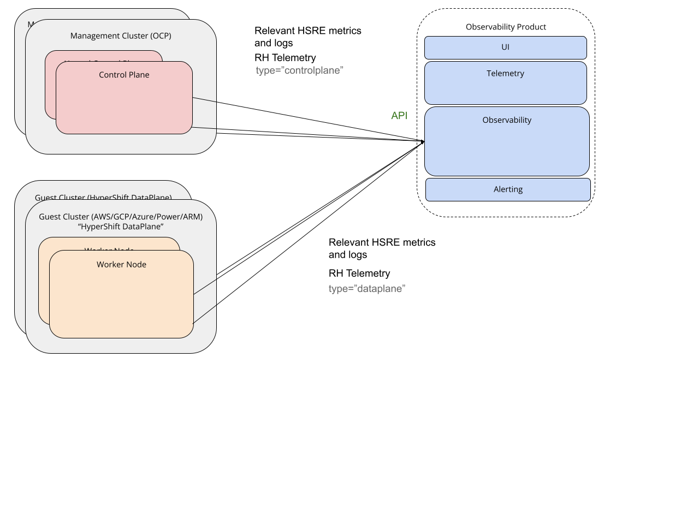
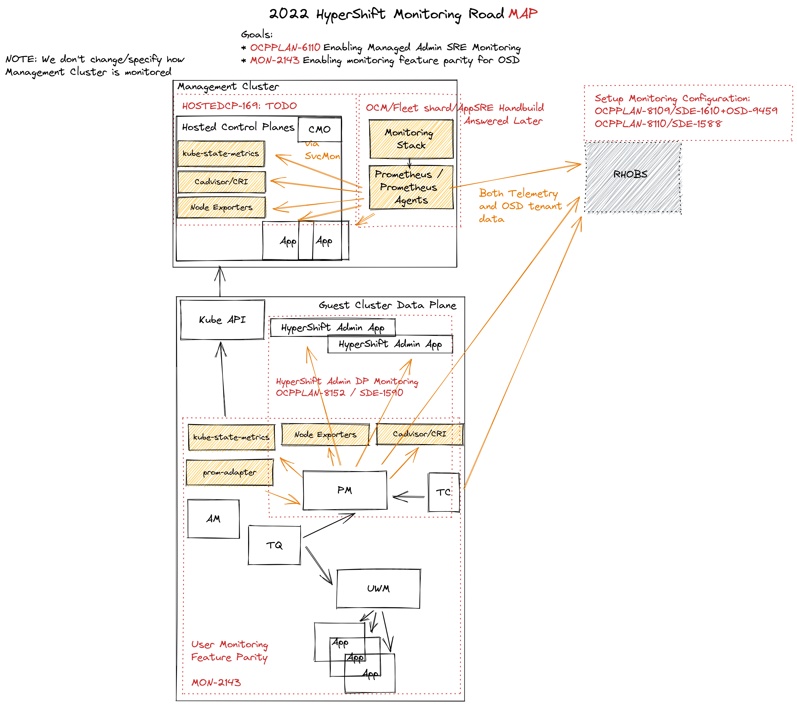
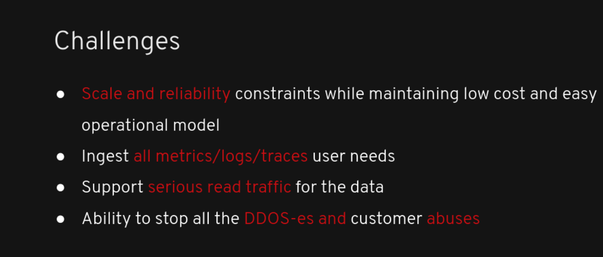
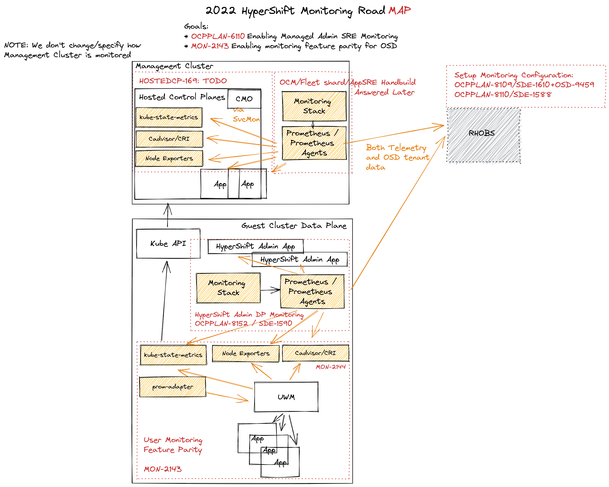
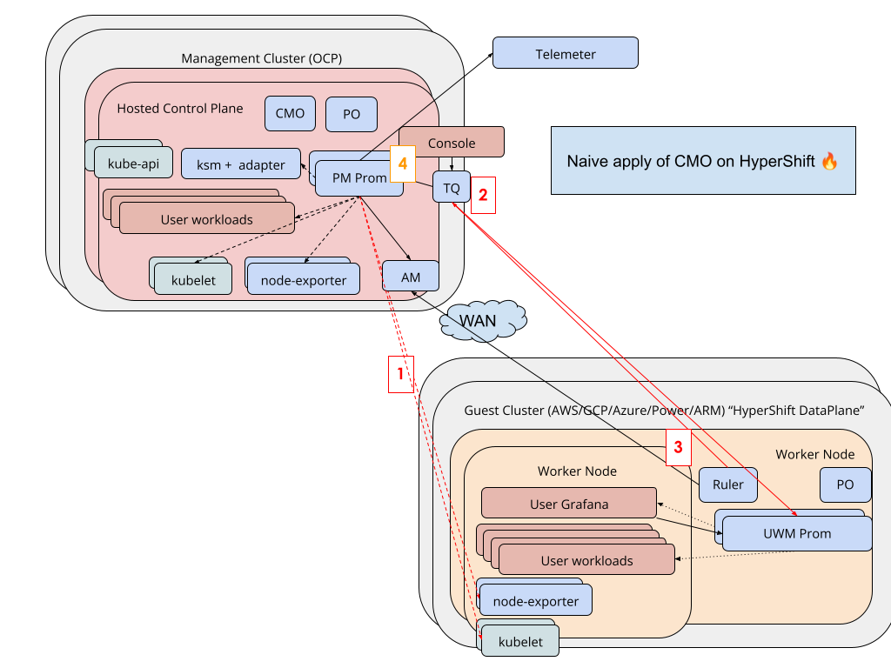

# HyperShift Metrics Monitoring

## Release Signoff Checklist

- [X] Enhancement is `implementable`
- [X] Design details are appropriately documented from clear requirements
- [X] Test plan is defined
- [X] Operational readiness criteria is defined
- [X] Graduation criteria for dev preview, tech preview, GA
- [X] User-facing documentation is created. See [Documentation Required](#documentation-required) for further details.

## Summary

This proposal aims to figure our monitoring case of HyperShift topology. There are three important parts of this proposal:

For HyperShift Admin, we propose to extract metric storage, alerting and querying for Clusters managed by HyperShift to a separate service that can be scaled, deployed and managed in a decoupled mode. This will allow robust multi-cluster, fleet monitoring with best experience possible for cluster admins.
This means SD org, running managed HyperShift will use the RHOBS managed by Observability Group and AppSRE. Metrics from control planes of hosted clusters will be shipped thanks to Monitoring Stacks.

The data plane part of guest clusters requires changes too. In terms of feature parity for users custom or UWM monitoring and HPA we propose to deploy unchanged CMO for smallest changes possible. We also propose using CMO path to gather and send needed monitoring data for HyperShift Admin to RHOBs as well as data-plane telemetry through the usual path.

## Glossary

* HSRE: HyperShift Admin SRE: People that will operate the Hypershift management cluster and its control planes.
* CUS: Customers. People that create clusters that are managed by Hypershift.
* BU: Business Unit. 
* MS-SRE/MT-SRE: Managed Service / Managed Tenant Site Reliability Engineer.
* RHOBS: Red Hat Observability Service.

For additional acronyms, see [Red Hat Dictionary](https://source.redhat.com/groups/public/red-hat-dictionary-or-lexicon/red_hat_abbreviations_acronyms_and_initialisms_dictionary_wiki)

## Background

[HyperShift project](https://github.com/openshift/hypershift) brings certain changes to how OpenShift clusters can be deployed. The 10,000 feet view is to decouple the OCP control plane from the data plane. Control plane components (e.g. etcd, API servers, …) run on an underlay cluster, while worker components run remote on a different infrastructure.

This is similar to how AWS, Google and so on run their managed Kubernetes service: You provide the worker nodes and they provide the control plane.

The core idea of HyperShift topology is that it allows sharing infrastructure on control planes and allows the “hosted clusters” (workers) to have a lower computation and operational overhead.

### Important HyperShift Assumptions

* One-way communication. HyperShift management cluster can “talk to” the data plane, but not the opposite (except Kube API, Ignition and OIDC endpoint).
* HyperShift is managed first, but form factor will be offered for self-management by 4.11.
* There is tight budget on computation for control planes (outside of MVP).

## Motivation

This document enhancement proposes a potential solution for Admin and Customer metric monitoring within those new topologies, since we cannot easily apply our current platform monitoring products using cluster monitoring operator ([CMO](https://github.com/openshift/cluster-monitoring-operator)) (see [Alternatives](#use-pure-platform-monitoring-solution) on why).

### Goals

The goal is to provide a solution that maintains similar monitoring capabilities we offer with single box monitoring using CMO in HyperShift for our three [personas](#personas).

> NOTE: The definition of “monitor” in the bullet list below means ability to graph, query and alert on near-real-time metrics about involved components.

* HSRE can monitor management clusters and control planes running there.
  * Ability to use AlertManager and PagerDuty workflow
  * Ability to monitor Management Clusters
  * Ability to monitor Customer control planes
  * Ability to view fleet-level metrics and drill-downs in a single pane of glass
  * Ability to keep metrics in-region
* HSRE can monitor control-plane related (managed) software on data plane of guest clusters:
  * For example Ingress/Router/CNI/CSI 
  
> Exact list of what is scraped on guest clusters for HSRE is not important at the moment. All we need to know: some service monitors.

* HSRE can query metrics data over SLO period (usually 28 days).
  * Longer durations nice to have, but technically not required. There is also option that allows HSRE to persist SLO from platform to [different backend if needed](https://docs.google.com/document/d/1BJarERppgiJ8esc6d8anbJMOQ0AflFBQea-Zc9wAp0s/edit?disco=AAAAQTFsbwM).
* HSRE have an easy way to monitor dozens of HyperShift clusters in multiple geo regions and thousands of control planes in total. This means in particular:
  * Ability to perform PromQL across fleet metrics
  * No need to tunnel to specific control plane to query metrics
  * Centralized alerting
* CUS can monitor / use HPA/VPA / vis with local console using metrics FROM their workloads on guest clusters or from nodes on guest clusters
  * Container metrics (about their containers).
  * This includes part of Kube State Metrics (Kubernetes metrics) that relate to their workloads.
* BU and DDIS can gather required telemetry using the Telemeter pipeline.

### Non-Goals

* Solve Logging and Tracing needs in this enhancement.
* Provide scalable storage solution for customer metrics. We just want to ensure UWM, their DIY,
console or vendor monitoring does not have major blockers when integrating with this
architecture.
* Describe Managed Services (Addons) monitoring in detail. We assume Managed Services are just “Customer workloads”, where the MTSRE is just a customer. See [What About Addons FAQ](#what-about-layered-service--addons-monitoring) for more details.
* Solve observability challenges brought by KCP. KCP has different trade-offs.
* Provide any other UI than Grafana for our Managed HSRE needs.
* Provide any other querying APIs than Prometheus based on PromQL
* Give customers access to any control plane metrics unrelated to their workloads (this is similar in GKE).
* Provide a solution for non-HyperShift OSD. In fact, the solution for OSD observability is planned to be really similar to HyperShift. 
This is because OSD observability struggles on similar points--inability to aggregate observability data in a cheap way on a global view.
However, since HyperShift has no solution at all, for now starting from HyperShift sounds like a great opportunity.
* Define monitoring for Management Clusters.

## Proposal

### Workflow Description

Workflow is mentioned in Goals above.

### API Extensions

N/A

### Personas

* HyperShift Admin SRE (HSRE): People that will operate the Hypershift management cluster and its control planes. In practice, this means the SD org on our managed solutions.
* Customers (CUS) People that create clusters that are managed by Hypershift.
* Business Unit (BU): Red Hat business unit who is interested in telemetry and data from OpenShift deployments.

### User Stories

[TBD](https://github.com/openshift/enhancements/pull/981#discussion_r765764204)

### Implementation Details/Notes/Constraints

#### Overview

In terms of HSRE persona, we propose to decouple their observability for SRE / Devs for monitoring and troubleshooting purposes with a specific solution like HyperShift, OSD etc going forward.
I explained some rationales in the [Observatorium: Product Agnostic Centralized Observability 2021.10](https://docs.google.com/presentation/d/1cPwac7iNmOFPbEMKE6lcesQCHa2UQXNSJrVo5cW5eRQ/edit) presentation. For those who don't have access or prefer written form, there are few benefits of this:

* The most complex part of monitoring system (storage, querying, alerting) is decoupled from source cluster topology. Using separate "service" allows to avoid expensive integrations to ever-changing topologies and permutations on those, which has complex interactions and constraints.
* Gathering data outside of source clusters allow easier federation, global view and alerting.
* As SaaS, we as a RH, can provide better use experience.
* We can focus on important features going forward (reliability, scalability, correlations etc)

In terms of CUS persona, we will discuss their monitoring in [customer monitoring section](#customer-monitoring-on-data-plane). 

Let's examine how we can achieve such decoupling in HyperShift topology, given standard OCP clusters have local-only monitoring.

> NOTE: We will focus on monitoring specific components in this document, but you will see logging parts on some diagrams. This is because logging can follow exactly the same pattern. Still, we will focus on monitoring (metrics) for now as it’s a bit unique (e.g. alerting part).

#### The Big Picture

For HSRE persona, we propose to send all relevant metrics for HSRE to the "Centralized Observability Product” using well-defined and stable APIs. At this point we call it product because by design this is replaceable component that can be mixed and matched according to the needs.

For example:

* For our Managed HSRE, this can be our RHOBS service.
* For HSREs other than SD members, it can be locally deployed [Observatorium](http://observatorium.io/) or 3rd-party vendor like Grafana Cloud, Amazon or Google Managed Prometheus, Logz.io and others.

A high-level view would look like this:

The model as above allows:

* Metrics Centralization
* Extensibility (e.g. one can choose different Observability Products or switch them on demand).
* Separation of concerns which should result in:
  * Higher velocity of the Observability Product
  * Higher velocity of OSD as the offering has to care less about in-cluster observability flows.
  * Allows managing two products by separate teams without conflicts if one chooses to.

> Note that this does not imply "Centralized Observability Product" to run in a separate cluster and be managed by a separate team. We can mix and match as needed, but strictly for Managed HyperShift use cases we would go for RHOBS service fully managed by Observability Group with AppSRE (SD).

Reasons for choosing RHOBS for our HSRE:

* We can have tighter control on observability budget and spending
* It’s our common, Red Hat responsibility to offer managed OpenShift. If Observability Group + AppSRE will not provide their support and time, the same (or more) effort and money has to be spent on OSD side (or vendor)
* The monitoring Team already manages this service.
  * We already work closely together with AppSRE, tightly integrated with them and familiar with AppInterface.
  * We have devs on-call and SRE mindset.

## Design Details

In details the full design looks as follows:

Let’s take a look at all parts:

1. We don't change the management cluster monitoring itself (out of scope).
2. We propose introducing a new monitoring stack on the hosted control plane to collect metrics from the control plane components and forward them to RHOBS. In terms of implementation we propose to deploy [Monitoring Stack Operator](https://github.com/rhobs/monitoring-stack-operator) that will deploy set of Prometheus/Prometheus Agents that will be sending data off cluster to RHOBS.
No local alerting and local querying will be allowed. Interaction with that data will be fully on RHOBS side. This path will forward both monitoring data as well as part of telemetry relevant for Telemeter to RHOBS.
3. On data-plane we propose running unchanged CMO stack. This allows feature parity for customers. A selected number of platform metrics could be forwarded to RHOBS if needed via remote write (already supported), though proxy on Hosted Control plane.
The unique part is that Platform Monitoring will know NOTHING about master nodes and control plane resources (etcd, control plane operators, Kube services etc). It will only provide "platform" metrics for worker nodes and containers running there. Part of telemetry related to data-plane will be sent through Telemeter client though Hosted Control plane proxy.

### Common Labels

RHOBs generally does not restrict the label semantics you want to use for the monitoring of your workloads. See [Metric Label Restriction page](https://rhobs-handbook.netlify.app/services/rhobs/#metric-label-restrictions) for list of label recommendations.

Probably the most important label to ensure consistency across HyperShift metrics is a label indicating hosted cluster. This is because:

* Telemeter uses `_id`. If we maintain same convention we have easier way to joining data across telemeter and other tenants if needed.
* If we push metrics from both data plane and hosted control planes it is critical to associate those with same cluster, so we can join/view this data uniformly. 

We propose reusing `_id` which is what Telemeter uses. This is also by default propagated in the in-cluster platform monitoring (it takes `_id` from [ClusterVersionSpec](https://github.com/openshift/api/blob/master/config/v1/types_cluster_version.go#L41)), so data from data plane should be already instrumented correctly.

When it comes to hosted control planes we propose for hosted control plane service monitors (or pod monitors) to include relabeling that adds `_id` with corresponding cluster id to each metric. When scraped this label will be attached and propagated to RHOBS.

Additionally, Prometheus/Prometheus Agent pipeline that scrapes and forwards data from Hosted control plane to RHOBS should have external label indicated HyperShift management cluster, so we know which management cluster collected and controlled that hosted cluster. We could add external label called `hypershift_cluster_id` with ID of HyperShift cluster.
This label will be then injected in remote write request to RHOBS.

### Customer Monitoring on Data Plane

As per goals and non-goals we aim to give the CUS ability to scrape data related to their worklodads / hardware / Kubernetes state metrics that is on their data plane. As mentioned in [Non Goals](#non-goals) we don’t want to give or sell anything for scalable, centralized monitoring to customers (yet). Not beyond anything else w provide which is an opinionated UWM, CMO can deploy on normal OCP.

We propose to use similar functionality as before by having CMO in ~unchanged form deploying its resources on data plane in similar fashion as in [OCP](https://docs.openshift.com/container-platform/4.9/monitoring/understanding-the-monitoring-stack.html#understanding-the-monitoring-stack_understanding-the-monitoring-stack).
This allows less changed to already complex CMO, while providing exactly same functionality including HPA, out-of-box platform metircs, custom metrics, custom alerts to HyperShift guest clusters.

### Risks and Mitigations

#### What if RHOBS will not match required feature set, scalability and reliability (in time)?

There are aware of challenges here and the hardest things were presented many times:

To the best of our knowledge, we think we can do it. We were preparing the teams to solve those challenges for the last 3 years or so (since the CoreOS acquisition). This is because:

* Service Delivery organization provides amazing support service for Kubernetes, infrastructure, required SaaS services and CI/CD.
* The monitoring team is active in the development of almost all projects and key dependencies used in the product (Observatorium, Prometheus, Thanos, Cortex, Alertmanager, Loki, etc).
* The majority part of the monitoring team was designed to be on-call for our workload services too in order to provide stricter SLO and better operationality of our software.
* Thanos and Loki were designed for high scale and reliability.
* We have already successfully run the Telemeter service with hundreds of millions of series for last 3 years.
* We optimized new hires for the Observability Platform team for skillsets to solve those problems. We are hiring for the 2-3 slots.

Mitigations:

* We are growing the dev team.
* We are introducing more devs on-call.
* We are doubling down the development on performance and scalability. We already have designs to improve the biggest bottlenecks of Thanos.
* In the extremely worst case: This design assumes API-driven workflows. This allows easy change of Observability Product if anything goes wrong. If our Observability Product effort totally collapses, OSD can within days (and millions $$) switch to any other vendors that support Loki APIs and Remote Write API and Prometheus/Loki read APIs. For example:
  * Our Grafana Cloud partner
  * Amazon Managed Prometheus and Grafana
  * Google Managed Prometheus
  * Logz.io
  * … many more

### Migration

N/A. HyperShift is a new project.

### Documentation Required

User facing docs:

* HyperShift client monitoring and how to configure metrics remote write (push API) to desired backend.

Internal docs:

* RHOBS entry-points and usage.

### Open Questions

* Who will configure CMO on worker node to allow remote writing metrics to RHOBS?
* Who is responsible for deploying [Monitoring Stacks](https://github.com/rhobs/monitoring-stack-operator) on Management Clusters for Hosted Control planes to use?
* Who is responsible for deploying proxy for forwarding remote write request from worker nodes.

### FAQ

Some common questions gathered during initial proposal discussions.

#### What About Layered Service / Addons Monitoring?

This was discussed and solved by [Monitoring Stacks](monitoring-stack-operator.md). For HyperShift context, Addons requirements are no different to what we assume Customer would want to do / use. So in the context of this enhancement Addons are just another CUS.

TBD explain risk in terms of having Addons monitoring running on "unmanaged" data-plane.

#### How HyperShift Admin is any different from a Cluster Administrator?

They manage multiple clusters in HyperShift topology, so multiple control planes on single management OSD. So there is added complexity on top. But technically they are administrating clusters. 

#### How this can work for on-premise HyperShift?

As mentioned in [Big picture](#the-big-picture), for CUS local use, metrics can be shipped to many different solutions. For example:

* Data can land to locally deployed Observatorium. Observatorium is our open-source project that can already be installed anywhere to fulfil the proposed architecture.
The first time user onboarding experience is certainly less than optimal, though a decent level of investment in better documentation, reusable dashboards and alerts and the operator deployment model would make this a drastically better experience.
* 3rd-party vendor like Grafana Cloud, Amazon or Google Managed Prometheus, Logz.io and others.

Exact offering is still to be discussed, but we need to acknowledged that managing monitoring is and expensive business.

### Test Plan

TBD

### Graduation Criteria

#### Dev Preview -> Tech Preview

* HyperShift Team can send subset of metrics to RHOBS and query them. Grafana Dashboarding is installed.
* Minimal amount of telemetry is shipped to Telemeter.

#### Tech Preview -> GA

* HyperShift Team can monitor (that includes alerting) their management workloads in the RHOBS.
* All required Red Hat telemetry is shipped to Telemeter, including those from data plane clusters.

#### Removing a deprecated feature

N/A

### Version Skew Strategy

N/A

### Operational Aspects of API Extensions

N/A

#### Failure Modes

N/A technical detail.

#### Support Procedures

N/A technical detail.

### Upgrade / Downgrade Strategy

N/A

## Implementation History

If all parties will agree on the proposed direction we need heavy focus on the actions required:

1. Ensuring control plane service monitors: HOSTEDCP-169
2. Ensuring forwarding mechanism (e.g using monitoring stack and Prometheus/Prometheus agent) on management cluster.
3. Configuring it for each hosted control planes automatically, so it remote writes to RHOBS using correct credentials and correct whitelist for both monitoring and telemetry.
4. Allowing deployment of CMO in data plane: MON-2143
5. Configuring CMO and PM to send some OSD related data from data plane to RHOBS (OCPPLAN-8152/SDE-1590)
6. Configuring RHOBS for OSD needs (alerting): SDE-1610 + OSD-9459
7. Using AppSRE Grafana and configuring dashboards for OSD needs: SDE-1588

NOTE: This list excludes RHOBS work items, which are managed by Observability team.

### Drawbacks

* Different than OSD team effort to maintain critical Observability dependency with high SLO.
* No local alerting and querying for HSRE.

## Alternatives

Let's look on various alternatives.

### Pay for Observability Vendor

Pros:

* They might have ready, proved scale.
* They have existing cross-signal correlation capabilities.

Cons:

* Block/makes the on-premise case of HyperShift more difficult.
* The current ingestion (collector) tech we use and package, might not support them.
* Not many solutions give both metrics and logging in a unified platform.
* It costs a huge amount of $$$ (to be researched how much exactly vs our solution)
* We are not their priority vs we have dedicated Observability Group that can react to import ant missing features.
* Not helping open source community.

### Change CMO, so it does not deploy Platform Monitoring at all; only rely on UWM

In previous sessions and previous version of this document we proposed NOT deploying extra Prometheus and whole "Platform Monitoring" part.

Such design could look as follows:

We would need to deploy CMO, somehow without Platform Monitoring. Then deploy some required exporters and enable scraping them directly by others (missing feature). Configure UWM to scrape them by default. Then ask user to enable UWM if they feature parity. 

On top of that we would need separate pipeline for HSRE to forward metrics to RHOBS.

After various discussions we found quite many disadvantages: 

* CMO is not easily change-able. It's tied to OpenShift version and has many dependencies. Any significant changes would require longer dev time and maintainability.
* Removing platform monitoring is not easy, since many customer and our workloads (e.g console) require its data.
* Lack of platform monitoring causes us to deploy another stack anyway for HyperShift use.

### Use Pure Platform Monitoring Solution

Similarly to how the control plane is decoupled to the data plane in the HyperShift model, we could decouple platform and user monitoring. This ensures the monitoring data for cluster monitoring is residing in the management cluster and the user is one on the guest cluster. We can highlight the following issues with such deployment:

1. Platform Monitoring won’t be able to scrape data plane resources like it used to do.
Why: Scrape is not reliable across networks (you cannot retry scrape without losing information). Consequences:

* Violated requirement “Ability to monitor system components on guest clusters”

2. OpenShift Console for Customers used to talk to Thanos Querier, which could get metrics, rules, and scrape targets from both Platform and User Workload Prometheus-es. UWM used to talk to PM because customers want to see and alert on the performance / kube state metrics that are only available through PM.
However, in this naive solution, Thanos Querier won’t be able (easily) to access User Workload Monitoring. Why?
 
* Querying/StoreAPI through WAN can have larger latency and cost
* There should be no connections initiated by data plane to control plane

As the consequences:

* It violates requirement “Ability to monitor user-workload-related metrics from the system components on guest clusters”
* It violates requirement  “Ability to monitor user-workload-related metrics from Kube API (kube state metrics)”.

3. Similarly to the above: Thanos Ruler from UWM won’t be able to access Thanos Querier and potential Alertmanager on the Control plane.
4. Naively we would have multiple CMOs per control plane on the management cluster. While this will work, there is an opportunity to do it better.

Additionally, how telemetry would work in this case?

## Previous Docs

* Initial proposal and discussion on [Google Docs](https://docs.google.com/document/d/1BJarERppgiJ8esc6d8anbJMOQ0AflFBQea-Zc9wAp0s/edit#heading=h.bupciudrwmna)
* [HyperShift Monitoring Meeting Notes](https://docs.google.com/document/d/1crLlWZ9iefuayIcCb3Cwjb2rZrSm-xji9o3c98uEJe4/edit#)
* [Product Agnostic Centralized Observability](https://docs.google.com/presentation/d/1cPwac7iNmOFPbEMKE6lcesQCHa2UQXNSJrVo5cW5eRQ/edit)
* [Guest Cluster Telemetry](https://docs.google.com/document/d/1TQxmy_1zgPLIrLrbjWV4HlEZ8MTMKP7iXESJJEzoC9o/edit#)

### Related Enhancements

* [Monitoring Stacks](monitoring-stack-operator.md)
* [Precursor of HyperShift](../update/ibm-public-cloud-support.md)
* [Cluster Profiles](../update/cluster-profiles.md)
* [External Planes](../external-control-plane-topology.md)
