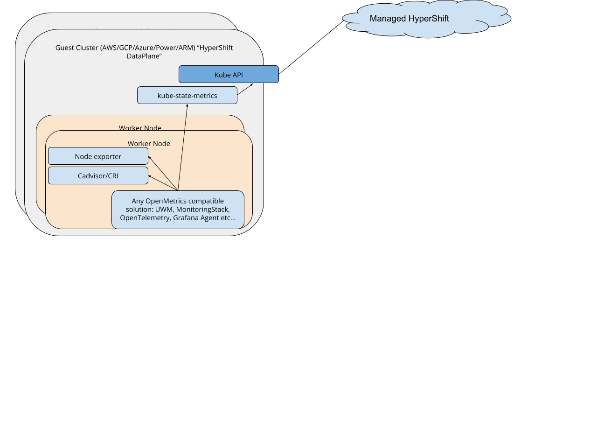

# HyperShift Metrics Monitoring

## Release Signoff Checklist

- [X] Enhancement is `implementable`
- [X] Design details are appropriately documented from clear requirements
- [X] Test plan is defined
- [X] Operational readiness criteria is defined
- [X] Graduation criteria for dev preview, tech preview, GA
- [ ] User-facing documentation is created.
  - See [Documentation Required](#documentation-required) for further details.

## Summary

We propose to extract metric storage, alerting and querying to a separate service that can be scaled, deployed and managed in a decoupled mode. This will allow robust multi-cluster, fleet monitoring with best experience possible for cluster admins. This means SD org, running managed HyperShift will use RHOBS managed by Observability Group and AppSRE. 

## Glossary

* HSRE: HyperShift Admin SRE: People that will operate the Hypershift management cluster and its control planes.
* CUS: Customers. People that create clusters that are managed by Hypershift.
* BU: Business Unit. 
* MS-SRE/MT-SRE: Managed Service / Managed Tenant Site Reliability Engineer.
* RHOBS: Red Hat Observability Service.
* [Observatorium](http://observatorium.io/): Project for scalable SaaS based monitoring and observability.

For additional acronyms, see [Red Hat Dictionary](https://source.redhat.com/groups/public/red-hat-dictionary-or-lexicon/red_hat_abbreviations_acronyms_and_initialisms_dictionary_wiki)

## Background

[HyperShift project](https://github.com/openshift/hypershift) brings some changes to how OpenShift clusters can be deployed. The 10,000 feet view is to decouple the OCP control plane from the data plane. Control plane components (e.g. etcd, API servers, …) run on an underlay cluster, while worker components run remote on a different infrastructure.

This is similar to how AWS, Google and so on run their managed Kubernetes service: You provide the worker nodes and they provide the control plane.

The core idea of HyperShift topology is that it allows sharing infrastructure on control planes and allows the “hosted clusters” (workers) to have a lower computation and operational overhead.

### Important HyperShift Assumptions

* One-way communication. HyperShift management cluster can “talk to” the data plane, but not the opposite (except Kube API, Ignition and OIDC endpoint).
* HyperShift is managed first, but form factor will be offered for self-management by 4.11.
* There is tight budget on computation for control planes (outside of MVP).

## Motivation

This document enhancement proposes potential solution for Admin and Customer metric monitoring within those new topologies, since we cannot apply easily our current platform monitoring products using within cluster monitoring operator ([CMO](https://github.com/openshift/cluster-monitoring-operator)) easily (see [Alternatives](#use-pure-platform-monitoring-solution) on why).

### Goals

The goal is to provide a solution that maintains similar monitoring capabilities we offer with single box monitoring using CMO in HyperShift for our three [personas](#personas).

> NOTE: The definition of “monitor” in the bullet list below means ability to graph, query and alert on near-real-time metrics about involved components.

* HSRE can monitor management clusters and control planes running there.
  * Ability to use AlertManager and PagerDuty workflow
  * Ability to monitor Management Clusters
  * Ability to monitor Customer control planes
  * Ability to view fleet-level metrics and drill-downs in a single pane of glass
  * Ability to keep metrics in-region
* HSRE can monitor control-plane related (managed) software on guest clusters:
  * For example Ingress/Router/CNI/CSI 
  
> Exact list of what is scraped on guest clusters for HSRE does not matter. All we need to know: some service monitors.

* HSRE can query metrics data over SLO period (usually 28 days).
  * Longer durations nice to have, but technically not required. There is also option that allows HSRE to persist SLO from platform to [different backend if needed](https://docs.google.com/document/d/1BJarERppgiJ8esc6d8anbJMOQ0AflFBQea-Zc9wAp0s/edit?disco=AAAAQTFsbwM).
* HSRE have an easy way to monitor dozens of HyperShift clusters in multiple geo regions and thousands of control planes in total. This means in particular:
  * Ability to perform PromQL across fleet metrics

> NOTE(Mariusz): Alerts can be region wide only, and query in different tab per region might be good enough for now.

  * Ability to see logs across the fleet to see a pattern
  * No need to tunnel to specific control plane to query metrics or see logs
  * Centralized alerting
* CUS can monitor / use HPA/VPA / vis with local console using metrics FROM their workloads on guest clusters or from nodes on guest clusters
  * Container metrics (about their containers).
  * This includes part of Kube State Metrics (Kubernetes metrics) that relate to their workloads.
* BU and DDIS can gather required telemetry using the Telemeter pipeline.

### Non-Goals

* Solve Logging and Tracing needs in this enhancement.
* Provide scalable storage solution for customer metrics. We just want to ensure UWM, their DIY,
console or vendor monitoring does not have major blockers when integrating with this
architecture.
* Describe Managed Services (Addons) monitoring in detail. We assume Managed Services are just “Customer workloads”, where the MTSRE is just a customer. See [What About Addons FAQ](#what-about-layered-service--addons-monitoring) for more details.
* Solve observability challenges brought by KCP. KCP has different trade-offs.
* Provide any other UI than Grafana for our Managed HSRE needs.
* Provide any other querying APIs than Prometheus based on PromQL
* Give customers access to any control plane metrics unrelated to their workloads (this is similar in GKE).
* Provide a solution for non-HyperShift OSD. In fact, the solution for OSD observability is planned to be really similar to HyperShift. 
This is because OSD observability struggles on similar points--inability to aggregate observability data in a cheap way on a global view.
However, since HyperShift has no solution at all, for now starting from HyperShift sounds like a great opportunity.

## Proposal

### Personas

* HyperShift Admin SRE (HSRE): People that will operate the Hypershift management cluster and its control planes. In practice, this means the SD org on our managed solutions.
* Customers (CUS) People that create clusters that are managed by Hypershift.
* Business Unit (BU): Red Hat business unit who is interested in telemetry and data from OpenShift deployments.

### User Stories

TBD

### Implementation Details/Notes/Constraints

#### Overview

We propose to decouple observability for SRE / Devs for monitoring and troubleshooting purposes with a specific solution like HyperShift, OSD etc going forward. I explained some rationales in the [Observatorium: Product Agnostic Centralized Observability 2021.10](https://docs.google.com/presentation/d/1cPwac7iNmOFPbEMKE6lcesQCHa2UQXNSJrVo5cW5eRQ/edit) presentation. For those who don't have access or prefer written form, here is the TL;DR here:

What can help us to achieve all goals (HyperShift Observability, but also KCP, single cluster ,edge clusters etc) is simplicity. Essentially, the observability teams can either focus on:

* Integrating bespoke Observability storage to ever-changing topologies and permutations on those, which has complex interactions and constraints.
* Work on operators to make it easy for someone else to deploy and operate.
* Work on complex release cadences, CVE, bug-porting, stability.

OR we can instead focus on:

* Scalability and performance so more information can be processed for monitoring and troubleshooting purposes.
* Features (e.g aggregated view, correlations).
* UX

Let us examine how we can achieve the latter and how these principles can be applied to an example HyperShift topology.

> NOTE: We will focus on monitoring specific components in this document, but you will see logging parts on some diagrams. This is because logging can follow exactly the same pattern. Still, we will focus on monitoring (metrics) for now as it’s a bit unique (e.g. alerting part).

#### The Big Picture

We propose to send all relevant metrics to the "Centralized Observability Product” using well-defined and stable APIs. At this point we call it product because by design this is replaceable component that can be mixed and matched according to the needs.

For example:

* For our Managed HSRE, this can be our RHOBS service.
* For HSRES other than SD members, it can be locally deployed Observatorium or 3rd-party vendor like Grafana Cloud, Amazon or Google Managed Prometheus, Logz.io and others.

A high-level view would look like this:

The model as above allows:

* Metrics Centralization
* Extensibility (e.g. one can choose different Observability Products or switch them on demand).
* Separation of concerns which should result in:
  * Higher velocity of the Observability Product
  * Higher velocity of OSD as the offering has to care less about in-cluster observability flows.
  * Allows managing two products by separate teams without conflicts if one chooses to.

> Note that this does not imply "Centralized Observability Product" to run in a separate cluster and be managed by a separate team. We can mix and match as needed, but strictly for Managed HyperShift use cases we would go for RHOBS service fully managed by Observability Group with AppSRE (SD).

Reasons:

* We can have tighter control on observability budget and spending
* It’s our common, Red Hat responsibility to offer managed OpenShift. If Observability Group + AppSRE will not provide their support and time, the same (or more) effort and money has to be spent on OSD side (or vendor)
* The monitoring Team already manages this service.
  * We already work closely together with AppSRE, tightly integrated with them and familiar with AppInterface.
  * We have devs on-call and SRE mindset.

## Design Details

In details the design looks as follows:

Let’s take a look at all parts:

1. In terms of "Observability Product", we already have a growing open-source [Observatorium](http://observatorium.io/) project that packages and offers opinionated deployments of popular open-source projects for observability needs (e.g Thanos and Loki). What matters is that the Observability Group has a strong impact, deep knowledge and understanding of those projects. We also have ongoing production experience in running and scaling them.

Anyone can install Observatorium, and deploy this service on-premise, but Observability Group also provides [RHOBS](https://rhobs-handbook.netlify.app/projects/observability/rhobs/) as a managed instance of observatorium, that is currently only available to specific internal teams.

Observability Product will be a central pane of view of observability data for SRE needs from multiple clusters, as well as alerting and alert routing for notification purposes.

2. Since the Management cluster is like any other OCP/OSD, we can leverage Platform Monitoring. In near future, we plan to allow [MonitoringStack](https://github.com/openshift/enhancements/pull/866) project to allow scraping platform related metrics, but for the time being, this is done via Platform Monitoring that can remote write relevant metrics to Observability Product.

3. [MonitoringStack](https://github.com/openshift/enhancements/pull/866) project offer similar functionality as UWM, but it aims for more features, flexibility and scalability due to different support models (outside of OpenShift Core) and less tight integration to OpenShift itself. It’s being developed in https://github.com/rhobs/monitoring-stack-operator. We plan to add support to [the agent mode of Prometheus](https://twitter.com/bwplotka/status/1454146102240944134) for efficient metric forwarding.
4. A similar pipeline can be used for a portion of HSRE owned components living in each data plane.

#### Customer Monitoring on Data Plane

As per goals and non-goals we aim to give the CUS ability to scrape data related to their worklodads / hardware / Kubernetes state metrics that is on their data plane. As mentioned in [Non Goals](#non-goals) we don’t want to give or sell anything for scalable, centralized monitoring to customers (yet). Not beyond anything else w provide which is an opinionated UWM, CMO can deploy on normal OCP.

What we have to do, is to enable and recommend them using existing workflows, which simply means providing the same data using the same protocols (Prometheus exposition format).

The typical workflows:
* HPA/VPA using Prometheus Adapter
* Monitoring and alerting on kube-state metrics, node exporter, cadvisor and application metrics
* Local console access with OCP metrics and dashboard

We don’t see any blockers for the proposed model if we would follow the same path as GKE, EKS or any other Managed Kubernetes with hidden control plane offers. By design, HyperShift offers managed Kube API. This means that any metrics related to the things running in the data plane and around API can be obtained by Customers on their own. It could work like this:

This is not different to GKE/EKS cases, where, the customer has to deploy on their own kube-state-metrics, node-exporter, cadvisor etc and configure Open Metrics compatible solution to scrape those.

As the Red Hat data plane, we used to offer this out-of-the-box ,so we should maintain this practice. In simple form we could use CMO without PM, but with all exporters and optional UWM. There is a slight tweak where UWM has to know scrape those data-plane KSM, node exporter, cadvisor.

Our team also develops [Monitoring Stacks](https://github.com/openshift/enhancements/pull/866) which aims to do similar yet allows greater scalability and flexibility due to independent versioning and OLM installation model.

Yet, CUS can use any other DIY or just simple Prometheus/Prometheus Operator or vendor (e.g Grafana Cloud or anything else too) to do similar.

### Risks and Mitigations

Let's describe the worst case. What if the Observability Team or/and AppSRE fail to Provide a Managed Observability Service with Required Scalability and reliability (in time)?

Let’s be honest, it’s not an easy job. We are aware of challenges here and the hardest things were presented many times:

To the best of our knowledge, we think we can do it. We were preparing the teams to solve those challenges for the last 3 years or so (since the CoreOS acquisition). This is because:

* Service Delivery organization provides amazing support service for Kubernetes, infrastructure, required SaaS services and CI/CD.
* The monitoring team is active in the development of almost all projects and key dependencies used in the product (Observatorium, Prometheus, Thanos, Cortex, Alertmanager, Loki, etc).
* The majority part of the monitoring team was designed to be on-call for our workload services too in order to provide stricter SLO and better operationality of our software.
* Thanos and Loki were designed for high scale and reliability.
* We have already successfully run the Telemeter service with hundreds of millions of series for last 3 years.
* We optimized new hires for the Observability Platform team for skillsets to solve those problems. We are hiring for the 2-3 slots.

Mitigations:

* We are growing the dev team even more.
* We are doubling down the development on performance and scalability. We already have designs to improve the biggest bottlenecks of Thanos.
* In the extremely worst case: This design assumes API-driven workflows. This allows easy change of Observability Product if anything goes wrong. If our Observability Product effort totally collapses, OSD can within days (and millions $$) switch to any other vendors that support Loki APIs and Remote Write API and Prometheus/Loki read APIs. For example:
    * Our Grafana Cloud partner
    * Amazon Managed Prometheus and Grafana
    * Google Managed Prometheus
    * Logz.io
    * … many more

### Migration

N/A. HyperShift is a new project.

### Documentation Required

User facing docs:

* HyperShift client monitoring and how to configure metrics remote write (push API) to desired backend.

Internal docs:

* RHOBS entry-points and usage.

### Open Questions

### FAQ

Some common questions gathered during initial proposal discussions.

#### What About Layered Service / Addons Monitoring?

This was discussed and solved by [Monitoring Stacks](monitoring-stack-operator.md). For HyperShift context, Addons requirements are no different to what we assume Customer would want to do / use. So in the context of this enhancement Addons are just another CUS.

TBD explain risk in terms of having Addons monitoring running on "unmanaged" data-plane.

#### How HyperShift Admin is any different from a Cluster Administrator?

They manage multiple clusters in HyperShift topology, so multiple control planes on single management OSD. So there is added complexity on top. But technically they are administrating clusters. 

#### How this can work for on-premise HyperShift?

As mentioned in [Big picture](#the-big-picture), for CUS local use, metrics can be shipped to many different solutions. For example:

* Data can land to locally deployed Observatorium. Obsevatorium is our open-source project that can already be installed anywhere to fulfil the proposed architecture. The first time user onboarding experience is certainly less than optimal, though a decent level of investment in better documentation, reusable dashboards and alerts and the operator deployment model would make this a drastically better experience.
* 3rd-party vendor like Grafana Cloud, Amazon or Google Managed Prometheus, Logz.io and others.

Exact offering is still to be discussed, but we need to acknowledged that managing monitoring is and expensive business.

### Test Plan

TBD

## Implementation History

If all parties will agree on the proposed direction we need heavy focus on the actions required:

1. Add Alerting on top of Observatorium, then deploy it on RHOBS.
2. Host Grafana on RHOBS.
3. Double down on the planned performance and efficiency work for Thanos Query path.
4. Finalize Monitoring Stack development.
5. Acceptance test and load test.

We would also propose to join forces. E.g OSD SRE who are right now helping with solving the monitoring needs could contribute directly to Observatorium, RHOBS or Monitoring Stacks.

At further stage:

6. Deploying multiple regional RHOBS clusters. Things that needs to be figured out:
  a. Federation of view for those clusters
  b. Managing more deployments
  c. Service Discovery of those on client (HyperShift side)
7. Provide efficient forwarding metrics collection solution (aka Prometheus agent).

## Drawbacks

* Different than OSD team effort to maintain critical Observability dependency with high SLO.
* No native local storage solution

## Alternatives

#### Pay for Observability Vendor

Pros:

* They might have ready, proved scale, now.
* They have existing cross-signal correlation capabilities.

Cons:

* Block/makes the on-premise case of Hypershift more difficult.
* The current ingestion (collector) tech we use and package, might not support them.
* Not many solutions give both metrics and logging in a unified platform.
* It costs a huge amount of $$$ (to be researched how much exactly vs our solution)
* We are not their priority vs we have dedicated Observability Group that can react to import ant missing features.
* Not helping open source community.

#### Use Pure Platform Monitoring Solution

Similarly to how the control plane is decoupled to the data plane in the HyperShift model, we could decouple platform and user monitoring. This ensures the monitoring data for cluster monitoring is residing in the management cluster and the user is one on the guest cluster. We can highlight the following issues with such deployment:

1. Platform Monitoring won’t be able to scrape data plane resources like it used to do.
Why: Scrape is not reliable across networks (you cannot retry scrape without losing information). Consequences:
  * Violated requirement “Ability to monitor system components on guest clusters”

2. OpenShift Console for Customers used to talk to Thanos Querier, which could get metrics, rules, and scrape targets from both Platform and User Workload Prometheus-es. UWM used to talk to PM because customers want to see and alert on the performance / kube state metrics that are only available through PM. However, in this naive solution, Thanos Querier won’t be able (easily) to access User Workload Monitoring. Why?
  * Querying/StoreAPI through WAN can have larger latency and cost
  * There should be no connections initiated by data plane to control plane

  Consequences:
  * Violated requirement “Ability to monitor user-workload-related metrics from the system components on guest clusters”
  * Violated requirement  “Ability to monitor user-workload-related metrics from Kube API (kube state metrics)”.

3. Similarly to the above: Thanos Ruler from UWM won’t be able to access Thanos Querier and potential Alertmanager on the Control plane.
4. Naively we would have multiple CMOs per control plane on the management cluster. While this will work, there is an opportunity to do it better.

Additionally, how telemetry would work in this casse?

### Upgrade / Downgrade Strategy

TBD 

### Graduation Criteria

#### Dev Preview -> Tech Preview

TBD

#### Tech Preview -> GA

TBD

#### Removing a deprecated feature

TBD

### Version Skew Strategy

N/A

### Previous Docs

* Initial proposal and discussion on [Google Docs](https://docs.google.com/document/d/1BJarERppgiJ8esc6d8anbJMOQ0AflFBQea-Zc9wAp0s/edit#heading=h.bupciudrwmna)
* [HyperShift Monitoring Meeting Notes](https://docs.google.com/document/d/1crLlWZ9iefuayIcCb3Cwjb2rZrSm-xji9o3c98uEJe4/edit#)
* [Product Agnostic Centralized Observability](https://docs.google.com/presentation/d/1cPwac7iNmOFPbEMKE6lcesQCHa2UQXNSJrVo5cW5eRQ/edit)
* [Guest Cluster Telemetry](https://docs.google.com/document/d/1TQxmy_1zgPLIrLrbjWV4HlEZ8MTMKP7iXESJJEzoC9o/edit#)

#### Related Enhancements

* [Monitoring Stacks](monitoring-stack-operator.md)
* [Precursor of HyperShift](../update/ibm-public-cloud-support.md)
* [Cluster Profiles](../update/cluster-profiles.md)
* [External Planes](../external-control-plane-topology.md)
