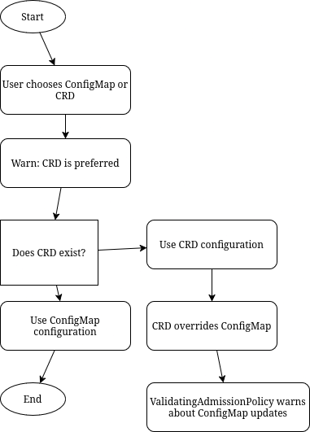

# CRD ClusterMonitoring

## Release Signoff Checklist

- [ ] Enhancement is `implementable`
- [ ] Design details are appropriately documented from clear requirements
- [ ] Test plan is defined
- [ ] Graduation criteria for dev preview, tech preview, GA
- [ ] User-facing documentation is created in [openshift-docs](https://github.com/openshift/openshift-docs/)

## Summary

* Currently, the OCP monitoring stacks are configured using ConfigMaps (1 for platform monitoring and 1 for user-defined monitoring). In OpenShift though the best practice is to configure operators using custom resources.


## Motivation

* The specification is well known and largely self-documenting.
* The Kubernetes API Server validates custom resources based on their API specification, so users get immediate feedback on errors instead of checking the ClusterOperator object and the cluster monitoring operator's logs. Common expressions language even allows to write complex validation logic, including cross-field tests.
* Many users expect to interact with operators through a CRD.
* Custom resources play better with GitOps workflows. 
* CRDs supports multiple actors managing the same resource which is a key property for the Observability service of Advanced Cluster Management.

### User Stories

As a cluster administrator, I want to be able to add a CRD so that I can configure monitoring stack.
as a cluster administrator, I want to create a CR (possibly via gitops style systems) and observe the status of the created CR. Today this is spread over the config map and feedback via CMO status conditions and CMO logs.


### Goals

- Replace the existing ConfigMaps with CRDs.
- Automated and friction-less upgrade for users.

### Non-Goals

- Make things more complicated and easy to break.
- Change any behavior of monitoring stack

## Proposal

Currently in CMO, a config map provides a way to inject configuration data into pods. There are two configmaps for the different stacks:

    cluster-monitoring-config: Default platform monitoring components. A set of platform monitoring components are installed in the openshift-monitoring project by default during an OpenShift Container Platform installation. This provides monitoring for core cluster components including Kubernetes services. The default monitoring stack also enables remote health monitoring for clusters.

    user-workload-monitoring-config: Components for monitoring user-defined projects. After optionally enabling monitoring for user-defined projects, additional monitoring components are installed in the openshift-user-workload-monitoring project. This provides monitoring for user-defined projects. These components are illustrated in the User section in the following diagram.


Two distinct CRDs are necessary because they are managed by different personas with specific roles and responsibilities:

    - UWM admins: manage the configuration of the UWM components (edit permissions on the openshift-user-workload-monitoring/user-workload-monitoring-config ConfigMap).
    - Cluster admins: manage the configuration of the Platform monitoring components.

In managed OpenShift clusters like OSD/ROSA, two separate CRDs are necessary because platform SREs manage the cluster's platform monitoring stack, while customers manage the user-defined monitoring stack. This separation ensures that each group maintains control over their specific monitoring configurations, reducing conflicts and enhancing system management.

[More info](https://github.com/openshift/enhancements/blob/master/enhancements/monitoring/multi-tenant-alerting.md)


- Replace configmaps with CRD:

Current Config struct in CMO
  
```
  type Config struct {
	Images                               *Images `json:"-"`
	RemoteWrite                          bool    `json:"-"`
	CollectionProfilesFeatureGateEnabled bool    `json:"-"`

	ClusterMonitoringConfiguration *ClusterMonitoringConfiguration `json:"-"`
	UserWorkloadConfiguration      *UserWorkloadConfiguration      `json:"-"`
}
```

We will strive to maintain the previous structure as much as possible while adapting it to OpenShift API standards. 

[Current ClusterMonitoringConfiguration struct:](
https://github.com/openshift/cluster-monitoring-operator/blob/eca25a9571d721a90f1b7f8d26931c679ae93aec/pkg/manifests/types.go#L36)
```
type ClusterMonitoringConfiguration struct {
	AlertmanagerMainConfig *AlertmanagerMainConfig `json:"alertmanagerMain,omitempty"`
	UserWorkloadEnabled *bool `json:"enableUserWorkload,omitempty"`
	HTTPConfig *HTTPConfig `json:"http,omitempty"`
	K8sPrometheusAdapter *K8sPrometheusAdapter `json:"k8sPrometheusAdapter,omitempty"`
	MetricsServerConfig *MetricsServerConfig `json:"metricsServer,omitempty"`
	KubeStateMetricsConfig *KubeStateMetricsConfig `json:"kubeStateMetrics,omitempty"`
	PrometheusK8sConfig *PrometheusK8sConfig `json:"prometheusK8s,omitempty"`
	PrometheusOperatorConfig *PrometheusOperatorConfig `json:"prometheusOperator,omitempty"`
	PrometheusOperatorAdmissionWebhookConfig *PrometheusOperatorAdmissionWebhookConfig `json:"prometheusOperatorAdmissionWebhook,omitempty"`
	OpenShiftMetricsConfig *OpenShiftStateMetricsConfig `json:"openshiftStateMetrics,omitempty"`
	TelemeterClientConfig *TelemeterClientConfig `json:"telemeterClient,omitempty"`
	ThanosQuerierConfig *ThanosQuerierConfig `json:"thanosQuerier,omitempty"`
	NodeExporterConfig NodeExporterConfig `json:"nodeExporter,omitempty"`
	MonitoringPluginConfig *MonitoringPluginConfig `json:"monitoringPlugin,omitempty"`
}
```


Each component within the ConfigMap will be migrated to the OpenShift API in separate PRs. This approach allows for a thorough review, improvement, and modification of each ConfigMap component to ensure it aligns with OpenShift API standards. As part of this process, types will be modified, outdated elements will be removed and names and configurations will be refined.


## Design Details

To initiate the process, let's establish a feature gate that will serve as the entry point for implementing a CRD configuration approach. This strategy enables us to make incremental advancements without the immediate burden of achieving complete feature equivalence with the config map. We can commence with the basics and progressively incorporate additional functionalities as they develop.

One proposal for a minimal DoD was:
- Feature gate in openshift/api
- API types moved to openshift/api
- Client-go codegen 
- Reconcile logic: https://github.com/openshift/cluster-monitoring-operator/pull/2350
- Add merge ConfigMap / CustomResource for phase 1
        

### Example configuration


#### current ConfigMap

```
apiVersion: v1
kind: ConfigMap
metadata:
  name: cluster-monitoring-config
  namespace: openshift-monitoring
data:
  config.yaml: |
    telemeterClient:
      enabled: false
    prometheusK8s:
      volumeClaimTemplate:
        metadata:
          name: prometheus-data
          annotations:
            openshift.io/cluster-monitoring-drop-pvc: "yes"
        spec:
          resources:
            requests:
              storage: 20Gi
```

### CRD

```
apiVersion: clustermonitoring.config.openshift.io
kind: ClusterMonitoring
metadata:
  name: cluster
  namespace: openshift-monitoring
spec:
  prometheusK8s:
    volumeClaimTemplate:
      metadata:
        name: prometheus-data
        annotations:
          openshift.io/cluster-monitoring-drop-pvc: "yes"
      spec:
        resources:
          requests:
            storage: 20G
```


### Workflow Description

See example in the [Proposal](#Proposal) for details.

### API Extensions

Add two new CRD's:
- ClusterMonitoring
- UserWorkloadClusterMonitoring

### Topology Considerations

Will function identically in all topologies.

#### Hypershift / Hosted Control Planes

For hosted control planes the current direction is to hand off CMO completely to the cluster admin Persona. In that scenario the monitoring config would live solely within the guest cluster. Still Hypershift has an API knob within the HostedCluster for openshift/api targeted types. If desired at any time, the new monitoring config could be exposed there and reconciled down to the guest cluster.

#### Standalone Clusters
No special considerations.

#### Single-node Deployments or MicroShift
No special considerations.

### Implementation Details/Notes/Constraints


### Migration path

Migration path it will be split in three phases

- Phase 1: Pre-GA (Gradual Migration for Developers)
  - In this phase only developers are expected to use CRD.
  - Both ConfigMap and CRD will coexist for a while until the transition is complete.
  - Work with a Feature flag.
  - Two options: ConfigMap or CRD.
      Preference is to use ConfigMap over CRD during this phase.
  - The merge process look at top-level fields
  - Behavior: If an entry exists in the ConfigMap, ignore the CRD.
      If there’s no entry in the ConfigMap, use the CRD.
  - Merge Process (only for phase 1)
      Top-level fields (e.g., AlertmanagerMainConfig *AlertmanagerMainConfig || spec.AlertmanagerMainConfig):
      If a field is nil in the ConfigMap, use the CRD; otherwise, stick with the ConfigMap.

- Phase 2: Transition (User Control)
  Keep dual support for a at least 2 releases.
  - New Logic:
    Allow users to choose the source of configuration (ConfigMap or CRD, warn about CRD preference).
    If a CRD exists, prioritize it over the ConfigMap.
    Add logic for users to manually switch to CRD if desired.
    No merge process.

    

- Phase 3: Full Migration (CRD as Default)
    After a few releases, the migration from ConfigMap to CRD will be complete.
    ConfigMap will be deprecated, with CRD becoming the default configuration source.
  
  - To start with deprecation we follow these steps:
    Documentation and release notes to warn user about changes.
    Cluster Fleet Evaluation to check how many user already use CRD instead of ConfigMap
    Eventually you can mark CMO as upgradeable=false if the ConfigMap exist


- Extensive testing will be required to validate the new behavior.
- Some fields in CRD and ConfigMap diverge due to API requirements. Helper functions will be needed to resolve this.

### Risks and Mitigations

- Issues when ConfigMap and CRD coexist, as ConfigMap and CRD will be merged in a single structure, this could be error prone and an extensive testing should be done.
- Mismatch in the configuration of operators with ConfigMap and CR

### Drawbacks

- Migration. The user can use either ConfigMap or CRD, or both; we need to explain how to make the transition, and the preference is to use the CRD.
- Coexisting of both ConfigMap and CRD.


## Test Plan

- Unit tests for the feature
- e2e tests covering the feature
- Upgrade testing
- FeatureGate

### Open questions

- Merge CRD and ConfigMap could be error prone and will need extra test
- Should we provide an escape hatch (via some annotation?) telling CMO to ignore the custom resource and only use the ConfigMap in case something goes bad?
- How do we tell cluster admins that they need to migrate? CMO conditions could be an option as well as alerting and Insights?- How do we know how many clusters have migrated to the new CRD? Telemetry?

## Graduation Criteria

From Tech Preview to GA

### Dev Preview -> Tech Preview

### Tech Preview -> GA

- Tech Preview was available for at least one release
- High severity bugs are fixed
- Reliable CI signal, minimal test flakes.
- e2e tests are in place

### Removing a deprecated feature

## Upgrade / Downgrade Strategy

Feature will not affect standard upgrade or downgrade process of the cluster.

## Version Skew Strategy

N/A

## Implementation History

## Operational Aspects of API Extensions

## Support Procedures

## Alternatives