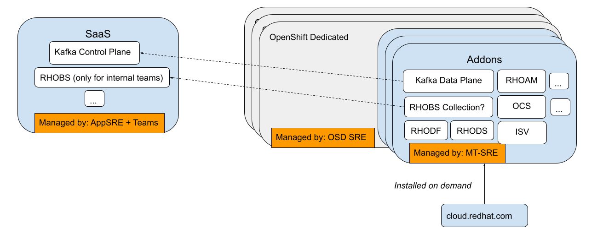
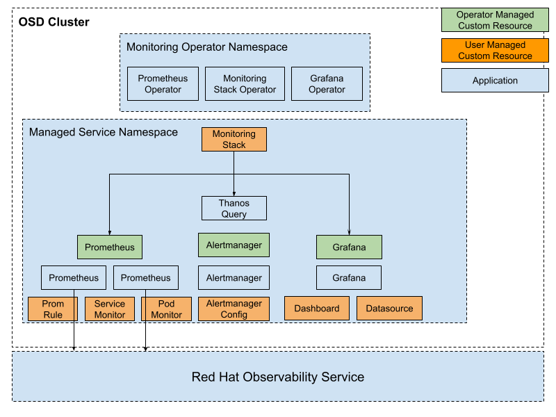
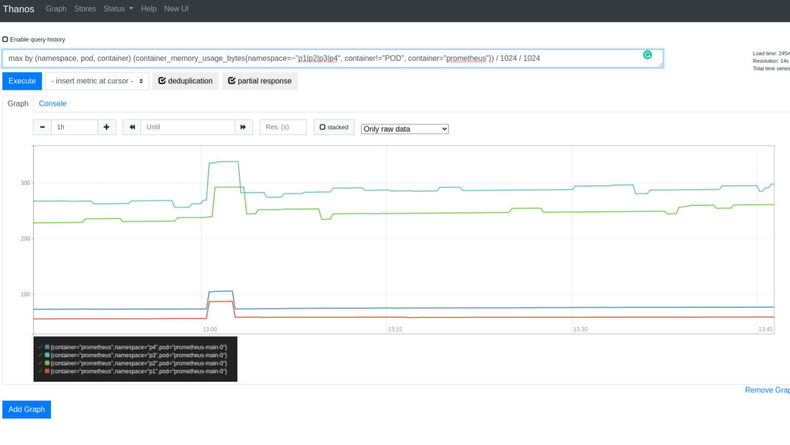
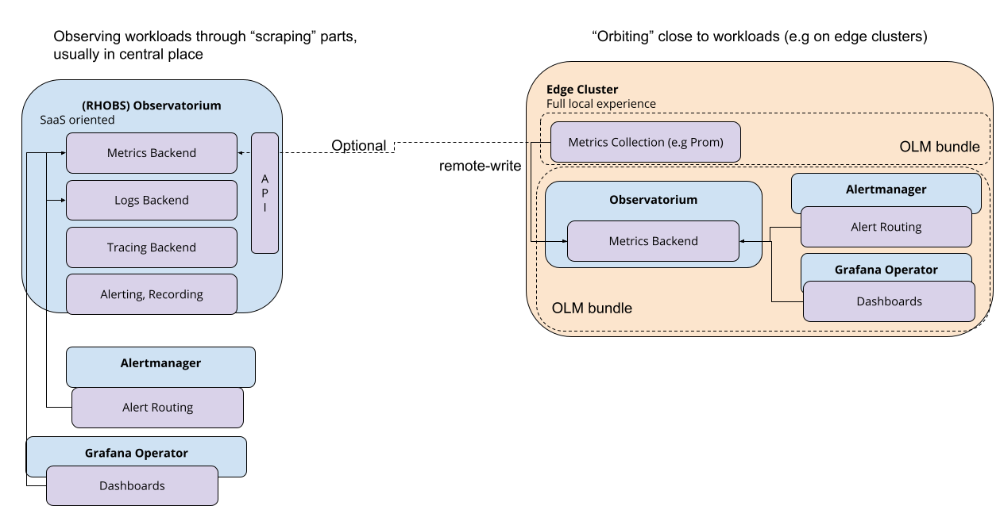
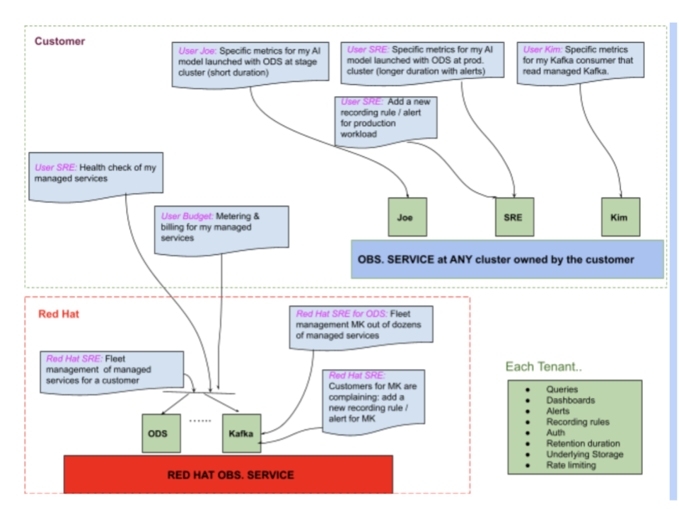
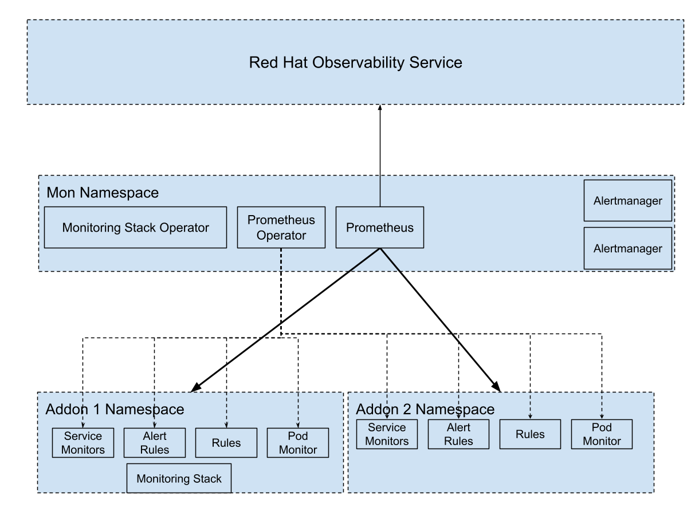

# Monitoring for Red Hat Managed Services

## Release Signoff Checklist

- [X] Enhancement is `implementable`
- [X] Design details are appropriately documented from clear requirements
- [X] Test plan is defined
- [ ] Operational readiness criteria is defined
- [ ] Graduation criteria for dev preview, tech preview, GA
- [X] User-facing documentation is created in [openshift-docs]([https://github.com/openshift/openshift-docs/](https://github.com/openshift/openshift-docs/))
  - The project documentation will be part of the project itself. No documentation in openshift-docs will be needed.
  See [Documentation Required](#documentation-required) for further details.

## Summary

This document proposes a solution and a delivery plan for scraping, querying and alerting on metrics related to Red Hat Managed Services running in OSD clusters. The proposed solution is not intended to complement the existing monitoring stack managed by the Cluster Monitoring Operator, nor used directly by Customers at this moment.

### Glossary

* MS-SRE/MT-SRE: Managed Service / Managed Tenant Site Reliability Engineer
* MTO: Managed Tenant Owners - the teams that develop each Managed Service. The Kafka Team is one example of an MTO.
* RHOBS: Red Hat Observability Service
* RHODF: Red Hat OpenShift Data Foundation

For additional acronyms, see [Red Hat Dictionary](https://source.redhat.com/groups/public/red-hat-dictionary-or-lexicon/red_hat_abbreviations_acronyms_and_initialisms_dictionary_wiki)

## Background

OpenShift Monitoring is currently composed of two main systems - Platform Monitoring (PM) and User Workload Monitoring (UWM), both of which are part of OpenShift core.

Platform Monitoring holds metrics about core system components running in `openshift-*` and `kube-*` namespaces. Platform Monitoring is enabled in all OpenShift installations and cannot be disabled. Some of the components scraped by PM include core-dns, etcd, kube-apiserver, image-registry, operator-lifecycle-manager etc.
Platform Monitoring is by design an immutable stack, [which means that admins cannot extend it with additional metrics without losing the support.](https://docs.openshift.com/container-platform/4.7/monitoring/configuring-the-monitoring-stack.html#support-considerations_configuring-the-monitoring-stack)

User Workload Monitoring is an optional stack managed by Cluster Monitoring Operator (CMO) and is disabled by default. Once enabled by cluster admins, it allows users to monitor namespaces that are not part of OpenShift core.
Please refer to the User Workload Monitoring [enhancement proposal](https://github.com/openshift/enhancements/blob/master/enhancements/monitoring/user-workload-monitoring.md) for more details. If enabled, only one stack can be deployed. The recommended way to get “platform” data is through Thanos Querier. Alternatively, the UWM stack can scrape the `/federate` endpoint expsed by the Platform Monitoring Prometheus to injest a subset of the available platform metrics.

Recently an essential model of managing software for customers emerged at Red Hat, referred to as “Managed Services” or “Managed Tenants”. From an architectural point there are three types of such services:

* Addons/Layered Services
* SaaS
* A combination of the first two (SaaS that requires an Addon)

The way these managed services are intended to run is presented in the following diagram.



We expect many more Addons to come in the following years.

## Motivation

Red Hat managed services are deployed in OSD clusters and run alongside user workloads.

Even though there are two monitoring stacks available in OSD clusters, neither is suitable for managed services. In OSD, Platform Monitoring is exclusively owned and managed by Platform SRE. It is customized to their needs and no modifications are allowed.
Because of this, managed tenant owners (MTOs) cannot create additional ServiceMonitors, Prometheus rules and other monitoring resources on metrics in the Platform Monitoring domain.

User Workload Monitoring was designed to be primarily used by customers for monitoring their own workloads. Managed services are discouraged from using this stack since they could easily get DOS-ed by high cardinality data from end-users.
Similarly, the configuration of the Prometheus instance itself, including alerting and routing, would be shared with customers and other managed service owners.

As a result, each MTO currently needs to deploy its own self-developed monitoring solutions alongside its service.
Current options like [Prometheus Operator](https://operatorhub.io/operator/prometheus) (PO) through OLM provide inital value, but they require expertise on how to build a full-fledged monitoring stack with multi-tenancy and high availability in mind (RBAC proxies, HA, Thanos Querier, Ruler etc.).
This imposes an extra cost on teams developing and maintaining a managed service and increases time-to-market for new services.

### Goals

This enhancement aims to relieve the burden from managed service owners by providing a ready-made monitoring solution. Such a solution would encapsulate existing patterns already present in Platform Monitoring and User Workload monitoring.
Furthermore, it will reduce the operational complexity of running a managed service since the Managed Tenant SREs will not need to familiarise themselves with a new monitoring stack for each managed service.
In future it can be used to allow customers to define their monitoring stacks. UWM could use it under the hood too. In details:

* Provide a way for managed services to scrape metrics from their own services and from platform components into prometheus-compatible storage.
* Allow managed service owners to query metrics from their services and platform components from prometheus-compatible storage.
* Provide a way for managed services to define alerting and recording rules on their own metrics and a subset of platform metrics.
* Provide a way for managed services to create dashboards for monitoring their services.
* Allow aggregating portions of managed service metrics at a multi-cluster level, e.g. for reporting SLOs.
* Allow longer retention for portions of data (e.g. calculating 1 month burn down SLO budget).
* Allow analytics on portion of managed service data in conjuction with Telemeter data at the aggregation level.
* End customers using UWM should not see managed service metrics.
* Soft Goal: A foundation for next iterations mentioned in ### Long term motivation.

### Long Term Motivation

To avoid maintaining multiple monitoring solutions, this proposal aims to be a foundation for future monitoring enhancements. Therefore, the following goals are left out of scope for the current enhancement but are kept in mind for future iterations:

* Such a solution as a community project which is easy to use & contribute to.
* Reduce Platform Monitoring overhead and its single point of failure (SPOF) property.
* Auto-scaling metric scraping based on number of ServiceMonitors
* Soft multi-tenancy for local storage (TSDB).
* Opt-in for full forwarding mode.
* Full architecture for Hypershift ([WIP](https://docs.google.com/document/d/1BJarERppgiJ8esc6d8anbJMOQ0AflFBQea-Zc9wAp0s/edit))

### Non-Goals

* Access controls for managed service owners for metrics from different managed services. For example, there are currently no requirements for owners of managed services A to be prohibited from seeing metrics from managed service B, and vice versa.
* Expose managed service metrics to end-users. We know e.g. OCS addon wants this, but this can be achieved on top of the proposed solution using client or backend side filtering for data isolation if needed (e.g. prom-label-proxy). The monitoring team can do this in the next iteration.
* Integrate managed service metrics into the OpenShift console. We know OCS wants to integrate with OCP Console, but we assume the console team can help support switching between Prometheus-compatible data sources.
* Solve Platform Monitoring SPOF, scalability and overhead. This will be targeted in a follow-up enhancement.
* Allow logging and tracing capabilities. Other solutions should tackle this (designed by Logging and Tracing teams.)

## Proposal

### Personas

* OSD/Platform SRE
* MTSRE
* RHOBS Devs
* MTO
* Customer: User of Managed Service and OSD

### User Stories

#### Story 1

As a MTSRE/MTO, I would like to define ServiceMonitors that will scrape metrics from my managed service by a Prometheus-compatible system.

#### Story 2

As an MTSRE/MTO, I would like to query SaaS/Addon metrics using PromQL to understand the health or troubleshoot the performance of my managed service.

#### Story 3

As an MTSRE/MTO, I would like to create alerting and recording rules for Prometheus metrics exposed by my managed service.

#### Story 4

As an MTSRE, I would like to configure routing for alerts defined on Prometheus metrics exposed by my SaaS/Addon.

#### Story 5

As an MTO, I would like to query certain metrics for my service across all clusters in which the managed service is deployed or used.

#### Story 6

As an MTO, I would like to create dashboards for certain metrics across all clusters where the SaaS/Addon is deployed or used.

#### Story 7

As a Customer, I can use UWM without seeing Addons metrics, alerting or recording configurations.

### Implementation Details/Notes/Constraints

Since UWM and PM are part of Openshift Core, we would like to avoid increasing the complexity and introducing potential bugs for customers by extending those monitoring stacks. Because of this, we propose developing a new stack that will be able to support the managed service use-case while staying compatible with upcoming use-cases such as Hypershift or [KCP](https://github.com/kcp-dev/kcp).

#### Overview

We propose developing a new open-source operator with a working name, “MonitoringStack Operator” (official name proposals are welcome!) that manages a `MonitoringStack` CRD and can be used to deploy an independent, prometheus-based stack for each managed service.
The operator will be installed into its own namespace and will watch `MonitoringStack` resources in the entire cluster. Alongside itself, the operator will deploy two other operators:

* An instance of Prometheus Operator managing Prometheus and Alertmanager statefulsets in the same namespace.
* A [Grafana Operator](https://operatorhub.io/operator/grafana-operator)

Once a `MonitoringStack` custom resource (CR) has been created, the operator will deploy the appropriate resources in the `MonitoringStackOperor`'s namespace based on how the stack is configured. In a simple case, this might be:

* a Prometheus CR
* a Grafana CR and a Grafana Data Source CR
* a Thanos Querier if the stack is configured for high availability

In other cases, it might be just a Prometheus Agent deployment (forwarding only capabilities).

The `MonitoringStack` CRD is meant to be an abstraction over monitoring needs and requirements for a single tenant that specifies their needs. The underlying implementation is up to the MonitoringStackOperator.

In this manner, managed service owners can simply create an instance of `MonitoringStack` alongside their services and delegate the provisioning and management of their monitoring stack to the operator.

An example `MonitoringStack` resource could look as follows:

```yaml
---
apiVersion: monitoring.coreos.io/v1alpha1
kind: MonitoringStack
metadata:
    name: monitoring
    namespace: redhat-kafka
spec:
    retention: 12d
    resources:
      requests: 
        memory: 512M
      limits:  
        memory: 1G
---
```

In the first iteration, each monitoring stack will be deployed and scoped to a single namespace. This means that the Prometheus instance will only be able to scrape monitoring resources from the namespace it is deployed in. In subsequent iterations, the CRD can be extended to allow scraping from multiple namespaces, either by namespace name or by namespace label selector.

With such a design, User Workload Monitoring could become just another instance of a `MonitoringStack`. Furthermore, Platform Monitoring can be trimmed down in the same way by allowing various OpenShift core components to deploy their `MonitoringStack` resource.

The following diagram illustrates a high-level overview of the final solution applied in the context of managed services.



_First iteration of the new monitoring operator, showing a monitoring stack with a Prometheus, Grafana and a shared Alertmanager._

We recommend using either [OperatorSDK](https://github.com/operator-framework/operator-sdk) or [KubeBuilder](https://github.com/kubernetes-sigs/kubebuilder) to develop the operator to increase development efficiency by taking advantage of the higher abstraction constructs, the rich documentation, and a vibrant community.
Alternatively, we could also consider using a higher-level operator, such as [locutus](https://github.com/brancz/locutus), for rapid development with a path for GitOps deployments. In any case, this is an implementation detail that should be left to the team implementing this to decide on.

## Design Details

### Installation

The newly developed operator will be deployed using the Operator Lifecycle Manager (OLM).

This will allow us to make releases much faster and iteratively and incrementally. As a result, we will be able to respond to new requirements much more rapidly. Release batches will also become smaller, reducing the risk of multiple independent features affecting each other.

In order to be aligned with the descoping [plan](https://docs.google.com/presentation/d/1j1J575SxS8LtL_YvKqrexUhso7j4SgrLfyNrDUroJcc/edit#slide=id.ga089527607_0_0) that the OLM team is currently working towards, we recommend avoiding `OperatorGroups` as they are going to become deprecated in the future (possibly as soon as OpenShift 4.11).
For this reason, the newly developed operator should be installed globally in a cluster and should provide its own CRDs and Roles as part of the installation bundle. A cluster administrator would then create RoleBindings to bind the roles to namespaces to which the operator needs access.
More details about the descoping plans and strategies are currently described can be found in this [hackmd](https://hackmd.io/wVfLKpxtSN-P0n07Kx4J8Q?view#Descoping-Plan) document and are also illustrated in a short [slide-deck](https://docs.google.com/presentation/d/1j1J575SxS8LtL_YvKqrexUhso7j4SgrLfyNrDUroJcc/edit#slide=id.ga089527607_0_0).

### Metrics retention

Since each addon can create its own monitoring stack, MTOs will be able to configure retention for their service as they see fit.

### Global view

In order for MTSRE/MTO to be able to view portions of metrics for all of their deployments, each managed service will have its own tenant in Red Hat Observability Service (RHOBS). This will allow remote-writing a subset of metrics from the Prometheus instances into RHOBS.

### Scraping metrics from platform components

MTOs often need to create alerts and dashboards which include metrics coming from platform components. A typical example is using CPU and memory resource metrics from kube-state-metrics. For ease of use, MTOs will be able to define allow-listed scrape on Platform Monitoring /federate endpoint to access relevant metrics.

In the first iteration, this can be implemented by defining a ServiceMonitor against the `/federate` endpoint of the Platform Monitoring Prometheus. Improvement on this side will be revisited in the next enhancement (e.g ability to scrape those data directly from sources).

### High Availability

All components except Prometheus are stateless and can run with more than one replica. In order to make Prometheus highly-available, a similar approach to the one in CMO will be used. The monitoring operator will provide a Thanos Querier for each `MonitoringStack` and a sidecar next to each Prometheus.
A Thanos Ruler is not needed in this architecture since all recording rules and alerts will be evaluated locally in each Prometheus instance.

### Alert Routing

For simplicity reasons, routing alerts that come from managed service monitoring stacks will be handled by a single Alertmanager.
We can take advantage of the recently added <code>[AlertmanagerConfig](https://github.com/prometheus-operator/prometheus-operator/blob/master/Documentation/api.md#alertmanagerconfig)</code> and allow MTO/MTSRE to create their own routing configuration in a centrally deployed Alertmanager instance.
Finally, the MTSRE team could centrally configure receivers in one place for all managed services and service owners would simply use those receivers in their routing rules. It is worth noting that the last feature depends on [https://github.com/prometheus-operator/prometheus-operator/issues/4033](https://github.com/prometheus-operator/prometheus-operator/issues/4033).

In addition to the built-in Alertmanager from MSO, users will have the option to route alerts to external Alertmanagers, such as the PM Alertmanager.

#### Notable Alerting Routing Alternative

During the Monitoring Enablement Working Group meetings, we received feedback from both Platform SRE and Managed Tenant SRE that Alertmanager, in general, has a low footprint, and the Prometheus Operator does a good job of upgrading it and keeping it running.

Moreover, Platform SRE expressed concerns that a shared Alertmanager configuration could lead to conflicts or misconfiguration that can impact alerting for every managed tenant running in the cluster.

Based on the information, we do not see strong reasons not to have one Alertmanager per managed service. Either approach should work as an initial solution.

### Creating Dashboards

The OCP Console does not (yet) support querying different Prometheus instances, making it hard to use it for creating dashboards.

For this reason, the monitoring operator will optionally deploy a Grafana operator that can manage Grafana instances in the namespaces where a MonitoringStack CR is present. Managed service SREs and owners will then be able to use the CRDs provided by the Grafana operator to create their own dashboards.

### Release Model

We plan to follow similar “[Layered Release Cycles](https://docs.google.com/presentation/d/1b7VRJpaUcidZso6BNx4F0AmWYh5f_F1-ZmMLs4IFGLA/edit#slide=id.ge68369526c_0_0)” proposed by the [Logging team](https://access.redhat.com/support/policy/updates/openshift#logging).

### Risks and Mitigations

#### Releasing through OLM

The monitoring team currently does not deploy any OpenShift component through OLM and, therefore, lacks experience in delivering software in this manner.

In order to overcome this challenge, we will need to ramp up knowledge and expertise on how to test, ship and monitor software through the Operator Lifecycle Manager. Besides using the OLM documentation, we intend to leverage the fact that the OLM team is part of the OpenShift organization and we can ask for their guidance either through slack or by scheduling consulting sessions.

In addition to this, several teams in the OpenShift organization already deliver their software through OLM, some of which are also in the observability realm. Specifically, the logging team has been delivering their stack in this fashion for a while, making them a good example.

#### Feature duplication with CMO

The Cluster Monitoring Operator has grown in features over time and the codebase contains functionality that might also be needed for the Monitoring Stack Operator. Over time, we could end up implementing the same features in two different projects.

One solution which we can aim for long-term would be to deploy User Workload Monitoring as another `MonitoringStack` instance. Users will be able to enable and configure UWM through CMO in the same way as today, only CMO would delegate the provisioning and management to the MonitoringStack Operator by creating a `MonitoringStack` resource.

#### Resource usage overhead: Prometheus

Deploying a single prometheus instance for each managed service does come with a certain resource overhead. Even though the data will be perfectly sharded, there is still a certain fixed resource requirement for simply running Prometheus. In addition to this, sharing resources is usually more efficient because it reduces idle time.

In order to evaluate this, we deployed one Prometheus instance scraping metrics from 3 exporters (node_exporter, kube-state-metrics and kubelet) alongside 3 independent Prometheus instances, each scraping data from only one exporter.
We then visualized the memory usage of each Prometheus instance over time and the results are shown on the image below.



At the latest timestamp, the total memory usage for the 3 instances forming functional sharding is 434MB, while the memory usage of the single instance is 316MB. What is also worth pointing out, and is already illustrated by the graph, is that systems that do not export many metrics, such as node_exporter and kubelet, require small Prometheus instances in terms of memory requirements. This leads to easier scheduling of Prometheus pods across a wider range of nodes.

We also performed some back-of-the-envelope calculations in order to illustrate the added cost of functional sharding in terms of actual money. A `c5.xlarge` on-demand instance in AWS (a compute optimized instance with 4 CPUs and 8GB RAM) costs 140$ per month or 18$ per GB per month.
When using reserved capacity, the cost goes down to 11$ per GB per month for the same instance with a 1 year reservation.

Our conclusion based on these factors is as follows: while sharing a Prometheus instance does come with better resource utilization, we do not believe it justifies the reduced resiliency that it also brings along.
The resiliency of such a shared instance would be further reduced as more managed services are installed in a cluster. In addition, a shared Prometheus instance is often more volatile regarding resource utilization, which leads to users over provisioning resources to prevent OOMs by misconfiguration or complex querying patterns.
On the other hand, an independent Prometheus instance for each add-on yields a better separation of concerns by allowing autonomy, control and responsibility to be delegated to the appropriate teams. In other words, addon owners will become fully responsible for properly configuring and sizing their Prometheus instance to support the query patterns they need and the time series they need to store.
Finally, with the proposed stack we nevertheless retain the option of deploying multi-namespace monitoring stacks. This will effectively support the pattern of sharing a Prometheus instance between managed services.

### Migration

There are multiple monitoring solutions that Addons currently use:

* AppSRE have their monitoring stack for SaaS services, which they plan to migrate to UWM
  * MSO is planned to have feature parity with UWM with the exception of global view with Platform Monitoring. We will initially use federation to close this gap (See )
* Platform Monitoring
  * The PM stack cannot be used for user/managed service monitoring anyway. Therefore no migration is predicted so far.
* Observability Operator
  * This is great work done by the Kafka team to get unblocked and as we see it has feature parity to UWM with addition of Dashboarding and Promtail (logging aggregation). MSO will provide all but logging integration. For the logging part, Openshift Logging Operator should be leveraged.

For other cases we are not aware of, we will be providing a weekly [Working Group](https://docs.google.com/document/d/1fVDDn9b69mXNyfIFpuCoOHasY0pGkDyuJ6qUyPySSdI/edit#) for internal teams as well as for building a community to support it.

In all cases, MSO should not conflict with any other monitoring tool installed in the cluster and each managed service can adopt the monitoring stack on their own time. The monitoring team will support them in the migration process.

### Documentation Required

* Project documentation on GitHub + website
* Tutorial on how to run it on OpenShift
* Onboarding RHOBS documentation

### Open Questions

* If customer can use both MSO and UWM in the future, which one should they use?
* Should we allow customer to create MSO CRs? (MonitoringStacks).
* How will it fit into Hypershift? Will it have enough flexibility to support the Hypershift use case?
  * Full Hypershift proposal is in progress, but the whole stack can be simply run on DataPlane with all capabilities except kube-state-metrics. Given that it is unknown how Addons will run their services on Hypershift, discussing this would be premature.

### FAQ

Waiting for questions first (:

### Test Plan

The proposed solution will be tested with two suites:

* Unit tests - running independently of each other and without side effects
* End to end tests - in the same repository as the managed services monitoring operator. These tests will be executed against an actual kubernetes cluster and are intended to verify end-to-end functionality of the entire system.

## Implementation History

We plan to develop the solution in multiple deliverable milestones:

*No Alert Routing, No HA, No Dashboarding:*

1. Create GitHub Project, CI setup
2. Create OLM bundle with Monitoring Stack operator and basic CR
3. Allow OLM bundle to deploy or require further operators (Grafana, Prometheus)
4. MonitoringStack CR constructing simple Prometheus stack without HA
5. Remote Write integration with RHOBS

*Add Alert Routing:*
7. Shared alertmanager

*Add Dashboarding:*

9. Grafana Operator, Grafana instance and a Prometheus Data Source

*Enable HA:*
8. Full HA with Thanos Querier and sidecars

*Enable scalable, full remote write model*
9. Prometheus Agents, auto-scaling

## Drawbacks

One of the drawbacks of the proposed solution is the upfront investment needed for the development of a new operator. However, we expect such an investment to pay off in the long run by improving the team’s velocity and feedback loop and being future proof for the hypershift use-case.

## Alternatives

### Full Forwarding Mode with local, external or hosted Observatorium

In this scenario we could deploy an agent (for now, just Prometheus with enabled SD, scraping, WAL and remote write only) and remote write data to a remote storage.This would mean that another project will do all functionalities like querying and alerting.

We have already implemented such a remote storage project, [observatorium,](https://observatorium.io/) with its own operator that a user (or an MTO) can install anywhere. We also have a hosted Observatorium instance called RHOBS.



**TL;DR Verdict:** This solution is very tempting since it reflects fully flexible deployment. However, at the current moment (August 2021) we agreed we don’t want to pursue this option yet, due to compliance reasons (RHOBS) and complexity involved with non-integrated storage on local in-cluster level (local Observatorium).
Nevertheless, the current solution is an enormous step towards this approach. The only difference is an integrated storage that saves some complexity for lower scalability, which is fine for sharded, dedicated setups. Still, we want to gradually enable partial forwarding only for the chosen solution to enable RHOBS, remote Observatorium or any other Prometheus remote write compatible storage.

**Pros:**

* A single in-cluster deployment pattern for all OpenShift flavours: Hypershift, AMS, KCP etc.
* Externalizing monitoring as a shared component to fit into the multi cluster story of OpenShift. This also allows scaling the observability story for customers to self-serve as tenants at RHOBS (OR) Observatorium service (OLM / addon install) at any of the clusters customers own.
* Reduced cost due to shared infrastructure: Both computational and operational. This in practice in absolute terms makes the whole service cost less (despite e.g higher network cost)
* Able to easily deliver new use cases (RHOBS, OLM operator) with the ability to spin up new tenants with use case-specific needs (eg: retention duration, alerts)



* Dynamically configuring which metrics to remote-write without needing an allow-list.
* We need to have a pipeline for this anyway (for SLO).
* In terms of complexity, the in-cluster solutions need to be multi-service anyway: Prometheus +sidecar + querier, so there is already some complexity we cannot avoid.
* If we use RHOBS:
  * MTOs will use a single Grafana instance for querying.
  * Relieved operational burden off of MTSRE - no need to keep Prometheus locally running.
  * Reduced client-side cost.
  * Better user defined flows since data is in central place.

**Cons:**

* More complex strategies of degradation (no integrated storage)
  * More things than go wrong: Obs cluster down, connection down, client cluster down
* We still need to design some "MonitoringStack" that allows us to have a scalable collection pipeline and forwarding pipeline
* If we use RHOBS
  * There is a risk for large slowdowns due to data compliance needs, since it’s related to user addon utilization.
  * Cost is moved across boundaries. This means more work on chargeback, reporting and cross team/org budgeting.
  * Uncertainty around data compliance and various limits imposed by different clouds.
  * Are we ready now?
    * We only have one region on the central side. We would need more regions for HA and geo locality.
    * Our SLO has to be tighter. Can current on-call strategy and dependencies allow us to do this?
    * We need to implement Rules and Alerting API as well as Alert routing on RHOBS
    * A-SRE, Observatorium team’s available bandwidth can be non-starter to implement tenant features on the Observatorium side.
    * We are missing other essential APIs for external user self-service e.g Tenancy, Retention Settings, Storage settings or Quotas
  * Harder self-service of functionalities in case of missing feature (e.g lack of dashboarding or anything else that will come up)
    * Mitigation: We can still do that by having a solid API exposed.
  * Changing the functionalities for AppSRE, MTSRE of what they got used to: Lack of local alerting and local querying/dashboarding.

### Shared Monitoring Stack

In this alternative, we would deploy a single Prometheus instance for all managed tenants.



Pros:

* We reduce the resource overhead for running Prometheus
* Lower configuration and operational complexity.

Cons:

* Addons usage can impact each other (lack of QoS)
* Tenancy isolation is easier with dedicated setups (e.g one isolated remote write)
* We cannot set a different retention period (or any other global setting) per managed service. This would be useful if we decide to gradually shift more data to RHOBS.
* The stack becomes more coupled and less composable due to its monolithic nature. It would essentially be a copy of User Workload Monitoring. If a third use-case comes up, we might need to build a new stack from scratch again.
* With single (or HA) Prometheus, this stack will not scale. In order to scale we would need to deploy Observatorium which is [explained](#full-forwarding-mode-with-local-external-or-hosted-observatorium) in a previous alternative.
* The same topology will be reproducible with the proposed alternative by specifying multiple namespaces in the `MonitoringStack` resource.

### Shared Thanos Querier

Pros:

* Less resource overhead
* Global view out of the box

Cons:

* This approach makes a `MonitoringStack` coupled to a centralized component. In order for individual teams to query their own metrics, they will need to query all prometheus instances.
* Currently Thanos Query does not have good QoS mechanisms for independent query targets. Intensive queries from one team could therefore impact querying capabilities of other teams.
* Since we want to build a community around the project, this approach makes the stack overall less composable and less reusable. It assumes that `MonitoringStack` owners are fine with exposing their metrics to each other. This might be the case for Managed Services, but it does not necessarily apply in the general sense.
* In case a central view is needed, an additional Thanos Query instance can still be deployed independently.

### Use the existing monitoring stack managed by Cluster Monitoring Operator

This alternative was explored and was designated as not viable in OSD clusters. The Platform Monitoring stack is completely controlled by OSD SREs, and User Workload Monitoring is used by end customers. Trying to integrate managed services into this stack would be challenging and risky. We haven’t been able to find a good solution using this approach.

### Deploy a third Prometheus instance through Cluster Monitoring Operator

While this is a viable alternative, deploying a third instance through CMO will merely be a stop-gap solution that can be challenging to reuse for upcoming use-cases, such as hypershift. In addition, coupling managed service monitoring to OCP releases will reduce delivery velocity, thereby inhibiting agile software development and iterative value delivery.
An OLM-based stack, on the other hand, allows us to release as often as possible and deliver value to managed service owners faster and in incremental batches.

Furthermore, CMO in the current state already takes on a lot of responsibility. It defines and manages two stacks, Platform Monitoring and User Workload Monitoring. Expanding the scope of CMO further would make it harder to maintain in the long run.

### Upgrade / Downgrade Strategy

New versions of the managed service monitoring stack will be published in OLM. Upgrades and downgrades will be performed by OLM itself.

### Graduation Criteria

TBD

#### Dev Preview -> Tech Preview

TBD

#### Tech Preview -> GA

TBD

#### Removing a deprecated feature

TBD

### Version Skew Strategy

TBD

### Previous Docs

* Initial [OSD/Layered Product](https://docs.google.com/document/d/18OUgqqBkoe2SNw0ziQp0qPRdyzUvVos38g2gY94sJ58/edit#heading=h.3b0wy8sjfa2r) (internal doc)
