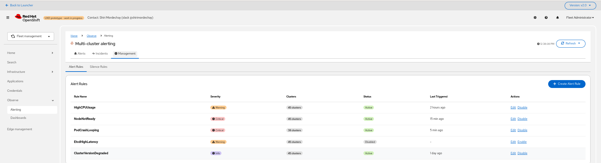
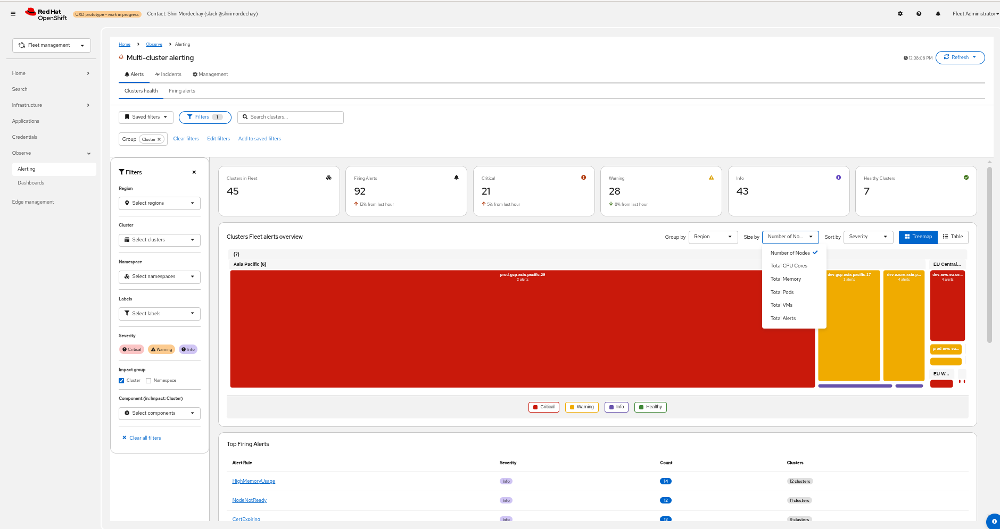
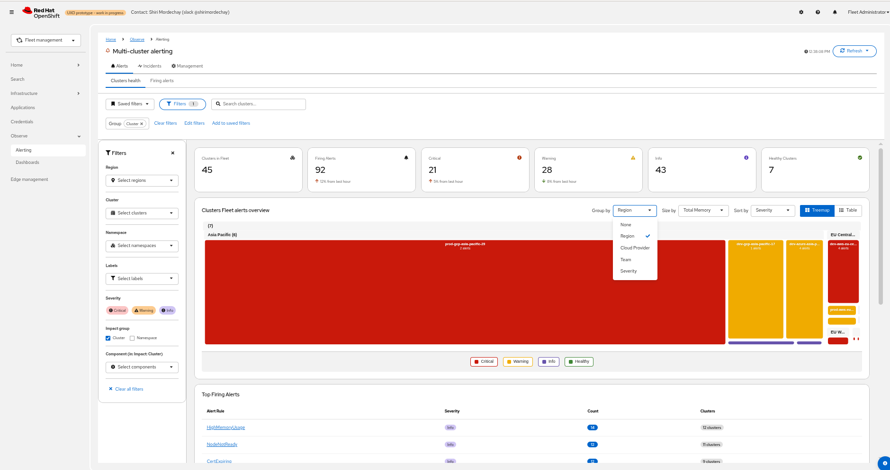
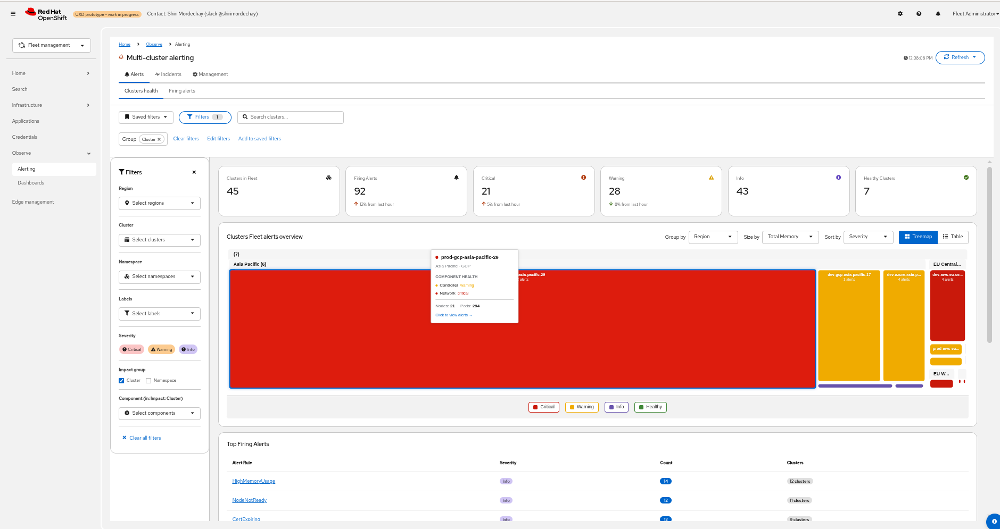
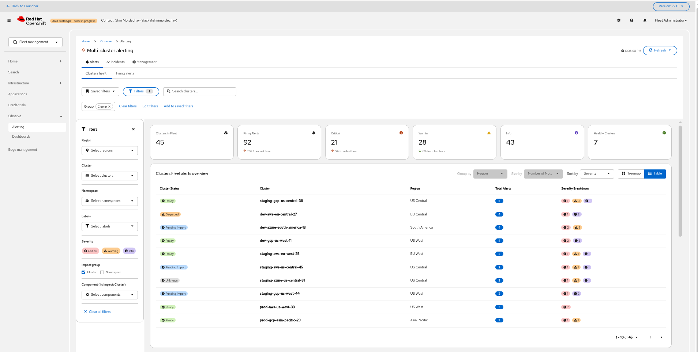
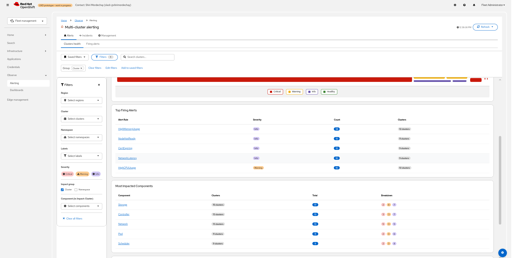
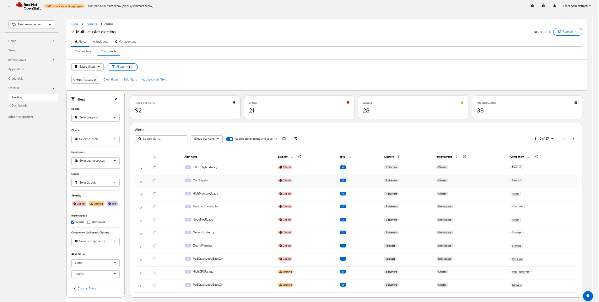
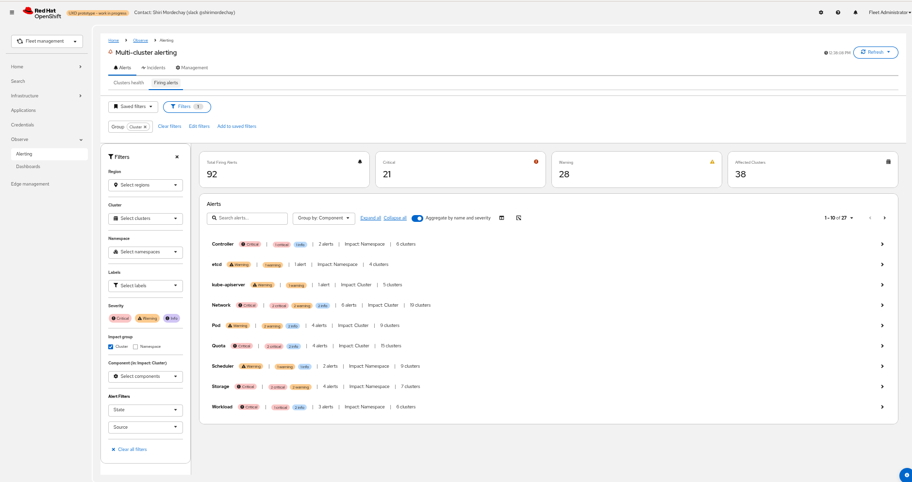

# Multi-Cluster Alerts UI Design

This proposal covers the UI design for the multi-cluster alerting experience: the Fleet Health Heatmap, alert and rule views, wireframes, and feature prioritization. It is Part 5 of the [Multi-Cluster Alerts UI Management](multi-cluster-alerts-ui-management.md) umbrella proposal.

For the backend data model and API details, see the child proposals linked from the [parent document](multi-cluster-alerts-ui-management.md#child-proposals).

## Goals

The primary goal is to provide a comprehensive alerting management UI that directly addresses the problems identified through user feedback, research, and competitive analysis.
The proposed features are intended to reduce alerts noise and improve the overall user experience for monitoring and responding to issues, including surfacing prioritized next actions based on aggregated cluster and component health, so users can address the most impactful issues first.

1. Provide a Fleet Clusters health visualization to inspect clusters status at a glance, with filtering and grouping by labels (such as name, health, region, provider) and optional weighted priority (such as node count, pods count, VMs count, CPU count, alerts count).
2. Aggregate and display alert rules and alert instances across the fleet with post-relabel context, like in the single cluster.
3. Improve correctness and performance by reusing the Single-Cluster Alerting API and extend it where necessary, such as Hub alerts.
4. Manage Global alerting rules on the hub (MCOA Thanos Ruler) and local rules on selected clusters from a unified UI.
5. Optionally propagate selected cluster labels to Prometheus `external_labels` to enable label-based routing. - Not MVP

## Tab Overview

The user interface introduces a new **Observe > Alerting** page with grouping and component-based functionality.

#### Alerts Tab
The multi-cluster Alerts page mirrors the single-cluster Alerts page for familiarity and consistency. The key difference is the addition of a **Cluster** column (and scope) so users can see and filter alerts per cluster alongside the existing fields.

#### Management Tab
The Management tab mirrors the single-cluster design and capabilities for familiarity. The multi-cluster differences are:

- The list aggregates alerting rules from all managed clusters and groups them by alert rule definition (alert name plus its full label set) to provide a unified view.
- Users can create, update, delete, enable, and disable alerting rules (subject to rule type and RBAC) and apply those changes to a selected set of clusters via the Alerting API.
- Managing hub (global) alerts is supported in the same workflow.

All other interaction patterns remain consistent with the single-cluster experience.

## Fleet Health Heatmap & Filtering

### Fleet landing page
- Fleet Health Heatmap as the primary entry point.
- Visualization:
  - Default: equal‑sized grid for quick scanning.
  - Weighted mode: Treemap where tile size reflects cluster scale, such as node count or alert volume.
  - Grouping: nest tiles by common labels, such as `region` or `provider`, to visualize domains.
  - Color: strict Red/Yellow/Green by alert severity/impact.
  - View mode: toggle button to switch between Heatmap and Table views. The table lists clusters with the same filters/grouping and shows health/status columns.
- Filtering:
  - PatternFly filter toolbar: Name, Labels (such as `env=prod`), and Health status.
  - Saved searches: persist user filter sets, such as "My Prod Clusters".
- Hub tile (The hub cluster tile in the heatmap/table):
  - Treat the Hub (MCOA) as a first‑class tile, such as "Global Platform".
  - Click to drill into global alerts, consistent with per‑cluster interaction.

### Backend data for the Heatmap
- Aggregated health metric (recording rule) deployed to spokes and federated to hub:
  - Metric: `acm:cluster:health:critical_count`
  - Definition: counts firing alerts with `severity=critical` and `impact=cluster`
  - Flow: Spoke Prometheus → MCOA Federation → Hub UI
- See [Alert Metrics and Recording Rules](multi-cluster-alert-metrics-recording-rules.md) for full metric and recording rule details.

## Proposed UI in Multi‑Cluster Console

See additional details in the [UX Design- Alerts management](https://docs.google.com/document/d/1bB7kg-W2lLq85Dmy530STMUWJFlNPFvg08Sayc-RwK8/edit?usp=sharing)

- **Management List**: show all alerting rules. Filter and sort by cluster, name, severity, namespace, status, and labels. Saved searches.

- **Clusters Health View**:
  - Fleet landing page with a Heatmap to visualize multi‑cluster health at a glance.
  - Group clusters by common labels such as region, cloud provider, severity, or other labels to understand domain health.
  - Size tiles by different dimensions to reflect scale or impact, including number of nodes, number of pods, number of VMs, number of alerts, Total CPU Cores, Total Memory.
  - Includes two summary tables below the Heatmap:
    - "Top Firing Alerts" – aggregates the most active alerts across the fleet with counts and affected clusters.
    - "Most Impacted Components" – aggregates alert impact by component and shows health breakdown per component across clusters.
  - Example screens:

- **Alerts View**: show current firing or pending instances, silence status, and relabel context. Filter and sort by cluster, name, severity, namespace, status, and labels. Saved searches.

- **Alerts View (Grouped by Component)**: same page grouped by components. Shows component health for each component across clusters.

- **Create/Edit Alerting Rule Form**: fields for Alert Name, Summary, Description, Duration, Severity, Labels, Annotations (runbook links), Impact group & Component labels and the list of clusters to apply the alert rule to, with filtering based on the clusters names, labels, versions.

- **Bulk create/edit Alerting rules labels Form**: list common labels, Add/remove alert labels.
- **Silences List**: define matchers, duration, comment - Keep

## Feature Prioritization

The features are prioritized using tags: **Must-Have**, **Should-Have**, **Could-Have**, and **Won't-Have**.

**Must-Have Features:**
- Tabs changes (Clusters Health, Alerts, Management: Alerting rules, Silence rules)
- Create user-defined alerting rules
- Create Platform alerting rules
- Create hub alerts
- Advanced filtering capabilities
- Bulk actions: disable, edit labels, edit component
- Duplicate and Delete alerting rules
- Add components and layer mapping and management

**Should-Have Features:**
- Saved filters
- Alert and alerting rule side drawer
- Add "Resource" column for node alerts
- Hub UI to manage ManagedCluster label allowlist (propagation to alert labels).
- Propagate ManagedCluster labels to the clusters Prometheus config instances.

**Should-Have Features (continued):**
- Hub AM notification receiver configuration — users can already configure receivers manually; a UI for managing hub AM receivers and routing rules for spoke alerts would reduce the barrier to centralized notification management.

**Could-Have Features:**
- Advanced notification routing UI (route by cluster labels, component, impact group)
- PromQL expression autocompletion and graph
- "Save as draft" wizard
- Alerting rule history
- Acknowledge alert
- Filter by triggered date/time
- Column management
- Additional alert action items (View logs, Troubleshoot, etc.)
- Generate a summary report
- Generate a dashboard
- Manage impact groups
- Alertmanager sub-tab

## Graduation Criteria
- **Tech Preview**: Scope, UX, and release `Graduation Criteria` will be defined with the Observability UI team. This enhancement provides the backend APIs and behaviors they consume.
- **GA**: Finalize scope and UX with the Observability UI team. Deliver multi-namespace filtering, full test coverage, and complete docs.
