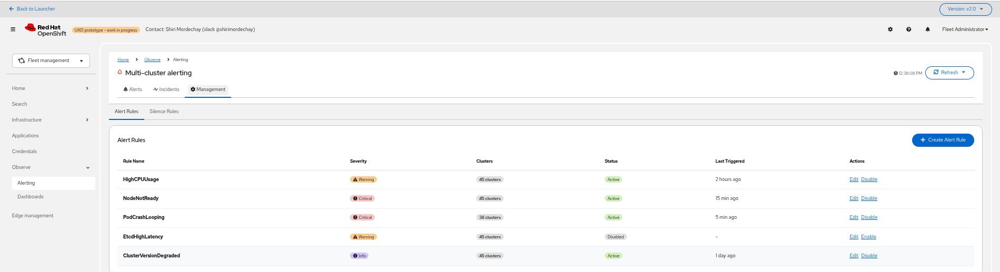
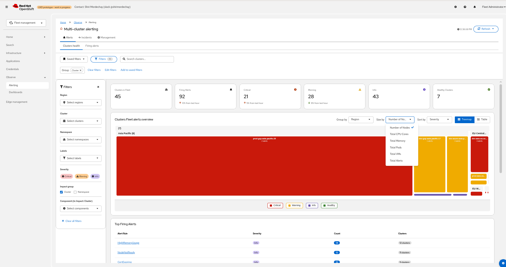
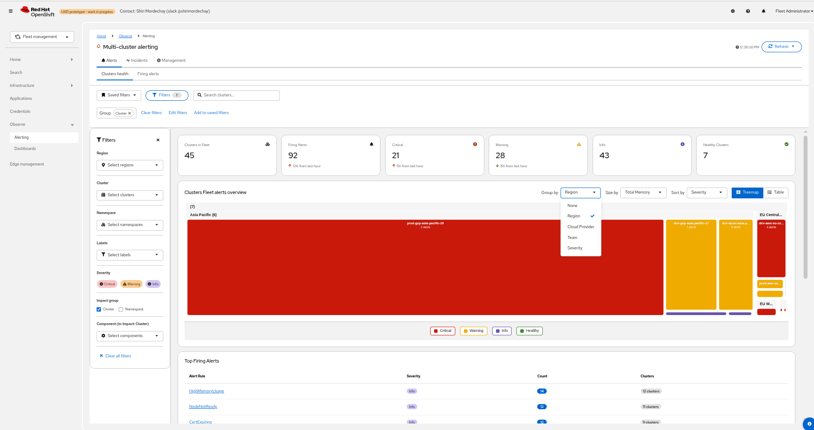
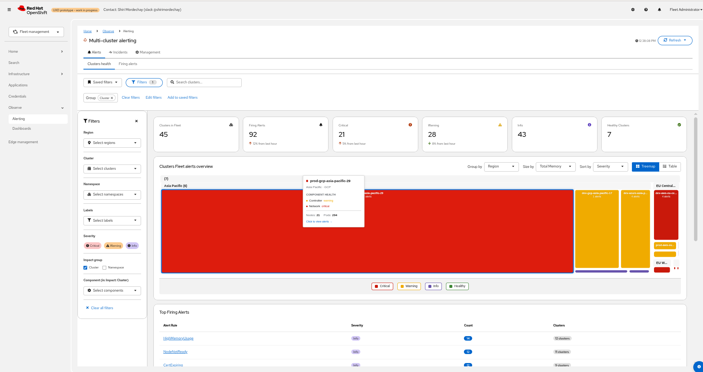
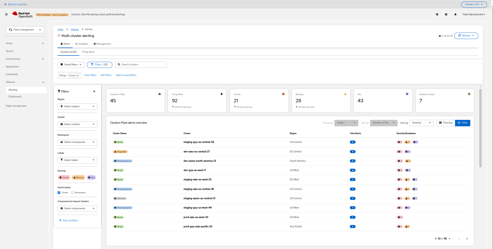
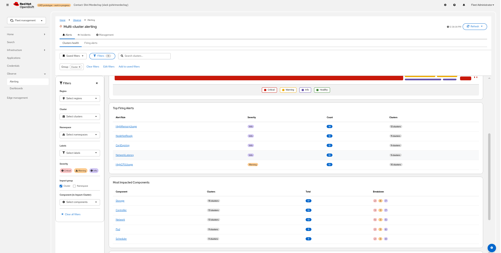
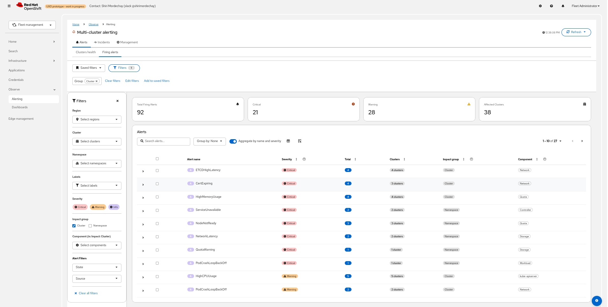
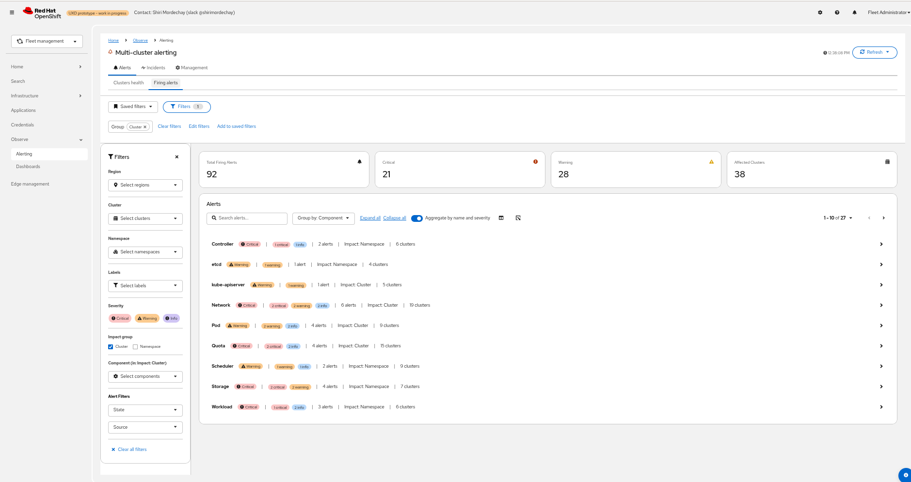

# Managing Alerts in the Multi-Cluster Console

## Summary
Introduce a centralized, multi‑cluster alerting experience on the hub cluster that leverages the Single‑Cluster Alerting API for fleet‑wide visibility and management.
The UX follows a funnel: a Fleet Health Heatmap for quick at‑a‑glance multi-clusters health status, drill‑down into per‑cluster components health  and drill-down to the specific component alerts, and unified management of alert rules via the Alerting API.

This proposal reuses the new Alerting API for read and update paths and extends it for multi‑cluster operations where needed (such as managing hub alerts).

## Motivation
- While it's possible to customize built‑in alerting rules on individual clusters (see [alert overrides](https://github.com/openshift/enhancements/blob/master/enhancements/monitoring/alert-overrides.md)), doing so consistently across many clusters is cumbersome and error‑prone. It requires templating and applying per‑cluster YAML, coordinating rollouts, and there is no fleet‑level validation or preview. Built‑in rules and alerts also remain visible per‑cluster after overrides, leading to inconsistent UX across the fleet.
- Operational teams need a fleet‑aware console and API to define, target, and audit alerting rules and silences across scopes such as fleet‑wide (hub), groups of clusters, or individual clusters, so they do not have to repeat the same action on each cluster.
- A unified multi‑cluster interface should enable creating, cloning, and disabling rules or setting silences across selected clusters, viewing aggregated and per‑cluster firing status, resolving precedence between global and local overrides, and preserving intended behavior through cluster lifecycle events and upgrades.

### Problem Statement
Fleet administrators struggle with generic per‑cluster alerting rules that create cross‑cluster noise, lack fleet‑level context, and are difficult to standardize and target by cluster labels or sets, making consistent thresholds, severity, and routing across many clusters error‑prone.

### User Stories

1. **Fleet overview and drill‑down**
   - As a Platform Admin, I want to see the health status of my clusters, specifically for my “Production” clusters to quickly identify where critical alerts are firing, and have a way to quickly drill down to see the impacted components and only then to the specif relevant alerts.

2. **Create Global (hub) alert**
   - As an SRE, I want to define a Global alert that evaluates on the hub (MCOA Thanos Ruler) over federated data and routes to the appropriate global receiver.

3. **Batch‑apply a rule to selected clusters**
   - As an Ops Lead, I want to apply or update a specific alert rule and deploy it across a list of specific clusters (that I can easily search for by their names, labels, versions, etc.) in one action, without visiting each cluster UI.

4. **View global vs cluster‑local alerts**
   - As an SRE, I want to distinguish alerts running on the hub (global scope) from those running on a specific cluster and navigate between them seamlessly.

## Goals

The primary goal is to provide a comprehensive alerting management UI that directly addresses the problems identified through user feedback, research, and competitive analysis.
The proposed features are intended to reduce alerts noise and improve the overall user experience for monitoring and responding to issues, including surfacing prioritized next actions based on aggregated cluster and component health, so users can address the most impactful issues first.

1. Provide a Fleet Clusters health visualization to inspect clusters status at a glance, with filtering and grouping by labels (such as name, health, region, provider) and optional weighted priority (such as node count, pods count, VMs count, CPU count, alerts count).
2. Support batch operations to apply, update, or delete alerting rules across a selected set of clusters.
3. Aggregate and display alert rules and alert instances across the fleet with post‑relabel context, like in the single cluster.
4. Improve correctness and performance by reusing the Single‑Cluster Alerting API and extend it where necessary, such as Hub alerts.
5. Manage Global alerting rules on the hub (MCOA Thanos Ruler) and local rules on selected clusters from a unified UI.
6. Optionally propagate selected cluster labels to Prometheus `external_labels` to enable label‑based routing. - Not MVP
7. Enforce access control consistent with hub/cluster RBAC and ensure safe multi‑cluster operations via the console backend.
8. Keep GitOps compliance: generated resources remain declarative and read‑only when owned by GitOps apps.

## Proposed Features

#### User Interface
The user interface will be redesigned, with a new **Observe > Alerting** page that highlights new grouping and components functionality.

#### Alerts Tab
The multi‑cluster Alerts page mirrors the single‑cluster Alerts page for familiarity and consistency. The key difference is the addition of a **Cluster** column (and scope) so users can see and filter alerts per cluster alongside the existing fields.

#### Management Tab
The Management tab mirrors the single‑cluster design and capabilities for familiarity. The multi‑cluster differences are:

- The list aggregates alerting rules from all managed clusters and groups them by alert rule definition (alert name plus its full label set) to provide a unified view.
- Users can create, update, delete, enable, and disable alerting rules (subject to rule type and RBAC) and apply those changes to a selected set of clusters via the Alerting API.
- Managing hub (global) alerts is supported in the same workflow.

All other interaction patterns remain consistent with the single‑cluster experience.

## Non‑Goals
- Deep RBAC beyond native Kubernetes permissions.
- Operators reacting to user modifications (operator code remains unchanged).

## Related Enhancement Proposals
- https://github.com/openshift/enhancements/blob/master/enhancements/monitoring/alert-overrides.md
- https://github.com/openshift/enhancements/blob/master/enhancements/monitoring/user-workload-monitoring.md

## Proposal

### Architecture

Key flows:
- UI authenticates and calls the console backend, which invokes the Unified Alerting API with the user’s identity and RBAC context.
- Hub (Global) scope: only hub alerting rules and silences are read and written via the Unified Alerting API.
- Cluster‑scoped operations: alerting rule and silence definitions are stored on the spoke clusters and are read/written via the Unified Alerting API through the ManagedClusterProxy on the hub to each target cluster’s APIs.
- Alerts read path: the UI can query the hub Thanos querier to list alert instances, or call the Unified Alerting API endpoint `GET /hub/alerts` which proxies to the hub Thanos and returns the same enriched schema. The endpoint aggregates alert instances from both spoke clusters and hub‑scoped alerts. Enrichment/classification (impact, component, source, cluster, etc.) is applied at read time by the endpoint and/or via relabeling.
- Firing alerts ingestion: managed clusters forward alert state that is federated and exposed by the Red Hat ACM (hub) Thanos instance (MCOA). There is no separate alerts ingestion endpoint in this design; the console backend treats Thanos as the source of truth for alert instances across spokes and hub.
- Batch endpoints: preview (dry‑run) and apply changes to a selected set of clusters. Responses include per‑cluster status, errors, and summaries.
- Rule identity and grouping: read paths aggregate rule definitions by alert name plus full label set, and aggregate alert instances with post‑relabel context for a consistent fleet view.
- GitOps ownership: when resources are owned by GitOps, the API treats them as read‑only and surfaces guidance rather than mutating in‑cluster resources.
- Conflict/drift handling: server‑side validation with optimistic concurrency (resourceVersion) and idempotent apply. The API reports conflicts and drift in per‑cluster results.
- Silences: support hub‑scoped and cluster‑scoped silences. Label‑based selectors are forwarded to the appropriate Alertmanager(s).
- Silences scope policy: Hub‑initiated silences for alerts originating on spokes are created on the respective spoke Alertmanager(s). Hub‑scoped alerts are silenced on the hub only.

Rationale for server‑side aggregation and routing:
- Provides a canonical, post‑relabel effective view and mediates validated updates to `PrometheusRule`, `AlertingRule` and `AlertRelabelConfig` across many clusters.
- Enforces consistent RBAC, ownership checks (GitOps), and conflict handling while reducing client fan‑out.
- Reuses Single‑Cluster Alerting API semantics to minimize duplication and ease maintenance; extends with batch and preview for fleet operations.

## Fleet Health Heatmap & Filtering

### Fleet landing page
- Fleet Health Heatmap as the primary entry point.
- Visualization:
  - Default: equal‑sized grid for quick scanning.
  - Weighted mode: Treemap where tile size reflects cluster scale, such as node count or alert volume.
  - Grouping: nest tiles by common labels, such as `region` or `provider`, to visualize domains.
  - Color: strict Red/Yellow/Green by alert severity/impact.
  - View mode: toggle button to switch between Heatmap and Table views. The table lists clusters with the same filters/grouping and shows health/status columns.
- Filtering:
  - PatternFly filter toolbar: Name, Labels (such as `env=prod`), and Health status.
  - Saved searches: persist user filter sets, such as “My Prod Clusters”.
- Hub tile (The hub cluster tile in the heatmap/table):
  - Treat the Hub (MCOA) as a first‑class tile, such as “Global Platform”.
  - Click to drill into global alerts, consistent with per‑cluster interaction.

### Backend data for the Heatmap
- Aggregated health metric (recording rule) deployed to spokes and federated to hub:
  - Metric: `acm:cluster:health:critical_count`
  - Definition: counts firing alerts with `severity=critical` and `impact=cluster`
  - Flow: Spoke Prometheus → MCOA Federation → Hub UI

### Proposed UI in Multi‑Cluster Console

See additional details in the [UX Design- Alerts management](https://docs.google.com/document/d/1bB7kg-W2lLq85Dmy530STMUWJFlNPFvg08Sayc-RwK8/edit?usp=sharing)

- **Management List**: show all alerting rules. Filter and sort by cluster, name, severity, namespace, status, and labels. Saved searches.

- **Clusters Health View**:
  - Fleet landing page with a Heatmap to visualize multi‑cluster health at a glance.
  - Group clusters by common labels such as region, cloud provider, severity, or other labels to understand domain health.
  - Size tiles by different dimensions to reflect scale or impact, including number of nodes, number of pods, number of VMs, number of alerts, Total CPU Cores, Total Memory.
  - Includes two summary tables below the Heatmap:
    - “Top Firing Alerts” – aggregates the most active alerts across the fleet with counts and affected clusters.
    - “Most Impacted Components” – aggregates alert impact by component and shows health breakdown per component across clusters.
  - Example screens:

- **Alerts View**: show current firing or pending instances, silence status, and relabel context. Filter and sort by cluster, name, severity, namespace, status, and labels. Saved searches.

- **Alerts View (Grouped by Component)**: same page grouped by components. Shows component health for each component across clusters.

- **Create/Edit Alerting Rule Form**: fields for Alert Name, Summary, Description, Duration, Severity, Labels, Annotations (runbook links), Impact group & Component labels and the list of clusters to apply the alert rule to, with filtering based on the clusters names, labels, versions.

- **Bulk create/edit Alerting rules labels Form**: list common labels, Add/remove alert labels.
- **Silences List**: define matchers, duration, comment - Keep

### Additional Points to Consider

**RBAC (Multi‑cluster)**
- Read and update permissions follow hub and cluster RBAC:
  - Fleet‑scoped read is constrained by the user’s access to the hub resources and per‑cluster access, such as `ManagedCluster.view` and project or namespace access on spokes.
  - Rule updates and silences are only enabled for clusters where the user has the required permissions. Actions are automatically disabled for clusters without write access.
  - GitOps‑owned resources are treated as read‑only. The UI surfaces ownership and recommended GitOps changes.
  - Scoping options include Global (hub), Selected clusters, or Single cluster. The UI reflects the effective scope before apply.

**Terminology Alignments**
- Use consistent multi‑cluster terms:
  - Cluster vs. Namespace
  - Global (hub) alert vs. Cluster‑local alert
  - Alerting rule (definition) vs. Alert (instance)
  - Impact group (Cluster/Namespace/Compute) and Component

**Alertmanager Notifications Improvements**
- Future improvements could include multi‑cluster receivers and routing by cluster labels, such as region or team, notifications by impact group and component, and team‑scoped subscriptions honoring RBAC.

**Multi‑cluster View**
- This document defines the multi‑cluster alerting experience: a centralized, aggregated view across managed clusters and the hub.
- Key multi‑cluster aspects include a centralized view, cluster‑specific context filtering, aggregated per‑cluster and per‑component health, and batch rule operations scoped to selected clusters.

### Feature Prioritization

The features are prioritized using tags: **Must-Have**, **Should-Have**, **Could-Have**, and **Won't-Have**.

**Must-Have Features:**
- Tabs changes (Clusters Health, Alerts, Management: Alerting rules, Silence rules)
- Create user-defined alerting rules
- Create Platform alerting rules
- Create hub alerts
- Advanced filtering capabilities
- Bulk actions: disable, edit labels, edit component
- Duplicate and Delete alerting rules
- Add components and layer mapping and management

**Should-Have Features:**
- Saved filters
- Alert and alerting rule side drawer
- Add "Resource" column for node alerts
- Hub UI to manage ManagedCluster label allowlist (propagation to alert labels).
- Propagate ManagedCluster labels to the clusters Prometheus config instances.

**Could-Have Features:**
- Notifications (alertmanager receivers)
- PromQL expression autocompletion and graph
- "Save as draft" wizard
- Alerting rule history
- Acknowledge alert
- Filter by triggered date/time
- Column management
- Additional alert action items (View logs, Troubleshoot, etc.)
- Generate a summary report
- Generate a dashboard
- Manage impact groups
- Alertmanager sub-tab

### API Endpoints

Base path: `/api/v1/alerting`

> Note: GET endpoints should remain compatible with upstream Thanos/Prometheus (query parameters and response schemas) wherever applicable to enable native Perses integration.

### Hub Alerts API extension

- Goal: Extend the Single‑Cluster Alerting API to support hub‑scoped alerting rules and surface alert instances evaluated on the hub (ThanosRuler) alongside spoke alerts aggregated by the hub Thanos.

- Endpoints (mirror existing single‑cluster endpoints under a hub scope):
  - Alerting rules (definitions)
    - `POST   /hub/rules`              — Create a hub alerting rule
    - `GET    /hub/rules`              — List hub alerting rules
    - `GET    /hub/rules/{ruleId}`     — Get a hub rule by id
    - `PATCH  /hub/rules/{ruleId}`     — Update a hub rule
    - `DELETE /hub/rules/{ruleId}`     — Delete a hub rule
  - Alerts (instances)
    - `GET    /hub/alerts`             — List aggregated alert instances from spoke clusters and hub (Firing / Silenced) with classification and mapping labels. Response schema should match `GET /alerting/alerts`. Backed by the hub Thanos querier and applies the same RBAC/filtering as the single‑cluster API.

#### Implementation impact (MCO adoption)
- Current behavior in `multicluster-observability-operator`: managed clusters forward alerts to the Red Hat ACM (hub) Thanos (MCOA), and the hub exposes Thanos for reads.
- Required change to adopt this design:
  - Ensure the console backend routes `GET /hub/alerts` to the hub Thanos querier and applies the same RBAC/filtering as the single‑cluster API. No separate alerts ingestion endpoint is introduced.
  - Rule storage and evaluation (spokes and hub) remain as described elsewhere in this document.

- Semantics:
  - Request/response schemas are identical to the single‑cluster Alerting API and include `ruleId`, `labels`, `annotations`, `mapping` (component/impactGroup), `source` (`platform`|`user`|`hub`), and `disabled` flags.
  - Filters mirror the single‑cluster API (`name`, `group`, `component`, `severity`, `state`, `source`, `triggered_since`, arbitrary label filters). Cluster selectors do not apply to hub scope.
  - Read paths must keep Prometheus/Thanos compatibility where applicable.

### Data Model

### Metrics and Recording Rules
- New relabeled alert metric for fleet queries:
  - `alerts_effective_active_at_timestamp_seconds`: represents final alert state after `AlertRelabelConfig` is applied. The value equals the alert start time. The pipeline drops high‑cardinality labels not needed for routing and retains routing‑relevant labels (cluster, namespace, severity, impact).
- Aggregated health recording rule (per‑cluster, federated to hub):
  - `acm:cluster:health:critical_count`: counts firing alerts with `severity=critical` and `impact=cluster`. Used by the Fleet Health Heatmap.
- Component health recording rule (per‑cluster, federated to hub):
  - `acm:component:health:severity_count`: counts firing alerts grouped by `component` and `severity`. Drives the “Most Impacted Components” table and per‑component health aggregations.
 - Hub alerts recording rule (hub‑scoped):
   - `acm:hub:health:severity_count`: counts hub‑evaluated alerts grouped by `severity`. Default mapping labels are `impact=cluster` and `component=hub`, so hub alerts participate in the fleet heatmap and component aggregations consistently.

### Migration
- Existing alerting rules should have an indication of missing recommended labels in the UI.

### GitOps / Argo CD Compliance
- All generated `PrometheusRule` and `AlertRelabelConfig` resources remain declarative and suitable for committing to Git

### Workflow Description

## Pain Points Addressed by this Design
- **Lack of prioritization in flat alert lists:** Without consistent impact scope (cluster/namespace/compute) and component metadata, alerts cannot be ranked by blast radius or ownership, forcing operators to scan long lists. Standardized `impact` and `component` labels enable fleet‑level grouping, priority cues, ownership‑based routing, and aggregated cluster/component health to surface what to address first.
- **Alert Noise and Data Overload:** Grouping, advanced filters, and saved filters will help reduce noise and the need for repetitive filtering.
- **Missed Alarms or Missing Data:** Users will be able to create flexible alert definitions directly in the UI to monitor any data type, configure notifications, and link a runbook.

## Pain Points Not Directly Addressed

## Risks & Mitigations
- **Fleet‑scale performance**: batch operations can fan out to many clusters. Apply concurrency limits and backpressure. Use per‑cluster timeouts and partial‑success reporting. Support resume or retry for long‑running batches. Paginate or stream large rule and alert lists.
- **Scope and precedence complexity**: hub vs cluster rule precedence must be deterministic. Provide dry‑run or preview, clear scope indicators, and UI guardrails. Document and enforce a single precedence policy in the API.
- **Connectivity or proxy reliability**: outages or high latency in the ManagedClusterProxy on the hub may disrupt writes and reads. Use retries with jitter, per‑cluster backoff, circuit breakers, and a degraded read mode backed by cached data.
- **Aggregation freshness at scale**: fleet caches can become stale. Define SLAs and TTLs. Provide on‑demand refresh for critical views, and progressively load details. Fall back to sampled or approximate aggregates for heatmaps when needed.
- **Label propagation and data minimization**: restrict `external_labels` to an allowlist of safe ManagedCluster labels. Validate size and cardinality, and perform periodic audits to avoid sensitive data leakage.
- **RBAC and ownership across clusters**: enforce hub and per‑cluster RBAC. Treat GitOps‑owned resources as read‑only. Return per‑cluster denial reasons in batch results.
- **Drift and consistency**: detect and surface drift between platform rules and relabel configs on spokes. Provide conflict reporting and optional reconciliation guidance.

## Graduation Criteria
- **Tech Preview**: Scope, UX, and release `Graduation Criteria` will be defined with the Observability UI team. This enhancement provides the backend APIs and behaviors they consume.
- **GA**: Finalize scope and UX with the Observability UI team. Deliver multi‑namespace filtering, full test coverage, and complete docs.

## Open Questions
 - ManagedCluster label propagation:The hub offers ManagedCluster labels (allowlist) that, during federation or at read time, add cluster labels to the alerts, which is needed for efficient notifications routing.
  Spokes do not currently support propagating ManagedCluster labels into alert labels. Should spoke‑level propagation be added in a later phase (non‑MVP)? If yes, define privacy/cardinality constraints and how precedence/deduplication would work if both hub and spokes can attach labels.

## Test Plan

**Note:** *Section not required until targeted at a release.*

Consider the following in developing a test plan for this enhancement:
- Will there be e2e and integration tests, in addition to unit tests?
- How will it be tested in isolation vs with other components?
- What additional testing is necessary to support managed OpenShift service-based offerings?

No need to outline all of the test cases, just the general strategy. Anything
that would count as tricky in the implementation and anything particularly
challenging to test should be called out.

All code is expected to have adequate tests (eventually with coverage
expectations).

## Graduation Criteria

**Note:** *Section not required until targeted at a release.*

Define graduation milestones.

These may be defined in terms of API maturity, or as something else. Initial proposal
should keep this high-level with a focus on what signals will be looked at to
determine graduation.

Consider the following in developing the graduation criteria for this
enhancement:

- Maturity levels
  - [`alpha`, `beta`, `stable` in upstream Kubernetes][maturity-levels]
  - `Dev Preview`, `Tech Preview`, `GA` in OpenShift
- [Deprecation policy][deprecation-policy]

Clearly define what graduation means by either linking to the [API doc definition](https://kubernetes.io/docs/concepts/overview/kubernetes-api/#api-versioning),
or by redefining what graduation means.

In general, we try to use the same stages (alpha, beta, GA), regardless how the functionality is accessed.

[maturity-levels]: https://git.k8s.io/community/contributors/devel/sig-architecture/api_changes.md#alpha-beta-and-stable-versions
[deprecation-policy]: https://kubernetes.io/docs/reference/using-api/deprecation-policy/

**If this is a user facing change requiring new or updated documentation in [openshift-docs](https://github.com/openshift/openshift-docs/),
please be sure to include in the graduation criteria.**

**Examples**: These are generalized examples to consider, in addition
to the aforementioned [maturity levels][maturity-levels].

### Dev Preview -> Tech Preview

- Ability to utilize the enhancement end to end
- End user documentation, relative API stability
- Sufficient test coverage
- Gather feedback from users rather than just developers
- Enumerate service level indicators (SLIs), expose SLIs as metrics
- Write symptoms-based alerts for the component(s)

### Tech Preview -> GA

- More testing (upgrade, downgrade, scale)
- Sufficient time for feedback
- Available by default
- Backhaul SLI telemetry
- Document SLOs for the component
- Conduct load testing
- User facing documentation created in [openshift-docs](https://github.com/openshift/openshift-docs/)

**For non-optional features moving to GA, the graduation criteria must include
end to end tests.**

### Removing a deprecated feature

- Announce deprecation and support policy of the existing feature
- Deprecate the feature

## Upgrade / Downgrade Strategy

If applicable, how will the component be upgraded and downgraded? Make sure this
is in the test plan.

Consider the following in developing an upgrade/downgrade strategy for this
enhancement:
- What changes (in invocations, configurations, API use, etc.) is an existing
  cluster required to make on upgrade in order to keep previous behavior?
- What changes (in invocations, configurations, API use, etc.) is an existing
  cluster required to make on upgrade in order to make use of the enhancement?

Upgrade expectations:
- Each component should remain available for user requests and
  workloads during upgrades. Ensure the components leverage best practices in handling [voluntary
  disruption](https://kubernetes.io/docs/concepts/workloads/pods/disruptions/). Any exception to
  this should be identified and discussed here.
- Existing URLs must remain operational across upgrades.
- Micro version upgrades - users should be able to skip forward versions within a
  minor release stream without being required to pass through intermediate
  versions - i.e. `x.y.N->x.y.N+2` should work without requiring `x.y.N->x.y.N+1`
  as an intermediate step.
- Minor version upgrades - you only need to support `x.N->x.N+1` upgrade
  steps. So, for example, it is acceptable to require a user running 4.3 to
  upgrade to 4.5 with a `4.3->4.4` step followed by a `4.4->4.5` step.
- While an upgrade is in progress, new component versions should
  continue to operate correctly in concert with older component
  versions (aka "version skew"). For example, if a node is down, and
  an operator is rolling out a daemonset, the old and new daemonset
  pods must continue to work correctly even while the cluster remains
  in this partially upgraded state for some time.

Downgrade expectations:
- If an `N->N+1` upgrade fails mid-way through, or if the `N+1` cluster is
  misbehaving, it should be possible for the user to rollback to `N`. It is
  acceptable to require some documented manual steps in order to fully restore
  the downgraded cluster to its previous state. Examples of acceptable steps
  include:
  - Deleting any CVO-managed resources added by the new version. The
    CVO does not currently delete resources that no longer exist in
    the target version.

## Version Skew Strategy

How will the component handle version skew with other components?
What are the guarantees? Make sure this is in the test plan.

Consider the following in developing a version skew strategy for this
enhancement:
- During an upgrade, we will always have skew among components, how will this impact your work?
- Does this enhancement involve coordinating behavior in the control plane and
  in the kubelet? How does an n-2 kubelet without this feature available behave
  when this feature is used?
- Will any other components on the node change? For example, changes to CSI, CRI
  or CNI may require updating that component before the kubelet.

## Operational Aspects of API Extensions

Describe the impact of API extensions (mentioned in the proposal section, i.e. CRDs,
admission and conversion webhooks, aggregated API servers, finalizers) here in detail,
especially how they impact the OCP system architecture and operational aspects.

- For conversion/admission webhooks and aggregated apiservers: what are the SLIs (Service Level
  Indicators) an administrator or support can use to determine the health of the API extensions

  Examples (metrics, alerts, operator conditions)
  - authentication-operator condition `APIServerDegraded=False`
  - authentication-operator condition `APIServerAvailable=True`
  - openshift-authentication/oauth-apiserver deployment and pods health

- What impact do these API extensions have on existing SLIs (e.g. scalability, API throughput,
  API availability)

  Examples:
  - Adds 1s to every pod update in the system, slowing down pod scheduling by 5s on average.
  - Fails creation of ConfigMap in the system when the webhook is not available.
  - Adds a dependency on the SDN service network for all resources, risking API availability in case
    of SDN issues.
  - Expected use-cases require less than 1000 instances of the CRD, not impacting
    general API throughput.

- How is the impact on existing SLIs to be measured and when (e.g. every release by QE, or
  automatically in CI) and by whom (e.g. perf team; name the responsible person and let them review
  this enhancement)

- Describe the possible failure modes of the API extensions.
- Describe how a failure or behaviour of the extension will impact the overall cluster health
  (e.g. which kube-controller-manager functionality will stop working), especially regarding
  stability, availability, performance and security.
- Describe which OCP teams are likely to be called upon in case of escalation with one of the failure modes
  and add them as reviewers to this enhancement.

## Support Procedures

Describe how to
- detect the failure modes in a support situation, describe possible symptoms (events, metrics,
  alerts, which log output in which component)

  Examples:
  - If the webhook is not running, kube-apiserver logs will show errors like "failed to call admission webhook xyz".
  - Operator X will degrade with message "Failed to launch webhook server" and reason "WehhookServerFailed".
  - The metric `webhook_admission_duration_seconds("openpolicyagent-admission", "mutating", "put", "false")`
    will show >1s latency and alert `WebhookAdmissionLatencyHigh` will fire.

- disable the API extension (e.g. remove MutatingWebhookConfiguration `xyz`, remove APIService `foo`)

  - What consequences does it have on the cluster health?

    Examples:
    - Garbage collection in kube-controller-manager will stop working.
    - Quota will be wrongly computed.
    - Disabling/removing the CRD is not possible without removing the CR instances. Customer will lose data.
      Disabling the conversion webhook will break garbage collection.

  - What consequences does it have on existing, running workloads?

    Examples:
    - New namespaces won't get the finalizer "xyz" and hence might leak resource X
      when deleted.
    - SDN pod-to-pod routing will stop updating, potentially breaking pod-to-pod
      communication after some minutes.

  - What consequences does it have for newly created workloads?

    Examples:
    - New pods in namespace with Istio support will not get sidecars injected, breaking
      their networking.

- Does functionality fail gracefully and will work resume when re-enabled without risking
  consistency?

  Examples:
  - The mutating admission webhook "xyz" has FailPolicy=Ignore and hence
    will not block the creation or updates on objects when it fails. When the
    webhook comes back online, there is a controller reconciling all objects, applying
    labels that were not applied during admission webhook downtime.
  - Namespaces deletion will not delete all objects in etcd, leading to zombie
    objects when another namespace with the same name is created.