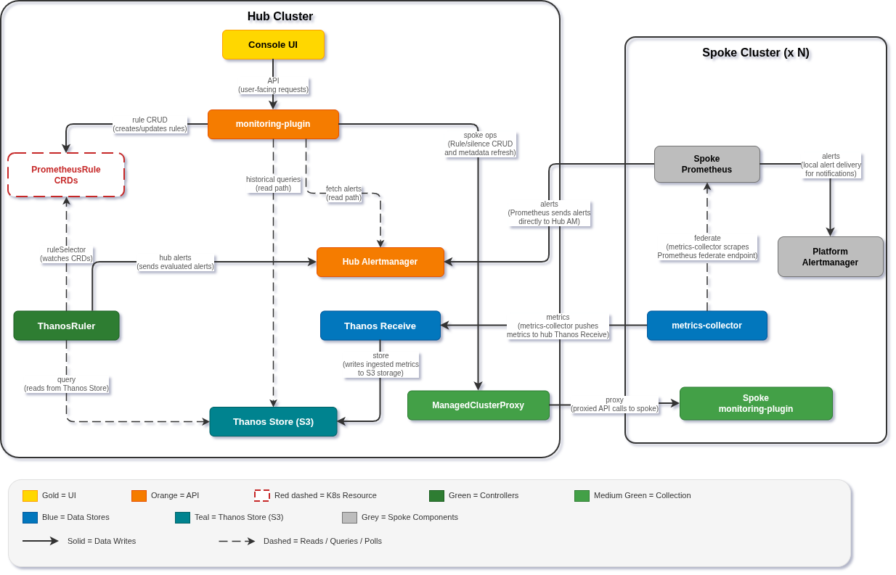

# Managing Alerts in the Multi-Cluster Console

## Summary
Introduce a centralized, multi‑cluster alerting experience on the hub cluster that leverages the Single‑Cluster Alerting API for fleet‑wide visibility and management.
The UX follows a funnel: a Fleet Health Heatmap for quick at‑a‑glance multi-clusters health status, drill‑down into per‑cluster components health  and drill-down to the specific component alerts, and unified management of alert rules via the Alerting API.

This proposal reuses the new Alerting API for read and update paths and extends it for multi‑cluster operations where needed (such as managing hub alerts).

## Child Proposals

This umbrella proposal is split into focused child documents for detailed design:

| Part | Document | Scope | Phase |
|------|----------|-------|-------|
| 1 | [Alert Visualization (Read Path)](multi-cluster-alerts-visualization.md) | `GET /alerting/alerts` enrichment pipeline on hub, data sources, caches, label topology, data model | MVP |
| 2 | [Hub Rule Management](multi-cluster-hub-rule-management.md) | Hub alerting rule CRUD via `PrometheusRule` CRDs, classification labels, ownership model | MVP |
| 3 | [Alert Effective Metric](multi-cluster-alert-effective-metric.md) | `alerts_effective_*` metric federation, hub alerts coverage, historical alert views | MVP |
| 4 | [UI Design](multi-cluster-alerts-ui-design.md) | Fleet Health Heatmap, wireframes, screenshots, feature prioritization | MVP |

The sections below provide summaries with cross-references to the child documents. The Current State, Motivation, Goals, and operational sections remain in this parent document.

## Motivation
- While it's possible to customize built‑in alerting rules on individual clusters (see [alert overrides](https://github.com/openshift/enhancements/blob/master/enhancements/monitoring/alert-overrides.md)), doing so consistently across many clusters is cumbersome and error‑prone. It requires templating and applying per‑cluster YAML, coordinating rollouts, and there is no fleet‑level validation or preview. Built‑in rules and alerts also remain visible per‑cluster after overrides, leading to inconsistent UX across the fleet.
- Operational teams need a fleet‑aware console and API to define, target, and audit alerting rules and silences across scopes such as fleet‑wide (hub), groups of clusters, or individual clusters, so they do not have to repeat the same action on each cluster.
- A unified multi‑cluster interface should enable creating, cloning, and disabling rules or setting silences across selected clusters, viewing aggregated and per‑cluster firing status, resolving precedence between global and local overrides, and preserving intended behavior through cluster lifecycle events and upgrades.

### Problem Statement
Fleet administrators struggle with generic per‑cluster alerting rules that create cross‑cluster noise, lack fleet‑level context, and are difficult to standardize and target by cluster labels or sets, making consistent thresholds, severity, and routing across many clusters error‑prone.

### User Stories

1. **Fleet overview and drill‑down**
   - As a fleet Admin, I want to see the health status of my clusters, specifically for my “Production” clusters to quickly identify where critical alerts are firing, and have a way to quickly drill down to see the impacted components and only then to the specif relevant alerts.

2. **Create and manage Global (hub) alert**
   - As an SRE, I want to define and manage a Global alert that evaluates on the hub (MCOA Thanos Ruler) over federated data and routes to the appropriate global receiver.

3. **View global vs cluster‑local alerts**
   - As an SRE, I want to distinguish alerts running on the hub (global scope) from those running on a specific cluster and navigate between them seamlessly.

5. **Manage all types of alerting rule across selected spoke clusters**
   - As a fleet Admin, I want to create, update, disable, and delete alerting rules — both platform and user-defined — across a selected set of clusters in one workflow, so I can maintain consistent rule sets across my fleet without repeating the same action on each cluster.

6. **Bulk update labels across clusters**
   - As a Platform Admin, I want to update labels — such as severity, component, layer, or custom routing labels — for a set of alerting rules across selected clusters in one action, so alert routing, escalation, and classification are consistent without repeating the change on each cluster.

7. **Namespace‑scoped fleet view**
   - As a Namespace Owner, I want to filter the fleet alerts and rules views to only show what affects my namespace(s) across clusters, so I can focus on my workloads without being overwhelmed by cluster-wide noise.

### Goals

1. Aggregate and enrich alerts across the fleet with post-relabel classification, scope, and silence state via a unified API.
2. Manage hub alerting rules (`PrometheusRule` CRDs on ThanosRuler) and spoke rules from a single API surface.
3. Provide unified silence management across hub and spoke scopes so that silenced alerts are accurately reflected in the hub view and excluded from component and cluster health calculations.
4. Collect a new alert metric that reflects the actual alert state and labels (post-relabel, post-silence) so it can be used for dashboards, health aggregation, and historical analysis.
5. Enforce access control consistent with hub/cluster RBAC and ensure safe multi-cluster operations via the console backend.
6. Maintain GitOps compliance: generated resources remain declarative and read-only when owned by GitOps apps.

> UI-specific goals (fleet health visualization, single-cluster API reuse, label propagation) are in [UI Design — Goals](multi-cluster-alerts-ui-design.md#goals).

## Proposed Features

- **Multi-cluster UI**: Fleet Health Heatmap, Alerts, and Management tabs mirroring the single-cluster experience with cluster scope and fleet-wide aggregation. See [UI Design](multi-cluster-alerts-ui-design.md).
- **Alerts enrichment pipeline** (`GET /alerting/alerts` on hub): aggregates alerts from hub Alertmanager, classifies with the hub-side classifier (`matcher.go`), enriches with spoke rule metadata and cluster metadata, and returns a unified view with classification, scope, and silence state — through the same single-cluster API. See [Alert Visualization](multi-cluster-alerts-visualization.md).
- **ManagedCluster label enrichment** (MVP): cluster labels (region, AZ, provider, env) are enriched at three levels, all MVP:
  - *API-time enrichment:* the monitoring-plugin attaches ManagedCluster labels to API responses for UI filtering and grouping.
  - *Hub AM relabeling for routing:* a relabel config controller injects cluster labels onto alerts in Alertmanager so AM routing rules can direct alerts to receivers based on cluster metadata.
  - *`acm_managed_cluster_labels` for dashboards:* the existing metric (produced by MCE, already federated to hub Thanos) exposes ManagedCluster labels, joined via `group_left` at query time. Always reflects current labels — even when querying historical data. No new metric needed.
  - All three share a single allowlist controlling which labels are exposed.
- **Hub rule management**: CRUD for hub alerting rules via `PrometheusRule` CRDs on ThanosRuler. See [Hub Rule Management](multi-cluster-hub-rule-management.md).
- **Silence management**: hub AM silence CRUD (create, list, expire) is already implemented in the monitoring-plugin via the Alertmanager proxy (port 9444).
- **`alerts_effective_*` metric**: federating the spoke-side metric to hub Thanos and extending it to include hub alerts, for historical queries and dashboards. The console UI heatmap uses real-time Hub AM alerts. See [Alert Effective Metric](multi-cluster-alert-effective-metric.md).
- **Hub AM as centralized notification hub**: spoke alerts routed to hub Alertmanager with configurable receivers and cluster-based routing. Cluster-aware routing is enabled by the AM-level label enrichment (relabel config controller).

### Non-Goals
- Deep RBAC beyond native Kubernetes permissions.
- Operators reacting to user modifications (operator code remains unchanged).

## Related Enhancement Proposals
- [Alert Overrides](https://github.com/openshift/enhancements/blob/master/enhancements/monitoring/alert-overrides.md)
- [User Workload Monitoring](https://github.com/openshift/enhancements/blob/master/enhancements/monitoring/user-workload-monitoring.md)
- [Alerts UI Management (Single-Cluster)](alerts-ui-management.md)
- [Alert Rule Classification Mapping](alert-rule-classification-mapping.md)

## Current State

This section describes the existing multi-cluster alerting infrastructure that this proposal builds upon.

### Existing alert forwarding infrastructure

Managed clusters already forward alerts to the hub Alertmanager via the Multi-Cluster Observability Addon (MCOA). The flow is:

1. **Hub side**: The MCO placement rule controller generates a `hub-info-secret` containing the hub Alertmanager URL (discovered from the `alertmanager` Route in `open-cluster-management-observability`) and router CA. This secret is distributed to each spoke cluster via ManifestWork.

2. **Spoke side**: The MCOA endpoint operator (`observabilityaddon_controller`) reads `hub-info-secret` and injects `additionalAlertmanagerConfigs` into the spoke's `cluster-monitoring-config` ConfigMap (and `user-workload-monitoring-config` for user workload monitoring). This configuration tells spoke Prometheus to forward all firing alerts to the hub Alertmanager. The endpoint operator also adds a `managed_cluster` external label (set to the spoke cluster name) so hub AM can identify the originating cluster.

3. **Alert delivery**: Spoke Prometheus sends alerts to hub AM on every evaluation cycle (~30s-1min). Since `alert_relabel_configs` from ARCs are applied globally in Prometheus before alerts are dispatched to any Alertmanager, spoke alerts arrive at hub AM with post-ARC labels (including `openshift_io_alert_rule_id`, component, layer, and severity overrides for rules that have been classified).

4. **Hub ThanosRuler**: ThanosRuler evaluates rules over federated metrics in hub Thanos and sends its alerts to the same hub Alertmanager (via internal service DNS: `observability-alertmanager-{i}.alertmanager-operated.open-cluster-management-observability.svc:9095`).

5. **Hub AM Route**: Hub Alertmanager is exposed via an OpenShift Route (`alertmanager`) at `/api/v2`, fronted by an OAuth proxy on port 9095.

### Alert data storage and lifecycle

Alert data lives in two fundamentally different stores on the hub, each serving a different purpose:

**Hub Alertmanager (transient, in-memory)**

Hub AM holds active alert instances in memory, backed by a local PVC for silences and notification state. It is not a persistent store — it only knows about currently active alerts. Hub AM can answer "what is firing right now?" but cannot answer "what was firing yesterday?" The `resolve_timeout` setting defines how long Alertmanager waits before considering an alert resolved when no new updates are received (relevant for alert sources that don't send an explicit "resolved" notification; in practice, Prometheus/Thanos always send an end timestamp so this rarely applies).

The hub AM configuration defaults to a `null` receiver (no notifications sent). However, the AM config Secret uses a `skip-creation-if-exist: "true"` annotation, so users can customize receivers after initial deployment without the operator overwriting their changes. This enables hub AM to serve as a centralized notification hub for spoke alerts (see [Hub Alertmanager as Centralized Notification Hub](#hub-alertmanager-as-centralized-notification-hub)).

**Hub Thanos (persistent, S3 object storage)**

Metrics collected from spokes (including the `ALERTS` metric, which is in the default allowlist) are federated to hub Thanos via the metrics-collector and stored in S3-compatible object storage. This data is persistent and subject to Thanos retention and compaction policies. It supports historical queries via PromQL.

However, the `ALERTS` metric in hub Thanos has significant limitations compared to hub AM:
- **No ARC-applied labels**: The `ALERTS` metric is produced by Prometheus rule evaluation, before ARCs are applied. It lacks `openshift_io_alert_rule_id`, `openshift_io_alert_rule_component`, and `openshift_io_alert_rule_layer`.
- **No silence awareness**: Silenced alerts still appear as `alertstate="firing"` in the `ALERTS` metric — Prometheus does not know about Alertmanager silences.
- **`managed_cluster` is stripped**: The metrics-collector strips the `managed_cluster` label during federation. Only the `cluster` label (added by MCOA addon write relabel configs) is available on hub Thanos.
- **No disabled alert awareness**: ARC-dropped alerts never fire, so they are absent from `ALERTS`, but there is no way to distinguish "never fired" from "disabled by ARC."

These limitations are why this proposal introduces the `alerts_effective_active_at_timestamp_seconds` metric — it carries post-ARC labels, silence state (`alertstate=silenced`), and excludes disabled alerts, providing the enriched historical view that the raw `ALERTS` metric cannot.

### Existing ACM alerting developer preview

A [developer preview of the Multi-Cluster Alerting UI](https://developers.redhat.com/articles/2025/03/27/new-multi-cluster-alerting-ui-developer-preview) is available in the ACM console, built on the monitoring-plugin with the `acm-alerting` feature flag. It provides:

- **Proxy servers**: When `acm-alerting` is enabled, the monitoring-plugin starts two additional proxy servers alongside its main server:
  - **Alertmanager proxy** on port 9444 — proxies to the hub AM URL (configured via `--alertmanager` flag or `UIPlugin` CR)
  - **Thanos Querier proxy** on port 9445 — proxies to the `rbac-query-proxy` (configured via `--thanos-querier` flag or `UIPlugin` CR)
- **Frontend paths**: The console frontend accesses these proxies via:
  - `ALERTMANAGER_PROXY_PATH` (`/api/proxy/plugin/monitoring-console-plugin/alertmanager-proxy`) — for alerts and silences (`/api/v2/alerts`, `/api/v2/silences`)
  - `PROMETHEUS_PROXY_PATH` (`/api/proxy/plugin/monitoring-console-plugin/thanos-proxy`) — for PromQL queries and rules
- **UIPlugin CR**: The Cluster Observability Operator (COO) provides a `UIPlugin` custom resource to configure the hub AM and Thanos Querier URLs.
- **Current scope**: The developer preview focuses on displaying ThanosRuler-evaluated alerts (hub rules). Forwarded spoke alerts are present in hub AM but lack enrichment context.

### Gaps in the current state

The existing infrastructure forwards spoke alerts to hub AM and provides basic proxy access, but the following gaps prevent a production-ready multi-cluster alerting experience:

1. **No alert enrichment**: The proxy returns raw hub AM data. Alerts lack classification context (component, layer) for spokes that haven't been classified via the Alerting API, and there is no rule metadata (alertRuleId, source, managedBy, disabled state).
2. **No spoke silence visibility on hub**: Hub AM silence CRUD is already implemented, but spoke-local silences are not reflected on hub AM. An alert silenced on a spoke still appears as firing on the hub alerts page.
3. **No hub rule management**: No API to create, update, or delete ThanosRuler rules from the UI.
4. **No historical alert views with enrichment**: The `ALERTS` metric in Thanos lacks ARC labels and silence state, making enriched alert history impossible without the new `alerts_effective_*` metric.
6. **No centralized notification management UI**: Users can manually configure hub AM receivers but there is no UI support for managing notification routing for spoke alerts.

## Proposal

### Architecture

The hub monitoring-plugin reuses the **same single-cluster Alerting API** (`/api/v1/alerting/*`). On the hub, the monitoring-plugin is configured to point to hub Alertmanager as its backend, which receives both spoke-forwarded alerts and ThanosRuler alerts. The enrichment pipeline adds spoke rule metadata (from each spoke's Alerting API via ManagedClusterProxy) and classification to produce a unified fleet view through the same API surface. Spoke clusters forward alerts and metrics to the hub; the hub classifies, enriches, and serves a unified view. See the summaries below and child proposals for details on each flow.

### Alerts Enrichment Pipeline (summary)

> Full detail: [Alert Visualization (Read Path)](multi-cluster-alerts-visualization.md)

On the hub, `GET /alerting/alerts` assembles a complete, post-relabel view of all alerts across the fleet — reusing the same single-cluster API. The primary data source is **Hub Alertmanager** (near real-time, ~30s-1min) — spoke Prometheus forwards alerts with `managed_cluster` label and ARC-applied labels. Silences created on hub AM are natively reflected in the response. The Fleet Health Heatmap is also computed from real-time Hub AM alerts in the monitoring-plugin cache.

The hub-side classifier (`matcher.go`) computes `alertComponent` and `alertLayer` locally — same logic as the single-cluster API, no fan-out needed for classification. The Rule Metadata Cache provides additional rule metadata (`alertRuleId`, `source`, `managedBy`) from spoke APIs. Enrichment steps: fetch from hub AM → classify by scope → classify with hub-side classifier → enrich with rule metadata → filter/sort/paginate.

**Prerequisites**: monitoring-plugin on spokes (OCP 4.18+), ManagedClusterProxy, MCOA endpoint operator.

**Historical views**: Hub AM is transient — historical alert queries must use metrics from hub Thanos (S3). See the child document for the full data source comparison table.

### Silence Management

Hub AM silence CRUD is already implemented in the monitoring-plugin via the Alertmanager proxy. Spoke silence propagation and declarative management are potential future improvements.

### Hub Rule Management (summary)

> Full detail: [Hub Rule Management](multi-cluster-hub-rule-management.md)

Hub alerting rules are evaluated by MCOA ThanosRuler over federated data from hub Thanos. Today, ThanosRuler is deployed via the Observatorium operator with ConfigMap-based rule files. This proposal requires MCO to adopt prometheus-operator's `ThanosRuler` CR with `ruleSelector` for `PrometheusRule` CRDs — the same CRD used on spokes. This provides per-rule ownership, GitOps annotations, and optimistic concurrency, consistent with the single-cluster approach.

**Classification labels**: For operator default rules, a static mapping is used (MVP); for user-created rules, `component` and `layer` are written as labels in the rule definition. Future: `alertRelabelConfigs` support on ThanosRuler.

### Hub Alertmanager as Centralized Notification Hub (summary)

Hub AM receives alerts from all spokes and ThanosRuler. It defaults to a `null` receiver but users can customize receivers (the config Secret uses `skip-creation-if-exist: "true"`). This enables hub AM as a centralized notification hub — configure receivers once on the hub instead of on each spoke. The `managed_cluster` label enables cluster-based routing. Users can already create silences directly on hub AM to suppress hub-side notifications.

### API Endpoints

> Detailed endpoint specifications are in the child proposals:
> - Alerts and rules: [Alert Visualization](multi-cluster-alerts-visualization.md#api-endpoints) and [Hub Rule Management](multi-cluster-hub-rule-management.md#api-endpoints)
Base path: `/api/v1/alerting`

The hub monitoring-plugin reuses the **same single-cluster Alerting API**. On the hub, the monitoring-plugin points to hub Alertmanager, and the enrichment pipeline adds spoke rule metadata. Request/response schemas are identical to the single-cluster API and include `ruleId`, `labels`, `annotations`, `mapping` (component/impactGroup), `source`, `managedBy`, and `disabled` flags. Filters mirror the single-cluster API plus multi-cluster filters (`cluster`, `cluster_labels`). GET endpoints remain compatible with upstream Thanos/Prometheus where applicable.

Summary of endpoints (same API surface on hub and spokes):

| Endpoint | Method | Purpose (on hub) |
|----------|--------|---------|
| `/alerting/alerts` | GET | Aggregated alert instances from hub AM (enriched with spoke rule metadata) |
| `/alerting/rules` | GET/POST | List hub + spoke rules (unified view) / create hub alerting rules |
| `/alerting/rules` | PATCH/DELETE | Update / delete a hub rule |
| Alertmanager proxy | GET/POST/DELETE | List / create / expire silences (already implemented via AM proxy) |

#### Implementation impact (MCO adoption)

- The hub monitoring-plugin uses the same `GET /alerting/alerts` API backed by hub Alertmanager (primary, near real-time) and enriches with spoke rule metadata via the Rule Metadata Cache.
- Hub rule management uses `PrometheusRule` CRDs via the same `POST/PATCH/DELETE /alerting/rules` API — requires MCO to adopt prometheus-operator's `ThanosRuler` CR.

### Data Model and Metrics

> Full detail: [Alert Visualization — Data Model](multi-cluster-alerts-visualization.md#data-model) and [Alert Effective Metric](multi-cluster-alert-effective-metric.md)

## Fleet Health Heatmap, UI Design & Feature Prioritization

> Full detail: [UI Design](multi-cluster-alerts-ui-design.md)

The Fleet Health Heatmap is the primary fleet landing page, providing at-a-glance cluster health with drill-down into per-cluster components and alerts. The UI mirrors the single-cluster alerting experience with the addition of cluster scope, fleet-wide aggregation, and multi-cluster management workflows. See the child document for wireframes, screenshots, and feature prioritization (Must-Have / Should-Have / Could-Have).

### Migration
- Existing alerting rules should have an indication of missing recommended labels in the UI.

### GitOps / Argo CD Compliance
- All generated `PrometheusRule` and `AlertRelabelConfig` resources remain declarative and suitable for committing to Git

### Workflow Description

### API Extensions

See API Endpoints in each child proposal:
- [Alert Visualization](multi-cluster-alerts-visualization.md#api-endpoints)
- [Hub Rule Management](multi-cluster-hub-rule-management.md#api-endpoints)

### Topology Considerations

#### Hypershift / Hosted Control Planes

#### Standalone Clusters

#### Single-node Deployments or MicroShift

#### OpenShift Kubernetes Engine

### Implementation Details/Notes/Constraints

See implementation impact sections in each child proposal.

### Risks and Mitigations

See [Risks & Mitigations](#risks--mitigations) below and individual child proposals.

### Drawbacks

## Pain Points Addressed by this Design
- **Lack of prioritization in flat alert lists:** Without consistent layer scope (cluster/namespace) and component metadata, alerts cannot be ranked by blast radius or ownership, forcing operators to scan long lists. Standardized `layer` and `component` labels enable fleet‑level grouping, priority cues, ownership‑based routing, and aggregated cluster/component health to surface what to address first.
- **Alert Noise and Data Overload:** Grouping, advanced filters, and saved filters will help reduce noise and the need for repetitive filtering.
- **Missed Alarms or Missing Data:** Users will be able to create flexible alert definitions directly in the UI to monitor any data type, configure notifications, and link a runbook.

## Pain Points Not Directly Addressed

## Risks & Mitigations
- **Fleet‑scale performance**: paginate or stream large rule and alert lists. Use per‑cluster timeouts and partial‑success reporting for operations that fan out via ManagedClusterProxy.
- **Label enrichment and data minimization**: restrict the ManagedCluster label allowlist (for API and AM enrichment) to safe, non-sensitive labels. Monitor cardinality of `acm_managed_cluster_labels` and perform periodic audits to avoid sensitive data leakage.
- **Drift and consistency**: detect and surface drift between platform rules and relabel configs on spokes. Provide conflict reporting and optional reconciliation guidance.

See Risks & Mitigations in each child proposal for topic-specific risks.

## Open Questions

See Open Questions in each child proposal:
- [Hub Rule Management](multi-cluster-hub-rule-management.md#open-questions)
- [Alert Effective Metric](multi-cluster-alert-effective-metric.md#open-questions)

## Alternatives (Not Implemented)

## Test Plan

**Note:** *Section not required until targeted at a release.*

Consider the following in developing a test plan for this enhancement:
- Will there be e2e and integration tests, in addition to unit tests?
- How will it be tested in isolation vs with other components?
- What additional testing is necessary to support managed OpenShift service-based offerings?

No need to outline all of the test cases, just the general strategy. Anything
that would count as tricky in the implementation and anything particularly
challenging to test should be called out.

All code is expected to have adequate tests (eventually with coverage
expectations).

## Graduation Criteria

**Note:** *Section not required until targeted at a release.*

Define graduation milestones.

These may be defined in terms of API maturity, or as something else. Initial proposal
should keep this high-level with a focus on what signals will be looked at to
determine graduation.

Consider the following in developing the graduation criteria for this
enhancement:

- Maturity levels
  - [`alpha`, `beta`, `stable` in upstream Kubernetes][maturity-levels]
  - `Dev Preview`, `Tech Preview`, `GA` in OpenShift
- [Deprecation policy][deprecation-policy]

Clearly define what graduation means by either linking to the [API doc definition](https://kubernetes.io/docs/concepts/overview/kubernetes-api/#api-versioning),
or by redefining what graduation means.

In general, we try to use the same stages (alpha, beta, GA), regardless how the functionality is accessed.

[maturity-levels]: https://git.k8s.io/community/contributors/devel/sig-architecture/api_changes.md#alpha-beta-and-stable-versions
[deprecation-policy]: https://kubernetes.io/docs/reference/using-api/deprecation-policy/

**If this is a user facing change requiring new or updated documentation in [openshift-docs](https://github.com/openshift/openshift-docs/),
please be sure to include in the graduation criteria.**

**Examples**: These are generalized examples to consider, in addition
to the aforementioned [maturity levels][maturity-levels].

### Dev Preview -> Tech Preview

- Ability to utilize the enhancement end to end
- End user documentation, relative API stability
- Sufficient test coverage
- Gather feedback from users rather than just developers
- Enumerate service level indicators (SLIs), expose SLIs as metrics
- Write symptoms-based alerts for the component(s)

### Tech Preview -> GA

- More testing (upgrade, downgrade, scale)
- Sufficient time for feedback
- Available by default
- Backhaul SLI telemetry
- Document SLOs for the component
- Conduct load testing
- User facing documentation created in [openshift-docs](https://github.com/openshift/openshift-docs/)

**For non-optional features moving to GA, the graduation criteria must include
end to end tests.**

### Removing a deprecated feature

- Announce deprecation and support policy of the existing feature
- Deprecate the feature

## Upgrade / Downgrade Strategy

If applicable, how will the component be upgraded and downgraded? Make sure this
is in the test plan.

Consider the following in developing an upgrade/downgrade strategy for this
enhancement:
- What changes (in invocations, configurations, API use, etc.) is an existing
  cluster required to make on upgrade in order to keep previous behavior?
- What changes (in invocations, configurations, API use, etc.) is an existing
  cluster required to make on upgrade in order to make use of the enhancement?

Upgrade expectations:
- Each component should remain available for user requests and
  workloads during upgrades. Ensure the components leverage best practices in handling [voluntary
  disruption](https://kubernetes.io/docs/concepts/workloads/pods/disruptions/). Any exception to
  this should be identified and discussed here.
- Existing URLs must remain operational across upgrades.
- Micro version upgrades - users should be able to skip forward versions within a
  minor release stream without being required to pass through intermediate
  versions - i.e. `x.y.N->x.y.N+2` should work without requiring `x.y.N->x.y.N+1`
  as an intermediate step.
- Minor version upgrades - you only need to support `x.N->x.N+1` upgrade
  steps. So, for example, it is acceptable to require a user running 4.3 to
  upgrade to 4.5 with a `4.3->4.4` step followed by a `4.4->4.5` step.
- While an upgrade is in progress, new component versions should
  continue to operate correctly in concert with older component
  versions (aka "version skew"). For example, if a node is down, and
  an operator is rolling out a daemonset, the old and new daemonset
  pods must continue to work correctly even while the cluster remains
  in this partially upgraded state for some time.

Downgrade expectations:
- If an `N->N+1` upgrade fails mid-way through, or if the `N+1` cluster is
  misbehaving, it should be possible for the user to rollback to `N`. It is
  acceptable to require some documented manual steps in order to fully restore
  the downgraded cluster to its previous state. Examples of acceptable steps
  include:
  - Deleting any CVO-managed resources added by the new version. The
    CVO does not currently delete resources that no longer exist in
    the target version.

## Version Skew Strategy

How will the component handle version skew with other components?
What are the guarantees? Make sure this is in the test plan.

Consider the following in developing a version skew strategy for this
enhancement:
- During an upgrade, we will always have skew among components, how will this impact your work?
- Does this enhancement involve coordinating behavior in the control plane and
  in the kubelet? How does an n-2 kubelet without this feature available behave
  when this feature is used?
- Will any other components on the node change? For example, changes to CSI, CRI
  or CNI may require updating that component before the kubelet.

## Operational Aspects of API Extensions

Describe the impact of API extensions (mentioned in the proposal section, i.e. CRDs,
admission and conversion webhooks, aggregated API servers, finalizers) here in detail,
especially how they impact the OCP system architecture and operational aspects.

- For conversion/admission webhooks and aggregated apiservers: what are the SLIs (Service Level
  Indicators) an administrator or support can use to determine the health of the API extensions

  Examples (metrics, alerts, operator conditions)
  - authentication-operator condition `APIServerDegraded=False`
  - authentication-operator condition `APIServerAvailable=True`
  - openshift-authentication/oauth-apiserver deployment and pods health

- What impact do these API extensions have on existing SLIs (e.g. scalability, API throughput,
  API availability)

  Examples:
  - Adds 1s to every pod update in the system, slowing down pod scheduling by 5s on average.
  - Fails creation of ConfigMap in the system when the webhook is not available.
  - Adds a dependency on the SDN service network for all resources, risking API availability in case
    of SDN issues.
  - Expected use-cases require less than 1000 instances of the CRD, not impacting
    general API throughput.

- How is the impact on existing SLIs to be measured and when (e.g. every release by QE, or
  automatically in CI) and by whom (e.g. perf team; name the responsible person and let them review
  this enhancement)

- Describe the possible failure modes of the API extensions.
- Describe how a failure or behaviour of the extension will impact the overall cluster health
  (e.g. which kube-controller-manager functionality will stop working), especially regarding
  stability, availability, performance and security.
- Describe which OCP teams are likely to be called upon in case of escalation with one of the failure modes
  and add them as reviewers to this enhancement.

## Support Procedures

Describe how to
- detect the failure modes in a support situation, describe possible symptoms (events, metrics,
  alerts, which log output in which component)

  Examples:
  - If the webhook is not running, kube-apiserver logs will show errors like "failed to call admission webhook xyz".
  - Operator X will degrade with message "Failed to launch webhook server" and reason "WehhookServerFailed".
  - The metric `webhook_admission_duration_seconds("openpolicyagent-admission", "mutating", "put", "false")`
    will show >1s latency and alert `WebhookAdmissionLatencyHigh` will fire.

- disable the API extension (e.g. remove MutatingWebhookConfiguration `xyz`, remove APIService `foo`)

  - What consequences does it have on the cluster health?

    Examples:
    - Garbage collection in kube-controller-manager will stop working.
    - Quota will be wrongly computed.
    - Disabling/removing the CRD is not possible without removing the CR instances. Customer will lose data.
      Disabling the conversion webhook will break garbage collection.

  - What consequences does it have on existing, running workloads?

    Examples:
    - New namespaces won't get the finalizer "xyz" and hence might leak resource X
      when deleted.
    - SDN pod-to-pod routing will stop updating, potentially breaking pod-to-pod
      communication after some minutes.

  - What consequences does it have for newly created workloads?

    Examples:
    - New pods in namespace with Istio support will not get sidecars injected, breaking
      their networking.

- Does functionality fail gracefully and will work resume when re-enabled without risking
  consistency?

  Examples:
  - The mutating admission webhook "xyz" has FailPolicy=Ignore and hence
    will not block the creation or updates on objects when it fails. When the
    webhook comes back online, there is a controller reconciling all objects, applying
    labels that were not applied during admission webhook downtime.
  - Namespaces deletion will not delete all objects in etcd, leading to zombie
    objects when another namespace with the same name is created.