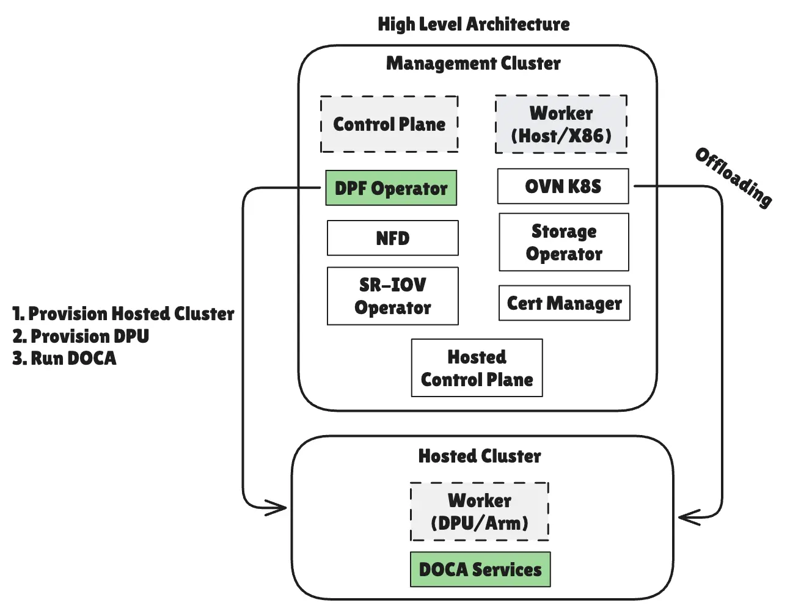
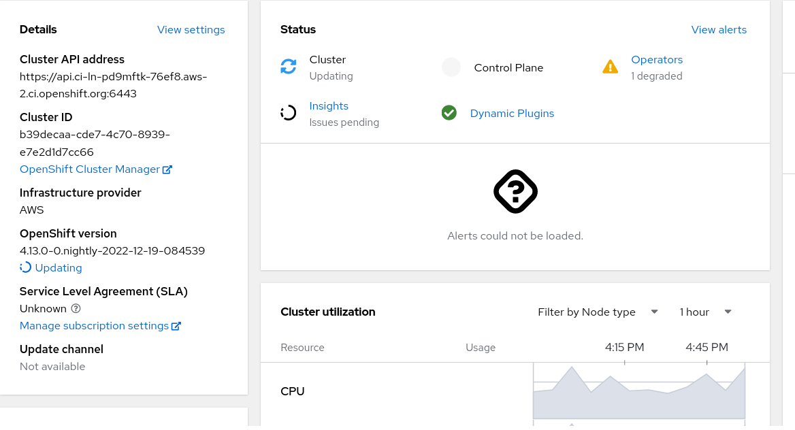
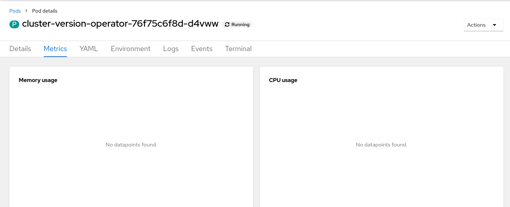
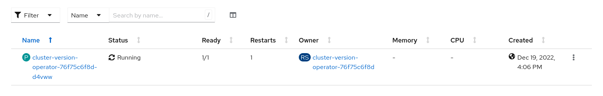
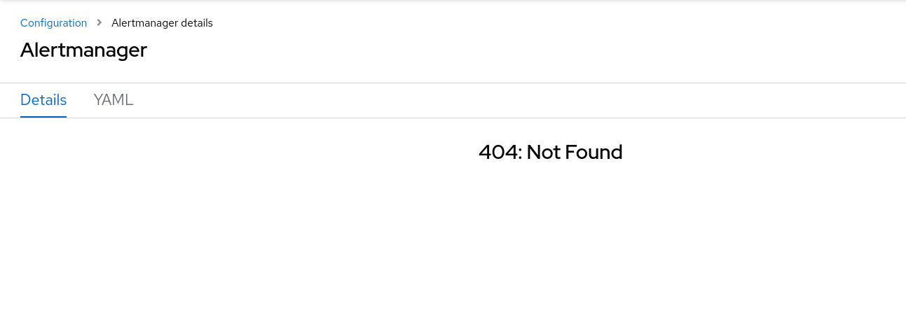
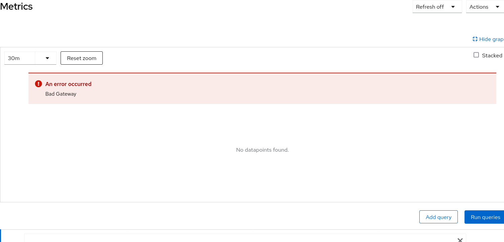
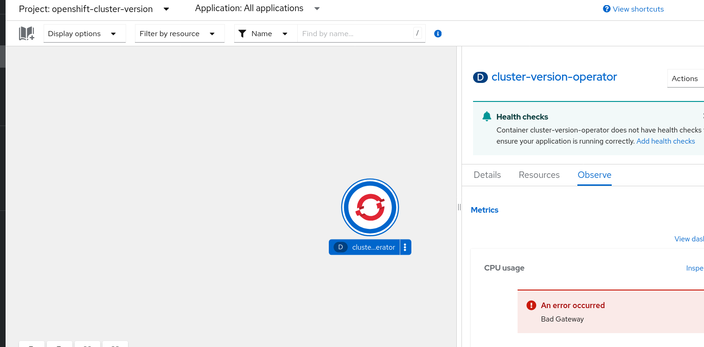
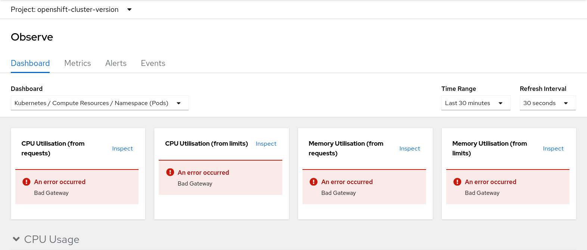

<!--
To get started with this template:
1. **Pick a domain.** Find the appropriate domain to discuss your enhancement.
1. **Make a copy of this template.** Copy this template into the directory for
   the domain.
1. **Fill out the metadata at the top.** The embedded YAML document is
   checked by the linter.
1. **Fill out the "overview" sections.** This includes the Summary and
   Motivation sections. These should be easy and explain why the community
   should desire this enhancement.
1. **Create a PR.** Assign it to folks with expertise in that domain to help
   sponsor the process.
1. **Merge after reaching consensus.** Merge when there is consensus
   that the design is complete and all reviewer questions have been
   answered so that work can begin.  Come back and update the document
   if important details (API field names, workflow, etc.) change
   during code review.
1. **Keep all required headers.** If a section does not apply to an
   enhancement, explain why but do not remove the section. This part
   of the process is enforced by the linter CI job.

See ../README.md for background behind these instructions.

Start by filling out the header with the metadata for this enhancement.
-->

# Optional Monitoring Capability

<!--
This is the title of the enhancement. Keep it simple and descriptive. A good
title can help communicate what the enhancement is and should be considered as
part of any review.

The YAML `title` should be lowercased and spaces/punctuation should be
replaced with `-`.

The `Metadata` section above is intended to support the creation of tooling
around the enhancement process.
-->

## Summary

<!--
The `Summary` section is important for producing high quality
user-focused documentation such as release notes or a development roadmap. It
should be possible to collect this information before implementation begins in
order to avoid requiring implementors to split their attention between writing
release notes and implementing the feature itself.

Your summary should be one paragraph long. More detail
should go into the following sections.
-->

This enhancement proposes introducing a [cluster capability] to
allow disabling optional components of the in-cluster monitoring
stack. Note that:
(a) by "optional" we mean components, or parts of components, that
are not required for [telemetry operations], and,
(b) the capability will be enabled by default (implicity enabled),
to preserve the historical UX.

[cluster-capability]: /enhancements/installer/component-selection.md
[telemetry operations]: https://docs.redhat.com/en/documentation/openshift_container_platform/4.18/html/support/remote-health-monitoring-with-connected-clusters

## Motivation

<!--
This section is for explicitly listing the motivation, goals and non-goals of
this proposal. Describe why the change is important and the benefits to users.
-->

Cluster admins that do not require a full-fledged monitoring solution
can choose to save resources by disabling optional components of
the in-cluster monitoring stack. Components responsible for telemetry
data collection and forwarding (i.e., the non-optional components)
will remain enabled to ensure that telemetry operations are not
affected.

Note that while it is possible to disable certain components of the
in-cluster monitoring stack through the configuration in a on-off
fashion, implementing this behavior through a cluster capability
will help us differentiate between a use-case that does not require
individual monitoring components and a use-case that requires
telemetry operations only.

Based on this information, we can code certain behaviors in the
monitoring operator that wouldn't otherwise make sense, and would
help reduce the overall monitoring footprint not just across the
stack, but the cluster itself (since we'd be sure of the intent),
such as [setting the `METRICS_SET` for hypershift clusters] to
`Telemetry` or disabling support for the [PromQL cluster condition
type] in CVO, when the capability is disabled.

[setting the `METRICS_SET` for hypershift clusters]: https://hypershift-docs.netlify.app/how-to/metrics-sets/
[PromQL cluster condition type]: enhancements/update/targeted-update-edge-blocking.md#cluster-condition-type-registry

### User Stories

<!--
Detail the things that people will be able to do if this is implemented and
what goal that allows them to achieve. In each story, explain who the actor
is based on their role, explain what they want to do with the system,
and explain the underlying goal they have, what it is they are going to
achieve with this new feature.

Use the standard three part formula:

> "As a _role_, I want to _take some action_ so that I can _accomplish a
goal_."

Make the change feel real for users, without getting bogged down in
implementation details.

Here are some example user stories to show what they might look like:

* As an OpenShift engineer, I want to write an enhancement, so that I
  can get feedback on my design and build consensus about the approach
  to take before starting the implementation.
* As an OpenShift engineer, I want to understand the rationale behind
  a particular feature's design and alternatives considered, so I can
  work on a new enhancement in that problem space knowing the history
  of the current design better.
* As a product manager, I want to review this enhancement proposal, so
  that I can make sure the customer requirements are met by the
  design.
* As an administrator, I want a one-click OpenShift installer, so that
  I can easily set up a new cluster without having to follow a long
  set of operations.

In each example, the persona's goal is clear, and the goal is clearly provided
by the capability being described.
The engineer wants feedback on their enhancement from their peers, and writing
an enhancement allows for that feedback.
The product manager wants to make sure that their customer requirements are fulfilled,
reviewing the enhancement allows them to check that.
The administrator wants to set up his OpenShift cluster as easily as possible, and
reducing the install to a single click simplifies that process.

Here are some real examples from previous enhancements:
* [As a member of OpenShift concerned with the release process (TRT, dev, staff engineer, maybe even PM),
I want to opt in to pre-release features so that I can run periodic testing in CI and obtain a signal of
feature quality.](https://github.com/openshift/enhancements/blob/master/enhancements/installer/feature-sets.md#user-stories)
* [As a cloud-provider affiliated engineer / platform integrator / RH partner
I want to have a mechanism to signal OpenShift's built-in operators about additional
cloud-provider specific components so that I can inject my own platform-specific controllers into OpenShift
to improve the integration between OpenShift and my cloud provider.](https://github.com/openshift/enhancements/blob/master/enhancements/cloud-integration/infrastructure-external-platform-type.md#user-stories)
* [As an OpenShift cluster administrator, I want to add worker nodes to my
existing single control-plane node cluster, so that it'll be able to meet
growing computation demands.](https://github.com/openshift/enhancements/blob/master/enhancements/single-node/single-node-openshift-with-workers.md#user-stories)

Include a story on how this proposal will be operationalized:
life-cycled, monitored and remediated at scale.
-->

> As a cluster administrator, I want to be able to disable as much
of the monitoring footprint as possible without breaking the cluster,
including any managed manifests, so that I can minimize the resource
consumption of monitoring on my cluster.
> As a cluster administrator, I want to be able to disable as much
of the in-cluster monitoring stack as possible right from the
install-time, so I don't have to manually configure the in-cluster
monitoring stack, as well as other components that depend on it,
after the cluster is up and running.

### Goals

<!--
Summarize the specific goals of the proposal. How will we know that
this has succeeded?  A good goal describes something a user wants from
their perspective, and does not include the implementation details
from the proposal.
-->

* Allow reducing the monitoring footprint on clusters that do not
  require a full-fledged monitoring solution, while ensuring that
  telemetry operations are not affected (admins can still disable
  telemetry if they want to).
* Teach other components about the monitoring capability, so they
  can adjust their behavior accordingly (e.g., CVO, hypershift).
* Introduce the ability to harness this feature at install-time,
  so that admins don't have to manually configure the in-cluster
  monitoring stack, as well as other components that depend on it,
  after the cluster is up and running. This pattern additionally
  allows for more components to be "taught" about the capability
  to become more resource-aware from a monitoring perspective from
  the get-go.
* Allow other components to have a clear signal about whether there's
  a monitoring stack deployed, by building over cluster capabilities,
  rather than relying on heuristics (e.g., checking for the presence
  of certain resources).
* Preserve the historical UX by enabling the capability by default
  (implicitly enabled).
* Ensure that disabling the capability does not affect telemetry
  operations.
* Owing to the reduced volume of monitoring data collected, move
  away from the HA Prometheus configuration to a single replica
  configuration, when the capability is disabled.
* Disable all optional components of the in-cluster monitoring stack, 
  when the capability is disabled. This includes:
  - Alertmanager
  - Thanos Ruler
  - Thanos Querier
  - The User Workload Monitoring Stack
* Expose the capability's status through logs, an info metric, as
  well as `ClusterOperator`'s status.

### Non-Goals

What is out of scope for this proposal? Listing non-goals helps to
focus discussion and make progress. Highlight anything that is being
deferred to a later phase of implementation that may call for its own
enhancement.

* Monitoring components that are not required for telemetry operations,
  but still valuable for monitoring use-cases, will not be disabled
  when the capability is disabled. For example, metrics-server will
  remain enabled to ensure that the autoscaling pipelines are not
  affected.
* Monitoring components that other capabilities rely on, and disabling
  them would essentially break those capabilities. For example, the
  monitoring plugin is a part of the `Console` capability, and
  disabling it would break the `Observe` section of the console's
  UI. This non-goal is in-line with the [capability's expectations],
  and follows the same pattern as monitoring dashboards, which are
  a part of the same capability, and depend on the plugin to be
  functional.
* Disabling the deployment of any CRDs from the monitoring operator
  that may relate to one or more optional components of the in-cluster
  monitoring stack. This is to ensure that the monitoring as well as
  Prometheus operators do not break.

[capability's expectations]: https://www.google.com/url?q=https://redhat-internal.slack.com/archives/C6A3NV5J9/p1753979917745059?thread_ts%3D1753965750.365569%26cid%3DC6A3NV5J9&sa=D&source=docs&ust=1761426482836619&usg=AOvVaw0JWQa8VgR3KWQeMtjQXrR_

## Proposal

<!--
This section should explain what the proposal actually is. Enumerate
*all* of the proposed changes at a *high level*, including all of the
components that need to be modified and how they will be
different. Include the reason for each choice in the design and
implementation that is proposed here.

To keep this section succinct, document the details like API field
changes, new images, and other implementation details in the
**Implementation Details** section and record the reasons for not
choosing alternatives in the **Alternatives** section at the end of
the document.
-->

### Workflow Description

<!--
Explain how the user will use the feature. Be detailed and explicit.
Describe all of the actors, their roles, and the APIs or interfaces
involved. Define a starting state and then list the steps that the
user would need to go through to trigger the feature described in the
enhancement. Optionally add a
[mermaid](https://github.com/mermaid-js/mermaid#readme) sequence
diagram.

Use sub-sections to explain variations, such as for error handling,
failure recovery, or alternative outcomes.

For example:

**cluster creator** is a human user responsible for deploying a
cluster.

**application administrator** is a human user responsible for
deploying an application in a cluster.

1. The cluster creator sits down at their keyboard...
2. ...
3. The cluster creator sees that their cluster is ready to receive
   applications, and gives the application administrator their
   credentials.

See
https://github.com/openshift/enhancements/blob/master/enhancements/workload-partitioning/management-workload-partitioning.md#high-level-end-to-end-workflow
and https://github.com/openshift/enhancements/blob/master/enhancements/agent-installer/automated-workflow-for-agent-based-installer.md for more detailed examples.
-->

The capability will be implicitly enabled to preserve the UX, i.e.,
deploy all monitoring components, optional or otherwise, by default.

There are two possible workflows for triggering capability:

1. During install-time, the capability is explicitly disabled by
setting the `baselineCapabilitySet` to `None`, followed by adding
desired capabilities to the `additionalEnabledCapabilities` list
in the `install-config.yaml` file. The capability can be enabled
later on, during run-time.
2. During install-time, the capability is implicitly enabled by
pointing the `baselineCapabilitySet` to `ClusterVersionCapabilitySet4_22`
(or `ClusterVersionCapabilitySetCurrent` on 4.22+ clusters). Once
done, the capability cannot be disabled.

Once enabled, the workflow for the capability is as follows:

1. CVO manages the lifecycle of all [manifests opted-into the
capability], housed under the monitoring operator, and deploys them.
2. The monitoring operator detects the status of the capability
through the `client-go/config` client-set and deploys all assets,
including the ones opted-into the capability.
3. Components external to the monitoring stack, such as hypershift
and CVO, detect the status of the capability and adjust their
behavior accordingly (usually no change in behavior as the UX is
preserved when the capability is enabled).

Once disabled, the workflow for the capability is as follows:

1. CVO manages the lifecycle of all [manifests opted-into the
capability], housed under the monitoring operator, and removes them.
2. The monitoring operator detects the status of the capability
through the `client-go/config` client-set and ignores deploying all
assets that are opted-into the capability.
3. Components external to the monitoring stack, such as hypershift
and CVO, detect the status of the capability and adjust their
behavior accordingly, i.e., deploy telemetry-specific assets
(`PrometheusRules` and `ServiceMonitors`), modify features ([setting
`METRICS_SET`] to `Telemetry` for hypershift clusters, or disabling
support for the [PromQL cluster condition type] in CVO) that
complement the capability and only build on the telemetry-only
mindset.

[manifests opted-into the capability]: https://github.com/openshift/cluster-monitoring-operator/pull/2675/files#diff-26fe2f1c8593ae2dfb847204c98f43175784a23ea434ed197882645d294eeba3R5
[setting `METRICS_SET`]: https://hypershift-docs.netlify.app/how-to/metrics-sets/
[PromQL cluster condition type]: enhancements/update/targeted-update-edge-blocking.md#cluster-condition-type-registry

### API Extensions

<!--
API Extensions are CRDs, admission and conversion webhooks, aggregated API servers,
and finalizers, i.e. those mechanisms that change the OCP API surface and behaviour.

- Name the API extensions this enhancement adds or modifies.
- Does this enhancement modify the behaviour of existing resources, especially those owned
  by other parties than the authoring team (including upstream resources), and, if yes, how?
  Please add those other parties as reviewers to the enhancement.

  Examples:
  - Adds a finalizer to namespaces. Namespace cannot be deleted without our controller running.
  - Restricts the label format for objects to X.
  - Defaults field Y on object kind Z.

Fill in the operational impact of these API Extensions in the "Operational Aspects
of API Extensions" section.
-->

Introduces a new cluster capability named `OptionalMonitoring` under
`config/v1` (`ClusterVersionCapabilityOptionalMonitoring`).

### Topology Considerations

#### Hypershift / Hosted Control Planes

<!--
Are there any unique considerations for making this change work with
Hypershift?

See https://github.com/openshift/enhancements/blob/e044f84e9b2bafa600e6c24e35d226463c2308a5/enhancements/multi-arch/heterogeneous-architecture-clusters.md?plain=1#L282

How does it affect any of the components running in the
management cluster? How does it affect any components running split
between the management cluster and guest cluster?
-->

Disabling the capability translates to hypershift clusters pointing
[`METRICS_SET` environment variable] to `Telemetry`, in order to
minimize the monitoring footprint while ensuring that telemetry
operations are not affected.

[`METRICS_SET` environment variable]: https://github.com/openshift/hypershift/blob/9e76b0a736a85e29fd69a76bca2b2968aa8db8b9/hack/dev/aws/run-operator-locally-aws-dev.sh#L4

#### Standalone Clusters

<!--
Is the change relevant for standalone clusters?
-->

For standalone clusters, the behavior is the same as described in the
**Workflow Description** section.

#### Single-node Deployments or MicroShift

<!--
How does this proposal affect the resource consumption of a
single-node OpenShift deployment (SNO), CPU and memory?

How does this proposal affect MicroShift? For example, if the proposal
adds configuration options through API resources, should any of those
behaviors also be exposed to MicroShift admins through the
configuration file for MicroShift?
-->

Since MicroShift does not directly rely on the components deployed
by CMO for its monitoring needs (for e.g., [metrics-server]), the
capability will not have any direct effect on MicroShift deployments.
MicroShift [remote-writes] it's telemetry data to the `metrics/v1/receive`
endpoint, where the rules are validated against the [telemetry
whitelist], in addition to other operations. Note that these rules
are the ones used to draw its dashboards, which is limited to
[grafana-dashboard-microshift-telemetry] at this time.

#### NVIDIA DOCA Platform Framework-managed clusters

DPF deployments use a dual-cluster architecture: a management cluster (x86) that
hosts application workloads and control plane components, and a hosted cluster
running on ARM cores of NVIDIA BlueField DPUs dedicated to networking functions
and infrastructure services. The hosted cluster runs on extremely
resource-constrained hardware that must accommodate all infrastructure services
including networking, storage offloading, and security functions. 

DPF deployment overview

  

DPUs exist specifically to offload infrastructure overhead from host x86
servers, achieving up to 70% CPU savings on the host. Running full monitoring
stacks on the DPU ARM cores would defeat this purpose by consuming the limited
resources meant for high-performance networking and infrastructure services.

Refer to this [thread] for the original request.

Refer to this [blogpost] for more details on DPF deployments.

[telemetry whitelist]: https://github.com/openshift/cluster-monitoring-operator/blob/main/manifests/0000_50_cluster-monitoring-operator_04-config.yaml
[remote-writes]: https://github.com/openshift/microshift/blob/c35ae12248d1c94e45f73d81ceba79b3c1967bcf/docs/user/howto_config.md?plain=1#L281
[metrics-server]: https://github.com/openshift/microshift/blob/c35ae12248d1c94e45f73d81ceba79b3c1967bcf/docs/user/howto_metrics_server.md
[grafana-dashboard-microshift-telemetry]: https://github.com/openshift/microshift/blob/c35ae12248d1c94e45f73d81ceba79b3c1967bcf/dashboards/grafana-dashboard-microshift-telemetry.configmap.yaml
[thread]: https://redhat-internal.slack.com/archives/C0VMT03S5/p1749495223680499
[blogpost]: https://developers.redhat.com/articles/2025/03/20/dpu-enabled-networking-openshift-and-nvidia-dpf#

### Implementation Details/Notes/Constraints

<!--
What are some important details that didn't come across above in the
**Proposal**? Go in to as much detail as necessary here. This might be
a good place to talk about core concepts and how they relate. While it is useful
to go into the details of the code changes required, it is not necessary to show
how the code will be rewritten in the enhancement.
-->

The implementation details are as follows:
* Annotate optional monitoring resources: CMO's metric rules and
metrics exporters have not been opted-in to keep the telemetry rules
functioning. All annotated resources under `manifests/` will be added
or dropped by CVO based on the capabilities that are applied on the
cluster (currently effected by `Console` and `OptionalMonitoring`
capabilities only). The optional components include:
    - Alertmanager
    - Thanos Ruler
    - Thanos Querier
    - The User Workload Monitoring Stack 
* Add optional monitoring logic in CMO: Enabling the `OptionalMonitoring`
capability translates to enabling all optional monitoring components
under CMO, in addition to any change in behavior that components
in the wider OpenShift ecosystem may exhibit based on that. Note
that since capabilities cannot be disabled once enabled, **cleanup
for optional monitoring resources is not necessary**.
    * Expose capability status:
        - CMO logs: Expose whether the capability is enabled or disabled
          through logs.
        - CMO info metric: Expose whether the capability is enabled or
          disabled through an info metric.
        - `ClusterOperator` status: Expose whether the capability is
          enabled or disabled through a `ClusterOperator` condition.
* Teach other components about the capability:
    - Hypershift: Setting the `METRICS_SET` environment variable
    to `Telemetry`, when the capability is disabled.
    - Hypershift: Allow configuring the capability [from the CLI].
    - CVO: Disabling support for the [PromQL cluster condition type],
    when the capability is disabled.
* Validation webhook: Add validation webhook checks for the capability
  in CMO, to ensure that irrelevant fields are not respected when
  the capability is disabled. For example, the operator should
  reject any user-workload monitoring configurations when the
  capability is disabled, since all user-workload monitoring
  components will be disabled in this case.

[from the CLI]: https://github.com/openshift/hypershift/blob/main/cmd/cluster/core/create.go#L111-L112
[PromQL cluster condition type]: enhancements/update/targeted-update-edge-blocking.md#cluster-condition-type-registry

> Note that the capability may be accompanied by switching to the
`telemetry` collection profile, which is responsible for narrowing
down Prometheus' service discovery to only telemetry-related targets
through dedicated `ServiceMonitor`s (as well as `PrometheusRule`s,
to not evaluate rules that don't exist anymore). See [MON-4311]
for more info. Furthermore, `telemeter-client` may be dropped in
light of the fact that telemetry data can be forwarded through
remote write to the `metrics/v1/receive` endpoint directly. Users
will still continue to update the set of allowed rules, to ensure
existing validation processes are still enforced from the server-side.

[MON-4311]: https://issues.redhat.com/browse/MON-4311

### Risks and Mitigations

<!--
What are the risks of this proposal and how do we mitigate. Think broadly. For
example, consider both security and how this will impact the larger OKD
ecosystem.

How will security be reviewed and by whom?

How will UX be reviewed and by whom?

Consider including folks that also work outside your immediate sub-project.
-->

* On Hypershift, the outgoing CVO instance is not aware if it's
  about to be updated. This leads to CVO not being able to
  compare the incoming and outgoing manifests to gauge if any
  capabilities should be [implicitly enabled]. See [OTA-823] for
  more info.
* Capabilities may rely on each other, leading to complex
  inter-dependencies. For example, the `Console` capability relies
  on the monitoring plugin to be functional, which was earlier
  considered an optional component. However, since we do not want the
  UI to break, as well as support all dashboards (targets are only
  narrowed down when the collection profile is set to `telemetry`),
  we decided to not disable the monitoring plugin when the
  `OptionalMonitoring` capability is disabled.
* Enabling the capability requires "teaching" other components about it. These components may fall into a range of categories:
  * Operators
    * [Insights Operator](https://github.com/openshift/insights-operator/blob/cd1b8582f62385d67eabc823547a44dce4a3d938/pkg/gatherers/clusterconfig/recent_metrics.go#L63)
    * [Cluster Management Metrics Operator](https://github.com/project-koku/koku-metrics-operator/blob/1b11260ee000ae07ae57e8c0f3eb4896b8c70dab/api/v1beta1/defaults.go#L22)
    * [Cluster Kube Controller Manager Operator](https://github.com/openshift/cluster-kube-controller-manager-operator/blob/5e9fe6765b8a4b363d8e355e8b68fbe2ed9c3fda/pkg/operator/gcwatchercontroller/gcwatcher_controller.go#L154-L192)
    * [Cluster etcd Operator](https://github.com/openshift/cluster-etcd-operator/blob/main/pkg/operator/metriccontroller/client.go#L46)
    * [Cluster Version Operator](https://github.com/openshift/cluster-version-operator/blob/420e6d07d80f501cbed3d5ce6f6596323d4fdce5/pkg/clusterconditions/clusterconditions.go#L123)
      * [Cincinnati Graph Data](https://github.com/openshift/cincinnati-graph-data/blob/bab100b5a88ad22039da9c795e8a7c9a10ba1a63/blocked-edges/4.19.9-NoCloudConfConfigMap.yaml)
    * [Cluster Logging Operator](https://github.com/openshift/cluster-logging-operator/blob/28c8b02e041fbe8c978ddf20cb06400f97f07b8e/test/e2e/flowcontrol/utils.go#L68)
    * [Grafana Tempo Operator](https://github.com/openshift/grafana-tempo-operator/blob/main/internal/manifests/queryfrontend/query_frontend.go#L413)
    * [Console Operator](https://github.com/openshift/console/blob/main/pkg/server/server.go#L423-L442)
  * Tools (some of these may be outdated)
    * [Cluster Health Analyzer](https://github.com/openshift/cluster-health-analyzer/blob/9b6518688ab76a219e838bf5de103661ba7ec74f/manifests/mcp/02_deployment.yaml#L29)
    * [Incluster Anomaly Detection](https://github.com/openshift/incluster-anomaly-detection/blob/main/src/common/config.py)
    * [Predictive VPA Recommenders](https://github.com/openshift/predictive-vpa-recommenders/blob/3d209317a76560d315acdf654a6c6e9e330eb271/recommender_config.yaml#L3)
    * [oc](https://github.com/openshift/oc/blob/9ae657dff111d36d75300c4823b7aae4b504c7e4/pkg/cli/admin/inspectalerts/inspectalerts.go#L107)
  * AI-ingested documentation (which may not be valid once the capability is in effect)
    * [Lightspeed RAG Content](https://github.com/search?q=repo%3Aopenshift%2Flightspeed-rag-content%20thanos&type=code), etc.

[implicitly enabled]: https://github.com/openshift/cluster-version-operator/blob/main/lib/manifest/manifest.go#L46
[OTA-823]: https://issues.redhat.com/browse/OTA-823

### Drawbacks

<!--
The idea is to find the best form of an argument why this enhancement should
_not_ be implemented.

What trade-offs (technical/efficiency cost, user experience, flexibility,
supportability, etc) must be made in order to implement this? What are the reasons
we might not want to undertake this proposal, and how do we overcome them?

Does this proposal implement a behavior that's new/unique/novel? Is it poorly
aligned with existing user expectations?  Will it be a significant maintenance
burden?  Is it likely to be superceded by something else in the near future?
-->

* Introducing this capability requires "teaching" other components
  about it, in order to handle their monitoring assets accordingly,
  which may lead to a fragmented UX if not done consistently across
  the board.
* Telemetry will loose the `ALERTS` signal. All components querying
  that signal (for e.g., the [Insights operator] will need to be
  updated to not rely on it anymore, once the capability is in
  effect.

[Insights operator]: https://github.com/openshift/insights-operator/blob/cd1b8582f62385d67eabc823547a44dce4a3d938/pkg/gatherers/clusterconfig/recent_metrics.go#L81

## Alternatives (Not Implemented)

<!--
Similar to the `Drawbacks` section the `Alternatives` section is used
to highlight and record other possible approaches to delivering the
value proposed by an enhancement, including especially information
about why the alternative was not selected.
-->

* One could argue that there's no need for a capability, and that
  its enforcement could be done through the monitoring operator's
  configuration itself. However, this approach would not allow other
  components in the OpenShift ecosystem to adjust their behavior based
  on whether the monitoring stack is deployed or not, leading to a
  fragmented UX.

## Open Questions [optional]

<!--
This is where to call out areas of the design that require closure before deciding
to implement the design.  For instance,
 > 1. This requires exposing previously private resources which contain sensitive
  information.  Can we do this?
-->

1. Opt `Console` capability dashboards housed under CMO into
`OptionalMonitoring` as well?
    > No, since exporters are not disabled, and the targets are left
    untouched, so we can continue supporting all dashboards even under
    optional monitoring (unless the collection profile is set to
    `telemetry`). Note that this is in-line with the [Console team's expectations].

2. Do we want to make the plugin reliant on the monitoring capability?
Doing so would make sense to not degrade the UI by dropping it when
the capability is in effect, but on the other hand, dashboards that
would otherwise be supported in optional monitoring won't be shown
anymore.
    > It might be a good idea to loop in the UI team and have the
    plugin drop the "degraded" UI elements only (AM pages)
    once it detects the capability has been enabled? See below for
    a non-exhaustive list of affected areas.
    

    
Console areas affected by disabling the monitoring plugin

     - Overview
        
     - Pods
        
     - Deployments
        
     - Alertmanager
        
     - Metrics
        
     - Developer Perspective
       - Topology
        
       - Dashboards
        
     - [More](https://github.com/openshift/cluster-monitoring-operator/blob/main/manifests/0000_90_cluster-monitoring-operator_01-dashboards.yaml) [Dashboards](https://github.com/openshift/cluster-monitoring-operator/blob/main/manifests/0000_90_cluster-monitoring-operator_02-dashboards.yaml)

    

   
3. Should we make the "telemetry" collection profile (a) internal-only,
and (b) enabled for optional monitoring?
    > Since optional monitoring is indeed focused on telemetry operations
    only, it makes sense to enable the "telemetry" collection profile
    when the capability is disabled. This allows us to actually regulate
    the metrics ingestion from exporters that would otherwise push data
    into Prometheus that is not telemetry-related.

4. Should we downscale Prometheus to a single replica when the
capability is disabled?
    > Yes, since the monitoring footprint is reduced significantly
    when the capability is disabled, moving away from an HA setup
    to a single replica setup makes sense from a resource consumption
    perspective. All components across OpenShift that rely on Thanos
    will need to be "taught" to query the single Prometheus replica
    directly instead of going through Thanos Querier.

5. When users opt-out of telemetry while the capability is disabled,
what should be the behavior?
    > Since telemetry is orthogonal to the capability itself, opting
    out of telemetry should lead to disabling all telemetry-related
    components (e.g., exporters, telemetry-specific `PrometheusRules`
    and `ServiceMonitors`), while keeping the optional monitoring
    components disabled as well. This essentially leads to a
    monitoring-less cluster. Note that `metrics-server` is an
    exception, and will remain enabled to ensure that the autoscaling
    pipelines are not affected.

6. Should the capability be named `OptionalMonitoring` or just `Monitoring`?
    > `OptionalMonitoring` makes it clear that the monitoring stack
    is optional, and can be disabled to reduce the monitoring footprint.
    Naming it just `Monitoring` may lead to confusion, as it may
    imply that the monitoring stack is always deployed. Broadly,
    this could also curb our ability to name future capabilities.
    I believe this makes sense for `Console` since it uses its
    capability to mark all Console-related resources OpenShift-wide,
    however, we will use `Monitoring` to mark all telemetry-only-related
    resources, and we may want to do the same for X-only-related
    resources in the future.

[Console team's expectations]: https://redhat-internal.slack.com/archives/C6A3NV5J9/p1753979917745059?thread_ts=1753965750.365569&cid=C6A3NV5J9

## Test Plan

<!--
**Note:** *Section not required until targeted at a release.*

Consider the following in developing a test plan for this enhancement:
- Will there be e2e and integration tests, in addition to unit tests?
- How will it be tested in isolation vs with other components?
- What additional testing is necessary to support managed OpenShift service-based offerings?

No need to outline all of the test cases, just the general strategy. Anything
that would count as tricky in the implementation and anything particularly
challenging to test should be called out.

All code is expected to have adequate tests (eventually with coverage
expectations).
-->

* Ensure that the monitoring operator deploys or ignores optional
  monitoring components based on the capability's status.
* Ensure the capability is applied correctly during install-time,
  both when enabled and disabled. This entails checking not just
  the monitoring operator's relevant resources and signals, but
  also all external resources that modify their behavior based on
  the capability's status, so we can catch if those break in the
  future.

## Graduation Criteria

<!--
**Note:** *Section not required until targeted at a release.*

Define graduation milestones.

These may be defined in terms of API maturity, or as something else. Initial proposal
should keep this high-level with a focus on what signals will be looked at to
determine graduation.

Consider the following in developing the graduation criteria for this
enhancement:

- Maturity levels
  - [`alpha`, `beta`, `stable` in upstream Kubernetes][maturity-levels]
  - `Dev Preview`, `Tech Preview`, `GA` in OpenShift
- [Deprecation policy][deprecation-policy]

Clearly define what graduation means by either linking to the [API doc definition](https://kubernetes.io/docs/concepts/overview/kubernetes-api/#api-versioning),
or by redefining what graduation means.

In general, we try to use the same stages (alpha, beta, GA), regardless how the functionality is accessed.

[maturity-levels]: https://git.k8s.io/community/contributors/devel/sig-architecture/api_changes.md#alpha-beta-and-stable-versions
[deprecation-policy]: https://kubernetes.io/docs/reference/using-api/deprecation-policy/

**If this is a user facing change requiring new or updated documentation in [openshift-docs](https://github.com/openshift/openshift-docs/),
please be sure to include in the graduation criteria.**

**Examples**: These are generalized examples to consider, in addition
to the aforementioned [maturity levels][maturity-levels].
-->

### Dev Preview -> Tech Preview

<!--
- Ability to utilize the enhancement end to end
- End user documentation, relative API stability
- Sufficient test coverage
- Gather feedback from users rather than just developers
- Enumerate service level indicators (SLIs), expose SLIs as metrics
- Write symptoms-based alerts for the component(s)
-->

* Introduce a mirroring feature-gate for the capability, to
  allow toggling the capability during run-time for testing
  purposes.
* Implement monitoring operator logic to deploy or ignore
  optional monitoring components based on the capability's
  status.
* Introduce or vendor the capability wherever needed (CVO, installer,
  api).

### Tech Preview -> GA

<!--
- More testing (upgrade, downgrade, scale)
- Sufficient time for feedback
- Available by default
- Backhaul SLI telemetry
- Document SLOs for the component
- Conduct load testing
- User facing documentation created in [openshift-docs](https://github.com/openshift/openshift-docs/)

**For non-optional features moving to GA, the graduation criteria must include
end to end tests.**
-->

* TBD

### Removing a deprecated feature

Dropping the capability from any component (manifest) should be
straightforward, as long as the component is not relied upon by any
other capability or component. Essentially, the opposite of [adding
a new manifest under the capability].

[adding a new manifest under the capability]: https://github.com/openshift/enhancements/blob/23e4882a018c4cb07afbbc7a9bb5c92760f2f0d8/enhancements/installer/component-selection.md#:~:text=If%20you%20forget,implicitly%20enable%20it.

## Upgrade / Downgrade Strategy

<!--
If applicable, how will the component be upgraded and downgraded? Make sure this
is in the test plan.

Consider the following in developing an upgrade/downgrade strategy for this
enhancement:
- What changes (in invocations, configurations, API use, etc.) is an existing
  cluster required to make on upgrade in order to keep previous behavior?
- What changes (in invocations, configurations, API use, etc.) is an existing
  cluster required to make on upgrade in order to make use of the enhancement?

Upgrade expectations:
- Each component should remain available for user requests and
  workloads during upgrades. Ensure the components leverage best practices in handling [voluntary
  disruption](https://kubernetes.io/docs/concepts/workloads/pods/disruptions/). Any exception to
  this should be identified and discussed here.
- Micro version upgrades - users should be able to skip forward versions within a
  minor release stream without being required to pass through intermediate
  versions - i.e. `x.y.N->x.y.N+2` should work without requiring `x.y.N->x.y.N+1`
  as an intermediate step.
- Minor version upgrades - you only need to support `x.N->x.N+1` upgrade
  steps. So, for example, it is acceptable to require a user running 4.3 to
  upgrade to 4.5 with a `4.3->4.4` step followed by a `4.4->4.5` step.
- While an upgrade is in progress, new component versions should
  continue to operate correctly in concert with older component
  versions (aka "version skew"). For example, if a node is down, and
  an operator is rolling out a daemonset, the old and new daemonset
  pods must continue to work correctly even while the cluster remains
  in this partially upgraded state for some time.

Downgrade expectations:
- If an `N->N+1` upgrade fails mid-way through, or if the `N+1` cluster is
  misbehaving, it should be possible for the user to rollback to `N`. It is
  acceptable to require some documented manual steps in order to fully restore
  the downgraded cluster to its previous state. Examples of acceptable steps
  include:
  - Deleting any CVO-managed resources added by the new version. The
    CVO does not currently delete resources that no longer exist in
    the target version.
-->

Same upgrade and downgrade strategy as other capabilities apply, PTAL [component-selection.md#upgrade-downgrade-strategy].

[component-selection.md#upgrade-downgrade-strategy]: https://github.com/openshift/enhancements/blob/23e4882a018c4cb07afbbc7a9bb5c92760f2f0d8/enhancements/installer/component-selection.md#upgrade--downgrade-strategy

## Version Skew Strategy

<!--
How will the component handle version skew with other components?
What are the guarantees? Make sure this is in the test plan.

Consider the following in developing a version skew strategy for this
enhancement:
- During an upgrade, we will always have skew among components, how will this impact your work?
- Does this enhancement involve coordinating behavior in the control plane and
  in the kubelet? How does an n-2 kubelet without this feature available behave
  when this feature is used?
- Will any other components on the node change? For example, changes to CSI, CRI
  or CNI may require updating that component before the kubelet.
-->

Behaviors for the capability will be added to other components
gradually, so it's possible that users of a component that sees
such an addition in a later release may ask for a backport, which,
under general circumstances, will not be pursued, due to the
complexity and scale of inter-dependencies that the capability may
have.

Other than that, a skew will not disrupt the capability's behavior
or expectations.

## Operational Aspects of API Extensions

<!--
Describe the impact of API extensions (mentioned in the proposal section, i.e. CRDs,
admission and conversion webhooks, aggregated API servers, finalizers) here in detail,
especially how they impact the OCP system architecture and operational aspects.

- For conversion/admission webhooks and aggregated apiservers: what are the SLIs (Service Level
  Indicators) an administrator or support can use to determine the health of the API extensions

  Examples (metrics, alerts, operator conditions)
  - authentication-operator condition `APIServerDegraded=False`
  - authentication-operator condition `APIServerAvailable=True`
  - openshift-authentication/oauth-apiserver deployment and pods health

- What impact do these API extensions have on existing SLIs (e.g. scalability, API throughput,
  API availability)

  Examples:
  - Adds 1s to every pod update in the system, slowing down pod scheduling by 5s on average.
  - Fails creation of ConfigMap in the system when the webhook is not available.
  - Adds a dependency on the SDN service network for all resources, risking API availability in case
    of SDN issues.
  - Expected use-cases require less than 1000 instances of the CRD, not impacting
    general API throughput.

- How is the impact on existing SLIs to be measured and when (e.g. every release by QE, or
  automatically in CI) and by whom (e.g. perf team; name the responsible person and let them review
  this enhancement)

- Describe the possible failure modes of the API extensions.
- Describe how a failure or behaviour of the extension will impact the overall cluster health
  (e.g. which kube-controller-manager functionality will stop working), especially regarding
  stability, availability, performance and security.
- Describe which OCP teams are likely to be called upon in case of escalation with one of the failure modes
  and add them as reviewers to this enhancement.
-->

CMO will reflect the capability's status through logs, an info
metric, as well as `ClusterOperator`'s status, which can be used
by administrators or support to determine the health of the API
extension.

**More on this as we implement the capability.**

## Support Procedures

<!--
Describe how to
- detect the failure modes in a support situation, describe possible symptoms (events, metrics,
  alerts, which log output in which component)

  Examples:
  - If the webhook is not running, kube-apiserver logs will show errors like "failed to call admission webhook xyz".
  - Operator X will degrade with message "Failed to launch webhook server" and reason "WehhookServerFailed".
  - The metric `webhook_admission_duration_seconds("openpolicyagent-admission", "mutating", "put", "false")`
    will show >1s latency and alert `WebhookAdmissionLatencyHigh` will fire.

- disable the API extension (e.g. remove MutatingWebhookConfiguration `xyz`, remove APIService `foo`)

  - What consequences does it have on the cluster health?

    Examples:
    - Garbage collection in kube-controller-manager will stop working.
    - Quota will be wrongly computed.
    - Disabling/removing the CRD is not possible without removing the CR instances. Customer will lose data.
      Disabling the conversion webhook will break garbage collection.

  - What consequences does it have on existing, running workloads?

    Examples:
    - New namespaces won't get the finalizer "xyz" and hence might leak resource X
      when deleted.
    - SDN pod-to-pod routing will stop updating, potentially breaking pod-to-pod
      communication after some minutes.

  - What consequences does it have for newly created workloads?

    Examples:
    - New pods in namespace with Istio support will not get sidecars injected, breaking
      their networking.

- Does functionality fail gracefully and will work resume when re-enabled without risking
  consistency?

  Examples:
  - The mutating admission webhook "xyz" has FailPolicy=Ignore and hence
    will not block the creation or updates on objects when it fails. When the
    webhook comes back online, there is a controller reconciling all objects, applying
    labels that were not applied during admission webhook downtime.
  - Namespaces deletion will not delete all objects in etcd, leading to zombie
    objects when another namespace with the same name is created.
-->

CMO will reflect the capability's status through logs, an info
metric, as well as `ClusterOperator`'s status, which can be used
by administrators or support to determine the health of the API
extension.

Note that since capabilities cannot be disabled once enabled, any
issue that arises from enabling the capability will need to be
treated manually, on a case-by-case basis, as reverting to the
previous state is not possible.

## Infrastructure Needed [optional]

<!--
Use this section if you need things from the project. Examples include a new
subproject, repos requested, github details, and/or testing infrastructure.
-->

N/A
