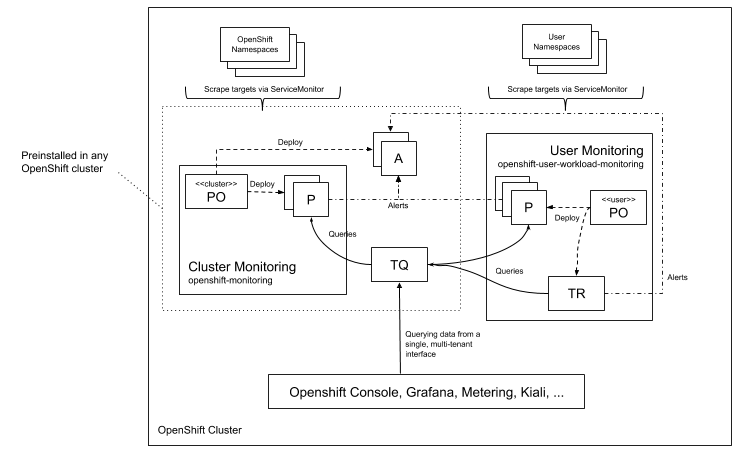
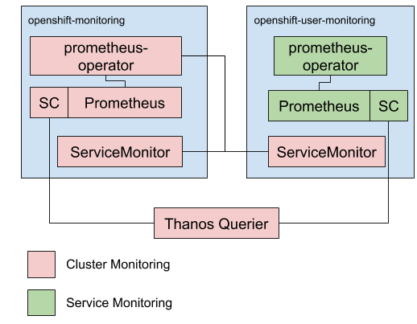
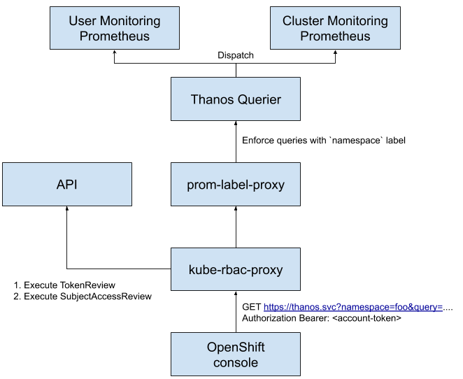
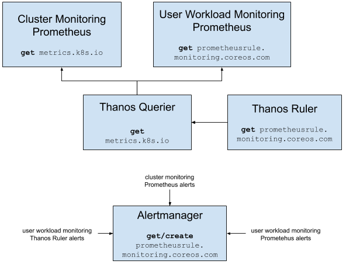

# user-workload-monitoring

## Release Signoff Checklist

- [x] Enhancement is `implementable`
- [x] Design details are appropriately documented from clear requirements
- [ ] Test plan is defined
- [ ] Graduation criteria for dev preview, tech preview, GA
- [ ] User-facing documentation is created in [openshift-docs](https://github.com/openshift/openshift-docs/)

## Summary

This enhancement describes a new feature for OpenShift cluster observability, namely user workload monitoring.
User workload monitoring will not be enabled by default, it is an opt-in feature
that can be enabled after installation.
It is an extension to the existing cluster monitoring stack to enable observability of user namespaces.
Currently, the cluster monitoring stack only reconciles OpenShift namespaces.

## Motivation

Currently, there is no supported solution for customers to monitor their business critical applications.
The existing cluster monitoring stack has no support for adding scrape targets in user namespaces
as it is only available for OpenShift components scraping workloads from `openshift-*` namespaces.
Other Red Hat products, outside the OpenShift framework components also
don’t have a monitoring solution to integrate their metrics and out-of-the-box insights into their well being.
Currently it is difficult to achieve metering/chargeback for Red Hat products without a central observability stack.

### Goals

Allow deployment and reconciliation of scrape targets, recording rules, and alerting rules in user namespaces.
This effectively means the following custom resources:

- [ServiceMonitor](https://github.com/openshift/prometheus-operator/blob/master/Documentation/api.md#servicemonitor)
- [PodMonitor](https://github.com/openshift/prometheus-operator/blob/master/Documentation/api.md#podmonitor)
- [PrometheusRule](https://github.com/openshift/prometheus-operator/blob/master/Documentation/api.md#prometheusrule)

Allow the correlation between app and cluster centric metrics not only when querying metrics
but also inside user defined alerts and recording rules.

### Non-Goals

Out of scope are:

- Definition of Dashboards.
- Deployment of Prometheus instances in user namespaces.
- Deployment of Alertmanager instances in user namespaces.

## Proposal



The existing cluster monitoring stack is going to be extended with additional Prometheus (P) servers
and one additional Prometheus Operator (PO) reconciling user namespaces
as well as the newly added Prometheus servers.

The cluster Prometheus Operator (PO) continues to operate the cluster-level Prometheus.
We will continue to use a centralized Alertmanager (A) cluster.
The existing Alertmanager cluster aggregates both user workload alerts as well as cluster alerts.
Tenancy is achieved by forcing specific labels onto metrics and alerts
by which the central Alertmanager config can route similarly to how tenancy is achieved at the query level (see below).

Querying data from a single, multi-tenant interface is done using the Thanos Querier (TQ) component.
Tenancy is enforced at the prometheus query layer. This is achieved by leveraging the existing topology using kube-rbac-proxy [1] and prom-label-proxy [2].

Differences between cluster- and user-level is mainly upgrade guarantees. The cluster-level Prometheus stack is an integral part of OpenShift and its reliability is important, keeping the stack immutable and fully testable by us allows us to rely on it to a higher degree. As we have no such possibility for user defined configurations and scrape targets, we can't provide the same guarantees.

There are edge cases where an automated upgrade is not possible in the face of user workload monitoring.
If users declare i.e. queries in ServiceMonitors which break in newer Prometheus versions
we most likely cannot perform an automated migration. Such migration without knowledge of user intention behind each query would be exceptionally difficult.

Instead, the "upgradable" condition in the ClusterOperator will be set to false.
Routing configurations for alerts to be sent to specific teams need to be communicated/configured by an infrastructure owner using the existing Alertmanager stack that is part of cluster-monitoring.
We will look into extension mechanisms post GA.
With any OpenShift deployment, we only install the cluster-level part
and allow infrastructure owner to "enable" the addition of user workload monitoring.

### User Stories


#### US1

As a service owner, I’d like to configure a ServiceMonitor CRD so that Red Hat’s supported monitoring solution is able to scrape metrics for my service.

#### US2

As a service owner, I’d like to configure alerting rules for my service so that Red Hat’s supported monitoring solution notifies me if problems turn up.

#### US3

As a member of the operations team, I want to configure Prometheus one time so that all existing and any new namespaces will have access to user workload monitoring.

#### US4

As a member of the operations team, I'd like to add my own exporters so that I can monitor infrastructure services that are not monitored out-of-the-box.

Note: This covers adding ServiceMonitor and PrometheusRule CRDs.

#### US5

As a developer working on a Red Hat product not part of the infrastructure, I’d like to integrate my metrics into a single, supported Prometheus stack so that they are available for my customers.

#### US6

As a service owner, I’d like to query the metrics I have access to from the OpenShift console.

#### US7

As a member of the operations tenant, I’d like to make sure that one tenant doesn't have access to metrics from another tenant.

#### US8

As a member of the operations team, I'd like the ability for application developers to access container cpu and memory usage metrics.

### US9

As a service owner, I'd like to configure alerting rules or recording rules for my service that correlate both cluster as well as user defined metrics.

### US10

As a service owner, I'd like to view configured and fired alerts in the dev perspective of OpenShift console.

### US11

As a member of the operations team, I’d like to get notified if the Prometheus servers are acting strange.

### US12

As a member of the operations team, I'd like to have an overview about all the Prometheus servers inside a cluster.

### US13

As a member of the operations team, I'd like to give dedicated users the permission to enable/disable and configure the user workload monitoring stack.

### US14

As a member of the operations team I want to see all alerts (cluster and user workload alerts) in the admin perspective and can silence any of them.

### Implementation Details/Notes/Constraints

#### Isolation

The cluster monitoring as well as the user workload monitoring stack are composed of custom resources
reconciled by two separate prometheus operators.
Both prometheus operators are under supervision of cluster monitoring operator.
This allows a separation of concerns in terms of upgradability, security settings, and scalability.
The cluster monitoring Prometheus Operator continues to be deployed in the `openshift-monitoring` namespace.
The user workload monitoring Prometheus Operator is deployed in the `openshift-user-workload-monitoring` namespace.

Currently, cluster monitoring operator scans all namespaces filtering `openshift` namespaces labeled with
`openshift.io/cluster-monitoring: "true"` and takes this set of namespaces as the _allowed list_ of reconcilable
namespaces for the existing cluster monitoring prometheus operator.

The same set of openshift namespaces that exist today will be configured as a _deny list_ of reconcilable namespaces
at the user workload monitoring prometheus operator.
Deny listing of namespaces was added in prometheus operator, see [3].

To make sure that users cannot add Prometheus/Alertmanager/ThanosRuler instances in user namespaces,
a feature in prometheus-operator [4] ensures that reconciliation of the corresponding custom resources
will be limited to the `openshift-user-workload-monitoring` namespace for the user workload monitoring prometheus operator
and `openshift-monitoring` namespace for the cluster monitoring prometheus operator.



User workload monitoring Prometheus Operator (green) reconciles Prometheus/Alertmanager/ThanosRuler custom resources
in the `openshift-user-workload-monitoring` namespace only.
It ignores Prometheus custom resources in any other namespace.
The same holds true for the cluster monitoring prometheus operator (red).

#### Query Aggregation

The front facing Kubernetes service has to make it as simple as possible
for integrators to leverage both user workload monitoring as well as cluster monitoring.

This is achieved by using Thanos Querier which allows to aggregate
and optionally deduplicate the cluster and user workload monitoring metrics backends
under single Prometheus Query endpoint.

Usage of the Thanos querier component inside cluster monitoring has many advantages:
1. Aggregation of multiple sources (user workload monitoring and cluster monitoring) into one global view.
2. Run-time deduplication of metrics available today.
3. Gap-filling of metrics series in the Prometheus HA user and cluster monitoring setup.
4. Potentially add the possibility of adding a query cache for increased performance in the future.

See [5] and [6] for more details.

#### Alerts/Recording Rules Aggregation

Thanos Querier only solves aggregating the query path. For aggregating recording rules as well as alerting rules
another component [Thanos Ruler](https://thanos.io/components/rule.md/) is deployed.
This component is responsible for hosting user defined recording rules as well as alerting rules.

Thanos Ruler is deployed via the user workload monitoring prometheus operator via a new CRD called ThanosRule.
The same _deny list_ setting is applied to user workload monitoring prometheus operator such that the user cannot
deploy its own Thanos Ruler instances in user namespaces.

Thanos Ruler queries Thanos Querier to resolve recording and alerting rules.
This does have implications on the availability of user defined alerts.
The following list enumerates critical components for alerts to work for this use case:

1. Thanos Ruler
2. Thanos Querier
3. User workload Prometheus
4. Cluster monitoring Prometheus

If there is no need to aggregate user defined metrics and cluster level metrics in user alerts,
higher availability can be achieved by hosting user defined alerting rules on the
user workload Prometheus instances.

This is enabled by setting the label `openshift.io/prometheus-rule-evaluation-scope: "leaf-prometheus"` on the PrometheusRule custom resource which is deployed by the user.
Prometheus Operator then dispatches the deployment of this rule on the user workload monitoring Prometheus instance rather than on the Thanos Ruler instance.
For this use case just one system is critical for alerts to work:

1. User workload Prometheus

### Console integration

##### Developer perspective

Alerts/Recording Rules Aggregation implies that the user potentially chooses whether recording or alerting rules are being deployed on the user workload Prometheus or Thanos Ruler.
In order to retrieve the full list of user workload recording alerting and recording rules the existing Thanos Querier gets support for the Prometheus `/api/v1/rules` and `/api/v1/alerts` API. Internally it fans out to the existing in-cluster Prometheus, the user workload monitoring Prometheus, and ThanosRuler. See [7] and [8] for further implementation details.

Tenancy is achieved using prom-label-proxy and kube-rbac-proxy. Here, returned alerts and rules are constrained and filtered with the tenancy namespace label.

##### Administrator perspective

The administrator perspective shows all recording and alerting rules originating both from the shipped cluster-monitoring stack as well as user defined rules in user workload Prometheus and Thanos Ruler using the same mechanism explained above but without tenancy enforcement.

### Tenancy

Tenancy is achieved by leveraging the existing topology that is protecting cluster monitoring Prometheus already today.



Here, kube-rbac-proxy sidecar is deployed along with prom-label-proxy in front of monitoring components that expose endpoints for querying metrics, recording rules, alerts, and silences.



kube-rbac-proxy enforces RBAC constraints by verifying the request in flight.
It uses a tenancy request parameter (namespace) and verifies the token in flight if the bearer token in flight has the appropriate permissions to access a configured resource given the HTTP verb in flight.
Details on which resources and verbs are being checked are given below and are summarized in the picture above.

For details about the tenancy model see the README for prom-label-proxy [2].


#### Query endpoint

OpenShift console executes queries against `/query` endpoint of Thanos Querier to execute live queries. Queries are being enforced by injecting the requested namespace in flight.

Access to this endpoint is gated by the permission to `get pods.metrics.k8s.io` in the requested namespace.

#### Available Rules and alerts

OpenShift console executes queries against the `/rules` and `/alerts` endpoint of Thanos Querier
to retrieve a list of declared alerting/recording rules and a list of active alerts. Recording rules as well as alerting rules deployed via user workload monitoring are having enforced namespace labels set. The list of rules and alerts is being filtered by prom-label-proxy based on the tenant namespace label.

Access to these endpoints is gated by the permission to `get prometheusrules.monitoring.coreos.com` in the requested namespace.
This permission is contained in the `monitoring-rules-view` role.

#### Alertmanager silences

OpenShift console executes requests against the `/silences` endpoint of Alertmanager to retrieve the list of silences and to silence alerts. A user can only create, delete and update silences as well as get silences filtered by the namespace label in flight.

Access to list the silences is gated by the permission to `get prometheusrules.monitoring.coreos.com` in the requested namespace.
This permission is contained in the `monitoring-rules-view` role.

Access to create a new silence or update an existing silence is gated by the permission to `create prometheusrules.monitoring.coreos.com` in the requested namespace.

Access to delete an existing silence is gated by the permission to `delete prometheusrules.monitoring.coreos.com` in the requested namespace.

The above permissions are contained in the `monitoring-rules-edit` role

### Multitenancy

To account for multi tenant clusters, a label of origin is added to each metric, recording, and alerting rule
that comes from the user workloads discovery objects e.g. ServiceMonitor, PodMonitors, and PrometheusRules.
To do this the Prometheus custom resource that declares the user workload Prometheus has the field `enforcedNamespaceLabel` set.
It contains the key of the label, with the value being the namespace in which the object was created.
Besides the above mentioned new label, the prometheus-operator will
also enforce applying that same label, to any relabelConfigs relabelings, this will always be added as a last label so
it makes sure that only the last label is taken into account and no one can override the namespace label. For the
metricRelabelings we remove any relabeling rule that has namespace target. The above work is all in
prometheus-operator, in cluster-monitoring-operator we set the field to `enforcedNamespaceLabel: namespace`. This
ensures we do not have to override the work that prom-label-proxy is already doing. Same must be done for alerts, there
we inject the same label key value to the promql expression and append it to the label array. This ensures that
the rules and alerts include the users namespace.

honor_labels controls how prometheus handles conflicts between labels already present in scraped data and the labels
that prometheus would attach server side. If honor_labels is set to true labels from the scraped data are kept and
server-side labels are ignored. If set to false the conflicts are resolved renaming the scraped data to
`exported_<label-name>`. This is exactly what we want for user workloads, because we want to avoid the users possibly
remapping the values of labels as we base our tenancy model on this. We have two options here that can be done in
prometheus-operator, either discard that object completely in the same way as we do with filesystem access right now or
create the respective objects and change the honorLabel value to false.

### Roles

The following new named roles are deployed via cluster-monitoring-operator.

#### `monitoring-rules-view`
This is a cluster role which can be bound against a concrete namespace by the cluster admin.
Embeds the `get prometheusrules.monitoring.coreos.com` permission. It allows to:

1. Read PrometheusRule custom resources matching the permitted namespace.

```
$ oc -n <namespace> get prometheusrule <foo>.
```

2. Get declared and pending alerts and recording rules from `/api/v1/alerts?namespace=<foo>` and `/api/v1/rules?namespace=<foo>` endpoints matching the permitted namespace.

#### `monitoring-rules-edit`
This is a cluster role which can be bound against a concrete namespace by the cluster admin.
Embeds the `create/edit/delete prometheusrules.monitoring.coreos.com` permission. It allows to:

1. create/modify/delete PrometheusRule custom resources matching the permitted namespace.

```
$ oc -n <namespace> create/patch/delete prometheusrule <foo>.
```

2. Silence firing alerts from the Alertmanager `/alerts?namespace=<foo>` endpoint matching the permitted namespace.

#### `monitoring-edit`
This is a cluster role which can be bound against a concrete namespace by the cluster admin.
Embeds the `get/create/edit/delete` permissions for the following custom resources:

1. ServiceMonitor
2. PodMonitor
3. PrometheusRule

It allows to create new scraping targets for services/pods and allows to create new recording or alerting rules.

#### `monitoring-workload-config-edit`
This is a named role against the `workload-monitoring-config` configmap resource in the `openshift-monitoring` namespace
embedding `get/create/edit/delete` permissions.

### Configuration/Enablement

User workload monitoring is not enabled by default. It must be explicitly enabled by the user.
User workload monitoring is enabled just by creating an empty `workload-monitoring-config` configmap in the `openshift-monitoring` namespace.

Note: Long term the existing `cluster-monitoring-config` and `workload-monitoring-config` will be moved to dedicated custom resources and CRDs but are out of scope for this enhancement.

### Resource impact

Once user workload monitoring is enabled, by default 2 replicas of Prometheus and one Prometheus Operator instance are being deployed in the `openshift-user-workload-monitoring` namespace.

As of OpenShift 4.4 the following idle resource usage have been measured after 24h of staying idle:

1. Prometheus: ~65MB memory usage per replica instance, ~6 milli-cores CPU usage
2. Prometheus Operator: ~15MB memory usage, ~1 milli-core of CPU usage

This results in an additional overhead of ~145MB memory and ~7 milli-cores of CPU usage for the user workload monitoring stack.
The above resource measurements will be set as the default resource requests for the user workload monitoring Prometheus and Prometheus operator.

### High cardinality detection

As a first step a similar high cardinality alert will be used as in [9] and potentially [10]. More formally we will alert on:

- A sum over time of scrape samples scraped reaching a threshold.
- A sum over time of scrape series being added reaching a threshold.
- A sum of the rate of tsdb head series created reaching a threshold.

The above will be encapsulated in one single alert.
This alert will be declared as `info` level only and transmitted via Telemetry.

Additional telemetry metrics are going to be gathered to have more insights about the usage of user workload monitoring in clusters:

- Active series
- Rate of sample ingested
- Memory usage

Over time we will learn about better thresholds and potentially also about better alerts.
Additional protection mechanism may be introduced at a later point using front proxy tools like bomb squad [11].

### Risks and Mitigations

Risks are for one in the area of security, namely in the realm of accessing metrics a user has no permissions for.  This
is achieved by reusing the existing tenancy stack as well as with the newly added features for allow-lists, deny-lists
and reconciliation limiting settings for prometheus operator.

Another risks are related to saturation of Prometheus servers.  Potential queries of death (QoD) or aggressive scrape
targets with high cardinality can impact the availability of the user workload monitoring prometheus instances.

When the scraped data includes a timestamp those timestamps are by default respected by Prometheus. We want to ignore
that timestamp and instead let Prometheus set the time it received the scraped data, as that can cause many possible
problems, one of which would be out-of-order inserts. To solve this problem we will need to add a new field in the
promethus-operator Prometheus Custom Resource called `honorTimestamps`. Then in cluster-monitoring-operator we will then
set this field to false for user workload only.

PodMonitors and ServiceMonitors objects have a field to select which namespaces the Endpoints are discovered from, these
could be a potential DDOS risk as a user could specify any namespace even the ones they do not have access to. To avoid
this risk we will introduce a `ignoreNamespaceSelectors` in the Prometheus Custom Resource, and set that to `true` in
cluster-monitoring-operator. This will discard the `namespaceSelector` field users specify and avoid the above
mentioned risks.

## Design Details

### Test Plan

TBD

### Graduation Criteria

N/A

#### Examples

These are generalized examples to consider, in addition to the aforementioned
[maturity levels][maturity-levels].

##### Dev Preview -> Tech Preview

There is no dev preview planned, just tech preview.

##### Tech Preview -> GA

- More testing (upgrade, downgrade, scale)
- Sufficient time for feedback
- Available by default
- Document relationship to user workload monitoring
when launching prometheus operator via OLM.
- Specify deprecation strategy for OperatorGroup custom resources in OLM.
The OperatorGroup is marked as deprecated,
the removal is blocked by OLM's prometheus operator.
- Analyze saturation of new prometheus servers
and evaluate fitness for GA by analyzing telemetry.

##### Removing a deprecated feature

- Announce deprecation and support policy of the existing feature
- Deprecate the feature

### Upgrade / Downgrade Strategy

Upgrades and downgrades will be orchestrated by cluster monitoring operator
the same way as the cluster monitoring stack.
User workload monitoring leverages the same semantics in terms of deployable assets
and custom resources.

### Version Skew Strategy

N/A

## Implementation History

N/A

## Drawbacks

N/A

## Alternatives

One alternative is to stick with the current way of user workload monitoring
by launching prometheus operator via OLM.

In OpenShift 4.3 the user has to mutually exclusively decide
between an OLM based prometheus operator deployment
or the new user workload monitoring stack.
Both features are opt-in after installation.

This alternative though is not desirable as many customers are not fully satisfied
with the this approach and this alternative does not allow to deprecate OperatorGroups.

## References

[1] https://github.com/brancz/kube-rbac-proxy

[2] https://github.com/openshift/prom-label-proxy

[3] https://github.com/coreos/prometheus-operator/pull/2710

[4] https://github.com/coreos/prometheus-operator/pull/2197

[5] https://deploy-preview-1541--thanos-io.netlify.com/components/query.md/

[6] https://github.com/cortexproject/cortex/issues/1672

[7] https://docs.google.com/document/d/12ou_YE54NPzBvzfAH-xkqmvyTu_L14_TYx5DhRxBOfU/edit

[8] https://github.com/thanos-io/thanos/pull/2200

[9] https://github.com/openshift/origin/pull/24074

[10] https://github.com/openshift/origin/pull/24442

[11] https://github.com/open-fresh/bomb-squad
