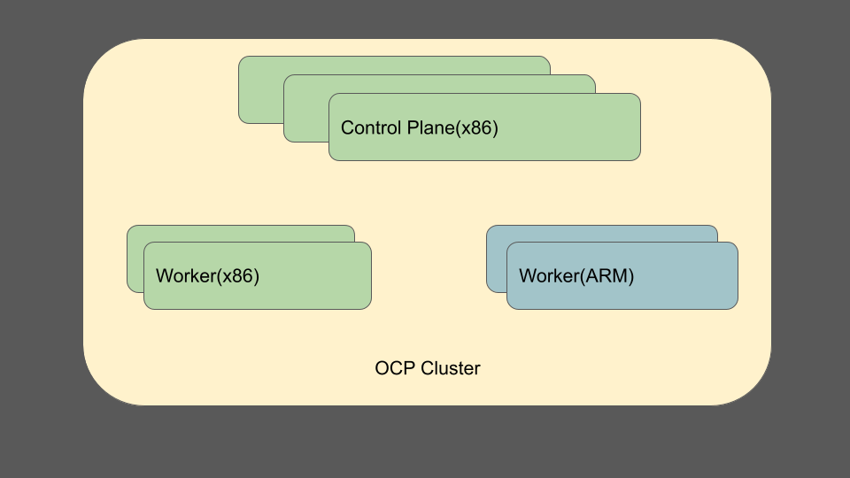

# heterogeneous-architecture-cluster-support

## Release Signoff Checklist

- [x] Enhancement is `implementable`
- [ ] Design details are appropriately documented from clear requirements
- [ ] Test plan is defined
- [ ] Operational readiness criteria is defined
- [ ] Graduation criteria for tech preview and GA
- [ ] User-facing documentation is created in [Openshift-docs](https://github.com/Openshift/Openshift-docs/)

## Summary

This enhancement describes the plan to support provisioning and upgrades of heterogeneous architecture Openshift clusters.
A heterogeneous cluster is a cluster with nodes running on different architectures with a homogeneous control plane and worker machinesets
supporting any combination of architectures (eg: x86 control plane + a mix of ARM/P/Z worker nodes). This document describes the support
needed for heterogeneous architecture clusters in phases. There will be three major phases with basic support in phase 1 which is targeted
for a 4.11 techpreview (with documented limitations) and the other phases which address gaps beyond the 4.11 time frame. The targeted platform
for the initial phase is Azure with support for x86 and ARM architectures.

## Motivation

- Users can take advantage of cost savings on architectures like ARM.
- Users can colocate applications that require different architectures rather than needing multiple clusters and thus avoid cross cluster
latency and connectivity failures.

### Goals

- Provide a way to install and upgrade clusters with varied architecture machinesets with the ability to autoscale. In standalone OCP this is enabled
  through MachineSets, in Hypershift form factor via NodePools.
- Support provisioning heterogeneous architecture management cluster in Hypershift.
- Generate a manifestlist based payload that contains manifestlist references for the 4 architectures OpenShift supports (x86, ARM, Power and Z).

### Non-Goals

- Building manifestlisted payloads using Openshift builds (Note: our CI payload build infrastructure is based on builds, so there will be no CI-built
heterogeneous payload+CI testing.  There are also no non-x86 CI payloads from which to construct a heterogeneous CI payload. Heterogeneous nightly
payloads will be built+subjected to CI test jobs in the same way as homogeneous nightlies).
- Heterogeneous control plane.
- Heterogeneous to homogeneous cluster migration support

## Proposal

The support for installation and upgrade of a heterogeneous architecture cluster and the associated components will be done in phases. The phases
range from a bare bones no upgrade support installation to the full fledged installation and upgrade capability of a cluster on different topologies.
The phases are listed below and details on some components of the phases are described below.

Phase 0: Prototype
- Aimed at delivering a prototype that users can experiment with.
- Aimed at Azure with the primary supported architectures being x86 for the control plane and ARM worker nodes.
- oc adm command changes to support manifestlist payloads.
- Ability to assemble and publish manifestlist-based release payloads in a reproducible way.
- Upgrades can be done by explicitly specifying the image to upgrade to.
- Is not intended for production.

Phase 1: Tech Preview of basic support
- A Release pipeline is setup to construct manifestlist based release payloads.
- Explicit upgrade support through oc upgrade's `--to-image` option
- Does not include support for:
  - image registry - internal image registry will not support manifest listed images.
  - imagestreams importing full manifestlist content (will continue to import a single image when referencing manifestlists).

Phase 2: Full basic functionality
- Imagestreams and Imageregistry manifestlist support to import, pull and push manifestlisted images.
- OLM support for the user to specify node affinity overrides when deploying an operator and ecosystem improvements.
- Improve console's content filtering by making it architecture aware and passing that information to OLM. This will include console
  knowing about the architecture of different nodes and showing catalog content only relevant to those architectures and also
  providing a way for users to override node affinity settings in an operator.
- oc debug (and other commands) support for compute architecture.
- support toolbox.
- support for Power and Z architectures.
- Hypershift support for heterogeneous management+worker clusters.
- Upgrade support in CVO/Cincinnati for heterogeneous release payloads through a heterogeneous graph. Migration of a homogeneous cluster
would be explicitly done through the upgrade command  by specifying the `--to-image` flag.

Phase 3: Quality of life improvements
- First class install support - ability to create non-control-plane-architecture workers at install time and generate machineconfig
and machineset manifests for the same.
- Possibly reduce mirroring costs by looking into things like sparse manifestlist.
- CVO migration support for a homogeneous cluster to a heterogeneous payload

### User Stories

- As an enterprise customer looking to save compute resource cost, I want to be able to run part of my application workload on ARM instead of x86.
- As the owner of an application that runs partially on x86 and partially on ARM, I want to be able to run the entire application within a
single cluster so I do not need to pay the cost of higher latency between clusters, or worry about the HA-resilience of cross-cluster bridges.
- As an Openshift cluster administrator, I would like to install a cluster with a mix of x86 and ARM architecture worker nodes and also have the ability
to add nodes of any architecture to a cluster installed with a heterogeneous payload.
- As an Openshift cluster administrator I would like to upgrade my existing homogeneous cluster to a cluster that supports heterogeneous worker
nodes

### Workflow Description

A heterogeneous cluster installation will have the same experience as installing a homogeneous cluster. This is the long term vision. However in
the short term, for the 4.11 Tech Preview, some additional steps will be necessary as IPI installs are not supported yet. The flow will be the
following:
- Download the openshift-install binary from the [multi mirror][mirror] page corresponding to the architecture of the installation host
- install a homogeneous x86 cluster as you normally would on Azure/AWS
- add machinesets of ARM architecture following [these][creating-machinesets] instructions. Make sure to match the instance types and the
corresponding bootimages based on the architecture of the instance.

### API Extensions

- Imagestreams API will undergo changes described in this [manifestlist enhancement section][imagestreams-api-changes]
- Upgrades to a heterogeneous release payload will require an additional architecture field in the ClusterVersion API's spec which admins would
  use to specify the desired architecture of the cluster
- Optional operators would have to specify NodeAffinity in their pod specs enumerating the supported architectures

### Implementation Details/Notes/Constraints

Operators supporting multiple architectures cannot stop supporting a given architecture since it would break heterogeneous clusters which are
trying to upgrade. For optional operators, this would be enforced by an auditing tool developed by the portfolio management team to ensure that
the architectures listed in the deployment spec are supported and matched across releases.

### Risks and Mitigations

Heterogeneous release payloads will only ship if the corresponding homogeneous release payloads for all architectures can ship and are not broken due
to a bug in a specific architecture. Today, in the case where one architecture is affected, others don't ship either.

### Drawbacks

The manifest listed release payload would contain images for the 4 architectures which would make the payload size pretty big. This would significantly
increase time to mirror payloads which is a concern for disconnected installs. This is true of the OLM catalogs today which support multi-arch images
and there is investigation being done on sparse manifestlists which mirror only a subset of the manifests. If this goal is realized, the mirroring
could intelligently filter out the architectures the user doesn't care about.

## Design Details

### OCP Build & Release

Phase 0 will involve building and publishing of [nightly builds][OCPPLAN-7640]. The release payload will be a manifestlist-based image with the
component images being manifestlist references as well. All 4 architectures - x86, ARM, Power and Z will be included in the manifestlist.
Existing architecture specific release payloads continue to be delivered through their individual release controllers. A new heterogeneous
release controller is bootstrapped and displays "4-stable" entries for ART constructed release payloads. `oc adm release ...` verbs would be
[enhanced][WRKLDS-370] to allow the creation and management of manifestlist release payloads. Sub-verbs like `mirror`, `info`, and `extract`
must be adapted to support manifestlist based payloads. The trigger for creating the heterogeneous payloads will be whenever there is a new
payload produced for one of the included architectures.

The release controller will add the `release.openshift.io/architecture` property to the JSON metadata of the individual architecture's release
payload. The architecture would be set to "multi" to uniquely identify a heterogeneous release payload. This property will not be present for
homogeneous release payloads.

### Oc tooling changes

- `oc adm release new` would support creation of heterogeneous payloads from an imagestream as well as through an existing payload.
- `oc adm release info` would generate info of the payload corresponding to the host architecture. the component images are all manifestlisted
  so it would not differ for each architecture.
- `oc adm release extract` would extract tools based on the host architecture.
- As part of payload promotion, the tools are extracted to the mirror and available for each architecture. Refer to the multi [mirror][multi-mirror]
  page for details

### Upgrades - Cincinnati and CVO

In addition to the homogeneous payload graph that we have today, [support][OCPPLAN-7642] needs to be added for a graph for heterogeneous
payloads which CVO will need to look at to make upgrade recommendations. There are two upgrade scenarios to consider with the addition of
heterogeneous payloads:

- heterogeneous -> heterogeneous release payload upgrade after a fresh install
- homogeneous -> heterogeneous release payload upgrade

A separate heterogeneous graph will be introduced for each version starting from the version which supports heterogeneous payloads. A cluster
installed as a day1 heterogeneous cluster with a heterogeneous payload will use the heterogeneous graph for further updates.

An existing homogeneous cluster can be converted to a heterogeneous cluster through a migration process which is a special upgrade process. The
migration would be a separate lifecycle event triggered through a separate command `oc adm upgrade migrate-arch` (name TBD) which would:
- identify the current cluster version, channel and architecture
- fetch the heterogeneous graph and release corresponding to the version and channel
- upgrade to the heterogeneous release
- set the architecture to "multi" in the cluster version status for consumers to know the type of the cluster

As part of this migration, the ClusterVersion API's spec would need to have an additional "architecture" field to indicate the architecture of the cluster.
This field would indicate whether the cluster is a homogeneous or heterogeneous cluster with the individual arches denoting a homogeneous cluster and
"multi" indicating a heterogeneous cluster. This field would also be part of the ClusterVersionStatus to indicate to consumers of the API who would want to
know the type of the cluster.

On a fresh install, CVO would detect the architecture from the metadata JSON inside the individual architecture's payload inside the manifestlisted
release payload. The `release.openshift.io/architecture` property would be set to "multi" denoting a heterogeneous payload. It would then retrieve the
heterogeneous graph to service upgrade requests and set the ClusterVersion status architecture field.

The migration [support][OTA-653] is planned for phase 3 and users can use the explicit `--to-image` flag along with `oc adm upgrade` to convert the
cluster to a heterogeneous cluster in the phase 2 timeframe.

Cincinnati needs to [support][OTA-580] parsing manifestlist images to be able to upgrade to a heterogeneous architecture payload. There will be a
new architecture option added to it called "multi".

### Imagestreams

Imagestreams need to [better support][IR-192] manifestlist images. As of today, the imagestreams support only import of the image matching the control plane
architecture. The image registry which is based on the docker distribution supports manifestlisted images, but the Imagestreams APIs around it
do not. In order to fully support importing and local pullthrough of manifestlisted images,the imagestreams APIs would have to change to support
manifestlists. This would include changes to:
- `ImageStreamLayers` API which is needed to authorize pulls from the registry
- `Image` API which would need to also contain all the child manifests in the manifestlist
- `ImageStreamImport` API - the `ImageStreamImportStatus` would have to record the child manifests that were imported
- `ImageStreamImage` API changes to support returning information about the child manifests.

The pruner would also need some careful changes to make sure that it does not evict the manifestlisted image if any of the child manifests are in
use. Conversely, all child manifests are also removed when an imagestream tag referencing a manifestlisted image is removed.

oc tooling around imagestream commands would also need to change and factor in manifestlists in case of commands like `oc describe` which would also
be enhanced to present the manifestlist information.

This manifestlist support [enhancement][manifestlist-support] which was filed a while ago explains in detail the API changes needed and the different
parts of the imagestreams and imageregistry functionality which would need to be changed to support manifestlisted images.

### Samples

As part of the changes to the Imagestreams API, the ImagestreamImport API's spec field would include a [new flag][IR-214] which would import the manifestlist
rather than importing only an image from the manifestlist. The samples imagestreams would be updated to set this new flag. Not all samples will support
all architectures, so in the future imagestreams would have to be annotated to specify which architectures they support. This new flag would be turned "on"
by default importing manifestlists if the image is manifestlisted.

### OLM

OLM would need to make sure that it deploys operators only to nodes whose architecture matches the architectures on which the operator is supported.
Today, OLM has a subscription object which is used to tell it how to deploy an operator. It has support for the nodeselector field but this would
not be sufficient to specify filtering on multiple architectures. To this end, it would have to support the nodeAffinity field which uses the
nodeselectorterms to filter on multiple values.

Instead of having OLM dictate the operator deployment on specific nodes, the individual operators themselves would specify which architectures
they support through a `pod.spec.affinity.nodeAffinity` object which OLM will then provide the ability for the user to override via the Subscription object
if necessary. This information should also be added to the operands and potentially be made configurable by the user requesting the operand.

Essentially, when operator authors are declaring support for multiple architectures, that entails:

- Making a declaration of that support via the CSV architecture annotation
- Setting node affinity in the CSV deployment spec so that the operator is scheduled correctly.
- Update the operator code such that when it creates/updates operand workloads, it sets those same nodeAffinity settings that are set on
  the operator deployment.

### Machine Config Operator

No changes are needed in the MCO for Phase 1 as the machine-os-content image would be a manifest listed image and the machine config daemon would
extract the relevant architecture's machine-os-content based on the node it runs on. In the future, architecture specific configurations should
not be required, instead they need to be templatized and be generalized for certain items, for example kubelet system reserved memory could scale
based on page size.

### Machine API

- As of today, machinesets can be mutated to change the instance type and image id and this could potentially result in inconsistency between existing
machines and newly created machines. If the instance type and image is changed to one of a different architecture, there would be workers of
different architectures with the same machineset definition. While this may not be a problem, it doesn't make for a good user experience. Hence,
machineset specs will not allowed to be mutated. Anytime a change is required, a new machineset needs to be created and the old one needs to be scaled
down.
- Changes are needed in the autoscaler to make it aware of the node architecture when autoscaling from zero. The `kubernetes-io-arch` label needs to be
set when building the NodeInfo object so the autoscaler can pick the correct pool to scale up for allocating nodes of a particular architecture.

### Hypershift

The addition of heterogeneous support in Openshift also opens up a new dimension for [support][OCPPLAN-5684] in Hypershift where the control plane 
and the workers could run on different architectures. This support will be realized in two phases:

Phase 1: Control plane is assumed to run on x86. Data plane can be heterogeneous, i.e different NodePools can have different architectures.
Phase 2: Control plane has the ability to run in a multi architecture management cluster data plane.

To support phase 1:
- The user must set an heterogeneous payload input `HostedCluster.spec.release.image`. This is needed because pods dictated by this image,
  might end up being scheduled on the differing architecture nodes.
- The user must set an heterogeneous payload input or the particular targeted architecture for `NodePool.spec.release.image`.

For automation purposes the above requirements can be satisfied by the hypershift CLI to default to populate `.spec.release.image` fields with
heterogeneous images. The contract however, is the API. There are also other gaps that need to be addressed:
- Need to introduce semantics for the user to express architecture intent in NodePools so that the correct bootimage format is chosen for that architecture
  out of the payload. Today this is hardcoded to x86.
- Optionally, additional validation can be added to ensure that the NodePool can be set to hetergoneous only if the hosted cluster payload has been
  set to heterogenous as well.

To support phase 2:
- Ensure that none of the hosted cluster images are hardcoded to an x86 image. They need to come from the release payload
- Address other issues (unknown at the moment) that might be found as progress is made.

### Console

- As of today console filters content based on control plane architecture. This needs to be entirely removed or made configurable for
heterogeneous clusters. Console should be able to filter out the set of OLM operators that, if installed will be able to find
appropriate architecture nodes to run on. This means that it has to display only the subset of operators that match the architecture of the
nodes on the cluster.
- Console would provide a way for users to [override][console-filtering] nodeAffinity settings that would be set for each operator based
on the architectures it supports.

### Install

For Phase 1, the way to add more workers to the cluster is to handcraft a machineset manifest file for a worker node and specify the architecture
specific details like instancetype, image references and deploy the machineset to get a worker node. This can be pseudo automated further by creating
the manifests using `openshift-install create manifests` and modifying or adding worker manifest files. Eventually the installer should support being
able to declare differing compute and control plane sections in the install-config mainly allowing architectures to be different. In doing so it would
also generate appropriate machineset and machineconfig files tailored to the specific architecture. The machineset file would contain the instancetype,
image id (AMI or Azure disk image etc..) and region corresponding to the architecture chosen for the workers.

### Open Questions
- Should Console have an override mechanism to provide the ability for cluster administrators to override the NodeAffinity values as they see fit? Does
  it makes sense for Console to grow a new UX around this?

### Test Plan

Testing for Phase 1:
- Nightly and release payload informing jobs for heterogeneous payloads on homogeneous clusters.
- Setup an AWS UPI install job to install a heterogeneous cluster with an X86 control plane and ARM worker nodes
- QE would test heterogeneous payloads on Azure and AWS platforms with the cluster configuration mainly being x86 control plane and ARM worker nodes.
- Testing scenarios would include machine set scaling, upgrades involving ARM nodes and OVN testing on heterogeneous clusters.

Testing for Phase 2:
- With the addition of Power and Z architectures, there will be more permutations to test. We would need to figure out the absolute essential set of
permutations and the tests to run on those.
- Imagestream conformance tests.
- OLM and console testing
- Test migration and upgrade scenarios

### Graduation Criteria

Phase 1 will be a 4.11 techpreview with documented limitations. The techpreview no upgrade feature gate would be set and upgrades would have to be done by
explicitly specifying the release pull spec.

#### Dev Preview -> Tech Preview

There will be a tech preview of basic functionality (Phase 1 as described above) in 4.11

#### Tech Preview -> GA

TBD

#### Removing a deprecated feature

This enhancement does not describe removing a feature of Openshift, this section is not applicable.

### Upgrade / Downgrade Strategy

The upgrade strategy is described in the design details section above. The important changes here are having a separate architecture
for the heterogeneous releases and also the work needed to support upgrades from a homogeneous release -> heterogeneous release in
the future.

### Version Skew Strategy

N/A

### Operational Aspects of API Extensions

- The ClusterVersion API's spec field will have an additional "desired" architecture field for the cluster administrator to request an architecture
  change. The ClusterVersionStatus API will also have an architecture field reflecting the actual architecture of the cluster.
- The NodePoolSpec API in Hypershift would need to have an architecture field so it can pick the images corresponding to the relevant architecture
- The imagestreams API would also undergo changes as described in the imagestreams section.
- Optional operators would have the nodeaffinity field set in their deployment specification to reflect the supported architectures.

#### Failure Modes

No new failure modes are introduced as part of this feature.

#### Support Procedures

TBD

## Implementation History

- A Release controller has been setup to generate nightly payloads and is running an e2e informing job. More will be added in the future.
- oc commands in 4.11 have support for creating, mirroring and extracting from heterogeneous payloads

## Alternatives

The alternative to a heterogeneous architecture cluster would be having multiple clusters with workloads communicating between each other but this
would have latency and cost implications not to mention the additional failure mode of cluster connectivity.

## Infrastructure Needed

The release team has added a new release controller to generate heterogeneous architecture payloads starting from 4.11 (https://multi.ocp.releases.ci.openshift.org/).

[OCPPLAN-7640]: https://issues.redhat.com/browse/OCPPLAN-7640
[WRKLDS-370]: https://issues.redhat.com/browse/WRKLDS-370
[OCPPLAN-7642]: https://issues.redhat.com/browse/OCPPLAN-7642
[OTA-580]: https://issues.redhat.com/browse/OTA-580
[OTA-653]: https://issues.redhat.com/browse/OTA-653
[OCPPLAN-5684]: https://issues.redhat.com/browse/OCPPLAN-5684
[manifestlist-support]: https://github.com/openshift/enhancements/blob/master/enhancements/manifestlist/manifestlist-support.md
[imagestreams-api-changes]: https://github.com/openshift/enhancements/blob/master/enhancements/manifestlist/manifestlist-support.md#design-details
[creating-machinesets]: https://docs.openshift.com/container-platform/4.10/machine_management/creating-infrastructure-machinesets.html#machineset-yaml-aws_creating-infrastructure-machinesets
[IR-192]: https://issues.redhat.com/browse/IR-192
[IR-214]: https://issues.redhat.com/browse/IR-214
[multi-mirror]: https://mirror.openshift.com/pub/openshift-v4/multi/
[console-filtering]: https://issues.redhat.com/browse/CONSOLE-3190
[mirror]: https://mirror.openshift.com/pub/openshift-v4/multi/clients/ocp-dev-preview/