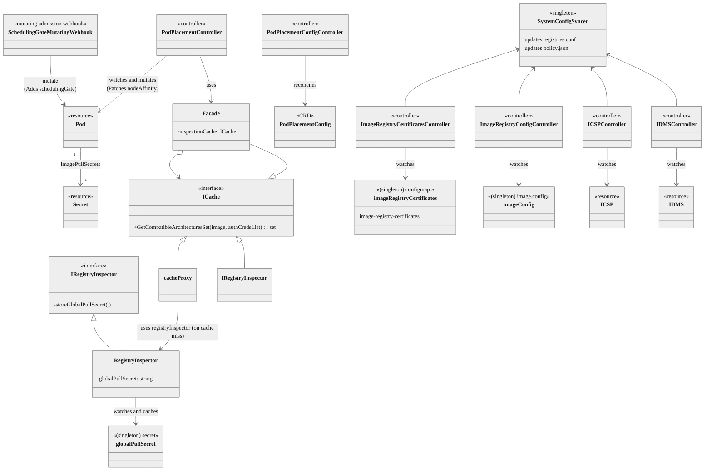

# Multiarch Manager Operator

## Summary
Recently, cloud vendors have started offering compute nodes leveraging different
CPU architectures. With the rising use and support of multi-architecture compute
nodes in Openshift clusters, users and cluster administrators face new
challenges when deploying workloads. Primarily, the scheduler does not consider
the images' compatibility with the CPU architectures when filtering nodes. We
must assume that the images used for deploying workloads would only support some
architecture the cluster could consist of. The typical workaround is to manually
add affinities to the pod spec to ensure that the pods land on nodes where the
image binaries can be executed. This strongly impacts the user experience: it
couples the set of compatible architectures at a given point in time to the pod
spec, does not scale well, and is challenging to maintain. The
`multiarch-manager-operator` aims to automate the inspection of the container
images, derive a set of architectures supported by a pod and use it to
automatically define strong predicates based on the `kubernetes.io/arch`
label in the pod's nodeAffinity.

## Motivation
- Easy adoption of multi-architecture compute clusters by customers with varying
  workload images which might not be built for specific architectures
- Provides users a "clean" user experience without having to worry about
  manually modifying deployment specs when deploying workloads on a multi-arch
  compute clusters

### User Stories
- As a user who wants to deploy workloads on a multi-arch compute cluster, I
  want the pods to be scheduled on the appropriate subset of nodes based on the
  architectures supported by their containers' images so that the coupling
  between the characteristics of the images and the nodeAffinity declared in
  the pod spec template does not require future manual maintenance due to image
  updates provided by the external stake-holders maintaining them
- As a cluster administrator, when I add a new node of a secondary architecture
  to a cluster, I do not want to taint the nodes to be unschedulable to ensure
  that workloads continue to deploy and run as expected given that the images
  used for deploying workloads may not support the above said secondary
  architecture
- As a cluster administrator who wants to migrate from a single-arch to a
  multi-arch compute cluster, I do not want to rebuild each container image for
  all the architectures that are present in the cluster
- As a user who wants to deploy workloads on a multi-arch compute cluster, I do
  not want to modify every pod (or any resources owning pods) spec to include a
  node affinity predicate to filter the nodes at scheduling time, based on the
  compatible architectures
- As an operator developer, I want to allow users to develop operators only
  supporting a subset of architectures or a single architecture without
  additional business logic changes or requirements around having to specify
  any affinities themselves. This will not be encouraged but will not become an
  impediment to rolling out a feature that can work on multi-arch compute
  clusters

### Goals
- Provide a way to ensure that pods are scheduled on nodes running a CPU
  architecture supported by all the images of their containers. If such a node
  does not exist, the pod holds in the `Pending` phase giving the user a clear
  indication that the node affinity constraint is not met.

### Non-Goals
- This feature does not aim to modify the Kubernetes scheduler
- This feature does not "schedule" pods; it influences scheduling by patching
  the affinity of gated pods[^2]
- Modification of fields other than the node affinity is not supported.
  Moreover, the controller logic will only consider the
  `kubernetes.io/arch` label

## Proposal
Kubernetes 1.27 introduced the scheduling readiness feature[^1]. It
allows users and controllers to set scheduling gates in the
`podSpec.schedulingGates` list at admission time. Gated pods allow mutating some
of the pod spec fields before the pod is scheduled. In particular, the
scheduler's default `Enqueue` plugin holds the pods before entering the
`ActiveQ` queue if a scheduling gate exists in the `podSpec.schedulingGates`
list. Until gates are in the list, the pod will expose its status as
`SchedulingGated`. The controller responsible for a given scheduling gate should
implement the business logic to let the pod be ready for scheduling.
KEP-3838[^2] introduced the possibility of mutating the node affinity
of pods while they are in `schedulingGated` status (i.e., their
`podSpec.schedulingGates` list has at least one gate).

The multiarch-manager-operator will leverage the scheduling readiness feature
and the mutable pod scheduling directives to update the node affinity of pods
with the set of architectures they support. When a pod is submitted to the API
server, a mutating admission webhook intercepts the pod and adds a scheduling
gate to the pod spec.

The `PodPlacementController` watches the pod resource. Suppose any pod has the
scheduling gate set. In that case, the images in the pod spec are inspected, a
subset of architectures that satisfy all containers in the pod is built, and the
pod spec is patched with the additional node affinity constraints. If any
existing node selector requirements are set with key `kubernetes.io/arch`,
the `PodPlacementController` does not override the behavior previously
pushed by other stakeholders, leaving it as complies with KEP-3838[^2].

The multiarch-manager-operator will be available as part of the OperatorHub, as
a secondary operator managed by the Operator Lifecycle Manager (OLM). It will be
a cluster-scoped operator that only cluster admins can install and configure.

Its development is expected to ship in the following phases:

- Phase 1 - Technology Preview (TP):
  - The pod placement controller will be supported in High Availability (HA)
    mode
  - The webhook will be a stateless component
  - The pod placement controller will support namespace filtering to skip pods
    that should not be mutated
  - No support for customized network scenarios (restricted, proxied,
    disconnected...)
  - No caching facilities for the image metadata
  - No graceful uninstallation support: any remaining gated pods have to be
    manually patched to resume scheduling after uninstallation
- Phase 2 - General Availability (GA):
  - support for customized network scenarios (restricted, proxied,
    disconnected...)
  - support mirror registries through ICSPs/IDMSs
  - implement caching facilities for the image metadata
- Phase 3:
  - Future performance optimizations

### Workflow Description
The following section will highlight the main workflows the operator will be
responsible for from a high-level user perspective.

#### Operator installation
1. The cluster-admin submits a Subscription object to install the
   multiarch-manager-operator, either via CLI or the OperatorHub
2. The cluster admin submits the default `PodPlacementConfig` Custom Resource
   (CR) adding their specific configuration related to initializing the
   multiarch-manager-operator's components; the cluster admin can customize the
   CR by using a namespace selector to control pod filtering and logging levels
4. The operator reconciles the CR. Its information supports the
   `PodPlacementController` controller and the `SchedulingGateMutatingWebhook`
   mutating admission webhook

#### Pod Admission: gating
1. The user submits a pod
2. The mutating admission webhook is queried and decides whether to add the
   scheduling gate to the pod, based on the namespaceSelector
3. The pod is admitted and persisted
4. The pod is put on hold by the scheduler until all the scheduling gates are
   removed

#### NodeAffinity patching of gated pods
1. The `PodPlacementController`, watching for pod events, gets notified of a pod
   event
2. If the multiarch-manager-operator's gate is not present, the pod is ignored
3. If the gate is present, a set of unique images is built from the pod spec
4. Each image is inspected to gather the supported architectures set
5. The intersection of the supported architecture sets builds the pod compatible
   architecture set
6. If no inspection errors occurred, the
   `podSpec.affinity.nodeAffinity.requiredDuringSchedulingIgnoredDuringExecution`
   stanza is patched with the architecture node selector requirements. If any
   node selector term is present, they are all patched. Otherwise, a new node
   selector term is added to the `.matchExpressions` list. The merge strategy
   described here follows the rules in KEP-3838[^2]
7. The scheduling gate is removed from the pod spec and the pod is updated
8. The scheduler notices that no scheduling gates are set and continues the
   scheduling process for the given pod

The above two main workflows are depicted in the following sequence diagram:


#### Deletion of the CR
1. The cluster admin deletes the CR
2. All resources related to the operator - the controllers, webhook service and
   pods automatically get deleted
3. Any pods stuck in the scheduling gated phase will be patched without changes to
   the node affinity and their scheduling will ungate
4. Recreating the CR again will install all related resources

#### Operator uninstallation
- Operator uninstallation removes the operator. If the option to uninstall
  operands is selected, all resources are removed.
- Any pods stuck in the scheduling gated phase could need a manual patch
  performed by the users to remove the scheduling gate and resume scheduling

#### Variation
- *Pods ignored during scheduling*: the `PodPlacementConfig` CR allows a
  namespaceSelector to be specified. The mutating webhook is patched with this
  selector during the PodPlacementConfig's reconciliation process. This gives
  flexibility for the administrator on how the pods will be selected for
  mutation.
- *NodeAffinity block already set in the gated pod*: when patching the node
  affinity, any node selector term having a `matchExpression` element using the
  key `kubernetes.io/arch` is preserved. For all the other node
  selector terms, we append the architecture-specific `matchExpression`.
- *Image inspection failure*: in the node affinity patching workflow, if there
  are any errors during the image inspection process (authentication issues,
  network errors, ...), the scheduling gate is removed, and no changes are made
  to the pod's node affinity. In this case, the scheduling will only be
  architecture-aware if the user submitting the pod defines the
  affinity predicates explicitly.

### API Extensions

#### Mutating Admission Webhook and Scheduling Gate
The multiarch-manager-operator reconciles not-yet-scheduled pods using the
scheduling readiness[^1] and pod mutable scheduling directives[^2] features.
Since Kubernetes 1.27[^3] promoted those features to beta, no additional changes
to the Openshift Cluster Operators are required to leverage them in the context
of automatically setting the architecture-related node affinity of pods. As
described in section `Workflow Description`, the
`SchedulingGateMutatingAdmissionWebhook` patches pods at admission time adding
the `multi-arch.openshift.io/arch-aware-placement` scheduling gate.
The scheduling gate can only be added to pods at creation time.
The `PodPlacementController` is responsible for deleting the scheduling gate
from the pod after inspecting the architecture of the pod containers' images and
patching the node affinity set in the pod. The controller inspecting the image
has access to any secrets in the cluster and builds the credentials to access
the registries consuming the inspected pod's `imagePullSecrets` field. The
controller will also read the image content source policy objects once the
support for restricted network scenarios are implemented.
If any unrecoverable error occurs during the image inspection process,
the scheduling gate is removed from the pod, and no changes are made to the pod's
affinity.
This logic prevents the cluster's workloads from being indefinitely held
before entering the ActiveQ scheduling queue.

#### Required RBAC permissions

The service account running the operator components will need the following RBAC
permissions:

- Deployment (namespace-scoped)
  - Watch, List, Get, Create, Update, Delete
- Pod (cluster-scoped)
  - Watch, List, Get, Update
- Secrets (cluster-scoped)
  - Watch, List, Get
- ConfigMaps (MMO operator namespace and openshift-image-registry)
  - Watch, List, Get
- PodPlacementConfig CRD
  - Watch, List, Get, Update
- admissionregistration.k8s.io/MutatingWebhookConfiguration
  - Get, Update
- image.openshift.io/ImagesStream/layers (required for internal registry access)
  - Get
- operator.openshift.io/ImageContentSourcePolicy
- config.openshift.io/ImageDigestMirrorSet
- config.openshift.io/ImageTagMirrorSet
  - Watch, List, Get
- config.openshift.io/Image
  - Watch, List, Get

#### PodPlacementConfig CR
The configuration CR of the operator allows the admins to set the following:
- a `NamespaceSelector` to filter the namespaces MMO should patch the pods of.
The `openshift-*`, `kube-*` and `hypershift-*` namespaces are implicitly excluded.
- the `LogVerbosity` level of the operator
- It is a singleton, cluster scoped CR
A new Custom Resource Definition (CRD) is being proposed to handle the
configuration of the operator deployment.

```go
// +kubebuilder:validation:Enum=Normal;Debug;Trace;TraceAll
type LogVerbosityLevel string

const (
    LogVerbosityLevelNormal LogVerbosityLevel = "Normal"
    LogVerbosityLevelDebug LogVerbosityLevel = "Debug"
    LogVerbosityLevelTrace LogVerbosityLevel = "Trace"
    LogVerbosityLevelTraceAll LogVerbosityLevel = "TraceAll"
)


// PodPlacementConfigSpec defines the desired state of PodPlacementConfig
type PodPlacementConfigSpec struct {
    // logVerbosity is the log level for the pod placement controller
    // Valid values are: "Normal", "Debug", "Trace", "TraceAll".
    // Defaults to "Normal".
    // +optional
    // +kubebuilder:default=Normal
    LogVerbosity LogVerbosityLevel `json:"logVerbosity,omitempty"`

    // namespaceSelector is a metav1.LabelSelector to filter the namespaces whose
    // pods should be patched with the scheduling gate at admission time.
    // Any pod in a namespace not matched by the selector will not be controlled by the operator.
    // The webhook will always ignore pods in reserved namespaces matching the
    // openshift-*, kube-*, and hypershift-* globs.
    NamespaceSelector metav1.LabelSelector `json:"namespaceSelector,omitempty"`

}

// PodPlacementConfigStatus defines the observed state of PodPlacementConfig
type PodPlacementConfigStatus struct {
    // Conditions represents the latest available observations of a PodPlacementConfig's current state.
    Conditions []metav1.Condition `json:"conditions,omitempty"`
}

//+kubebuilder:object:root=true
//+kubebuilder:subresource:status

// PodPlacementConfig is the Schema for the podplacementconfigs API
// +kubebuilder:validation:XValidation:rule="self.metadata.name == 'cluster'",message="podplacementconfig is a singleton, .metadata.name must be 'cluster'"
type PodPlacementConfig struct {
    metav1.TypeMeta   `json:",inline"`
    metav1.ObjectMeta `json:"metadata,omitempty"`

    Spec   PodPlacementConfigSpec   `json:"spec,omitempty"`
    Status PodPlacementConfigStatus `json:"status,omitempty"`
}

```

```yaml=

apiVersion: multiarch.openshift.io/v1alpha1
kind: PodPlacementConfig
metadata:
  name: cluster
spec:
  logVerbosity: Normal
  namespaceSelector:
      matchExpressions:
        - key: multiarch.openshift.io/excludeNamespace
          operator: DoesNotExist
```

### Implementation Details/Notes/Constraints
As depicted in the following diagram, the multiarch-manager-operator consists of
the following main components:
- `SchedulingGateMutatingWebhook`: it is a stateless component, registered as a
  mutating webhook
- `PodPlacementController`: it is the central controller of the operator. Given
  a pod having the scheduling gate, it builds a set of pod-compatible
  architectures and patches the pod's node affinity so that it is scheduled on
  nodes having a CPU architecture supported by all the images used by the pod
- `PodPlacementConfigController`: both the `SchedulingGateMutatingWebhook` and
  the `PodPlacementController` consume the configuration information provided by
  admins via the `PodPlacementConfig` CR. The `PodPlacementConfigController`
  is run by the operator to roll out the configuration of the business-logic components
- `Facade`: expose an interface hiding the location and nature of the image
  metadata. The `getCompatibleArchitectureSet(image)` method will return the set
  of compatible architectures for a given image. `Facade` uses the
  libraries in `c/image`[^11] for remote inspection,
  leveraging the proxy and cache pattern to reduce the number of remote calls
- `SystemConfigSyncer`: singleton object used to orchestrate the updates to
   the system configuration files used by the `c/image` components,
   considering them as a shared resource between the previous controllers
- `ImageRegistryConfigController`: it watches the `image.config.openshift.io` and
  propagates the cluster registry configuration to the system configuration
  via the `SystemConfigSyncer`
- `ImageRegistryCertificatesController`: it watches the image-registry-certificates config map
   in the openshift-image-registry namespace and propagates the additional CA trust
   certificates to the system configuration via the `SystemConfigSyncer`
- `ICSPController`: it watches the
  `operator.openshift.io/ImageContentSourcePolicy` resource, and propagates the mirroring rules
  to the system configuration via the `SystemConfigSyncer`
- `IDMSController`: it watches the
  `config.openshift.io/ImageDigestMirrorSet` resource, and propagates the mirroring rules
   to the system configuration via the `SystemConfigSyncer`


#### NodeAffinity addition constraints
The rules for patching the node affinity are compliant with the mutable pod scheduling directives introduced in KEP-3838[^2].
In general, the `NodeSelectorTerms` are ORed while the `nodeSelectorTerms[].matchExpressions` are ANDed. Moreover, the following cases are considered:
- `.spec.nodeSelector`: this field is ignored by the multiarch-manager-operator controllers. If a user provides the `.spec.nodeSelector`, it is ANDed with any other `nodeSelectorTerm` supplied in the nodeAffinity
- `.spec.affinity.nodeAffinity` is empty: `.spec.affinity.nodeAffinity.requiredDuringSchedulingIgnoredDuringException.NodeSelectorTerms` array: a `NodeSelectorTerm` is added with the information about the compatible architectures that the pod can run
- user-provided `nodeSelectorTerms`: for each `nodeSelectorTerms`, all the `matchExpressions` are patched by adding the inferred `matchExpression` about the `kubernetes.io/arch`, except the ones already having it.

#### Image inspection
The inspection of images relies upon several mechanisms, some of which depend on
the specific scenario. The operator aims to execute in any Kubernetes
distribution and will be user-config-driven, using the `PodPlacementConfig` CRD
described in the previous sections. However, some behaviors can be automated to
reduce the configuration effort for the user in Openshift specific scenarios.

In particular, the inspection of an image may depend on:
1. The credentials to access the registry where it's stored
2. Any customized registry configurations[^6], i.e. ImageContentSourcePolicy,
   ImageDigestMirrorSet in OCP
3. The trusted CA bundle
4. Other network or node customizations

During phase 1, the operator will only deliver the support for 1 and 2, to
access registries in connected scenarios. 2 and 3 will be delivered respectively
during phase 2.  For the Openshift scenarios, we do not expect specific changes
to be required to address 4, as most of those efforts are global across the
installed clusters and managed by the machine config operator's resources.

##### Registry authentication
When pulling the images, the access to registries is done by merging (1) the
global pull secret stored within a node, and (2) all the `dockerconfigjson`
secrets listed by the pod spec's `ImagePullSecrets` list. The `ImagePullSecrets`
fields are either provided by the users or filled automatically by the
Kubernetes Pod Admission controllers through the ones associated with the
service account (SA) running the pod.

##### Registry reachability (proxy and mirroring)
In phase 2, the `ICSPController` and `IDMSController` will watch ICSPs and IDMSes and update the `registries.conf` file to
configure the proxy and the mirroring of the registries.
Finally, no specific changes are expected to be
applied to support configurations like cluster-wide proxy: the OLM will be responsible for setting
the cluster-wide proxy environment variables in the MMO deployment.
The MMO will propagate these variables to the controlled workloads when reconciling their deployment objects.

##### Registry and image verification

The CA bundles used to verify the TLS connections to the registries are:

- Global CA bundle: a ConfigMap local to the namespace where the operator is deployed is created and labeled
  with `config.openshift.io/inject-trusted-cabundle=true`, so that it stays in sync with the
  proxy/cluster's `spec.trustedCA` config map reference and the global CA bundle deployed in the nodes. It is mounted in
  the controller pod at `/etc/pki/tls/certs/ca-bundle.crt` so that the crypto Golang package will source it[^9] to
  perform the TLS handshake and verification. The operator watches the ConfigMap and redeploys the Pod placement
  controller if it changes.
- Additional CA bundles: these are inferred from the configmap `image-registry-certificates` in
  the `openshift-image-registry` namespace, to track any additional CA bundles set in
  the `image.config.openshift.io/cluster` object and only used to verify image registries defined within the ConfigMap.
  The pod placement controller watches this config map for updates and patches the `/etc/docker/certs.d` directory
  according to changes in the ConfigMap, similar to the node-ca DaemonSet managed by the image registry operator[^9].

Finally, the `ImageRegistryConfigController` controller watches the `image.config.openshift.io/cluster` object[^7] and patches
the`/etc/containers/policy.json` and `/etc/containers/registries.conf` files in the pod according
to the settings of the `image.config.openshift.io/cluster` object's `registrySources` fields `allowedRegistries`,
`blockedRegistries`, and `insecureRegistries`.


### Risks and Mitigations
- The cluster can get into an unrecoverable state due to an issue in the operator:
  - Fail fast policy in the pod placement controller: any error in the pod image inspection is ignored, and the scheduling gate is removed so that the scheduling of the pod is not blocked indefinitely
  - `ignore` failurePolicy for the `SchedulingGateMutatingWebHook`: any non-recognized error raised when the kube-apiserver tries to reach the Webhook is ignored so that the pods can continue to be admitted
- Performance of pod scheduling when pods are gated, and images are inspected for a many pods. A possible mitigation being considered is the caching of the image inspection results and searching the cache first before inspecting the image.
  - Concurrent reconciliation and image inspection: the nature of the job the pod placement controller will run is implemented as a strongly concurrent task leveraging both concurrent reconciliation of gated pods and loop-level parallelism
  - Namespace-level sharding: future implementations of this operator for strongly loaded clusters can make use of a per-namespace deployment of the controller such that the load of reconciling pods is balanced across namespaces/shards of the cluster
  - Image caching: by employing the space and temporal locality cache principles, we can consider implementing a cache of image metadata (e.g, an LFU eviction policy-based caching) so that the impact on latency and network of the external network requests is minimized. The image tag/digest and the architecture metadata will need an eviction policy to stay in sync with the changes in the registries.
  - Minimize leader election time: the `PodPlacementController` pod can use the `LeaderElectionReleaseOnCancel` 
    leader election policy to minimize the time it takes to release the lock when the controller is stopped. 
    It ensures that the lock is released immediately when the controller's context is cancelled. 
    It's worth noting that using `LeaderElectionReleaseOnCancel` for the `PodPlacementController` is considered safe even due 
    to its inherently stateless nature and the Kubernetes optimistic concurrency principle. The active-passive replication
    model is employed because assigning shards of pods to different active-active replicas is challenging.
  - Pod filtering: namespaces for which the pods should undergo mutation is decided through the namespaceSelector in the PodPlacementConfig CR.
- Pods in `SchedulingGated` state and the pod placement controller is down
  - If the controller cannot be recovered, the scheduling gate must be manually removed from the pods.
- Pods in `SchedulingGated` state when the operator is uninstalled
  - The scheduling gate must be removed from the pods manually. This procedure will be detailed in the operator documentation with scripts and examples
- If a user defines their workload by using requests/limits bound to a certain architecture and the MMO discovers that the pod can run on
  other architectures that would require different settings for the resources requests/limits, this could lead to suboptimal performance or OOM.
  - In this case, users should be aware of setting the proper node affinity rules to ensure the pod is scheduled on the expected architecture node.
  - As stated in the previous sections, the MMO will not overwrite those predicates externally set by the users.
  - Any changes to the Kubernetes core APIs is out of the scope of this proposal, including changes to allow per-architecture requests/limits in the pod specs.
- The Pod Placement Controller requires cluster-wide read access to the secrets, exposing the cluster to a potential security risk.
  - Cluster-wide read access to the secrets is a minimum requirement to provide the functionality of this operator.
    Some mitigations to limit the exposure of the secrets are already spread across the design proposed in this EP, others are considered implementation/deployment details:
    1. Leveraging software engineering principles to limit the exposed code surface capable of accessing secrets (interface segregation, encapsulation...)
    2. Separating the webhook pods and those running the pod placement controller
    3. Leveraging the principle of least privilege by using different service accounts for the different pods with the minimum required permissions
    4. Limiting the pods' capabilities via strict security contexts and minimizing the container images running the components

### Drawbacks
- Each pod going through this workflow would report an increased time to schedule, given that image inspection requires registry access. When this is done for a large number of pods, there might be a considerable performance impact (to be determined)
- If the operator is uninstalled abruptly when pods are going through the interception and schedule gating phase, the operator would have to be installed again for these pods to be unblocked and scheduled, or these pods would need to be patched to remove the scheduling gate and continue to be scheduled as normal.

## Design Details

### Deployment model/diagram
The operator will deploy the different controllers as separate pods. In particular, the WebHook and the PodPlacementController have to be considered separate deployments due to their diverse nature: the former is a stateless service, and the latter will be deployed in HA following the active-passive pattern.

The following diagram reflects the proposed deployment model.


### Open Questions
- What is the performance impact when pods are gated and inspected over many
  namespaces? This needs to be qualified. Mitigations have already been
  discussed in the other sections, but we expect others to address at
  implementation and performance evaluation time. Leader election time
  should also be considered when pods are gated and the primary controller is
  down. This would add seconds worth of delay to the scheduling. Is there
  scope to minimize this?
- Should a backoff retry mechanism with a maximum number of retries be
  utilized in instances of image inspection failure (e.g., temporary registry
  unreachability, network partitioning, etc.) instead of immediately removing the scheduling gate?
- How can the OLM-based operator's uninstallation trigger an ordered deletion of the resources to
  guarantee the removal of scheduling gates for the pods?

### Test Plan

#### Unit Testing and Integration Test Suites

- Unit Testing: Test each component individually to ensure their intended functions are working correctly
- Integration Test Suite: Run integration tests against a simulated control plane using the operator SDK's envtest
  facilities. Test integration across internal components, with container runtimes, image registries... Verify
  compatibility, functionality, and interoperability, ensuring seamless operation and proper communication

#### Functional Test Suite

- Multi-Arch Compute Node Clusters: verify the operator's capability to work with multi-arch compute node clusters
- Workloads with Varying Architectures: Validate the operator's ability to handle workloads deployed with images of
  different architectures. Ensure correct identification and appropriate actions or patches
- Single manifest vs. manifest list images: test both manifest images and manifest list images to ensure
  correct handling by the operator, including inspection and patching of pods
- Supported image types: validate the operator's support for various image types, such as OCI index images, Docker
  images, and others. Verify accurate inspection of images.
- Network and Registry Scenarios: test different network and registry configurations with varying levels of
  authorization, authentication, and accountability. Ensure the operator works correctly under each scenario, respecting
  the specified security configurations.

#### Performance, Scalability, and Reliability Testing

- Performance Testing: Measure the operator's performance metrics, such as response times, time-to-schedule, and
  resource utilization, under normal and high load conditions.
- Scalability Testing: Evaluate the operator's scalability by simulating a large number of workloads with varying
  architectures. Measure resource utilization, system stability, and performance under different load conditions.
- Reliability Testing: Assess the operator's stability and ability to handle failures, errors, and unexpected situations
  gracefully.

### Graduation Criteria
- The operator will be introduced as a technology preview operator (Phase 1)
- Needs operator documentation

#### Dev Preview -> Tech Preview
- The first version of this operator will be available as a technology preview
  with clear documentation around the operator being a technology preview only.

#### Tech Preview -> GA
- This operator is expected to GA once the pod scheduling readiness[^10]
  API graduates from beta to stable.
- In addition to the above, GA will also depend on characterizing performance
  and making sure it is reasonable in all scenarios.

#### Removing a deprecated feature


### Upgrade / Downgrade Strategy
- Operator upgrades managed through separate operator channels. The support for
  the first version will be a technology preview.

### Version Skew Strategy
- Since this is a secondary operator managed through OLM, upgrades to Openshift
  should not affect the operator.
- Since this operator is going to be implemented post-Kubernetes 1.27, the pod
  scheduling readiness feature gate will always be enabled.

### Operational Aspects of API Extensions
- Metrics will be exposed as Prometheus histograms through the facilities of
  operator-sdk:
  - Pod/container image inspection errors
  - Pod/container image inspection time
  - Single image inspection time
  - Webhook response time
  - Webhook errors (500x, 400x)
  - Number of pods failed to intercept (webhook errors - counter)
- For other measures, and in particular, for the performance evaluation, we rely
  on the ones exposed by the kube-scheduler like:
  - Number of gated pods
  - Time to schedule mutated pods
  - Gated pods per second / scheduled pods per second ratio: it is an index
    representing the scheduling queues load. The more it is, the worse the
    performance. Note that this is more of a scheduling metric than a metric
    of the multiarch-manager-operator.
- SLOs will be based on the metrics above and will be defined after performance
  testing and evaluation: in general, we expect the SLO on the webhook to be
  well defined, unlike the pod placement controller, because the latter will
  need to account for the reliability of the external registries it communicates
  with over the network
- Alerts
  - webhook service/pods unreachable/reporting errors for more than X minutes
  - Controller pods health in a given time window
  - Gated pods per second / scheduled pods per second ratio > 1: not 100% guaranteed to be
      operator-related
- Impact
  - A certain duration of time will be added to every pod which is intercepted
    and inspected
  - Webhook has FailPolicy=Ignore which will not block pods from scheduling on
    webhook errors

#### Failure Modes
- Webhook failure - The mutating admission webhook has the "FailPolicy=Ignore"
  setting. The creation or scheduling of pods will not be blocked if the webhook
  is down. However, there would be an alert for this event notifying the
  administrator about this condition.
- Operator/controller failure - Any operator/controller failure will be
  localized to the operator namespace and will not affect the other,
  especially core, components. Pods might be in a gated state waiting
  to be scheduled. Once the controller/operator recovers, these pods will be
  evaluated and will proceed to be scheduled. If the operator or controller
  cannot recover, the scheduling gate has to be removed manually by patching the
  pod spec, which will allow it to be scheduled normally.

#### Support Procedures
- Webhook
  - If the webhook fails to deploy and run for whatever reason, alerts will
    notify the administrator about the problem.
  - The mutating admission webhook has `FailPolicy=Ignore` and hence will not
    block the pod from being scheduled if any errors occur when calling the
    webhook.
  - When the webhook is online, operations will proceed as usual, and pods
    will start being intercepted and gated depending on the configuration
- Pods are gated, and the controller is down
  - If the webhook has gated certain pods and the controller unexpectedly goes
    down, pods will be gated till it recovers
  - The scheduling gate can be manually removed from the pods to continue
    normal operations. Pods that are gated can be identified by their status,
    which would be "SchedulingGated" instead of "Running" or "Pending"
  - Redeploying the operator if it does not recover should start the
    controller which would resume processing the gated pods.
  - If the controller is down, an alert will indicate this status.
- Health checking on the controller will throw alerts if the controller cannot
  be reached
- Metrics can also be used to identify faulty behaviors of the controller and
  the webhook

## Documentation Plan

The following points have been identified as critical for the documentation we will provide for this operator:
- The procedure to remove the scheduling gate from pods that are gated by the operator when it is uninstalled or
  unavailable due to crashes or unrecoverable errors
- Strict recommendation around removing the CR and ensuring that no pods are in scheduling gated state 
  before uninstalling the operator
- Examples of namespace selectors to configure the operator either as opt-in - to include only namespaces  
  explicitly selected, or opt-out - to exclude explicitly selected ones
- Information and best practices around the impact of having pods scheduled on nodes with different architectures
  related to their settings for requesting and limiting resources

## Implementation History
- A proof of concept implementation of a controller which implements a webhook
  to add a scheduling gate and sets nodeAffinity for gated pods:
  https://github.com/multi-arch/multiarch-operator

## Alternatives
- Modify pod specifications manually by adding nodeSelectors/nodeAffinities
  containing the correct architectures based on manual image inspection to
  control pod placement. Similar methods are outlined in OCP doc[^5]
- Implement an out-of-tree/in-tree scheduler-plugin. It was discussed with the
  sig-scheduling community and the scheduling admins vetoed this because of the
  dependency it introduces on accessing external networks from the scheduler
  (for image inspection).
- Scheduler extender[^4]: The extender makes Kubernetes scheduler extensible by
  adding the capability to make HTTP calls out to another endpoint to help
  achieve contextual scheduling. The extender was also not recommended by the
  sig-scheduling admins as it is known to have poor performance.

## Infrastructure Needed
- A repository in Openshift for the multiarch-manager-operator and its
  controllers

## References
[^1]:https://github.com/kubernetes/enhancements/blob/afad6f270c7ac2ae853f4d1b72c379a6c3c7c042/keps/sig-scheduling/3521-pod-scheduling-readiness/README.md
[^2]:https://github.com/kubernetes/enhancements/blob/afad6f270c7ac2ae853f4d1b72c379a6c3c7c042/keps/sig-scheduling/3838-pod-mutable-scheduling-directives/README.md
[^3]:https://github.com/kubernetes/kubernetes/blob/3454de64dd3c54db01977361a6657bcac38a42a0/CHANGELOG/CHANGELOG-1.27.md
[^4]:https://github.com/kubernetes/enhancements/blob/afad6f270c7ac2ae853f4d1b72c379a6c3c7c042/keps/sig-scheduling/1819-scheduler-extender/README.md
[^5]:https://docs.openshift.com/container-platform/4.13/windows_containers/scheduling-windows-workloads.html
[^6]:https://docs.openshift.com/container-platform/4.13/openshift_images/image-configuration.html#images-configuration-registry-mirror_image-configuration
[^7]:https://docs.openshift.com/container-platform/4.13/openshift_images/image-configuration.html#images-configuration-file_image-configuration
[^8]:https://go.dev/src/crypto/x509/root_linux.go
[^9]:https://github.com/openshift/cluster-image-registry-operator/blob/57078a82ec5e0ad75fc54f1a4e28cecf6906f465/bindata/nodecadaemon.yaml#L42-L66
[^10]: https://github.com/kubernetes/enhancements/tree/master/keps/sig-scheduling/3521-pod-scheduling-readiness#beta
[^11]: https://github.com/containers/image
