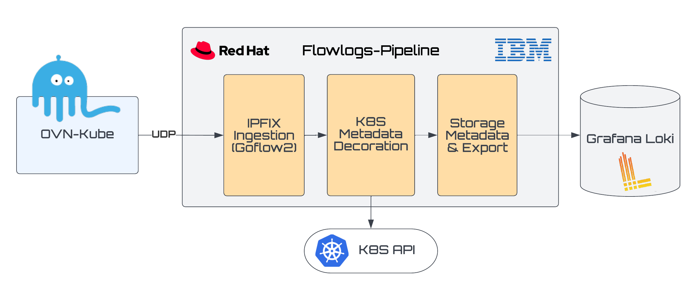
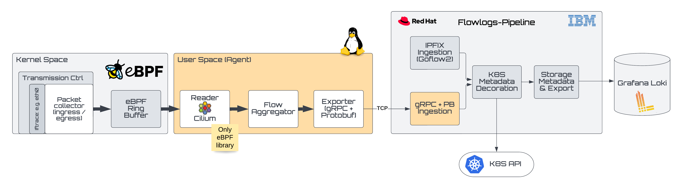
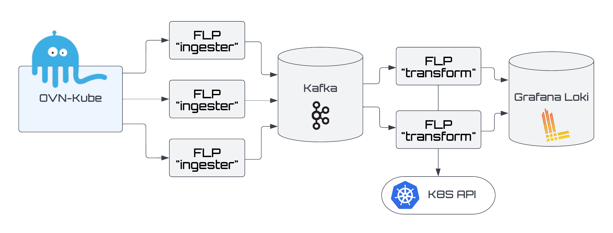

# Network Observability

## Release Signoff Checklist

- [X] Enhancement is `implementable`
- [X] Design details are appropriately documented from clear requirements
- [ ] Test plan is defined
- [ ] Operational readiness criteria is defined
- [ ] Graduation criteria for dev preview, tech preview, GA
- [ ] User-facing documentation is created in [openshift-docs](https://github.com/openshift/openshift-docs/)

## Summary

Network Observability introduces a new category in OpenShift that
provides networking information for a single cluster.  It gives insight
into what's on the network, when and what types of traffic and traffic
flows are being made, and by whom.  It gathers data to help design, plan,
and answer questions about the network and provides a visual representation
to help understand, diagnose, and troubleshoot networking issues.

## Motivation

With Kubernetes, a layer of abstraction is added making it difficult for
Red Hat and customers who manage their networks to be able to fully see
what's happening on their network.  Monitoring provides metrics and
alerts to potential problems.  Network observability will then help you
analyze, investigate and diagnose those problems by looking at it from
a centralized perspective instead of device by device.  In addition,
it can assist in the areas of network planning, network policy validation,
security, and others.

### Goals

- Help troubleshoot network-related issues at the control plane level
- Show what is happening on the network in a single cluster
- Gather insight and be able to answer questions about the network
- Provide rich visualization at the network layer, irrespective of the
underlying layer

The goal of the first release is to lay the groundwork and foundation
in place, while still being able to deliver some functionality, even
if it is at a smaller scale.  The target is to have a Dev Preview to
generate interest in network observability.

### Non-Goals

The focus is on network observability as opposed to other types of observability.

While a key goal is troubleshooting, it is not strictly a troubleshooting
tool.  Some of that are already addressed by
[Red Hat Insights](https://cloud.redhat.com/blog/openshift-insights-for-openshift-cluster-manager)
and specific tools like pcap, traceroute, and [Jaeger](https://www.jaegertracing.io/)
for tracing.


## Proposal

Network Observability covers a broad area.  In the first release,
it will focus on obtaining and storing NetFlow data and providing
visualization for this.  This is a logical first step in showing what is
happening on your network.

Network Observability will be an opt-in feature that needs to be enabled
by a user with an admin or cluster-admin role.  This is done by installing
the Network Observability Operator and Loki Operator.  The user can do this
using the web console or the CLI.

Either Open vSwitch (OVS) or eBPF agent will be configured to export flows.  The data will be
collected and combined with Kubernetes-related information (e.g. pod, services,
namespaces) and then saved in local persistent storage or cloud storage such
as Amazon S3.

The web console will provide a NetFlow table and topology views showing traffic between
pods.  In the future, more visualization and functionality
will be added to include areas such as extra network data gathered using
eBPF, policy validation, security risks, and more.

***Note:*** *The term "NetFlow" is used generically throughout this document and
is synonymous with IPFIX, which is the IETF version of NetFlow.*

### User Stories

1. As a cluster/network admin, I need access to data that allows me to debug network problems and conduct audits of network traffic.
    - “I’m trying to target traffic towards a specific pod, and the traffic coming into the cluster isn’t getting there.”
    - “The traffic coming into the cluster isn’t landing where I expect, where do things go wrong?”
    - “I’m trying to understand why traffic isn’t flowing from pod to pod in the way that I expected.”

2. As a cluster/network admin, I need basic search and filtering tools to analyze a subset of NetFlow data inside the OpenShift console.
    - Users can filter NetFlow based on traffic source or destination (ie, view all of the traffic associated with a particular node, service, namespace, pod, etc.).

User story 1 will be partially address as it provides the data for debugging.
However, the first release will not analyze why something went wrong.

### API Extensions

The OVS can be configured to enable NetFlows by using Cluster Network Operator
(networks.operator.openshift.io) to make this change.  This will impact the
performance of the OVS.

A priviledged eBPF agent can run on each cluster node as an alternative to 
generate NetFlows. This will impact the performance of nodes with a lower overall 
consumption than OVS approach.

### Implementation Details/Notes/Constraints

Here are the limitations and constraints.

1. NetFlows export<br>

    - CNI must be OVN-Kubernetes for OVS NetFlows
        The network type (CNI) has to be OVN-Kubernetes since configuring OVS to
    export IPFIX data is only supported there.  By default, the CNI is OpenShift
    SDN and the overwhelming majority of customers run OpenShift SDN today.
    Therefore in a brown field scenario, this would require the user to change
    their CNI type before network observability can be enabled.
        Note that the effort to implement OpenShift SDN to configure OVS is
    doable.  However, new features recently added have only been implemented
    in OVN-Kubernetes.
<br>
    - Kernel must be 4.18+ with eBPF enabled
        The eBPF agent will either need `BPF`, `PERFMON`, `NET_ADMIN`, `SYS_RESOURCE` 
    Linux capabilities or Administrative privileges if the kernel doesn't 
    recognize `BPF` and `PERFMON` (eg K3s / Kind).

2. Data sampling<br>
    In order to scale in terms of collecting data, it is not uncommon to take
a very small sample of data. By default, the data sample rate in OVS is
400 to 1.  Networks with larger bandwidth, sample at an even higher rate
such as 1,024 to 1.

    With sampling, you will be able to get trends about your network.  If
you are looking for a specific flow of data, it's likely not to be there.
The total number of bytes and packets are just estimations when sampling
is used.  Therefore if you need full visibility of the traffic and accuracy,
the only choice is not do sampling.

3. Resources required<br>
    Exporting data is potentially CPU, memory and bandwidth-intensive, and
typically requires a large amount of storage.  The CPU/memory/bandwidth
resources can be managed by the sampling data rate.  The storage requirements
can be controlled by the data retention policy or how long to keep the data.

    Nevertheless, in order to maintain the same performance that you have
prior to enabling network observability, will require additional resources.
The specific number of cores and the amount of memory and storage required
will be finalized as more testing is done.

### CRD

The operator custom resource definition (CRD) is divided per components whith 
the ability to select or enable optionnal ones. The console dynamic plugin also 
have an option to automatically register.

```yaml
apiVersion: flows.netobserv.io/v1alpha1
kind: FlowCollector
metadata:
  name: cluster
spec:
  namespace: "network-observability"
  agent: #either ipfix or ebpf
  ipfix:
    ...
  ebpf:
    ...
  flowlogsPipeline:
    ...
  kafka:
    enable: false
    ...
  loki:
    ...
  consolePlugin:
    register: true
    ...
```

Here is a full sample using `ipfix` (current default configuration):
```yaml
apiVersion: flows.netobserv.io/v1alpha1
kind: FlowCollector
metadata:
  name: cluster
spec:
  namespace: "network-observability"
  agent: ipfix
  ipfix:
    cacheActiveTimeout: 60s
    cacheMaxFlows: 100
    sampling: 400
  ebpf:
    image: 'quay.io/netobserv/netobserv-ebpf-agent:main'
    imagePullPolicy: IfNotPresent
    sampling: 0
    cacheActiveTimeout: 5s
    cacheMaxFlows: 1000
    interfaces: []
    excludeInterfaces: ["lo"]
    logLevel: info
    privileged: false
  flowlogsPipeline:
    kind: DaemonSet
    port: 2055
    image: 'quay.io/netobserv/flowlogs-pipeline:main'
    imagePullPolicy: IfNotPresent
    logLevel: info
    enableKubeProbes: true
    healthPort: 8080
    prometheusPort: 9090
  kafka:
    enable: false
    address: "kafka-cluster-kafka-bootstrap.network-observability"
    topic: "network-flows"
  loki:
    url: 'http://loki:3100/'
    batchWait: 1s
    batchSize: 102400
    minBackoff: 1s
    maxBackoff: 300s
    maxRetries: 10
    staticLabels:
      app: netobserv-flowcollector
  consolePlugin:
    register: true
    image: 'quay.io/netobserv/network-observability-console-plugin:main'
    imagePullPolicy: IfNotPresent
    port: 9001
    logLevel: info
    portNaming:
      enable: true
      portNames:
        "3100": loki
  clusterNetworkOperator:
    namespace: "openshift-network-operator"
  ovnKubernetes:
    namespace: "ovn-kubernetes"
    daemonSetName: "ovnkube-node"
    containerName: "ovnkube-node"
```

Check [network-observability-operator/config/crd/bases/flows.netobserv.io_flowcollectors.yaml](https://github.com/netobserv/network-observability-operator/blob/main/config/crd/bases/flows.netobserv.io_flowcollectors.yaml) for all options.

### Risks and Mitigations

| Risk | Mitigation |
| --- | --- |
| Resource Risk<br> Not having enough resources (e.g. CPU) can be disruptive to the system, and care must be taken to not jeopardize the health of the network by enabling network observability.  | Minimum resource requirements will be documented for CPU, memory, storage, and bandwidth. |
| Privacy<br> Operators need to be aware of what data is being collected as it might expose customers to privacy issues.  In sensitive cases, storing IP addresses is problematic as it can reveal the user's general location and can be used to find out other information about the user, including possibly the user's identity. | Mask out sensitive data.  This will prevent searching on this data. |
| Cost<br> It may not be clear how much additional cost the customer will incur, particularly if this is managed by Red Hat.  Additional nodes may need to be added to avoid the resource risk described above. | Accounts managed by Red Hat can have an upper bound limit on how much can be spent on infrastructure. |
| Data accuracy<br> If data sampling is turned on, then data accuracy cannot be relied on so using this for audit reports or criminal investigation are not viable. | Turn off sampling. |
| Scalability<br> Need support for more than 20K NetFlows per second (which is the target for the first release) | The sampling rate can be increased.<br>In addition, the plan is add Apache Kafka to scale the flow collection and storage. |
| Internal flows are not visible<br>Only the internal bridge athe OVN-Kubernetes layer is enabled so internal flows are not visible. | This is possible to do but will be deferred to a later release. |


## Design Details

### Software Architecture
This is the software architecture at a high level using different configurations.

1. OVN



2. eBPF



3. Kafka




### Software Components

#### OVS
Open vSwitch (OVS) is the NetFlow exporter in the OpenShift cluster.  When
Network Observability is enabled, each OVS in the node will be configured to
send IPFIX data.  This is an all-or-none proposition, meaning there will
not be an option to selectively choose some OVS to be exporters only.  There
will be a configuration parameter to set the sampling rate.  Other parameters
such as the cache size may also be exposed.

#### eBPF agent
Extended Berkeley Packet Filter (eBPF) is used to safely and efficiently extend 
the capabilities of the kernel without requiring to change kernel source code or 
load kernel modules.  The agent will allows collecting and aggregating all the 
ingress and egress flows on Linux hosts to send flows.

#### Flow-Logs Pipeline
Flow-Logs Pipeline (FLP) is an observability tool that consumes either:
- raw network flow-logs in their original format (NetFlow v5,v9 or IPFIX)
- eBPF flows in binary format (protobuf+GRPC)
- Kafka entries in JSON format
and uses a pipe-line to enhances the flows with Kubernetes-related information, 
transform the logs into time series metrics in prometheus format and in parallel 
transform and persist the logs also into loki.

#### Storage
Storage stores the IPFIX/Kubernetes data.  It provides a REST API to
retrieve this data.  The minimum storage requirement is 200 GB.  Because
of the potential large amount of data, the data retention policy is 24
hours.  This component is [Grafana Loki](https://github.com/grafana/loki).
See Network Observability Storage enhancement for more details.


### Operators
Two new operators will be required for network observability.  They are
the Network Observability Operator and the Loki Operator.

#### Network Observability Operator (NetObserv)
The Network Observability Operator will need to be installed from OperatorHub
to enable this feature.  This operator has a dependency on the Loki
Operator.  The operator includes an [OpenShift Console dynamic plugin](https://github.com/openshift/console/tree/master/frontend/packages/console-dynamic-plugin-sdk)
that is responsible for defining resources and enabling collection of
NetFlow similar to Red Hat OpenShift Logging.  This can be done from
Web Console or CLI.

The operator will follow the [Operator Lifecycle Manager](https://olm.operatorframework.io/)
(OLM) model which is a component of the [Operator Framework](https://github.com/operator-framework).
This allows Network Observability to release on its own cycle, although the
plan is to follow the OCP's release dates and leverage this benefit
for hot fixes only.

#### Loki Operator
The Loki Operator is a separate project at
https://github.com/grafana/loki/tree/main/operator but is required for network
observability.  It manages Grafana Loki, which is the component that will be
used to store NetFlows.  It will be installed in its own namespace with the
intention that if another component wants to use Loki, it should create its
own instance.


### Visualization
All views should have the following common capabilities:
- Filter on any field
- Filter across fields - Minimally, this filters on the source or destination
(e.g. filter on a pod in the Src Pod or Dest Pod).
- Time range - Specify a start time and optional end time of the data to display
- Refresh rate - Determine if the table will update automatically after some time
- Persistent selection - Remember the settings across sessions such
as query options, refresh rate, columns etc
- Shareable URL that keeps filters and options

1. This is the proposal for the table.

<https://marvelapp.com/prototype/7ih8i2c/screen/87585102>

The table has the following features:
- User-selectable columns - Each user can select which columns from a set of
predefined attributes to display in the table.
- Sort by column (ascending, descending)
- Export data to CSV format - Exports the selected columns and what
is currently filtered in that time range

The UI uses [PatternFly](https://github.com/patternfly/patternfly) to provide a
rich user experience.

2. This is the proposal for the topology.

<https://marvelapp.com/prototype/7ih8i2c/screen/87585098>

The topology view has the following features:
- Select display (from PF library)
- Select data scope from Node / Namespace / Owner / Resource
- Group by Nodes / Namespace / Owner
- Select data type from Bytes / Packets
- Select data aggregation from Sum / Max / Avg

3. This is the proposal for the dashboards

<https://marvelapp.com/prototype/178d5j04/screen/86530615>

The dashboard has the following features:
- Provide an overview of the networking state
- Show indicators like if the flows are recorded, average rate
- Show total flows chart
- Show top X charts per namespace / owners / pods as donut
- Show top X charts per namespace / owners / pods as timeseries

### Installation and Packaging

Network Observability will be delivered as an operator install which
is available immediately when you access OpenShift.  Since it is part
of OLM, it is not necessarily tied to a particular OCP release, and
can be updated independently.

A few resource-related parameters can be changed, but all values will
have some default so that enabling network observability will be as
simple as possible.  For more details, see the enhancement on Network
Observability - Installation and Packaging (TBD).


### Test Plan

End-to-end testing will be done at different loads representing at least
three personas in terms of nodes per cluster, pods per nodes, cores per
cluster, and cores/nodes per cluster.  It will represent customers from
different sectors of the industry such as in financial, healthcare, and
technology running on different infrastructures (e.g. bare metal, AWS, GCP,
Azure, IBM Cloud).  In the first release, it will target the lower end
with the intention to scale up in subsequent releases.

These are the criteria and metrics that will be measured.
- Test with 5 nodes, 10 nodes, 25 nodes and 50 nodes in a cluster
- Support at least 20K NetFlows per second
- Document behavior when system is overwhelmed
- Ensure all UI response times are reasonable
- Test at different sampling rates and no sampling

End-to-end automation testing will be done using [Cypress](https://www.cypress.io)
for UI testing and [Ginkgo](https://onsi.github.io/ginkgo/) for backend
testing.


### Graduation Criteria

The first release will be a Dev Preview.  The general acceptance criteria
are:

- Meet scalability targets
- Complete end-to-end testing
- No blockers in Jira
- Do minimum stress testing

Similar criteria will be apply to Tech Preview and GA but with
different metrics such as increased node support and NetFlows
per second.

#### Dev Preview -> Tech Preview

The following are items to complete for Tech Preview:

- Increase scalability targets
- Performance testing
- End user documentation
- Gather feedback from customers

#### Tech Preview -> GA

The following are items to complete for GA:

- Finalize end-to-end and performance testing
- API stability
- User facing documentation created in [openshift-docs](https://github.com/openshift/openshift-docs/)

#### Removing a deprecated feature

N/A

### Upgrade / Downgrade Strategy

In a brown field scenario, if the customer is running OpenShift
SDN, a change to OVN-Kubernetes is required.  Migrating to
OVN-Kubernetes is a manual process that requires some downtime.  For
more information, see [Migration to the OVN-Kubernetes network provider](https://docs.openshift.com/container-platform/4.8/networking/ovn_kubernetes_network_provider/migrate-from-openshift-sdn.html).

### Version Skew Strategy

N/A since this is the first release

### Operational Aspects of API Extensions

Because OVS is configured to export NetFlows, the performance impact
will be related to the amount of traffic and the sampling rate.  This
will be tested against a number of scenarios as described in the Test
Plan section above.

#### Failure Modes

N/A

#### Support Procedures

N/A

## Implementation History

TBD

## Drawbacks

Measuring ROI on network observability is difficult so it might be hard
to justify the cost and resources to deploy this.  It attempts to find
and resolve issues that you might not know exist.  The value you get
may not be obvious because it is difficult to calculate how much you
save by preventing something from happening such as a network failure.

## Alternatives

Rather than having network observability, the troubleshooting aspect
can be done by creating scripts and standalone applications to enhance
traditional pinpoint tools like pcap, traceroute, netstat, etc.  This
does not provide a centralized solution nor address the non-troubleshooting
issues, and would be difficult to make each tool GUI-based and consistent.

Regarding introducing a new Network Observability Operator, alternatives
were considered.  It didn't make sense to combine with Cluster Network
Operator or Cluster Monitoring Operator since network observability
is an opt-in feature that requires resources.  Combining with Red Hat
OpenShift Logging Operator (formerly Cluster Logging Operator) will limit
the ability to enable one and not the other.

For storage, Elasticsearch was not chosen due to licensing restrictions.
Open Distro for Elasticsearch was considered, but Loki was favored due to
other components in Web Console that plan to ultimately use Loki.

## Infrastructure Needed

This is a new project that will require a new Git repository under
[openshift](https://github.com/openshift).  CI will be set up with
Prow and/or GitHub Actions.  Development will need resources for
infrastructure.
