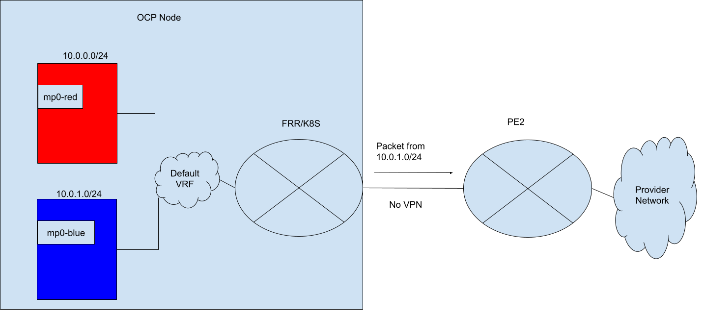
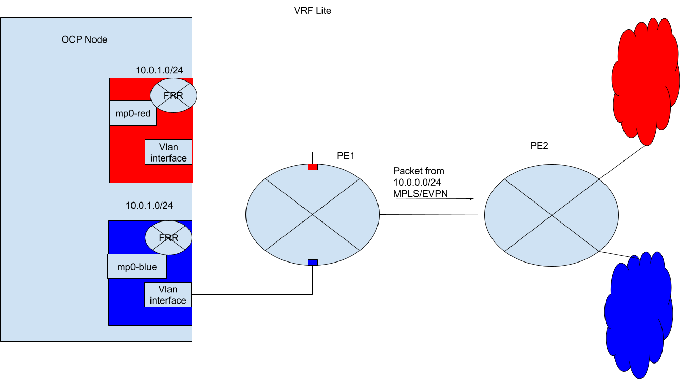

# OVN-Kubernetes BGP Integration

## Summary

OVN-Kubernetes currently has no native routing protocol integration, and relies on a Geneve overlay for east/west
traffic, as well as third party operators to handle external network integration into the cluster. The purpose of this
enhancement is to introduce BGP as a supported routing protocol with OVN-Kubernetes. The extent of this support will
allow OVN-Kubernetes to integrate into different BGP user environments, enabling it to dynamically expose cluster scoped
network entities into a provider’s network, as well as program BGP learned routes from the provider’s network into OVN.

## Motivation

There are multiple driving factors which necessitate integrating BGP into OVN-Kubernetes. They will be broken down into
sections below, describing each use case/requirement. Additionally, implementing BGP paves the way for full EVPN support
in the future, which is the choice of networking fabric in the modern data center. For purposes of this document, the
external, physical network of the cluster which a user administers will be called the “provider network”.

### Importing Routes from the Provider Network

Today in OpenShift there is no API for a user to be able to configure routes into OVN. In order for a user to change how
cluster traffic is routed egress into the cluster, the user leverages local gateway mode, which forces egress traffic to
hop through the Linux host networking stack. There a user can configure routes inside the host via NM State. This
manual configuration would need to be performed and maintained across nodes and VRFs within each node.

Additionally, if a user chooses to not manage routes within the host for local gateway mode, or the user chooses shared
gateway mode, then by default traffic is always sent to the default gateway. The only other way to affect egress routing
is by using the Multiple External Gateways (MEG) feature. With this feature the user may choose to have multiple
different egress gateways per namespace to send traffic to.

As an alternative, configuring BGP peers and which route-targets to import would eliminate the need to manually
configure routes in the host, and would allow dynamic routing updates based on changes in the provider’s network.

### Exporting Routes into the Provider Network

There exists a need for provider networks to learn routes directly to services and pods today in Kubernetes. More
specifically, MetalLB is already one solution where load balancer IPs are advertised by BGP to provider networks. The
goal of this RFE is to not duplicate or replace the function of MetalLB. MetalLB should be able to interoperate with
OVN-Kubernetes, and be responsible for advertising services to a provider’s network.

However, there is an alternative need to advertise pod IPs on the provider network. One use case is integration with 3rd
party load balancers, where they terminate a load balancer and then send packets directly to OCP nodes with the
destination IP address being the pod IP itself. Today these load balancers rely on custom operators to detect which node
a pod is scheduled to and then add routes into its load balancer to send the packet to the right node.

By integrating BGP and advertising the pod subnets/addresses directly on the provider network, load balancers and other
entities on the network would be able to reach the pod IPs directly.

### Datapath Performance

In cases where throughput is a priority, using the underlay directly can eliminate the need for tunnel encapsulation,
and thus reducing the overhead and byte size of each packet. This allows for greater throughput.

### Multi-homing, Link Redundancy, Fast Convergence

BGP can use multi-homing with ECMP routing in order to provide layer 3 failover. When a link goes down, BGP can reroute
via a different path. This functionality can be coupled with BFD in order to provide fast failover.

### User Stories

 * As a user I want to be able to leverage my existing BGP network to dynamically learn routes to pods in my Kubernetes
   cluster.
 * As a user, rather than having to maintain routes with NM State manually in each Kubernetes node, as well as being
   constrained to using local gateway mode for respecting user defined routes; I want to use BGP so that I can dynamically
   advertise egress routes for the Kubernetes pod traffic in either gateway mode.
 * As a user where maximum throughput is a priority, I want to reduce packet overhead by not having to encapsulate
   traffic with Geneve.
 * As a baremetal or egress IP user, I do not want to have to restrict my nodes to the same layer 2 segment and prefer
   to use a pure routing implementation to handle advertising virtual IP (VIP) movement across nodes.

### Goals

* To provide a user facing API to allow configuration of iBGP or eBGP peers, along typical BGP configuration including
  communities, route filtering, etc.
* Support for advertising Egress IP addresses.
* To enable BFD to BGP peers.
* Leveraging BGP to allow for no overlay encapsulation with east/west traffic.
* ECMP routing support within OVN for BGP learned routes.
* Support for advertising user-defined networks via BGP as long as there is no subnet overlap over the default VRF.
* Allowing for VRF-Lite type of VPN where the user maps interfaces on the host to user-defined VRFs/networks and
advertises VPN routes via BGP sessions over said VRFs.

### Non-Goals

* Support of any other routing protocol.
* Running separate BGPd instances per VRF network.
* Providing any type of API or operator to automatically connect two Kubernetes clusters via L3VPN.
* Replacing the support that MetalLB provides today for advertising service IPs.
* Support for any other type of BGP speaker other than FRR.

### Future Goals

* Support EVPN configuration and integration with a user’s DC fabric, along with MAC-VRFs and IP-VRFs.
* Support iBGP with route reflectors.
* Potentially advertising other IP addresses, including the Kubernetes API VIP across the BGP fabric.

## Proposal

OVN-Kubernetes will leverage other projects that already exist to enable BGP in Linux. FRR will be used as the BGP
speaker and already has EVPN support for native Linux constructs like Linux bridges, VRF devices, VXLAN tunnels, etc.
FRR may need some code contributions to allow it to integrate with OVN and Open vSwitch. For FRR configuration, the
MetalLB project has already started an API to be able to configure FRR: 
[https://github.com/metallb/frr-k8s](https://github.com/metallb/frr-k8s). While some of the configuration support for
FRR may be directly exposed by FRR-K8S API, it may also be the case that some intermediary CRD provided by
OVN-Kubernetes is required to integrate OVN-Kubernetes networking concepts into FRR.

Functionally, FRR will handle advertising and importing routes and configuring those inside a Linux VRF. OVN-Kubernetes
will be responsible for listening on netlink and configuring OVN-Kubernetes logical routers with routes learned by FRR.

### Workflow Description

An admin has the ability to configure BGP peering and choose what networks to advertise. A tenant is able to define
networks for their namespace, but requires admin permission in order to expose those networks onto the provider's BGP
fabric. A typical workflow will be for a user or admin to create a user-defined network, and then the admin will be
responsible to:

1. If setting up VRF-Lite, do any host modifications necessary via NMState to enslave an IP interface to the
   matching network VRF.
2. Configure BGP peering via interacting with the FRR-K8S API for a given set of worker nodes. Also define filters for
what routes should be received from the provider network.
3. Create the OVN-Kubernetes RouteAdvertisements CR to configure what routes and where to advertise them.
4. Verify peering and that routes have been propagated correctly.
5. If desired, change the transport type from geneve on the network to none in order to no longer use an overlay.

For detailed examples, see the [BGP Configuration](#bgp-configuration) section.

### API Extensions
FRR-K8S API will be used in order to create BGP Peering and configure other BGP related configuration. A
RouteAdvertisements CRD will be introduced in order to determine which routes should be advertised for specific networks.
Additionally, the network CRD will be modified in order to expose a new transport field to determine if encapsulation
should be used for east/west traffic. Finally, the OpenShift API itself will be modified to expose a setting so that
Cluster Network Operator (CNO) can deploy FRR and FRR-K8S.

### Topology Considerations

#### Hypershift / Hosted Control Planes

#### Standalone Clusters

#### Single-node Deployments or MicroShift

### Risks and Mitigations

BGP has a wide range of configurations and configuration options that are supported by FRR today. There is a big risk
of scope creep to try to support all of these options during the initial development phase. During the initial release
the number of options supported will be limited to mitigate this issue, and the main focus will be on stability of a
default environment without enabling these extra options/features.

Reliance on FRR is another minor risk, with no presence from the OCP networking team involved in that project.

Another risk is integration with MetalLB. We need to ensure that MetalLB is still able to function correctly with
whatever OVN-Kubernetes is configuring within FRR.

In addition, by dynamically learning routes and programming them into OVN, we risk a customer accidentally introducing
potentially hundreds or even thousands of routes into different OVN logical routers. As a mitigation, we can recommend
using communities or route aggregation to customers to limit RIB size. We will also need to scale test the effect of
many routes inside OVN logical routers.

Also, FRR-K8S is not GA yet, and targeted for 4.17.

### Drawbacks

* Increased complexity of our SDN networking solution to support more complex networking. 
* Increases support complexity due to integration with the a user's provider network.
* Increases network control plane load on nodes, as they have multiple peer connections and are having to maintain
a dynamic routing protocol.

### Implementation Details/Notes/Constraints

#### BGP Peering

FRR-K8S shall support both internal BGP (iBGP) and external BGP (eBGP). With iBGP, a full mesh topology is required. This
can be cumbersome and have issues with scaling in large clusters. In the future, FRR-K8S shall also support designating one
or more nodes as route reflectors (https://issues.redhat.com/browse/CNF-10719). With route reflectors, nodes only have
to connect to the route reflectors and do not have to maintain a full mesh with all other nodes in the cluster. Therefore,
support for iBGP in this enhancement will be restricted to full mesh only.

#### FRR-K8S Integration

As previously mentioned frr-k8s will be used in order to deploy and manage FRR configuration. Support will be added
where necessary for gaps in frr-k8s API, but in the meantime frr-k8s supports also issuing raw FRR configuration. Every
attempt should be made to leverage the FRR-K8S API, and raw configuration should only be used as a last resort. A user
will need the ability to:

* Define BGP peers, ASN, authentication, along with other common BGP configurations like communities, route filtering, etc.
* Configure BFD

FRR-K8S will serve as the main API for user configuration of BGP via FRR-K8S CRs. OVN-Kubernetes will watch for these
CRs, and once created, OVN-Kubernetes will start monitoring the kernel routing table via netlink for routes installed
by FRR. When FRR is using Zebra, the routes can be identified via a proto "bgp" label:

```
123.123.123.0/24 nhid 47 via 172.18.0.5 dev breth0 proto bgp metric 20
```

When these routes are seen on the node, ovnkube-controller will update the routes in NBDB for any GW routers on the
node, filtering the route for the GW router based on if the interface on the route matches the interface in OVS. This
will happen irrespective of gateway mode, as some features in local gateway mode rely on the GRs for sending traffic
(Egress IP, MEG). Note, this configuration will only happen on nodes selected by the FRR-K8S CRs.

#### API Changes

##### OpenShift API

The OpenShift API will be modified in order to allow CNO to deploy FRR and FRR-K8S CRDs:

```golang
// NetworkSpec is the top-level network configuration object.
type NetworkSpec struct {
    // ...
    // deployFRR specifies whether or not the Free Range Routing (FRR) stack
    // along with FRR-K8S API should be deployed by the operator.
    // FRR is required for enabling for using any OpenShift features that require dynamic
    // routing. This includes BGP support for OVN-Kubernetes and MetalLB.
    // +optional
    DeployFRR *bool `json:"deployFRR,omitempty"`
}
```

##### Route Advertisements

When OVN-Kubernetes detects that a FRR-K8S CR has been created for BGP peering, OVN-Kubernetes will by default
advertise the pod subnet for each node, via creating an additive, per node FRR-K8S CR that is managed by OVN-Kubernetes.
OVN-Kubernetes CRD:

```yaml
apiVersion: k8s.ovn.org/v1
kind: RouteAdvertisements
metadata:
  name: default
spec:
    # networkSelector:
    # nodeSelector:
    # frrConfigurationSelector:
    targetVRF: default
    advertisements:
      podNetwork: true
      egressIP: true
```      

In the above example, an optional networkSelector may also be optionally supplied which will match namespaces/networks.
When omitted, RouteAdvertisements will be applied to the default cluster network. If a selector is used that selects the
default cluster network, it will be enabled for any namespace using the cluster default network. Additionally,
advertisements may be limited to specific nodes via the nodeSelector.

A networkSelector may select more than one network, including user-defined networks. In such a case the network subnets
will be checked by OVN-Kubernetes to determine if there is any overlap of the IP subnets. If so, an error status will be
reported to the CRD and no BGP configuration will be done by OVN-Kubernetes.

The CRD will support enabling advertisements for pod subnet and egress IPs. Note, MetalLB still handles advertising
LoadBalancer IP so there is no conflict of responsibilities here. When the pod network is set to be advertised, there is
no longer a need to SNAT pod IPs for this network to the node IP. Therefore, when pod network advertisements are enabled,
the traffic from these pods will no longer be SNAT'ed on egress.

The "targetVRF" key is used to determine which VRF the routes should be advertised in. The default value is "auto", in
which case OVN-Kubernetes will advertise routes in the VRF that corresponds to the selected network. Alternatively, the
user may specify the name of the VRF, which would cause routes to be leaked for this network onto that VRF. One use case
for this would be when a user wants to define a network with a specific IP addressing scheme, and then wants to advertise
the pod IPs into the provider BGP network without VPN. By specifying the targetVRF as "default", routes will be leaked
into the default VRF. Note that by using route leaking with a user-defined network, the network is no longer fully
isolated, as now any other networks also leaked or attached to that VRF may reach this user-defined network. If a user
attempts to leak routes into a targetVRF for a user-defined network whose IP subnet would collide with another,
OVN-Kubernetes will report an error to the RouteAdvertisement status.

The frrConfigurationSelector is used in order to determine which FRRConfiguration CR to use for building the OVN-Kubernetes
driven FRRConfiguration. OVN-Kubernetes needs to leverage a pre-existing FRRConfiguration to be able to find required
pieces of configuration like BGP peering, etc. If more than one FRRConfiguration is found matching the selector, then
an error will be propagated to the RouteAdvertisements CR and no configuration shall be done.

##### No Tunnel/Overlay Mode

Changes will be made to the network CRD(s) in order to specify the method of transport for east/west traffic. A new
field, “transport” will be added with values “geneve” or “none” (default geneve). The transport option in the CRD may be
used to toggle between using Geneve encapsulation (the default today) or using no encapsulation. With no encapsulation,
east/west packets are routed directly on the underlay using routing learned via BGP. This is supported for Layer 3
networks only. Enabling a transport of “none” for Layer 2 networks will have no effect. Enabling a transport of “none”
without selecting all nodes for RouteAdvertisements will also break east/west traffic between those nodes, as there will
not be routes propagated into the BGP network for unselected nodes. Users should expect disruption when the transport of
a network is changed.

#### BGP Configuration

When OVN-Kubernetes detects that a FRRConfiguration has been created that has a corresponding and valid FRRNodeState,
OVN-Kubernetes will then use RouteAdvertisements CR create a corresponding FRRConfiguration. The following examples will
use an environment where a user has created an FRRConfiguration:

```yaml
apiVersion: frrk8s.metallb.io/v1beta1
kind: FRRConfiguration
metadata:
  creationTimestamp: "2024-06-11T14:22:37Z"
  generation: 1
  name: metallb-ovn-worker
  namespace: metallb-system
  resourceVersion: "1323"
  uid: 99b64be3-4f36-4e0b-8704-75aa5182d89f
  labels:
    routeAdvertisements: default
spec:
  bgp:
    routers:
    - asn: 64512
      neighbors:
      - address: 172.18.0.5
        asn: 64512
        disableMP: false
        holdTime: 1m30s
        keepaliveTime: 30s
        passwordSecret: {}
        port: 179
        toAdvertise:
          allowed:
            mode: filtered
        toReceive:
          allowed:
            mode: filtered
  nodeSelector:
    matchLabels:
       kubernetes.io/hostname: ovn-worker
```

OVNKube-Controller will check that if this FRRConfiguration applies to its node, ovn-worker. For this example, a user-defined
network named "blue", has been created with a network of 10.0.0.0/16, and a matching vrf exists in the Linux host. The slice
of this supernet that has been allocated to node ovn-worker is 10.0.1./0/24. 

##### Example 1: Advertising pod IPs from a user-defined network over BGP



In this example a user wants to expose network blue outside their OCP cluster so that pod IPs are reachable on the
external network. The admin has creates the following RouteAdvertisements CR for the blue tenant:
```yaml
apiVersion: k8s.ovn.org/v1
kind: RouteAdvertisements
metadata:
  name: default
spec:
  advertisements:
    podNetwork: true
  networkSelector:
    matchLabels: 
      k8s.ovn.org/metadata.name: blue
  nodeSelector:
    matchLabels:
      kubernetes.io/hostname: ovn-worker
  frrConfigurationSelector:
    matchLabels:
      routeAdvertisements: default
```

OVNKube-Controller will now see it needs to generate corresponding FRRConfiguration:

```yaml
apiVersion: frrk8s.metallb.io/v1beta1
kind: FRRConfiguration
metadata:
  name: route-advertisements-blue
  namespace: metallb-system
spec:
  bgp:
    routers:
    - asn: 64512
      vrf: blue
      prefixes:
        - 10.0.1.0/24
    - asn: 64512
      neighbors:
         - address: 172.18.0.5
           asn: 64512
           toAdvertise:
              allowed:
                 prefixes:
                    - 10.0.1.0/24
  raw:
    rawConfig: |-
       router bgp 64512
        address-family ipv4 unicast
          import vrf blue
          exit-address-family
       router bgp 64512 vrf blue    
        address-family ipv4 unicast
          import vrf default
          exit-address-family      
  nodeSelector:
     matchLabels:
        kubernetes.io/hostname: ovn-worker
```

In the above configuration generated by OVN-Kubernetes, the subnet 10.0.1.0/24 which belongs to VRF blue, is being
imported into the default VRF, and advertised to the 172.18.0.5 neighbor. This is because the targetVRF was defaulted so
the routes are leaked and advertised in the default VRF. Additionally, routes are being imported from the default VRF
into the blue VRF. At the time of this writing, FRR-K8S does not support importing vrf routes as an API, and thus rawConfig
is used. However, when implementing this enhancement every attempt should be made to add support into FRR-K8S to use its
API rather than using rawConfig.

##### Example 2: VRF Lite - Advertising pod IPs from a user-defined network over BGP with VPN



In this example, the user provisions a VLAN interface, enslaved to the VRF, which carries the blue network in isolation
to the external PE router. This provides a VRF-Lite design where FRR-K8S is going to be leveraged to advertise the blue
network only over the corresponding VRF/VLAN link to the next hop PE router. The same is done for the red tenant.
Here the user has created an additional FRRConfiguration CR to peer with the PE router on the blue and red VLANs:

```yaml
apiVersion: frrk8s.metallb.io/v1beta1
kind: FRRConfiguration
metadata:
  name: vpn-ovn-worker
  namespace: metallb-system
  labels:
    routeAdvertisements: vpn-blue-red
spec:
  bgp:
    routers:
    - asn: 64512
      vrf: blue
      neighbors:
      - address: 182.18.0.5
        asn: 64512
        disableMP: false
        holdTime: 1m30s
        keepaliveTime: 30s
        passwordSecret: {}
        port: 179
        toAdvertise:
          allowed:
            mode: filtered
        toReceive:
          allowed:
            mode: filtered
    - asn: 64512
      vrf: red
      neighbors:
         - address: 192.18.0.5
           asn: 64512
           disableMP: false
           holdTime: 1m30s
           keepaliveTime: 30s
           passwordSecret: {}
           port: 179
           toAdvertise:
              allowed:
                 mode: filtered
           toReceive:
              allowed:
                 mode: filtered
```

The admin now creates the following RouteAdvertisements CR:
```yaml
apiVersion: k8s.ovn.org/v1
kind: RouteAdvertisements
metadata:
  name: default
spec:
  targetVRF: auto 
  advertisements:
    podNetwork: true
  networkSelector:
    matchExpressions:
      - { key: k8s.ovn.org/metadata.name, operator: In, values: [blue,red] } 
  nodeSelector:
    matchLabels:
      kubernetes.io/hostname: ovn-worker
  frrConfigurationSelector:
    matchLabels:
      routeAdvertisements: vpn-blue-red
```

In the above CR, the targetVRF is set to auto, meaning the advertisements will occur within the VRF corresponding to the
individual networks selected. In this case, the pod subnet for blue will be advertised over the blue VRF, while the pod
subnet for red will be advertised over the red VRF. OVN-Kubernetes creates the following FRRConfiguration:

```yaml
apiVersion: frrk8s.metallb.io/v1beta1
kind: FRRConfiguration
metadata:
  name: route-advertisements-blue
  namespace: metallb-system
spec:
  bgp:
    routers:
    - asn: 64512
      neighbors:
      - address: 182.18.0.5
        asn: 64512
        toAdvertise:
          allowed:
            prefixes:
               - 10.0.1.0/24
      vrf: blue
      prefixes:
        - 10.0.1.0/24
    - asn: 64512
      neighbors:
      - address: 192.18.0.5
        asn: 64512
        toAdvertise:
          allowed:
            prefixes:
            - 10.0.1.0/24
      vrf: red
      prefixes:
         - 10.0.1.0/24  
  nodeSelector:
     matchLabels:
        kubernetes.io/hostname: ovn-worker
```

OVN-Kubernetes uses the configuration already in place in FRR and the desired RouteAdvertisements to generate the above
FRRConfiguration. For filtering or choosing what routes to receive, a user should do that in the FRRConfiguration they
declare for peering.

Note, VRF-Lite is only available when using Local Gateway Mode (routingViaHost: true) in OVN-Kubernetes.

#### Feature Compatibility

##### Multiple External Gateways (MEG)

When using BGP to learn routes to next hops, there can be overlap with gateways detected by the MEG feature. MEG may
still be configured along with BFD in OVN, and overlapping routes learned from BGP will be ignored by OVN-Kubernetes.
BFD may also be configured in FRR, for immediate purging of learned routes by FRR.

A user can also configure RouteAdvertisements for namespaces affected by MEG. Since MEG directly uses pod IPs
(in disable-snat-multiple-gws mode), the external gateway needs to know where to route pod IPs for ingress and egress
reply traffic. Traditionally this is done by the gateway having its own operator to detect pod subnets via kubernetes
API. With BGP, this is no longer necessary. A user can simply configure RouteAdvertisements, and the pod subnet routes
will be dynamically learned by an external gateway capable of BGP peering.

##### Egress IP

EgressIP feature that is dynamically moved between nodes. By enabling the feature in RouteAdvertisements, OVN-Kubernetes
will automatically change FRR-K8S configuration so that the node where an egress IP resides will advertise the IP. This
eliminates the need for nodes to be on the same layer 2 segment, as we no longer have to rely on gratuitous ARP (GARP).

##### Services

MetalLB will still be used in order to advertise services across the BGP fabric.

##### Egress Service

Full support.

##### Egress Firewall

Full support.

##### Egress QoS

Full Support.


##### Network Policy/ANP

Full Support.

##### Direct Pod Ingress

Direct pod ingress is already enabled for the default cluster network. With direct pod ingress, any external entity can
talk to a pod IP if it sends the packet to the node where the pod lives. Previously, support for direct pod ingress on
user-defined networks was not supported. RouteAdvertisements with this enhancement may select user-defined networks and
enable pod network advertisements. Therefore, it only makes sense to also accept direct pod ingress for these
user-defined networks as well, especially since we know the selected subnets will not overlap in IP address space.

###### Ingress via OVS bridge

Modifications will need to be made so that for packets arriving on br-ex, flows are added to steer the selected pod
subnets to the right OVN GR patch port. Today the flow for the default cluster network looks like this:

```
[root@ovn-worker ~]# ovs-ofctl show breth0
OFPT_FEATURES_REPLY (xid=0x2): dpid:00000242ac120003
n_tables:254, n_buffers:0
capabilities: FLOW_STATS TABLE_STATS PORT_STATS QUEUE_STATS ARP_MATCH_IP
actions: output enqueue set_vlan_vid set_vlan_pcp strip_vlan mod_dl_src mod_dl_dst mod_nw_src mod_nw_dst mod_nw_tos mod_tp_src mod_tp_dst
 1(eth0): addr:02:42:ac:12:00:03
     config:     0
     state:      0
     current:    10GB-FD COPPER
     speed: 10000 Mbps now, 0 Mbps max
 2(patch-breth0_ov): addr:ca:2c:82:e9:06:42
     config:     0
     state:      0
     speed: 0 Mbps now, 0 Mbps max


[root@ovn-worker ~]# ovs-ofctl dump-flows breth0 |grep 10.244
 cookie=0xdeff105, duration=437.393s, table=0, n_packets=4, n_bytes=392, idle_age=228, priority=109,ip,in_port=2,dl_src=02:42:ac:12:00:03,nw_src=10.244.1.0/24 actions=ct(commit,zone=64000,exec(load:0x1->NXM_NX_CT_MARK[])),output:1
 cookie=0xdeff105, duration=437.393s, table=0, n_packets=0, n_bytes=0, idle_age=437, priority=104,ip,in_port=2,nw_src=10.244.0.0/16 actions=drop
 cookie=0xdeff105, duration=437.393s, table=1, n_packets=4, n_bytes=392, idle_age=228, priority=15,ip,nw_dst=10.244.0.0/16 actions=output:2

```

Packets matching the pod IP are forwarded directly to OVN, where they are forwarded to the pod without SNAT. Additional
flows will need to be created for additional networks. For shared gateway mode, the reply packet will always return via
OVS and follow a symmetrical path. This is also true if local gateway mode is being used in combination with Multiple
External Gateways (MEG). However, if local gateway mode is used without MEG, then the reply packet will be forwarded into
the kernel networking stack, where it will routed out br-ex via the kernel routing table.

###### Ingress via a Secondary NIC

If packets enter into the host via a NIC that is not attached to OVS, the kernel networking stack will forward it into
the proper VRF, where it will be forwarded via ovn-k8s-mp0 of the respective user-defined network. Today when these
packets ingress ovn-k8s-mp0 into OVN, they are SNAT'ed to the ovn-k8s-mp0 address (.2 address). Reasons for this include:
1. To ensure incoming traffic that may be routed to another node via geneve would return back to this node. This is undesirable
and unnecessary for networks where only their respective per-node pod subnet is being advertised to the BGP fabric.
2. If running shared gateway mode, the reply packet would be routed via br-ex with the default gateway configured in
ovn_cluster_router.

For local gateway mode, changes will need to be made to skip the SNAT as it is not necessary and provides pods with the
true source IP of the sender.


Additionally, modifications will need to be made in the kernel routing table to
leak routes to the pod subnets from each user-defined VRF into the default VRF routing table.

#### Deployment Considerations

##### MetalLB

MetalLB is supported today as a day 2 add-on operator. MetalLB supports FRR mode, and has recently added support for
FRR-K8S mode. When the MetalLB Operator deploys MetalLB in FRR-K8S mode, it handles instantiating FRR-K8S. For the purposes
of OVN-Kubernetes integration, we need this as a day 0 function. For pods relying on the underlay and not using an overlay
encapsulation, the BGP routes will need to be learned by the time the pods come up.

In order to achieve day 0 functionality, FRR-K8S will be launched by CNO as a host networked pod on each node (where
applicable) via a new OpenShift API. MetalLB Operator will be modified so that it can launch in FRR-K8S mode, and will
directly write to the API to signal that CNO should deploy FRR-K8S. CNO will deploy FRR-K8s in a separate namespace, and
MetalLB RBAC will be updated so that it may write and have access to resources in the FRR-K8S namespace.

This deployment methodology will solve the following use cases:

1. The user needs BGP from node start up to serve pods by the time OVN-Kubernetes and pods are brought up by kubelet.
2. The user does not care about BGP in OVN-Kubernetes, and simply wants to use MetalLB as a day 2 operation.

## Test Plan

* E2E upstream with a framework (potentially [containerlab.dev](containerlab.dev) to simulate a routed spine and leaf
topology with integration using OVN Kubernetes.
* Testing using transport none for some networks, and Geneve for non-BGP enabled networks.
* Downstream testing to cover BGP functionality including MEG, Egress IP, Egress QoS, etc.
* Scale testing to determine impact of FRR-K8S footprint on large scale deployments.

## Graduation Criteria

### Dev Preview -> Tech Preview

There will be no dev or tech preview for this feature.

### Tech Preview -> GA

Targeting GA in OCP version 4.17.

### Removing a deprecated feature

N/A

## Upgrade / Downgrade Strategy

This feature should have no impact on upgrades. BGP configuration may be configured or removed at any time and previous
routing behavior within the OVN fabric should be restored. For limiting outage on upgrade of FRR-K8S, we may need to use
BGP features like graceful restart.

## Version Skew Strategy

N/A

## Operational Aspects of API Extensions

Using BGP, especially for east/west transport relies on the user's BGP network. Therefore, BGP control plane outages in
a user's network may impact OpenShift cluster networking. Furthermore, when changing a network's transport there will
be some amount of traffic disruption. Finally, this entire feature will depend on correct BGP peering via FRR-K8S
configuration, as well as settings to match the proper communities, route filtering, and other BGP configuration
within the provider's BGP network.

## Support Procedures

## Alternatives
