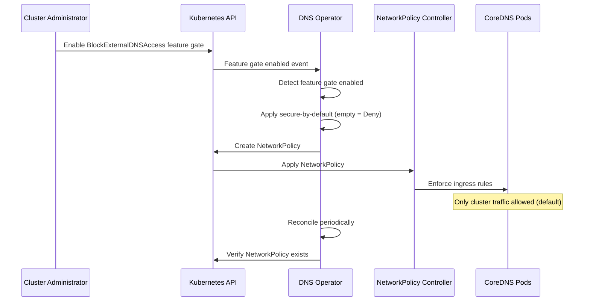

# Block External Access to CoreDNS

## Summary

This enhancement proposes to block external access to CoreDNS pods running
in OpenShift clusters by implementing NetworkPolicies that restrict DNS
queries to originate only from within the cluster. The feature follows a
secure-by-default approach: when the BlockExternalDNSAccess feature gate
is enabled, external access is automatically blocked unless administrators
explicitly configure the DNS Operator to allow it.

This security hardening measure prevents unauthorized external entities
from querying cluster DNS, mitigates DNS amplification/reflection attacks,
and reduces the risk of data exfiltration through DNS reconnaissance.

## Motivation

OpenShift clusters run CoreDNS to provide DNS resolution for cluster
workloads. By default, if CoreDNS pods are exposed externally (either
through misconfigurations or network topology), they can be accessed by
external entities outside the cluster.

**This creates the following risks:**

    Unauthorized reconnaissance: External actors can query cluster DNS to discover
    internal service names, namespaces, and cluster topology
    
    DNS amplification attacks: CoreDNS can be exploited as a vector for DDoS attacks by sending spoofed
    DNS queries that generate larger responses
    
    Data exfiltration: Sensitive cluster information can leak through DNS query responses to external parties
    
    Compliance violations: Many security frameworks and regulatory requirements mandate that internal DNS servers
    should not be accessible from external networks

### User Stories

* As a **cluster administrator**, I want to prevent external access to CoreDNS
  so that I can reduce the attack surface of my OpenShift cluster and
  comply with security policies that require DNS isolation.

* As a **security engineer**, I want to ensure that DNS queries to CoreDNS can
  only originate from within the cluster so that I can prevent DNS-based
  reconnaissance and amplification attacks targeting my infrastructure.

* As a **platform team member** managing multi-tenant OpenShift environments,
  I want to enforce DNS access control at the platform level so that I can
  provide security hardening by default without requiring individual tenant
  configuration.

* As a **cluster administrator**, I want the system to be monitored and
  remediated at scale so that any configuration drift or policy violations
  related to CoreDNS access control are automatically detected and
  corrected.

### Goals

* Provide secure-by-default protection: block external access to CoreDNS
  automatically when the feature gate is enabled
* Prevent external entities from querying CoreDNS pods by default
* Provide security hardening against DNS-based attacks (amplification,
  reflection, reconnaissance)
* Reduce the risk of data exfiltration through DNS queries
* Ensure DNS queries can only originate from pods and nodes within the
  cluster (unless explicitly allowed)
* Make the protection configurable through the DNS Operator API to allow
  external access when required

### Non-Goals

* Blocking DNS queries between namespaces within the cluster (internal DNS
  segmentation)
* Implementing DNS query rate limiting or throttling
* Modifying CoreDNS configuration or plugins beyond access control

## Proposal

This enhancement proposes to add a new field to the DNS Operator CRD that
controls external access to CoreDNS. When the feature gate is enabled
(initially DevPreviewNoUpgrade), the DNS Operator will block external
access by default using NetworkPolicies that restrict DNS traffic to the
CoreDNS pods to only accept connections from sources within the cluster
network. This provides a secure-by-default approach that requires
administrators to explicitly opt-in to allow external access if needed.

The implementation will:
1. Add a new API field to the DNS Operator CRD for configuring external
   access blocking
2. Update the DNS Operator to watch for this configuration and create
   appropriate NetworkPolicies
3. Create NetworkPolicies that allow DNS traffic (UDP/TCP port 53) only
   from cluster CIDR ranges (pod network and service network)
4. Ensure the NetworkPolicies are applied to all CoreDNS pods in the
   openshift-dns namespace
5. Monitor and reconcile NetworkPolicies to prevent configuration drift

### Workflow Description

**cluster administrator** is a human user responsible for managing cluster
security and configuration.

**DNS operator** is the OpenShift component responsible for managing
CoreDNS deployment and configuration.

**NetworkPolicy controller** is the CNI-specific component that enforces
NetworkPolicies.

1. The cluster administrator enables the DevPreviewNoUpgrade feature set
   on the cluster to activate the BlockExternalDNSAccess feature gate.

2. When the feature gate is enabled, the DNS operator automatically
   applies the secure-by-default behavior. External access to CoreDNS is
   blocked via NetworkPolicies even if the `externalAccessPolicy` field
   is not explicitly set (defaults to empty string which means "Deny").

   Optionally, the administrator can explicitly set the policy in the DNS
   custom resource:
   ```yaml
   apiVersion: operator.openshift.io/v1
   kind: DNS
   metadata:
     name: default
   spec:
     externalAccessPolicy: Deny
   ```

3. The DNS operator observes the feature gate is enabled and validates
   the configuration.

4. The DNS operator creates NetworkPolicy resources in the openshift-dns
   namespace that:
   - Allow ingress DNS traffic (UDP/TCP port 53) from the cluster's pod
     CIDR
   - Allow ingress DNS traffic (UDP/TCP port 53) from the cluster's
     service CIDR
   - Allow ingress DNS traffic from the node network (for host network
     pods and nodes)
   - Deny all other ingress traffic to CoreDNS pods

5. The NetworkPolicy controller (part of the CNI plugin) enforces the
   policies on CoreDNS pods.

6. The DNS operator continuously reconciles the NetworkPolicies to ensure
   they remain in place and correctly configured.

7. Any DNS queries from external sources are blocked by the NetworkPolicy,
   while internal cluster workloads continue to resolve DNS normally.



#### Variation: Allowing External Access

If a cluster administrator needs to allow external access to CoreDNS
(e.g., for external monitoring systems or specific network requirements):

1. The administrator updates the DNS resource to explicitly allow external
   access:
   ```yaml
   apiVersion: operator.openshift.io/v1
   kind: DNS
   metadata:
     name: default
   spec:
     externalAccessPolicy: Allow
   ```
2. The DNS operator observes the "Allow" value and removes any existing
   NetworkPolicies from the openshift-dns namespace
3. CoreDNS access uses the default cluster network configuration, allowing
   external queries

#### Variation: Explicitly Blocking External Access

If a cluster administrator wants to explicitly document their choice to
block external access (the default secure behavior):

1. The administrator sets the DNS resource with an explicit "Deny" value:
   ```yaml
   apiVersion: operator.openshift.io/v1
   kind: DNS
   metadata:
     name: default
   spec:
     externalAccessPolicy: Deny
   ```
2. The DNS operator creates NetworkPolicies to block external access
3. This has the same behavior as the default (empty string), but
   explicitly documents the administrator's intent to block external
   access

### API Extensions

This enhancement adds a new field to the existing DNS Operator CRD
(`operator.openshift.io/v1`, kind `DNS`):

```go
// DNSSpec is the specification of the desired behavior of the DNS.
type DNSSpec struct {
    // ... existing fields ...

    // externalAccessPolicy defines the policy for external access to
    // CoreDNS pods. This field controls whether NetworkPolicies are
    // created to restrict DNS queries from sources outside the cluster.
    //
    // When the BlockExternalDNSAccess feature gate is enabled, this
    // enhancement follows a secure-by-default approach: external access
    // is blocked by default unless explicitly allowed.
    //
    // Valid values are:
    //
    // - "" (empty string): External access to CoreDNS is blocked via
    //   NetworkPolicies. Only DNS queries originating from within the
    //   cluster (pod network, service network, and node network) are
    //   permitted. External sources will be unable to query CoreDNS.
    //   This is the default secure behavior when the field is omitted.
    //
    // - "Allow": Explicitly allows external access to CoreDNS. No
    //   NetworkPolicies are applied by the DNS operator for access
    //   control. CoreDNS access uses the default cluster network
    //   configuration. Use this value when external access to CoreDNS
    //   is required (e.g., for external monitoring systems).
    //
    // - "Deny": Explicitly blocks all external access to CoreDNS via
    //   NetworkPolicies. Only DNS queries originating from within the
    //   cluster (pod network, service network, and node network) are
    //   permitted. This value has the same behavior as the empty string
    //   but allows administrators to explicitly document their intent to
    //   block external access.
    //
    // Future values may include policies for allowlisting specific external
    // sources or custom access control configurations.
    //
    // This field requires the BlockExternalDNSAccess feature gate to be
    // enabled.
    //
    // +optional
    // +openshift:enable:FeatureGate=BlockExternalDNSAccess
    ExternalAccessPolicy string `json:"externalAccessPolicy,omitempty"`
}
```

This enhancement modifies the behavior of the DNS Operator to create and
manage NetworkPolicy resources targeting CoreDNS pods in the openshift-dns
namespace.

### Topology Considerations

#### Hypershift / Hosted Control Planes

In Hypershift deployments, CoreDNS runs in the hosted cluster (guest
cluster), not in the management cluster. The NetworkPolicies created by
this enhancement will apply to the CoreDNS pods in the hosted cluster's
data plane.

This enhancement is fully applicable to Hypershift deployments. The DNS
operator running in the management cluster will manage the NetworkPolicies
in the hosted cluster just as it manages other DNS configurations.

#### Standalone Clusters

This enhancement is primarily designed for standalone clusters where
CoreDNS runs in the cluster's openshift-dns namespace. It provides direct
security hardening for these deployments.

#### Single-node Deployments or MicroShift

For Single-Node OpenShift (SNO) deployments, this enhancement provides the
same security benefits. The resource overhead of NetworkPolicies is
minimal and should not impact SNO resource consumption significantly.

For MicroShift, DNS is typically handled differently and CoreDNS may be
managed outside the DNS operator. This enhancement may not apply directly
to MicroShift unless CoreDNS is managed via the DNS operator in that
environment.

<!-- TODO: Validate MicroShift applicability and DNS management approach -->

#### OpenShift Kubernetes Engine

This enhancement applies to OKE deployments as they include the DNS
operator and CoreDNS components. The security hardening provided is
beneficial for OKE clusters as well.

### Implementation Details/Notes/Constraints

The implementation requires changes to the following components:

1. **openshift/api**: Add the `ExternalAccessPolicy` field to the DNS CRD
   with the appropriate feature gate marker
   (`+openshift:enable:FeatureGate=BlockExternalDNSAccess`)

2. **openshift/cluster-dns-operator**: Update the DNS operator to:
   - Read the feature gate state using the feature gate accessor pattern
   - When the BlockExternalDNSAccess feature gate is enabled, apply
     secure-by-default behavior
   - Watch the DNS resource for the `externalAccessPolicy` field
   - Create NetworkPolicy resources when:
     - The feature gate is enabled AND the field is empty/unset (default)
     - The field is explicitly set to "Deny"
   - Delete NetworkPolicy resources when the field is set to "Allow"
   - Reconcile NetworkPolicies to ensure they are not modified or deleted

3. **NetworkPolicy specification**: The NetworkPolicies will:
   - Target CoreDNS pods using label selectors (e.g., `dns.operator.
     openshift.io/daemonset-dns=default`)
   - Allow ingress on UDP and TCP port 53 from:
     - Cluster pod CIDR (obtained from Network CR)
     - Cluster service CIDR (obtained from Network CR)
     - Node network (obtained from cluster network configuration)
   - Use a deny-by-default approach (no egress restrictions needed for
     this feature)

4. **Feature gate creation**: A new feature gate `BlockExternalDNSAccess`
   must be added to https://github.com/openshift/api/blob/master/features/
   features.go with:
   - Initial feature set: DevPreviewNoUpgrade
   - Jira component: Networking / DNS
   - Enhancement PR link (this enhancement)
   - Contact person and owning product (ocpSpecific)

**Constraints and considerations**:

- The implementation depends on the CNI plugin supporting NetworkPolicies
  (OVN-Kubernetes, Calico, etc.). Clusters using CNI plugins that do not
  support NetworkPolicies will not be able to use this feature.
- Getting accurate cluster CIDR ranges requires querying the Network CR
  and cluster configuration, which may vary by platform and installation
  type.
- The NetworkPolicies must be kept in sync with any changes to cluster
  network configuration (e.g., if additional pod or service CIDRs are
  added).

### Risks and Mitigations

**Risk**: Enabling the feature gate automatically blocks external access by
default, which could disrupt existing workflows or external monitoring
systems that rely on querying CoreDNS from outside the cluster.

**Mitigation**:
- Comprehensive documentation warning administrators about the
  secure-by-default behavior when enabling the feature gate
- Provide clear instructions on how to set `externalAccessPolicy: Allow`
  before enabling the feature gate if external access is required
- Start with DevPreviewNoUpgrade to gather feedback from early adopters
  about any disruption scenarios
- Include prominent warnings in release notes and feature gate
  documentation

**Risk**: NetworkPolicies may inadvertently block legitimate DNS traffic if
cluster CIDR ranges are incorrectly identified or if there are edge cases
in network topology.

**Mitigation**: Extensive testing across different platforms and network
configurations. Provide clear documentation on how to verify the feature
is working correctly and how to allow external access if issues arise.
Start with DevPreviewNoUpgrade to gather feedback before promoting to Tech
Preview or GA.

**Risk**: CNI plugins that do not support NetworkPolicies will silently
fail to enforce the blocking, creating a false sense of security.

**Mitigation**: The DNS operator should detect if NetworkPolicy support is
available in the cluster (by checking CNI capabilities) and report a
degraded status with a clear message if NetworkPolicies cannot be enforced.

**Risk**: Changes to cluster network configuration during cluster lifecycle
may cause NetworkPolicies to become outdated (e.g., new CIDR ranges added).

**Mitigation**: The DNS operator should watch the Network CR and
automatically update NetworkPolicies when cluster network configuration
changes.

**Risk**: External monitoring or health check systems that need to query
CoreDNS will be blocked by default when the feature gate is enabled.

**Mitigation**: Document this limitation clearly and prominently. Provide
guidance on alternative approaches for external monitoring (e.g.,
monitoring through cluster API or using internal monitoring agents). Make
it easy to set `externalAccessPolicy: Allow` for clusters that require
external access. Consider adding configuration to allow specific external
IPs if needed in future iterations.

### Drawbacks

- The secure-by-default approach means that enabling the feature gate will
  immediately block external access, which could disrupt existing workflows
  or external monitoring systems that rely on querying CoreDNS from outside
  the cluster without warning
- This feature adds complexity to the DNS operator with additional
  reconciliation logic for NetworkPolicies
- NetworkPolicies introduce additional resource overhead (minimal, but
  non-zero)
- Organizations with external DNS monitoring or testing tools will need to
  explicitly set `externalAccessPolicy: Allow` to maintain their existing
  workflows
- The feature is CNI-dependent and will not work on clusters with CNI
  plugins that don't support NetworkPolicies

## Alternatives (Not Implemented)

### Alternative 1: Configure CoreDNS ACL Plugin

Instead of NetworkPolicies, configure CoreDNS with an ACL plugin to reject
queries from external sources based on source IP.

**Pros**:
- Does not depend on CNI NetworkPolicy support
- Can provide more granular control (e.g., query-based filtering)

**Cons**:
- Requires modifying CoreDNS configuration which adds complexity
- Less standard approach compared to NetworkPolicies
- Performance overhead of checking ACLs for every query
- ACL configuration needs to be maintained and synchronized with cluster
  network changes

**Reason not selected**: NetworkPolicies are a more Kubernetes-native
approach and are enforced at the network layer before traffic reaches
CoreDNS, providing better performance and security.

### Alternative 2: Firewall Rules at Node Level

Use node-level firewall rules (iptables/nftables) to block external access
to CoreDNS service IPs.

**Pros**:
- Works regardless of CNI plugin capabilities
- Can be enforced at node level with high performance

**Cons**:
- Requires managing firewall rules on every node
- More complex to implement across different node operating systems and
  firewall implementations
- Harder to manage lifecycle (what happens during node upgrades, reboots,
  etc.)

**Reason not selected**: NetworkPolicies provide a cleaner abstraction and
are managed declaratively through Kubernetes resources, making them easier
to maintain and reason about.

### Alternative 3: Do Not Expose CoreDNS Externally

Simply document that CoreDNS should not be exposed externally and leave it
to cluster administrators to ensure proper network configuration.

**Pros**:
- No code changes required
- Maximum flexibility for administrators

**Cons**:
- Relies on manual configuration which is error-prone
- Does not provide defense-in-depth
- No enforcement mechanism

**Reason not selected**: This enhancement provides defense-in-depth and
enforces security best practices by default, reducing the risk of
misconfiguration.

## Open Questions

1. Should we provide configuration to allow specific external IP ranges
   (e.g., for monitoring systems) in addition to the "Allow" and "Deny"
   options?

2. Should we add observability metrics to track blocked DNS queries from
   external sources?

3. For future iterations, should we consider DNS query rate limiting as
   an additional security layer?

4. Is the secure-by-default approach (blocking external access when the
   feature gate is enabled) the right choice, or should administrators be
   required to explicitly opt-in to blocking? The current design prioritizes
   security but may cause disruption for clusters with external dependencies
   on CoreDNS.

## Test Plan

The test plan will include:

1. **Unit tests**:
   - DNS operator logic for creating/updating/deleting NetworkPolicies
   - Feature gate detection and handling
   - Validation of DNS CR with blockExternalAccess field

2. **Integration tests**:
   - Verify NetworkPolicies are created when blockExternalAccess is
     enabled
   - Verify NetworkPolicies are removed when blockExternalAccess is
     disabled
   - Verify NetworkPolicies allow internal cluster DNS traffic
   - Verify NetworkPolicies block external DNS traffic (simulate external
     query)

3. **E2E tests** (in openshift/origin):
   - All tests must include the following labels:
     - `[OCPFeatureGate:BlockExternalDNSAccess]` - feature gate label
     - `[Jira:"Networking / DNS"]` - component label
     - `[Suite:openshift/network]` - test suite label (if applicable)
     - Additional labels as needed: `[Serial]`, `[Slow]`, `[Disruptive]`
   - Test that internal pods can resolve DNS after enabling the feature
   - Test that external entities cannot query CoreDNS (requires test
     infrastructure to simulate external access)
   - Test across different CNI plugins (OVN-Kubernetes, others if
     supported)
   - Test upgrade scenarios where the feature is enabled before upgrade
   - Test that the feature gracefully handles CNI plugins without
     NetworkPolicy support

For detailed test labeling conventions, see dev-guide/test-conventions.md.

## Graduation Criteria

This enhancement follows the standard OpenShift feature graduation path:
DevPreviewNoUpgrade -> TechPreviewNoUpgrade -> Default (GA).

### Dev Preview -> Tech Preview

**Testing**:
- Minimum 5 e2e tests implemented in openshift/origin with
  `[OCPFeatureGate:BlockExternalDNSAccess]` label covering:
  - Internal DNS resolution continues to work with feature enabled
    (default secure behavior)
  - External DNS queries are blocked when `externalAccessPolicy` is
    empty/unset or set to "Deny"
  - External DNS queries succeed when `externalAccessPolicy` is set to
    "Allow"
  - NetworkPolicies are created and managed correctly by DNS operator
  - Upgrade scenario with feature enabled
- Tests run successfully on at least AWS and one other platform (e.g.,
  Azure or GCP)
- Unit and integration tests for DNS operator NetworkPolicy management
  logic
- Test coverage for CNI plugins that don't support NetworkPolicies
  (operator should degrade gracefully)

**Documentation**:
- End user documentation explaining:
  - The secure-by-default behavior when feature gate is enabled
  - How to explicitly allow external access using `externalAccessPolicy:
    Allow`
  - Limitations and CNI plugin requirements
  - How to verify the feature is working correctly
  - Troubleshooting steps
- Enhancement proposal updated with implementation details and lessons
  learned from Dev Preview

**Operational Requirements**:
- DNS operator exposes metrics for NetworkPolicy creation/reconciliation
- DNS operator reports degraded status when CNI doesn't support
  NetworkPolicies
- No major bugs or regressions reported in Dev Preview
- Validation that NetworkPolicies correctly identify cluster CIDRs across
  different network configurations and platforms

**Feedback**:
- Gathered feedback from at least 3 early adopter clusters
- Documented any workflows that were disrupted by the secure-by-default
  behavior
- Validated that `externalAccessPolicy: Allow` successfully addresses use
  cases requiring external access

**API Stability**:
- The `externalAccessPolicy` field API is stable and no breaking changes
  are anticipated
- API has been reviewed and approved by API reviewers

### Tech Preview -> GA

**Testing Requirements** (per dev-guide/feature-zero-to-hero.md):

- **Test quantity**: Minimum 5 tests with
  `[OCPFeatureGate:BlockExternalDNSAccess]` label
- **Test frequency**: All tests run at least 7 times per week
- **Platform coverage**: All tests run at least 14 times on each supported
  platform:
  - AWS (HA, amd64, default network)
  - AWS (Single, amd64, default network)
  - Azure (HA, amd64, default network)
  - GCP (HA, amd64, default network)
  - vSphere (HA, amd64, default network)
  - Baremetal (HA, amd64, IPv4)
  - Baremetal (HA, amd64, IPv6 - disconnected)
  - Baremetal (HA, amd64, Dual stack)
- **Pass rate**: 95% or higher pass rate across all test runs
- **Test duration**: Tests have been running for at least 14 days before
  branch cut
- **Test variants**: Tests run in both `TechPreviewNoUpgrade` and `Default`
  job variants (skipped in Default until promoted)

**Comprehensive Testing**:
- Upgrade testing:
  - Upgrade from version without feature to version with feature
    (validates no disruption when feature gate is disabled)
  - Upgrade with feature gate enabled and `externalAccessPolicy` set to
    "Allow" (validates external access remains functional)
  - Upgrade with feature gate enabled and default secure behavior
    (validates NetworkPolicies persist and reconcile)
- Downgrade testing:
  - Downgrade with feature enabled (validates NetworkPolicies can be
    manually cleaned up)
  - Documentation for manual cleanup steps if needed
- Scale testing:
  - Feature works correctly in clusters with custom/additional pod and
    service CIDRs
  - NetworkPolicy updates when cluster network configuration changes
- Version skew testing:
  - DNS operator at N+1, CoreDNS at N
  - CNI upgrade scenarios

**Documentation**:
- User-facing documentation in openshift-docs including:
  - Configuration guide
  - Security implications and best practices
  - Troubleshooting guide
  - Migration guide for clusters with external DNS dependencies
- Release notes documenting the secure-by-default behavior
- CNI compatibility matrix clearly documented

**Operational Maturity**:
- Metrics for monitoring:
  - NetworkPolicy creation/update/deletion events
  - DNS operator condition status related to this feature
  - Optionally: metrics for blocked external DNS queries (if feasible)
- Alerts defined for:
  - DNS operator degraded when NetworkPolicy support is unavailable
  - NetworkPolicy creation failures
- Performance validation:
  - DNS query latency impact measured (should be negligible)
  - NetworkPolicy reconciliation overhead is acceptable

**User Feedback**:
- Positive feedback from Tech Preview users
- No major usability issues reported
- Documented common use cases and their solutions
- Validation that the secure-by-default approach is acceptable to users

**Security and API Review**:
- Security review completed and signed off
- API review completed and approved (if any API changes from Tech Preview)
- Confirmation that the feature provides meaningful security hardening

**Platform Compatibility**:
- Feature works correctly with all supported CNI plugins:
  - OVN-Kubernetes (primary)
  - Others if applicable
- Graceful degradation documented and tested for CNI plugins without
  NetworkPolicy support
- Feature tested on all supported topologies:
  - Standalone clusters
  - Hypershift/Hosted Control Planes
  - Single-Node OpenShift (SNO)
  - OKE (if applicable)

**Production Readiness**:
- No critical or high-severity bugs open
- Support procedures documented and validated
- Runbooks created for common support scenarios
- Monitoring and alerting validated in production-like environments

## Upgrade / Downgrade Strategy

**Upgrades**:

When upgrading from a version without this feature to a version with this
feature:
- The feature gate will be disabled by default (Dev Preview)
- Existing clusters will see no change in DNS behavior unless
  administrators explicitly enable the BlockExternalDNSAccess feature gate
- **IMPORTANT**: Once the feature gate is enabled, the secure-by-default
  behavior activates immediately. External access to CoreDNS will be
  blocked automatically via NetworkPolicies unless administrators
  explicitly set `externalAccessPolicy: Allow` in the DNS CR
- Administrators who need external CoreDNS access must proactively set
  `externalAccessPolicy: Allow` before or immediately after enabling the
  feature gate to avoid service disruption

When upgrading with the feature already enabled:
- The DNS operator will continue to maintain the NetworkPolicies
- The feature should remain functional during the upgrade
- If the NetworkPolicies are temporarily deleted during upgrade, the DNS
  operator will recreate them during reconciliation
- The secure-by-default behavior persists across upgrades

**Downgrades**:

When downgrading from a version with this feature to a version without it:
- The NetworkPolicies created by the DNS operator will remain in the
  cluster (Kubernetes does not delete resources during downgrades)
- Administrators should manually delete the NetworkPolicies if they want
  to restore the previous behavior
- Documentation will include steps to clean up NetworkPolicies after
  downgrade

If downgrading with the feature enabled causes issues:
- The DNS CR may contain the `blockExternalAccess` field that the older
  DNS operator doesn't understand
- The older DNS operator will ignore unknown fields, so this should not
  cause errors
- The NetworkPolicies will persist but will not be managed (no
  reconciliation)

## Version Skew Strategy

During an upgrade where the DNS operator is updated but other components
are still at older versions:
- The DNS operator creates NetworkPolicies that target CoreDNS pods
- CoreDNS pods themselves do not need to be aware of this feature
- The CNI plugin (OVN-Kubernetes) enforces NetworkPolicies and should
  handle them correctly regardless of version

If the CoreDNS version changes during an upgrade:
- The NetworkPolicies use label selectors, not version-specific targeting
- As long as CoreDNS pods maintain the same labels, NetworkPolicies will
  continue to apply

If the CNI plugin is upgraded during cluster upgrade:
- NetworkPolicy enforcement is handled by the CNI
- Temporary loss of NetworkPolicy enforcement during CNI upgrade is
  acceptable (brief window)
- DNS operator will verify NetworkPolicies exist after CNI upgrade

## Operational Aspects of API Extensions

This enhancement modifies the DNS CRD (`operator.openshift.io/v1`, kind
`DNS`) by adding a new optional field `blockExternalAccess`. This is an
additive change that does not modify existing behavior when the field is
not set.

**SLIs for monitoring DNS operator health**:
- Existing DNS operator condition `Degraded=False` should remain false
- Existing DNS operator condition `Available=True` should remain true
- DNS operator logs will include messages about NetworkPolicy creation,
  updates, and reconciliation

**Impact on existing SLIs**:
- Minimal impact on API throughput as the DNS CR is infrequently updated
- No impact on pod scheduling or other cluster operations
- NetworkPolicy creation/updates are rare events (only when DNS CR changes
  or during reconciliation)
- DNS query performance should not be impacted (NetworkPolicies are
  evaluated at network layer before reaching CoreDNS)

**Measurement**:
- Performance testing will be conducted during Tech Preview to measure any
  DNS query latency impact
- Testing will be performed by the networking QE team as part of standard
  regression testing

**Failure modes**:
- **NetworkPolicy creation fails**: DNS operator will report Degraded
  condition with a message indicating NetworkPolicy creation failure. DNS
  resolution continues to work normally, but external access is not
  blocked.
- **CNI does not support NetworkPolicies**: DNS operator should detect
  this and report Degraded condition with message "NetworkPolicy support
  not available in cluster CNI". Feature cannot be enabled.
- **NetworkPolicy is deleted by user**: DNS operator reconciliation will
  recreate it within the reconciliation interval (typically 5-10 minutes).

**Impact on cluster health**:
- NetworkPolicy failures do not impact DNS resolution functionality
- Cluster operations continue normally even if this feature fails
- No impact on kube-controller-manager or other core components

**Teams involved in escalations**:
- Primary: Networking team (DNS component)
- Secondary: CNI team (OVN-Kubernetes) for NetworkPolicy enforcement issues

## Support Procedures

**Detecting failure modes**:

1. **Feature gate is enabled but NetworkPolicies are not created**:
   - Symptom: `oc get networkpolicies -n openshift-dns` shows no policies
     related to CoreDNS access control, even though the feature gate is
     enabled and `externalAccessPolicy` is empty or "Deny"
   - Check DNS operator logs: `oc logs -n openshift-dns-operator deployment/
     dns-operator`
   - Look for errors mentioning NetworkPolicy creation
   - Check DNS operator conditions: `oc get dns.operator.openshift.io/
     default -o yaml` and examine status conditions

2. **External access is still possible despite feature gate being enabled**:
   - Symptom: External DNS queries to CoreDNS succeed even though the
     feature gate is enabled and `externalAccessPolicy` is not set to
     "Allow"
   - Verify NetworkPolicies exist and are correctly configured
   - Check if CNI supports NetworkPolicies: `oc get network.config.
     openshift.io/cluster -o yaml` and examine networkType
   - Verify CNI is enforcing policies (CNI-specific debugging)

3. **Internal DNS resolution fails after enabling feature gate**:
   - Symptom: Pods cannot resolve DNS after enabling the
     BlockExternalDNSAccess feature gate
   - Check NetworkPolicy rules to ensure cluster CIDRs are correctly
     specified
   - Verify pod and service CIDRs: `oc get network.config.openshift.io/
     cluster -o yaml`
   - Check NetworkPolicy logs/events in CNI plugin

4. **External monitoring stops working after enabling feature gate**:
   - Symptom: External monitoring systems can no longer query CoreDNS
     after enabling the BlockExternalDNSAccess feature gate
   - This is expected behavior due to secure-by-default
   - Solution: Set `externalAccessPolicy: Allow` if external access is
     required

**Allowing external access**:

To allow external access to CoreDNS (disabling the default blocking):
1. Update the DNS CR: `oc edit dns.operator.openshift.io/default` and
   set `externalAccessPolicy: Allow`
2. Verify NetworkPolicies are removed: `oc get networkpolicies -n
   openshift-dns`
3. External DNS queries should now succeed

**Consequences of allowing external access**:
- External entities can query CoreDNS (if network topology permits)
- Security posture is reduced - cluster DNS becomes accessible from
  outside the cluster
- Increased risk of DNS-based reconnaissance and amplification attacks
- No impact on existing workloads or cluster health
- No data loss or configuration loss

**Graceful failure and recovery**:
- If the DNS operator crashes while managing NetworkPolicies, the
  NetworkPolicies remain in place (enforced by CNI)
- When the DNS operator restarts, it will reconcile and recreate any
  missing NetworkPolicies
- If NetworkPolicies are manually deleted, the DNS operator will recreate
  them during the next reconciliation cycle
- Internal DNS resolution is never impacted by this feature's failure
  (fail-open for internal traffic)

## Infrastructure Needed

No additional infrastructure is required for this enhancement. Testing will
leverage existing OpenShift CI infrastructure and e2e test frameworks.
