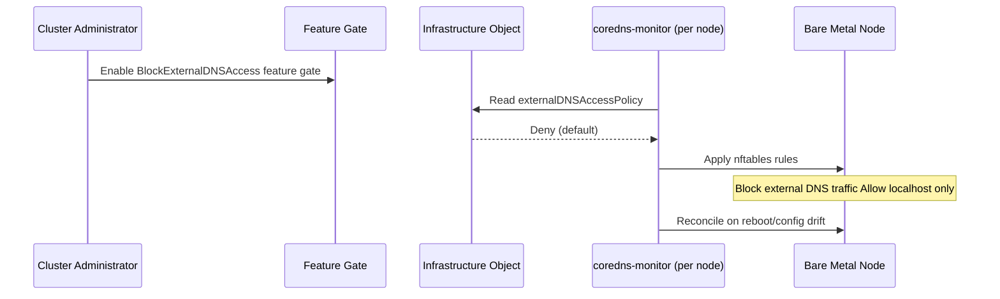

# Block External Access to CoreDNS

## Summary

This enhancement proposes to block external access to CoreDNS instances
running on bare metal OpenShift cluster nodes. On bare metal deployments,
CoreDNS runs on the host network namespace to provide DNS resolution for
the host operating system. These instances can be exposed to external
networks depending on the network topology and firewall configuration. The
feature follows a secure-by-default approach: when the
BlockExternalDNSAccess feature gate is enabled, external access is
automatically blocked unless explicitly allowed.

This enhancement is **specific to bare metal nodes** and does NOT involve
the cluster DNS Operator. The implementation adds firewall rule management
to the `coredns-monitor` container in `openshift/baremetal-runtimecfg`,
following the proven pattern established by `haproxy-monitor` for managing
nftables rules on bare metal nodes. Configuration is controlled via a new
`externalDNSAccessPolicy` field in the Infrastructure object's
`BareMetalPlatformSpec`.

This security hardening measure prevents unauthorized external entities
from querying on-prem DNS, mitigates DNS amplification/reflection attacks,
and reduces the risk of data exfiltration through DNS reconnaissance.

## Motivation

On **bare metal OpenShift deployments**, CoreDNS instances run on each
node in the host network namespace to provide DNS resolution for the host
operating system and node-level services. Unlike cloud deployments where
network access is typically restricted by cloud provider security groups,
bare metal nodes may have direct network exposure. These on-prem CoreDNS
instances listen on the node's network interfaces (typically port 53
UDP/TCP). Depending on the network topology and firewall configuration,
these CoreDNS instances may be accessible from external networks outside
the cluster.

**This creates the following risks:**

    Unauthorized reconnaissance: External actors can query on-prem DNS
    to discover internal host names, services, and network topology

    DNS amplification attacks: CoreDNS can be exploited as a vector for
    DDoS attacks by sending spoofed DNS queries that generate larger
    responses

    Data exfiltration: Sensitive infrastructure information can leak
    through DNS query responses to external parties

    Compliance violations: Many security frameworks and regulatory
    requirements mandate that internal DNS servers should not be
    accessible from external networks

    Host compromise: Vulnerabilities in CoreDNS could be exploited by
    external attackers if the service is exposed

### User Stories

* As a **cluster administrator**, I want to prevent external access to the
  on-prem CoreDNS instances running on my cluster nodes so that I can
  reduce the attack surface of my OpenShift cluster and comply with
  security policies that require DNS isolation.

* As a **cluster administrator**, I want the option to allow external
  access to on-prem CoreDNS when required (e.g., for external monitoring
  systems) so that I can balance security hardening with operational needs.

* As a **platform team member** managing multi-tenant OpenShift
  environments, I want to enforce DNS access control for on-prem
  CoreDNS at the platform level so that I can provide security hardening by
  default without requiring individual tenant or node-level configuration.

* As a **cluster administrator**, I want the system to be monitored and
  remediated at scale so that any configuration drift or firewall rule
  violations related to on-prem CoreDNS access control are
  automatically detected and corrected.

### Goals

* Provide secure-by-default protection for **bare metal deployments**:
  block external access to on-prem CoreDNS instances running on bare metal
  nodes automatically when the feature gate is enabled
* Prevent external entities from querying on-prem CoreDNS instances on
  bare metal nodes by default
* Provide security hardening against DNS-based attacks (amplification,
  reflection, reconnaissance) targeting host-level CoreDNS on bare metal
  infrastructure
* Reduce the risk of data exfiltration through DNS queries to on-prem
  CoreDNS on bare metal nodes
* Ensure DNS queries to on-prem CoreDNS can only originate from localhost
  by default (unless explicitly allowed via configuration)
* Provide a simple configuration toggle (`externalDNSAccessPolicy` in the
  Infrastructure object) to allow external access when required (e.g., for
  monitoring) without involving the DNS Operator

### Non-Goals

* Blocking access to the cluster DNS service (the in-cluster CoreDNS pods
  used by workloads managed by the DNS Operator) - this enhancement
  specifically targets on-prem CoreDNS running on bare metal host network
* Modifying the DNS Operator or its CRDs - this enhancement does not
  involve the cluster DNS Operator
* Applying to cloud deployments (AWS, Azure, GCP, etc.) - this enhancement
  is specific to bare metal infrastructure
* Implementing DNS query rate limiting or throttling
* Replacing or removing on-prem CoreDNS from bare metal nodes

## Proposal

This enhancement proposes to block external access to CoreDNS running on
bare metal nodes by default. When the BlockExternalDNSAccess feature gate
is enabled (initially Tech Preview), external access is blocked by
default. This provides a secure-by-default approach that requires
administrators to explicitly opt-in to allow external access if needed for
specific use cases (e.g., external monitoring).

Since on-prem CoreDNS runs on the host network namespace on bare metal
nodes (not as pods in the cluster), Kubernetes NetworkPolicies cannot be
used to restrict access. Additionally, this enhancement does NOT involve
the cluster DNS Operator, as the DNS Operator manages the in-cluster
CoreDNS service used by workloads, not the on-prem CoreDNS on bare metal
nodes.

### Implementation: coredns-monitor Firewall Management

The implementation adds nftables firewall rule management to the
`coredns-monitor` container in the `openshift/baremetal-runtimecfg`
repository. This follows the proven pattern established by
`haproxy-monitor`, which already manages iptables/nftables rules for API
VIP traffic redirection on bare metal nodes.

**Why coredns-monitor?**
- `coredns-monitor` already runs as a sidecar alongside the CoreDNS static
  pod on every bare metal node
- It already monitors DNS config changes, watches `resolv.conf`, and
  updates the CoreDNS Corefile
- `haproxy-monitor` (same repository) already manages firewall rules,
  providing a direct implementation analog
- Using coredns-monitor means firewall rules are managed by the same
  component that manages CoreDNS config
- Works on Hypershift bare metal deployments without requiring MCO
- No additional operator dependencies (Node Firewall Operator not
  required)

**Pros**:
- Blocks traffic at the network layer before it reaches CoreDNS (defense
  in depth)
- Works regardless of CoreDNS configuration or plugins
- Provides OS-level enforcement that's harder to bypass
- Leverages existing infrastructure (coredns-monitor is already deployed)
- Proven pattern (haproxy-monitor already does this for API VIP)
- No MCO dependency for rule management (avoids node reboots for rule
  changes)
- Works on both standalone and Hypershift bare metal deployments

**Cons**:
- Requires managing firewall state on every node
- Harder to debug when issues occur (need to check firewall state on
  nodes)

### Proposed Implementation Path

1. Extend `coredns-monitor` in `openshift/baremetal-runtimecfg` to manage
   nftables rules for DNS port access, modeled on `haproxy-monitor`'s
   firewall rule management
2. `coredns-monitor` reads the `externalDNSAccessPolicy` field from the
   Infrastructure object's `BareMetalPlatformSpec` to determine behavior
3. When `externalDNSAccessPolicy` is `Deny` (default) or unset,
   `coredns-monitor` applies nftables rules that:
   - Allow DNS queries from localhost (127.0.0.1, ::1)
   - Deny all other DNS queries from external sources
4. When `externalDNSAccessPolicy` is `Allow`, `coredns-monitor` removes
   or does not apply the blocking nftables rules
5. `coredns-monitor` continuously reconciles the nftables rules, ensuring
   they remain in place after node reboots or manual changes
6. The BlockExternalDNSAccess feature gate controls the Tech Preview -> GA
   lifecycle; once GA, the feature is always active and controlled by the
   Infrastructure object field

### Workflow Description

**cluster administrator** is a user responsible for managing cluster
security and configuration.

**Bare metal node** is an OpenShift cluster node running CoreDNS on the
host network for host-level DNS resolution.

**coredns-monitor** is the sidecar container running alongside the
CoreDNS static pod on each bare metal node, responsible for managing
CoreDNS configuration and (with this enhancement) nftables firewall
rules.

#### Workflow: Enabling External Access Blocking (Default Secure Behavior)

1. The cluster administrator enables the Tech Preview feature set
   on the cluster to activate the BlockExternalDNSAccess feature gate.

2. When the feature gate is enabled, `coredns-monitor` on each bare metal
   node reads the `externalDNSAccessPolicy` field from the Infrastructure
   object. If the field is unset or set to `Deny`, `coredns-monitor`
   applies the secure-by-default behavior.

3. `coredns-monitor` applies nftables rules on the node that:
   - Allow DNS traffic (UDP/TCP port 53) from localhost (127.0.0.1, ::1)
   - Deny all other DNS traffic from external sources to port 53

4. The nftables rules on each node enforce the blocking.

5. Any DNS queries to on-prem CoreDNS from external sources are blocked by
   the node firewall, while localhost DNS queries continue to work
   normally.

6. `coredns-monitor` continuously reconciles the nftables rules, ensuring
   they remain in place after node reboots or manual changes.



#### Variation: Allowing External Access

If a cluster administrator needs to allow external access to on-prem
CoreDNS on bare metal nodes (e.g., for external monitoring systems or
specific network requirements):

1. The administrator sets `externalDNSAccessPolicy: Allow` in the
   Infrastructure object's `BareMetalPlatformSpec`
2. `coredns-monitor` on each node detects the configuration change and
   removes the blocking nftables rules
3. On-prem CoreDNS becomes accessible from external networks (subject to
   other network controls like hardware firewalls, network ACLs, etc.)

Administrators needing fine-grained control (e.g., specific IP allowlists)
can manage their own firewall rules in addition to this toggle. The
`externalDNSAccessPolicy` field provides a simple cluster-wide on/off
control for the common case.

### API Extensions

This enhancement adds a new field to the Infrastructure object's
`BareMetalPlatformSpec` in `openshift/api`. The Infrastructure object is
where most bare metal host networking configuration already lives
(including `APIServerInternalIPs`, `IngressIPs`, and `MachineNetworks`),
making it the natural location for this setting.

**New field in `BareMetalPlatformSpec`**:

```go
// ExternalDNSAccessPolicy controls whether external access to
// on-prem CoreDNS instances on bare metal nodes is allowed.
// When set to "Deny" (the default), coredns-monitor applies nftables
// rules to block external DNS traffic, allowing only localhost access.
// When set to "Allow", no blocking rules are applied and external
// entities can query CoreDNS on bare metal nodes.
// +kubebuilder:default=Deny
// +optional
ExternalDNSAccessPolicy ExternalDNSAccessPolicyType `json:"externalDNSAccessPolicy,omitempty"`
```

The `ExternalDNSAccessPolicyType` is a string type with two valid values:
- `Deny` (default): Block external access to CoreDNS. `coredns-monitor`
  applies nftables rules allowing only localhost.
- `Allow`: Do not block external access. `coredns-monitor` removes or
  skips blocking rules.

The feature is additionally gated by the `BlockExternalDNSAccess` feature
gate during the Tech Preview phase. Once the feature reaches GA, the
feature gate is removed and the `externalDNSAccessPolicy` field is the
sole control mechanism.

### Topology Considerations

This enhancement is **specific to bare metal OpenShift deployments** where
CoreDNS runs on the host network namespace for node-level DNS resolution.

#### Hypershift / Hosted Control Planes

**Applicable for bare metal Hypershift**: Bare metal Hypershift is an
increasingly relevant deployment target. Since MCO does not run in hosted
clusters, any MCO-based approach would not work for Hypershift. The
`coredns-monitor` approach naturally handles this because `coredns-monitor`
runs as part of the CoreDNS static pod on each bare metal node, regardless
of whether the cluster is standalone or hosted. No MCO dependency is
required for firewall rule management.

For cloud-based Hypershift deployments (AWS, Azure, GCP), this feature is
not applicable as network security is managed via cloud provider security
groups and network ACLs.

#### Standalone Clusters

**Applicable to bare metal standalone clusters only**: This enhancement
applies to standalone OpenShift clusters deployed on bare metal
infrastructure where nodes run CoreDNS on the host network for host-level
DNS resolution.

#### Single-node Deployments or MicroShift

**Single-Node OpenShift (SNO) on bare metal**: If SNO is deployed on bare
metal infrastructure, this enhancement applies and provides security
hardening for the on-prem CoreDNS instance running on the single node.

**MicroShift**: DNS architecture in MicroShift may differ from standard
OpenShift. Applicability needs to be validated based on whether MicroShift
runs CoreDNS on the host network namespace.

#### OpenShift Kubernetes Engine

**OKE on bare metal only**: This enhancement applies to OKE deployments
only if they are running on bare metal infrastructure. Cloud-based OKE
deployments use cloud provider network security controls.

### Implementation Details/Notes/Constraints

The implementation requires the following components and changes:

1. **Feature gate creation**: A new feature gate `BlockExternalDNSAccess`
   must be added to https://github.com/openshift/api/blob/master/features/
   features.go with:
   - Initial feature set: Tech Preview
   - Jira component: Networking / DNS (or potentially Baremetal)
   - Contact person (bnemec)

2. **API field**: Add `externalDNSAccessPolicy` field to the
   `BareMetalPlatformSpec` in the Infrastructure object (see API
   Extensions section).

3. **coredns-monitor enhancement** (in `openshift/baremetal-runtimecfg`):
   - Add nftables rule management to `coredns-monitor`, modeled on
     `haproxy-monitor`'s existing firewall rule management
   - `coredns-monitor` reads the Infrastructure object to determine the
     value of `externalDNSAccessPolicy`
   - When `Deny` (default): apply nftables rules that allow DNS
     (UDP/TCP port 53) from localhost (127.0.0.1, ::1) and deny all other
     DNS traffic to port 53
   - When `Allow`: remove or skip the blocking nftables rules
   - Continuously reconcile rules to ensure they persist across reboots
     and configuration drift

   Note: The concern about nftables rules not working with OVN-Kubernetes
   shared gateway mode was investigated. For *inbound* external traffic to
   host-network CoreDNS, nftables rules work because this traffic is not
   managed by OVN-K. OVN-K shared gateway mode affects how egress traffic
   is routed, not how inbound traffic to host-network services is
   processed. The existing `haproxy-monitor` firewall rules for API VIP
   redirection confirm that host-level nftables rules function correctly
   in shared gateway mode.

**Constraints and considerations**:

- This feature applies **only to bare metal deployments**. Cloud
  deployments (AWS, Azure, GCP, etc.) are excluded.
- Firewall rules must persist across node reboots; `coredns-monitor`
  reconciles rules continuously.
- The `coredns-monitor` container already runs as part of the CoreDNS
  static pod on bare metal nodes, so no new deployment mechanism is
  needed.
- The exact nftables rule syntax may depend on the RHCOS version and node
  configuration.

### Risks and Mitigations

**Risk**: Enabling the feature gate automatically blocks external access by
default, which could disrupt existing workflows or external monitoring
systems that rely on querying on-prem CoreDNS from outside the cluster.

**Mitigation**:
- Comprehensive documentation warning administrators about the
  secure-by-default behavior when enabling the feature gate
- Provide clear instructions on how to set `externalDNSAccessPolicy:
  Allow` in the Infrastructure object if external access is required
- Start with Tech Preview to gather feedback from early adopters
  about any disruption scenarios
- Include prominent warnings in release notes and feature gate
  documentation

**Risk**: Firewall rules may inadvertently block legitimate DNS traffic
in edge cases related to network topology.

**Mitigation**: Extensive testing across different bare metal network
configurations (IPv4, IPv6, dual stack). Provide clear documentation on how
to verify firewall rules are working correctly and how to debug DNS access
issues. Include instructions on checking firewall rules via SSH to nodes.
Start with Tech Preview to gather feedback before promoting to GA.

**Risk**: Firewall rules applied by `coredns-monitor` may conflict with
other firewall rules managed by different components on the node.

**Mitigation**: Use a dedicated nftables chain for DNS access control,
following the same pattern used by `haproxy-monitor` for API VIP rules.
This isolates the rules and avoids conflicts with other firewall
management on the node.

**Risk**: External monitoring or health check systems that need to query
on-prem CoreDNS will be blocked by default when the feature gate is
enabled.

**Mitigation**: Document this limitation clearly and prominently. Provide
guidance on alternative approaches for external monitoring (e.g.,
monitoring through cluster API or using internal monitoring agents).
Administrators can set `externalDNSAccessPolicy: Allow` in the
Infrastructure object to restore external access. Administrators needing
fine-grained control (specific IP allowlists) can manage their own
firewall rules.

### Drawbacks

- The secure-by-default approach means that enabling the feature gate will
  immediately block external access, which could disrupt existing workflows
  or external monitoring systems that rely on querying on-prem CoreDNS
  from outside the cluster without warning
- This feature adds complexity to the `coredns-monitor` container with
  additional logic for managing nftables firewall rules
- Organizations with external DNS monitoring or testing tools will need to
  set `externalDNSAccessPolicy: Allow` in the Infrastructure object to
  maintain their existing workflows
- Debugging firewall-related issues on nodes requires SSH access and
  knowledge of nftables, which is more complex than debugging
  Kubernetes-native resources

### Removing a deprecated feature

This enhancement does not remove any deprecated features. It introduces a
new security hardening capability to block external access to CoreDNS
instances running on bare metal cluster nodes. No existing functionality is
being deprecated or removed as part of this enhancement.

## Alternatives (Not Implemented)

### Alternative 1: CoreDNS ACL Plugin

Configure on-prem CoreDNS with an ACL (Access Control List) plugin or
similar mechanism to reject DNS queries from external sources based on
source IP addresses.

**Pros**:
- Application-level control that's easier to reason about
- Centrally managed through CoreDNS configuration
- No dependency on node-level firewall mechanisms
- Easier to debug (CoreDNS logs show rejected queries)
- More portable across different platforms and OS versions

**Cons**:
- Traffic still reaches CoreDNS process (not blocked at network layer)
- Performance overhead of checking ACLs for every DNS query
- Requires modifying CoreDNS configuration which adds complexity
- ACL configuration needs to be maintained and synchronized with cluster
  network changes
- Potential vulnerabilities in CoreDNS could be exploited before ACL check

### Alternative 2: Use NetworkPolicies (Not viable)

Use Kubernetes NetworkPolicies to block external access to CoreDNS.

**Pros**:
- Kubernetes-native approach
- Declarative resource management
- Well-understood by cluster administrators
- No node-level changes required

**Cons**:
- **Does not work for on-prem CoreDNS**: NetworkPolicies apply to pod
  traffic only, not to processes running on the host network namespace.
  Since on-prem CoreDNS runs on the host network, NetworkPolicies
  cannot be used to restrict access to it.
- Would only work if targeting the in-cluster CoreDNS pods (not the scope
  of this enhancement)

**Reason not selected**: This alternative does not apply to on-prem
CoreDNS running on the host network. NetworkPolicies only control traffic
to pods, not to host-network services.

### Alternative 3: Do Not Expose On-Premises CoreDNS Externally (Not viable)

Simply document that on-prem CoreDNS should not be exposed externally
and leave it to cluster administrators to ensure proper network
configuration (e.g., via cloud security groups, hardware firewalls).

**Pros**:
- No code changes required in OpenShift
- Maximum flexibility for administrators
- Leverages existing infrastructure security controls

**Cons**:
- Relies on manual configuration which is error-prone
- Does not provide defense-in-depth at the cluster level
- No enforcement mechanism within OpenShift
- Inconsistent security posture across different deployment environments

**Reason not selected**: This enhancement provides defense-in-depth and
enforces security best practices by default at the OpenShift cluster level,
reducing the risk of misconfiguration and providing consistent security
across all deployment environments.

### Alternative 4: MCO-Based Firewall Management

Use MCO to deploy nftables rules via MachineConfig on bare metal nodes.
A controller watches the Infrastructure object and renders MachineConfig
resources for MCO to apply.

**Pros**:
- Declarative, auditable configuration via MachineConfig
- Well-understood operational model (MCO is standard for node config)
- No code changes needed in `coredns-monitor` or `baremetal-runtimecfg`

**Cons**:
- Node reboots required when `externalDNSAccessPolicy` changes
- No dynamic reconciliation — if rules are manually removed, they won't
  be reapplied until next MCO render
- Does not work on Hypershift bare metal deployments (MCO does not run
  in hosted clusters)

**Reason not selected**: MCO does not run in hosted clusters, making this
approach incompatible with bare metal Hypershift deployments.
`coredns-monitor` already runs on every bare metal node regardless of
topology and provides dynamic reconciliation without node reboots.

## Open Questions

### Resolved

1. **Which implementation approach should we use?**
   - **Resolved**: `coredns-monitor` in `openshift/baremetal-runtimecfg`
     will manage nftables rules, following the proven pattern established
     by `haproxy-monitor` for managing firewall rules on bare metal nodes.

2. **Which mechanism should deploy the firewall rules?**
   - **Resolved**: `coredns-monitor` manages rules directly. No MCO or
     Node Firewall Operator dependency required.

3. **Where should the configuration live?**
   - **Resolved**: `externalDNSAccessPolicy` field in the Infrastructure
     object's `BareMetalPlatformSpec`. This is where most bare metal host
     networking configuration already lives.

4. **Should we allow cross-node DNS queries?**
   - **Resolved**: No. Each node has its own CoreDNS instance and there
     is no normal use case where one node needs to query another's host
     CoreDNS. Firewall rules allow localhost only by default.

5. **Is the secure-by-default approach the right choice?**
   - **Resolved**: Yes. The feature gate controls Tech Preview -> GA
     lifecycle. Once GA, `externalDNSAccessPolicy` (defaulting to `Deny`)
     provides the secure-by-default behavior. Administrators can set
     `Allow` if external access is needed.

### Open

1. Should we add observability metrics to track blocked DNS queries from
   external sources? This may be feasible by having `coredns-monitor` log
   or expose metrics about nftables rule hit counts.

2. For future iterations, should we consider DNS query rate limiting as
   an additional security layer?

3. Should we provide configuration to allow specific external IP ranges
   (e.g., for monitoring systems) in addition to the cluster-wide
   `Allow`/`Deny` toggle? Current recommendation is that administrators
   needing fine-grained control manage their own firewall rules.

## Test Plan

The test plan will include:

1. **Unit tests**:
   - `coredns-monitor` nftables rule generation and management logic
   - Feature gate detection and handling
   - Infrastructure object `externalDNSAccessPolicy` field reading

2. **Integration tests**:
   - Verify firewall rules are deployed when the feature gate is enabled
   - Verify firewall rules are removed when `externalDNSAccessPolicy` is
     set to `Allow`
   - Verify firewall rules allow localhost DNS traffic
   - Verify firewall rules block external DNS traffic

3. **E2E tests** (in openshift/origin or openshift-tests-extension):
   - All tests must include the following labels:
     - `[OCPFeatureGate:BlockExternalDNSAccess]` - feature gate label
     - `[Jira:"Networking / DNS"]` or `[Jira:"Baremetal"]` - component
       label
     - `[Suite:openshift/baremetal]` - test suite label (if applicable)
     - Additional labels as needed: `[Serial]`, `[Slow]`, `[Disruptive]`
   - Test that localhost can resolve DNS after enabling the feature
   - Test that external entities cannot query on-prem CoreDNS (requires
     test infrastructure to simulate external access)
   - Test on bare metal platforms only
   - Test upgrade scenarios where the feature is enabled before upgrade
   - Test that nftables rules are correctly applied and persist across
     node reboots
   - Test that setting `externalDNSAccessPolicy: Allow` removes blocking
     rules

For detailed test labeling conventions, see dev-guide/test-conventions.md.

## Graduation Criteria

This enhancement follows the standard OpenShift feature graduation path:
TechPreviewNoUpgrade -> Default (GA).

### Dev Preview -> Tech Preview

**Testing**:
- Minimum 5 e2e tests implemented in openshift/origin with
  `[OCPFeatureGate:BlockExternalDNSAccess]` label covering:
  - Internal DNS resolution continues to work with feature enabled
    (default secure behavior)
  - External DNS queries are blocked when `externalDNSAccessPolicy` is
    empty/unset or set to "Deny"
  - External DNS queries succeed when `externalDNSAccessPolicy` is set to
    "Allow"
  - Upgrade scenario with feature enabled

**Documentation**:
- End user documentation explaining:
  - The secure-by-default behavior when feature gate is enabled
  - How to explicitly allow external access using `externalDNSAccessPolicy:
    Allow`
  - Limitations and CNI plugin requirements
  - How to verify the feature is working correctly
  - Troubleshooting steps
- Enhancement proposal updated with implementation details and lessons
  learned from Dev Preview

**Operational Requirements**:
- No major bugs or regressions reported in Dev Preview

**Feedback**:
- Gathered feedback from at least 3 early adopter bare metal clusters
- Documented any workflows that were disrupted by the secure-by-default
  behavior
- Validated that setting `externalDNSAccessPolicy: Allow` successfully
  addresses use cases requiring external access

**API Stability** (if applicable):
- Any new API field/CRD is stable and no breaking changes are anticipated
- API has been reviewed and approved by API reviewers (if new API is
  introduced)

### Tech Preview -> GA

**Testing Requirements** (per dev-guide/feature-zero-to-hero.md):

- **Test quantity**: Minimum 5 tests with
  `[OCPFeatureGate:BlockExternalDNSAccess]` label
- **Test frequency**: All tests run at least 7 times per week
- **Platform coverage**: All tests run at least 14 times on each supported
  **bare metal platform**:
  - Baremetal (HA, amd64, IPv4)
  - Baremetal (HA, amd64, IPv6 - disconnected)
  - Baremetal (HA, amd64, Dual stack)
  - Baremetal (Single-node/SNO, amd64) if applicable
- **Pass rate**: 95% or higher pass rate across all test runs
- **Test duration**: Tests have been running for at least 14 days before
  branch cut
- **Test variants**: Tests run in both `TechPreviewNoUpgrade` and `Default`
  job variants (skipped in Default until promoted)
- **Note**: This feature is bare metal only, so tests will only run on bare
  metal platforms

**Comprehensive Testing**:
- Upgrade testing:
  - Upgrade from version without feature to version with feature on bare
    metal (validates no disruption when feature gate is disabled)
  - Upgrade with feature gate enabled (validates firewall rules persist
    and external access remains blocked)
  - Upgrade with feature gate enabled and override configuration allowing
    external access (if applicable)
- Downgrade testing:
  - Downgrade with feature enabled on bare metal
  - Documentation for manual cleanup steps if needed (removing nftables
    rules)
- Node reboot testing:
  - Verify firewall rules persist across node reboots
  - Verify `coredns-monitor` reapplies rules after reboot
- Scale testing:
  - Feature works correctly when nodes are added/removed from cluster
  - Firewall rules are correctly applied to new bare metal nodes

**Documentation**:
- User-facing documentation in openshift-docs including:
  - Configuration guide for bare metal deployments
  - Security implications and best practices
  - Troubleshooting guide (how to check firewall rules on nodes)
  - Migration guide for bare metal clusters with external DNS dependencies
- Release notes documenting the secure-by-default behavior for bare metal
- Bare metal platform requirements clearly documented

**Operational Maturity**:
- Optionally: metrics for blocked external DNS queries (if feasible)
- Performance validation:
  - DNS query latency impact measured on bare metal nodes (should be
    negligible)
  - Firewall rule performance impact measured

**User Feedback**:
- Positive feedback from Tech Preview users on bare metal
- No major usability issues reported
- Documented common use cases and their solutions for bare metal
- Validation that the secure-by-default approach is acceptable to bare
  metal users

**Security and API Review**:
- Security review completed and signed off
- API review completed and approved (if new API is introduced)
- Confirmation that the feature provides meaningful security hardening for
  bare metal deployments

**Platform Compatibility**:
- Feature works correctly on all supported bare metal configurations:
  - IPv4, IPv6, and Dual stack networking
  - HA and SNO topologies
- Feature tested on bare metal platforms only (not applicable to cloud
  deployments)

**Production Readiness**:
- No critical or high-severity bugs open
- Support procedures documented and validated
- Runbooks created for common support scenarios
- Monitoring and alerting validated in production-like environments

## Upgrade / Downgrade Strategy

**Upgrades**:

When upgrading from a version without this feature to a version with this
feature on bare metal:
- The feature gate will be disabled by default (Dev Preview)
- Existing bare metal clusters will see no change in DNS behavior unless
  administrators explicitly enable the BlockExternalDNSAccess feature gate
- **IMPORTANT**: Once the feature gate is enabled, the secure-by-default
  behavior activates immediately. External access to on-prem CoreDNS on
  bare metal nodes will be blocked automatically via nftables rules
  managed by `coredns-monitor`
- Administrators who need external CoreDNS access must proactively set
  `externalDNSAccessPolicy: Allow` in the Infrastructure object before
  or immediately after enabling the feature gate to avoid service
  disruption

When upgrading with the feature already enabled:
- Firewall rules will persist during the upgrade
- The feature should remain functional during the upgrade
- The secure-by-default behavior persists across upgrades
- `coredns-monitor` continues to reconcile nftables rules

**Downgrades**:

When downgrading from a version with this feature to a version without it
on bare metal:
- nftables rules applied by `coredns-monitor` may persist on nodes after
  downgrade if the older version of `coredns-monitor` does not manage them
- The `externalDNSAccessPolicy` field in the Infrastructure object may
  remain but will be ignored by the older version
- Documentation will include steps to manually clean up:
  - Remove nftables rules from nodes if they persist after downgrade

## Version Skew Strategy

This feature is implemented via `coredns-monitor` managing nftables rules
on each bare metal node and does not have significant version skew
concerns:

During an upgrade on bare metal:
- Each node's `coredns-monitor` independently manages its own nftables
  rules
- Firewall rules are applied at the node level and persist regardless of
  cluster component versions
- On-prem CoreDNS does not need to be aware of this feature

If nodes are upgraded at different times:
- Each node's firewall rules are managed independently by its local
  `coredns-monitor` instance
- Nodes at different versions can coexist - each enforces its own firewall
  rules
- No coordination required between nodes for this feature

If `coredns-monitor` is upgraded (via static pod update):
- Existing nftables rules persist on nodes
- The upgraded `coredns-monitor` continues to reconcile nftables rules
- No disruption to DNS access control during upgrades

## Operational Aspects of API Extensions

This enhancement adds an `externalDNSAccessPolicy` field to the existing
Infrastructure object's `BareMetalPlatformSpec`. No new CRDs are
introduced.

**SLIs for monitoring**:
- Standard Kubernetes API availability metrics apply (Infrastructure
  object already exists)
- No specific operator health conditions are introduced; `coredns-monitor`
  manages rules as part of its existing sidecar role

**Impact on existing SLIs**:
- Minimal impact - the field is infrequently updated (typically once per
  cluster, if at all)
- No impact on pod scheduling or other cluster operations
- No node reboots required for configuration changes (coredns-monitor
  applies rules dynamically)
- DNS query performance should not be impacted (firewall rules are
  evaluated at kernel level with minimal overhead)

**Measurement**:
- Performance testing will be conducted during Tech Preview to measure any
  DNS query latency impact on bare metal nodes
- Testing will be performed by the networking or bare metal QE team

**Failure modes**:
- **coredns-monitor fails to apply rules**: If `coredns-monitor` crashes
  or cannot apply nftables rules, DNS resolution continues to work
  normally, but external access may not be blocked on affected nodes.
  The `coredns-monitor` container will restart and retry.
- **Firewall rules incorrectly block localhost traffic**: Localhost DNS
  resolution may fail. Requires fixing firewall rule configuration to
  ensure localhost (127.0.0.1, ::1) is in the allowlist.
- **Feature gate enabled on non-bare-metal cluster**: No effect - feature
  only applies to bare metal. No harm done.

**Impact on cluster health**:
- Firewall rule failures do not impact DNS resolution functionality
- Cluster operations continue normally even if this feature fails
- No impact on kube-controller-manager or other core components

**Teams involved in escalations**:
- Primary: Networking team or Bare Metal team (owners of
  `openshift/baremetal-runtimecfg`)

## Support Procedures

**Detecting failure modes**:

1. **Feature gate is enabled but firewall rules are not applied**:
   - Symptom: External DNS queries to on-prem CoreDNS on bare metal nodes
     succeed even though the feature gate is enabled
   - Check the Infrastructure object: `oc get infrastructure cluster -o
     jsonpath='{.spec.platformSpec.baremetal.externalDNSAccessPolicy}'`
   - SSH to a bare metal node and check firewall rules:
     - `sudo nft list ruleset | grep 53`
   - Check `coredns-monitor` logs on the node:
     - `crictl logs $(crictl ps --name coredns-monitor -q)`

2. **Localhost DNS resolution fails after enabling feature gate**:
   - Symptom: Services on the node itself cannot resolve DNS
   - SSH to the node and check if localhost (127.0.0.1, ::1) is allowed in
     firewall rules
   - Verify firewall rules: `sudo nft list ruleset | grep 127.0.0.1`

3. **External monitoring stops working after enabling feature gate**:
   - Symptom: External monitoring systems can no longer query on-prem
     CoreDNS on bare metal nodes after enabling the BlockExternalDNSAccess
     feature gate
   - This is expected behavior due to secure-by-default
   - Solution: Set `externalDNSAccessPolicy: Allow` in the Infrastructure
     object's `BareMetalPlatformSpec`

**Allowing external access**:

To allow external access to on-prem CoreDNS (disabling the default
blocking):
1. Set `externalDNSAccessPolicy: Allow` in the Infrastructure object's
   `BareMetalPlatformSpec`:
   `oc patch infrastructure cluster --type merge -p '{"spec":{"platformSpec":{"baremetal":{"externalDNSAccessPolicy":"Allow"}}}}'`
2. `coredns-monitor` on each node will detect the change and remove the
   blocking nftables rules
3. Verify firewall rules are removed from nodes:
   - SSH to a node and check: `sudo nft list ruleset | grep 53`
4. External DNS queries should now succeed

**Consequences of allowing external access**:
- External entities can query on-prem CoreDNS on bare metal nodes (if
  network topology permits)
- Security posture is reduced - on-prem DNS becomes accessible from
  outside the cluster
- Increased risk of DNS-based reconnaissance and amplification attacks
  targeting bare metal infrastructure
- No impact on existing workloads or cluster health
- No data loss or configuration loss

**Graceful failure and recovery**:
- If `coredns-monitor` crashes, firewall rules remain in place on nodes
  (enforced by kernel)
- When `coredns-monitor` restarts, it will reconcile and reapply any
  missing/incorrect nftables rules
- If firewall rules are manually removed from a node, `coredns-monitor`
  will reapply them on next reconciliation cycle
- DNS resolution functionality is never impacted by this feature's failure
  - even if firewall rules fail to apply, localhost DNS continues to work

## Infrastructure Needed

No additional infrastructure is required for this enhancement. Testing will
leverage existing OpenShift CI infrastructure and e2e test frameworks.
