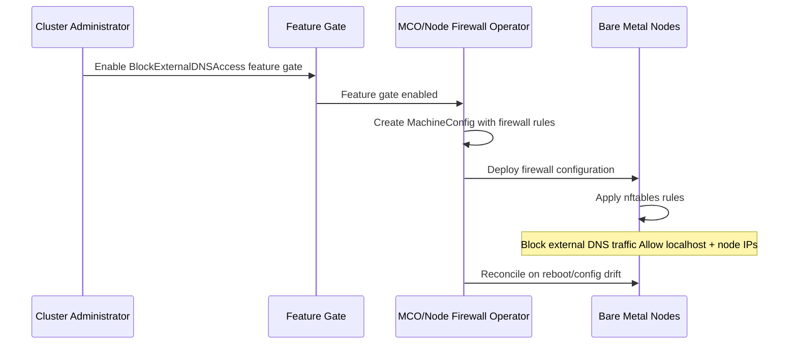

# Block External Access to CoreDNS

## Summary

This enhancement proposes to block external access to CoreDNS instances
running on bare metal OpenShift cluster nodes. On bare metal deployments,
CoreDNS runs on the host network namespace to provide DNS resolution for
the host operating system. These instances can be exposed to external
networks depending on the network topology and firewall configuration. The
feature follows a secure-by-default approach: when the
BlockExternalDNSAccess feature gate is enabled, external access is
automatically blocked unless explicitly allowed.

This enhancement is **specific to bare metal nodes** and does NOT involve
the cluster DNS Operator. It explores two implementation
approaches:
1. **Node-level firewall rules** using the Node Firewall Operator or
   MachineConfig
2. **CoreDNS ACL plugin** to reject queries from external sources at the
   application level via CoreDNS configuration

This security hardening measure prevents unauthorized external entities
from querying on-prem DNS, mitigates DNS amplification/reflection attacks,
and reduces the risk of data exfiltration through DNS reconnaissance.

## Motivation

On **bare metal OpenShift deployments**, CoreDNS instances run on each
node in the host network namespace to provide DNS resolution for the host
operating system and node-level services. Unlike cloud deployments where
network access is typically restricted by cloud provider security groups,
bare metal nodes may have direct network exposure. These on-prem CoreDNS
instances listen on the node's network interfaces (typically port 53
UDP/TCP). Depending on the network topology and firewall configuration,
these CoreDNS instances may be accessible from external networks outside
the cluster.

**This creates the following risks:**

    Unauthorized reconnaissance: External actors can query on-prem DNS
    to discover internal host names, services, and network topology

    DNS amplification attacks: CoreDNS can be exploited as a vector for
    DDoS attacks by sending spoofed DNS queries that generate larger
    responses

    Data exfiltration: Sensitive infrastructure information can leak
    through DNS query responses to external parties

    Compliance violations: Many security frameworks and regulatory
    requirements mandate that internal DNS servers should not be
    accessible from external networks

    Host compromise: Vulnerabilities in CoreDNS could be exploited by
    external attackers if the service is exposed

### User Stories

* As a **cluster administrator**, I want to prevent external access to the
  on-prem CoreDNS instances running on my cluster nodes so that I can
  reduce the attack surface of my OpenShift cluster and comply with
  security policies that require DNS isolation.

* As a **security engineer**, I want to ensure that DNS queries to the
  on-prem CoreDNS instances can only originate from within the cluster
  nodes or internal networks so that I can prevent DNS-based reconnaissance
  and amplification attacks targeting my infrastructure.

* As a **platform team member** managing multi-tenant OpenShift
  environments, I want to enforce DNS access control for on-prem
  CoreDNS at the platform level so that I can provide security hardening by
  default without requiring individual tenant or node-level configuration.

* As a **cluster administrator**, I want the system to be monitored and
  remediated at scale so that any configuration drift or firewall rule
  violations related to on-prem CoreDNS access control are
  automatically detected and corrected.

### Goals

* Provide secure-by-default protection for **bare metal deployments**:
  block external access to on-prem CoreDNS instances running on bare metal
  nodes automatically when the feature gate is enabled
* Prevent external entities from querying on-prem CoreDNS instances on
  bare metal nodes by default
* Provide security hardening against DNS-based attacks (amplification,
  reflection, reconnaissance) targeting host-level CoreDNS on bare metal
  infrastructure
* Reduce the risk of data exfiltration through DNS queries to on-prem
  CoreDNS on bare metal nodes
* Ensure DNS queries to on-prem CoreDNS can only originate from localhost
  or other cluster nodes (unless explicitly allowed)
* Determine how to make this configurable (if needed) to allow external
  access when required (e.g., for monitoring) without involving the DNS
  Operator
* Determine the most appropriate implementation approach (node firewall vs
  CoreDNS ACL) based on operational considerations, performance, and
  maintainability for bare metal deployments

### Non-Goals

* Blocking access to the cluster DNS service (the in-cluster CoreDNS pods
  used by workloads managed by the DNS Operator) - this enhancement
  specifically targets on-prem CoreDNS running on bare metal host network
* Modifying the DNS Operator or its CRDs - this enhancement does not
  involve the cluster DNS Operator
* Applying to cloud deployments (AWS, Azure, GCP, etc.) - this enhancement
  is specific to bare metal infrastructure
* Blocking DNS queries between bare metal nodes within the cluster
* Implementing DNS query rate limiting or throttling
* Replacing or removing on-prem CoreDNS from bare metal nodes

## Proposal

This enhancement proposes to block external access to CoreDNS running on
bare metal nodes by default. When the BlockExternalDNSAccess feature gate
is enabled (initially DevPreviewNoUpgrade), external access is blocked by
default. This provides a secure-by-default approach that requires
administrators to explicitly opt-in to allow external access if needed for
specific use cases (e.g., external monitoring).

Since on-prem CoreDNS runs on the host network namespace on bare metal
nodes (not as pods in the cluster), Kubernetes NetworkPolicies cannot be
used to restrict access. Additionally, this enhancement does NOT involve
the cluster DNS Operator, as the DNS Operator manages the in-cluster
CoreDNS service used by workloads, not the on-prem CoreDNS on bare metal
nodes.

This enhancement explores two viable implementation approaches for bare
metal deployments:

### Approach 1: Node-Level Firewall Rules

Use node-level firewall mechanisms (nftables) to block external
access to the CoreDNS service port (typically UDP/TCP 53) on each bare
metal node. This could be implemented via:

- **Node Firewall Operator**: Leverage existing Node Firewall Operator
  (if available) to deploy and manage firewall rules across all
  bare metal nodes
- **Machine Config Operator (MCO)**: Use MCO to configure firewall rules
  via MachineConfig resources targeting bare metal machine pools

**Pros**:
- Blocks traffic at the network layer before it reaches CoreDNS (defense
  in depth)
- Works regardless of CoreDNS configuration or plugins
- Provides OS-level enforcement that's harder to bypass
- Can be applied consistently across all nodes

**Cons**:
- Requires managing firewall state on every node
- More complex to implement and maintain across different node OS versions
- Potential conflicts with other firewall rules managed by different
  operators
- Harder to debug when issues occur (need to check firewall state on
  nodes)
- Node Firewall Operator may not be available in all environments

### Approach 2: CoreDNS ACL Plugin

Configure on-prem CoreDNS with an ACL (Access Control List) plugin or
similar mechanism to reject DNS queries from external sources based on
source IP addresses.

**Pros**:
- Application-level control that's easier to reason about
- Centrally managed through CoreDNS configuration
- No dependency on node-level firewall mechanisms
- Easier to debug (CoreDNS logs show rejected queries)
- More portable across different platforms and OS versions

**Cons**:
- Traffic still reaches CoreDNS process (not blocked at network layer)
- Performance overhead of checking ACLs for every DNS query
- Requires modifying CoreDNS configuration which adds complexity
- ACL configuration needs to be maintained and synchronized with cluster
  network changes
- Potential vulnerabilities in CoreDNS could be exploited before ACL check

### Proposed Implementation Path

This enhancement proposes starting with **Approach 1 (Node-Level Firewall
Rules)** as the initial implementation, with the following high-level
steps:

1. Create MachineConfig resources (or NodeFirewallConfiguration resources
   if using Node Firewall Operator) that deploy firewall rules to bare
   metal nodes
2. Firewall rules will:
   - Allow DNS queries from localhost (127.0.0.1, ::1)
   - Allow DNS queries from other cluster nodes (node IPs within cluster
     CIDR)
   - Deny all other DNS queries from external sources
3. Apply these configurations via one of the following methods:
   - MCO MachineConfig targeting bare metal machine pools
   - Node Firewall Operator NodeFirewallConfiguration resources
4. Configuration will be enabled when the BlockExternalDNSAccess feature
   gate is enabled

**Open Questions**:
1. The exact mechanism for deploying firewall rules (Node Firewall
   Operator vs MCO) needs to be determined based on:
   - Availability and maturity of Node Firewall Operator
   - Complexity and maintainability of each approach
   - Performance impact and resource overhead
   - Compatibility with RHCOS and different node operating systems

2. How to make this configurable if administrators need to allow external
   access? Options:
   - Feature gate controls default behavior only (no per-cluster config)
   - Introduce a new CR/ConfigMap separate from DNS Operator
   - Use cluster-level annotations or labels
   - MCO-based configuration override mechanism

Alternative Approach 2 (CoreDNS ACL) remains a viable fallback if
node-level firewall management proves too complex or problematic.

### Workflow Description

**cluster administrator** is a user responsible for managing cluster
security and configuration.

**Bare metal node** is an OpenShift cluster node running CoreDNS on the
host network for host-level DNS resolution.

**MCO (Machine Config Operator)** or **Node Firewall Operator** is the
component responsible for deploying and enforcing firewall rules on bare
metal nodes.

#### Workflow: Enabling External Access Blocking (Default Secure Behavior)

1. The cluster administrator enables the DevPreviewNoUpgrade feature set
   on the cluster to activate the BlockExternalDNSAccess feature gate.

2. When the feature gate is enabled, the system automatically applies the
   secure-by-default behavior. A MachineConfig (or
   NodeFirewallConfiguration) is deployed that configures firewall rules
   on bare metal nodes to block external access to on-prem CoreDNS.

3. The MCO (or Node Firewall Operator) deploys the firewall configuration
   to all bare metal nodes.

4. Firewall rules are applied on each bare metal node that:
   - Allow DNS traffic (UDP/TCP port 53) from localhost (127.0.0.1, ::1)
   - Allow DNS traffic (UDP/TCP port 53) from other cluster node IPs
     (within cluster node CIDR)
   - Deny all other DNS traffic from external sources to port 53

5. The firewall mechanism (nftables) on each node
   enforces the rules.

6. Any DNS queries to on-prem CoreDNS from external sources are blocked by
   the node firewall, while internal node-to-node and localhost DNS
   queries continue to work normally.

7. If a bare metal node is rebooted, the MCO ensures the firewall
   configuration persists and is reapplied.

#### Variation: Allowing External Access

If a cluster administrator needs to allow external access to on-prem
CoreDNS on bare metal nodes (e.g., for external monitoring systems or
specific network requirements):

**Option 1: Disable the feature gate** (if external access is needed
cluster-wide):
1. The administrator disables the BlockExternalDNSAccess feature gate
2. The MachineConfig with firewall rules is removed
3. On-prem CoreDNS becomes accessible from external networks

**Option 2: Override via custom configuration** (if per-cluster control is
implemented):
1. The administrator creates a custom configuration resource (exact
   mechanism TBD - see Open Questions) that overrides the default blocking
   behavior
2. The MCO/Node Firewall Operator removes firewall rules based on the
   override configuration
3. On-prem CoreDNS becomes accessible from external networks (subject to
   other network controls like hardware firewalls, network ACLs, etc.)

**Note**: The exact mechanism for per-cluster configuration override is an
open question that needs to be resolved during implementation design.

### API Extensions

This enhancement proposes a new API field.
The implementation is controlled by a new
BlockExternalDNSAccess feature gate and deployed 
with one of the following methods:

- **MachineConfig resources** (if using MCO approach)
- **NodeFirewallConfiguration resources** (if using Node Firewall Operator
  approach)

**Open Question**: If per-cluster configuration is needed (to allow
administrators to override the default blocking behavior without disabling
the feature gate entirely), the new API field is required. Options include:
1. A new CRD specifically for on-prem CoreDNS access control (e.g.,
   `BaremetalDNSAccessPolicy`)
2. A field in an existing CRD like DNS
3. A ConfigMap-based configuration
4. Annotations on MachineConfigPool resources

### Topology Considerations

This enhancement is **specific to bare metal OpenShift deployments** where
CoreDNS runs on the host network namespace for node-level DNS resolution.

#### Hypershift / Hosted Control Planes

**Not Applicable**: Hypershift deployments typically run on cloud
infrastructure (AWS, Azure, GCP) where network security is managed via
cloud provider security groups and network ACLs. On-prem CoreDNS on host
network is not a typical deployment pattern for Hypershift.

If Hypershift is deployed on bare metal infrastructure, the same firewall
rules would apply to the bare metal worker nodes in the hosted cluster.

#### Standalone Clusters

**Applicable to bare metal standalone clusters only**: This enhancement
applies to standalone OpenShift clusters deployed on bare metal
infrastructure where nodes run CoreDNS on the host network for host-level
DNS resolution.

#### Single-node Deployments or MicroShift

**Single-Node OpenShift (SNO) on bare metal**: If SNO is deployed on bare
metal infrastructure, this enhancement applies and provides security
hardening for the on-prem CoreDNS instance running on the single node.

**MicroShift**: DNS architecture in MicroShift may differ from standard
OpenShift. Applicability needs to be validated based on whether MicroShift
runs CoreDNS on the host network namespace.

#### OpenShift Kubernetes Engine

**OKE on bare metal only**: This enhancement applies to OKE deployments
only if they are running on bare metal infrastructure. Cloud-based OKE
deployments use cloud provider network security controls.

### Implementation Details/Notes/Constraints

The implementation requires the following components and changes:

1. **Feature gate creation**: A new feature gate `BlockExternalDNSAccess`
   must be added to https://github.com/openshift/api/blob/master/features/
   features.go with:
   - Initial feature set: DevPreviewNoUpgrade
   - Jira component: Networking / DNS (or potentially Baremetal)
   - Contact person (bnemec)

2. **Implementation approach** (one of the following):

   **Option A: Machine Config Operator (MCO) approach**:
   - Create MachineConfig resources that deploy firewall rules to bare
     metal nodes
   - MachineConfig will configure nftables rules directly
   - Target bare metal machine pools specifically
   - Firewall rules will:
     - Allow DNS (UDP/TCP port 53) from localhost (127.0.0.1, ::1)
     - Allow DNS from other cluster node IPs (determine dynamically or via
       static CIDR configuration)
     - Deny all other DNS traffic to port 53

   **Option B: Node Firewall Operator approach (if available)**:
   - Create NodeFirewallConfiguration resources
   - Leverage Node Firewall Operator to manage firewall rules
   - Simpler declarative API compared to MachineConfig
   - Requires Node Firewall Operator to be available and mature

3. **Configuration mechanism** (if per-cluster override is needed):
   - Determine how administrators can override the default blocking
     behavior
   - Options: new CRD, ConfigMap, annotations, or feature gate
     disable-only
   - See Open Questions for decision points

**Constraints and considerations**:

- This feature applies **only to bare metal deployments**. Cloud
  deployments (AWS, Azure, GCP, etc.) are excluded.
- The implementation must correctly identify cluster node IPs to allow
  inter-node DNS queries while blocking external access.
- Firewall rules must persist across node reboots.
- MCO-managed configurations may cause node reboots when applied, which
  needs to be documented.
- The exact firewall mechanism (nftables) may
  depend on the RHCOS version and node configuration.
- Node Firewall Operator availability and maturity needs to be validated
  for target OpenShift versions.

### Risks and Mitigations

**Risk**: Enabling the feature gate automatically blocks external access by
default, which could disrupt existing workflows or external monitoring
systems that rely on querying on-prem CoreDNS from outside the cluster.

**Mitigation**:
- Comprehensive documentation warning administrators about the
  secure-by-default behavior when enabling the feature gate
- Provide clear instructions on how to disable the feature gate or apply
  override configuration (if available) if external access is required
- Start with DevPreviewNoUpgrade to gather feedback from early adopters
  about any disruption scenarios
- Include prominent warnings in release notes and feature gate
  documentation

**Risk**: Firewall rules may inadvertently block legitimate DNS traffic if
cluster node IP ranges are incorrectly identified or if there are edge
cases in network topology or node IP address changes.

**Mitigation**: Extensive testing across different bare metal network
configurations (IPv4, IPv6, dual stack). Provide clear documentation on how
to verify firewall rules are working correctly and how to debug DNS access
issues. Include instructions on checking firewall rules via SSH to nodes.
Start with DevPreviewNoUpgrade to gather feedback before promoting to Tech
Preview or GA.

**Risk**: Firewall rule deployment via MachineConfig may cause node reboots
on bare metal nodes, potentially disrupting workloads during initial
deployment or configuration changes.

**Mitigation**: Document the potential for node reboots clearly. Provide
guidance on using maintenance windows when enabling the feature gate.
Consider using Node Firewall Operator (if available) which may avoid node
reboots for firewall rule changes.

**Risk**: Changes to cluster node IP addresses during cluster lifecycle
(e.g., node replacement, network reconfiguration) may cause firewall rules
to become outdated, blocking legitimate inter-node DNS traffic.

**Mitigation**: The MCO or Node Firewall Operator should reconcile firewall
rules when node network configuration changes. Provide monitoring and
alerting to detect when inter-node DNS queries are blocked. Document
troubleshooting procedures for verifying and updating node IP allowlists in
firewall rules.

**Risk**: External monitoring or health check systems that need to query
on-prem CoreDNS will be blocked by default when the feature gate is
enabled.

**Mitigation**: Document this limitation clearly and prominently. Provide
guidance on alternative approaches for external monitoring (e.g.,
monitoring through cluster API or using internal monitoring agents). Make
it easy to disable the feature gate or apply override configuration for
clusters that require external access. Consider adding configuration to
allow specific external IPs if needed in future iterations.

### Drawbacks

- The secure-by-default approach means that enabling the feature gate will
  immediately block external access, which could disrupt existing workflows
  or external monitoring systems that rely on querying on-prem CoreDNS
  from outside the cluster without warning
- This feature adds complexity to bare metal node configuration management
  with additional logic for managing node-level firewall rules or CoreDNS
  configuration
- Node-level firewall rules introduce additional complexity in node
  configuration management and potential conflicts with other operators
  managing firewall state
- Organizations with external DNS monitoring or testing tools will need to
  disable the feature gate or apply override configuration to maintain
  their existing workflows
- The implementation approach (node firewall vs CoreDNS ACL) has trade-offs
  and requires careful evaluation before finalizing the design
- Debugging firewall-related issues on nodes requires SSH access and
  knowledge of node-level firewall mechanisms (nftables), which is more
  complex than debugging Kubernetes-native resources
- MachineConfig deployment may cause node reboots, impacting workload
  availability during initial feature enablement

## Alternatives (Not Implemented)

### Alternative 1: Use NetworkPolicies

Use Kubernetes NetworkPolicies to block external access to CoreDNS.

**Pros**:
- Kubernetes-native approach
- Declarative resource management
- Well-understood by cluster administrators
- No node-level changes required

**Cons**:
- **Does not work for on-prem CoreDNS**: NetworkPolicies apply to pod
  traffic only, not to processes running on the host network namespace.
  Since on-prem CoreDNS runs on the host network, NetworkPolicies
  cannot be used to restrict access to it.
- Would only work if targeting the in-cluster CoreDNS pods (not the scope
  of this enhancement)

**Reason not selected**: This alternative does not apply to on-prem
CoreDNS running on the host network. NetworkPolicies only control traffic
to pods, not to host-network services.

### Alternative 2: Do Not Expose On-Premises CoreDNS Externally

Simply document that on-prem CoreDNS should not be exposed externally
and leave it to cluster administrators to ensure proper network
configuration (e.g., via cloud security groups, hardware firewalls).

**Pros**:
- No code changes required in OpenShift
- Maximum flexibility for administrators
- Leverages existing infrastructure security controls

**Cons**:
- Relies on manual configuration which is error-prone
- Does not provide defense-in-depth at the cluster level
- No enforcement mechanism within OpenShift
- Inconsistent security posture across different deployment environments

**Reason not selected**: This enhancement provides defense-in-depth and
enforces security best practices by default at the OpenShift cluster level,
reducing the risk of misconfiguration and providing consistent security
across all deployment environments.

## Open Questions

1. Which implementation approach should we use?
   - **Option A**: Node-level firewall rules (Node Firewall Operator, MCO,
     or direct nftables management)
   - **Option B**: CoreDNS ACL plugin configuration
   - Decision criteria: availability of Node Firewall Operator, complexity,
     maintainability, performance, security depth, platform compatibility
   - **Recommendation needed** to finalize the approach

2. If using node-level firewall rules, which mechanism should deploy them?
   - Node Firewall Operator (if available and mature)
   - Machine Config Operator (MachineConfig resources)
   - Direct management by DNS operator (most complex, least desirable)

3. Should we provide configuration to allow specific external IP ranges
   (e.g., for monitoring systems) in addition to the "Allow" and "Deny"
   options?

4. Should we add observability metrics to track blocked DNS queries from
   external sources? (This may be more feasible with CoreDNS ACL than with
   firewall rules)

5. For future iterations, should we consider DNS query rate limiting as
   an additional security layer?

6. Is the secure-by-default approach (blocking external access when the
   feature gate is enabled) the right choice, or should administrators be
   required to explicitly opt-in to blocking? The current design prioritizes
   security but may cause disruption for clusters with external dependencies
   on on-prem CoreDNS.

## Test Plan

The test plan will include:

1. **Unit tests**:
   - Logic for creating/updating/deleting MachineConfig or
     NodeFirewallConfiguration resources
   - Feature gate detection and handling
   - Firewall rule generation logic

2. **Integration tests**:
   - Verify firewall rules are deployed when the feature gate is enabled
   - Verify firewall rules are removed when the feature gate is disabled
   - Verify firewall rules allow localhost DNS traffic
   - Verify firewall rules allow inter-node DNS traffic
   - Verify firewall rules block external DNS traffic

3. **E2E tests** (in openshift/origin or openshift-tests-extension):
   - All tests must include the following labels:
     - `[OCPFeatureGate:BlockExternalDNSAccess]` - feature gate label
     - `[Jira:"Networking / DNS"]` or `[Jira:"Baremetal"]` - component
       label
     - `[Suite:openshift/baremetal]` - test suite label (if applicable)
     - Additional labels as needed: `[Serial]`, `[Slow]`, `[Disruptive]`
   - Test that localhost can resolve DNS after enabling the feature
   - Test that nodes can query each other's CoreDNS after enabling the
     feature
   - Test that external entities cannot query on-prem CoreDNS (requires
     test infrastructure to simulate external access)
   - Test on bare metal platforms only
   - Test upgrade scenarios where the feature is enabled before upgrade
   - Test that MachineConfig or NodeFirewallConfiguration is correctly
     applied and persists across node reboots

For detailed test labeling conventions, see dev-guide/test-conventions.md.

## Graduation Criteria

This enhancement follows the standard OpenShift feature graduation path:
DevPreviewNoUpgrade -> TechPreviewNoUpgrade -> Default (GA).

### Dev Preview -> Tech Preview

**Testing**:
- Minimum 5 e2e tests implemented in openshift/origin with
  `[OCPFeatureGate:BlockExternalDNSAccess]` label covering:
  - Internal DNS resolution continues to work with feature enabled
    (default secure behavior)
  - External DNS queries are blocked when `externalAccessPolicy` is
    empty/unset or set to "Deny"
  - External DNS queries succeed when `externalAccessPolicy` is set to
    "Allow"
  - Upgrade scenario with feature enabled

**Documentation**:
- End user documentation explaining:
  - The secure-by-default behavior when feature gate is enabled
  - How to explicitly allow external access using `externalAccessPolicy:
    Allow`
  - Limitations and CNI plugin requirements
  - How to verify the feature is working correctly
  - Troubleshooting steps
- Enhancement proposal updated with implementation details and lessons
  learned from Dev Preview

**Operational Requirements**:
- No major bugs or regressions reported in Dev Preview

**Feedback**:
- Gathered feedback from at least 3 early adopter bare metal clusters
- Documented any workflows that were disrupted by the secure-by-default
  behavior
- Validated that disabling the feature gate or override configuration
  successfully addresses use cases requiring external access

**API Stability** (if applicable):
- Any new API field/CRD is stable and no breaking changes are anticipated
- API has been reviewed and approved by API reviewers (if new API is
  introduced)

### Tech Preview -> GA

**Testing Requirements** (per dev-guide/feature-zero-to-hero.md):

- **Test quantity**: Minimum 5 tests with
  `[OCPFeatureGate:BlockExternalDNSAccess]` label
- **Test frequency**: All tests run at least 7 times per week
- **Platform coverage**: All tests run at least 14 times on each supported
  **bare metal platform**:
  - Baremetal (HA, amd64, IPv4)
  - Baremetal (HA, amd64, IPv6 - disconnected)
  - Baremetal (HA, amd64, Dual stack)
  - Baremetal (Single-node/SNO, amd64) if applicable
- **Pass rate**: 95% or higher pass rate across all test runs
- **Test duration**: Tests have been running for at least 14 days before
  branch cut
- **Test variants**: Tests run in both `TechPreviewNoUpgrade` and `Default`
  job variants (skipped in Default until promoted)
- **Note**: This feature is bare metal only, so tests will only run on bare
  metal platforms

**Comprehensive Testing**:
- Upgrade testing:
  - Upgrade from version without feature to version with feature on bare
    metal (validates no disruption when feature gate is disabled)
  - Upgrade with feature gate enabled (validates firewall rules persist
    and external access remains blocked)
  - Upgrade with feature gate enabled and override configuration allowing
    external access (if applicable)
- Downgrade testing:
  - Downgrade with feature enabled on bare metal
  - Documentation for manual cleanup steps if needed (removing
    MachineConfig or NodeFirewallConfiguration)
- Node reboot testing:
  - Verify firewall rules persist across node reboots
  - Verify MCO reapplies configuration after reboot
- Scale testing:
  - Feature works correctly when nodes are added/removed from cluster
  - Firewall rules are correctly applied to new bare metal nodes

**Documentation**:
- User-facing documentation in openshift-docs including:
  - Configuration guide for bare metal deployments
  - Security implications and best practices
  - Troubleshooting guide (how to check firewall rules on nodes)
  - Migration guide for bare metal clusters with external DNS dependencies
- Release notes documenting the secure-by-default behavior for bare metal
- Bare metal platform requirements clearly documented

**Operational Maturity**:
- Optionally: metrics for blocked external DNS queries (if feasible)
- Performance validation:
  - DNS query latency impact measured on bare metal nodes (should be
    negligible)
  - Firewall rule performance impact measured

**User Feedback**:
- Positive feedback from Tech Preview users on bare metal
- No major usability issues reported
- Documented common use cases and their solutions for bare metal
- Validation that the secure-by-default approach is acceptable to bare
  metal users

**Security and API Review**:
- Security review completed and signed off
- API review completed and approved (if new API is introduced)
- Confirmation that the feature provides meaningful security hardening for
  bare metal deployments

**Platform Compatibility**:
- Feature works correctly on all supported bare metal configurations:
  - IPv4, IPv6, and Dual stack networking
  - HA and SNO topologies
- Feature tested on bare metal platforms only (not applicable to cloud
  deployments)

**Production Readiness**:
- No critical or high-severity bugs open
- Support procedures documented and validated
- Runbooks created for common support scenarios
- Monitoring and alerting validated in production-like environments

## Upgrade / Downgrade Strategy

**Upgrades**:

When upgrading from a version without this feature to a version with this
feature on bare metal:
- The feature gate will be disabled by default (Dev Preview)
- Existing bare metal clusters will see no change in DNS behavior unless
  administrators explicitly enable the BlockExternalDNSAccess feature gate
- **IMPORTANT**: Once the feature gate is enabled, the secure-by-default
  behavior activates immediately. External access to on-prem CoreDNS on
  bare metal nodes will be blocked automatically via firewall rules
- Administrators who need external CoreDNS access must proactively disable
  the feature gate or apply override configuration (if available) before
  or immediately after enabling to avoid service disruption
- MachineConfig deployment may cause node reboots on bare metal nodes

When upgrading with the feature already enabled:
- Firewall rules will persist during the upgrade
- The feature should remain functional during the upgrade
- The secure-by-default behavior persists across upgrades
- MachineConfig or NodeFirewallConfiguration resources are reconciled by
  MCO/Node Firewall Operator

**Downgrades**:

When downgrading from a version with this feature to a version without it
on bare metal:
- MachineConfig or NodeFirewallConfiguration resources may remain in the
  cluster
- Firewall rules may persist on nodes even after downgrade
- Documentation will include steps to manually clean up:
  - Remove MachineConfig resources related to this feature
  - Remove NodeFirewallConfiguration resources (if applicable)
  - Optionally manually remove firewall rules from nodes

## Version Skew Strategy

This feature is implemented via MachineConfig or NodeFirewallConfiguration
resources and does not have significant version skew concerns:

During an upgrade on bare metal:
- MachineConfig resources are managed by MCO, which handles version skew
- NodeFirewallConfiguration resources are managed by Node Firewall
  Operator
- Firewall rules are applied at the node level and persist regardless of
  cluster component versions
- On-prem CoreDNS does not need to be aware of this feature

If nodes are upgraded at different times:
- Each node's firewall rules are managed independently by MCO or Node
  Firewall Operator
- Nodes at different versions can coexist - each enforces its own firewall
  rules
- No coordination required between nodes for this feature

If MCO or Node Firewall Operator is upgraded:
- Existing firewall rules persist on nodes
- The upgraded operator continues to reconcile the MachineConfig or
  NodeFirewallConfiguration resources
- No disruption to DNS access control during operator upgrades

## Operational Aspects of API Extensions

This enhancement may introduce a new API (TBD - see Open Questions) for
per-cluster configuration override, or it may be controlled solely by the
BlockExternalDNSAccess feature gate with no new APIs.

If a new API is introduced (e.g., a new CRD like
`BaremetalDNSAccessPolicy`):

**SLIs for monitoring**:
- Standard Kubernetes API availability metrics apply
- No specific operator health conditions are introduced (this is managed
  by MCO or Node Firewall Operator)

**Impact on existing SLIs**:
- Minimal impact - new API would be infrequently updated (typically once
  per cluster, if at all)
- No impact on pod scheduling or other cluster operations
- MachineConfig deployment may cause node reboots (standard MCO behavior)
- DNS query performance should not be impacted (firewall rules are
  evaluated at kernel level with minimal overhead)

**Measurement**:
- Performance testing will be conducted during Tech Preview to measure any
  DNS query latency impact on bare metal nodes
- Testing will be performed by the networking or bare metal QE team

**Failure modes**:
- **MachineConfig application fails**: MCO will report degraded status.
  Firewall rules may not be applied to some nodes. DNS resolution
  continues to work normally, but external access may not be blocked on
  affected nodes.
- **Firewall rules incorrectly block inter-node traffic**: Nodes may be
  unable to query each other's CoreDNS. Requires fixing firewall rule
  configuration (node IP allowlist).
- **Feature gate enabled on non-bare-metal cluster**: No effect - feature
  only applies to bare metal. No harm done.

**Impact on cluster health**:
- Firewall rule failures do not impact DNS resolution functionality
- Cluster operations continue normally even if this feature fails
- No impact on kube-controller-manager or other core components
- Node reboots may occur when MachineConfig is first applied (standard MCO
  behavior)

**Teams involved in escalations**:
- Primary: Networking team or Bare Metal team
- Secondary: MCO team (if using MachineConfig approach) or Node Firewall
  team (if using Node Firewall Operator)

## Support Procedures

**Detecting failure modes**:

1. **Feature gate is enabled but firewall rules are not applied**:
   - Symptom: External DNS queries to on-prem CoreDNS on bare metal nodes
     succeed even though the feature gate is enabled
   - Check if MachineConfig exists: `oc get machineconfig | grep dns` or
     `oc get nodefirewallconfiguration`
   - Check MCO status: `oc get mcp` and examine status of bare metal
     machine config pools
   - SSH to a bare metal node and check firewall rules:
     - `sudo nft list ruleset | grep 53`
   - Check MCO logs: `oc logs -n openshift-machine-config-operator
     deployment/machine-config-operator`

2. **Nodes cannot query each other's CoreDNS after enabling feature**:
   - Symptom: Inter-node communication fails, nodes cannot resolve names
     via other nodes' CoreDNS
   - SSH to a node and check firewall rules to verify cluster node IPs are
     in the allowlist
   - Verify the firewall rule configuration includes correct node IP ranges
   - Check if node IPs have changed (e.g., after node replacement)

3. **Localhost DNS resolution fails after enabling feature gate**:
   - Symptom: Services on the node itself cannot resolve DNS
   - SSH to the node and check if localhost (127.0.0.1, ::1) is allowed in
     firewall rules
   - Verify firewall rules: `sudo nft list ruleset | grep 127.0.0.1`

4. **External monitoring stops working after enabling feature gate**:
   - Symptom: External monitoring systems can no longer query on-prem
     CoreDNS on bare metal nodes after enabling the BlockExternalDNSAccess
     feature gate
   - This is expected behavior due to secure-by-default
   - Solution: Disable the feature gate or apply override configuration (if
     available)

**Allowing external access**:

To allow external access to on-prem CoreDNS (disabling the default
blocking):
1. **Option 1**: Disable the BlockExternalDNSAccess feature gate entirely
   - This removes the MachineConfig/NodeFirewallConfiguration
   - External access will be allowed cluster-wide
2. **Option 2**: Apply override configuration (if available - see Open
   Questions)
   - Create the appropriate configuration resource to override the default
   - This may allow per-cluster customization
3. Verify firewall rules are removed from nodes:
   - SSH to a node and check: `sudo nft list ruleset | grep 53`
4. External DNS queries should now succeed

**Consequences of allowing external access**:
- External entities can query on-prem CoreDNS on bare metal nodes (if
  network topology permits)
- Security posture is reduced - on-prem DNS becomes accessible from
  outside the cluster
- Increased risk of DNS-based reconnaissance and amplification attacks
  targeting bare metal infrastructure
- No impact on existing workloads or cluster health
- No data loss or configuration loss

**Graceful failure and recovery**:
- If MCO or Node Firewall Operator crashes, firewall rules remain in place
  on nodes (enforced by kernel)
- When MCO or Node Firewall Operator restarts, it will reconcile and
  reapply any missing/incorrect firewall rules
- If firewall rules are manually removed from a node, MCO will reapply
  them on next reconciliation (or on node reboot)
- DNS resolution functionality is never impacted by this feature's failure
  - even if firewall rules fail to apply, localhost and inter-node DNS
  continue to work

## Infrastructure Needed

No additional infrastructure is required for this enhancement. Testing will
leverage existing OpenShift CI infrastructure and e2e test frameworks.
