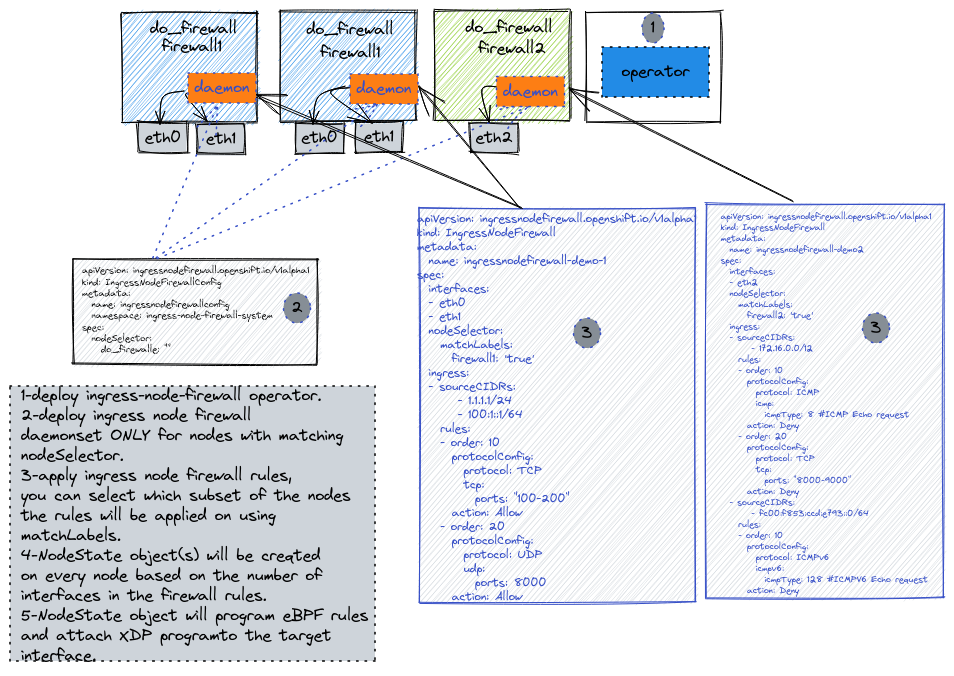
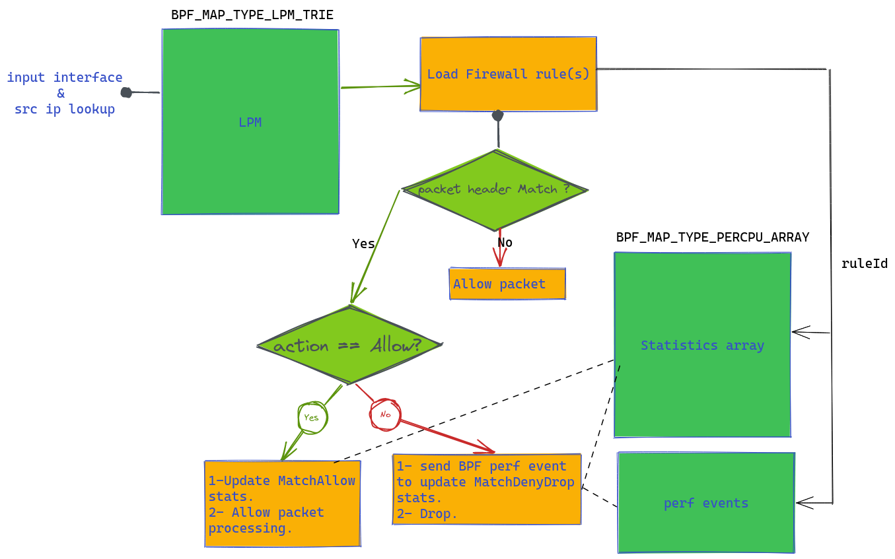

# Ingress node Firewall using eBPF

## Release Signoff Checklist

- [ ] Enhancement is `implementable`
- [ ] Design details are appropriately documented from clear requirements
- [ ] Test plan is defined
- [ ] Operational readiness criteria is defined
- [ ] Graduation criteria for dev preview, tech preview, GA
- [ ] User-facing documentation is created in [openshift-docs](https://github.com/openshift/openshift-docs/)

## Summary

OCP customers would like to secure OCP's nodes from external attacks by configuring ingress firewall policies.
eBPF provides a very flexible filtering mechanism to allow early detection and filtering.
eXpress Data Path (XDP) is a feature in the Linux kernel which allows users to execute a user-supplied eBPF program when a packet is received on a network interface (NIC). 
This program is executed in the NIC’s device driver, right after the interrupt processing and before the network stack. 
The goal of XDP is to offer comparable performance to kernel bypass solutions while working with the existing kernel networking stack.
A new cluster-scoped object `IngressNodeFirewall` will be used to configure node ingress firewall match rules and per rule statistics will be available.
Admin can provision multiple instances of this object while ensuring certain execution order.
For the best performance XDP programs need to attach to interfaces using the following models:
- Native XDP \
  The XDP program is loaded by the network card driver as part of its initial receive path. This also requires support from the network card driver.
- Offloaded XDP \
  The XDP program loads directly on the NIC, and executes without using the CPU. This also requires support from the network interface device.
For NICs drivers that doesn't support native XDP performance will degrade while still be better that using linux iptables tools.
  
## Motivation

Customers would like to secure OCP cluster from external attacks.

### Goals

- Flexible match filter rules for customers to use with a CRD validation to detect and reject invalid configuration.
- Provide a mechanism for customers to select which nodes via `nodeSelector`.
- Provide a mechanism to define attachment interfaces for the node ingress firewall objects.  
- Ingress node firewall is deployed on a fully operational OCP cluster (i.e. Ingress node firewall is deployed as a day 2 operation and is not enabled by default at the cluster install time).
- fail-safe in case of user provisioned invalid rules which can lockup cluster operation.

### Non-Goals
- Stateful support
- Flood Attacks

## Proposal

- customers will label nodes where ingress node policy will be deployed on.
- customers will deploy daemonSet controller on all the selected nodes by applying `IngressNodeFirewallConfig` object. 
- customers will prepare `IngressNodeFirewall` objects with all required firewall rules and interfaces the ebpf program will be attached to.
- IngressNodeFW controller will process `IngressNodeFirewall` objects, verification webhook will make sure configuration doesn't contradict with fail-safe rules.
- Ingress node firewall daemon will watch ingress node firewall objects and create `nodeState` object which contains all rules objects that is applied to specific node then load eBPF map table and attach eBPF kernel hook loaded as `BPF_PROG_TYPE_XDP` to the list of interfaces configured in the object.
- in order to fail-safe and avoid cluster lockup, validation webhook will be used to prevent adding rules to deny cluster's critical protocol and ports.

### Workflow Description

- the following diagram shows how node ingress firewall configuration is handled



- the following diagram explains how Ingress node firewall's XDP program will process the incoming packets, showing the involved eBPF tables "maps"



- the following table shows sample of fail-safe rules to make sure users won't block basic cluster services by configuring invalid firewall rules

| Source CIDR | Protocol | Port | Purpose |
|-------------|----------|------|---------|
|  0.0.0.0/0  |   TCP    |  22  |  SSH    |
|  0.0.0.0/0  |   UDP    |  68  | DHCP    |
|  0.0.0.0/0  |   TCP    | 6443 | Kubernetes API server access |
|  0.0.0.0/0  |   TCP    | 2380 & 2379 | Etcd access |

### Implementation Details/Notes/Constraints

A new downstream OLM operator (openshift/ingress-nodefw-operator) will be designed to do the following:
- Create Ingress node firewall config object to deploy daemonSet.
- Create the CRDs for the new object.
- controller for each of the new resources to handle add/update/delete
- verification webhook to validate the configuration and enforce failSafe rules.
- library to construct and load eBPF ingress maps tables based on the provisioned rules.
- library for statistics collection and exporting to prometheus.
- library for bpf perf event reporting.
- library for FailSafe rules handling.
- library to sync eBPF rules and update rules in eBPF maps.

New downstream repo for the kernel hook implementation (openshift/ingress-node-firewall)
- sample `IngressNodeConfig` object
  
```yaml
apiVersion: ingressnodefirewall.openshift.io/v1alpha1
kind: IngressNodeFirewallConfig
metadata:
  name: ingressnodefirewallconfig
  namespace: ingress-node-firewall-system
spec:
  nodeSelector:
    node-role.kubernetes.io/worker: ""
```

- sample `IngressNodeFirewall` object

```yaml
apiVersion: ingressnodefirewall.openshift.io/v1alpha1
kind: IngressNodeFirewall
metadata:
  name: ingressnodefirewall-demo-1
spec:
  interfaces:
  - eth0
  nodeSelector:
    matchLabels:
      do-node-ingress-firewall: 'true'
  ingress:
  - sourceCIDRs:
       - 1.1.1.1/24
       - 100:1::1/64
    rules:
    - order: 10
      protocolConfig:
        protocol: TCP
        tcp:
          ports: "100-200"
      action: Allow
    - order: 20
      protocolConfig:
        protocol: UDP
        udp:
          ports: 8000
      action: Allow
  - sourceCIDRs:
       - 3.3.3.3/24
    rules:
    - order: 10
      protocolConfig:
        protocol: ICMP
        icmp:
          icmpType: 3 # Destination unreachable
          icmpCode: 1 # Host unreachable
      action: Allow
  - sourceCIDRs:
       - 10:10::1/64
    rules:
    - order: 10
      protocolConfig:
        protocol: ICMPv6
        icmpv6:
          icmpType: 128 # Ping request
      action: Deny
  - sourceCIDRs:
       - 0.0.0.0/0
       - 0::0/0
    rules:
    - order: 10
      protocolConfig:
        protocol: TCP
      action: Allow
```

In the case that there are multiple `IngressNodeFirewall` objects for the same nodes and interfaces with overlapping CIDRs, the `order` field will specify which rule applied first, lower order will be executed first and once the rule is executed, and an action is taken, the firewall operation will be completed, and all the following rules won't be checked. 

- eBPF data structures and types

https://github.com/openshift/ingress-node-firewall/blob/master/bpf/ingress_node_firewall.h

- eBPF statistics sample

```shell
curl 127.0.0.01:39301/metrics | grep -i "ingressnodefirewall_node"

ingressnodefirewall_node_packet_allow_bytes 0

ingressnodefirewall_node_packet_allow_total 0

ingressnodefirewall_node_packet_deny_bytes 490

ingressnodefirewall_node_packet_deny_total 5
```

- eBPF drop events example

```shell
2022-08-19 16:55:08 +0000 UTC kind-worker2 ruleId 10 action Drop len 98 if eth0

2022-08-19 16:55:08 +0000 UTC kind-worker2 	ipv4 src addr 172.18.0.1 dst addr 172.18.0.4

2022-08-19 16:55:08 +0000 UTC kind-worker2 	icmpv4 type 8 code 0
```
### User Stories
https://issues.redhat.com/browse/SDN-2781

### API Extensions

A new cluster scoped CRD is introduced to support this feature

all the new APIs for the new CRD are defined here https://github.com/openshift/ingress-node-firewall/tree/master/api/v1alpha1

### Test Plan

- Unit tests coverage
- IPv4/IPv6 E2E coverage to validate ingress node firewall functionality on OCP cluster with multiple external traffic streams to match allow and deny actions and verify statistics per rule.

### Risks and Mitigations

admin could leave the cluster in unusable state by configuring bad rules to block traffic to api server or drop DNS,
ingress node firewall controller will check and prevent configuration that might impact cluster basic operation.
ingress node firewall eBPF will be limited to whatever RHEL 8.6 eBPF, XDP and NIC drivers supports. 

### Drawbacks

N/A

## Design Details

N/A

### Graduation Criteria

#### Dev Preview -> Tech Preview

Tech Preview: 4.12

#### Tech Preview -> GA

#### Removing a deprecated feature

N/A

### Upgrade / Downgrade Strategy

N/A

### Version Skew Strategy

N/A

### Operational Aspects of API Extensions

N/A

#### Failure Modes

N/A

#### Support Procedures

N/A

## Implementation History

N/A

## Alternatives

N/A
