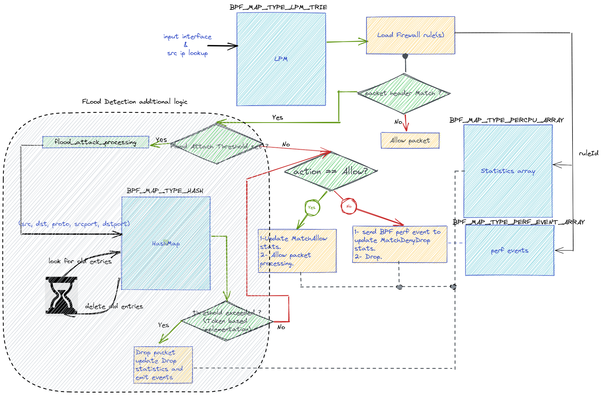

# Ingress node Firewall Flood Attacks

## Release Signoff Checklist

- [ ] Enhancement is `implementable`
- [ ] Design details are appropriately documented from clear requirements
- [ ] Test plan is defined
- [ ] Operational readiness criteria is defined
- [ ] Graduation criteria for dev preview, tech preview, GA
- [ ] User-facing documentation is created in [openshift-docs](https://github.com/openshift/openshift-docs/)

## Summary

OCP customers would like to secure OCP's nodes from external Flood attacks are
also known as Denial of Service (DoS) attacks. 
In a flood attack, attackers send a very high volume of traffic to a system so
that it cannot examine and allow permitted network traffic.
For example, an ICMP flood attack occurs when a system receives too many ICMP
ping commands and must use all its resources to send reply commands.

Ingress Node Firewall will protect against these types of flood attacks
- ICMP/ICMPv6
- SYN
- UDP

## Motivation

Customers would like to secure OCP cluster from external flood attacks.

### Goals

- Threshold based mechanism once packets received exceed this threshold, packets will be dropped
  drop statistics counters will be incremented and event log will be generated, including
  the packet header that exceeded the provisioned threshold.

### Non-Goals

## Proposal

- customers will configure protocol specific threshold field in `IngressNodeFirewall` objects.

### Workflow Description

- the following diagram explains how Ingress node firewall's XDP program will process the incoming packets, showing the involved eBPF tables "maps"



### Implementation Details/Notes/Constraints

IngressNodeFirewall object APIs will be extended to allow per protocol threshold settings

```golang
// IngressNodeFirewallICMPRule define ingress node firewall rule for ICMP and ICMPv6 protocols
type IngressNodeFirewallICMPRule struct {
	...
	// icmpAttackThreshold specify thresholds for allowed number of echo request packets "ping" per second, when the number
	// of packets received exceeds this threshold, ingress node firewall will drop those packets.
	// +optional
	// +kubebuilder:validation:Minimum:=1000
	ICMPAttackThreshold uint32 `json:"icmpAttackThreshold,omitempty"`
}

// IngressNodeFirewallProtoRule define ingress node firewall rule for TCP, UDP and SCTP protocols
type IngressNodeFirewallProtoRule struct {
    ...
	// protocolAttackThreshold specify thresholds for allowed number of packets per second, when the number
	// of packets received for a specific protocol exceeds this threshold,
	// ingress node firewall will drop those packets.
	// +optional
	// +kubebuilder:validation:Minimum:=1000
	ProtocolAttackThreshold uint32 `json:"protocolAttackThreshold,omitempty"`
}
```

- sample `IngressNodeFirewall` object

```yaml
apiVersion: ingressnodefirewall.openshift.io/v1alpha1
kind: IngressNodeFirewall
metadata:
  name: ingressnodefirewall-demo-flood-attacks
spec:
  interfaces:
  - eth0
  nodeSelector:
    matchLabels:
      do-node-ingress-firewall: 'true'
  ingress:
  - sourceCIDRs:
       - 172.16.0.0/12
    rules:
    - order: 10
      protocolConfig:
        protocol: ICMP
        icmp:
          icmpAttackThreshold: 1000 # ICMP attack threshold in packets/second
      action: Deny
    - order: 20
      protocolConfig:
        protocol: ICMPv6
        icmpv6:
          icmpAttackThreshold: 1000 # ICMPv6 attack threshold in packets/second
      action: Deny
    - order: 30
      protocolConfig:
        protocol: TCP
        tcp:
          protocolAttackThreshold: 5000 # SYN attack threshold in packets/second
      action: Deny
    - order: 40
      protocolConfig:
        protocol: UDP
        udp:
          protocolAttackThreshold: 2000 # UDP attack threshold in packets/second
      action: Deny
```

- eBPF drop events example

```shell
kind-worker2 ruleId 10 action Flood Attack Threshold Drop len 98 if eth0
kind-worker2 	ipv4 src addr 172.18.0.1 dst addr 172.18.0.4
kind-worker2 	icmpv4 type 8 code 0
```
### User Stories
https://issues.redhat.com/browse/SDN-3408

### API Extensions

### Test Plan

- Unit tests coverage
- IPv4/IPv6 E2E coverage to validate ingress node firewall flood attack functionality on OCP 
  cluster with multiple external traffic streams and check for statistics and events.

### Risks and Mitigations

ingress node firewall will be limited to whatever RHEL 9.0 eBPF, XDP and NIC drivers supports. 

### Drawbacks

N/A

## Design Details

N/A

### Graduation Criteria

#### Dev Preview -> Tech Preview

Tech Preview: 4.13

#### Tech Preview -> GA

#### Removing a deprecated feature

N/A

### Upgrade / Downgrade Strategy

N/A

### Version Skew Strategy

N/A

### Operational Aspects of API Extensions

N/A

#### Failure Modes

N/A

#### Support Procedures

N/A

## Implementation History

N/A

## Alternatives

N/A
