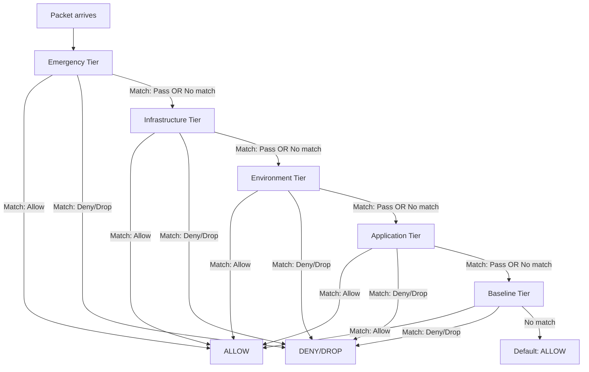

# OpenShift Network Security Policy

## Summary

This enhancement proposes a unified, higher-level network security API for
OpenShift consisting of two new CRDs: **`NetworkSecurityGroup`** and
**`NetworkSecurityPolicy`**. Together they offer a unified alternative to the
current fragmented landscape of EgressFirewall, AdminNetworkPolicy,
BaselineAdminNetworkPolicy (being replaced upstream by ClusterNetworkPolicy),
IngressNodeFirewall, NetworkPolicy, MultiNetworkPolicy, and IPsec policy
configuration. The model is inspired by cloud-native security constructs (AWS
Security Groups, VMware NSX Distributed Firewall categories, Azure Network
Security Groups). The existing APIs continue to function and are fully
supported; users may choose either the individual APIs or the unified
NetworkSecurityGroup / NetworkSecurityPolicy API, but the two approaches
should not be mixed.

## Motivation

OpenShift users today must learn and reconcile 7+ distinct network security
APIs, each with different scopes, personas, evaluation semantics, and
implementation details:

| API | Scope | Persona | L4/L7 | Direction | Peer Types |
|-----|-------|---------|-------|-----------|------------|
| NetworkPolicy | Namespace | App developer | L4 | Pod ingress/egress | Pod/NS selectors, IP blocks |
| MultiNetworkPolicy | Namespace | App developer | L4 | Pod ingress/egress (secondary nets) | Same as NP |
| AdminNetworkPolicy | Cluster | Cluster admin | L4 | Pod ingress/egress | Pod/NS selectors, CIDRs, nodes |
| BaselineAdminNetworkPolicy | Cluster (singleton) | Cluster admin | L4 | Pod ingress/egress | Same as ANP |
| EgressFirewall | Namespace | Cluster admin | L4 | Cluster egress only | CIDRs, DNS names, node selectors |
| IngressNodeFirewall | Cluster | Cluster admin | L4 | Node ingress only | CIDRs (source), interfaces |
| IPsec (CNO config) | Cluster | Cluster admin | N/A | East-west, north-south | All pod traffic or external endpoints |

This fragmentation has real costs:

1. **Cognitive overhead**: Users must understand the precedence chain
   (ANP > NP > BANP), how EgressFirewall interacts with NetworkPolicy egress
   rules, and that IngressNodeFirewall operates at a completely different
   layer (XDP/eBPF on the host).

2. **No unified security posture view**: There is no single place to
   understand "what is my cluster's security posture?" You must query 5+
   API types and mentally compose them.

3. **Impedance mismatch with networking concepts**: Network engineers coming
   from AWS, Azure, or VMware NSX expect a security group / ACL model with
   tiered evaluation, group referencing, and both allow and deny rules. The
   current Kubernetes APIs are a poor fit for this mental model.

4. **Multi-network gap**: Secondary networks (UDNs, CUDNs, SR-IOV, Localnet
   with VLANs) have limited security policy support via MultiNetworkPolicy,
   while EgressFirewall and ANP operate only on the default cluster network.

5. **Upstream dependency and API churn**: Relying on upstream Kubernetes APIs
   such as NetworkPolicy, AdminNetworkPolicy, and ClusterNetworkPolicy
   introduces long lead times -- features must first be designed, accepted,
   and released upstream before they can be shipped to customers. Upstream
   API changes can also break existing workflows; the ongoing replacement
   of ANP/BANP with ClusterNetworkPolicy is a concrete example of this
   churn. An OpenShift-owned API allows faster iteration and insulates
   users from upstream breaking changes.

### User Stories - AI Slop Don't Review

#### Cluster Administrator

> "As an OpenShift cluster administrator, I want to define cluster-wide
> security policies in a single API before any namespaces exist, so that I
> can enforce infrastructure-level guardrails (DNS access, management
> access, inter-zone isolation) without learning multiple CRD types."

#### Network Security Engineer

> "As a network security engineer migrating workloads from VMware NSX to
> OpenShift, I want a security group and tiered policy model that maps to
> the NSX Distributed Firewall categories (Emergency, Infrastructure,
> Environment, Application) I already know, so that I can translate my
> existing microsegmentation policies."

#### Application Developer

> "As an application developer, I want to define security rules for my
> application using the same API that the cluster admin uses (but scoped to
> my namespace and at a lower tier), so that I don't have to learn a
> separate NetworkPolicy syntax and understand how it interacts with the
> admin's policies."

#### Security Incident Responder

> "As a security incident responder, I want to quarantine a compromised
> workload by creating a single high-priority Emergency-tier policy that
> overrides all other rules, so that I can isolate the threat without
> modifying or understanding existing application-level policies."

#### Platform Engineer (AWS Background)

> "As a platform engineer familiar with AWS VPC Security Groups, I want to
> define reusable security groups that can reference each other (like
> allowing traffic from the 'web-tier' security group to the 'db-tier'
> security group), so that my policies are identity-based rather than
> IP-based and automatically adapt as pods scale."

#### Multi-Network Administrator

> "As an administrator managing workloads on multiple networks (default
> cluster network, SR-IOV secondary networks, Localnet VLANs), I want a
> single security policy API that can target specific networks, VLANs, and
> physical interfaces, so that I don't need separate MultiNetworkPolicy and
> IngressNodeFirewall resources."

### Goals

1. **Single API**: Two CRDs (`NetworkSecurityGroup` and
   `NetworkSecurityPolicy`) replace all existing network security APIs as
   the user-facing interface.

2. **Tiered evaluation**: A fixed set of tiers
   (Emergency > Infrastructure > Environment > Application > Baseline)
   provides deterministic precedence, with admin tiers non-overridable by
   application-level policies.

3. **Networking-savvy**: The API models concepts familiar to network
   engineers: security groups with dynamic membership, group referencing,
   both allow and deny actions, ordered rules within tiers, VLAN/segment
   awareness, interface-level matching, and DNS-based peers.

4. **Multi-network native**: Policies can target specific UDNs, CUDNs,
   Localnet segments, VLANs, and physical networks, not just the default
   cluster network.

5. **Backward compatible**: Existing APIs (NetworkPolicy, ANP, BANP,
   EgressFirewall, IngressNodeFirewall) continue to function. A translation
   layer maps them into the new model. Users can migrate incrementally.

6. **Observable**: A single status view per policy showing effective rules,
   OVN ACL mapping, and evaluation position in the tier chain.

### Non-Goals

1. **Replace IPsec cryptographic implementation**: This enhancement covers
   the *policy* layer (which flows require encryption), not the IPsec
   keying, certificate management, or tunnel implementation.

2. **Remove existing APIs**: Existing APIs will not be removed. They
   continue to function alongside the new API; users choose one approach
   or the other.

### Future Goals

1. **L7 deep packet inspection**: Application-layer firewalling (HTTP
   headers, gRPC methods, mTLS policy). Service mesh (Istio/Envoy)
   handles this today, but integrating L7 matching into the security
   rule model is a future direction.

2. **Custom user-defined tiers**: The tier set is currently fixed. Making
   it extensible by users is a future consideration once the evaluation
   model is proven.

## Proposal

The proposal introduces two new cluster-scoped CRDs in the
`security.openshift.io` API group:

1. **`NetworkSecurityGroup`** -- A reusable, named collection of network
   endpoints. This is the "who" -- defining subjects and peers by identity,
   network membership, IP ranges, DNS names, or references to other groups.
   Analogous to AWS Security Groups (as identity containers), VMware NSX
   Groups, and Azure Application Security Groups.

2. **`NetworkSecurityPolicy`** -- A tiered, ordered set of security rules
   that references NetworkSecurityGroups as subjects and peers. This is the
   "what" -- defining what traffic is allowed, denied, or passed between
   groups. Analogous to AWS SG rules + NACLs, VMware NSX DFW security
   policies, and Azure NSG rules.

### Workflow Description

#### Creating Security Groups

**Cluster administrator** defines reusable groups:

1. The cluster admin creates a `NetworkSecurityGroup` named `dns-servers`
   containing the cluster's DNS service CIDRs and any external DNS IPs.

2. The cluster admin creates `web-tier`, `app-tier`, and `db-tier` groups
   using pod and namespace label selectors. These groups dynamically resolve
   to the set of pods matching the selectors.

3. The cluster admin creates an `external` group as a shorthand for all
   non-cluster traffic.

#### Applying Policies at Different Tiers

4. The cluster admin creates an Infrastructure-tier
   `NetworkSecurityPolicy` that allows all pods to reach the `dns-servers`
   group on UDP/53 and TCP/53. This cannot be overridden by any
   application-level policy.

5. The cluster admin creates an Environment-tier policy that denies all
   egress to `external` except through explicitly allowed paths (replacing
   EgressFirewall).

6. **Application developer** creates Application-tier policies in their
   namespace. For example, allowing `web-tier` to reach `app-tier` on
   TCP/8080, and `app-tier` to reach `db-tier` on TCP/5432. These are
   evaluated after Infrastructure and Environment tier policies.

7. The cluster admin creates a Baseline-tier policy that provides default
   deny-all for any traffic not matched by higher tiers (replacing BANP).

#### Emergency Response

8. When a security incident is detected, the **security engineer** creates
   an Emergency-tier policy referencing a `quarantined` group (defined by a
   label selector like `security.openshift.io/quarantine: "true"`). This
   policy drops all ingress and egress for quarantined pods, overriding
   every other policy in the system.

9. The security engineer labels the compromised pods with the quarantine
   label. They are immediately isolated.

#### Node-Level Security

10. The cluster admin creates a `NetworkSecurityGroup` referencing worker
    nodes by node selector and specific interfaces (`eth0`).

11. An Infrastructure-tier policy with that node group as the subject
    restricts what external traffic can reach the nodes on those interfaces
    (replacing IngressNodeFirewall). The implementation infers node-ingress
    semantics from the subject containing nodes.

### API Extensions

This enhancement introduces two new CRDs:

- **`networksecuritygroups.security.openshift.io`** -- Cluster-scoped
- **`networksecuritypolicies.security.openshift.io`** -- Cluster-scoped
  (with namespace-scoping behavior via subjects)

A validating admission webhook enforces:
- Tier restrictions: only users with cluster-admin privileges can create
  Emergency, Infrastructure, or Baseline tier policies. Environment and
  Application tiers are available to namespace admins (scoped to their
  namespace via subjects).
- Group reference validity: all referenced NetworkSecurityGroups must exist.
- Rule ordering: rules within a policy are evaluated in list order.

#### NetworkSecurityGroup API

```go
// NetworkSecurityGroup is a reusable, named collection of network
// endpoints. It defines the "who" in security policies.
//
// Analogous to: AWS Security Groups (as identity containers),
// VMware NSX Groups, Azure Application Security Groups.
type NetworkSecurityGroup struct {
    metav1.TypeMeta   `json:",inline"`
    metav1.ObjectMeta `json:"metadata,omitempty"`

    Spec   NetworkSecurityGroupSpec   `json:"spec"`
    Status NetworkSecurityGroupStatus `json:"status,omitempty"`
}

type NetworkSecurityGroupSpec struct {
    // members defines the set of endpoints that belong to this group.
    // Multiple member types are OR'd: an endpoint matching any member
    // definition is part of the group.
    // +optional
    Members []GroupMember `json:"members,omitempty"`
}

// GroupMember defines a single membership criterion. Exactly one field
// must be set.
// +kubebuilder:validation:MinProperties=1
// +kubebuilder:validation:MaxProperties=1
type GroupMember struct {
    // pods selects pods by label and/or namespace.
    // Dynamic: resolved continuously as pods are created/deleted.
    // Analog: NSX VM tag-based membership, AWS SG attached to ENI.
    // +optional
    Pods *PodMember `json:"pods,omitempty"`

    // namespaces selects entire namespaces by label.
    // All pods in matching namespaces are members.
    // Analog: NSX segment membership.
    // +optional
    Namespaces *NamespaceMember `json:"namespaces,omitempty"`

    // nodes selects cluster nodes by label, optionally filtered to
    // specific network interfaces.
    // When used as a policy subject, the implementation applies rules
    // at the node's network interfaces (like IngressNodeFirewall).
    // Analog: NSX segment port membership.
    // +optional
    Nodes *NodeMember `json:"nodes,omitempty"`

    // cidrs defines a static set of IP address ranges.
    // Analog: AWS CIDR source/destination, NSX IP Set.
    // +optional
    CIDRs *CIDRMember `json:"cidrs,omitempty"`

    // dnsNames defines a set of domain names resolved via DNS snooping.
    // Wildcard matching supported (e.g., "*.example.com").
    // Analog: NSX FQDN Context Profile, OVN-K EgressFirewall DNS rules.
    // +optional
    DNSNames *DNSMember `json:"dnsNames,omitempty"`

    // networks selects UDNs, CUDNs, Localnet segments, or the default
    // cluster network. All endpoints on matching networks are members.
    // Analog: NSX segment-based group membership.
    // +optional
    Networks *NetworkMember `json:"networks,omitempty"`

    // segments selects by VLAN ID, VLAN range, or physical network name.
    // Used for Localnet/bare-metal environments with trunked ports.
    // Analog: NSX VLAN-backed segment membership.
    // +optional
    Segments *SegmentMember `json:"segments,omitempty"`

    // securityGroupRef references other NetworkSecurityGroups by name
    // or label selector. Enables nested/composable groups.
    // Analog: AWS SG referencing, NSX nested groups.
    // +optional
    SecurityGroupRef *SecurityGroupReference `json:"securityGroupRef,omitempty"`

    // serviceAccounts selects by service account identity.
    // Future: maps to NSX AD Group / identity firewall concepts.
    // +optional
    ServiceAccounts *ServiceAccountMember `json:"serviceAccounts,omitempty"`

    // external is a shorthand for "all endpoints outside the cluster."
    // Resolved as the complement of all cluster-owned CIDRs (pod CIDR,
    // service CIDR, join/transit subnets).
    // +optional
    External *bool `json:"external,omitempty"`
}

// --- Member Type Definitions ---

type PodMember struct {
    // namespaceSelector selects namespaces. If empty, matches all namespaces.
    // +optional
    NamespaceSelector *metav1.LabelSelector `json:"namespaceSelector,omitempty"`

    // podSelector selects pods within matched namespaces. If empty,
    // matches all pods in matched namespaces.
    // +optional
    PodSelector *metav1.LabelSelector `json:"podSelector,omitempty"`
}

type NamespaceMember struct {
    // selector selects namespaces by label.
    Selector metav1.LabelSelector `json:"selector"`
}

type NodeMember struct {
    // selector selects nodes by label.
    Selector metav1.LabelSelector `json:"selector"`

    // interfaces limits matching to specific network interfaces on the
    // selected nodes. If empty, applies to all interfaces.
    // +optional
    Interfaces []string `json:"interfaces,omitempty"`
}

type CIDRMember struct {
    // ranges is a list of CIDR blocks (IPv4 and/or IPv6).
    // +kubebuilder:validation:MinItems=1
    Ranges []string `json:"ranges"`
}

type DNSMember struct {
    // names is a list of domain names. Wildcard matching is supported:
    // "*.example.com" matches "foo.example.com" but not
    // "bar.foo.example.com".
    // +kubebuilder:validation:MinItems=1
    Names []string `json:"names"`
}

type NetworkMember struct {
    // networkSelectors selects networks using the existing OVN-K
    // NetworkSelector type, supporting DefaultNetwork,
    // ClusterUserDefinedNetworks, PrimaryUserDefinedNetworks,
    // SecondaryUserDefinedNetworks, and NetworkAttachmentDefinitions.
    NetworkSelectors []NetworkSelector `json:"networkSelectors"`
}

// NetworkSelector reuses the existing OVN-K type from
// go-controller/pkg/crd/types/networkselector.go
type NetworkSelector struct {
    // networkSelectionType discriminates the network type.
    // +kubebuilder:validation:Enum=DefaultNetwork;ClusterUserDefinedNetworks;PrimaryUserDefinedNetworks;SecondaryUserDefinedNetworks;NetworkAttachmentDefinitions
    NetworkSelectionType string `json:"networkSelectionType"`

    // clusterUserDefinedNetworkSelector selects CUDNs by label.
    // +optional
    ClusterUserDefinedNetworkSelector *metav1.LabelSelector `json:"clusterUserDefinedNetworkSelector,omitempty"`

    // primaryUserDefinedNetworkSelector selects primary UDNs by label.
    // +optional
    PrimaryUserDefinedNetworkSelector *metav1.LabelSelector `json:"primaryUserDefinedNetworkSelector,omitempty"`

    // secondaryUserDefinedNetworkSelector selects secondary UDNs.
    // +optional
    SecondaryUserDefinedNetworkSelector *metav1.LabelSelector `json:"secondaryUserDefinedNetworkSelector,omitempty"`

    // networkAttachmentDefinitionSelector selects NADs by label.
    // +optional
    NetworkAttachmentDefinitionSelector *metav1.LabelSelector `json:"networkAttachmentDefinitionSelector,omitempty"`
}

type SegmentMember struct {
    // vlanID matches a specific VLAN ID (1-4094).
    // +optional
    // +kubebuilder:validation:Minimum=1
    // +kubebuilder:validation:Maximum=4094
    VLANID *int32 `json:"vlanID,omitempty"`

    // vlanRange matches a range of VLAN IDs.
    // +optional
    VLANRange *VLANRange `json:"vlanRange,omitempty"`

    // physicalNetworkName matches traffic on a named physical network
    // (as defined in Localnet CUDN configurations).
    // +optional
    PhysicalNetworkName *string `json:"physicalNetworkName,omitempty"`
}

type VLANRange struct {
    // +kubebuilder:validation:Minimum=1
    // +kubebuilder:validation:Maximum=4094
    Start int32 `json:"start"`
    // +kubebuilder:validation:Minimum=1
    // +kubebuilder:validation:Maximum=4094
    End int32 `json:"end"`
}

// SecurityGroupReference selects one or more NetworkSecurityGroups.
// Exactly one of name or selector must be set.
//
// When name is set, the reference is exact (like AWS SG ID reference).
// When selector is set, all NetworkSecurityGroups matching the label
// selector are included (their members are OR'd). This enables
// dynamic rule targets: "allow traffic from any group labeled
// compliance=pci" automatically adapts as groups are created/deleted.
//
// +kubebuilder:validation:MinProperties=1
// +kubebuilder:validation:MaxProperties=1
type SecurityGroupReference struct {
    // name selects a single NetworkSecurityGroup by exact name.
    // +optional
    Name *string `json:"name,omitempty"`

    // selector selects NetworkSecurityGroups by label. All groups
    // matching the selector are included; their resolved members
    // are unioned.
    // Analog: NSX tag-based group-of-groups, Azure ASG collections.
    // +optional
    Selector *metav1.LabelSelector `json:"selector,omitempty"`
}

type ServiceAccountMember struct {
    // namespaceSelector selects namespaces containing the service accounts.
    // +optional
    NamespaceSelector *metav1.LabelSelector `json:"namespaceSelector,omitempty"`

    // selector selects service accounts by label.
    Selector metav1.LabelSelector `json:"selector"`
}

type NetworkSecurityGroupStatus struct {
    // conditions reports the group's readiness and resolution status.
    // +optional
    Conditions []metav1.Condition `json:"conditions,omitempty"`
}
```

#### NetworkSecurityPolicy API

```go
// NetworkSecurityPolicy defines a tiered, ordered set of security rules.
// It references NetworkSecurityGroups as subjects and peers.
//
// Cluster-scoped. Namespace-level scoping is achieved through the
// subject's namespace selector. Traffic scope (pod vs node, east-west
// vs north-south) is inferred from the subject and peer types rather
// than declared explicitly.
//
// Analogous to: VMware NSX DFW Security Policy, AWS SG rules + NACLs,
// Azure NSG rules.
type NetworkSecurityPolicy struct {
    metav1.TypeMeta   `json:",inline"`
    metav1.ObjectMeta `json:"metadata,omitempty"`

    Spec   NetworkSecurityPolicySpec   `json:"spec"`
    Status NetworkSecurityPolicyStatus `json:"status,omitempty"`
}

// Tier determines the evaluation category for a policy. Tiers are
// evaluated in fixed order: Emergency (highest) to Baseline (lowest).
// Inspired by VMware NSX DFW categories.
//
// +kubebuilder:validation:Enum=Emergency;Infrastructure;Environment;Application;Baseline
type Tier string

const (
    // TierEmergency is the highest priority tier. Used for quarantine,
    // incident response, and override rules. Only cluster-admin can
    // create policies at this tier.
    // NSX analog: Emergency category.
    TierEmergency Tier = "Emergency"

    // TierInfrastructure is for cluster-wide infrastructure rules:
    // DNS access, management plane, etcd, monitoring.
    // Only cluster-admin can create policies at this tier.
    // NSX analog: Infrastructure category.
    // Subsumes: AdminNetworkPolicy, IngressNodeFirewall.
    TierInfrastructure Tier = "Infrastructure"

    // TierEnvironment is for cross-zone and external access rules:
    // production vs development isolation, PCI compliance boundaries,
    // external egress controls.
    // NSX analog: Environment category.
    // Subsumes: EgressFirewall.
    TierEnvironment Tier = "Environment"

    // TierApplication is for application-level rules: service-to-service
    // communication, microservice policies.
    // Available to namespace admins (scoped to their namespace via the
    // subject's namespace selector).
    // NSX analog: Application category.
    // Subsumes: NetworkPolicy, MultiNetworkPolicy.
    TierApplication Tier = "Application"

    // TierBaseline is the lowest priority tier. Provides default
    // allow/deny behavior for traffic not matched by higher tiers.
    // Only cluster-admin can create policies at this tier.
    // NSX analog: N/A (closest: BANP).
    // Subsumes: BaselineAdminNetworkPolicy.
    TierBaseline Tier = "Baseline"
)

// Action determines what happens to traffic matching a rule.
// +kubebuilder:validation:Enum=Allow;Deny;Drop;Pass
type Action string

const (
    // ActionAllow permits the traffic.
    ActionAllow Action = "Allow"

    // ActionDeny rejects the traffic and sends a TCP RST or ICMP
    // unreachable to the source.
    // NSX analog: REJECT.
    ActionDeny Action = "Deny"

    // ActionDrop silently discards the traffic with no response.
    // NSX analog: DROP.
    ActionDrop Action = "Drop"

    // ActionPass skips remaining rules in this tier and defers the
    // decision to the next lower tier.
    // NSX analog: JUMP_TO_APPLICATION.
    // ANP analog: Pass action.
    ActionPass Action = "Pass"
)

type NetworkSecurityPolicySpec struct {
    // tier determines the evaluation category. Policies in higher tiers
    // are evaluated before lower tiers.
    // +kubebuilder:default=Application
    Tier Tier `json:"tier"`

    // priority determines the evaluation order within a tier.
    // Lower values are evaluated first. Must be unique within a tier.
    // Range: 0-9999.
    // +kubebuilder:validation:Minimum=0
    // +kubebuilder:validation:Maximum=9999
    Priority int32 `json:"priority"`

    // subject selects the NetworkSecurityGroup(s) this policy applies
    // to, by name or label selector.
    //
    // Analogous to NSX "Applied To" -- limits where rules are
    // instantiated. The implementation infers the enforcement point
    // from the group's member types (pods -> logical switch ports,
    // nodes -> host interfaces, networks -> scoped to those networks).
    Subject SecurityGroupReference `json:"subject"`

    // ingress is an ordered list of inbound rules. Each rule specifies
    // source peers that are allowed/denied/dropped when sending traffic
    // TO the subject. Evaluated top-down; first match wins.
    // +optional
    // +kubebuilder:validation:MaxItems=50
    Ingress []SecurityRule `json:"ingress,omitempty"`

    // egress is an ordered list of outbound rules. Each rule specifies
    // destination peers that are allowed/denied/dropped when the subject
    // sends traffic. Evaluated top-down; first match wins.
    // +optional
    // +kubebuilder:validation:MaxItems=50
    Egress []SecurityRule `json:"egress,omitempty"`

    // encryption requires all traffic matched by this policy to be
    // encrypted. When set, the implementation configures IPsec (or
    // WireGuard) for flows between the subject and rule peers.
    // +optional
    Encryption *EncryptionRequirement `json:"encryption,omitempty"`
}

// SecurityRule is a single ordered rule within a policy.
//
// For ingress rules, peers are the traffic sources (who can send
// to the subject). For egress rules, peers are the traffic
// destinations (where the subject can send to). The direction is
// determined by which list (ingress or egress) the rule is in,
// not by a field on the rule itself.
type SecurityRule struct {
    // name is a human-readable identifier for this rule.
    // Must be unique within the policy.
    // +kubebuilder:validation:MaxLength=253
    Name string `json:"name"`

    // action specifies what to do with matching traffic.
    Action Action `json:"action"`

    // peers selects the remote side of the traffic flow.
    // For ingress rules: the sources (who can send to the subject).
    // For egress rules: the destinations (where subject can send).
    // Each entry is OR'd: traffic matching any listed group matches.
    // If empty, the rule matches all peers.
    // +optional
    Peers []SecurityGroupReference `json:"peers,omitempty"`

    // ports specifies L4 protocol and port matching.
    // If empty, the rule matches all ports and protocols.
    // +optional
    Ports []NetworkPort `json:"ports,omitempty"`

    // logging enables ACL logging for this rule.
    // +optional
    Logging *bool `json:"logging,omitempty"`
}

type NetworkPort struct {
    // protocol is the network protocol (TCP, UDP, SCTP, ICMP).
    // +kubebuilder:validation:Enum=TCP;UDP;SCTP;ICMP
    Protocol string `json:"protocol"`

    // port is the port number or named port. For ICMP, this is the
    // ICMP type.
    // +optional
    Port *intstr.IntOrString `json:"port,omitempty"`

    // endPort defines the end of a port range (inclusive).
    // Only valid when port is a numeric value.
    // +optional
    EndPort *int32 `json:"endPort,omitempty"`
}

type EncryptionRequirement struct {
    // mode specifies the encryption mode.
    // +kubebuilder:validation:Enum=IPsec;WireGuard
    // +kubebuilder:default=IPsec
    Mode string `json:"mode"`
}

type NetworkSecurityPolicyStatus struct {
    // conditions reports the policy's readiness and enforcement status.
    // +optional
    Conditions []metav1.Condition `json:"conditions,omitempty"`
}
```

#### Tier Evaluation Model

The following diagram shows how traffic is evaluated across tiers:



Within each tier, policies are evaluated in priority order (lowest
number first). Within each policy, rules are evaluated in list order
(top-down). First match determines the action. If the action is `Pass`,
evaluation continues to the next tier.

This maps directly to OVN ACL tiers:

| Tier | OVN ACL Tier | ACL Priority Range |
|------|-------------|-------------------|
| Emergency | 0 (highest) | 32000-31000 |
| Infrastructure | 1 | 30000-20000 |
| Environment | 1 | 19999-10000 |
| Application | 2 | 9999-1000 |
| Baseline | 3 (lowest) | 999-0 |

#### Mapping Existing APIs to NetworkSecurityPolicy

| Existing API | New Tier | Subject | Peers | Notes |
|-------------|----------|---------|-------|-------|
| AdminNetworkPolicy (priority 0-99) | Infrastructure | ANP subject -> Group | ANP peers -> Groups | ANP actions map directly (Allow, Deny, Pass) |
| BaselineAdminNetworkPolicy | Baseline | BANP subject -> Group | BANP peers -> Groups | Was singleton; Baseline tier allows multiple policies |
| ClusterNetworkPolicy (v1alpha2 tier=Admin) | Infrastructure | Same as ANP | Same as ANP | Direct mapping of upstream successor |
| ClusterNetworkPolicy (v1alpha2 tier=Baseline) | Baseline | Same as BANP | Same as BANP | Now supports priority and multiple instances |
| NetworkPolicy | Application | NP podSelector -> Group | NP peers -> Groups | Implicit deny becomes explicit Deny rule at end |
| MultiNetworkPolicy | Application | Subject group includes network members | Same as NP | Network scoping via group's network/segment members |
| EgressFirewall | Environment | EF namespace -> Group | EF destinations -> Groups (CIDRs/DNS/external) | Ordered rules map to rule list; default allow preserved |
| IngressNodeFirewall | Infrastructure | INF nodeSelector -> Group (nodes+interfaces) | INF sourceCIDRs -> Group (CIDRs) | Subject is nodes; applies at node interfaces |
| IPsec (east-west) | Infrastructure | All pods -> Group | All pods -> Group | Rule with encryption: {mode: IPsec}, action: Allow |
| IPsec (north-south) | Infrastructure | Specific pods -> Group | External -> Group (with `external` member) | Rule with encryption: {mode: IPsec}, action: Allow |

### Topology Considerations

#### Hypershift / Hosted Control Planes

The NetworkSecurityGroup and NetworkSecurityPolicy CRDs are installed on
the guest cluster (data plane), not the management cluster. The
controller runs as part of OVN-Kubernetes on the guest cluster. No
special handling is needed for Hypershift beyond standard CRD deployment
via the hosted cluster's operator.

#### Standalone Clusters

Fully supported. This is the primary deployment model.

#### Single-node Deployments or MicroShift

The CRDs and controller are available on SNO. Resource consumption is
bounded by the number of policies and groups, not cluster size. For
MicroShift, the controller could be an optional component, with a subset
of tiers (Application, Baseline) exposed for simpler environments.

#### OpenShift Kubernetes Engine

The API is part of the networking stack and does not depend on features
excluded from OKE.

### Implementation Details/Notes/Constraints

#### Controller Architecture

The NetworkSecurityPolicy controller runs within the OVN-Kubernetes
control plane (ovnkube-controller). It:

1. Watches `NetworkSecurityGroup` and `NetworkSecurityPolicy` resources.
2. Resolves group membership (pods, namespaces, nodes, CIDRs, DNS) into
   OVN AddressSets.
3. Translates policies into OVN `nbdb.ACL` objects with appropriate
   tier, priority, match expressions, and action.
4. Uses OVN PortGroups for subject scoping (analogous to NSX "Applied
   To"), ensuring rules are only installed on relevant logical switch
   ports.

This reuses the existing OVN-K machinery for ANP, NP, and EgressFirewall
ACL programming. The new controller is a higher-level orchestrator that
produces the same OVN primitives.

#### Group Resolution

| Member Type | OVN Primitive | Resolution |
|-------------|--------------|------------|
| Pods | AddressSet | Pod IPs from informer cache, filtered by selectors |
| Namespaces | AddressSet | All pod IPs in matching namespaces |
| Nodes | AddressSet | Node IPs from informer cache |
| CIDRs | Inline in ACL match | Static, directly used in match expressions |
| DNSNames | AddressSet | Resolved via DNS snooping (reuses EgressFirewall DNS resolution) |
| Networks | PortGroup | Logical switch ports on matching networks |
| Segments | PortGroup/AddressSet | Ports on matching VLANs/physical networks |
| SecurityGroupRef (by name) | AddressSet union | Recursively resolve the named group |
| SecurityGroupRef (by selector) | AddressSet union | List all NSGs matching label selector, resolve each, union results |
| External | Complement set | `!($clusterCIDR || $serviceCIDR || $joinSubnet)` |

#### Translation Layer (Backward Compatibility)

A translation controller runs alongside the main controller and:

1. Watches existing APIs (NetworkPolicy, ANP, BANP, EgressFirewall,
   IngressNodeFirewall).
2. Creates equivalent `NetworkSecurityGroup` and `NetworkSecurityPolicy`
   resources with a `managed-by: translation-controller` label.
3. Keeps them in sync (updates, deletes).

This ensures that existing resources continue to work, and users can see
their effective security posture entirely through the new API. Users can
then gradually migrate to the new API and delete the old resources.

#### RBAC Model

| Tier | Required ClusterRole | Rationale |
|------|---------------------|-----------|
| Emergency | `network-security-emergency-admin` | Only security team / break-glass |
| Infrastructure | `cluster-admin` or `network-security-infra-admin` | Cluster-wide guardrails |
| Environment | `cluster-admin` or `network-security-env-admin` | Cross-namespace zone rules |
| Application | Namespace `admin` role | Scoped to own namespace via subject |
| Baseline | `cluster-admin` | Cluster-wide defaults |

The validating webhook enforces that the user creating/modifying a policy
has the appropriate role for the policy's tier.

### Risks and Mitigations

**Risk: Performance at scale.** Thousands of NetworkSecurityGroup and
NetworkSecurityPolicy resources could generate a large number of OVN ACLs
and AddressSets.

*Mitigation:* Subject scoping (like NSX Applied-To) ensures ACLs are only
installed on relevant PortGroups. AddressSets are shared across policies
referencing the same group. The existing OVN-K ACL programming is already
optimized for scale.

**Risk: Migration complexity.** Users have invested in existing APIs and
tooling (Helm charts, GitOps) that reference NetworkPolicy, ANP, etc.

*Mitigation:* The translation layer ensures backward compatibility. Both
old and new APIs work simultaneously. Migration can be gradual.

**Risk: Upstream divergence.** The upstream `network-policy-api` project is
actively evolving (ClusterNetworkPolicy v1alpha2). Our API could diverge.

*Mitigation:* The new API is explicitly higher-level. It translates *into*
upstream types, not replaces them at the implementation level. If upstream
standardizes a similar model, we align.

**Risk: Confusion with two APIs.** Having both old and new APIs active could
confuse users about which to use.

*Mitigation:* Clear documentation, deprecation timeline, and console UI
that surfaces only the new API. Translation controller keeps both in sync
during transition.

### Drawbacks

1. **Another API to learn**: While the goal is simplification, during the
   transition period users must know about both old and new APIs. This is
   mitigated by the translation layer and gradual deprecation.

2. **OpenShift-specific**: This is not an upstream Kubernetes API. Users
   who also manage non-OpenShift clusters will have two mental models.

3. **Group resolution overhead**: Dynamic group membership (especially DNS
   names and nested group references) requires continuous resolution, adding
   controller load.

## Open Questions

1. **Should the tier set be extensible?** The current proposal uses a fixed
   5-tier model. Some organizations may want custom tiers (e.g., a
   "Compliance" tier between Infrastructure and Environment). Fixed tiers
   keep semantics deterministic; extensible tiers add flexibility at the
   cost of complexity.

2. **Namespace confinement for Application tier**: Kubernetes RBAC is
   verb+resource level -- it cannot restrict what *values* are set in a
   spec (e.g., "you can only create policies with `tier: Application`"
   or "your subject can only select pods in your namespace"). This means
   a single cluster-scoped CRD cannot use RBAC alone to confine
   namespace admins to their own namespace. Options:

   **Option A: Two pairs of CRDs (cluster + namespace scoped).** Follow
   the established OVN-K pattern (`UserDefinedNetwork` /
   `ClusterUserDefinedNetwork`, `NetworkPolicy` / `AdminNetworkPolicy`):
   - `ClusterNetworkSecurityGroup` (cluster-scoped) +
     `NetworkSecurityGroup` (namespace-scoped)
   - `ClusterNetworkSecurityPolicy` (cluster-scoped) +
     `NetworkSecurityPolicy` (namespace-scoped)
   - Cluster-scoped variants for Emergency/Infrastructure/Environment/
     Baseline tiers (cluster-admin only). Namespace-scoped variants for
     Application tier: the group's `namespaceSelector` is implicitly
     fixed to the group's own namespace, standard RBAC gates creation.
     Namespace-scoped policies can reference cluster-scoped groups as
     peers (read-only) but the subject is confined to the namespace.
   - Pro: clean RBAC, follows existing K8s/OVN-K conventions.
   - Con: 4 CRDs instead of 2; the Cluster/Namespaced split is exactly
     the kind of fragmentation this proposal aims to reduce.

   **Option B: Single cluster-scoped CRDs + validating webhook.** One
   `NetworkSecurityGroup` and one `NetworkSecurityPolicy`, both cluster-
   scoped. A validating webhook enforces:
   - Non-cluster-admins can only create Application-tier policies.
   - For Application-tier policies, the webhook performs a
     SubjectAccessReview to verify the user has `admin` on every
     namespace the subject group resolves to.
   - Pro: 2 CRDs, no duplication, simpler mental model.
   - Con: webhook must do RBAC lookups (fragile, non-standard); group
     membership is dynamic so the check at creation time may diverge
     from runtime resolution.

   **Option C: Single cluster-scoped CRDs + namespace field.** Add an
   optional `namespace` field to the policy spec. When set, the policy
   is confined to that namespace and standard RBAC on a namespaced
   subresource (e.g., `networksecuritypolicies/namespaced`) gates
   access.
   - Pro: 2 CRDs, namespace confinement without webhook RBAC lookups.
   - Con: awkward API -- a cluster-scoped resource pretending to be
     namespace-scoped; the subresource pattern is unusual.

   **Option D: Single cluster-scoped CRDs + tier-based RBAC via
   aggregated ClusterRoles.** Define per-tier ClusterRoles (e.g.,
   `networksecuritypolicy-application-editor`) that are granted to
   namespace admins. The webhook checks that the user's role matches
   the tier they are creating, and that the subject's namespace selector
   is confined to namespaces where they have that role.
   - Pro: 2 CRDs, explicit tier-based access control.
   - Con: still requires webhook RBAC lookups for namespace confinement;
     more roles to manage.

3. **Default posture**: When no NetworkSecurityPolicy exists, is the default
   allow-all (like Kubernetes today) or deny-all? The current proposal
   defaults to allow-all for backward compatibility, with a Baseline-tier
   deny-all policy as an opt-in.

4. **Interaction with existing APIs during transition**: If both a
   NetworkPolicy and a NetworkSecurityPolicy match the same traffic, which
   wins? Proposal: the translation layer prevents conflicts by surfacing
   existing resources as Application/Infrastructure-tier NSPs. Direct NSP
   creation at those tiers must not conflict with translated resources.

5. **External group references (future)**: The `externalGroups` concept
   (referencing AWS SGs, NSX Groups in federated environments) is deferred.
   What would the resolution mechanism look like?

6. **IPsec policy granularity**: Encryption is currently per-policy.
   Is per-flow IPsec feasible with OVN, or is per-policy the right
   granularity?

7. **ClusterSelector member type**: Do we need a `clusterSelector` group
   member type? `clusterSelector: {}` would select all endpoints in the
   local cluster (pods, nodes, all networks) without needing an empty
   `podSelector: {}, namespaceSelector: {}` pattern. More importantly,
   `clusterSelector: {matchLabels: {region: us-east}}` would open the
   door to multi-cluster / federated security groups in the future,
   aligning with open question #5 (external group references).

## Alternatives (Not Implemented)

### Alternative A: Extend Upstream ClusterNetworkPolicy

Instead of a new API, extend the upstream `ClusterNetworkPolicy`
(v1alpha2) with additional subject types (nodes), VLAN/segment peers,
and encryption fields.

**Pros:**
- Builds on existing upstream standard.
- No new CRD to introduce.

**Cons:**
- ClusterNetworkPolicy is still v1alpha2 and may change.
- Upstream may not accept OpenShift-specific extensions (VLANs,
  encryption, node interfaces).
- No first-class reusable group concept (groups are inlined in each policy).
- Doesn't address IngressNodeFirewall or IPsec.

### Alternative B: Keep Existing APIs, Add Orchestration Layer Only

Instead of new CRDs, build a "security posture" controller that reads all
existing APIs and presents a unified status view, without introducing new
user-facing resources.

**Pros:**
- No new APIs to learn.
- Pure observability improvement.

**Cons:**
- Doesn't simplify the authoring experience.
- Users still must create 5+ different resource types.
- Doesn't address the security group / ACL mental model gap.

### Alternative C: Two-CRD Model Mimicking AWS (SecurityGroup + NetworkACL)

Split the API into `SecurityGroup` (pod-level, stateful, allow-only, like
AWS SGs) and `NetworkACL` (namespace/subnet-level, stateless, ordered,
allow+deny, like AWS NACLs).

**Pros:**
- Very familiar to AWS users.
- Clean separation of concerns.

**Cons:**
- AWS's model is deliberately simpler than what Kubernetes needs (no
  tiering, no DNS peers, no multi-network).
- Two CRDs with different evaluation semantics creates its own complexity.
- Doesn't map well to the NSX or Azure models.
- The proposed tier model achieves the same SG/ACL separation through tiers
  rather than separate CRDs, which is more flexible.

## Test Plan

The test plan will cover:

1. **Unit tests**: Group resolution logic, tier evaluation ordering, policy
   translation from existing APIs, RBAC enforcement in the webhook.

2. **Integration tests**: End-to-end creation of groups and policies,
   verification of OVN ACL programming, tier precedence verification,
   group reference resolution including nested groups and DNS.

3. **E2E tests**: Multi-tier policy scenarios (Emergency quarantine
   overriding Application allow), cross-namespace group references,
   multi-network policies (UDN/Localnet/VLAN), translation layer
   correctness (create NP, verify equivalent NSP appears), scale tests
   with many groups and policies.

4. **Migration tests**: Verify that a cluster with existing NetworkPolicy,
   ANP, BANP, and EgressFirewall resources can have the new API installed
   alongside without disruption, and that the translation layer produces
   correct equivalents.

## Graduation Criteria

### Dev Preview -> Tech Preview

- NetworkSecurityGroup and NetworkSecurityPolicy CRDs installed and
  functional.
- Controller translates policies to OVN ACLs for pod-subject policies.
- Translation layer handles NetworkPolicy and AdminNetworkPolicy.
- Basic RBAC enforcement for tier restrictions.
- Documentation of API and migration guide.

### Tech Preview -> GA

- Node-subject policies (replacing IngressNodeFirewall).
- Translation layer covers all existing APIs (EgressFirewall,
  IngressNodeFirewall, IPsec).
- Encryption requirement support (per-rule IPsec).
- Multi-network group members (UDN, CUDN, Localnet, VLAN segments).
- Scale testing (1000+ policies, 10000+ group members).
- Upgrade/downgrade testing.
- Console UI integration.
- Complete user documentation in openshift-docs.

## Upgrade / Downgrade Strategy

**Upgrade:** The new CRDs are additive. Existing APIs continue to
function unchanged. The translation layer is enabled by default,
creating NSG/NSP resources from existing resources. Users can opt out
of translation if they prefer to manage the new API exclusively.

**Downgrade:** Removing the new CRDs has no effect on existing APIs,
which continue to function independently. Resources created via the
translation layer are garbage-collected when the controller is removed.
Users who created policies directly via the new API must manually
recreate them using the old APIs before downgrading.

## Version Skew Strategy

The controller runs in the ovnkube-controller pod and is version-aligned
with the OVN-Kubernetes release. During rolling upgrades, old and new
controller versions may coexist briefly. The CRD is versioned
(`v1alpha1` initially) and uses standard Kubernetes API versioning. The
translation layer is idempotent and handles version skew by re-reconciling
on startup.

## Operational Aspects of API Extensions

- The CRDs add two new resource types. Expected usage is 10-100
  NetworkSecurityGroups and 10-500 NetworkSecurityPolicies per cluster,
  which has negligible impact on API server throughput.

- The validating webhook adds latency to create/update operations on
  NSG/NSP resources only. Fail-open policy ensures the webhook does not
  block unrelated API operations.

- The controller's group resolution adds informer watches for pods,
  namespaces, nodes, and network CRDs. These watches already exist in
  OVN-K for ANP/NP processing.

- **Failure mode**: If the controller is unavailable, existing OVN ACLs
  remain in place (last-known-good). New/updated policies are not
  programmed until the controller recovers. This matches existing OVN-K
  behavior for ANP/NP.

- **Metrics**: `network_security_policy_count` (by tier),
  `network_security_group_member_count`,
  `network_security_policy_sync_duration_seconds`,
  `network_security_policy_acl_count`.

## Support Procedures

- **Detecting failures**: The controller sets conditions on NSG and NSP
  status. Alert on `NetworkSecurityPolicyNotReady` condition.
  OVN-K controller logs include `network-security-policy` component.

- **Disabling**: Delete the NSG/NSP CRDs. Existing APIs (NP, ANP, etc.)
  continue to function independently. The translation layer stops but
  existing OVN ACLs from old APIs are unaffected.

- **Debugging**: `ovn-nbctl list ACL` shows programmed ACLs with
  external-ids referencing the originating NSP. `ovnkube-trace` can
  trace traffic through the tier chain.

## Infrastructure Needed

No new subprojects or repos. The CRDs, controller, and webhook are
implemented within the existing ovn-kubernetes repository and deployed
as part of the OVN-Kubernetes operator.

## YAML Examples

### Comprehensive Example: All Group Member Types

This group exercises every member type in a single resource.

```yaml
apiVersion: security.openshift.io/v1alpha1
kind: NetworkSecurityGroup
metadata:
  name: comprehensive-group
  labels:
    security.openshift.io/zone: dmz
spec:
  members:

  # 1. Pods by label + namespace
  - pods:
      namespaceSelector:
        matchLabels:
          environment: production
      podSelector:
        matchLabels:
          app: api-server

  # 2. Entire namespaces
  - namespaces:
      selector:
        matchLabels:
          team: platform

  # 3. Nodes with specific interfaces
  - nodes:
      selector:
        matchLabels:
          node-role.kubernetes.io/worker: ""
      interfaces:
      - eth0
      - ens3

  # 4. Static CIDR ranges (IPv4 + IPv6)
  - cidrs:
      ranges:
      - "10.0.0.0/8"
      - "172.16.0.0/12"
      - "2001:db8::/32"

  # 5. DNS names with wildcards
  - dnsNames:
      names:
      - "registry.redhat.io"
      - "*.quay.io"
      - "api.github.com"

  # 6. OVN-K networks (UDN/CUDN/NAD selectors)
  - networks:
      networkSelectors:
      - networkSelectionType: DefaultNetwork
      - networkSelectionType: ClusterUserDefinedNetworks
        clusterUserDefinedNetworkSelector:
          matchLabels:
            network-tier: frontend
      - networkSelectionType: SecondaryUserDefinedNetworks
        secondaryUserDefinedNetworkSelector:
          matchLabels:
            network-role: storage

  # 7. VLAN / physical network segments
  - segments:
      vlanID: 100
      physicalNetworkName: "storage-net"

  # 8. Nested group by exact name
  - securityGroupRef:
      name: monitoring-stack

  # 9. Nested groups by label selector
  - securityGroupRef:
      selector:
        matchLabels:
          security.openshift.io/role: logging

  # 10. Service accounts (future)
  - serviceAccounts:
      namespaceSelector:
        matchLabels:
          environment: production
      selector:
        matchLabels:
          app.kubernetes.io/managed-by: helm

  # 11. Everything outside the cluster
  - external: true
```

### Comprehensive Example: Full Policy with Ingress and Egress

This policy references several groups and exercises all rule fields
across both ingress and egress lists with different protocols.

```yaml
# --- Groups referenced by the policy ---
apiVersion: security.openshift.io/v1alpha1
kind: NetworkSecurityGroup
metadata:
  name: backend-pods
spec:
  members:
  - pods:
      namespaceSelector:
        matchLabels:
          tier: backend
      podSelector:
        matchLabels:
          app: api
---
apiVersion: security.openshift.io/v1alpha1
kind: NetworkSecurityGroup
metadata:
  name: frontend-pods
spec:
  members:
  - pods:
      namespaceSelector:
        matchLabels:
          tier: frontend
      podSelector:
        matchLabels:
          app: web
---
apiVersion: security.openshift.io/v1alpha1
kind: NetworkSecurityGroup
metadata:
  name: database-pods
spec:
  members:
  - pods:
      namespaceSelector:
        matchLabels:
          tier: data
      podSelector:
        matchLabels:
          app: postgresql
---
apiVersion: security.openshift.io/v1alpha1
kind: NetworkSecurityGroup
metadata:
  name: cache-pods
spec:
  members:
  - pods:
      namespaceSelector:
        matchLabels:
          tier: data
      podSelector:
        matchLabels:
          app: redis
---
apiVersion: security.openshift.io/v1alpha1
kind: NetworkSecurityGroup
metadata:
  name: dns-servers
spec:
  members:
  - cidrs:
      ranges:
      - "172.30.0.10/32"
---
apiVersion: security.openshift.io/v1alpha1
kind: NetworkSecurityGroup
metadata:
  name: external-apis
spec:
  members:
  - dnsNames:
      names:
      - "api.stripe.com"
      - "*.googleapis.com"
---
apiVersion: security.openshift.io/v1alpha1
kind: NetworkSecurityGroup
metadata:
  name: ntp-servers
spec:
  members:
  - cidrs:
      ranges:
      - "169.254.169.123/32"
---
apiVersion: security.openshift.io/v1alpha1
kind: NetworkSecurityGroup
metadata:
  name: health-checkers
  labels:
    security.openshift.io/role: monitoring
spec:
  members:
  - cidrs:
      ranges:
      - "10.0.0.0/16"
---
# --- The policy ---
apiVersion: security.openshift.io/v1alpha1
kind: NetworkSecurityPolicy
metadata:
  name: backend-full-policy
spec:
  tier: Application
  priority: 100
  subject:
    name: backend-pods

  ingress:
  # Allow HTTP from frontend on TCP/8080
  - name: allow-frontend-http
    action: Allow
    peers:
    - name: frontend-pods
    ports:
    - protocol: TCP
      port: 8080

  # Allow gRPC from frontend on TCP/9090
  - name: allow-frontend-grpc
    action: Allow
    peers:
    - name: frontend-pods
    ports:
    - protocol: TCP
      port: 9090

  # Allow health checks (ICMP echo) from monitoring group by label
  - name: allow-health-check-icmp
    action: Allow
    peers:
    - selector:
        matchLabels:
          security.openshift.io/role: monitoring
    ports:
    - protocol: ICMP
      port: 8

  # Allow Prometheus scrape on TCP/9100
  - name: allow-prometheus-scrape
    action: Allow
    peers:
    - selector:
        matchLabels:
          security.openshift.io/role: monitoring
    ports:
    - protocol: TCP
      port: 9100

  # Deny everything else inbound
  - name: deny-all-other-ingress
    action: Deny

  egress:
  # Allow queries to PostgreSQL on TCP/5432
  - name: allow-db-tcp
    action: Allow
    peers:
    - name: database-pods
    ports:
    - protocol: TCP
      port: 5432

  # Allow Redis on TCP/6379
  - name: allow-cache-tcp
    action: Allow
    peers:
    - name: cache-pods
    ports:
    - protocol: TCP
      port: 6379

  # Allow DNS (UDP/53 and TCP/53)
  - name: allow-dns-udp
    action: Allow
    peers:
    - name: dns-servers
    ports:
    - protocol: UDP
      port: 53

  - name: allow-dns-tcp
    action: Allow
    peers:
    - name: dns-servers
    ports:
    - protocol: TCP
      port: 53

  # Allow HTTPS to external payment/cloud APIs
  - name: allow-external-https
    action: Allow
    peers:
    - name: external-apis
    ports:
    - protocol: TCP
      port: 443

  # Allow NTP (UDP/123)
  - name: allow-ntp
    action: Allow
    peers:
    - name: ntp-servers
    ports:
    - protocol: UDP
      port: 123

  # Allow ephemeral port range to cache (for connection pooling)
  - name: allow-cache-ephemeral
    action: Allow
    peers:
    - name: cache-pods
    ports:
    - protocol: TCP
      port: 16379
      endPort: 16383

  # Drop everything else outbound (log it)
  - name: drop-all-other-egress
    action: Drop
    logging: true
```

### Example 1: Reusable Security Groups

```yaml
apiVersion: security.openshift.io/v1alpha1
kind: NetworkSecurityGroup
metadata:
  name: web-tier
spec:
  members:
  - pods:
      namespaceSelector:
        matchLabels:
          tier: frontend
      podSelector:
        matchLabels:
          app: nginx
---
apiVersion: security.openshift.io/v1alpha1
kind: NetworkSecurityGroup
metadata:
  name: app-tier
spec:
  members:
  - pods:
      namespaceSelector:
        matchLabels:
          tier: backend
      podSelector:
        matchLabels:
          app: api-server
---
apiVersion: security.openshift.io/v1alpha1
kind: NetworkSecurityGroup
metadata:
  name: db-tier
spec:
  members:
  - pods:
      namespaceSelector:
        matchLabels:
          tier: data
      podSelector:
        matchLabels:
          app: postgresql
---
apiVersion: security.openshift.io/v1alpha1
kind: NetworkSecurityGroup
metadata:
  name: dns-servers
spec:
  members:
  - cidrs:
      ranges:
      - "172.30.0.10/32"
  - dnsNames:
      names:
      - "dns.google"
```

### Example 2: Infrastructure Tier -- Allow DNS (replaces part of ANP)

```yaml
apiVersion: security.openshift.io/v1alpha1
kind: NetworkSecurityGroup
metadata:
  name: all-pods
spec:
  members:
  - pods:
      namespaceSelector: {}
      podSelector: {}
---
apiVersion: security.openshift.io/v1alpha1
kind: NetworkSecurityPolicy
metadata:
  name: allow-dns-everywhere
spec:
  tier: Infrastructure
  priority: 100
  subject:
    name: all-pods
  egress:
  - name: allow-dns-udp
    action: Allow
    peers:
    - name: dns-servers
    ports:
    - protocol: UDP
      port: 53
  - name: allow-dns-tcp
    action: Allow
    peers:
    - name: dns-servers
    ports:
    - protocol: TCP
      port: 53
```

### Example 3: Application Tier -- Three-Tier App (replaces NetworkPolicy)

```yaml
apiVersion: security.openshift.io/v1alpha1
kind: NetworkSecurityPolicy
metadata:
  name: three-tier-app-policy
spec:
  tier: Application
  priority: 100
  subject:
    name: app-tier
  ingress:
  - name: allow-from-web
    action: Allow
    peers:
    - name: web-tier
    ports:
    - protocol: TCP
      port: 8080
  - name: deny-all-other-ingress
    action: Deny
  egress:
  - name: allow-to-db
    action: Allow
    peers:
    - name: db-tier
    ports:
    - protocol: TCP
      port: 5432
  - name: deny-all-other-egress
    action: Deny
```

### Example 4: Environment Tier -- Egress Control (replaces EgressFirewall)

```yaml
apiVersion: security.openshift.io/v1alpha1
kind: NetworkSecurityGroup
metadata:
  name: allowed-external-registries
spec:
  members:
  - dnsNames:
      names:
      - "registry.redhat.io"
      - "quay.io"
      - "*.amazonaws.com"
---
apiVersion: security.openshift.io/v1alpha1
kind: NetworkSecurityGroup
metadata:
  name: production-pods
spec:
  members:
  - pods:
      namespaceSelector:
        matchLabels:
          environment: production
      podSelector: {}
---
apiVersion: security.openshift.io/v1alpha1
kind: NetworkSecurityPolicy
metadata:
  name: restrict-external-egress
spec:
  tier: Environment
  priority: 100
  subject:
    name: production-pods
  egress:
  - name: allow-registries
    action: Allow
    peers:
    - name: allowed-external-registries
    ports:
    - protocol: TCP
      port: 443
  - name: allow-dns-egress
    action: Allow
    peers:
    - name: dns-servers
    ports:
    - protocol: UDP
      port: 53
  - name: deny-all-external
    action: Deny
```

### Example 5: Emergency Tier -- Quarantine (incident response)

```yaml
apiVersion: security.openshift.io/v1alpha1
kind: NetworkSecurityGroup
metadata:
  name: quarantined-workloads
spec:
  members:
  - pods:
      namespaceSelector: {}
      podSelector:
        matchLabels:
          security.openshift.io/quarantine: "true"
---
apiVersion: security.openshift.io/v1alpha1
kind: NetworkSecurityPolicy
metadata:
  name: quarantine-isolation
spec:
  tier: Emergency
  priority: 0
  subject:
    name: quarantined-workloads
  ingress:
  - name: drop-all-ingress
    action: Drop
  egress:
  - name: drop-all-egress
    action: Drop
```

### Example 6: Node Ingress (replaces IngressNodeFirewall)

```yaml
apiVersion: security.openshift.io/v1alpha1
kind: NetworkSecurityGroup
metadata:
  name: worker-nodes-eth0
spec:
  members:
  - nodes:
      selector:
        matchLabels:
          node-role.kubernetes.io/worker: ""
      interfaces:
      - eth0
---
apiVersion: security.openshift.io/v1alpha1
kind: NetworkSecurityGroup
metadata:
  name: management-network
spec:
  members:
  - cidrs:
      ranges:
      - "10.0.0.0/8"
---
apiVersion: security.openshift.io/v1alpha1
kind: NetworkSecurityPolicy
metadata:
  name: restrict-node-ingress
spec:
  tier: Infrastructure
  priority: 200
  subject:
    name: worker-nodes-eth0
  ingress:
  - name: allow-ssh-from-management
    action: Allow
    peers:
    - name: management-network
    ports:
    - protocol: TCP
      port: 22
  - name: allow-kubelet
    action: Allow
    peers:
    - name: management-network
    ports:
    - protocol: TCP
      port: 10250
  - name: deny-all-other-node-ingress
    action: Deny
```

### Example 7: Multi-Network Policy (SR-IOV / VLAN)

The subject group includes both pod selectors and network membership,
so the policy is naturally scoped to those pods on that network. No
separate "networkScope" field is needed.

```yaml
apiVersion: security.openshift.io/v1alpha1
kind: NetworkSecurityGroup
metadata:
  name: storage-network-pods
spec:
  members:
  - pods:
      namespaceSelector:
        matchLabels:
          storage-access: "true"
      podSelector: {}
  - networks:
      networkSelectors:
      - networkSelectionType: SecondaryUserDefinedNetworks
        secondaryUserDefinedNetworkSelector:
          matchLabels:
            network-role: storage
---
apiVersion: security.openshift.io/v1alpha1
kind: NetworkSecurityGroup
metadata:
  name: storage-vlan-endpoints
spec:
  members:
  - segments:
      vlanID: 100
      physicalNetworkName: "storage-net"
---
apiVersion: security.openshift.io/v1alpha1
kind: NetworkSecurityPolicy
metadata:
  name: storage-network-policy
spec:
  tier: Infrastructure
  priority: 300
  subject:
    name: storage-network-pods
  egress:
  - name: allow-iscsi
    action: Allow
    peers:
    - name: storage-vlan-endpoints
    ports:
    - protocol: TCP
      port: 3260
  - name: allow-nfs
    action: Allow
    peers:
    - name: storage-vlan-endpoints
    ports:
    - protocol: TCP
      port: 2049
  - name: deny-other-storage-egress
    action: Deny
  ingress:
  - name: deny-other-storage-ingress
    action: Deny
```

### Example 8: IPsec Encryption Requirement

```yaml
apiVersion: security.openshift.io/v1alpha1
kind: NetworkSecurityPolicy
metadata:
  name: encrypt-sensitive-traffic
spec:
  tier: Infrastructure
  priority: 50
  subject:
    name: db-tier
  encryption:
    mode: IPsec
  ingress:
  - name: encrypted-db-access
    action: Allow
    peers:
    - name: app-tier
    ports:
    - protocol: TCP
      port: 5432
```

### Example 9: Group Selectors and Nested Groups

This example shows three patterns: (a) exact name references,
(b) label-based group selectors in rules, and (c) nested groups
using label selectors.

```yaml
# Individual monitoring component groups, all labeled role=monitoring
apiVersion: security.openshift.io/v1alpha1
kind: NetworkSecurityGroup
metadata:
  name: prometheus-pods
  labels:
    security.openshift.io/role: monitoring
spec:
  members:
  - pods:
      namespaceSelector:
        matchLabels:
          kubernetes.io/metadata.name: openshift-monitoring
      podSelector:
        matchLabels:
          app.kubernetes.io/name: prometheus
---
apiVersion: security.openshift.io/v1alpha1
kind: NetworkSecurityGroup
metadata:
  name: grafana-pods
  labels:
    security.openshift.io/role: monitoring
spec:
  members:
  - pods:
      namespaceSelector:
        matchLabels:
          kubernetes.io/metadata.name: openshift-monitoring
      podSelector:
        matchLabels:
          app.kubernetes.io/name: grafana
---
apiVersion: security.openshift.io/v1alpha1
kind: NetworkSecurityGroup
metadata:
  name: alertmanager-pods
  labels:
    security.openshift.io/role: monitoring
spec:
  members:
  - pods:
      namespaceSelector:
        matchLabels:
          kubernetes.io/metadata.name: openshift-monitoring
      podSelector:
        matchLabels:
          app.kubernetes.io/name: alertmanager
---
# Composite group using label selector: automatically includes
# prometheus-pods, grafana-pods, alertmanager-pods, and any future
# group labeled role=monitoring.
apiVersion: security.openshift.io/v1alpha1
kind: NetworkSecurityGroup
metadata:
  name: monitoring-stack
spec:
  members:
  - securityGroupRef:
      selector:
        matchLabels:
          security.openshift.io/role: monitoring
---
# Policy using label selector in "from": allow scraping from any
# group labeled role=monitoring. Same as referencing monitoring-stack
# by name, but without requiring the composite group to exist.
apiVersion: security.openshift.io/v1alpha1
kind: NetworkSecurityPolicy
metadata:
  name: allow-monitoring-scrape
spec:
  tier: Infrastructure
  priority: 150
  subject:
    name: all-pods
  ingress:
  - name: allow-scrape-by-label
    action: Allow
    peers:
    - selector:
        matchLabels:
          security.openshift.io/role: monitoring
    ports:
    - protocol: TCP
      port: 9090
    - protocol: TCP
      port: 9093
    - protocol: TCP
      port: 3000
  - name: allow-scrape-by-name
    action: Allow
    peers:
    - name: monitoring-stack
    ports:
    - protocol: TCP
      port: 8080
```

### Example 10: Baseline Default Deny (replaces BANP)

```yaml
apiVersion: security.openshift.io/v1alpha1
kind: NetworkSecurityPolicy
metadata:
  name: default-deny-all
spec:
  tier: Baseline
  priority: 9999
  subject:
    name: all-pods
  ingress:
  - name: deny-all-ingress
    action: Deny
  egress:
  - name: deny-all-egress
    action: Deny
```
