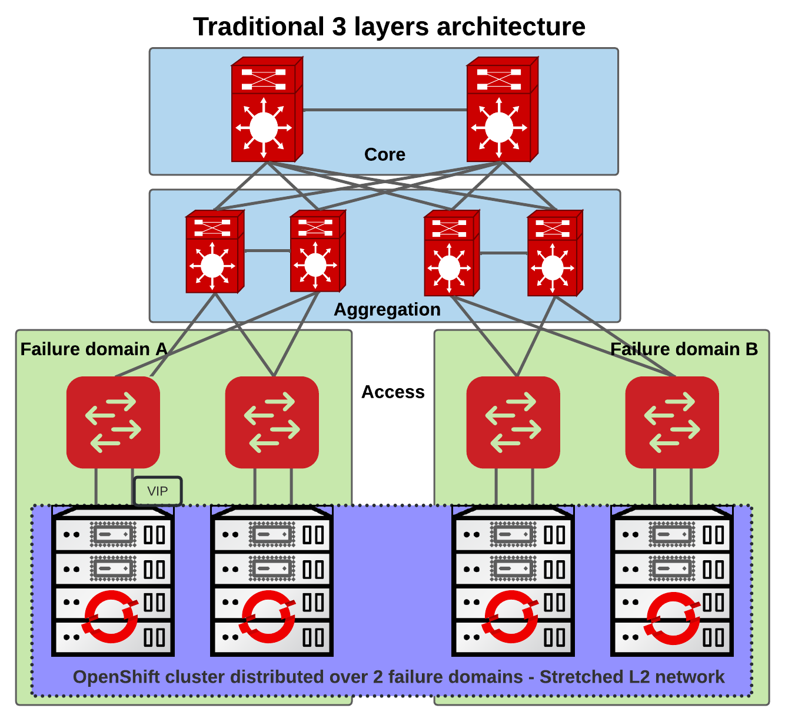
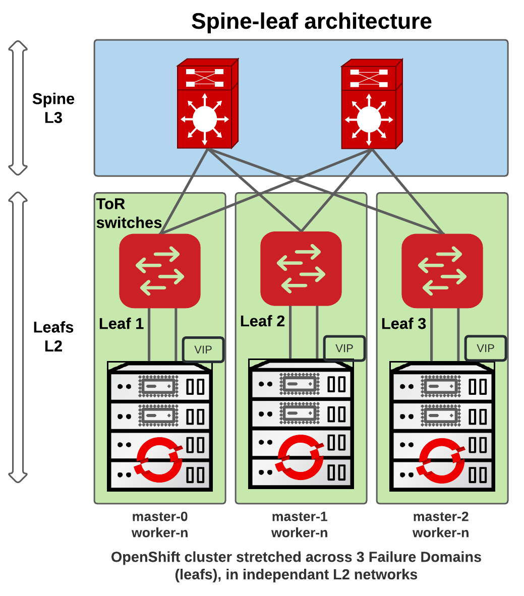

# In Cluster Network Infrastructure with BGP

## Release Signoff Checklist

- [ ] Enhancement is `implementable`
- [ ] Design details are appropriately documented from clear requirements
- [ ] Test plan is defined
- [ ] Graduation criteria for dev preview, tech preview, GA
- [ ] User-facing documentation is created in [openshift-docs](https://github.com/openshift/openshift-docs/)

## Summary

Customers deploying OpenShift on top of an on-premise infrastructure which includes bare metal, VMware vSphere,
OpenStack and Red Hat RHV have been using the well known bare metal networking stack which includes Keepalived and HAProxy (among other services).

While this architecture is now very mature, some customers have higher reliability and scalability
needs than before. These customers would like to distribute their cluster across multiple failure
domains where the OpenShift control plane would be spread across multiple networks and subnets. They
would remain connected by fast fabrics and are likely in adjacent racks, but for resiliency they no
longer share an L2 domain. For that, the VIPs (for both API and Ingress) would need to be able to
sit on multiple L2 domains. This involves that we propose a new architecture, with new tools and
options for our customers.

This enhancement suggests an alternative that replaces Keepalived and HAProxy by dynamic routing so the control plane VIPs will be highly
available and routable.

## Motivation

### Why not stretching L2 networks?

With the existing stack, customers who want to place their Control plane nodes on separate failure domains can extend their L2 networks across multiple domains.
However, stretching L2 presents challenges at scale:
- Network latency is not predictable
- Traffic bottlenecks (e.g. single Top Of Rack)
- L2 domain failures (e.g. broadcast storm)
- Network management complexity

Modern datacenters have adopted L3 protocols as part of their design and dynamic routing protocols help to
build more resilient networks running at higher speed, than the traditional L2 domains, where the premise is
that there is only a single path between two hosts.

This enhancement helps to integrate OpenShift control plane into a Spine-Leaf architecture where each leaf would be its own Failure Domain and a smaller than usual L2 network, easier to maintain and more performant.

### Traditional 3 layers architecture



In this design, the OpenShift nodes are placed on distinct zones (e.g. with OpenStack, Compute availability zones).
However, the same OpenShift nodes are attached to the same physical or virtual network thus sharing the same network (L2) failure domain.

### User Stories

1. As a deployer of OpenShift, I would like to increase the API and Ingress availability of the cluster
   so that OpenShift continues to function and continues to be reachable even in the event of a partial network outage.
2. As a network infrastructure engineer, I would like to reduce network L2 domains and move the data center to
   a modern L3 architecture so that I can reduce the complexity of the network infrastructure.
3. As an OpenShift administrator, I want OpenShift to use my existing BGP infrastructure to publish API and Ingress endpoints.
4. As an OpenShift administrator, I want my ingress traffic to not go through just one node, without having to use an external Load Balancer.


### Goals

The goal for this enhancement should be limited to providing a BGP-based solution for API and Ingress. We have [a separate enhancement proposal](https://github.com/openshift/enhancements/pull/1167)
for allowing the control plane to sit in different failure domains.

The minimal requirements includes:
- Implement, test, document and deliver the feature for OpenStack
- Highly available and dynamically routable (with BGP) load-balancing API access for external clients.
- Highly available and dynamically routable (with BGP) access for default ingress.
- Provide an interface for making use the BGP-based routing so other on-prem platforms like Baremetal, VMware vSphere, etc. can easily integrate the feature

### Non-Goals

The proposed BGP-based load-balancing requires an existing BGP infrastructure is already in place when deploying. For this reason the default load-balancing solution will remain Keepalived/HAproxy.
Also, while this enhancement will be implemented in a way that allows all on-premise platforms to use it, right now we haven't planned the work to implement and test it for platforms other than OpenStack.

## Proposal

We will automate additional capabilities in cluster network infrastructure.

These capabilities include:
- Highly available and dynamically routed load-balanced api access
- Highly available and dynamically routed ingress access

The assets needed for these capabilities' implementation are rendered by the [Machine Config Operator](https://github.com/openshift/machine-config-operator) (MCO) and
the [baremetal-runtimecfg](https://github.com/openshift/baremetal-runtimecfg) is used significantly within the manifests and templates of
the MCO project.
There are also changes in the API and installer projects, which are further described in sections below.

### Workflow Description

The installer accepts an LB type (default remains what it does today), which will be set into the Cluster Infrastructure Object. Then MCO will read the LB type and if it's BGP it will not deploy Keepalived/HAProxy. Instead, it will deploy FRR (a dynamic routing protocol suite, explained in details later) and configure it to peer with the BGP infrastructure.

### Spine-Leaf architecture



This architecture is a common design for data centers that have a spine-leaf architecture.
The OpenShift nodes are connected to the leafs, which are connected to the spine.
In our proposal, the control plane will peer with the leafs, and the leafs will peer with the spine, so the VIPs
will be routable across the network.

### API

We will propose a new [API](https://github.com/openshift/api/pull/1321) to configure Load Balancers, so we will be able to:
- Change the load-balancer type (default remains L2), to be able to enable BGP.
- If BGP is enabled, allow to provide a list of BGP speakers and their configurations.
- baremetal-runtimecfg will monitor this setting and generate the required configuration.

There will be some change in the API:

```golang
WIP - https://github.com/openshift/api/pull/1321
```

### Installer

A new [installer](https://github.com/openshift/installer/pull/6440) PR has been proposed, so it will be possible to:
- Populate the load-balancer type in the Cluster Infrastructure object, so it can be consumed later (e.g. by MCO).
- Define the load-balancer type and configuration from `install-config.yaml`.

For now, the API and Ingress VIPs can be any valid IP addresses, but we need to consider to create a new parameter `vipSubnet` so the installer can create the
ports in a specific subnet reserved for VIPs (when the platform requires it). If we don't do that, it can cause problems to platforms which use IP Address Management (IPAM). Since the VIP won't be in the same subnet as OpenShift machines,
we need to make sure that the platforms have a way to reserve the VIPs subnet and the installer will create the VIPs ports in that subnet.

Here is a proposal of install-config.yaml:
```yaml
platform:
  openstack:
    controlPlaneLoadBalancer:
      type: BGP
      bgp:
        speakers:
        - subnetCIDR: 192.168.10.0/24
          asn: 65000
          peers:
          - ip: 192.168.10.1
            password: f00barZ
        - subnetCIDR: 192.168.20.0/24
          asn: 65001
          peers:
          - ip: 192.168.20.1
            password: f00barZ
          - ip: 192.168.20.2
            password: f00barZ
        - subnetCIDR: 192.168.30.0/24
          asn: 65002
          peers:
          - ip: 192.168.30.1
            password: f00barZ
    apiVIPs:
    - 192.168.100.240
    ingressVIPs:
    - 192.168.100.250
    vipSubnets:
    - 5c64e9ea-f19e-4f7c-a2b1-61f2f8a2ec44
```

The installer would create the following `platformSpec`:
```yaml
platformSpec:
  openstack:
    controlPlaneLoadBalancer:
      bgp:
        speakers:
        - asn: 65000
          peers:
            ip: 192.168.10.1
            password: f00barZ
          subnetCIDR: 192.168.10.0/24
        - asn: 65001
          peers:
          - ip: 192.168.20.1
            password: f00barZ
          - asn: 65001
            ip: 192.168.20.2
            password: f00barZ
          subnetCIDR: 192.168.20.0/24
        - asn: 65002
          peers:
          - ip: 192.168.30.1
            password: f00barZ
          subnetCIDR: 192.168.30.0/24
      type: BGP
```

- *controlPlaneLoadBalancer* will be a new parameter containing all BGP configurations for the control plane.
  - *type* - VRRP or BGP (default FRR for backward compatibility.
  - *speakers* - provides a list of BGP speakers for each subnet that the control plane will be connected to.
    - *subnetCIDR* - platform agnostic parameter where each BGP speaker is attached to a specific subnet.
    - *asn* - this would be the autonomous system number for the speaker configuration in OpenShift.
    - *peers* - a list of routers to BGP peer with.
      - *ip* - IP address of the remote router to peer with.
      - *password* - the BGP password for the session.

Here is a proposal of some validations that would need to exist:
- ASN numbers are valid and follow RFC rules.
- The subnets defined in the speakers can only be defined once, which means that we don't allow subnet overlaps between the speaker configurations. This will make sure that when a nodes tries to find which BGP configuration it belongs to, that there is no ambiguity and no risk to pick up   
  the wrong speaker configuration.
- In a peer configuration, the IP addresses must be part of the subnet defined in the Speaker configuration.

### MCO

The MCO will be responsible for configuring the BGP speakers, based on the API and installer changes described above.
Further details are described in the following sections.

#### BGP

In order to route incoming traffic to the Control plane nodes (for the API VIP) and to the OpenShift compute nodes hosting the router (Ingress VIP), we propose using the Border Gateway Protocol.
[BGP](https://en.wikipedia.org/wiki/Border_Gateway_Protocol) is a routing protocol that is part of the Internet fabric and has already been used in OpenShift (e.g. MetalLB).
The nodes would advertise the API and Ingress virtual IPs to BGP routers already existing in the infrastructure.

#### FRR

[FRR](https://frrouting.org) will be used to peer BGP sessions with the rest of the infrastructure. It is a mature Linux Foundation routing protocol suite based on Quagga that has been used in many production deployments.
It is standardized in Red Hat products and is already used in OpenShift as a [backend for MetalLB](https://github.com/metallb/metallb/blob/38e16c385716464c140f359f7821db165262e329/design/0001-frr.md).

Alternatives:
- MetalLB (with FRR backend): while it is a great product, it currently doesn't work without a working Kubernetes API in place and as it was discussed [here](https://github.com/metallb/metallb/issues/168#issuecomment-1171100455), the implementation would be very complex and not really worth it for now.
  For the API VIP, we currently have a chicken and egg problem where we need to have the API VIP up to be able to deploy and run MetalLB. However, Ingress VIPs could potentially be moved (on day 2 by the customer) to a MetalLB deployment.
- [kube-vip as static pod](https://kube-vip.io/docs/installation/static/): this option has been evaluated and tested. The project is very interesting but we would find ourselves quickly limited
  by its feature set. For example, kube-vip doesn't have support for BFD, a detection protocol designed to provide fast forwarding path failure detection times, so we would need to deploy it ourselves.
  BFD is used to detect failures in the network infrastructure and to speed up the convergence of routing protocols. It is also used to detect failures in the BGP sessions.

#### Virtual IP addresses

VIPs (Virtual IPs) are used to provide failover of the services across the relevant machines
(including the bootstrap instance).
We need to provide VIPs for:
- API
- Ingress

##### API VIPs

The API VIPs are used for API communication and they are provided by the user
via the `install-config.yaml` [parameter](https://github.com/openshift/installer/blob/8fdc6e43889b111aeb233e5597d1f03d42bb297a/pkg/types/baremetal/platform.go#L177-L185)
or `openshift-installer` terminal prompts.

It can be a single IPv4 or IPv6 address, or comprised of both an IPv4 and an IPv6 address, in which case BGP must advertise both addresses.
The external `api.$cluster_name.$base-domain` DNS record should point to API VIPs.

##### Ingress VIPs

The Ingress VIPs are used for Ingress access and they are also provided by the user via the `install-config.yaml` [parameter](https://github.com/openshift/installer/blob/5f7fe178c007dce006d2d59800a5685a80591ede/pkg/types/baremetal/platform.go#L194-L201)
or `openshift-installer` terminal prompts.

It can be a single IPv4 or IPv6 address, or comprised of both an IPv4 and an IPv6 address, in which case BGP must advertise both addresses.
The external wildcard `*.apps.$cluster_name.$base-domain` DNS record should point to Ingress VIPs.


### Highly available routed VIPs
Access to the Kubernetes API (port 6443) and Ingress from clients both external
and internal to the cluster should be highly available across control plane machines.

The API VIPs first resides on the bootstrap instance and then move to all control plane nodes. The move will happen once the bootstrap process has completed, a FRR sidecar container residing on the boostrap will remove the VIP and FRR will update
the leaf routing that it doesn't have the VIP anymore. 

The Ingress VIPs will be created on the nodes where the Ingress Controller reports healthy.

FRR will be deployed as a [static pod](https://kubernetes.io/docs/tasks/administer-cluster/static-pod/) and the assets will be rendered by the Machine Config Operator.
When replacing a control plane machine, a new BGP session will be established with the peers. This causes no issues with the existing sessions by nature of BGP.

#### Init containers

- `copy-frr-static-configs`: This container will create two static files in `/etc/frr`, so FRR can be started and monitored:
  - daemons: this file will contain the daemons that FRR will run.
  - vtysh.conf: this file is required so the healthcheck can run (it will be used to check if FRR is running).
- `verify-api-int-resolvable`: This container already exists for Keepalived/HAProxy and helps to ensure that the internal VIP can be resolved before creating it.
- `render-config-frr`: This container will use baremetal-runtimecfg to render `frr.conf` based on a template that will be provided in MCO. Below we provide details on this file.

#### FRR container

This container will handle the start, stop and reload of BGP and BFD daemons in FRR.

- it will wait for the `frr.conf` configuration file to exist (generated by baremetal-runtimecfg) and then start BGP and BFD daemons once it exists.
- it will stop daemons if it gets a `stop` message via a socat handler running with baremetal-runtimecfg, like it's already done for HAProxy & Keepalived (and re-using the same conditions if we need to stop it for
  feature parity). This part is already implemented for HAProxy and Keepalived.
- it will reload daemons if it gets a `reload` message from the socat handler, if configuration on-disk was changed with the one currently running. See [FRR reload doc section](https://docs.frrouting.org/en/latest/setup.html#reloading).
- BGP and BFD daemons will be enabled by `copy-frr-static-configs` container.

FRR's configuration will be opinionated but flexible enough to meet customer needs. The BGP configuration will be defined like this:
- A list of BGP peers (usually their Top-of-Rack routers) IPs
- Each peer would have an IP address, a BGP password and an ASN

Note: customers won't be able to customize FRR and if they want a more advanced load balancer configuration, they'll have to use an external one so they have the full control over it.

#### VIPs management

This container will handle the creation and deletion of the VIPs.
Here's a programmatic way to describe how VIPs will be managed:

```bash
while :; do
    if check_health "api"; then
      echo "Healthcheck for API OK"
      for vip in $API_VIPS; do
        create_vip $vip
        create_vip_routing $vip
      done
    else
      echo "Healthcheck for API not OK"
      for vip in $API_VIPS; do
        delete_vip $vip
      done
    fi

    if check_health "ingress"; then
      echo "Healthcheck for Ingress OK"
      for vip in $INGRESS_VIPS; do
        create_vip $vip
        create_vip_routing $vip
      done
    else
      echo "Healthcheck for Ingress not OK"
      for vip in $INGRESS_VIPS; do
        delete_vip $vip
      done
    fi
    sleep 2
done
```

##### Health check

When checking for the health of a service (API and Ingress), we'll run a `curl` against the local service (API or Ingress) and check the response code.

As soon as a service becomes unavailable, the VIPs of the service are immediately removed and thanks to BFD, the route to reach the VIPs will be removed on
the upstream routers. This ensures the high availability of the VIPs.

##### Creating VIPs

VIPs will be created on a loopback device (lo) which is the most popular way because it's simple and we don't need to create a dummy device that consumes memory and reduces the cost of operations and maintenance. We use `ip address` command that is widely available, however we need to find a container image with the `iproute2` package
or maybe use `baremetal-runtimecfg`.

##### VIPs routing

Since the VIP won't be in the same subnet of the bootstrap and master nodes, we need to configure
routing on the host as well. We spent a bit of time investigating it and the problem with the VIP
traffic going back to its source (specially for HTTPS) is that the traffic path is asymmetric.
The destination MAC on the request was different than the source MAC the client was seeing on the reply;
and then packets were dropped.

We think that we have two options:
- Use a specific routing table that will route outgoing traffic coming from the VIP and supposed
  to go to the nodes subnet, to go through the gateway so that the traffic back follows the same
  path as the traffic in.
- For all the hosts in the nodes subnet, provide a direct route to reach the VIP.

We decided to go with the first option (VIP traffic goes through the router in and out) because the VIP will be
active/active on multiple nodes (masters).
While this sounds complex, this comes due to abusing the deployment having different subnet IPs
on the same segment and expect it to not go through the router, so we need to make symmetric traffic.

This implies to create an IP table on each node where FRR will be running, that will enforce the describe behavior:
```bash
ip rule add from $VIP to $NETWORK_CIDR lookup <number value>
ip route add default via $GATEWAY table <number value>
```


#### frr-monitor

This container will have in charge:
- Generate `frr.conf` configuration file so FRR can work correctly
- Watch for configuration changes or events that require FRR daemons to stop or reload.

The code will live in baremetal-runtimecfg among other monitors (HAProxy, Keepalived, etc).

### Load balanced VIPs

With Keepalived, the VIPs were located on one (elected) host (using [VRRP](https://fr.wikipedia.org/wiki/Virtual_Router_Redundancy_Protocol)) and HAProxy on that node
would distribute the traffic across available control plane nodes.

We will provide recommendation in the documentation on how to configure load-balancing, but ultimately the responsibility falls to the network administrator.
With BGP anycast, the VIPs will reside on all control plane hosts, and upstream routers (e.g. ToR) will define the best route (according to BGP protocol) and depending on how the routers
are configured, will load-balance the traffic depending on how the infrastructure network is configured.
For example, if the ToR router is a Linux machine, we can control which hash policy to use for multipath routes with
`fib_multipath_hash_policy` in sysctl and choose if we want L3 or L4 load balancing. If a Cisco router is used, the `maximum-paths` option can be helpful. It really
depends on the upstream router and BGP infrastructure that is in place, and not managed by OpenShift.


### baremetal-runtimecfg

[baremetal-runtimecfg](https://github.com/openshift/baremetal-runtimecfg) is used for rendering the manifests and templates of the machine-config-operator project, it also supports runtime update of the configuration templates (e.g: update FRR config in case a new BGP peer added to the BGP Configuration for the platform) based on the current system status.

The next capabilities are supported by the `baremetal-runtimecfg`:
- Based on the network configuration on the host, it'll find which BGP configuration needs to be applied on the host. For that, it'll follow that logic:
  - If controlPlaneLoadbalancer is of the type BGP, then it'll get all speaker configurations.
  - Each node has an `InternalIP` address that we can find in `node.Status.Addresses`. We'll have a function that find which BGP speaker subnet matches with the node IP. If more than one speaker has matched, we'll return a failure because we don't
    expect the control plane nodes to be connected to more than one subnet used for BGP peering. For example, if the machine has the InternalIP being 192.168.0.10 and there is a speaker that has the subnet CIDR being 192.168.0.0/24, it'll match and the speaker configuration will be applied to that machine.
- `renders templates` using [values provided at command line](https://github.com/openshift/baremetal-runtimecfg/blob/master/cmd/runtimecfg/render.go), parameters retrieved from the cluster (e.g: control plane nodes) and
  - api-vips
  - ingress-vips
- `frr monitor`: verify that the desired configuration is synced with the cluster. As seen before, it's used from a side-car container in the FRR pod.

### API Extensions

We introduce new CRDs via https://github.com/openshift/api/pull/1321.

### Implementation Details/Notes/Constraints

#### Bootstrap

This paragraph is WIP.

how does the bootstrap node know its configuration?

BGP configuration is written to kube-apiserver as manifests during installation. But... how do we
know which subnet we're on so we know which to apply for the bootstrap node?

#### Control plane cold start

This paragraph is WIP.

A critical difference between this solution and keepalived (and external loadbalancers), is that
keepalived's configuration is static on disk, whereas with BGP we update the configuration by
rendering a new `frr.conf` using values ultimately sourced from the api server. This means that
unlike with keepalived we have a dependency on the api server before we can publish the API VIP. We
need to ensure that baremetal-runtimecfg can publish the API VIP without requiring an API VIP to
already have been published.

Static pods, including the frr pod, connect to the API VIP. 

#### MetalLB

MetalLB is a load-balancer implementation for bare metal Kubernetes clusters, using standard routing protocols and backed by FRR when using BGP as a protocol.

For now, we recommend separating the MetalLB deployment from the workers where Ingress Controller runs.
This is because the MetalLB deployment is configured to use the same BGP peers as the ones used by our implementation.
The [MetalLB documentation](https://metallb.universe.tf/configuration/_advanced_bgp_configuration/#limiting-peers-to-certain-nodes) explains how to decide where to run peers on certain nodes by using the node-selectors attribute of peers in the Peers configuration. The semantics of these selectors are the same as those used elsewhere in Kubernetes, so refer to the [labels documentation](https://kubernetes.io/docs/concepts/overview/working-with-objects/labels).

Therefore:
- Managing Ingress with MetalLB is out of scope for this enhancement proposal.
- When deploying a compact cluster (3 masters, no workers), MetalLB can't be run if the control plane has BGP enabled for the API and Ingress VIPs.

#### Customer requirements

With this new implementation, the customer needs to have a BGP infrastructure in place to be able to deploy and use the OpenShift cluster (which is why we will never make it the default implementation).

Here is a list of requirements that the customer needs to have in place:

- A BGP router (or multiple) that can peer with the BGP peers on the control plane nodes.
- ICMP redirects are disabled on the router(s) that will peer with the control plane nodes. This is needed to ensure that the router(s) does not send an ICMP redirect message when traffic destined to the VIPs is received on a node where the VIP is not configured. This is needed to ensure that the traffic is not black-holed in the network.
- Ensure that hash-based load balancing is used for the routes to the VIPs. This is needed to ensure that the traffic is equally distributed across the control plane nodes (ideally source port hashing is used consistently in the infrastructure).

We will need to document the requirements and the steps to configure the BGP infrastructure, as well as providing as much as possible some validation tools to help the customer to configure the BGP infrastructure correctly.

#### Networking infrastructure maintenance

Router(s) that will peer with the control plane nodes need to be maintained by the customer, but in case of a failure, it's possible that the BGP configuration has to change.
Therefore, we need to provide a way for the customer to update the BGP configuration of the control plane nodes.
The customer would update the BGP Configuration via the OpenShift API, and baremetal-runtimecfg which would monitor the Infrastructure object would update the configuration of the control plane nodes and reload FRR.

### Risks and Mitigations

- This design heavily relies on the infrastructure network that is not controlled by OpenShift. Documentation and validations will be provided
  to ensure that prerequisites are met before a deployment can be done using BGP
- Performance can be degraded if infrastructure network has routing problems, but routing issues would also involve a general outage, not just control plane VIPs. To a certain extent, this is out of our control,
  but we'll provide documentation and tools to help the customer to configure the infrastructure network correctly and also run FRR healthchecks that will alert the customer if something is wrong with the BGP sessions.
- The opinionated configuration for FRR might be too simple for now, but we'll adjust it as we get feedback from customers and field deployments

### Drawbacks

The proposed solution heavily relies on the network infrastructure at the data center level and if something goes wrong
with BGP, the OpenShift cluster can become very unstable.
Also, the solution remains complex to implement and corner cases will have to be documented and covered by testing when possible (e.g. day 2 operations).

## Design Details

### Test Plan

Testing will be implemented for OpenStack at first and re-usable by other platforms.
We'll provide a set of scripts that can install ToR routers and this will be used to replicate
the network infrastructure that customers could run.
The jobs will do the following:
- Create a proxy node that runs FRR and will be the upstream router for the OpenShift cluster
- Deploy the OpenShift cluster and provides an `install-config.yaml` that has the needed options for BGP
- Run the desired e2e test suite

### Graduation Criteria

#### Dev Preview -> Tech Preview

These following requirements will apply first for OpenStack, and once this has proven to be stable, we'll turn this on for other platforms:
* The code has been merged into various components (API, installer, MCO, baremetal-runtimecfg)
* We have an image for FRR
* Feature is documented
* Feature is tested in CI

Once these requirements are met, then we'll deliver this feature as Tech Preview. The current desired target is OCP 4.13.

Note: OpenStack 16.1 or 16.2 or 17.1 are the recommended versions to run at the moment.

#### Tech Preview -> GA

To go GA, this feature will have to be proven to be stable enough and tested by our QE.
The current desired target is OCP 4.14.

#### Removing a deprecated feature

### Upgrade / Downgrade Strategy

We don't plan to offer a migration path from L2-based load-balancing to a BGP-based one.

### Version Skew Strategy

### Operational Aspects of API Extensions

#### Failure Modes

A failure of BGP to peer routes that help to reach the VIPs can have a critical impact on cluster health.
This is why we'll implement proper health checks and monitors, and also that we'll provide recommendations
for customers who will deploy this architecture, for example router redundancy.

#### Support Procedures

It won't be possible to upgrade a cluster from Keepalived/HAProxy to BGP. The customer will have to create a new cluster.
The feature will only be supported once marked GA and on fresh deployments.

## Implementation History

- [2022-11-04] Initial enhancement proposal

## Alternatives

- Make MetalLB working on a static pod and being able to work without Kubernetes API during the bootstrap.
- Use kube-vip instead of FRR.
- Do nothing and keep using Keepalived, with stretched L2 and document scalability limitations.
