# Persistent IPs for SDN secondary networks

## Summary

This enhancement proposal focuses on tying IP address allocation to Virtual
Machines instead of the pods where they run. In short, the IP allocation
should be available during the Virtual Machine lifecycle, rather than the
lifecycle of the pod where it runs on.

## Motivation

Openshift Virt customers want to offload IPAM from their custom solutions
(e.g. custom DHCP server running on their cluster network) to SDN.

The other alternative - static IP address allocation - is also not ideal for
virtualization users, given how cumbersome it is - i.e. specifying the IP for
each VM's interface.

### User Stories

- As an Openshift Virtualization user, I want my VMs to automatically get IP
addresses from a configured range, so I don't need to manage my own IP pools,
DHCP server, or static IP configuration.
- As an Openshift Virtualization user, I want to migrate (one of) my VMs to
another node, preserving the networking configuration, so the IP-aware
applications running in the VM are not impacted.
- As an Openshift Virtualization user, I want to start Virtual Machines
(currently stopped) with the original VM network configuration, so the IP-aware
applications running in the VM are not impacted.
- As an Openshift network administrator, I want to decide which networks can be
subject to having persistent IP allocations surviving VM migration, and VM stop.

### Goals

- Manage Openshift Virtual Machines IP addresses from within the SDN solution
provided by OVN-Kubernetes.
- IPv4 range can be defined on OVN Kubernetes secondary network
- VMs are able to get a IP from this subnet
- The IP sticks to a VM during live-migration
- The IP sticks to a VM even if it is temporarily shut down

### Non-Goals

- IPv6 support is not required.
- This enhancement's scope is limited to secondary networks - i.e. the default
  cluster network's IP allocation should still follow the pod lifecycle.

## Proposal

### Workflow Description

#### Creating a Virtual Machine
The user initially requests a virtual machine (VM) to be created. If they
desire their VM to have "sticky IPs" - i.e. the IP allocations to outlive the
pod the VM runs on - the following requirements must be met:

- the KubeVirt CR must have the required feature gate enabled: e.g.
  `VMPersistentIPs`
- the NAD holding the configuration for the secondary network must allow for
persistent IPs - `{..., "allowPersistentIPs": true, ...}`

If the KubeVirt feature gate is enabled, KubeVirt will create the `IPAMClaims`
for each multus non-default network, thus declaring intent of having persistent
IP allocations for those interfaces.

The IPAM CNI plugin will then react accordingly and if the NAD configuration
allows it, allocate IPs from its pool - which will be persisted in the
`IPAMClaim` status. Finally, the CNI will configure the interface with these
IP addresses.

Please refer to the diagram below to better understand the proposed workflow
for VM creation:
1. the user provisions a VM object
2. the KubeVirt controller creates an IPAMClaim for each multus non-default
  network in the corresponding VMI spec
3. OVN-K reacts to the creation of the `IPAMClaim`s. It will generate IP address
  from the required IP pools, and update the corresponding `IPAMClaim` with the
  generate IPs.
4. this step occurs in parallel to step 3; KubeVirt templates the KubeVirt
  launcher pod, featuring in each network selection element the name of the
  claim where the CNI will find the IP address.
5. the CNI plugin will see this network has persistent IPs enabled; it will
  then look in the pod's network selection elements for the claim name where
  the persistent IP address will be located. If it doesn't find it there, the
  plugin will retry later, using exponential backoff. Once the `IPAMClaim`
  features the IPs in the status, the OVN-Kubernetes CNI will configure the
  pod's OVN annotations with this IP, which will in turn trickle down to the
  pod interface.

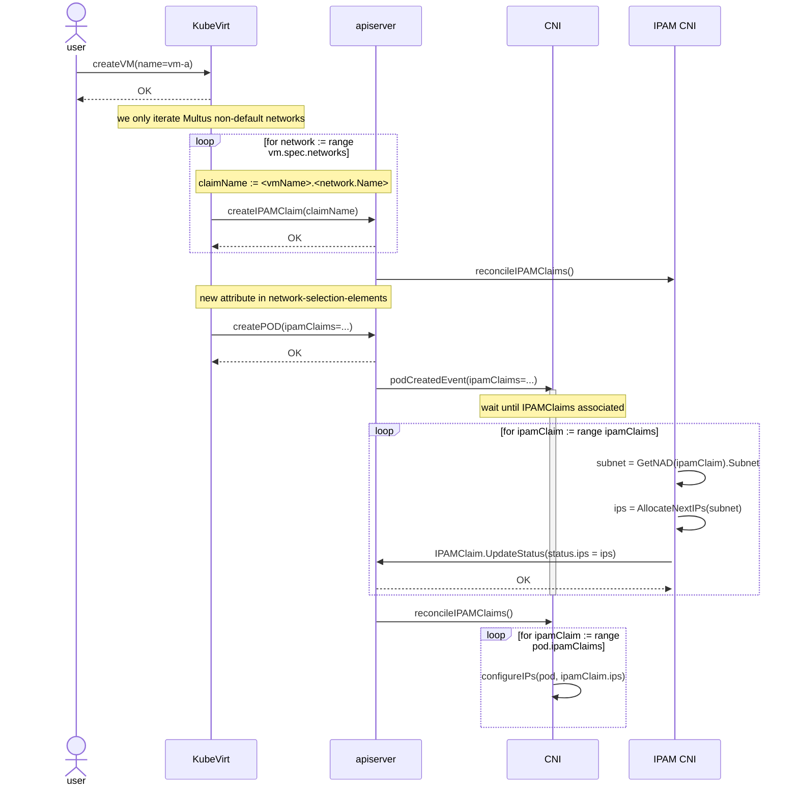

**NOTES**:
- When the feature gate is not enabled, KubeVirt will **not** request
  persistent IP allocations from the CNI.

#### Stopping a Virtual Machine
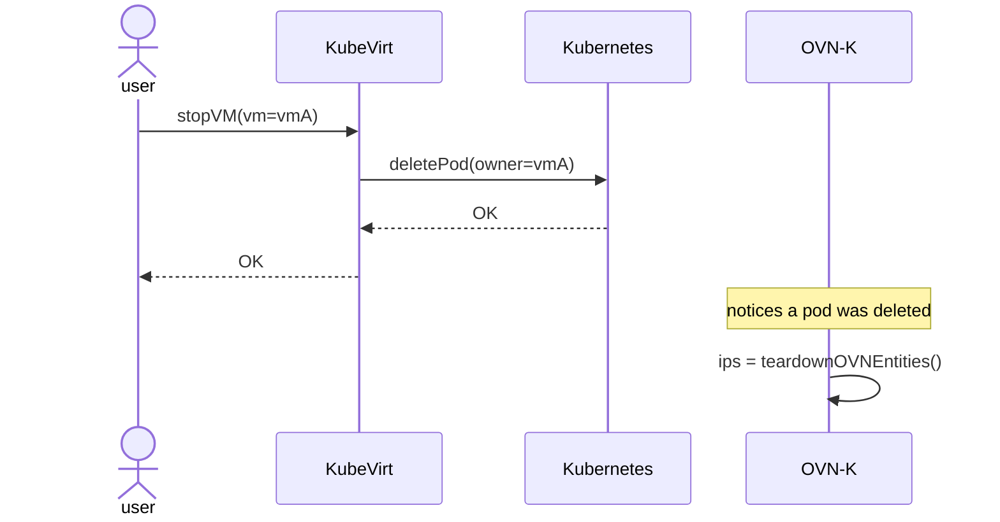

OVN-Kubernetes will **not** delete the `IPAMClaim` CRs for the deleted VM pod.
The IP addresses allocated to the VM will **not** be released to the IP pool
when there's a corresponding `IPAMClaim` for the attachment being deleted.

#### Starting a (previously stopped) Virtual Machine
This flow is - from a CNI perspective - quite similar to the
[Creating a VM flow](#creating-a-virtual-machine):
1. the workload controller (KubeVirt) templates the pod, featuring the required
   `IPAMClaim` references in each network selection element.
2. OVN-Kubernetes will read the network selection element; if it sees an
   `IPAMClaim` reference, it will attempt to read it from the datastore.
3. if the read `IPAMClaim` features IP addresses in its status, OVN-Kubernetes
   will configure the interface with those IPs. If the status doesn't feature
   IP addresses, the CNI plugin will retry later, with exponential backoff.

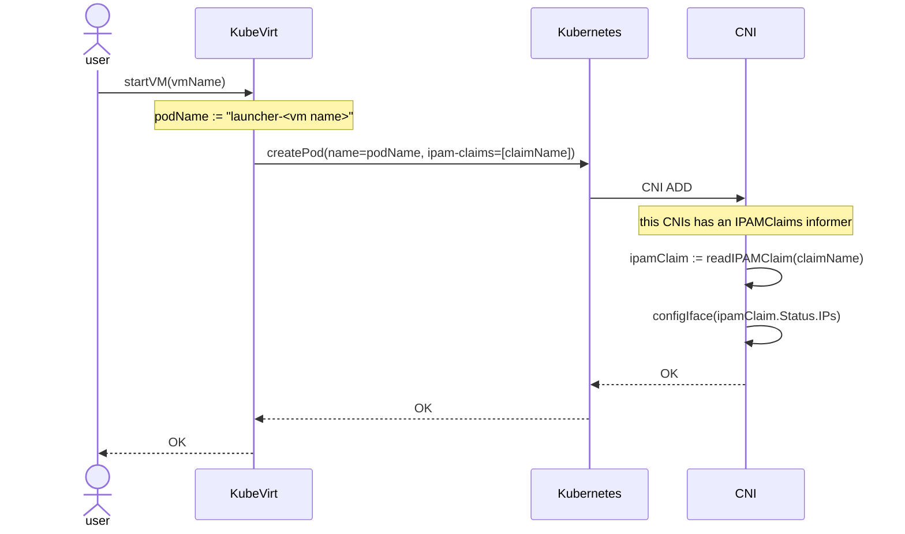

When creating the pod, the OVN-Kubernetes IPAM module finds existing
`IPAMClaim`s for the workload. It will thus use those already reserved
allocations, instead of generating brand new allocations for the pod where the
encapsulating object will run. The migration scenario is similar.

#### Removing a Virtual Machine
This flow is - from a CNI perspective - quite similar to the
[Stopping a VM flow](#stopping-a-virtual-machine). The main difference is after
the VM is deleted, Kubernetes Garbage Collection will kick in, and remove the
orphaned `IPAMClaim`s. OVN-Kubernetes will need to react to the `IPAMClaim`
delete event, to return those IP addresses to the respective IP pools.

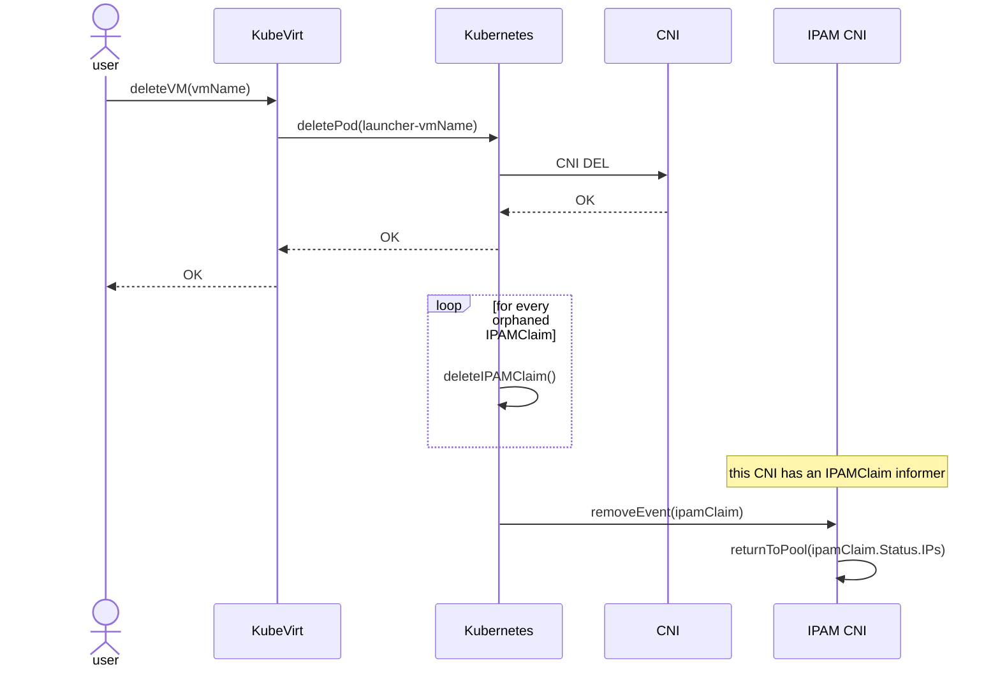

### API Extensions

We plan on adding a new CRD that would be hosted in the k8snetworkplumbingwg,
and hopefully accepted as part of the
[Kubernetes multi-networking de-facto standard](https://github.com/k8snetworkplumbingwg/multi-net-spec).
Meaning we envision other plugins with IPAM functionality to use this CRD to
provide persistent IPs for their workloads.

- Adds a new `IPAMClaim` CRD. OVN-Kubernetes will provision these to
  "block" the IP allocation during the VM object lifecycle.
  - It must be "owned" by the pod's encapsulating object (i.e. VM) - thus
  allowing Kubernetes to GC it once they're gone. To comply with Kubernetes GC,
  the `IPAMClaim` **must** be created in the same namespace as its owner.
  - It must be "retrievable" by OVN-Kubernetes (i.e. so the "old" VM gets the
  same IP when in runs in a "new" pod). For that, we will compose a unique key
  with the required information, allowing the clients to get the CR by name.

This is the proposed spec of the CRD:
```yaml
apiVersion: "ipamclaims.k8s.cni.cncf.io/v1alpha1"
kind: IPAMClaim
metadata:
  name: vm-a.tenantred  # this is the name of the VMI.Spec.Network, which is
                        # unique for each VMI
  namespace: ns1
  ownerReferences:
  - apiVersion: kubevirt.io/v1
    kind: VirtualMachine
    name: vm-a
    uid: a0790345-4e84-4257-837a-e3d762d191ab
spec:
  network: tenantred
  interface: pod16367aacb67
status:
  ips:
  - 10.128.20.8/24
  - fd10:128:20::8/64 
```

We also propose a new attribute to be added to the network selection elements,
allowing the workload controller (KubeVirt, which templates the pod) to
indicate to the CNI plugin which `IPAMClaim` it should use. Remember that IPAM
CNI will store the generated IP there, while the CNI plugin will consume and
honor it.

From OVN-Kubernetes perspective, it **must**:
- **not** delete `IPAMClaim`s for encapsulating entities once their pods
  are deleted. We need to follow the lifecycle of the encapsulating entity,
  described via the `metadata.ownerReferences` attribute. I.e. if we're
  deleting a pod where a KubeVirt VM will run, do not remove the `IPAMClaim`
  allocation when processing the CNI delete.
- the IPAM side of OVN-Kubernetes needs to react to the `IPAMClaim` creation,
  generate an IP for it, and update the `IPAMClaim` status with those IPs.
- when persistent IPs are requested by the network admin (via the network
  attachment definition) the CNI side of OVN-Kubernetes must wait for the
  corresponding `IPAMClaim` to have IPs in its status. Once it does, it will
  configure the interface.

Deleting the  `IPAMClaim` from the datastore when the pod is deleted will be
performed by Kubernetes (garbage collection) once the Virtual Machine
(i.e. owner) is removed. In the example above, that `IPAMClaim` will be
garbage collected by Kubernetes when the `VirtualMachine` named `vm-a` with UID
`a0790345-4e84-4257-837a-e3d762d191ab` is deleted.

### Implementation Details/Notes/Constraints

### Risks and Mitigations

When building the OVN-Kubernetes IPAM module IP pools, it will be needed to
take into account these persistent IPs as well. Thus, there will be a resource
to sync when adding a pod requesting an attachment to a network allowing
persistent IPs.

Using informers to know the `IPAMClaim`s CRs will mitigate this risk, since
we will not actively synchronously call the Kubernetes API for reading.

### Drawbacks

## Design Details

### KubeVirt related changes

KubeVirt would need to template the pod accordingly - i.e. the
`NetworkSelectionElements` must feature the `ipam-claim-reference` attribute to
indicate to the IPAM CNI / CNI which `IPAMClaim` they should use to persist the
IP allocation across reboots / migrations.

Check the following network selection elements annotation from a KubeVirt
launcher pod to see an example:

```bash
kubectl get pods <launcher pod name> -ojsonpath="{ @.metadata.annotations.k8s\.v1\.cni\.cncf\.io\/networks }" | jq
[
  {
    "name": "tenantred",
    "namespace": "default",
    "interface": "pod16367aacb67",
    "ipam-claim-reference": "vm-a.tenantred-attachment"
  }
]
```

#### KubeVirt feature gate
We recommend to protect this feature behind a feature gate, at least in the
beginning. When enabled, KubeVirt will **always** declare its intent of having
persistent IP allocations for all its VM secondary networks (i.e. multus non
default networks).

#### KubeVirt API changes

The persistent IP allocations represented by the `IPAMClaim` objects should be
reported in the VM status, allowing the user to easily identify which IPs are
pinned for the VM.

Thus, we propose the adding the following struct to the
[VirtualMachineStatus](https://github.com/kubevirt/kubevirt/blob/960484df024ae8cce0f189d5f492667c4d57b250/staging/src/kubevirt.io/api/core/v1/types.go#L1486)
structure:

```go
// VirtualMachineStatus represents the status returned by the
// controller to describe how the VirtualMachine is doing
type VirtualMachineStatus struct {
	...
	NetworkInterfacesStatus []NetworkInterfaceStatus `json:"networkInterfacesStatus,omitempty"`
}

type NetworkInterfaceStatus {
	InterfaceName string   `json:"interfaceName,omitempty"`
	IPs           []string `json:"ips,omitempty"`
}
```

**NOTE:** this change is **not** required. It does provide helpful information
to the VM user.

### OVN-Kubernetes related changes
When the OVN-Kubernetes `ovnkube-control-plane` pod realizes the network
selection element features `ipam-claim-references`, it will allocate IP
addresses from the pools, plus update the existing `IPAMClaim` CR with them.

The next sections feature specific information on how to integrate this new CRD
in the existing OVN-Kubernetes IP pool.

#### Integrate the `IPAMClaim` CRD with OVN-Kubernetes ip pool

We plan on integrating the proposed `IPAMClaim`s CRD with the existing
OVN-Kubernetes IP pool allocation mechanism by reacting to different events:
- ovnkube-control-plane start
- `IPAMClaim` CR add.
- `IPAMClaim` CR delete.

The updates to the `IPAMClaim` CR will not be supported.

#### Integrate the CRD with the OVN-K IP pool on ovnkube-control-plane start

When the ovnkube-control-plane starts, it invokes - for every pod in the system -
the `AllocateIPs` function from the allocator. We will need to also read all
the `IPAMClaim`s from the informer cache, and invoke the `AllocateIPs`
function for each of the persisted IPs, as depicted in the following diagram.

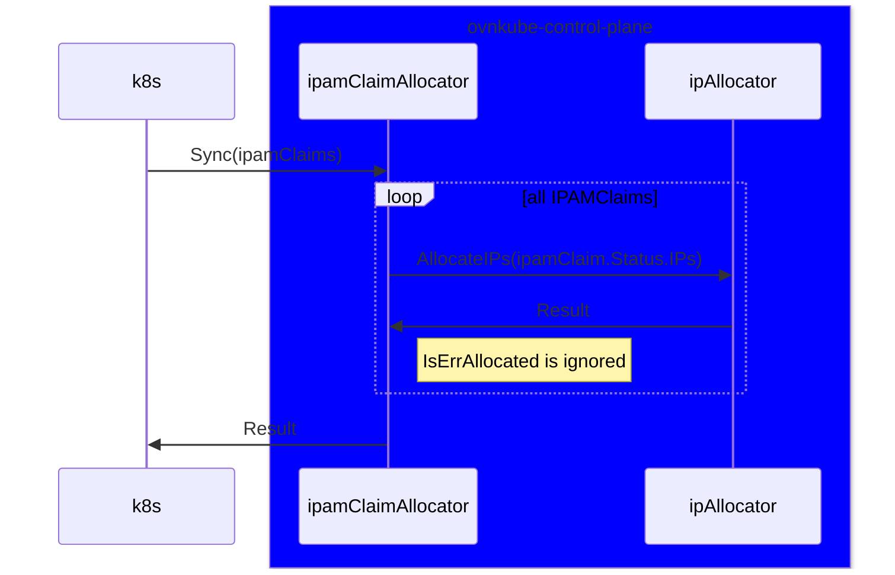

It is important to refer this flow happens exclusively in the ovnkube control
plane (as done today for IPAM allocation).

For running VMs, it is expected the allocation to fail when provisioning the IP
(since it was already allocated for the running pod). In this case, we simply
ignore the error and return.

For stopped virtual machines, we ensure the allocation is blocked in the pool,
thus unavailable for future workloads.

The following diagrams show how the OVN-Kubernetes control plane flow would
look like:

##### Create VM - IP pool flow
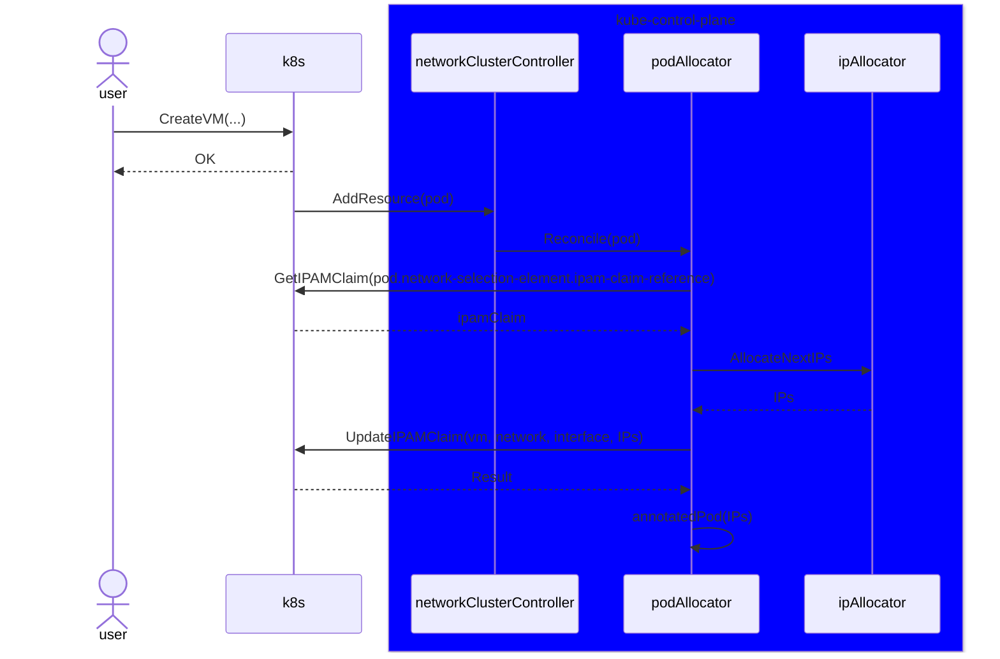

##### Stop VM - IP pool flow
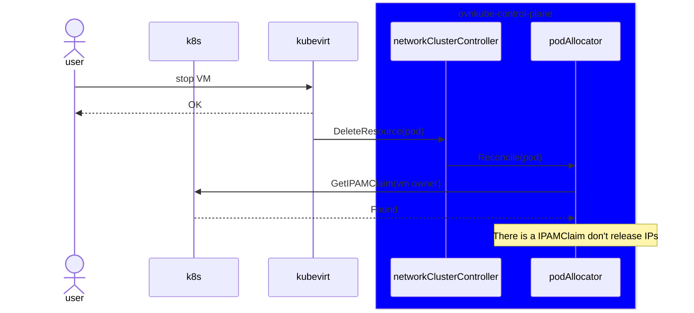

##### Start stopped VM - IP pool flow
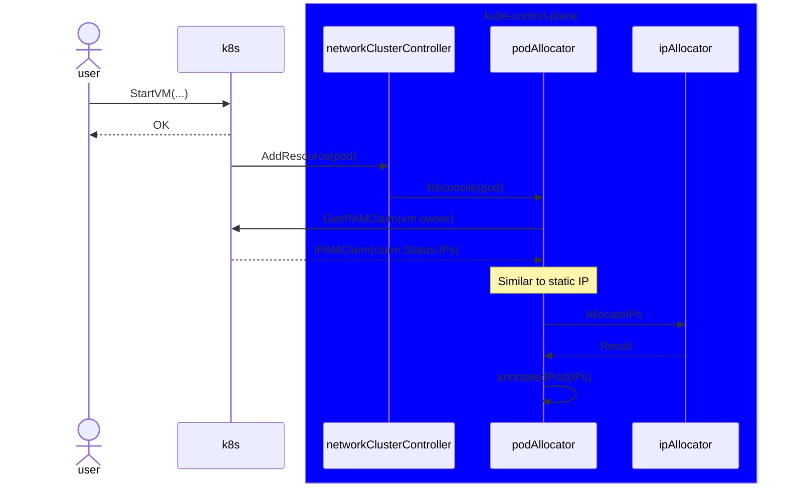

##### Delete VM - IP pool flow
When a persistentIP allocation is removed from the datastore (via Kubernetes GC
), we must return said IP address to the pool, by invoking `ReleaseIPs` for
every IP in it.

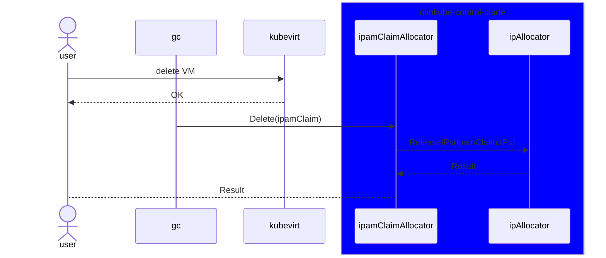

### Kubernetes Garbage Collection extended info

This feature is relying on Kubernetes garbage collection to delete the
persistent IP allocations once the Virtual Machine object is deleted.

But, we actually need to assure the persistent IP allocation stays around as
long as the running Virtual Machine (i.e. the process) is running - thus, we
also need to ensure the pod where the VM runs was deleted. If it weren't, we
will end up in a situation where the IP would be returned to the pool earlier
than it should, which would lead to the same IP in two workloads at the same
time: one of them shutting down, the other already readily processing traffic.

#### KubeVirt finalizers

The VM has a finalizer that prevents it from being deleted while the Virtual
Machine Instance (VMI, represents a running VM) is around; the VMI - in turn -
has a finalizer that prevents it from being deleted until the pod where the VM
runs is deleted.

Different
[DeletionPropagation](https://github.com/kubernetes/apimachinery/blob/3e2600dc79feea6cdc8a9224bc8a6a7fcfee1466/pkg/apis/meta/v1/types.go#L526)
values will impact how Kubernetes will garbage collect the `IPAMClaim`s when
deleting the VM object from the datastore. The default deletion propagation is
`background`.

#### Deleting the VM with background `DeletionPropagation`

The following sequence diagram describes how Kubernetes GC works for the
KubeVirt entities (VM / VMI / pod):

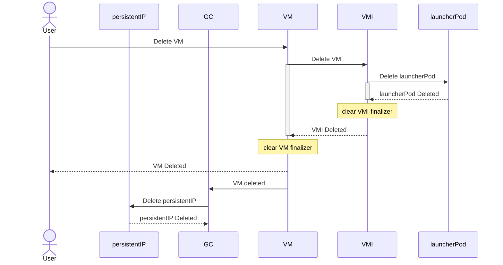

The two finalizers mentioned above ensure the VM object is only removed from
the datastore after the VM has actually stopped. Since the `IPAMClaim`
allocation is only removed **after** the VM is gone, we have avoided the
potential issue previously described.

#### Deleting the VM with foreground `DeletionPropagation`

When using the foreground `DeletionPropagation`, the dependent object's - e.g.
the VMI, and the persistentIP allocations - deletion will be triggered
**before** the VM is actually deleted.

Given the existing finalizers set in the VM and VMI object, the VM object will
not be deleted while the pod is in the datastore - but the corresponding
`IPAMClaim` CR will be scheduled for deletion.

Thus, when the foreground deletion propagation is chosen, the IP is returned to
the pool while the VM is still shutting down (or about to start to ...), which
will lead to the probable scenario described above: another workload will be
assigned the IP for a VM which is still running.

#### Deleting the VM with orphaned `DeletionPropagation`

When using the orphaned `DeletionPropagation`, the dependent objects - e.g.
will **not** be deleted by the garbage collector. I.e. the user is asking for
the dependent resources to leak.

#### Recommendation

The simplest way to work-around this issue is simply to only allow `background`
propagation deletions.

Our proposal is for the KubeVirt validating webhook to reject VM foreground/
orphaned delete propagations **whenever** it features an interface for which
a persistent IP was requested.

#### Alternatives for preventing the premature release of an IP to the pool

We could also decorate the `IPAMClaim` with a finalizer, and remove it once
the corresponding VMI is deleted. The finalizer would be set by whoever creates
the `IPAMClaim` object.

This approach is favored by the KubeVirt team, since it follows the same
pattern as PVCs.

### Open Questions

1. should we delegate IP allocation to a separate IPAM plugin ?
2. should we update KubeVirt's VM API to present the "persistent" IPs in its
  status ?

### Test Plan

End to end tests will be required to assert the IP allocations for a given VM
survive the following scenarios:
- live migration of the VM
- stop then start a running VM

We would also require tests to assert we can now use namespace/pod selector
multi-network policy peers for secondary networks **with** IPAM.

The tests should be available in the upstream project of the IPAM CNI plugin.

### Graduation Criteria

#### Dev Preview -> Tech Preview

- Ability to utilize the enhancement end to end
- End user documentation, relative API stability
- Sufficient test coverage
- Gather feedback from users rather than just developers
- Enumerate service level indicators (SLIs), expose SLIs as metrics
- Write symptoms-based alerts for the component(s)

#### Tech Preview -> GA

- More testing (upgrade, downgrade, scale)
- Sufficient time for feedback
- Available by default
- Backhaul SLI telemetry
- Document SLOs for the component
- Conduct load testing
- User facing documentation created in [openshift-docs](https://github.com/openshift/openshift-docs/)

#### Removing a deprecated feature

TODO

### Upgrade / Downgrade Strategy

TODO

### Version Skew Strategy

TODO

### Operational Aspects of API Extensions

All the API reads will happen via informers, thus the API impact will be minimal.

#### Failure Modes

The feature is compartimentalized in order to protect the default cluster
network. It will not impact it in any way.

Performance impacts will impact IP address assignment in the network's scope,
thus other networks are also not impacted.

#### Support Procedures

If the IPAM plugin fails to generate an `IPAMClaim` for the VM, an event will
be thrown, and the error logged.

## Implementation History

TODO

## Alternatives

### Delegate the IPAM functionality to a CNI IPAM plugin

Below you can find a Network Attachment Definition requesting delegated IPAM
from a separate IPAM plugin.

```yaml
---
apiVersion: "k8s.cni.cncf.io/v1"
kind: NetworkAttachmentDefinition
metadata:
  name: whereabouts-conf
spec:
  config: '{
      "cniVersion": "0.3.1",
      "name": "l2-network",
      "type": "ovn-k8s-cni-overlay",
      "topology":"layer2",
      "mtu": 1300,
      "netAttachDefName": "default/whereabouts-conf",
      "ipam": {
        "type": "whereabouts",
        "log_file": "/var/log/wb.log",
        "log_level": "debug",
        "range": "192.168.2.0/24"
      }
    }'
```

Thus, we would have the following three behaviors:
- cni conf without a subnet defined **and** without IPAM key defined => only
  static IP can be requested
- cni conf without a subnet defined **but with** the IPAM key defined =>
  delegate IPAM to an external plugin
- cni conf with the subnet key defined => OVN-K provided IPAM for the provided
  subnet

**NOTE**: it results in an error if the user attempts to define **both** the
subnet **and** the IPAM key at the same time.

#### Why this alternative was not considered further

Implementing the sticky IPs feature in separate IPAM plugins will prevent this
solution from being used on the default cluster network for the HyperShift
use cases, in which point to point routing is used to ensure the IPs persist
during the migration of KubeVirt nodes. In fact, it will also not be usable for
`layer3` topologies (secondary networks) since those topologies feature a
subnet per node.

Furthermore, performance wise, implementing the "sticky IPs" feature in the
IPAM plugin - e.g. whereabouts - might not be a good option since we would need
to invoke the IPAM plugin via CNI exec based API - i.e. invoke the CNI IPAM
binary on disk, get the result (the IP), and then use said IP in the entire
flow. Invoking the IPAM plugin is a synchronous operation that would block the
OVN-Kubernetes plugin until it gets the response back.

Adding insult to injury, given whereabouts instances actively compete for a
datastore lock to update the IP pool allocations, need to check for the
presence of overlapping IPs, and would - on top - have to also query the
datastore for the presence of existing persistent allocations / persist new
allocations, it is probable the time it takes to provision a pod to grow.

Implementing a new CNI IPAM plugin - or refactoring whereabouts to address its
shortcomings - would be a major effort.

### Separate IPAMClaims controller

This alternative approach requires a separate controller to monitor both
`IPAMClaim` and `NetworkAttachmentDefinition` objects.

Let's break down the changes required in each of the projects.

#### CRD - Kubernetes network plumbing WG
In this alternative, the CRD requires a status sub-resource, since the client -
e.g. KubeVirt - expresses its intent in having persistent allocations for the
VMs by creating the CR, while the controller must calculate the allocations,
and update it accordingly - in the status.

```yaml
apiVersion: "ipamclaims.k8s.cni.cncf.io/v1alpha1"
kind: IPAMClaim
metadata:
  name: vm-a.tenantred.pod16367aacb67
  namespace: ns1
  ownerReferences:
  - apiVersion: kubevirt.io/v1
    kind: VirtualMachine
    name: vm-a
    uid: a0790345-4e84-4257-837a-e3d762d191ab
spec:
  network: tenantred
  interface: pod16367aacb67
status:
  ips:
  - 10.128.20.8/24
  - fd10:128:20::8/64
```

The difference here is the `ips` are stored in the status sub-resource, instead
of part of the spec.

#### KubeVirt
KubeVirt would express its intent in having a `IPAMClaim` for its VM
interface (1 `IPAMClaim` for each interface) by creating a CR; the new
controller would learn about KubeVirt's desire, calculate an IP for it, and
update the `IPAMClaim` status with this information.

KubeVirt VM templating engine would block the VM creating until it sees the
persistent IP allocation available in the CR; once the IP is available in the
CR, KubeVirt would be able to template the pod accordingly, requesting that IP
in the interface's `NetworkSelectionElements`.

This flow is portrayed in the following sequence diagram:

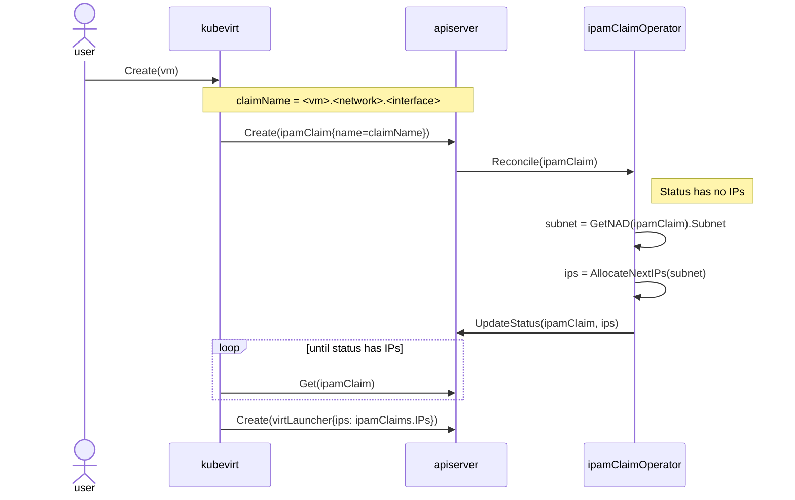

The flow for **stopping** the VM is quite simple - and similar to what we've
seen so far; the user issues a VM stop command, which will trigger the launcher
pod deletion. The persistent IP will **not** be deleted.

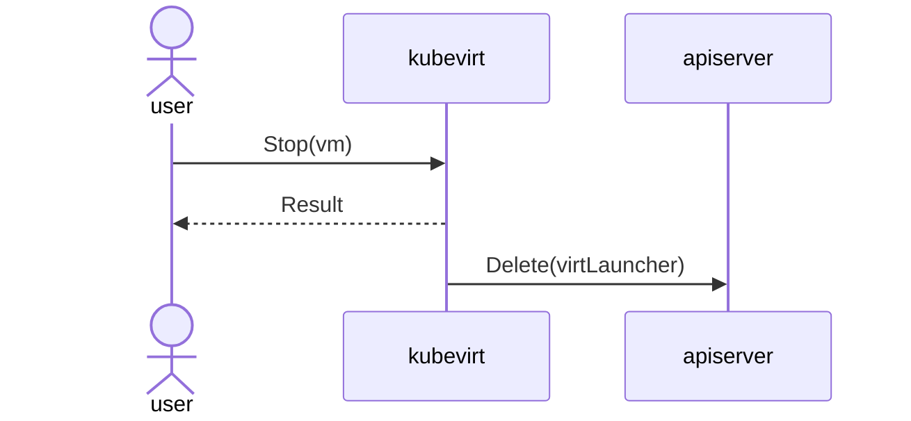

The flow for starting a stopped VM is again quite familiar; on a VM start event
KubeVirt realizes there's already a persistent IP allocation for its interface,
and will template the pod with it.

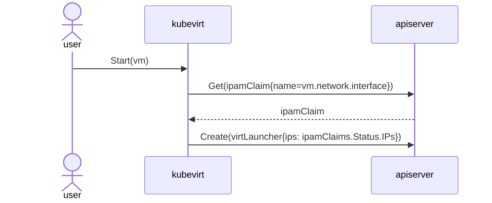

The flow for deleting a VM is similar to what we've seen so far; the Kubernetes
garbage collector is the entity responsible for deleting the persistent IP
allocation.

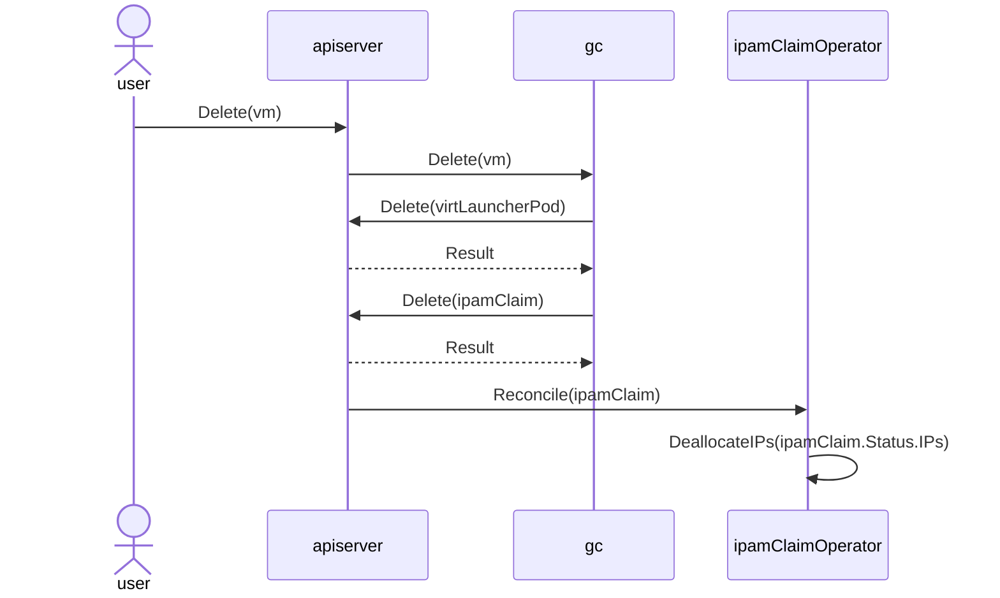

#### OVN-Kubernetes
OVN-Kubernetes changes would be pretty minimal: it already supports setting
static IP addresses via `NetworkSelectionElements`, but **only** when the
subnet parameter is omitted. We would need to change that, allowing
OVN-Kubernetes to honor IP requests from their pools.

#### New IPAM controller
This IPAM controller would need to behave as the *real* IPAM component; once it
sees an `IPAMClaim` request, it would need to generate a new IP for the
requesting pod, and update the `IPAMClaim` with it.

High availability would be required, meaning this extra component would need to
be a deployment of at least 2 pods (active / backup), to ensure VMs with
persistent IPs could be serviced even if one of the IPAM claim controllers
crashes.

#### Advantages of this alternative

The OVN-Kubernetes existing IPAM solution would only require a minor tweak: we
would need to allow static IP requests on NADs with a defined subnet attribute.

This solution would be generic: other workloads interested in this feature
would just have to create the CR, and wait until an IP is reported in its
status, then template the pod accordingly.

Also, the API on how to use the persistent IPs feature would be very clean: the
client interested in having persistent IPs for their workloads simply
provisions the `IPAMClaim` objects, the IPAM CNI updates their status
sub-resource with the chosen addresses, and the client controller would then
template the pod featuring the IP request in the pod's network selection
elements.

#### Disadvantages of this alternative

- KubeVirt would have to "track" a new CRD.
- KubeVirt memory footprint would increase
- Reinventing the IPAM wheel
- Productifying a new IPAM solution takes time
- Shipping / release engineering a new component
- We're basically implementing IPAM outside CNI. Clunky flow.

#### Mitigation of the alternative's drawbacks

Instead of having a separate controller, the functionality described above
could be shipped in OVN-Kubernetes, as a separate flow. This would remove most
of the disadvantages of the alternative.

This approach would still have one inconvenient - it would take longer to
create a VM, since the virt-controller would first need to wait for the IPAM
plugin to notify the persistent IP allocation, and only then would be able to
template the pod.

#### Mitigation the added IP reporting time

If we move the wait until the persistent IP allocations from the workload
controller - e.g. KubeVirt - to the CNI, we would remove this added latency.

The workload controller (can even be the user ...) would create the required
`IPAMClaim`s for the VM's interfaces; it would then template the pod
instructing it which claims it requires. This mechanism is akin to what is
currently done for the network-attachment-definitions (i.e. the pods have
references to the NADs they want to consume).

The OVN-Kubernetes plugin would see the `IPAMClaim`s and act on them,
generating IP addresses for it, and updating their status.

A separate CNI flow would just retrieve all the `IPAMClaim`s for the pod being
created, and once all of them have the IPs reported, it would just configure
those IPs on the pod annotation, which would trickle down to the pod.

The information above is depicted in the sequence diagram below:
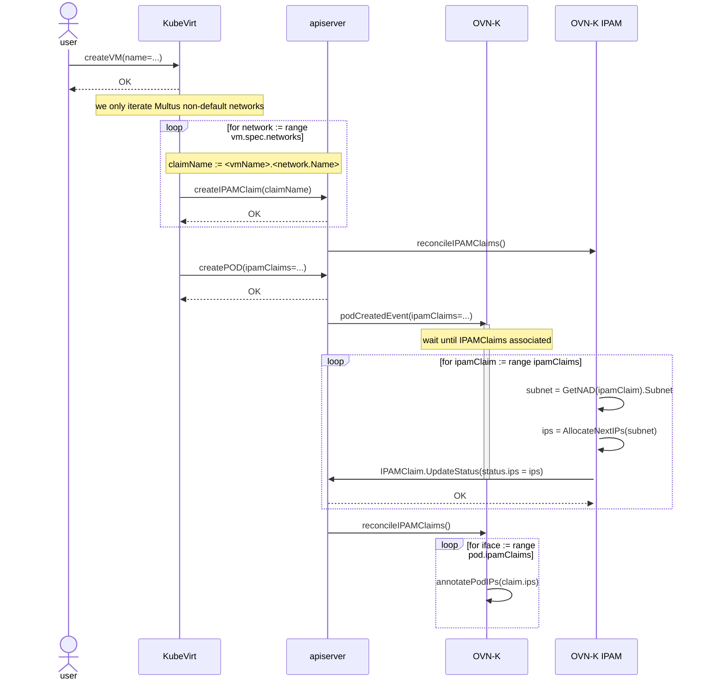
